‍

‍

‍

> **多线程**（高并发问题） ， **JUC**包 （核心其实是**AQS** ， 可以说出你使用的场景最好， 解决了什么问题 ，可以看看《Java并发编程》这本书，还有就是BlockQueue） ， **网络IO编程**（核心是NIO吧， 其他的比如 OIO, AIO 我感觉没必要 ， 有次问我Java的NIO网络编程的BUG是啥，如何解决）。

‍

‍

# 概念

‍

## 零碎

‍

### 你怎么理解多线程的

1. 定义：多线程是指从软件或者硬件上实现多个线程并发执行的技术。具有多线程能力的计算机因有硬件支持而能够在同一时间执行多于一个线程，进而提升整体处理性能。
2. 存在的原因：因为单线程处理能力低。打个比方，一个人去搬砖与几个人去搬砖，一个人只能同时搬一车，但是几个人可以同时一起搬多个车。
3. 实现：在Java里如何实现线程，Thread、Runnable、Callable。
4. 问题：线程可以获得更大的吞吐量，但是开销很大，线程栈空间的大小、切换线程需要的时间，所以用到线程池进行重复利用，当线程使用完毕之后就放回线程池，避免创建与销毁的开销。

‍

‍

### 什么是线程安全，如何实现

线程安全是指在多线程环境下，多个线程同时访问和修改共享资源时，能够保证数据的一致性和正确性

* **同步块**
* **显式锁（Lock）**
* **线程安全的集合类**
* **原子变量**

1. **使用同步块（synchronized）** ：

    * 通过在方法或代码块上加`synchronized`​关键字，确保同一时间只有一个线程可以执行该代码块。

```java
public class Counter {
    private int count = 0;

    public synchronized void increment() {
        count++;
    }

    public synchronized int getCount() {
        return count;
    }
}
```

‍

2. **使用显式锁（Lock）** ：

    * 使用`java.util.concurrent.locks.Lock`​接口及其实现类（如`ReentrantLock`​）来显式地控制对共享资源的访问。

```java
import java.util.concurrent.locks.Lock;
import java.util.concurrent.locks.ReentrantLock;

public class Counter {
    private int count = 0;
    private final Lock lock = new ReentrantLock();

    public void increment() {
        lock.lock();
        try {
            count++;
        } finally {
            lock.unlock();
        }
    }

    public int getCount() {
        lock.lock();
        try {
            return count;
        } finally {
            lock.unlock();
        }
    }
}
```

‍

3. **使用线程安全的集合类**：

    * 使用`java.util.concurrent`​包中的线程安全集合类，如`ConcurrentHashMap`​、`CopyOnWriteArrayList`​���。

```java
import java.util.concurrent.ConcurrentHashMap;
import java.util.Map;

public class ThreadSafeMap {
    private final Map<String, String> map = new ConcurrentHashMap<>();

    public void put(String key, String value) {
        map.put(key, value);
    }

    public String get(String key) {
        return map.get(key);
    }
}
```

‍

4. **使用原子变量**：

    * 使用`java.util.concurrent.atomic`​包中的原子变量类，如`AtomicInteger`​、`AtomicLong`​等，来保证操作的原子性。

```java
import java.util.concurrent.atomic.AtomicInteger;

public class Counter {
    private final AtomicInteger count = new AtomicInteger(0);

    public void increment() {
        count.incrementAndGet();
    }

    public int getCount() {
        return count.get();
    }
}
```

这些方法可以帮助确保在多线程环境下访问和修改共享资源时的数据一致性和正确性。

‍

‍

### 阻塞队列有哪些？

阻塞队列（BlockingQueue）是Java中的一种线程安全的队列，用于在多线程环境下进行生产者-消费者模式

阻塞队列（BlockingQueue）是一个支持两个附加操作的队列，这两个附加操作是：

* 当队列为空时，获取元素的操作将会等待队列变为非空；
* 当队列为满时，存储元素的操作将会等待队列有空闲位置。

‍

以下是一些常见的阻塞队列：

1. **ArrayBlockingQueue**：一个由数组支持的有界阻塞队列。
2. **LinkedBlockingQueue**：一个由链表结构组成的有界阻塞队列。
3. **PriorityBlockingQueue**：一个支持优先级排序的无界阻塞队列。
4. **DelayQueue**：一个使用优先级队列实现的无界阻塞队列，只有在延迟期满时才能从中提取元素。
5. **SynchronousQueue**：一个不存储元素的阻塞队列，每一个 put 操作必须等待一个 take 操作，反之亦然。
6. **LinkedTransferQueue**：一个由链表结构组成的无界阻塞队列，支持生产者将元素直接传递给消费者。

生产者线程不断向队列中添加元素，而消费者线程不断从队列中取出元素。`ArrayBlockingQueue`​ 确保了当队列满时，生产者线程会阻塞，直到队列有空闲位置；当队列为空时，消费者线程会阻塞，直到队列中有元素。

‍

‍

### 线程池怎样实现动态设置？

可以是依靠配置中心，可以是自己写动态配置路由

‍

‍

‍

‍

### 线程池三大核心参数是什么？3个核心线程满了，10个工作队列满了，此时来了第14个线程，交由急救线程去做，此时的第13个线程，谁去执行？    工作队列堆积了很多任务（卡顿太久），你如何改善服务？

‍

线程池的三大核心参数是：

1. **核心线程数（corePoolSize）** ：线程池中保持的最小线程数，即使这些线程处于空闲状态。
2. **最大线程数（maximumPoolSize）** ：线程池中允许的最大线程数。
3. **工作队列（workQueue）** ：用于保存等待执行的任务的队列。

‍

当核心线程数和工作队列都满了时，新的任务会交由急救线程（即非核心线程）去执行。如果急救线程也满了，则会根据拒绝策略来处理新任务。

‍

### 第13个线程的执行情况

在你描述的情况下，第13个线程会被拒绝策略处理。常见的拒绝策略有....

‍

### 改善服务的方法

1. **增加核心线程数和最大线程数**：提高线程池的处理能力。
2. **优化任务执行时间**：减少每个任务的执行时间，提升整体处理效率。
3. **使用更高效的工作队列**：选择合适的工作队列类型，如 `LinkedBlockingQueue`​ 或 `SynchronousQueue`​。
4. **分布式处理**：将任务分发到多个服务实例，减轻单个实例的压力。

‍

### 一个线程如果两次调用start方法会怎么样?

在 Java 中，一个线程对象只能调用一次 `start`​ 方法。

抛出 `IllegalThreadStateException`​ 异常。

‍

### 单核cpu，多线程下volatile关键字还有用吗

在单核 CPU 上，多线程环境中使用 `volatile`​ 关键字仍然有用。`volatile`​ 关键字的作用是确保变量的可见性，即当一个线程修改了 `volatile`​ 变量的值，其他线程能够立即看到这个变化。

即使在单核 CPU 上，线程之间的切换仍然会发生，`volatile`​ 关键字可以确保线程切换时变量的最新值被正确读取。`volatile`​ 关键字不会解决线程间的原子性问题，但它可以确保变量的可见性。

‍

‍

### 高并发环境下，设计线程池参数时是怎么考虑的?

在高并发环境下设计线程池参数时，需要考虑以下几个因素：

1. **任务类型**：确定任务是CPU密集型还是I/O密集型。CPU密集型任务需要较少的线程，而I/O密集型任务需要更多的线程。
2. **CPU核心数**：根据CPU核心数来设置线程池的核心线程数。对于CPU密集型任务，线程数可以设置为CPU核心数+1。对于I/O密集型任务，线程数可以设置为2倍的CPU核心数。
3. **任务队列**：选择合适的任务队列类型。常用的任务队列有`ArrayBlockingQueue`​、`LinkedBlockingQueue`​、`SynchronousQueue`​等。`ArrayBlockingQueue`​和`LinkedBlockingQueue`​适用于大多数场景，而`SynchronousQueue`​适用于任务提交速度快于任务处理速度的场景。
4. **线程池大小**：设置合适的核心线程数和最大线程数。核心线程数是线程池中始终保持活动的线程数，最大线程数是线程池中允许的最大线程数。
5. **线程存活时间**：设置线程的存活时间，当线程池中的线程数超过核心线程数时，多余的线程在空闲时间超过存活时间后会被终止。
6. **拒绝策略**：设置任务队列满时的拒绝策略。常用的拒绝策略有`AbortPolicy`​、`CallerRunsPolicy`​、`DiscardPolicy`​和`DiscardOldestPolicy`​。

以下是一个示例，展示如何配置线程池参数：

```java
import java.util.concurrent.*;

public class ThreadPoolConfig {
    public static void main(String[] args) {
        int coreCount = Runtime.getRuntime().availableProcessors();
        int corePoolSize = coreCount + 1; // For CPU-intensive tasks
        int maximumPoolSize = coreCount * 2; // For I/O-intensive tasks
        long keepAliveTime = 60L;
        TimeUnit unit = TimeUnit.SECONDS;
        BlockingQueue<Runnable> workQueue = new LinkedBlockingQueue<>(100);
        ThreadFactory threadFactory = Executors.defaultThreadFactory();
        RejectedExecutionHandler handler = new ThreadPoolExecutor.CallerRunsPolicy();

        ThreadPoolExecutor threadPool = new ThreadPoolExecutor(
                corePoolSize,
                maximumPoolSize,
                keepAliveTime,
                unit,
                workQueue,
                threadFactory,
                handler
        );

        // Submit tasks to the thread pool
        for (int i = 0; i < 10; i++) {
            threadPool.execute(() -> {
                System.out.println("Executing task by " + Thread.currentThread().getName());
                try {
                    Thread.sleep(1000); // Simulate task execution
                } catch (InterruptedException e) {
                    Thread.currentThread().interrupt();
                }
            });
        }

        threadPool.shutdown();
    }
}
```

在这个示例中，线程池的核心线程数设置为`coreCount + 1`​，最大线程数设置为`coreCount * 2`​，任务队列使用`LinkedBlockingQueue`​，拒绝策略使用`CallerRunsPolicy`​。根据具体的任务类型和系统资源，可以调整这些参数以获得最佳性能。

‍

### 线程池为啥io密集型是2核心数？

通常建议设置为2倍的CPU核心数, 也可以是n核心数，n是平均io耗时和平均计算耗时的比例。

1. **I/O等待时间**：I/O密集型任务在执行过程中会有大量时间处于等待I/O操作完成的状态（如等待磁盘读写、网络请求等）。在这些等待时间内，CPU是空闲的，可以用于执行其他任务。
2. **提高CPU利用率**：通过设置线程数为2倍的CPU核心数，可以在一个线程等待I/O操作时，另一个线程可以利用CPU执行其他任务，从而提高CPU的利用率。
3. **并发处理**：更多的线程可以同时处理多个I/O操作，提高系统的并发处理能力和吞吐量。

‍

‍

### wait free 的算法是什么

它保证了每一次调用都可以在有限的步骤内结束。避免出现进程饥饿的情况。

‍

‍

### 竞态条件举个例子

当两个线程/进程竞争同一资源时，如果对资源的**访问顺序**敏感，就称存在竞态条件。

```text
COUNTER = 1
def add():
    COUNTER = COUNTER + 1
```

‍

‍

‍

‍

‍

‍

### 什么情况下会进程饥饿？

进程长时间没有分配到自己所需要的**资源**

‍

原因

1. 发生死锁
2. 调度算法有问题
3. 就是没资源了(其他问题)

‍

‍

‍

### 什么是上下文切换?

多线程编程中一般线程的个数都大于 CPU 核心的个数，而一个 CPU 核心在任意时刻只能被一个线程使用，为了让这些线程都能得到有效执行，CPU 采取的策略是为每个线程分配时间片并轮转的形式。当一个线程的时间片用完的时候就会重新处于就绪状态让给其他线程使用，这个过程就属于一次上下文切换。

概括来说就是：当前任务在执行完 CPU 时间片切换到另一个任务之前会先保存自己的状态，以便下次再切换回这个任务时，可以再加载这个任务的状态。**任务从保存到再加载的过程就是一次上下文切换**。

‍

‍

‍

‍

### 写一个会导致死锁的程序

可以直接嵌套两层synchronized

‍

1. 获得锁后不释放，其他线程一直拿不到锁
2. 解决：不要嵌套获得多个锁

```java

    static Object lockA = new Object();
    static Object lockB = new Object();
    public static void main(String[] args) {

        new Thread(new Runnable() {

            @Override
            public void run() {
                System.out.println(Thread.currentThread() + " 尝试获取锁A");
                synchronized (lockA){

                    System.out.println(Thread.currentThread() + " 获取到了锁A");

                    try {
                        Thread.sleep(100);
                    } catch (InterruptedException e) {
                        throw new RuntimeException(e);
                    }
                    System.out.println(Thread.currentThread() + " 尝试获取锁B");
                    synchronized (lockB){
                        System.out.println(Thread.currentThread() + " 获取到了锁B");
                    }
                }
            }
        }).start();


        new Thread(new Runnable() {
            @Override
            public void run() {


                System.out.println(Thread.currentThread() + " 尝试获取锁B");
                synchronized (lockB){

                    System.out.println(Thread.currentThread() + " 获取到了锁B");

                    try {
                        Thread.sleep(100);
                    } catch (InterruptedException e) {
                        throw new RuntimeException(e);
                    }

                    System.out.println(Thread.currentThread() + " 尝试获取锁A");
                    synchronized (lockA){
                        System.out.println(Thread.currentThread() + " 获取到了锁A");
                    }
                }
            }
        }).start();
    }
```

‍

‍

‍

### 讲讲juc包（vector、hashtable、semaphore、countdownlatch、copyonwritearraylist等等都介绍一遍）

​`java.util.concurrent`​ (简称 `juc`​ 包) 提供了一组线程安全的集合类和并发工具，帮助开发者更容易地编写高效的多线程程序。以下是一些常用的类和它们的简要介绍：

#### Vector

​`Vector`​ 是一个同步的动态数组，类似于 `ArrayList`​，但它是线程安全的。由于同步开销较大，通常建议使用 `ArrayList`​，除非需要线程安全。

```java
Vector<String> vector = new Vector<>();
vector.add("Element");
```

#### Hashtable

​`Hashtable`​ 是一个线程安全的键值对集合，类似于 `HashMap`​，但它是同步的。由于同步开销较大，通常建议使用 `ConcurrentHashMap`​，除非需要线程安全。

```java
Hashtable<String, String> hashtable = new Hashtable<>();
hashtable.put("key", "value");
```

‍

#### Semaphore

​`Semaphore`​ 是一个计数信号量，用于控制对资源的访问。它可以用于限制同时访问某些资源的线程数量。

```java
Semaphore semaphore = new Semaphore(1);
semaphore.acquire();
try {
    // 访问资源
} finally {
    semaphore.release();
}
```

‍

#### CountDownLatch

​`CountDownLatch`​ 是一个同步辅助类，允许一个或多个线程等待，直到在其他线程中执行的一组操作完成。

```java
CountDownLatch latch = new CountDownLatch(3);
latch.countDown();
latch.await();
```

‍

#### CopyOnWriteArrayList

​`CopyOnWriteArrayList`​ 是一个线程安全的变体，适用于读多写少的场景。每次修改时都会创建一个新的数组副本。

```java
CopyOnWriteArrayList<String> list = new CopyOnWriteArrayList<>();
list.add("Element");
```

这些类和工具在多线程编程中非常有用，帮助开发者更容易地管理并发操作。

‍

‍

### runnable和callable有什么区别

​`Runnable`​和`Callable`​都是用于并发编程的接口，但它们有一些关键区别：

‍

1. **返回值**：

    * ​`Runnable`​接口的`run`​方法不返回任何值。
    * ​`Callable`​接口的`call`​方法返回一个值。
2. **异常处理**：

    * ​`Runnable`​接口的`run`​方法不能抛出受检异常。
    * ​`Callable`​接口的`call`​方法可以抛出受检异常。
3. **使用场景**：

    * ​`Runnable`​通常用于不需要返回结果或处理异常的简单任务。
    * ​`Callable`​适用于需要返回结果或可能抛出异常的任务。

在实际使用中，`Callable`​通常与`Future`​或`ExecutorService`​一起使用，以便获取任务的结果

‍

‍

### 线程池如果不用阻塞队列，就用arrayList，如何控制核心线程阻塞？

要在不使用阻塞队列的情况下控制核心线程阻塞，可以使用`ReentrantLock`​和`Condition`​来实现线程的等待和通知机制。以下是一个示例，展示如何使用`ArrayList`​和`ReentrantLock`​来实现一个简单的线程池：

1. 创建一个自定义的线程池类。
2. 使用`ArrayList`​来存储任务。
3. 使用`ReentrantLock`​和`Condition`​来控制线程的等待和通知。

```java
public class CustomThreadPool {
    private final List<Runnable> taskQueue = new ArrayList<>();
    private final List<Worker> workers;
    private final Lock lock = new ReentrantLock();
    private final Condition condition = lock.newCondition();
    private volatile boolean isShutdown = false;

    public CustomThreadPool(int corePoolSize) {
        workers = new ArrayList<>(corePoolSize);
        for (int i = 0; i < corePoolSize; i++) {
            Worker worker = new Worker();
            workers.add(worker);
            new Thread(worker).start();
        }
    }

    public void execute(Runnable task) {
        lock.lock();
        try {
            if (isShutdown) {
                throw new IllegalStateException("ThreadPool is shutdown");
            }
            taskQueue.add(task);
            condition.signal();
        } finally {
            lock.unlock();
        }
    }

    public void shutdown() {
        lock.lock();
        try {
            isShutdown = true;
            condition.signalAll();
        } finally {
            lock.unlock();
        }
    }

    private class Worker implements Runnable {
        @Override
        public void run() {
            while (true) {
                Runnable task;
                lock.lock();
                try {
                    while (taskQueue.isEmpty() && !isShutdown) {
                        condition.await();
                    }
                    if (isShutdown && taskQueue.isEmpty()) {
                        break;
                    }
                    task = taskQueue.remove(0);
                } catch (InterruptedException e) {
                    Thread.currentThread().interrupt();
                    break;
                } finally {
                    lock.unlock();
                }
                try {
                    task.run();
                } catch (RuntimeException e) {
                    // Handle task exception
                }
            }
        }
    }

    public static void main(String[] args) {
        CustomThreadPool threadPool = new CustomThreadPool(3);
        for (int i = 0; i < 10; i++) {
            final int taskNumber = i;
            threadPool.execute(() -> {
                System.out.println("Executing task " + taskNumber);
                try {
                    Thread.sleep(1000);
                } catch (InterruptedException e) {
                    Thread.currentThread().interrupt();
                }
            });
        }
        threadPool.shutdown();
    }
}
```

在这个示例中，`CustomThreadPool`​类使用`ArrayList`​来存储任务，并使用`ReentrantLock`​和`Condition`​来控制线程的等待和通知。核心线程在没有任务时会阻塞，直到有新任务被添加到任务队列中。

‍

‍

### 如果创建协程的线程死掉，那协程也会跟着死掉吗

在大多数编程语言和框架中，如果创建协程的线程终止，那么协程也会终止。这是因为协程依赖于其创建的线程的执行环境。一旦线程终止，协程的执行环境也会消失，从而导致协程无法继续执行。

‍

## 为什么要使用多线程呢?

‍

先从总体上来说：

* **从计算机底层来说：**  线程可以比作是轻量级的进程，是程序执行的最小单位, 线程间的切换和调度的成本远远小于进程。另外，多核 CPU 时代意味着多个线程可以同时运行，这减少了线程上下文切换的开销。
* **从当代互联网发展趋势来说：**  现在的系统动不动就要求百万级甚至千万级的并发量，而多线程并发编程正是开发高并发系统的基础，利用好多线程机制可以大大提高系统整体的并发能力以及性能。

‍

再深入到计算机底层来探讨：

* **单核时代：**  在单核时代多线程主要是为了提高 CPU 和 IO 设备的综合利用率。举个例子：当只有一个线程的时候会导致 CPU 计算时，IO 设备空闲；进行 IO 操作时，CPU 空闲。我们可以简单地说这两者的利用率目前都是 50%左右。但是当有两个线程的时候就不一样了，当一个线程执行 CPU 计算时，另外一个线程可以进行 IO 操作，这样两个的利用率就可以在理想情况下达到 100%了。
* **多核时代:**  多核时代多线程主要是为了提高 CPU 利用率。举个例子：假如我们要计算一个复杂的任务，我们只用一个线程的话，CPU 只会一个 CPU 核心被利用到，而创建多个线程就可以让多个 CPU 核心被利用到，这样就提高了 CPU 的利用率。

‍

‍

### 线程池的四个拒绝策略与其对应的场景。

**Abort,**  **CallerRuns, Discard, DiscardOldest**

1. **AbortPolicy**：

    * **描述**：直接抛出 `RejectedExecutionException`​ 异常，阻止系统正常工作。
    * **适用场景**：适用于对任务提交失败有明确处理机制的场景，通常用于开发和测试环境。
2. **CallerRunsPolicy**：

    * **描述**：由调用线程处理该任务。
    * **适用场景**：适用于不希望丢弃任务且能接受任务执行时间延长的场景，通常用于对任务执行时间要求不严格的场景。
3. **DiscardPolicy**：

    * **描述**：直接丢弃任务，不抛出异常。
    * **适用场景**：适用于允许丢弃任务且不需要处理任务丢弃情况的场景，通常用于对任务丢失不敏感的场景。
4. **DiscardOldestPolicy**：

    * **描述**：丢弃队列中最旧的任务，然后尝试重新提交被拒绝的任务。
    * **适用场景**：适用于希望优先处理新任务且能接受丢弃旧任务的场景，通常用于对任务时效性要求较高的场景。

‍

以下是一个示例代码，展示如何配置线程池及其拒绝策略：

```java
    public static void main(String[] args) {
        // 创建线程池
        ThreadPoolExecutor executor = new ThreadPoolExecutor(
                2, 4, 60, TimeUnit.SECONDS,
                new LinkedBlockingQueue<>(2),
                new ThreadPoolExecutor.AbortPolicy() // 可以替换为其他拒绝策略
        );
}
```

‍

‍

## 线程优先级

‍

在 Thread 源码中和线程优先级相关的属性有 3 个：

```java
//线程可以拥有的最小优先级
public final static int MIN_PRIORITY =1；
//线程默认优先级
public final static int NORM_PRIORITY =5；
//线程可以拥有的最大优先级
public final static int MAX_PRIORITY =10
```

线程的优先级可以理解为线程抢占CPU时间片的概率，优先级越高的线程优先执行的概率就越大，但并不能保证优先级高的线程一定先执行。  
在程序中我们可以通过**Thread.setPriority()** 来设置优先级，**setPriority()** 源码如下

```java
public final void setPriority(int newPriority) {
        ThreadGroup g;
        checkAccess();
    	//先验证优先级的合理性
        if (newPriority > MAX_PRIORITY || newPriority < MIN_PRIORITY) {
            throw new IllegalArgumentException();
        }
        if((g = getThreadGroup()) != null) {
            //优先级如果超过线程组的最高优先级，则把优先级设置为线程组的最高优先级
            if (newPriority > g.getMaxPriority()) {
                newPriority = g.getMaxPriority();
            }
            setPriority0(priority = newPriority);
        }
    }
```

‍

‍

‍

‍

‍

‍

‍

## 线程的状态

线程的状态在 JDK 1.5 之后以枚举的方式被定义在 Thread 的源码中，它总共包含以下 6 个状态：

‍

* **NEW**，新建状态，线程被创建出来，但尚未启动时的状态；
* **RUNNABLE**，就绪状态，表示可以运行的线程状态，它可能正在运行，或者是排队等待CPU分配给它资源；
* **BLOCKED**，阻塞等待锁的线程状态，表示处于阻塞状态的线程正在等待监视器锁，比如等待执行synchronized代码块或者使用synchronized标记的方法；
* **WAITING**，等待状态，一个处于等待状态的线程正在等待另一个线程执行某个特定的动作，比如，一个线程调用了`Object.wait()`​方法，那它就在等待另一个线程调用`Object.notify()`​或`Object.notifyAll()`​方法；
* **TIMED_WAITING**，计时等待状态，和等待状态(`WAITING`​)类似，它只是多了超时时间，比如调用了有超时时间设置的方法`Object.wait(longtimeout)`​和`Thread.join(longtimeout)`​等这些方法时，它才会进入此状态；
* **TERMINATED**，终止状态，表示线程已经执行完成。

线程工作模式是，首先先要创建线程并指定线程需要执行的业务方法，然后再调用线程的`start()`​方法，此时线程就从**NEW(新建)** 状态变成了**RUNNABLE(就绪)** 状态，此时线程会判断要执行的方法中有没有**synchronized**同步代码块，如果有并且其他线程也在使用此锁，那么线程就会变为**BLOCKED(阻塞等待)** 状态，当其他线程使用完此锁之后，线程会继续执行剩余的方法。

当遇到**Object.wait()或Thread.join()方法时，线程会变为WAITING(等待状态)状态，如果是带了超时时间的等待方法，那么线程会进入TIMED_WAITING(计时等待)状态，当有其他线程执行了notify()或notifyAll()** 方法之后，线程被唤醒继续执行剩余的业务方法，直到方法执行完成为止，此时整个线程的流程就执行完了

‍

‍

### BLOCKED 和 WAITING 的区别

虽然**BLOCKED**和**WAITING**都有等待的含义，但二者有着本质的区别，首先它们状态形成的调用方法不同，其次**BLOCKED**可以理解为当前线程还处于活跃状态，只是在阻塞等待其他线程使用完某个锁资源；而**WAITING**则是因为自身调用了**Object.wait()** 或着是**Thread.join()** 又或者是**LockSupport.park()** 而进入等待状态，只能等待其他线程执行某个特定的动作才能被继续唤醒，比如当线程因为调用了**Object.wait()** 而进入**WAITING**状态之后，则需要等待另一个线程执行**Object.notify()或Object.notifyAll()** 才能被唤醒。

‍

‍

‍

## 线程进程协程关系

‍

**进程：**

定义：进程是操作系统分配资源和调度的基本单位，每个进程都有独立的内存空间。  
特点：进程之间相互独立，进程切换开销较大。  
使用场景：适用于需要隔离的任务，如不同的应用程序。

‍

**线程：**

定义：线程是进程中的一个执行单元，一个进程可以包含多个线程，线程共享进程的内存空间。  
特点：线程之间可以共享数据，线程切换开销较小，但需要同步机制来避免数据竞争。  
使用场景：适用于需要并发执行的任务，如多线程服务器。

‍

**协程：**

定义：协程是一种比线程更轻量级的执行单元，协程由程序自身调度，而不是由操作系统调度。  
特点：协程切换开销极小，可以在一个线程内实现并发执行，但不适合多核并行。  
使用场景：适用于 I/O 密集型任务，如异步编程和高并发网络服务器。

‍

进程  
 ├── 线程1  
 │    ├── 协程1  
 │    └── 协程2  
 └── 线程2  
      ├── 协程3  
      └── 协程4

‍

‍

### 线程与进程对比

关系, 区别及优缺点

一个进程中可以有多个线程，多个线程共享进程的**堆**和**方法区 (JDK1.8 之后的元空间)** 资源，但是每个线程有自己的**程序计数器**、**虚拟机栈** 和 **本地方法栈**。

**总结：**  **线程是进程划分成的更小的运行单位。线程和进程最大的不同在于基本上各进程是独立的，而各线程则不一定，因为同一进程中的线程极有可能会相互影响。线程执行开销小，但不利于资源的管理和保护；而进程正相反。**

‍

### 协程是什么

协程是一个**用户态的线程**，用户在**堆**上模拟出协程的栈空间。

当需要进行协程上下文切换的时候，主线程只需要交换栈空间和恢复协程的一些相关的寄存器的状态，就可以实现上下文切换。没有了**从用户态转换到内核态**的切换成本，协程的执行也就更加高效。

‍

## 线程的上下文切换过程

线程有自己的寄存器和栈。当上下文切换的时候，正在运行的线程会将寄存器的状态保存到 TCB（Thread Control Block）里（进程是 PCB，Process Control Block），然后恢复另一个线程的上下文。

和进程的区别是，线程只需要切换处理机执行的上下文，不会改变地址空间。这意味着：

1. 不需要重新加载页表，切换开销少，提高效率
2. 多个线程共享地址空间，有利有弊

‍

‍

## 使用线程的优缺点

优点：

* 提高效率：切换开销小
* 通信方便，共享内存；进程必须通过进程间通信 [IPC](https://imageslr.com/2020/02/26/ipc)

缺点：

* 一个线程出错，操作系统会结束整个进程，不够健壮；而多进程就没有这个问题
* 同一进程中的多个线程共享内存，会有并发问题

‍

‍

## 同一进程中的线程共享与独占的资源

‍

### 共享资源

* 内存空间

  * 代码
  * 公共数据（全局变量、静态变量）
  * 堆
* 文件描述符
* 信号处理器
* 进程 ID / 进程组 ID
* …

‍

### 独占资源

(以及为什么需要独占)

* 线程 ID：在本进程中唯一，进程用来标识此线程
* 一组寄存器的值
* 栈：每个线程中的函数调用过程是独立的，因此需要有独立的栈
* 错误返回码：系统调用或库函数发生错误时，会设置全局变量 `errno`​，各个线程的错误返回码应该是独立的
* 信号屏蔽码：每个线程所感兴趣的信号不同，所以线程的信号屏蔽码应该由线程自己管理；但每个线程都共享本进程的信号处理器

‍

‍

## 可重入锁的底层实现 AQS

‍

可重入锁（`ReentrantLock`​）的底层实现主要依赖于 `AbstractQueuedSynchronizer`​（AQS）

​`ReentrantLock`​ 是一种独占锁，允许同一个线程多次获取同一把锁而不会造成死锁。这是通过维护一个计数器和一个持有锁的线程来实现的。

‍

### 组件

* **AQS（AbstractQueuedSynchronizer）** ：这是一个抽象类，提供了一个框架来实现依赖于队列的同步器。`ReentrantLock`​ 通过继承 AQS 来实现其同步机制。
* **状态变量（state）** ：AQS 使用一个 `int`​ 类型的状态变量来表示锁的状态。0 表示未锁定，正数表示锁定次数。
* **独占线程（exclusiveOwnerThread）** ：表示当前持有锁的线程。

‍

‍

### 原理

‍

#### 获取锁

当一个线程尝试获取锁时，`ReentrantLock`​ 会调用 AQS 的 `acquire`​ 方法：

1. **尝试获取锁**：调用 `tryAcquire`​ 方法。如果状态变量为 0，则表示锁未被占用，当前线程可以获取锁，并将状态变量设置为 1，同时记录持有锁的线程。如果状态变量不为 0，则检查当前线程是否为持有锁的线程，如果是，则增加状态变量的值。
2. **加入等待队列**：如果获取锁失败，线程会被加入到 AQS 的等待队列中，并进入阻塞状态，直到锁被释放。

‍

#### 释放锁

当一个线程释放锁时，`ReentrantLock`​ 会调用 AQS 的 `release`​ 方法：

1. **减少状态变量**：调用 `tryRelease`​ 方法，减少状态变量的值。如果状态变量为 0，则表示锁已完全释放。
2. **唤醒等待线程**：如果锁被完全释放，AQS 会唤醒等待队列中的下一个线程，使其尝试获取锁。

‍

### 可重入性

可重入性是通过在 `tryAcquire`​ 方法中检查当前线程是否为持有锁的线程来实现的。如果是，则增加状态变量的值，而不是阻塞线程。

‍

‍

## 两阶段锁协议

两阶段锁协议（2PL）是一种能够保证事务可串行化的协议，它将事务的获取锁和释放锁划分成了增长（Growing）和缩减（Shrinking）两个不同的阶段

‍

在增长阶段，一个事务可以获得锁但是不能释放锁；而在缩减阶段事务只可以释放锁，并不能获得新的锁，如果只看 2PL 的定义，那么到这里就已经介绍完了，但是它还有两个变种：

1. **Strict 2PL**：事务持有的**互斥**锁必须在提交后再释放；
2. **Rigorous 2PL**：事务持有的**所有**锁必须在提交后释放；

锁的使用能够为我们解决不同事务之间由于并发执行造成的问题，但是两阶段锁的使用却引入了另一个严重的问题，死锁

‍

‍

## synchronized锁升级过程

以及轻量级锁自旋多少次会升级为重量级锁

‍

在 Java 中，`synchronized`​ 锁的升级过程可以分为以下几个阶段：

1. **偏向锁（Biased Locking）** ：

    * 当一个线程第一次获取锁时，锁会偏向该线程，避免了后续的加锁和解锁操作。
    * 偏向锁的目的是在**没有竞争的情况下，减少不必要的同步开销**。
    * 如果在偏向锁状态下，另一个线程尝试获取锁，偏向锁会被撤销。
2. **轻量级锁（Lightweight Locking）** ：

    * 当偏向锁**被撤销**后，锁会升级为轻量级锁。
    * 轻量级锁使用 CAS（Compare-And-Swap）操作来尝试获取锁。
    * 如果一个线程成功获取锁，进入临界区；如果失败，线程会进行自旋尝试获取锁。
3. **重量级锁（Heavyweight Locking）** ：

    * 当轻量级锁自旋一定次数后仍未成功获取锁，锁会升级为重量级锁。
    * 重量级锁使用操作系统的互斥量（mutex）来实现，涉及线程的挂起和唤醒，开销较大。
    * 线程在重量级锁状态下会被阻塞，直到获取到锁。

轻量级锁的自旋次数由 JVM 参数 `-XX:PreBlockSpin`​ 控制，默认值通常是 10 次。也就是说，轻量级锁会自旋 10 次尝试获取锁，如果仍未成功，则升级为重量级锁。

‍

‍

总结：

* **偏向锁**：无竞争时，锁偏向于第一个获取锁的线程。
* **轻量级锁**：有竞争时，使用 CAS 操作进行自旋尝试获取锁。
* **重量级锁**：自旋次数超过阈值后，升级为重量级锁，使用操作系统的互斥量进行同步。

‍

‍

### 偏向锁概念

在 Java 中，锁偏向某个线程的意思是

当一个线程第一次获取锁时，锁会**记录这个线程的 ID**，并且在后续的加锁和解锁操作中，如果还是这个线程来获取锁，就不需要进行任何同步操作。这种机制被称为偏向锁（Biased Locking）

‍

具体来说

1. **第一次获取锁**：当一个线程第一次获取锁时，锁会偏向该线程，并记录该线程的 ID。
2. **后续获取锁**：如果同一个线程再次获取这个锁，由于锁已经偏向该线程，所以不需要进行任何额外的同步操作，直接进入临界区。
3. **偏向锁撤销**：如果在偏向锁状态下，另一个线程尝试获取锁，偏向锁会被撤销，锁会升级为轻量级锁或重量级锁。

目的是在没有竞争的情况下，减少不必要的同步开销，从而提高性能。

‍

‍

### 自旋

自旋尝试（Spin Attempt）是指在多线程编程中，当一个线程尝试获取锁但未能成功时，不立即进入阻塞状态，而是通过循环（自旋）不断地尝试获取锁。这样可以避免线程上下文切换的开销，提高性能。

具体来说，自旋尝试的过程如下：

1. **尝试获取锁**：线程使用原子操作（如 CAS，Compare-And-Swap）尝试获取锁。
2. **自旋等待**：如果获取锁失败，线程不会立即阻塞，而是进入一个循环，反复尝试获取锁。
3. **成功获取锁**：如果在自旋过程中成功获取锁，线程进入临界区执行任务。
4. **自旋次数限制**：自旋尝试的次数是有限的，如果超过一定次数仍未成功获取锁，线程会进入阻塞状态，等待锁的释放。

自旋尝试适用于锁竞争不激烈且持有锁时间较短的场景，可以减少线程阻塞和唤醒的开销，提高系统性能。

‍

CAS（Compare-And-Swap）操作通过比较内存中的值和预期值，如果相等则更新为新值，否则不更新

‍

‍

## `wait`​, `notify`​ 和 `sleep`​区别

​`wait`​, `notify`​ 和 `sleep`​ 是 Java 中用于线程同步和控制的方法

‍

1. ​**​`wait`​**​：

    * 属于 `Object`​ 类。
    * 使当前线程等待，直到另一个线程在同一对象上调用 `notify`​ 或 `notifyAll`​ 方法。
    * 必须在同步上下文中调用（即在同步块或同步方法内）。
    * 释放对象上的锁，以便其他线程可以获取它。
2. ​**​`notify`​**​：

    * 属于 `Object`​ 类。
    * 唤醒在该对象的监视器上等待的单个线程。
    * 必须在同步上下文中调用。
    * 不会立即释放锁；锁在同步块或同步方法完成后才会释放。
3. ​**​`sleep`​**​：

    * 属于 `Thread`​ 类。
    * 使当前线程休眠指定的时间。
    * 不会释放线程持有的任何锁。
    * 可以在**任何上下文中调用**（不需要同步）。

‍

‍

## 进程分配的资源都有哪些？

计算、存储、网络、IO、同步、系统等各种资源

‍

## 线程间通信有哪些方式？基佬佬

**互斥锁、读写锁、条件变量、自旋锁和信号量**，本质应该就是共享进程的内存，不过需要保证安全共享

‍

‍

## 那进程间通信方式呢？基佬佬

**管道、消息队列、共享内存、信号、信号量、socket** 等

‍

‍

‍

# 大块

‍

‍

‍

## 组件

‍

### ThreadLocal

主要解决的就是让**每个线程绑定自己的值**，可以将​ThreadLocal​类形象的比喻成存放数据的盒子，盒子中可以存储每个线程的私有数据。

创建了一个`ThreadLocal`​变量，那么访问这个变量的每个线程都会有这个变量的**本地副本**，这也是`ThreadLocal`​变量名的由来。他们可以使用 `get()`​ 和 `set()`​ 方法来获取默认值或将其值更改为当前线程所存的副本的值，从而避免了线程安全问题。

‍

#### 怎么让子线程共享threadlocal的值？

使用 ==InheritableThreadLocal== 来让子线程共享父线程的 ThreadLocal 值。InheritableThreadLocal 是 ThreadLocal 的一个子类，它允许子线程继承父线程的值。

```java
 private static final InheritableThreadLocal<String> threadLocal = new InheritableThreadLocal<>();
```

‍

### synchronized

* ​`synchronized`​ 关键字加到 `static`​ 静态方法和 `synchronized(class)`​ 代码块上都是是给 ==Class 类上锁==；
* ​`synchronized`​ 关键字加到**实例方法**上是给对象实例上锁；
* 尽量不要使用 `synchronized(String a)`​ 因为 JVM 中，字符串常量池具有缓存功能。

‍

‍

#### 构造方法可以用 synchronized 修饰么？

构造方法不能使用 synchronized 关键字修饰。不过，可以在构造方法内部使用 synchronized 代码块。

另外，==构造方法本身是线程安全的==，但如果在构造方法中涉及到**共享资源的操作**，就需要采取适当的同步措施来保证整个构造过程的线程安全。

‍

‍

#### synchronized 和 volatile 有什么区别？

​`synchronized`​ 关键字和 `volatile`​ 关键字是两个**互补**的存在，而不是对立的存在！

* ​`volatile`​ 关键字是线程同步的**轻量级**实现，所以 `volatile`​性能肯定比`synchronized`​关键字要好 。但是 `volatile`​ 关键字只能用于**变量**而 `synchronized`​ 关键字可以修饰方法以及代码块 。
* ​`volatile`​ 关键字能保证数据的可见性，但不能保证数据的原子性。`synchronized`​ 关键字两者都能保证。
* ​`volatile`​关键字主要用于解决变量在多个线程之间的可见性，而 `synchronized`​ 关键字解决的是多个线程之间访问资源的同步性。

‍

‍

### volatile

‍

#### volatile 可以保证原子性么？

​**​`volatile`​**​ **关键字能保证变量的可见性，但不能保证**​**==对变量的操作==**​**是原子性的。**

(含义: 每次操作都需要进行读取, 不要缓存)

利用 `synchronized`​、`Lock`​或者`AtomicInteger`​都可以

‍

‍

#### 特性

​`volatile`​ 关键字在 Java 中有两个主要特性：

1. **可见性**：当一个变量被声明为 `volatile`​ 时，所有线程在访问该变量时都会直接从主内存中读取，而不是从线程的本地缓存中读取。这确保了一个线程对 `volatile`​ 变量的修改对其他线程立即可见。
2. **防止指令重排序**：`volatile`​ 变量的**读写操作不会与其他内存操作一起被重排序**。具体来说，`volatile`​ 变量的写操作之前的所有操作不会被重排序到**写操作**之后，`volatile`​ 变量的读操作之后的所有操作不会被重排序到读操作之前。

‍

#### 防止指令重排序的原理

Java 内存模型（JMM）通过**内存屏障**（Memory Barriers）来实现对 `volatile`​ 变量的重排序限制。内存屏障是一种指令，用于确保在屏障之前的所有内存操作在屏障之后的内存操作之前完成。

* **写屏障（Store Barrier）** ：在写入 `volatile`​ 变量之前插入，确保在写入 `volatile`​ 变量之前的所有写操作都已完成。
* **读屏障（Load Barrier）** ：在读取 `volatile`​ 变量之后插入，确保在读取 `volatile`​ 变量之后的所有读操作都已完成。

通过这些内存屏障，JMM 确保了对 `volatile`​ 变量的读写操作不会与其他内存操作重排序，从而实现了 `volatile`​ 关键字的重排序防止特性。

‍

‍

‍

## 锁类型

‍

‍

日常中所说的“锁”都泛指单机锁，其分类有很多，大体可分为以下几类

* **悲观锁**，是数据对外界的修改采取保守策略，它认为线程很容易把数据修改掉，因此在整个数据被修改的过程中都会采取锁定状态，直到一个线程使用完，其他线程才可以继续使用，典型应用是 synchronized；
* **乐观锁**，和悲观锁的概念恰好相反，乐观锁认为一般情况下数据在修改时不会出现冲突，所以在数据访问之前不会加锁，只是在数据提交更改时，才会对数据进行检测，典型应用是 ReadWriteLock 读写锁；
* **可重入锁**，也叫递归锁，指的是同一个线程在外面的函数获取了锁之后，那么内层的函数也可以继续获得此锁，在 Java 语言中 ReentrantLock 和 synchronized 都是可重入锁；
* **独占锁和共享锁**，只能被单线程持有的锁叫做独占锁，可以被多线程持有的锁叫共享锁，独占锁指的是在任何时候最多只能有一个线程持有该锁，比如 ReentrantLock 就是独占锁；而 ReadWriteLock 读写锁允许同一时间内有多个线程进行读操作，它就属于共享锁。

‍

更详细的

* 公平锁/非公平锁
* 可重入锁
* 独享锁/共享锁
* 互斥锁/读写锁
* 乐观锁/悲观锁
* 分段锁
* 偏向锁/轻量级锁/重量级锁
* 自旋锁

‍

再细一些

* 公平锁/非公平锁

公平锁是指多个线程按照申请锁的顺序来获取锁  
ReentrantLock通过构造函数指定该锁是否是公平锁，默认是非公平锁。Synchronized是一种非公平锁

* 可重入锁

指在同一个线程在外层方法获取锁的时候，在进入内层方法会自动获取锁  
ReentrantLock, 他的名字就可以看出是一个可重入锁，其名字是Re entrant Lock重新进入锁  
Synchronized,也是一个可重入锁。可重入锁的一个好处是可一定程度避免死锁

* 独享锁/共享锁

独享锁是指该锁一次只能被一个线程所持有。共享锁是指该锁可被多个线程所持有  
ReentrantLock是独享锁。但是对于Lock的另一个实现类ReadWriteLock，其读锁是共享锁，其写锁是独享锁  
读锁的共享锁可保证并发读是非常高效的，读写，写读 ，写写的过程是互斥的  
Synchronized是独享锁

* 乐观锁/悲观锁

悲观锁在Java中的使用，就是各种锁  
乐观锁在Java中的使用，是CAS算法，典型的例子就是原子类，通过CAS自旋实现原子操作的更新

* 偏向锁/轻量级锁/重量级锁

针对Synchronized的锁状态：  
偏向锁是为了减少无竞争且只有一个线程使用锁的情况下，使用轻量级锁产生的性能消耗。指一段同步代码一直被一个线程所访问，在无竞争情况下把整个同步都消除掉  
轻量级锁是为了减少无实际竞争情况下，使用重量级锁产生的性能消耗。指当锁是偏向锁的时候，被另一个线程所访问，偏向锁就会升级为轻量级锁，其他线程会通过CAS自旋的形式尝试获取锁，不会阻塞  
重量级锁是指当锁为轻量级锁的时候，另一个线程虽然是自旋，但自旋不会一直持续下去，当自旋一定次数的时候，还没有获取到锁，就会进入阻塞，该锁膨胀为重量级锁

* 自旋锁/自适应自旋锁

指尝试获取锁的线程不会立即阻塞，而是采用循环的方式去尝试获取锁，这样的好处是减少线程上下文切换的消耗，缺点是循环会消耗CPU，默认自旋次数为10  
自适应自旋锁的自旋次数不再固定，而是由前一次在同一个锁上的自旋时间及锁的拥有者的状态决定，是虚拟机对锁状况的一个预测

‍

‍

### 可重入锁

也叫递归锁，指的是**同一个线程**，如果外面的函数拥有此锁之后，**内层的函数**也可以继续获取该锁。在 Java 语言中 ReentrantLock 和 synchronized 都是可重入锁。

可重入锁的实现原理，是在锁内部存储了一个==线程标识==，用于判断当前的锁属于哪个线程，并且锁的内部维护了一个==计数器==，当锁空闲时此计数器的值为 0，当被线程占用和重入时分别加 1，当锁被释放时计数器减 1，直到减到 0 时表示此锁为空闲状态。

‍

‍

### 可中断锁和不可中断锁

* **可中断锁**：获取锁的过程中可以被中断，不需要一直等到获取锁之后 才能进行其他逻辑处理。`ReentrantLock`​ 就属于是可中断锁。
* **不可中断锁**：一旦线程申请了锁，就只能等到拿到锁以后才能进行其他的逻辑处理。 `synchronized`​ 就属于是不可中断锁。(类似IO阻塞)

‍

‍

### 共享锁和独占锁

* **共享锁**：一把锁可以被多个线程同时获得。
* **独占锁**：一把锁只能被一个线程获得。

> 比如 synchronized 就是独占锁，而 ReadWriteLock 读写锁允许同一时间内有**多个线程进行读操作;**  可以理解为**悲观锁**，当每次访问资源时都要加上互斥锁，而共享锁可以理解为乐观锁，它放宽了加锁的条件，允许多线程同时访问该资源

‍

‍

### 读写锁

ReadWriteLock

‍

#### 持有读锁还能获取写锁吗？

* 在线程持有读锁的情况下，该线程不能取得写锁(因为获取写锁的时候，如果发现当前的读锁被占用，就马上获取失败，不管读锁是不是被当前线程持有)。
* 在线程持有写锁的情况下，该线程可以继续获取读锁（获取读锁时如果发现写锁被占用，只有写锁没有被当前线程占用的情况才会获取失败）。

‍

‍

#### 读锁为什么不能升级为写锁？

写锁可以降级为读锁，但是读锁却不能升级为写锁。这是因为读锁升级为写锁会引起**线程的争夺**，毕竟写锁属于是独占锁，这样的话，会影响性能。

另外，还可能会有死锁问题发生

‍

‍

### 公平锁和非公平锁

* **公平锁** : 锁被释放之后，先申请的线程先得到锁。性能较差一些，因为公平锁为了保证时间上的绝对顺序，上下文切换更频繁。
* **非公平锁**：锁被释放之后，后申请的线程可能会先获取到锁，是随机或者按照其他优先级排序的。性能更好，但可能会导致某些线程永远无法获取到锁。

‍

‍

### 悲观锁和乐观锁

悲观锁指的是数据对外界的修改采取保守策略，它认为线程很容易会把数据修改掉，因此在整个数据被修改的过程中都会采取锁定状态，直到一个线程使用完，其他线程才可以继续使用。

悲观锁的实现流程，以 synchronized 为例

被 synchronized 修饰的代码块，在执行之前先使用 monitorenter 指令加锁，然后在执行结束之后再使用 monitorexit 指令释放锁资源，在整个执行期间此代码都是锁定的状态，这就是典型悲观锁的实现流程

---

乐观锁和悲观锁的概念恰好相反，乐观锁认为一般情况下数据在修改时不会出现冲突，所以在数据访问之前不会加锁，只是在数据提交更改时，才会对数据进行检测。

Java 中的乐观锁大部分都是通过 CAS（Compare And Swap，比较并交换）操作实现的，CAS 是一个多线程同步的原子指令，CAS 操作包含三个重要的信息，即内存位置、预期原值和新值。如果内存位置的值和预期的原值相等的话，那么就可以把该位置的值更新为新值，否则不做任何修改。

CAS 可能会造成 ABA 的问题，ABA 问题指的是，线程拿到了最初的预期原值 A，然而在将要进行 CAS 的时候，被其他线程抢占了执行权，把此值从 A 变成了 B，然后其他线程又把此值从 B 变成了 A，然而此时的 A 值已经并非原来的 A 值了，但最初的线程并不知道这个情况，在它进行 CAS 的时候，只对比了预期原值为 A 就进行了修改，这就造成了 ABA 的问题。

‍

> 以警匪剧为例，假如某人把装了 100W 现金的箱子放在了家里，几分钟之后要拿它去赎人，然而在趁他不注意的时候，进来了一个小偷，用空箱子换走了装满钱的箱子，当某人进来之后看到箱子还是一模一样的，他会以为这就是原来的箱子，就拿着它去赎人了，这种情况肯定有问题，因为箱子已经是空的了，这就是 ABA 的问题。

ABA 的常见处理方式是添加**版本号**，每次修改之后更新版本号，拿上面的例子来说，假如每次移动箱子之后，箱子的位置就会发生变化，而这个变化的位置就相当于“版本号”，当某人进来之后发现箱子的位置发生了变化就知道有人动了手脚，就会放弃原有的计划，这样就解决了 ABA 的问题。

‍

‍

JDK 在 1.5 时提供了 AtomicStampedReference 类也可以解决 ABA 的问题，此类维护了一个“版本号” Stamp，每次在比较时不止比较当前值还比较版本号，这样就解决了 ABA 的问题。

```java
public class AtomicStampedReference<V> {
    private static class Pair<T> {
        final T reference;
        final int stamp; // “版本号”
        private Pair(T reference, int stamp) {
            this.reference = reference;
            this.stamp = stamp;
        }
        static <T> Pair<T> of(T reference, int stamp) {
            return new Pair<T>(reference, stamp);
        }
    }
    // 比较并设置
    public boolean compareAndSet(V   expectedReference,
                                 V   newReference,
                                 int expectedStamp, // 原版本号
                                 int newStamp) { // 新版本号
        Pair<V> current = pair;
        return
            expectedReference == current.reference &&
            expectedStamp == current.stamp &&
            ((newReference == current.reference &&
              newStamp == current.stamp) ||
             casPair(current, Pair.of(newReference, newStamp)));
    }
    //.......省略其他源码
}
```

可以看出它在修改时会进行原值比较和版本号比较，当比较成功之后会修改值并修改版本号。

小贴士：乐观锁有一个优点，它在提交的时候才进行锁定的，因此不会造成死锁。

‍

‍

理论上来说：

* 悲观锁通常多用于写比较多的情况（多写场景，竞争激烈），这样可以避免频繁失败和重试影响性能，悲观锁的开销是固定的。不过，如果乐观锁解决了频繁失败和重试这个问题的话（比如`LongAdder`​），也是可以考虑使用乐观锁的，要视实际情况而定。
* 乐观锁通常多用于写比较少的情况（多读场景，竞争较少），这样可以避免频繁加锁影响性能。不过，乐观锁主要针对的对象是单个共享变量（参考`java.util.concurrent.atomic`​包下面的原子变量类）。

‍

‍

### 意向锁

情景: 

> 当我们拥有了不同粒度的锁之后，如果某个事务想要锁定整个数据库或者整张表时只需要简单的锁住对应的节点就会在当前节点加上显示（explicit）锁，在所有的子节点上加隐式（implicit）锁；虽然这种不同粒度的锁能够解决父节点被加锁时，子节点不能被加锁的问题，但是我们没有办法在子节点被加锁时，立刻确定父节点不能被加锁。

当需要给子节点加锁时，先给所有的父节点加对应的意向锁，意向锁之间是完全不会互斥的，只是用来帮助父节点快速判断是否可以对该节点进行加锁

*意向共享锁*和*意向互斥锁*之后所有的锁之间的兼容关系 : 全OK

‍

‍

## 锁实例

‍

### synchronized

可重入

‍

通常和wait，notify，notifyAll一块使用。  
wait：释放占有的对象锁，释放CPU，进入等待队列只能通过notify/all继续该线程。  
sleep：则是释放CPU，但是不释放占有的对象锁，可以在sleep结束后自动继续该线程。  
notify：唤醒等待队列中的一个线程，使其获得锁进行访问。  
notifyAll：唤醒等待队列中等待该对象锁的全部线程，让其竞争去获得锁。

‍

‍

### lock

拥有synchronize相同的语义，但是添加一些其他特性，如中断锁等候和定时锁等候，所以可以使用lock代替synchronize，但必须手动加锁释放锁

‍

#### synchronized和Lock两者的区别

* 性能：资源竞争激烈的情况下，lock性能会比synchronized好；如果竞争资源不激烈，两者的性能是差不多的
* 用法：synchronized可以用在代码块上，方法上。lock通过代码实现，有更精确的线程语义，但需要手动释放，还提供了多样化的同步，比如公平锁、有时间限制的同步、可以被中断的同步
* 原理：synchronized在JVM级别实现，会在生成的字节码中加上monitorenter和monitorexit，任何对象都有一个monitor与之相关联，当且一个monitor被持有之后，他将处于锁定状态。monitor是JVM的一个同步工具，synchronized还通过内存指令屏障来保证共享变量的可见性。lock使用AQS在代码级别实现，通过Unsafe.park调用操作系统内核进行阻塞
* 功能：比如ReentrantLock功能更强大

  1. ReentrantLock可以指定是公平锁还是非公平锁，而synchronized只能是非公平锁，所谓的公平锁就是先等待的线程先获得锁
  2. ReentrantLock提供了一个Condition（条件）类，用来实现分组唤醒需要唤醒的线程们，而不是像synchronized要么随机唤醒一个线程要么唤醒全部线程
  3. ReentrantLock提供了一种能够中断等待锁的线程的机制，通过lock.lockInterruptibly()来实现这个机制

**我们写同步的时候，优先考虑synchronized，如果有特殊需要，再进一步优化。ReentrantLock和Atomic如果用的不好，不仅不能提高性能，还可能带来灾难。**

‍

‍

### ReentrantLock

实现了 `Lock`​ 接口，是一个可重入且独占式的锁，和 `synchronized`​ 关键字类似。不过，`ReentrantLock`​ 更灵活、更强大，增加了轮询、超时、中断、公平锁和非公平锁等高级功能。

底层就是由 AQS 来实现的

‍

‍

#### synchronized 和 ReentrantLock 有什么区别？

‍

##### 两者都是可重入锁

也叫递归锁，指的是线程可以再次获取自己的内部锁。比如一个线程获得了某个对象的锁，此时这个对象锁还没有释放，当其再次想要获取这个对象的锁的时候还是可以获取的，如果是不可重入锁的话，就会造成死锁。

‍

##### ReentrantLock 比 synchronized 增加了一些高级功能

相比`synchronized`​，`ReentrantLock`​增加了一些高级功能。主要来说主要有三点：

* **等待可中断** : `ReentrantLock`​提供了一种能够中断等待锁的线程的机制，通过 `lock.lockInterruptibly()`​ 来实现这个机制。也就是说正在等待的线程可以选择放弃等待，改为处理其他事情。
* **可实现公平锁** : `ReentrantLock`​可以指定是公平锁还是非公平锁。而`synchronized`​只能是非公平锁。所谓的公平锁就是先等待的线程先获得锁。`ReentrantLock`​默认情况是非公平的，可以通过 `ReentrantLock`​类的`ReentrantLock(boolean fair)`​构造方法来指定是否是公平的。
* **可实现选择性通知（锁可以绑定多个条件）** : `synchronized`​关键字与`wait()`​和`notify()`​/`notifyAll()`​方法相结合可以实现等待/通知机制。`ReentrantLock`​类当然也可以实现，但是需要借助于`Condition`​接口与`newCondition()`​方法。

如果你想使用上述功能，那么选择 `ReentrantLock`​ 是一个不错的选择。

‍

‍

## 创建线程方式

共有四种方式可以创建线程

继承Thread类、实现runnable接口、实现Callable接口、线程池创建线程

‍

① **继承Thread类**

```java
public class MyThread extends Thread {

    @Override
    public void run() {
        System.out.println("MyThread...run...");
    }

  
    public static void main(String[] args) {

        // 创建MyThread对象
        MyThread t1 = new MyThread() ;
        MyThread t2 = new MyThread() ;

        // 调用start方法启动线程
        t1.start();
        t2.start();

    }
  
}
```

‍

② **实现runnable接口**

```java
public class MyRunnable implements Runnable{

    @Override
    public void run() {
        System.out.println("MyRunnable...run...");
    }

    public static void main(String[] args) {

        // 创建MyRunnable对象
        MyRunnable mr = new MyRunnable() ;

        // 创建Thread对象
        Thread t1 = new Thread(mr) ;
        Thread t2 = new Thread(mr) ;

        // 调用start方法启动线程
        t1.start();
        t2.start();

    }

}
```

‍

③ **实现Callable接口**

```java
public class MyCallable implements Callable<String> {
//MyCallable类实现了Callable<String>接口，该接口是一个泛型接口，指定了call()方法的返回类型为String
    @Override
    public String call() throws Exception {//call方法可以抛出异常
        System.out.println("MyCallable...call...");
        return "OK";
    }

    public static void main(String[] args) throws ExecutionException, InterruptedException {

        // 创建MyCallable对象
        MyCallable mc = new MyCallable() ;

        //创建FutureTask<String>对象ft，并将mc作为参数传入构造方法，用于封装可调用对象
        FutureTask<String> ft = new FutureTask<String>(mc) ;
        //通过将Callable对象封装在FutureTask中，可以在多线程环境下执行任务，并获取任务执行结果。

        // 创建Thread对象
        Thread t1 = new Thread(ft) ;
        Thread t2 = new Thread(ft) ;

        // 调用start方法启动线程
        t1.start();

        //调用ft.get()方法获取执行结果，此方法会阻塞当前线程直到结果返回。
        String result = ft.get();

        // 输出
        System.out.println(result);

    }
}
//输出结果
MyCallable...call...
OK
```

‍

④ **线程池创建线程**

```java
public class MyExecutors implements Runnable{

    @Override
    public void run() {
        System.out.println("MyRunnable...run...");
    }

    public static void main(String[] args) {

        // 创建线程池对象。获取ExecutorService实例，生产禁用，需要手动创建线程池
        ExecutorService threadPool = Executors.newFixedThreadPool(3);
        //通过threadPool.submit(new MyExecutors())来向线程池提交任务。
        threadPool.submit(new MyExecutors()) ;

        //调用 Executor 的 shutdown() 方法会等待线程都执行完毕之后再关闭，但是如果调用的是 shutdownNow() 方法，则相当于调用每个线程的 interrupt() 方法。
        threadPool.shutdown();

    }

}
```

‍

‍

### runnable 和 callable 两个接口创建线程有什么不同呢？

Runnable 接口run方法无返回值；Callable接口call方法有返回值，是个泛型，和Future、FutureTask配合可以用来获取异步执行的结果

还有一个就是，他们异常处理也不一样。Runnable接口run方法只能抛出运行时异常，也无法捕获处理；Callable接口call方法允许抛出异常，可以获取异常信息

‍

‍

‍

‍

‍

## 线程池

有任务要处理时，直接从线程池中获取线程来处理，处理完之后线程并不会立即被销毁，而是等待下一个任务

池化技术的思想主要是为了减少每次获取资源的消耗，提高对资源的利用率

**线程池**提供了一种限制和管理资源（包括执行一个任务）的方式。 每个**线程池**还维护一些基本统计信息，例如已完成任务的数量。

‍

‍

**好处**

* **降低资源消耗**
* **提高响应速度 (现拿)**
* **提高线程的可管理性** 统一的分配，调优和监控

‍

‍

### 使用

方式一：通过**ThreadPoolExecutor构造函数来创建（推荐）**

方式二：通过 Executor 框架的工具类 Executors 来创建。

‍

‍

### 参数(给我背牢了!!!)

​`ThreadPoolExecutor`​ 构造函数有七个参数，分别是：

* **corePoolSize**：==核心线程数==，线程池中始终保持的线程数量，即使它们处于空闲状态。
* **maximumPoolSize**：==最大线程数==，线程池中允许的最大线程数量。
* **keepAliveTime**：线程空闲时间，超过这个时间的空闲线程会被终止。
* **unit**：时间单位，用于指定 `keepAliveTime`​ 的时间单位。
* **workQueue**：任务队列，用于存储等待执行的任务。
* **threadFactory**：线程工厂，用于创建新线程。
* **handler**：==拒绝策略==，当任务无法执行时的处理方式。

‍

两个线程数, 时间和单位, 一个队列, 一个工厂, 一个拒绝策略

‍

### 拒绝策略

​`ThreadPoolExecutor`​ 提供了四种内置的拒绝策略：

1. **AbortPolicy**：默认策略，直接抛出 `RejectedExecutionException`​。
2. **CallerRunsPolicy**：调用执行自己的 `run`​ 方法。
3. **DiscardPolicy**：直接丢弃任务，不抛出异常。
4. **DiscardOldestPolicy**：丢弃队列中最旧的任务，然后尝试执行当前任务。

‍

### 线程池几个核心参数在CPU密集型、IO密集型业务场景的配置

核心线程数（Core Pool Size）  
CPU 密集型：CPU 密集型任务主要依赖处理器资源，因此推荐将核心线程数设置为等于 CPU 核心数或稍高于 CPU 核心数（例如 CPU核数 + 1），以充分利用硬件资源，减少上下文切换的开销。  
IO 密集型：IO 密集型任务在等待 IO 操作完成时不会占用 CPU，这时可以设置更多的核心线程，通常可以是 2 * CPU核数 + 1 或者更高，以便在等待 IO 期间能有更多线程准备处理后续的计算任务。

‍

线程保持存活时间（Keep-Alive Time）  
CPU 密集型：通常设置较短的保持存活时间，因为CPU密集型任务一旦完成，线程可能不需要再次激活，过多的空闲线程会浪费资源。  
IO 密集型：可以设置较长的保持存活时间，允许线程在等待下一次 IO 操作时保持一段时间的空闲状态，以备快速响应新的请求。

‍

工作队列（Work Queue）  
CPU 密集型：可以选择较小的有界阻塞队列，比如 SynchronousQueue，这可以防止过多的线程创建，保持核心线程始终忙碌。  
IO 密集型：可以使用较大的有界队列，如 LinkedBlockingQueue，允许更多的任务在等待，减少线程的创建和销毁。

‍

### 创建线程的逻辑

以下任务提交逻辑来自ThreadPoolExecutor.execute方法：

1. 如果运行的线程数 < corePoolSize，直接创建新线程，即使有其他线程是空闲的
2. 如果运行的线程数 >= corePoolSize  
    2.1 如果插入队列成功，则完成本次任务提交，但不创建新线程  
    2.2 如果插入队列失败，说明队列满了  
    2.2.1 如果当前线程数 < maximumPoolSize，创建新的线程放到线程池中  
    2.2.2 如果当前线程数 >= maximumPoolSize，会执行指定的拒绝策略

‍

‍

### 阻塞队列的策略

* 直接提交。SynchronousQueue是一个没有数据缓冲的BlockingQueue，生产者线程对其的插入操作put必须等待消费者的移除操作take。将任务直接提交给线程而不保持它们。
* 无界队列。当使用无限的 maximumPoolSizes 时，将导致在所有corePoolSize线程都忙时新任务在队列中等待。
* 有界队列。当使用有限的 maximumPoolSizes 时，有界队列（如ArrayBlockingQueue）有助于防止资源耗尽，但是可能较难调整和控制。

‍

‍

### 示例

‍

```java
import java.util.concurrent.*;

public class ThreadPoolExample {
    public static void main(String[] args) {
        // 创建线程池
        ThreadPoolExecutor executor = new ThreadPoolExecutor(
            2, // corePoolSize
            4, // maximumPoolSize
            60, // keepAliveTime
            TimeUnit.SECONDS, // unit
            new LinkedBlockingQueue<>(10), // workQueue
            Executors.defaultThreadFactory(), // threadFactory
            new ThreadPoolExecutor.AbortPolicy() // handler
        );

        // 提交任务
        for (int i = 0; i < 20; i++) {
            executor.submit(() -> {
                System.out.println(Thread.currentThread().getName() + " is executing task.");
                try {
                    Thread.sleep(1000);
                } catch (InterruptedException e) {
                    Thread.currentThread().interrupt();
                }
            });
        }

        // 关闭线程池
        executor.shutdown();
    }
}
```

线程池的核心线程数为 2，最大线程数为 4，空闲线程的存活时间为 60 秒，任务队列的容量为 10，使用默认的线程工厂和 `AbortPolicy`​ 拒绝策略。

‍

‍

### **分类**

‍

1. ‍

**newCachedThreadPool：** 创建一个可进行缓存重复利用的线程池

2. ‍

**newFixedThreadPool：** 创建一个可重用固定线程数的线程池，以共享的无

界队列方式来运行这些线程，线程池中的线程处于一定的量，可以很好的控制线程的并发量

3. ‍

**newSingleThreadExecutor ：**   创 建 一 个 使 用 单 个 worker 线 程 的

Executor ，以无界队列方式来运行该线程。线程池中最多执行一个线程，之后提交的线程

将会排在队列中以此执行

**4.**

**newSingleThreadScheduledExecutor：** 创建一个单线程执行程序，它可

安排在给定延迟后运行命令或者定期执行

**5.**

**newScheduledThreadPool：** 创建一个线程池，它可安排在给定延迟后运行

命令或者定期的执行

**6.**

**newWorkStealingPool：** 创建一个带并行级别的线程池，并行级别决定了

同一时刻最多有多少个线程在执行，如不传并行级别参数，将默认为当前系统的 CPU 个数

‍

‍

## 线程方法

‍

### join()

‍

```java
public final synchronized void join(long millis)
    throws InterruptedException {
        long base = System.currentTimeMillis();
        long now = 0;

		//超时时间不能小于0
        if (millis < 0) {
            throw new IllegalArgumentException("timeout value is negative");
        }

		//等于0表示无限等待，直到线程执行完为止
        if (millis == 0) {
            //判断子线程（其他线程）为活跃线程，则一直等待
            while (isAlive()) {
                wait(0);
            }
        } else {
            //循环判断
            while (isAlive()) {
                long delay = millis - now;
                if (delay <= 0) {
                    break;
                }
                wait(delay);
                now = System.currentTimeMillis() - base;
            }
        }
    }
```

从源码中可以看出 **join()**  方法底层还是通过 **wait()**  方法来实现的。

‍

### yield()

看 Thread 的源码可以知道 yield() 为本地方法，也就是说 yield() 是由 C 或 C++ 实现的，源码如下：

```java
public static native void yield();
```

**yield()** 方法表示给线程调度器一个当前线程愿意出让 CPU 使用权的暗示，但是线程调度器可能会忽略这个暗示

因为**yield()执行非常不稳定，线程调度器不一定会采纳yield()** 出让CPU使用权的建议，从而导致了这样的结果。

‍

‍

‍

### start() 和 run() 的区别

start()方法和 run()方法的区别是什么?

1. start用来启动线程，改变的是线程的状态，由就绪进入执行
2. run方法中包含要执行的代码，在执行状态时运行里面的代码，方法返回值是void

‍

首先从 **Thread** 源码来看，**start()**  方法属于 **Thread** 自身的方法，并且使用了 **synchronized** 来保证线程安全，源码如下：

```java
public synchronized void start() {
	   // 状态验证，不等于 NEW 的状态会抛出异常
        if (threadStatus != 0)
            throw new IllegalThreadStateException();

        // 通知线程组，此线程即将启动
        group.add(this);

        boolean started = false;
        try {
            start0();
            started = true;
        } finally {
            try {
                if (!started) {
                    group.threadStartFailed(this);
                }
            } catch (Throwable ignore) {
                // 不处理任何异常，如果 start0 抛出异常，则它将被传递到调用堆栈上
            }
        }
    }
```

‍

**run()** 方法为**Runnable**的抽象方法，必须由调用类重写此方法，重写的**run()** 方法其实就是此线程要执行的业务方法，源码如下：

```java
public class Thread implements Runnable{
    // 忽略其他方法...
    private Runnable target;

    @Override 
    public void run(){
        if(target！=nul1){
            target.run();
        }
    }

    @FunctionalInterface
    public interface Runnable{
        public abstract void run();
    }
}
```

从执行的效果来说，**start()** 方法可以开启多线程，让线程从**NEW**状态转换成**RUNNABLE**状态，而**run()方法只是一个普通的方法。其次，它们可调用的次数不同，start()方法不能被多次调用，否则会抛出java.lang.llegalStateException；而run()** 方法可以进行多次调用，因为它只是一个普通的方法而已。

‍

‍

‍

#### 调用 start() 方法时会执行 run() 方法，为什么我们不能直接调用 run() 方法？

new 一个 Thread，线程进入了新建状态。调用 `start()`​方法，会启动一个线程并使线程进入了就绪状态，当分配到时间片后就可以开始运行了。

​`start()`​ 会执行线程的相应准备工作，然后自动执行 `run()`​ 方法的内容，这是真正的多线程工作。

‍

直接执行 `run()`​ 方法，会把 `run()`​ 方法当成一个 **main 线程下的普通方法**去执行，并不会在某个线程中执行它，所以这并不是多线程工作。

**总结： 调用** **​`start()`​** ​ **方法方可启动线程并使线程进入就绪状态，直接执行** **​`run()`​** ​ **方法的话不会以多线程的方式执行。**

‍

‍

‍

‍

### sleep() 方法和 wait() 方法区别和共同点?

* 两者最主要的区别在于：**​`sleep()`​** ​ **方法没有释放锁，而** **​`wait()`​** ​ **方法释放了锁** 。
* 两者都可以暂停线程的执行。
* ​`wait()`​ 通常被用于线程间交互/通信，`sleep()`​通常被用于暂停执行。
* ​`wait()`​ 方法被调用后，线程不会自动苏醒，需要别的线程调用同一个对象上的 `notify()`​或者 `notifyAll()`​ 方法。`sleep()`​方法执行完成后，线程会自动苏醒。或者可以使用 `wait(long timeout)`​ 超时后线程会自动苏醒。

​`sleep()`​ 是 `Thread`​ 类的静态本地方法，`wait()`​ 则是 `Object`​ 类的本地方法。

​`wait()`​ 是让获得对象锁的线程实现等待，会自动释放当前线程占有的对象锁。每个对象（`Object`​）都拥有对象锁，既然要释放当前线程占有的对象锁并让其进入 WAITING 状态，自然是要操作对应的对象（`Object`​）而非当前的线程（`Thread`​）。

类似的问题：**为什么** **​`sleep()`​** ​ **方法定义在** **​`Thread`​**​ **中？**  因为 `sleep()`​ 是让当前线程暂停执行，不涉及到对象类，也不需要获得对象锁。

‍

‍

### 停止一个正在运行的线程？

‍

有几种方式。

1、**使用线程的stop方法**。

使用stop()方法可以强制终止线程。不过stop是一个被废弃掉的方法，不推荐使用。

使用Stop方法，会一直向上传播ThreadDeath异常，从而使得目标线程解锁所有锁住的监视器，即释放掉所有的对象锁。使得之前被锁住的对象得不到同步的处理，因此可能会造成数据不一致的问题。

‍

2、**使用interrupt方法中断线程**，该方法只是告诉线程要终止，但最终何时终止取决于计算机。调用interrupt方法仅仅是在当前线程中打了一个停止的标记，并不是真的停止线程。

接着调用 Thread.currentThread().isInterrupted()方法，可以用来判断当前线程是否被终止，通过这个判断我们可以做一些业务逻辑处理，通常如果isInterrupted返回true的话，会抛一个中断异常，然后通过try-catch捕获。

‍

3、**设置标志位**

设置标志位，当标识位为某个值时，使线程正常退出。设置标志位是用到了共享变量的方式，为了保证共享变量在内存中的可见性，可以使用volatile修饰它，这样的话，变量取值始终会从主存中获取最新值。

但是这种volatile标记共享变量的方式，在线程发生阻塞时是无法完成响应的。比如调用Thread.sleep() 方法之后，线程处于不可运行状态，即便是主线程修改了共享变量的值，该线程此时根本无法检查循环标志，所以也就无法实现线程中断。

因此，==interrupt() 加上手动抛异常==的方式是目前中断一个正在运行的线程**最为正确**的方式了。

‍

‍

‍

## 死锁相关

‍

多个线程同时被阻塞，它们中的一个或者全部都在等待某个资源被释放。由于线程被无限期地阻塞，因此程序不可能正常终止。

‍

‍

### 产生 (背牢牢了

1. **互斥**条件：该资源任意一个时刻只由一个线程占用。
2. **请求与保持**条件：一个进程因请求资源而阻塞时，对已获得的资源保持不放。
3. **不剥夺**条件:线程已获得的资源在未使用完之前不能被其他线程强行剥夺，只有自己使用完毕后才释放资源。
4. **环路等待**条件:若干进程之间形成一种头尾相接的循环等待资源关系。

‍

‍

### 避免 (背牢牢了

1. **破坏互斥条件** ：不可 - 临界资源互斥访问
2. **破坏请求与保持条件** ：一次性申请(分配)所有的资源
3. **破坏不剥夺条件** ：占用部分资源的线程进一步申请其他资源时，如果申请不到，可以主动释放它当前占有的资源。
4. **破坏循环等待条件** ：靠按序申请资源来预防。按某一顺序申请资源，释放资源则反序释放。破坏循环等待条件。

‍

‍

### 检测

‍

* 从JVM入手: 使用`jmap`​、`jstack`​等命令查看 JVM 线程栈和堆内存的情况。

  如果有死锁，`jstack`​ 的输出中通常会有 `Found one Java-level deadlock:`​的字样，后面会跟着死锁相关的线程信息。
* 从操作系统入手: 搭配使用`top`​、`df`​、`free`​等命令查看操作系统的基本情况，出现死锁可能会导致 CPU、内存等资源消耗过高。
* 采用 VisualVM、JConsole 等工具进行排查

‍

‍

## 同步

‍

‍

### 线程同步有几种实现方法,都是什么?

‍

非阻塞

1. volatile
2. cas及atomic系列实现

‍

阻塞

1. wait()
2. sleep
3. synchronized
4. Lock 的实现

    1. ReentrantLock
    2. ReentrantReadWriteLock 等
    3. condition.await()
5. CountDownLatch
6. CyclicBarrier
7. Semaphore
8. BlockingQueue

‍

‍

## 主链路异步处理

主链路异步处理是指在主业务流程中，某些操作或任务不需要同步等待其完成，而是可以异步执行，从而提高系统的响应速度和吞吐量。异步处理通常用于耗时较长或不需要立即返回结果的操作，例如网络请求、文件读写、数据库操作等。

‍

### 基本概念

1. **异步任务**：任务的执行不阻塞主线程，任务完成后通过回调、事件或其他机制通知主线程。
2. **回调函数**：异步任务完成后调用的函数，用于处理任务结果。
3. **Future/Promise**：表示一个异步操作的结果，可以在操作完成后获取结果。
4. **线程池**：用于管理和调度异步任务的线程资源。

‍

‍

### 示例

使用`CompletableFuture`​来实现异步处理。以下是一个简单的示例，展示如何使用`CompletableFuture`​进行异步处理。

```java
import java.util.concurrent.CompletableFuture;
import java.util.concurrent.ExecutionException;

public class AsyncExample {

    public static void main(String[] args) {
        // 异步执行任务
        CompletableFuture<String> future = CompletableFuture.supplyAsync(() -> {
            // 模拟耗时操作
            try {
                Thread.sleep(2000);
            } catch (InterruptedException e) {
                e.printStackTrace();
            }
            return "Hello, World!";
        });

        // 主线程可以继续执行其他操作
        System.out.println("Main thread is not blocked");

        // 获取异步任务的结果
        try {
            String result = future.get();
            System.out.println("Async result: " + result);
        } catch (InterruptedException | ExecutionException e) {
            e.printStackTrace();
        }
    }
}
```

在这个示例中，`supplyAsync`​方法用于异步执行一个任务，主线程不会被阻塞，可以继续执行其他操作。通过`future.get()`​方法可以获取异步任务的结果。

‍

‍

# 高级

‍

## 死锁的处理

解决死锁大体来看有两种办法，一种是从源头杜绝死锁的产生和出现，另一种是允许系统进入死锁的状态，但是在系统出现死锁时能够及时发现并且进行恢复。

‍

‍

### 预防死锁

‍

有两种方式可以帮助我们预防死锁的出现，一种是保证事务之间的等待不会出现==环==，也就是事务之间的等待图应该是一张**有向无环图**，没有循环等待的情况或者保证一个事务中想要获得的所有资源都在事务开始时以原子的方式被锁定，所有的资源要么被锁定要么都不被锁定。

但是这种方式有两个问题，在事务一开始时很难判断哪些资源是需要锁定的，同时因为一些很晚才会用到的数据被提前锁定，数据的利用率与事务的并发率也非常的低。一种解决的办法就是按照一定的顺序为所有的数据行加锁，同时与 2PL 协议结合，在加锁阶段保证所有的数据行都是从小到大依次进行加锁的，不过这种方式依然需要事务提前知道将要加锁的数据集。

‍

另一种预防死锁的方法就是使用**抢占加事务回滚**的方式预防死锁，当事务开始执行时会先获得一个时间戳，数据库程序会根据事务的时间戳决定事务应该等待还是回滚，在这时也有两种机制供我们选择，一种是 ==wait-die== 机制：

当执行事务的时间戳小于另一事务时，即事务 A 先于 B 开始，那么它就会等待另一个事务释放对应资源的锁，否则就会保持当前的时间戳并回滚。

‍

另一种机制叫做 ==wound-wait==，这是一种抢占的解决方案，它和 wait-die 机制的结果完全相反，当前事务如果先于另一事务执行并请求了另一事务的资源，那么另一事务会立刻回滚，将资源让给先执行的事务，否则就会等待其他事务释放资源：

‍

两种方法都会造成不必要的事务回滚，由此会带来一定的性能损失，更简单的解决死锁的方式就是使用超时时间，但是超时时间的设定是需要仔细考虑的，否则会造成耗时较长的事务无法正常执行，或者无法及时发现需要解决的死锁，所以它的使用还是有一定的局限性。

‍

‍

### 死锁检测和恢复

死锁的检测可以通过一个有向的等待图来进行判断，如果一个事务依赖于另一个事务正在处理的数据，那么当前事务就会等待另一个事务的结束，这也就是整个等待图中的一条边

‍

每次出现死锁时其实都会有多个事务被波及，而选择其中哪一个任务进行回滚是必须要做的事情，在选择牺牲品（Victim）时的黄金原则就是**最小化代价**，所以我们需要综合考虑事务已经计算的时间、使用的数据行以及涉及的事务等因素；当我们选择了牺牲品之后就可以开始回滚了

‍

回滚其实有两种选择

一种是全部回滚，另一种是部分回滚，部分回滚会回滚到事务之前的一个检查点上，如果没有检查点那自然没有办法进行部分回滚。

> 在死锁恢复的过程中，其实还可能出现某些任务在多次死锁时都被选择成为牺牲品，一直都不会成功执行，造成饥饿（Starvation），我们需要保证事务会在有穷的时间内执行，所以要在选择牺牲品时将时间戳加入考虑的范围。

‍

‍

‍

## countDownlatch

计数器闭锁是一个能阻塞主线程，让其他线程满足特定条件下主线程再继续执行的线程同步工具

它允许一个或多个线程等待，直到在其他线程中执行的一组操作完成。以下是 CountDownLatch 的基本用法示例：

‍

1. 创建 CountDownLatch：指定计数器的初始值。
2. 在主线程中等待：调用 await() 方法。
3. 在工作线程中倒计数：调用 countDown() 方法。

​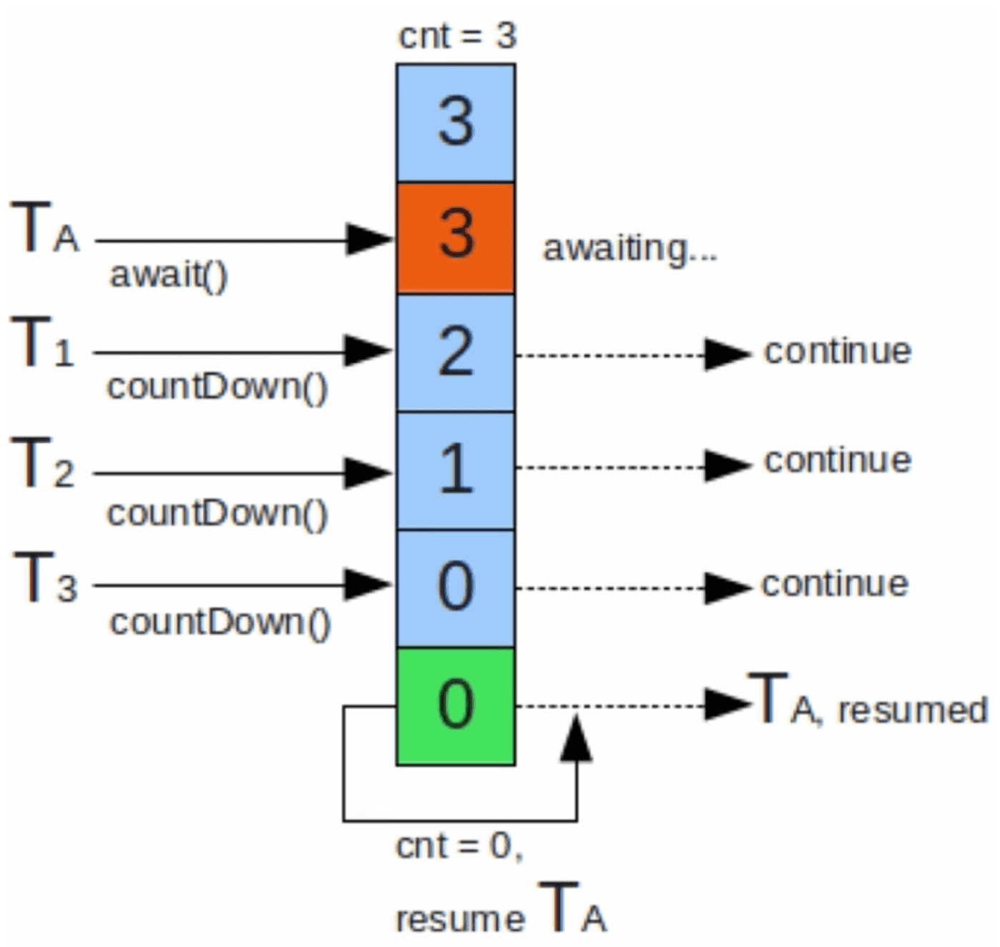​

‍

A为主线程，A首先设置计数器的数到AQS的state中，当调用await方法之后，A线程阻塞，随后每次其他线程调用countDown的时候，将state减1，直到计数器为0的时候，A线程继续执行。

‍

使用场景:  
并行计算：把任务分配给不同线程之后需要等待所有线程计算完成之后主线程才能汇总得到最终结果  
模拟并发：可以作为并发次数的统计变量，当任意多个线程执行完成并发任务之后统计一次即可

‍

### 示例

使用线程池和 `CountDownLatch`​ 完成任务的小示例。

这个示例展示了如何使用线程池来管理线程，并使用 `CountDownLatch`​ 来同步主线程和工作线程

‍

* ​`CountDownLatch`​ 被初始化为 3，表示需要等待三个工作线程完成任务。
* 使用 `Executors.newFixedThreadPool(3)`​ 创建一个固定大小的线程池。
* 将三个 `Worker`​ 任务提交到线程池中执行。
* 主线程调用 `latch.await()`​ 方法，等待计数器变为 0。
* 每个工作线程在完成任务后调用 `latch.countDown()`​ 方法，使计数器减 1。
* 当所有工作线程都完成任务后，计数器变为 0，主线程继续执行并关闭线程池。

```java

    public static void main(String[] args) {
        // 创建一个 CountDownLatch，计数器初始值为 3
        CountDownLatch latch = new CountDownLatch(3);

        // 创建一个固定大小的线程池
        ExecutorService executorService = Executors.newFixedThreadPool(3);

        // 提交三个工作线程到线程池
        for (int i = 0; i < 3; i++) {
            executorService.submit(new Worker(latch));
        }

        try {
            // 主线程等待，直到计数器变为 0
            latch.await();
            System.out.println("所有工作线程已完成");
        } catch (InterruptedException e) {
            e.printStackTrace();
        } finally {
            // 关闭线程池
            executorService.shutdown();
        }
    }


class Worker implements Runnable {
    private final CountDownLatch latch;

    public Worker(CountDownLatch latch) {
        this.latch = latch;
    }

    @Override
    public void run() {
        try {
            // 模拟工作线程的任务
            System.out.println(Thread.currentThread().getName() + " 正在执行任务");
            Thread.sleep(1000); // 模拟任务耗时
            System.out.println(Thread.currentThread().getName() + " 任务完成");
        } catch (InterruptedException e) {
            e.printStackTrace();
        } finally {
            // 任务完成后，计数器减 1
            latch.countDown();
        }
    }
}
```

‍

‍

## Semaphore

‍

信号量是一个能阻塞线程且能控制统一时间请求的并发量的工具。比如能保证同时执行的线程最多200个，模拟出稳定的并发量。

```java
public class CountDownLatchTest {

    public static void main(String[] args) {
        ExecutorService executorService = Executors.newCachedThreadPool();
        Semaphore semaphore = new Semaphore(3); //配置只能发布3个运行许可证
        for (int i = 0; i < 100; i++) {
            int finalI = i;
            executorService.execute(() -> {
                try {
                    semaphore.acquire(3); //获取3个运行许可，如果获取不到会一直等待，使用tryAcquire则不会等待
                    Thread.sleep(1000);
                    System.out.println(finalI);
                    semaphore.release(3);
                } catch (InterruptedException e) {
                    e.printStackTrace();
                }
            });
        }
        executorService.shutdown();
    }
}
```

由于同时获取3个许可，所以即使开启了100个线程，但是每秒只能执行一个任务

使用场景:  
数据库连接并发数，如果超过并发数，等待（acqiure）或者抛出异常（tryAcquire）

‍

‍

### CyclicBarrier

可以让一组线程相互等待，当每个线程都准备好之后，所有线程才继续执行的工具类

​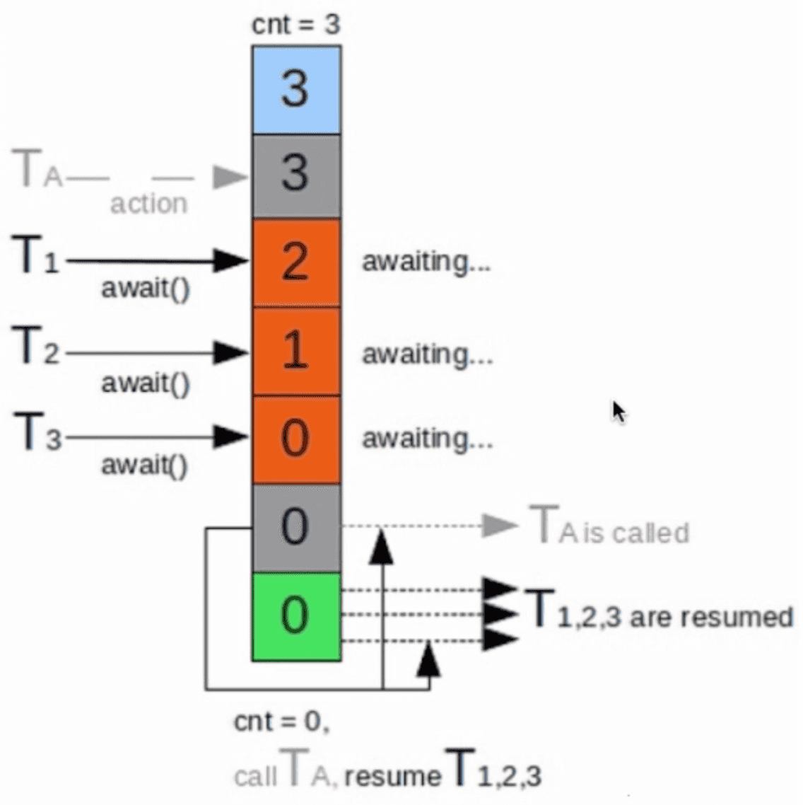​

‍

与CountDownLatch类似，都是通过计数器实现的，当某个线程调用await之后，计数器减1，当计数器大于0时将等待的线程包装成AQS的Node放入等待队列中，当计数器为0时将等待队列中的Node拿出来执行。

与CountDownLatch的区别：

1. CountDownLatch是一个线程等其他线程，CyclicBarrier是多个线程相互等待
2. CyclicBarrier的计数器能重复使用，调用多次

‍

使用场景：

有四个游戏玩家玩人类一败涂地(好久没打了)，游戏有三个关卡，每个关卡必须要所有玩家都到达后才能允许通过。其实这个场景里的玩家中如果有玩家A先到了关卡1，他必须等到其他所有玩家都到达关卡1时才能通过，也就是说线程之间需要相互等待。

‍

‍

## syncronize和lock的区别？ -合并

都是用于在多线程环境中控制对共享资源的访问，但它们有一些关键的区别：

1. **实现方式**：

    * ​`synchronized`​ 是 Java 语言内置的关键字，使用时不需要显式地获取和释放锁。
    * ​`Lock`​ 是一个接口，提供了更灵活的锁机制，需要显式地获取和释放锁。
2. **锁的释放**：

    * ​`synchronized`​ 块中的锁会在块**执行完毕后自动释放。**
    * ​`Lock`​ 需要**显式地调用** `unlock()`​ 方法来释放锁，通常在 `finally`​ 块中确保锁的释放。
3. **功能**：

    * ​`synchronized`​ 只能提供非公平锁。
    * ​`Lock`​ 可以提供公平锁和非公平锁，具体取决于实现。
4. **条件变量**：

    * ​`synchronized`​ 使用 `wait()`​, `notify()`​, `notifyAll()`​ 方法来实现线程间的通信。
    * ​`Lock`​ 提供了 `Condition`​ 类，可以有多个条件变量，使用 `await()`​, `signal()`​, `signalAll()`​ 方法来实现线程间的通信。
5. **性能**：

    * ​`synchronized`​ 在某些情况下可能会导致性能问题，特别是在高竞争的情况下。
    * ​`Lock`​ 提供了更高的性能和灵活性，特别是在高竞争的情况下。

总结：`synchronized`​ 简单易用，适合大多数情况；`Lock`​ 提供了更高的灵活性和性能，适合复杂的并发控制需求。

‍

使用 `Lock`​：

```java
public class LockExample {
    private int count = 0;
    private final Lock lock = new ReentrantLock();

    public void increment() {
        lock.lock();
        try {
            count++;
        } finally {
            lock.unlock();
        }
    }

    public int getCount() {
        lock.lock();
        try {
            return count;
        } finally {
            lock.unlock();
        }
    }
}
```

‍

‍

‍

## JVM对Synchronized做了哪些优化?

​`synchronized`​ 关键字在 Java 中用于实现线程同步，确保在同一时刻只有一个线程可以执行被 `synchronized`​ 修饰的方法或代码块。它可以用来修饰方法或代码块，防止多个线程同时访问共享资源，从而避免线程安全问题。

‍

JVM 对 `synchronized`​ 的优化

1. **偏向锁**：在无竞争的情况下，线程会偏向于持有它，减少不必要的同步操作。
2. **轻量级锁**：在有竞争但竞争不激烈的情况下，使用 CAS 操作来避免重量级锁的开销。
3. **重量级锁**：在竞争激烈的情况下，升级为重量级锁，使用操作系统的互斥量来实现线程同步。
4. **锁消除**：JVM 在 JIT 编译时，通过逃逸分析，消除不必要的锁。
5. **锁粗化**：JVM 在 JIT 编译时，将多个连续的锁操作合并为一个锁操作，减少锁的开销。

这些优化措施提高了 `synchronized`​ 的性能，使其在多线程环境中更加高效。

‍

‍

‍

# Temp

‍

## runnable 和 callable 有什么区别

> 难易程度：☆☆
>
> 出现频率：☆☆☆

‍

参考回答：

1. Runnable 接口run方法没有返回值；Callable接口call方法有返回值，是个泛型，和Future、FutureTask配合可以用来获取异步执行的结果
2. Callalbe接口支持返回执行结果，需要调用FutureTask.get()得到，此方法会阻塞主进程的继续往下执行，如果不调用不会阻塞。
3. Callable接口的call()方法允许抛出异常；而Runnable接口的run()方法的异常只能在内部消化，不能继续上抛

‍

### 线程包括哪些状态，状态之间是如何变化的

‍

线程的状态可以参考JDK中的Thread类中的枚举State

```java
public enum State {
        /**
         * 尚未启动的线程的线程状态
         */
        NEW,

        /**
         * 可运行线程的线程状态。处于可运行状态的线程正在 Java 虚拟机中执行，但它可能正在等待来自		 * 操作系统的其他资源，例如处理器。
         */
        RUNNABLE,

        /**
         * 线程阻塞等待监视器锁的线程状态。处于阻塞状态的线程正在等待监视器锁进入同步块/方法或在调          * 用Object.wait后重新进入同步块/方法。
         */
        BLOCKED,

        /**
         * 等待线程的线程状态。由于调用以下方法之一，线程处于等待状态：
		* Object.wait没有超时
         * 没有超时的Thread.join
         * LockSupport.park
         * 处于等待状态的线程正在等待另一个线程执行特定操作。
         * 例如，一个对对象调用Object.wait()的线程正在等待另一个线程对该对象调用Object.notify()			* 或Object.notifyAll() 。已调用Thread.join()的线程正在等待指定线程终止。
         */
        WAITING,

        /**
         * 具有指定等待时间的等待线程的线程状态。由于以指定的正等待时间调用以下方法之一，线程处于定          * 时等待状态：
		* Thread.sleep
		* Object.wait超时
		* Thread.join超时
		* LockSupport.parkNanos
		* LockSupport.parkUntil
         * </ul>
         */
        TIMED_WAITING,

        /**
         * 已终止线程的线程状态。线程已完成执行
         */
        TERMINATED;
    }
```

‍

状态之间是如何变化的

​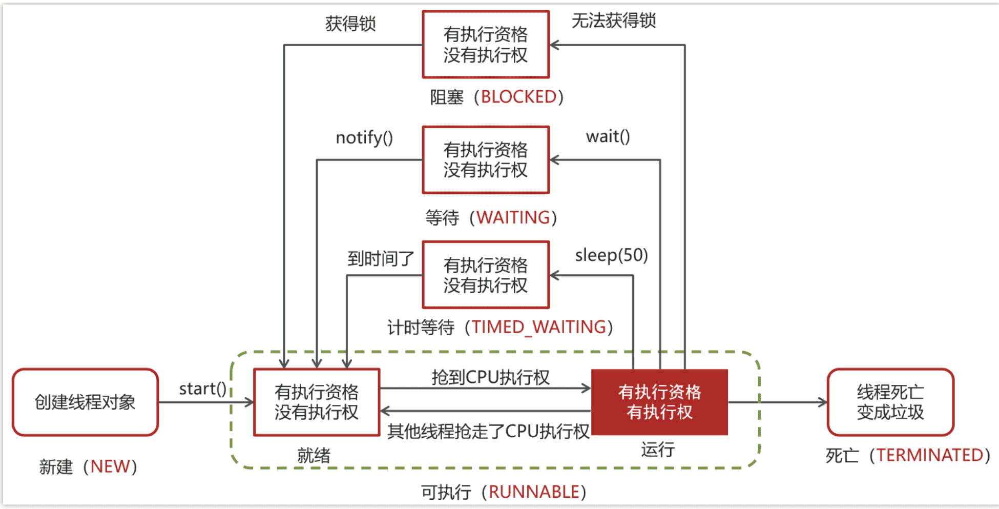​

‍

‍

分别是

* 新建

  * 当一个线程对象被创建，但还未调用 start 方法时处于**新建**状态
  * 此时未与操作系统底层线程关联
* 可运行

  * 调用了 start 方法，就会由**新建**进入**可运行**
  * 此时与底层线程关联，由操作系统调度执行
* 终结

  * 线程内代码已经执行完毕，由**可运行**进入**终结**
  * 此时会取消与底层线程关联
* 阻塞

  * 当获取锁失败后，由**可运行**进入 Monitor 的阻塞队列**阻塞**，此时不占用 cpu 时间
  * 当持锁线程释放锁时，会按照一定规则唤醒阻塞队列中的**阻塞**线程，唤醒后的线程进入**可运行**状态
* 等待

  * 当获取锁成功后，但由于条件不满足，调用了 wait() 方法，此时从**可运行**状态释放锁进入 Monitor 等待集合**等待**，同样不占用 cpu 时间
  * 当其它持锁线程调用 notify() 或 notifyAll() 方法，会按照一定规则唤醒等待集合中的**等待**线程，恢复为**可运行**状态
* 有时限等待

  * 当获取锁成功后，但由于条件不满足，调用了 wait(long) 方法，此时从**可运行**状态释放锁进入 Monitor 等待集合进行**有时限等待**，同样不占用 cpu 时间
  * 当其它持锁线程调用 notify() 或 notifyAll() 方法，会按照一定规则唤醒等待集合中的**有时限等待**线程，恢复为**可运行**状态，并重新去竞争锁
  * 如果等待超时，也会从**有时限等待**状态恢复为**可运行**状态，并重新去竞争锁
  * 还有一种情况是调用 sleep(long) 方法也会从**可运行**状态进入**有时限等待**状态，但与 Monitor 无关，不需要主动唤醒，超时时间到自然恢复为**可运行**状态

‍

‍

‍

## 在 java 中 wait 和 sleep 方法的不同？

‍

共同点

* wait() ，wait(long) 和 sleep(long) 的效果都是让当前线程暂时放弃 CPU 的使用权，进入阻塞状态

不同点

* 方法归属不同

  * sleep(long) 是 Thread 的静态方法
  * 而 wait()，wait(long) 都是 Object 的成员方法，每个对象都有
* 醒来时机不同

  * 执行 sleep(long) 和 wait(long) 的线程都会在等待相应毫秒后醒来
  * wait(long) 和 wait() 还可以被 notify 唤醒，wait() 如果不唤醒就一直等下去
  * 它们都可以被打断唤醒
* 锁特性不同（重点）

  * wait 方法的调用必须先获取 wait 对象的锁，而 sleep 则无此限制
  * wait 方法执行后会释放对象锁，允许其它线程获得该对象锁（我放弃 cpu，但你们还可以用）
  * 而 sleep 如果在 synchronized 代码块中执行，并不会释放对象锁（我放弃 cpu，你们也用不了）

‍

> 它们两个的相同点是都可以让当前线程暂时放弃 CPU 的使用权，进入阻塞状态。
>
> 不同点主要有三个方面：
>
> 第一：方法归属不同
>
> sleep(long) 是 Thread 的静态方法。而 wait()，是 Object 的成员方法，每个对象都有
>
> 第二：线程醒来时机不同
>
> 线程执行 sleep(long) 会在等待相应毫秒后醒来，而 wait() 需要被 notify 唤醒，wait() 如果不唤醒就一直等下去
>
> 第三：锁特性不同
>
> wait 方法的调用必须先获取 wait 对象的锁，而 sleep 则无此限制
>
> wait 方法执行后会释放对象锁，允许其它线程获得该对象锁（相当于我放弃 cpu，但你们还可以用）
>
> 而 sleep 如果在 synchronized 代码块中执行，并不会释放对象锁（相当于我放弃 cpu，你们也用不了）

‍

‍

‍

## 如何停止一个正在运行的线程？

有三种方式可以停止线程

* 使用退出标志，使线程正常退出，也就是当run方法完成后线程终止
* 使用stop方法强行终止（不推荐，方法已作废）
* 使用interrupt方法中断线程

‍

退出标记

```java
  volatile boolean flag = false ;     // 线程执行的退出标记

    @Override
    public void run() {
        while(!flag) {
            System.out.println("MyThread...run...");
            try {
                Thread.sleep(3000);
            } catch (InterruptedException e) {
                e.printStackTrace();
            }
        }
    }
```

‍

> 有三种方式可以停止线程
>
> 第一：可以使用退出标志，使线程正常退出，也就是当 run 方法完成后线程终止，一般我们加一个标记
>
> 第二：可以使用线程的 stop 方法强行终止，不过一般不推荐，这个方法已作废
>
> 第三：可以使用线程的 interrupt 方法中断线程，内部其实也是使用中断标志来中断线程
>
> 我们项目中使用的话，建议使用第一种或第三种方式中断线程

‍

‍

‍

## synchronized 关键字的底层原理

‍

> 讲一下 synchronized 关键字的底层原理？
>
> **候选人**：
>
> 嗯~~好的，
>
> synchronized 底层使用的 JVM 级别中的 Monitor 来决定当前线程是否获得了锁，如果某一个线程获得了锁，在没有释放锁之前，其他线程是不能或得到锁的。synchronized 属于悲观锁。
>
> synchronized 因为需要依赖于 JVM 级别的 Monitor ，相对性能也比较低。
>
> ‍
>
> ‍
>
> **面试官**：好的，你能具体说下 Monitor 吗？
>
> **候选人**：
>
> monitor 对象存在于每个 Java 对象的对象头中，synchronized 锁便是通过这种方式获取锁的，也是为什么 Java 中任意对象可以作为锁的原因
>
> monitor 内部维护了三个变量
>
> * WaitSet：保存处于 Waiting 状态的线程
> * EntryList：保存处于 Blocked 状态的线程
> * Owner：持有锁的线程
>
> 只有一个线程获取到的标志就是在 monitor 中设置成功了 Owner，一个 monitor 中只能有一个 Owner
>
> 在上锁的过程中，如果有其他线程也来抢锁，则进入 EntryList 进行阻塞，当获得锁的线程执行完了，释放了锁，就会唤醒 EntryList 中等待的线程竞争锁，竞争的时候是非公平的。
>
> ‍
>
> ‍
>
> **面试官**：好的，那关于 synchronized 的锁升级的情况了解吗？
>
> **候选人**：
>
> 嗯，知道一些（要谦虚）
>
> Java 中的 synchronized 有偏向锁、轻量级锁、重量级锁三种形式，分别对应了锁只被一个线程持有、不同线程交替持有锁、多线程竞争锁三种情况。
>
> 重量级锁：底层使用的 Monitor 实现，里面涉及到了用户态和内核态的切换、进程的上下文切换，成本较高，性能比较低。
>
> 轻量级锁：线程加锁的时间是错开的（也就是没有竞争），可以使用轻量级锁来优化。轻量级修改了对象头的锁标志，相对重量级锁性能提升很多。每次修改都是 CAS 操作，保证原子性
>
> 偏向锁：一段很长的时间内都只被一个线程使用锁，可以使用了偏向锁，在第一次获得锁时，会有一个 CAS 操作，之后该线程再获取锁，只需要判断 mark word 中是否是自己的线程 id 即可，而不是开销相对较大的 CAS 命令
>
> 一旦锁发生了竞争，都会升级为重量级锁
>
> ‍
>
> ‍
>
> **面试官**：好的，刚才你说了 synchronized 它在高并发量的情况下，性能不高，在项目该如何控制使用锁呢？
>
> **候选人**：
>
> 嗯，其实，在高并发下，我们可以采用 ReentrantLock 来加锁。
>
> ‍
>
> ‍
>
> **面试官**：嗯，那你说下 ReentrantLock 的使用方式和底层原理？
>
> **候选人**：
>
> 好的，
>
> ReentrantLock 是一个可重入锁:，调用 lock 方 法获取了锁之后，再次调用 lock，是不会再阻塞，内部直接增加重入次数 就行了，标识这个线程已经重复获取一把锁而不需要等待锁的释放。
>
> ReentrantLock 是属于 juc 报下的类，属于 api 层面的锁，跟 synchronized 一样，都是悲观锁。通过 lock()用来获取锁，unlock()释放锁。
>
> 它的底层实现原理主要利用**CAS+AQS 队列**来实现。它支持公平锁和非公平锁，两者的实现类似
>
> 构造方法接受一个可选的公平参数（**默认非公平锁**），当设置为 true 时，表示公平锁，否则为非公平锁。公平锁的效率往往没有非公平锁的效率高。

‍

‍

#### Monitor

Monitor 被翻译为监视器，是由 jvm 提供，c++语言实现

在代码中想要体现 monitor 需要借助 javap 命令查看 clsss 的字节码，比如以下代码：

```java
public class SyncTest {

    static final Object lock = new Object();
    static int counter = 0;
    public static void main(String[] args) {
        synchronized (lock) {
            counter++;
        }
    }
}
```

找到这个类的 class 文件，在 class 文件目录下执行`javap -v SyncTest.class`​，反编译效果如下：

‍

​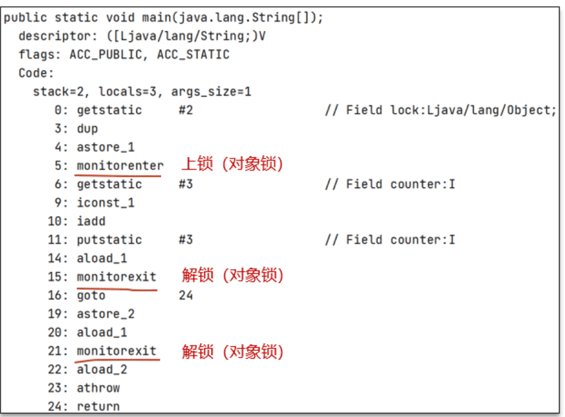​

‍

代码块的同步是利用 monitorenter和 monitorexit这两个字节码指令。它们分别位于同步代码块的开始和结束位置。当 jvm 执行到 monitorenter 指令时，当前线程试图获取 monitor 对象的所有权，如果未加锁或者已经被当前线程所持有，就把锁的计数器+1；当执行 monitorexit 指令时，锁计数器-1；当锁计数器为 0 时，该锁就被释放了。如果获取 monitor 对象失败，该线程则会进入阻塞状态，直到其他线程释放锁。

‍

> * monitorenter 上锁开始的地方
> * monitorexit 解锁的地方
> * 其中被 monitorenter 和 monitorexit 包围住的指令就是上锁的代码
> * 有两个 monitorexit 的原因，第二个 monitorexit 是为了防止锁住的代码抛异常后不能及时释放锁

在使用了 synchornized 代码块时需要指定一个对象，所以 synchornized 也被称为对象锁

monitor 主要就是跟这个对象产生关联

‍

​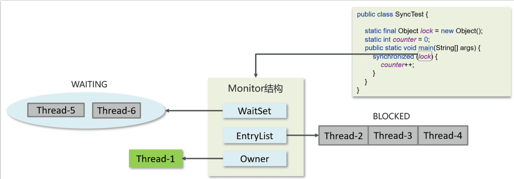​

‍

Monitor 内部具体的存储结构：

* Owner：存储当前获取锁的线程的，只能有一个线程可以获取
* EntryList：关联没有抢到锁的线程，处于 Blocked 状态的线程
* WaitSet：关联调用了 wait 方法的线程，处于 Waiting 状态的线程

‍

具体的流程：

* 代码进入 synchorized 代码块，先让 lock（对象锁）关联的 monitor，然后判断 Owner 是否有线程持有
* 如果没有线程持有，则让当前线程持有，表示该线程获取锁成功
* 如果有线程持有，则让当前线程进入 entryList 进行阻塞，如果 Owner 持有的线程已经释放了锁，在 EntryList 中的线程去竞争锁的持有权（非公平）
* 如果代码块中调用了 wait()方法，则会进去 WaitSet 中进行等待

‍

参考回答：

* Synchronized【对象锁】采用互斥的方式让同一时刻至多只有一个线程能持有【对象锁】
* 它的底层由 monitor 实现的，monitor 是 jvm 级别的对象（ C++实现），线程获得锁需要使用对象（锁）关联 monitor
* 在 monitor 内部有三个属性，分别是 owner、entrylist、waitset
* 其中 owner 是关联的获得锁的线程，并且只能关联一个线程；entrylist 关联的是处于阻塞状态的线程；waitset 关联的是处于 Waiting 状态的线程

‍

‍

### synchronized 关键字的底层原理-进阶

Monitor 实现的锁属于重量级锁，你了解过锁升级吗？

* Monitor 实现的锁属于重量级锁，里面涉及到了用户态和内核态的切换、进程的上下文切换，成本较高，性能比较低。
* 在 JDK 1.6 引入了两种新型锁机制：偏向锁和轻量级锁，它们的引入是为了解决在没有多线程竞争或基本没有竞争的场景下因使用传统锁机制带来的性能开销问题。

‍

#### 对象的内存结构

在 HotSpot 虚拟机中，对象在内存中存储的布局可分为 3 块区域：对象头（Header）、实例数据（Instance Data）和对齐填充

​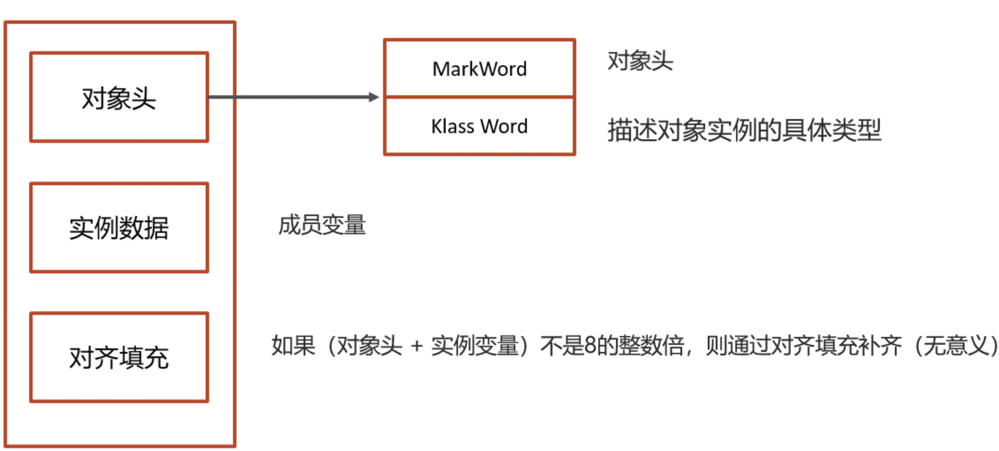​

‍

重点分析 MarkWord 对象头

‍

#### MarkWord

​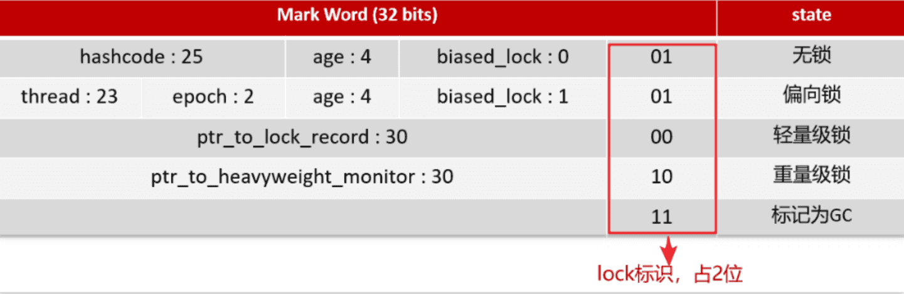​

‍

> * hashcode：25 位的对象标识 Hash 码
> * age：对象分代年龄占 4 位
> * biased_lock：偏向锁标识，占 1 位 ，0 表示没有开始偏向锁，1 表示开启了偏向锁
> * thread：持有偏向锁的线程 ID，占 23 位
> * epoch：偏向时间戳，占 2 位
> * ptr_to_lock_record：轻量级锁状态下，指向栈中锁记录的指针，占 30 位
> * ptr_to_heavyweight_monitor：重量级锁状态下，指向对象监视器 Monitor 的指针，占 30 位

我们可以通过 lock 的标识，来判断是哪一种锁的等级

* 后三位是 001 表示无锁
* 后三位是 101 表示偏向锁
* 后两位是 00 表示轻量级锁
* 后两位是 10 表示重量级锁

‍

#### Monitor 重量级锁

‍

每个 Java 对象都可以关联一个 Monitor 对象，如果使用 synchronized 给对象上锁（重量级）之后，**该对象头的 Mark Word 中就被设置指向 Monitor 对象的指针**

每个对象的对象头都可以设置 monoitor 的指针，让对象与 monitor 产生关联

‍

#### 轻量级锁

在很多的情况下，在 Java 程序运行时，同步块中的代码都是不存在竞争的，不同的线程交替的执行同步块中的代码。这种情况下，用重量级锁是没必要的。因此 JVM 引入了轻量级锁的概念。

‍

**加锁的流程**

1.在线程栈中创建一个 Lock Record，将其 obj 字段指向锁对象。

.通过 CAS 指令将 Lock Record 的地址存储在对象头的 mark word 中（数据进行交换），如果对象处于无锁状态则修改成功，代表该线程获得了轻量级锁。

3.如果是当前线程已经持有该锁了，代表这是一次锁重入。设置 Lock Record 第一部分为 null，起到了一个重入计数器的作用。

4.如果 CAS 修改失败，说明发生了竞争，需要膨胀为重量级锁。

​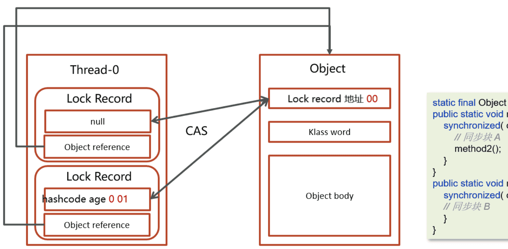​

‍

**解锁过程**

1.遍历线程栈,找到所有 obj 字段等于当前锁对象的 Lock Record。

2.如果 Lock Record 的 Mark Word 为 null，代表这是一次重入，将 obj 设置为 null 后 continue。

.如果 Lock Record 的 Mark Word 不为 null，则利用 CAS 指令将对象头的 mark word 恢复成为无锁状态。如果失败则膨胀为重量级锁。

​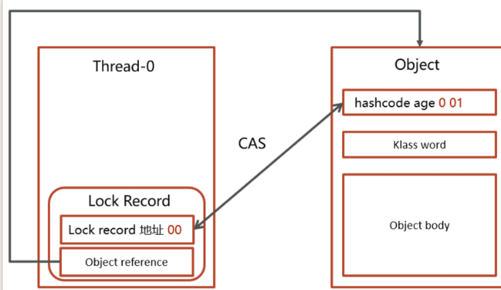​

‍

‍

#### 偏向锁

轻量级锁在没有竞争时（就自己这个线程），每次重入仍然需要执行 CAS 操作。

Java 6 中引入了偏向锁来做进一步优化：只有第一次使用 CAS 将线程 ID 设置到对象的 Mark Word 头，之后发现

这个线程 ID 是自己的就表示没有竞争，不用重新 CAS。以后只要不发生竞争，这个对象就归该线程所有

‍

**加锁的流程**

1.在线程栈中创建一个 Lock Record，将其 obj 字段指向锁对象。

2.通过 CAS 指令将 Lock Record 的**线程 id**存储在对象头的 mark word 中，同时也设置偏向锁的标识为 101，如果对象处于无锁状态则修改成功，代表该线程获得了偏向锁。

​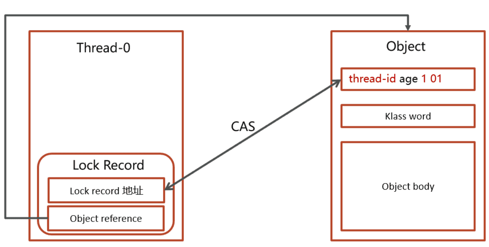​

3.如果是当前线程已经持有该锁了，代表这是一次锁重入。设置 Lock Record 第一部分为 null，起到了一个重入计数器的作用。与轻量级锁不同的时，这里不会再次进行 cas 操作，只是判断对象头中的线程 id 是否是自己，因为缺少了 cas 操作，性能相对轻量级锁更好一些

​​

​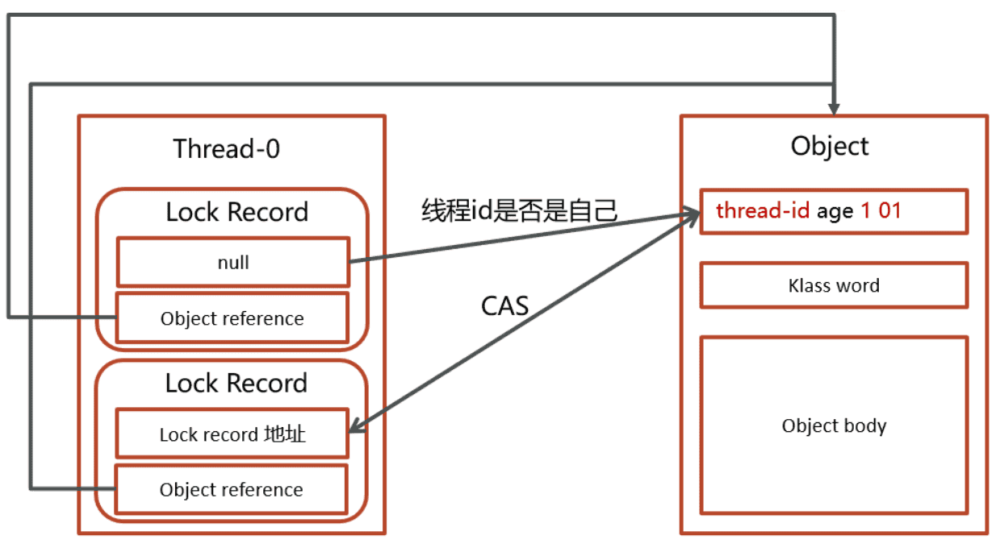​

‍

#### 锁升级

Java 中的 synchronized 有偏向锁、轻量级锁、重量级锁三种形式，分别对应了锁只被一个线程持有、不同线程交替持有锁、多线程竞争锁三种情况。

||**描述**|
| ----------| -------------------------------------------------------------------------------------------------------------------------------------------------------------------------------------------------|
|重量级锁|底层使用的 Monitor 实现，里面涉及到了用户态和内核态的切换、进程的上下文切换，成本较高，性能比较低。|
|轻量级锁|线程加锁的时间是错开的（也就是没有竞争），可以使用轻量级锁来优化。轻量级修改了对象头的锁标志，相对重量级锁性能提升很多。每次修改都是 CAS 操作，保证原子性|
|偏向锁|一段很长的时间内都只被一个线程使用锁，可以使用了偏向锁，在第一次获得锁时，会有一个 CAS 操作，之后该线程再获取锁，只需要判断 mark word 中是否是自己的线程 id 即可，而不是开销相对较大的 CAS 命令|

**一旦锁发生了竞争，轻量级锁, 偏向锁都会升级为重量级锁**

‍

‍

‍

### 你谈谈 JMM（Java 内存模型）

JMM(Java Memory Model)Java 内存模型,是 java 虚拟机规范中所定义的一种内存模型。

Java 内存模型(Java Memory Model)描述了 Java 程序中各种变量(线程共享变量)的访问规则，以及在 JVM 中将变量存储到内存和从内存中读取变量这样的底层细节。

​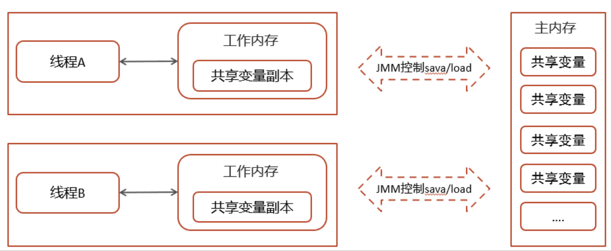​

特点：

1. 所有的共享变量都存储于主内存(计算机的 RAM)这里所说的变量指的是实例变量和类变量。不包含局部变量，因为局部变量是线程私有的，因此不存在竞争问题。
2. 每一个线程还存在自己的工作内存，线程的工作内存，保留了被线程使用的变量的工作副本。
3. 线程对变量的所有的操作(读，写)都必须在工作内存中完成，而不能直接读写主内存中的变量，不同线程之间也不能直接访问对方工作内存中的变量，线程间变量的值的传递需要通过主内存完成。

‍

‍

‍

## CAS 你知道吗？

CAS 的全称是： Compare And Swap(比较再交换)，它体现的一种乐观锁的思想，在无锁情况下保证线程操作共享数据的原子性。

在 JUC（ java.util.concurrent ）包下实现的很多类都用到了 CAS 操作

* AbstractQueuedSynchronizer（AQS 框架）
* AtomicXXX 类

‍

‍

1. 线程 1 与线程 2 都从主内存中获取变量 int a = 100,同时放到各个线程的工作内存中

    > 一个当前内存值 V、旧的预期值 A、即将更新的值 B，当且仅当旧的预期值 A 和内存值 V 相同时，将内存值修改为 B 并返回 true，否则什么都不做，并返回 false。如果 CAS 操作失败，通过自旋的方式等待并再次尝试，直到成功
    >
2. 线程 1 操作：V：int a = 100，A：int a = 100，B：修改后的值：int a = 101 (a++)

    * 线程 1 拿 A 的值与主内存 V 的值进行比较，判断是否相等
    * 如果相等，则把 B 的值 101 更新到主内存中
3. 线程 2 操作：V：int a = 100，A：int a = 100，B：修改后的值：int a = 99(a--)

    * 线程 2 拿 A 的值与主内存 V 的值进行比较，判断是否相等(目前不相等，因为线程 1 已更新 V 的值 99)
    * 不相等，则线程 2 更新失败

‍

‍

​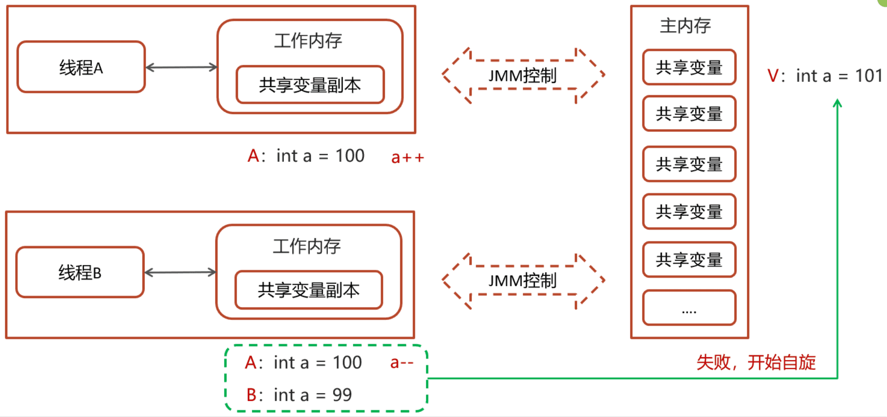​

自旋锁操作

* 因为没有加锁，所以线程不会陷入阻塞，效率较高
* 如果竞争激烈，重试频繁发生，效率会受影响

> 需要不断尝试获取共享内存 V 中最新的值，然后再在新的值的基础上进行更新操作，如果失败就继续尝试获取新的值，直到更新成功

‍

‍

‍

> **面试官**：好的，刚才你说了 CAS 和 AQS，你能介绍一下吗？
>
> **候选人**：
>
> 好的。
>
> CAS 的全称是： Compare And Swap(比较再交换);它体现的一种乐观锁的思想，在无锁状态下保证线程操作数据的原子性。
>
> * CAS 使用到的地方很多：AQS 框架、AtomicXXX 类
> * 在操作共享变量的时候使用的自旋锁，效率上更高一些
> * CAS 的底层是调用的 Unsafe 类中的方法，都是操作系统提供的，其他语言实现
>
> AQS 的话，其实就一个 jdk 提供的类 AbstractQueuedSynchronizer，是阻塞式锁和相关的同步器工具的框架。
>
> 内部有一个属性 state 属性来表示资源的状态，默认 state 等于 0，表示没有获取锁，state 等于 1 的时候才标明获取到了锁。通过 cas 机制设置 state 状态
>
> 在它的内部还提供了基于 FIFO 的等待队列，是一个双向列表，其中
>
> * tail 指向队列最后一个元素
> * head 指向队列中最久的一个元素
>
> 其中我们刚刚聊的 ReentrantLock 底层的实现就是一个 AQS。
>
> ‍
>
> **面试官**：synchronized 和 Lock 有什么区别 ?
>
> **候选人**：
>
> 嗯~~，好的，主要有三个方面不太一样
>
> 第一，语法层面
>
> * synchronized 是关键字，源码在 jvm 中，用 c++ 语言实现，退出同步代码块锁会自动释放
> * Lock 是接口，源码由 jdk 提供，用 java 语言实现，需要手动调用 unlock 方法释放锁
>
> 第二，功能层面
>
> * 二者均属于悲观锁、都具备基本的互斥、同步、锁重入功能
> * Lock 提供了许多 synchronized 不具备的功能，例如获取等待状态、公平锁、可打断、可超时、多条件变量，同时 Lock 可以实现不同的场景，如 ReentrantLock， ReentrantReadWriteLock
>
> 第三，性能层面
>
> * 在没有竞争时，synchronized 做了很多优化，如偏向锁、轻量级锁，性能不赖
> * 在竞争激烈时，Lock 的实现通常会提供更好的性能
>
> 统合来看，需要根据不同的场景来选择不同的锁的使用。

‍

‍

## CAS 底层实现

CAS 底层依赖于一个 Unsafe 类来直接调用操作系统底层的 CAS 指令

‍

都是 native 修饰的方法，由系统提供的接口执行，并非 java 代码实现，一般的思路也都是自旋锁实现

java 中比较常见使用有很多，比如 ReentrantLock 和 Atomic 开头的线程安全类，都调用了 Unsafe 中的方法

​​

‍

‍

‍

## volatile 的理解

一旦一个共享变量（类的成员变量、类的静态成员变量）被 volatile 修饰之后，那么就具备了两层语义

① 保证线程间的可见性  
② 禁止进行指令重排序

‍

> volatile 是一个关键字，可以修饰类的成员变量、类的静态成员变量，主要有两个功能
>
> 第一：保证了不同线程对这个变量进行操作时的可见性，即一个线程修改了某个变量的值，这新值对其他线程来说是立即可见的,volatile 关键字会强制将修改的值立即写入主存。
>
> 第二： 禁止进行指令重排序，可以保证代码执行有序性。底层实现原理是，添加了一个**内存屏障**，通过插入内存屏障禁止在内存屏障**前后**的指令执行重排序优化

‍

### 保证线程间的可见性

保证了不同线程对这个变量进行操作时的可见性，即一个线程修改了某个变量的值，这新值对其他线程来说是立即可见的,volatile 关键字会强制将修改的值立即写入主存

‍

#### 示例

读取不到共享变量的值结束循环

在 JVM 虚拟机中有一个 JIT（即时编辑器）给代码做了优化。

> 上述代码
>
> ```java
> while (!stop) {
> i++;
> }
> ```
>
> 在很短的时间内，这个代码执行的次数太多了，当达到了一个阈值，JIT 就会优化此代码，如下：
>
> ```java
> while (true) {
> i++;
> }
> ```
>
> 当把代码优化成这样子以后，及时`stop`​变量改变为了`false`​也依然停止不了循环

‍

解决方案：

‍

第一：

在程序运行的时候加入 vm 参数`-Xint`​表示禁用即时编辑器，不推荐，得不偿失（其他程序还要使用）

‍

第二：

在修饰`stop`​变量的时候加上`volatile`​,表示当前代码禁用了即时编辑器，问题就可以解决，代码如下：

```java
static volatile boolean stop = false;
```

‍

### 禁止进行指令重排序

用 volatile 修饰共享变量会在读、写共享变量时加入不同的屏障，阻止其他读写操作越过屏障，从而达到阻止重排序的效果

‍

在去获取上面的结果的时候，有可能会出现 4 种情况

情况一：先执行 actor2 获取结果--->0,0(正常)

情况二：先执行 actor1 中的第一行代码，然后执行 actor2 获取结果--->0,1(正常)

情况三：先执行 actor1 中所有代码，然后执行 actor2 获取结果--->1,1(正常)

情况四：先执行 actor1 中第二行代码，然后执行 actor2 获取结果--->1,0(发生了指令重排序，影响结果)

‍

**解决方案**

在变量上添加 volatile，禁止指令重排序，则可以解决问题(但是要注意顺序)

​​

‍

​​

‍

* 写操作加的屏障是阻止上方其它写操作越过屏障排到 volatile 变量写之下
* 读操作加的屏障是阻止下方其它读操作越过屏障排到 volatile 变量读之上

‍

放在x上就不行这样显然是不行的，主要是因为下面两个原则：

* 写操作加的屏障是阻止上方其它写操作越过屏障排到 volatile 变量写之下
* 读操作加的屏障是阻止下方其它读操作越过屏障排到 volatile 变量读之上

所以，现在我们就可以总结一个 volatile 使用的小妙招：

* 写变量让 volatile 修饰的变量的在代码最后位置
* 读变量让 volatile 修饰的变量的在代码最开始位置

‍

‍

## 死锁排查

这个也很容易，我们只需要通过 jdk 自动的工具就能搞定

我们可以先通过 jps 来查看当前 java 程序运行的进程 id

然后通过 jstack 来查看这个进程 id，就能展示出来死锁的问题，并且，可以定位代码的具体行号范围，我们再去找到对应的代码进行排查就行了。

‍

## AQS

全称是 AbstractQueuedSynchronizer，是阻塞式锁和相关的同步器工具的框架，它是构建锁或者其他同步组件的基础框架

AQS 与 Synchronized 的区别

|**synchronized**|**AQS**|
| --------------------------------| ----------------------------------------|
|关键字，c++ 语言实现|java 语言实现|
|悲观锁，自动释放锁|悲观锁，手动开启和关闭|
|锁竞争激烈都是重量级锁，性能差|锁竞争激烈的情况下，提供了多种解决方案|

AQS 常见的实现类

* ReentrantLock 阻塞式锁
* Semaphore 信号量
* CountDownLatch 倒计时锁

‍

#### 工作机制

* 在 AQS 中维护了一个使用了 volatile 修饰的 state 属性来表示资源的状态，0 表示无锁，1 表示有锁
* 提供了基于 FIFO 的等待队列，类似于 Monitor 的 EntryList
* 条件变量来实现等待、唤醒机制，支持多个条件变量，类似于 Monitor 的 WaitSe

​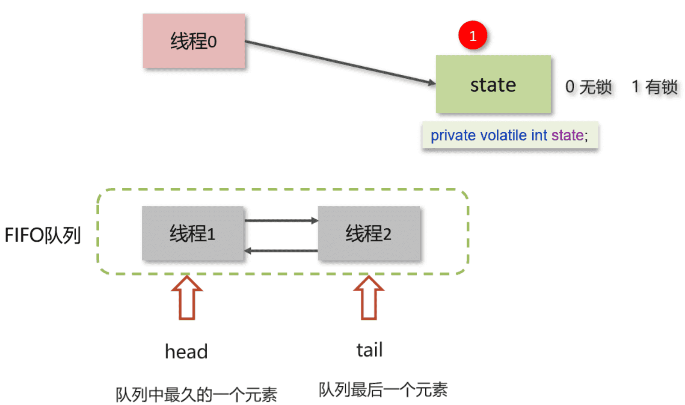​

‍

> * 线程 0 来了以后，去尝试修改 state 属性，如果发现 state 属性是 0，就修改 state 状态为 1，表示线程 0 抢锁成功
> * 线程 1 和线程 2 也会先尝试修改 state 属性，发现 state 的值已经是 1 了，有其他线程持有锁，它们都会到 FIFO 队列中进行等待，
> * FIFO 是一个双向队列，head 属性表示头结点，tail 表示尾结点

‍

**如果多个线程共同去抢这个资源是如何保证原子性的呢？**

​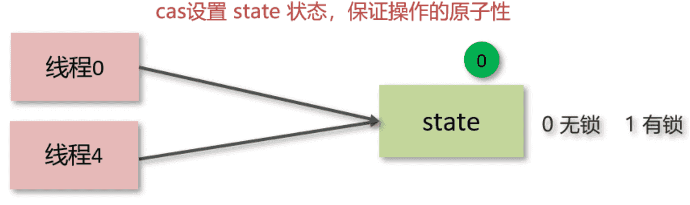​

‍

在去修改 state 状态的时候，使用的 cas 自旋锁来保证原子性，确保只能有一个线程修改成功，修改失败的线程将会进入 FIFO 队列中等待

**AQS 是公平锁吗，还是非公平锁？**

* 新的线程与队列中的线程共同来抢资源，是非公平锁
* 新的线程到队列中等待，只让队列中的 head 线程获取锁，是公平锁

‍

> 比较典型的 AQS 实现类 ReentrantLock，它默认就是非公平锁，新的线程与队列中的线程共同来抢资源

‍

‍

### ReentrantLock 的实现原理

ReentrantLock 翻译过来是可重入锁，相对于 synchronized 它具备以下特点：

* 可中断
* 可以设置超时时间
* 可以设置公平锁
* 支持多个条件变量
* 与 synchronized 一样，都支持重入

‍

#### 实现原理

ReentrantLock 主要利用 CAS+AQS 队列来实现。它支持公平锁和非公平锁，两者的实现类似

构造方法接受一个可选的公平参数（默认非公平锁），当设置为 true 时，表示公平锁，否则为非公平锁。公平锁的效率往往没有非公平锁的效率高，在许多线程访问的情况下，公平锁表现出较低的吞吐量。

查看 ReentrantLock 源码中的构造方法：

```java
public ReentrantLock() {
    sync = new NonfairSync();
}

public ReentrantLock(boolean fair){
    sync = fair ? new FairSync() : new NonfairSync();
}
```

提供了两个构造方法，不带参数的默认为非公平

如果使用带参数的构造函数，并且传的值为 true，则是公平锁

其中 NonfairSync 和 FairSync 这两个类父类都是 Sync

而 Sync 的父类是 AQS，所以可以得出 ReentrantLock 底层主要实现就是基于 AQS 来实现的

‍

‍

**工作流程**

​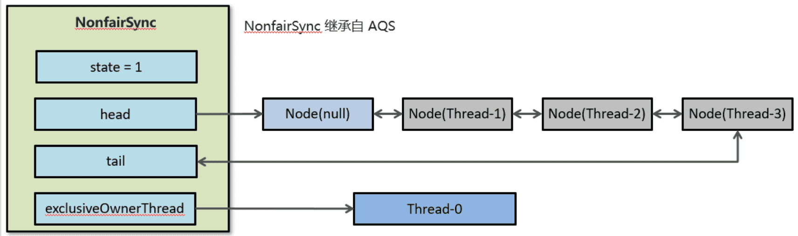​

‍

* 线程来抢锁后使用 cas 的方式修改 state 状态，修改状态成功为 1，则让 exclusiveOwnerThread 属性指向当前线程，获取锁成功
* 假如修改状态失败，则会进入双向队列中等待，head 指向双向队列头部，tail 指向双向队列尾部
* 当 exclusiveOwnerThread 为 null 的时候，则会唤醒在双向队列中等待的线程
* 公平锁则体现在按照先后顺序获取锁，非公平体现在不在排队的线程也可以抢锁

‍

‍

### synchronized 和 Lock 有什么区别 ?

参考回答

* 语法层面

  * synchronized 是关键字，源码在 jvm 中，用 c++ 语言实现
  * Lock 是接口，源码由 jdk 提供，用 java 语言实现
  * 使用 synchronized 时，退出同步代码块锁会自动释放，而使用 Lock 时，需要手动调用 unlock 方法释放锁
* 功能层面

  * 二者均属于悲观锁、都具备基本的互斥、同步、锁重入功能
  * Lock 提供了许多 synchronized 不具备的功能，例如获取等待状态、公平锁、可打断、可超时、多条件变量
  * Lock 有适合不同场景的实现，如 ReentrantLock， ReentrantReadWriteLock
* 性能层面

  * 在没有竞争时，synchronized 做了很多优化，如偏向锁、轻量级锁，性能不赖
  * 在竞争激烈时，Lock 的实现通常会提供更好的性能

‍

‍

### 如何进行死锁诊断？

‍

可以使用 jdk 自带的工具：jps + jstack

步骤如下：

1. 查看运行的线程, 控制台jps
2. 使用 jstack -l {端口} 查看线程运行的情况

‍

**其他解决工具，可视化工具**

* jconsole

用于对 jvm 的内存，线程，类 的监控，是一个基于 jmx 的 GUI 性能监控工具

打开方式：java 安装目录 bin 目录下 直接启动 jconsole.exe 就行

* VisualVM：故障处理工具

能够监控线程，内存情况，查看方法的 CPU 时间和内存中的对 象，已被 GC 的对象，反向查看分配的堆栈

打开方式：java 安装目录 bin 目录下 直接启动 jvisualvm.exe 就行

‍

‍

‍

### ConcurrentHashMap

‍

线程安全的高效 Map 集合

底层数据结构：

* JDK1.7 底层采用分段的数组+链表实现
* JDK1.8 采用的数据结构跟 HashMap1.8 的结构一样，数组+链表/红黑二叉树。

‍

采用 CAS + Synchronized 来保证并发安全进行实现

* CAS 控制数组节点的添加
* synchronized 只锁定当前链表或红黑二叉树的首节点，只要 hash 不冲突，就不会产生并发的问题 , 效率得到提升

‍

> ConcurrentHashMap 是一种线程安全的高效 Map 集合，jdk1.7 和 1.8 也做了很多调整。
>
> * JDK1.7 的底层采用是**分段的数组**+**链表** 实现
> * JDK1.8 采用的数据结构跟 HashMap1.8 的结构一样，数组+链表/红黑二叉树。
>
> 在 jdk1.7 中 ConcurrentHashMap 里包含一个 Segment 数组。Segment 的结构和 HashMap 类似，是一 种数组和链表结构，一个 Segment 包含一个 HashEntry 数组，每个 HashEntry 是一个链表结构 的元素，每个 Segment 守护着一个 HashEntry 数组里的元素，当对 HashEntry 数组的数据进行修 改时，必须首先获得对应的 Segment 的锁。
>
> Segment 是一种可重入的锁 ReentrantLock，每个 Segment 守护一个 HashEntry 数组里得元 素，当对 HashEntry 数组的数据进行修改时，必须首先获得对应的 Segment 锁
>
> 在 jdk1.8 中的 ConcurrentHashMap 做了较大的优化，性能提升了不少。首先是它的数据结构与 jdk1.8 的 hashMap 数据结构完全一致。其次是放弃了 Segment 臃肿的设计，取而代之的是采用 Node + CAS + Synchronized 来保 证并发安全进行实现，synchronized 只锁定当前链表或红黑二叉树的首节点，这样只要 hash 不冲 突，就不会产生并发 , 效率得到提升

‍

‍

### 导致并发程序出现问题的根本原因是什么

‍

Java 并发编程三大特性

* 原子性
* 可见性
* 有序性

‍

就是违反了这些中的

#### （1）原子性

一个线程在 CPU 中操作不可暂停，也不可中断，要不执行完成，要不不执行

解决方案：

1.synchronized：同步加锁

2.JUC 里面的 lock：加锁

‍

#### （2）内存可见性

内存可见性：让一个线程对共享变量的修改对另一个线程可见

解决方案：

* synchronized
* volatile（推荐）强制读取
* lock

‍

#### （3）有序性

指令重排：处理器为了提高程序运行效率，可能会对输入代码进行优化，它不保证程序中各个语句的执行先后顺序同代码中的顺序一致，但是它会保证程序最终执行结果和代码顺序执行的结果是一致的

‍

解决方案：

* volatile 重排

‍

## 线程池

‍

> **面试官**：线程池的种类有哪些？
>
> **候选人**：
>
> 嗯！是这样
>
> 在 jdk 中默认提供了 4 中方式创建线程池
>
> 第一个是：newCachedThreadPool 创建一个可缓存线程池，如果线程池长度超过处理需要，可灵活回 收空闲线程，若无可回收，则新建线程。
>
> 第二个是：newFixedThreadPool 创建一个定长线程池，可控制线程最大并发数，超出的线程会在队列 中等待。
>
> 第三个是：newScheduledThreadPool 创建一个定长线程池，支持定时及周期性任务执行。
>
> 第四个是：newSingleThreadExecutor 创建一个单线程化的线程池，它只会用唯一的工作线程来执行任 务，保证所有任务按照指定顺序(FIFO, LIFO, 优先级)执行。
>
> **面试官**：线程池的核心参数有哪些？
>
> **候选人**：
>
> 在线程池中一共有 7 个核心参数：
>
> 1. corePoolSize 核心线程数目 - 池中会保留的最多线程数
> 2. maximumPoolSize 最大线程数目 - 核心线程+救急线程的最大数目
> 3. keepAliveTime 生存时间 - 救急线程的生存时间，生存时间内没有新任务，此线程资源会释放
> 4. unit 时间单位 - 救急线程的生存时间单位，如秒、毫秒等
> 5. workQueue - 当没有空闲核心线程时，新来任务会加入到此队列排队，队列满会创建救急线程执行任务
> 6. threadFactory 线程工厂 - 可以定制线程对象的创建，例如设置线程名字、是否是守护线程等
> 7. handler 拒绝策略 - 当所有线程都在繁忙，workQueue 也放满时，会触发拒绝策略
>
> 在拒绝策略中又有 4 中拒绝策略
>
> 当线程数过多以后，第一种是抛异常、第二种是由调用者执行任务、第三是丢弃当前的任务，第四是丢弃最早排队任务。默认是直接抛异常。
>
> **面试官**：如何确定核心线程池呢？
>
> **候选人**：
>
> 是这样的，我们公司当时有一些规范，为了减少线程上下文的切换，要根据当时部署的服务器的 CPU 核数来决定，我们规则是：CPU 核数+1 就是最终的核心线程数。
>
> **面试官**：线程池的执行原理知道吗？
>
> **候选人**：
>
> 嗯~，它是这样的
>
> 首先判断线程池里的核心线程是否都在执行任务，如果不是则创建一个新的工作线程来执行任务。如果核心线程都在执行任务，则线程池判断工作队列是否已满，如果工作队列没有满，则将新提交的任务存储在这个工作队 列里。如果工作队列满了，则判断线程池里的线程是否都处于工作状态，如果没有，则创建一个新的工作线程来执行任 务。如果已经满了，则交给拒绝策略来处理这个任务。
>
> **面试官**：为什么不建议使用 Executors 创建线程池呢？
>
> **候选人**：
>
> 好的，其实这个事情在阿里提供的最新开发手册《Java 开发手册-嵩山版》中也提到了
>
> 主要原因是如果使用 Executors 创建线程池的话，它允许的请求队列默认长度是 Integer.MAX_VALUE，这样的话，有可能导致堆积大量的请求，从而导致 OOM（内存溢出）。
>
> 所以，我们一般推荐使用 ThreadPoolExecutor 来创建线程池，这样可以明确规定线程池的参数，避免资源的耗尽。

‍

‍

### 说一下线程池的核心参数（线程池的执行原理知道嘛）

* corePoolSize 核心线程数目
* maximumPoolSize 最大线程数目 = (核心线程+救急线程的最大数目)
* keepAliveTime 生存时间 - 救急线程的生存时间，生存时间内没有新任务，此线程资源会释放
* unit 时间单位 - 救急线程的生存时间单位，如秒、毫秒等
* workQueue - 当没有空闲核心线程时，新来任务会加入到此队列排队，队列满会创建救急线程执行任务
* threadFactory 线程工厂 - 可以定制线程对象的创建，例如设置线程名字、是否是守护线程等
* handler 拒绝策略 - 当所有线程都在繁忙，workQueue 也放满时，会触发拒绝策略

‍

**工作流程**

​​

‍

1，任务在提交的时候，首先判断核心线程数是否已满，如果没有满则直接添加到工作线程执行

2，如果核心线程数满了，则判断阻塞队列是否已满，如果没有满，当前任务存入阻塞队列

3，如果阻塞队列也满了，则判断线程数是否小于最大线程数，如果满足条件，则使用临时线程执行任务

如果核心或临时线程执行完成任务后会检查阻塞队列中是否有需要执行的线程，如果有，则使用非核心线程执行任务

4，如果所有线程都在忙着（核心线程+临时线程），则走拒绝策略

‍

拒绝策略：

1.AbortPolicy：直接抛出异常，默认策略；

2.CallerRunsPolicy：用调用者所在的线程来执行任务；

3.DiscardOldestPolicy：丢弃阻塞队列中靠最前的任务，并执行当前任务；

4.DiscardPolicy：直接丢弃任务；

‍

‍

### 线程池中有哪些常见的阻塞队列

‍

workQueue - 当没有空闲核心线程时，新来任务会加入到此队列排队，队列满会创建救急线程执行任务

比较常见的有 4 个，用的最多是 ArrayBlockingQueue 和 LinkedBlockingQueue

1.ArrayBlockingQueue：基于数组结构的有界阻塞队列，FIFO。

2.LinkedBlockingQueue：基于链表结构的有界阻塞队列，FIFO。

3.DelayedWorkQueue ：是一个优先级队列，它可以保证每次出队的任务都是当前队列中执行时间最靠前的

4.SynchronousQueue：不存储元素的阻塞队列，每个插入操作都必须等待一个移出操作。

‍

‍

**ArrayBlockingQueue 的 LinkedBlockingQueue 区别**

|**LinkedBlockingQueue**|**ArrayBlockingQueue**|
| ----------------------------------| -------------------------|
|默认无界，支持有界|强制有界|
|底层是链表|底层是数组|
|是懒惰的，创建节点的时候添加数据|提前初始化 Node 数组|
|入队会生成新 Node|Node 需要是提前创建好的|
|两把锁（头尾）|一把锁|

‍

左边是 LinkedBlockingQueue 加锁的方式，右边是 ArrayBlockingQueue 加锁的方式

* LinkedBlockingQueue 读和写各有一把锁，性能相对较好
* ArrayBlockingQueue 只有一把锁，读和写公用，性能相对于 LinkedBlockingQueue 差一些

​​

‍

‍

### 如何确定核心线程数

在设置核心线程数之前，需要先熟悉一些执行线程池执行任务的类型

* IO 密集型任务

一般来说：文件读写、DB 读写、网络请求等

推荐：核心线程数大小设置为 2N+1 （N 为计算机的 CPU 核数）

* CPU 密集型任务

一般来说：计算型代码、Bitmap 转换、Gson 转换等

推荐：核心线程数大小设置为 N+1 （N 为计算机的 CPU 核数）

‍

**参考回答：**

① 高并发、任务执行时间短 -->（ CPU 核数+1 ），减少线程上下文的切换

② 并发不高、任务执行时间长

* IO 密集型的任务 --> (CPU 核数 * 2 + 1)
* 计算密集型任务 --> （ CPU 核数+1 ）

③ 并发高、业务执行时间长，解决这种类型任务的关键不在于线程池而在于整体架构的设计，看看这些业务里面某些数据是否能做缓存是第一步，增加服务器是第二步，至于线程池的设置，设置参考（2）

‍

‍

### 线程池的种类有哪些

‍

在 java.util.concurrent.Executors 类中提供了大量创建连接池的静态方法，常见就有四种

‍

1. 创建使用固定线程数的线程池    newFixedThreadPool

* 核心线程数与最大线程数一样，没有救急线程
* 阻塞队列是 LinkedBlockingQueue，最大容量为 Integer.MAX_VALUE
* 适用场景：适用于任务量已知，相对耗时的任务

‍

2.单线程化的线程池，它只会用唯一的工作线程来执行任 务，保证所有任务按照指定顺序(FIFO)执行    newSingleThreadExecutor

* 核心线程数和最大线程数都是 1
* 阻塞队列是 LinkedBlockingQueue，最大容量为 Integer.MAX_VALUE
* 适用场景：适用于按照顺序执行的任务

‍

可缓存线程池    newCachedThreadPool

* 核心线程数为 0
* 最大线程数是 Integer.MAX_VALUE
* 阻塞队列为 SynchronousQueue:不存储元素的阻塞队列，每个插入操作都必须等待一个移出操作。
* 适用场景：适合任务数比较密集，但每个任务执行时间较短的情况

‍

提供了“延迟”和“周期执行”功能的 ScheduledThreadPoolExecutor

* 适用场景：有定时和延迟执行的任务

‍

### 为什么不建议用 Executors 创建线程池

说明:

Executors返回的线程池对象的弊端如下∶

1 ) FixedThreadPool和SingleThreadPool :  
允许的请求队列长度为Integer.MAX_VALUE，可能会堆积大量的请求，从而导致OOM

2 ) CachedThreadPool :  
允许的创建线程数量为Integer.MAX_VALUE，可能会创建大量的线程，从而导致OOM

(都是可以堆积无限的)

‍

因为底层确实是通过 LinkedBlockingQueue 实现的, 没有长度限制.

‍

## 线程使用场景问题

‍

> **面试官**：如果控制某一个方法允许并发访问线程的数量？
>
> **候选人**：
>
> 嗯~~，我想一下
>
> 在 jdk 中提供了一个 Semaphore[seməfɔːr]类（信号量）
>
> 它提供了两个方法，semaphore.acquire() 请求信号量，可以限制线程的个数，是一个正数，如果信号量是-1,就代表已经用完了信号量，其他线程需要阻塞了
>
> 第二个方法是 semaphore.release()，代表是释放一个信号量，此时信号量的个数+1
>
> **面试官**：好的，那该如何保证 Java 程序在多线程的情况下执行安全呢？
>
> **候选人**：
>
> 嗯，刚才讲过了导致线程安全的原因，如果解决的话，jdk 中也提供了很多的类帮助我们解决多线程安全的问题，比如：
>
> * JDK Atomic 开头的原子类、synchronized、LOCK，可以解决原子性问题
> * synchronized、volatile、LOCK，可以解决可见性问题
> * Happens-Before 规则可以解决有序性问题
>
> ---
>
> **面试官**：你在项目中哪里用了多线程？
>
> **候选人**：
>
> 嗯~~，我想一下当时的场景[根据自己简历上的模块设计多线程场景]
>
> 参考场景一：
>
> es 数据批量导入
>
> 在我们项目上线之前，我们需要把数据量的数据一次性的同步到 es 索引库中，但是当时的数据好像是 1000 万左右，一次性读取数据肯定不行（oom 异常），如果分批执行的话，耗时也太久了。所以，当时我就想到可以使用线程池的方式导入，利用 CountDownLatch+Future 来控制，就能大大提升导入的时间。
>
> 参考场景二：
>
> 在我做那个 xx 电商网站的时候，里面有一个数据汇总的功能，在用户下单之后需要查询订单信息，也需要获得订单中的商品详细信息（可能是多个），还需要查看物流发货信息。因为它们三个对应的分别三个微服务，如果一个一个的操作的话，互相等待的时间比较长。所以，我当时就想到可以使用线程池，让多个线程同时处理，最终再汇总结果就可以了，当然里面需要用到 Future 来获取每个线程执行之后的结果才行
>
> 参考场景三：
>
> 《黑马头条》项目中使用的
>
> 我当时做了一个文章搜索的功能，用户输入关键字要搜索文章，同时需要保存用户的搜索记录（搜索历史），这块我设计的时候，为了不影响用户的正常搜索，我们采用的异步的方式进行保存的，为了提升性能，我们加入了线程池，也就说在调用异步方法的时候，直接从线程池中获取线程使用

‍

‍

‍

### 线程池使用场景 CountDownLatch、Future（你们项目哪里用到了多线程）

‍

‍

#### CountDownLatch

CountDownLatch（闭锁/倒计时锁）用来进行线程同步协作，等待所有线程完成倒计时（一个或者多个线程，等待其他多个线程完成某件事情之后才能执行）

* 其中构造参数用来初始化等待计数值
* await() 用来等待计数归零
* countDown() 用来让计数减一

‍

‍

#### 案例一（es 数据批量导入）

在我们项目上线之前，我们需要把数据库中的数据一次性的同步到 es 索引库中，但是当时的数据好像是 1000 万左右，一次性读取数据肯定不行（oom 异常），当时我就想到可以使用线程池的方式导入，利用 CountDownLatch 来控制，就能避免一次性加载过多，防止内存溢出

整体流程就是通过 CountDownLatch+线程池配合去执行

‍

业务

​​

‍

‍

#### 案例二（数据汇总）

电商网站中，用户下单之后，需要查询数据，数据包含了三部分：订单信息、包含的商品、物流信息；这三块信息都在不同的微服务中进行实现的

调用多个接口来汇总数据，如果所有接口（或部分接口）的没有依赖关系，就可以使用线程池+future 来提升性能

‍

‍

#### 案例三（异步调用）

在进行搜索的时候，需要保存用户的搜索记录，而搜索记录不能影响用户的正常搜索，我们通常会开启一个线程去执行历史记录的保存，在新开启的线程在执行的过程中，可以利用线程提交任务

@Async

‍

### 控制某个方法允许并发访问线程的数量

Semaphore

信号量，是 JUC 包下的一个工具类，我们可以通过其限制执行的线程数量，达到限流的效果

‍

当一个线程执行时先通过其方法进行获取许可操作，获取到许可的线程继续执行业务逻辑，当线程执行完成后进行释放许可操作，未获取达到许可的线程进行等待或者直接结束。

‍

Semaphore 两个重要的方法

lsemaphore.acquire()： 请求一个信号量，这时候的信号量个数-1（一旦没有可使用的信号量，也即信号量个数变为负数时，再次请求的时候就会阻塞，直到其他线程释放了信号量）

lsemaphore.release()：释放一个信号量，此时信号量个数+1

(P,V原语)

‍

‍

## 五种状态

五种状态的说法来自于操作系统层面的划分

‍

​​

‍

* 运行态：分到 cpu 时间，能真正执行线程内代码的
* 就绪态：有资格分到 cpu 时间，但还未轮到它的
* 阻塞态：没资格分到 cpu 时间的

  * 涵盖了 java 状态中提到的**阻塞**、**等待**、**有时限等待**
  * 多出了阻塞 I/O，指线程在调用阻塞 I/O 时，实际活由 I/O 设备完成，此时线程无事可做，只能干等
* 新建与终结态：与 java 中同名状态类似，不再啰嗦

‍

‍

## **七大参数**

1. corePoolSize 核心线程数目 - 池中会保留的最多线程数
2. maximumPoolSize 最大线程数目 - 核心线程+救急线程的最大数目
3. keepAliveTime 生存时间 - 救急线程的生存时间，生存时间内没有新任务，此线程资源会释放
4. unit 时间单位 - 救急线程的生存时间单位，如秒、毫秒等
5. workQueue - 当没有空闲核心线程时，新来任务会加入到此队列排队，队列满会创建救急线程执行任务
6. threadFactory 线程工厂 - 可以定制线程对象的创建，例如设置线程名字、是否是守护线程等
7. handler 拒绝策略 - 当所有线程都在繁忙，workQueue 也放满时，会触发拒绝策略

    1. 抛异常 java.util.concurrent.ThreadPoolExecutor.AbortPolicy
    2. 由调用者执行任务 java.util.concurrent.ThreadPoolExecutor.CallerRunsPolicy
    3. 丢弃任务 java.util.concurrent.ThreadPoolExecutor.DiscardPolicy
    4. 丢弃最早排队任务 java.util.concurrent.ThreadPoolExecutor.DiscardOldestPolicy

​​

‍

‍

## 线程池实战优雅

‍

自定义优雅关停

参考官网使用，最后的终结，优雅关停，but有点费事

```java
public static void finalOK_shutdownAndAwaitTermination(ExecutorService threadPool)
{
    if (threadPool != null && !threadPool.isShutdown())
    {
        threadPool.shutdown();
        try
        {
            if (!threadPool.awaitTermination(120, TimeUnit.SECONDS))
            {
                threadPool.shutdownNow();

                if (!threadPool.awaitTermination(120, TimeUnit.SECONDS))
                {
                    System.out.println("Pool did not terminate");
                }
            }
        } catch (InterruptedException ie) {
            threadPool.shutdownNow();
            Thread.currentThread().interrupt();
        }
    }
}
```

‍

### API

‍

#### 不等待API

两个方法,都不会等待任务执行完毕

如果需要等待，请使用awaitTermination。

awaitTermination带有超时参数：如果超时后任务仍然未执行完毕，也不再等待。

毕竟应用总归要停机重启，而不可能无限等待下去，因此超时机制是提供给用户的最后一道底线

‍

‍

**shutdown**

不会再接受新任务的提交

在shutdown调用之前的任务会被执行下去，待执行的任务和正在执行的任务都不会取消，将继续执行

如果已经shutdown 了，再调用不会有其他影响

‍

‍

**shutdownNow**

不会再接受新任务的提交

尝试停止所有正在执行的任务

待执行的任务会取消并返回等待任务的列表

该方法返回时，这些等待的任务将从队列中清空

尝试取消执行中的任务(仅仅是做尝试，成功与否取决于是否响应InterruptedException，以及对其做出的反应)

所以shutdownNow方法将线程池状态置为STOP，试图让线程池立刻停止，但不一定能保证立即停止，要等所有正在执行的任务（不能被interrupt中断的任务)执行完才能停止

‍

‍

**awaitTermination**

阻塞当前线程，等已提交和已执行的任务都执行完，解除阻塞当等待超过设置的时间，检查线程池是否停止，如果执行完了返回true; 如果执行完之前超时了，返回false并解除阻塞

‍

‍

### 线程池异常封装

由于三种不同的异常类型, 需要封装一个统一的工具类

```java
threadPool.submit(() ->{});

Future<?> future = threadPool.submit(() ->{});future.get();

threadPool.execute(() ->{});
```

‍

finalOK_shutdownAndAwaitTermination这个是停机时候的

```java
    public static void main(String[] args)
    {
        ExecutorService threadPool = new ThreadPoolExecutor(
                Runtime.getRuntime().availableProcessors(),
                Runtime.getRuntime().availableProcessors() * 2,
                1L,
                TimeUnit.SECONDS,
                new LinkedBlockingQueue<>(100)) {
            @Override
            protected void afterExecute(Runnable runnable, Throwable throwable)
            {
                //execute运行
                if (throwable != null)
                {
                    log.error(throwable.getMessage(), throwable);
                }
                //submit运行
                if (throwable == null && runnable instanceof Future<?>)
                {
                    try
                    {
                        Future<?> future = (Future<?>) runnable;
                        if (future.isDone())
                        {
                            future.get();
                        }
                    } catch (CancellationException ce){
                        throwable = ce;
                        ce.printStackTrace();
                    } catch (ExecutionException ee){
                        throwable = ee.getCause();
                        ee.printStackTrace();
                    } catch (InterruptedException ie){
                        ie.printStackTrace();
                        Thread.currentThread().interrupt();
                    }
                }
            }
        };

        try
        {
            //业务逻辑编写，将需求提交给池中工作线程处理
        }catch (Exception e){
            e.printStackTrace();
        }finally {
            finalOK_shutdownAndAwaitTermination(threadPool);
        }
    }
```

‍

‍

## 线程池选择

JUC ： java.util.concurrent.ThreadPoolExecutor

‍

Spring框架自带的线程池，注意和JUC里面原生的做对比

Spring：org.springframework.scheduling.concurrent.ThreadPoolTaskExecutor

ThreadPoolTaskExecutor是 Spring 提供的一个方便的线程池实现，用于异步执行任务或处理并发请求。在使用 ThreadPoolTaskExecutor作为 Spring Bean 注册到容器中后，Spring 会负责在应用程序关闭时自动关闭所有注册的线程池，

‍

所以不需要手动关闭。

这样不仅可以确保线程池中的线程正确地停止，还可以防止资源泄露和潜在的并发问题。

‍

写线程池的配置并写Bean即可

‍

ThreadPoolProperties

```java
@Data
@Configuration
@ConfigurationProperties(prefix = "thread.pool")
public class ThreadPoolProperties {

    /**
     * 核心线程池大小
     */
    private int corePoolSize;

    /**
     * 最大可创建的线程数
     */
    private int maxPoolSize;

    /**
     * 队列最大长度
     */
    private int queueCapacity;

    /**
     * 线程池维护线程所允许的空闲时间
     */
    private int keepAliveSeconds;
}


```

ThreadPoolConfig

```java

@Configuration
public class ThreadPoolConfig
{
    /*
    @Value("${thread.pool.corePoolSize}")
    private String corePoolSize;

    @Value("${thread.pool.maxPoolSize}")
    private String maxPoolSize;

    @Value("${thread.pool.queueCapacity}")
    private String queueCapacity;

    @Value("${thread.pool.keepAliveSeconds}")
    private String keepAliveSeconds;
    */

    //线程池配置
    @Resource
    private ThreadPoolProperties threadPoolProperties;

    @Bean
    public ThreadPoolTaskExecutor threadPoolTaskExecutor()
    {
        ThreadPoolTaskExecutor threadPool = new ThreadPoolTaskExecutor();

        // 核心线程池大小
        threadPool.setCorePoolSize(threadPoolProperties.getCorePoolSize());
        // 最大可创建的线程数
        threadPool.setMaxPoolSize(threadPoolProperties.getMaxPoolSize());
        // 等待队列最大长度
        threadPool.setQueueCapacity(threadPoolProperties.getQueueCapacity());
        // 线程池维护线程所允许的空闲时间
        threadPool.setKeepAliveSeconds(threadPoolProperties.getKeepAliveSeconds());
        //异步方法内部线程名称
        threadPool.setThreadNamePrefix("spring默认线程池-");
        // 线程池对拒绝任务(无线程可用)的处理策略
        threadPool.setRejectedExecutionHandler(new ThreadPoolExecutor.CallerRunsPolicy());
        // 任务都完成再关闭线程池
        threadPool.setWaitForTasksToCompleteOnShutdown(true);
        // 任务初始化
        threadPool.initialize();

        return threadPool;
    }

}
```

‍

线程池配置 System.out.println(Runtime.getRuntime().availableProcessors());

```java
thread.pool.corePoolSize=16
thread.pool.maxPoolSize=32
thread.pool.queueCapacity=50
thread.pool.keepAliveSeconds=2
```

注意前缀

@ConfigurationProperties(prefix = "thread.pool")

‍
