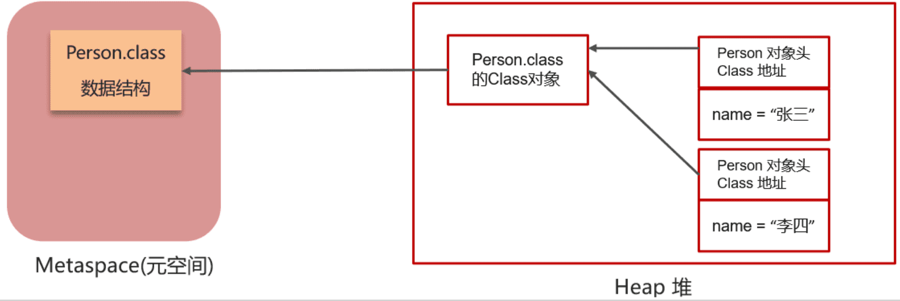
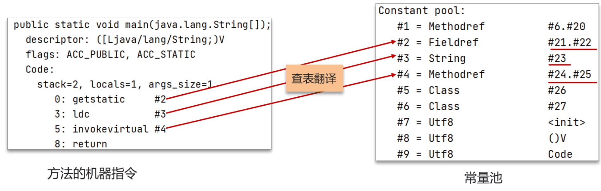
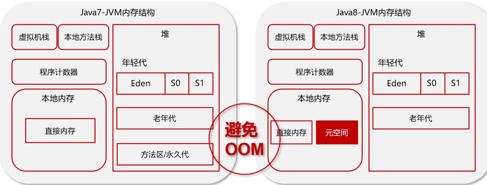

‍

‍

## 概念

‍

### java是编译型语言还是解释型语言？ java编译完之后是编译模式还是解释？为什么java要这样设计？为什么不直接设计成解释型语言呢？

‍

Java 是一种编译型和解释型相结合的语言。

‍

#### 编译和解释过程

1. **编译**：Java 源代码（.java 文件）首先被编译器（javac）编译成字节码（.class 文件）。**字节码是一种中间表示形式，与具体的硬件平台无关**
2. **解释**：编译后的字节码由 Java 虚拟机（JVM）解释执行。JVM 是一个解释器，它将字节码逐行解释成机器码并执行。

‍

‍

#### 设计原因

1. **跨平台性**：Java 设计成编译和解释相结合的模式，主要是为了实现“一次编写，到处运行”的跨平台特性。字节码与平台无关，可以在任何安装了 JVM 的系统上运行
2. **性能优化**：JVM 可以在运行时进行各种优化，如即时编译（JIT），将热点代码编译成机器码，提高执行效率
3. **安全性**：字节码可以在 JVM 中运行，JVM 提供了沙箱机制，可以有效地隔离和保护系统资源，增强安全性

‍

‍

#### 为什么不直接设计成解释型语言(其实差不多一件事)

Java 通过编译和解释相结合的设计，实现了跨平台性、性能优化和安全性等多方面的平衡

1. **性能**：纯解释型语言的执行效率较低，因为每次执行都需要**逐行解释**代码。Java 通过编译成字节码并结合 JIT 编译，可以在保持跨平台性的同时提高性能。 （不然这样就得每个系统构建单独的解释器）
2. **优化**：编译成字节码后，JVM 可以在运行时进行各种优化，提高代码执行效率。
3. **开发效率**：编译型语言可以在**编译时**发现语法和类型错误，提高开发效率和代码质量。

‍

‍

‍

‍

#### JVM 原理概述

你咋理解的JVM原理 (泛泛谈)

‍

Key

1. 讲标准与实现
2. 跨平台问题
3. JMM内存管理
4. JVM模型
5. 不同的垃圾回收器

‍

> 一段答： JVM就是说java虚拟机，我们的class文件运行在虚拟机上，通过虚拟机解决了跨平台的问题，jvm中有jmm来管理java内存访问的方式，不同的jvm实现性能关注有差异，现在主流的实现是Hotspot，垃圾回收器是G1，jvm运行时内存中分为...，执行代码时需要执行引擎

‍

‍

## 执行流程

‍

### 什么是类卸载？在哪些条件下会发生？

类卸载是指 Java 虚拟机 (JVM) 将不再使用的类从内存中移除的过程。类卸载可以释放内存资源，减少内存占用。

类卸载通常在以下条件下发生：

1. **类加载器被卸载**：当一个**类加载器被卸载**时，它加载的所有类也会被卸载。类加载器的卸载通常发生在应用程序或模块被卸载时，例如在应用服务器中卸载一个 Web 应用程序。
2. **没有对类的引用**：当 JVM 确定没有任何活动的线程或类对某个类有引用时，该类可能会被卸载。这通常发生在类加载器被卸载后，且没有其他类加载器引用该类的情况下。
3. **垃圾回收**：类卸载通常与**垃圾回收** (GC) 过程相关联。当垃圾回收器运行时，它会检查是否有类加载器和类可以被卸载。如果满足条件，这些类将被卸载。

需要注意的是，类卸载在 JVM 中是一个相对复杂的过程，具体行为可能因 JVM 实现的不同而有所差异。

‍

‍

### 创建一个类对象，这个类是什么时候被加载的，加载的入口是什么，是谁调用 ClassLoader.loadClass() 方法的

* **类的加载时机**：类在首次主动使用时被加载。
* **加载的入口**：通过`Class.forName()`​、`ClassLoader.loadClass()`​或隐式调用触发。
* **调用**​**​`ClassLoader.loadClass()`​** ​**的方法**：JVM在需要加载类时调用`ClassLoader.loadClass()`​方法，首先检查类是否已加载，未加载则委托父类加载器，最终由根类加载器加载。

‍

‍

### 讲讲从编写Java代码到执行的流程，越详细越好（编译、JVM、操作系统、CPU \<-\> 内存）

‍

（1） 编写 Java 代码

编写 Java 源代码文件，文件扩展名为 `.java`​。

‍

（2）编译

Java 源代码通过javac编译成字节码，文件名扩展为.class

‍

（3）类加载

类加载器将 `.class`​ 文件加载到 JVM 的方法区中。类加载过程：

* **加载（Loading）** ：从文件系统或网络中读取 `.class`​ 文件。
* **链接（Linking）** ：验证字节码的正确性，准备静态变量和方法，解析符号引用。
* **初始化（Initialization）** ：执行类的静态初始化块和静态变量赋值。

‍

（4）执行字节码

执行引擎负责解释和执行字节码。JVM 提供了两种执行方式：

* **解释执行**：逐行解释字节码，速度较慢。
* **即时编译（JIT）** ：将热点代码编译成机器码，提高执行效率。

‍

（5）操作系统

JVM 作为一个进程运行在操作系统上。操作系统负责管理进程、内存、文件系统和 I/O 操作。JVM 通过操作系统调用（System Call）与硬件交互。

‍

（6）cpu和内存

JVM 将字节码编译成机器码后，CPU 通过指令集执行这些机器码指令。内存用于存储运行时数据，如对象实例、方法调用栈等。

‍

‍

### 类加载流程

类的生命周期会经历以下 7 个阶段, 平常所说的 JVM 类加载通常指的就是前五个阶段：加载、验证、准备、解析、初始化

‍

1. **加载** （Loading）
2. **连接** （Linking）

    1. 验证 （Verification）
    2. 准备 （Preparation）
    3. 解析 （Resolution）
3. **初始化**（Initialization）

    ---
4. 使用阶段（Using）
5. 卸载阶段（Unloading）

‍

简单扩展

‍

> 1. 加载：
>
>     1. 加载阶段需要用到类加载器
>     2. 通过全类名获取定义此类的**二进制字节流**
>     3. 将字节流所代表的静态存储结构转换为方法区的数据结构
>     4. 在内存中生成一个代表该类的Class对象，作为方法区这些数据访问的入口
> 2. 验证：校验一下 **.class文件是否正确**，比如文件格式、语义方面、符号方面等
> 3. 准备：主要为类变量**分配内存**并设置初始值（数据类型的默认值而不是被赋与的默认值）。类变量主要是在**方法区**中操作。其中类变量会分配内存，而实例变量不会，实例变量随着对象实例化分配到**堆内存**中
> 4. 解析：将常量池中符号引用转化为直接引用。主要针对类、接口、字段、方法、方法类型等的引用。
> 5. 初始化：主要为类的静态变量赋值，可以通过类变量指定初始值或者静态代码块指定初始值。（类的初始化触发条件：new一个类/调用类的静态变量或方法/反射/初始化类的子类）

‍

> 需要注意的是加载阶段和连接阶段的部分动作有可能是**交叉执行**的，比如一部分字节码文件格式的验证，在加载阶段还未完成时就已经开始验证了

‍

‍

#### 1. 加载阶段

此阶段用于查到相应的类（通过类名进行查找）并将此类的字节流转换为方法区运行时的数据结构，然后再在内存中生成一个能代表此类的 `java.lang.Class`​ 对象，作为其他数据访问的入口

‍

* 通过类的全名，获取类的二进制数据流。
* 解析类的二进制数据流为方法区内的数据结构（Java类模型）
* 创建java.lang.Class类的实例，表示该类型。作为访问该类在方法区中的数据的入口

​

‍

加载 class 文件原理关键点：

1. 类加载器
2. 魔数
3. 元空间

‍

‍

##### 类加载器

负责加载class文件，class文件在文件开头有特定的文件标示，并且ClassLoader只负责class文件的加载，至于它是否可以运行，则由Execution Engine决定

‍

> ~ ClassLoader

* 启动类加载器（Bootstrap）C++    最顶层加载器，主要加载核心类库

  负责加载 $JAVA_HOME中 jre/lib/**rt.jar** 里所有的class，由C++实现，不是ClassLoader子类

  也叫系统类加载器，负责加载**classpath**中指定的jar包及目录中class
* 扩展类加载器（Extension）Java    扩展的类加载器，加载扩展包的类库

  负责加载java平台中**扩展功能**的一些jar包，包括$JAVA_HOME中jre/lib/*.jar或-Djava.ext.dirs指定目录下的jar包
* 应用程序类加载器（App）Java    加载当前应用的根目录下所有类
* 用户自定义加载器   继承Java.lang.ClassLoader，用户定制类的加载方式; 前三种为虚拟机自带的加载器

‍

‍

工作过程 - 双亲委派机制

1. 当AppClassLoader 加载一个class时，它首先不会自己去尝试加载这个类，而是把类加载请求委派给父类加载器ExtClassLoader去完成。
2. 当ExtClassLoader 加载一个class时，它首先也不会自己去尝试加载这个类，而是把类加载请求委派给BootStrapClassLoader去完成
3. (顶层) 如果 BootStrapClassLoader 加载失败（例如在$JAVA_HOME/jre/lib里未查找到该class），会使用ExtClassLoader来尝试加载；
4. 若ExtClassLoader也加载失败，则会使用AppClassLoader来加载
5. 如果AppClassLoader也加载失败，则会报出异常ClassNotFoundException

‍

类加载器的体系并不是“继承”体系，而是**委派体系**，类加载器首先会到自己的parent中查找类或者资源，如果找不到才会到自己本地查找。类加载器的委托行为动机是为了避免相同的类被加载多次。

这就是所谓的**双亲委派模型**。如果一个类加载器收到了类加载的请求，它首先不会自己去尝试加载这个类，而是把**请求委托给父加载器去完成，依次向上**

‍

好处：

（1）通过双亲委派机制可以避免某一个类被重复加载，当父类已经加载后则无需重复加载，保证唯一性。 | **防止内存中出现多份同样的字节码**(安全性角度) (顶层优先, 防止核心的被篡改)

（2）为了安全，保证类库API不会被修改(重名报错)

‍

> 比如加载位于 rt.jar 包中的类 java.lang.Object，不管是哪个加载器加载这个类，最终都是委托给顶层的启动类加载器进行加载，这样就保证了使用不同的类加载器最终得到的都是同样一个 Object对象。

‍

‍

##### **魔数 0xCAFEBABE**

* Class文件开头的四个字节的无符号整数称为魔数(Magic Number)
* 魔数是Class文件的标识。值是固定的，为**0xCAFEBABE**
* 如果一个Class文件的头四个字节不是0xCAFEBABE，虚拟机在进行文件校验的时候会报错。使用魔数而不是扩展名来识别Class文件，主要是基于安全方面的考虑，因为文件扩展名可以随意更改

‍

---

连接

---

#### 2. 验证阶段

校验 + 拆包

此步骤主要是为了验证字节码的安全性，如果不做安全校验的话可能会载入非安全或有错误的字节码，从而导致系统崩溃，它是 JVM 自我保护的一项重要举措。

‍

校验对象

* **文件格式校验**    包括常量池中的常量类型、Class 文件的各个部分是否被删除或被追加了其他信息等； 检查类文件的魔数 0xCAFEBABE 以确保文件格式正确
* **元数据校验**    包括父类正确性校验（检查父类是否有被 final 修饰）、抽象类校验...类中的字段、方法是否与父类产生矛盾等
* **字节码校验**    最为关键和复杂，通过对数据流和控制流的分析，校验程序中的语义是否合法且符合逻辑
* **符号引用校验**    符号引用以一组符号来描述所引用的目标，符号可以是任何形式的字面量, 这里主要是对类自身以外比如常量池中的各种符号引用的信息进行匹配性校验

‍

‍

#### 3. 准备阶段

初始化 + 分配内存

此阶段是用来**初始化**并为类中定义的**静态变量分配内存**的，这些**静态变量会被分配到方法区**上 -> HotSpot 虚拟机在 JDK 1.7 之前都在方法区，而 JDK 1.8 之后此变量会随着类对象一起存放到 Java 堆中

‍

**为类变量分配内存并设置类变量初始值, 这里有特殊的静态变量情况:**  

* static变量，分配空间在准备阶段完成（设置默认值），赋值在初始化阶段完成
* static变量是final的基本类型，以及字符串常量，值已确定，赋值在准备阶段完成
* static变量是final的引用类型，那么赋值也会在初始化阶段完成

‍

#### 4. 解析阶段

翻译 + 连接

此阶段主要是用来解析类、接口、字段及方法的，解析时会把符号引用替换成直接引用

‍

所谓的符号引用是指以**一组符号来描述所引用的目标**，符号可以是任何形式的字面量，只要使用时能无歧义地定位到目标即可；而直接引用是可以直接指向目标的指针、相对偏移量或者是一个能间接定位到目标的句柄。

符号引用和直接引用有一个重要的区别：使用符号引用时被引用的目标不一定已经加载到内存中；而**使用直接引用时，引用的目标必定已经存在虚拟机的内存中了**。

‍

‍

#### 5. 初始化

初始化阶段 JVM 就正式开始执行类中编写的 Java 业务代码了。到这一步骤之后，类的加载过程就算正式完成了

‍

**对类的静态变量，静态代码块执行初始化操作**

* 如果初始化一个类的时候，其父类尚未初始化，则优先初始化其父类
* 如果同时包含多个静态变量和静态代码块，则按照自上而下的顺序依次执行

‍

#### 6. 使用

JVM 开始从入口方法开始执行用户的程序代码

* 调用静态类成员信息（比如：静态字段、静态方法）
* 使用new关键字为其创建对象实例

‍

‍

#### 7. 卸载

当用户程序代码执行完毕后，JVM 便开始销毁创建的 Class 对象，最后负责运行的 JVM 也退出内存

‍

### JVM 保证内存分配的并发安全

* **TLAB（Thread Local Allocation Buffer）** ：这是一种避免共享的策略。每个线程预先在Java堆中分配一小块内存，称为本地线程分配缓冲区（TLAB）。线程需要分配内存时，首先在自己的TLAB上分配，只有TLAB用尽并重新分配时，才需要同步锁定。这样大大减少了锁的竞争。
* **CAS（Compare And Swap）+ 失败重试**：在没有使用TLAB或者TLAB用尽需要在共享空间分配内存时，JVM采用CAS操作（比较并交换）来保证更新操作的原子性。如果CAS操作失败（说明有其他线程也在分配内存），则进行失败重试，直到成功为止。

‍

#### 怎么做到多线程同时去分配和回收，效率特别高的？

在多线程环境下，为了提高内存分配效率，JVM 还会使用一些线程本地内存分配（Thread-local allocation buffers, TLAB）来减少锁竞争。单个线程内的小对象内存分配可直接在 TLAB 中进行，避免了同步开销。当 TLAB 使用完后，再从全局堆内存申请更多的内存。

‍

#### jvm怎么向系统申请内存

* 根据 -Xms 参数，JVM 会在启动时向操作系统申请分配初始堆内存。通过 mmap 或 malloc 来分配内存。
* 根据 -XX:MetaspaceSize 和 -XX:MaxMetaspaceSize 参数，JVM 会为方法区（元空间）保留空间。同样使用操作系统的内存分配 API。
* 每当创建新的线程，JVM 会为其分配栈空间，大小由 -Xss 参数决定。

‍

‍

‍

‍

### JVM 执行流程 / 运行流程描述 / 写的代码在CPU怎么跑起来的

SK描述:

> 1. Java 代码（.java）由 Java 编译器（javac）转化成字节码（.class）
> 2. 通过类加载器将字节码加载到JVM的内存中 (RDA)
> 3. 字节码并不是可以直接交给操作系统执行的机器码，而是一套 JVM 的指令集
> 4. 这个时候需要使用特定的解释器也就是**执行引擎（Execution Engine）** 将其翻译成可以被底层操作系统执行的指令再去执行
> 5. 热点代码可以用 JIT 即时编译器来直接做成机器码, 不需要解释器去一个个解释了
> 6. 放CPU里面跑, 之后就是操作系统的内容了

‍

正式

1. **编译**：Java 源代码（.java 文件）首先被编译成字节码（.class 文件）。这个过程由 Java 编译器（javac）完成
2. **类加载**：Java 虚拟机（JVM）启动时，会通过类加载器（ClassLoader）将字节码加载, 运行时数据区（Runtime Data Area）把字节码加载到内存中
3. **字节码解释**：JVM 执行引擎有一个解释器（Interpreter），它逐行解释字节码并将其转换为机器码，供 CPU 执行。（Execution Engine）将字节码翻译为底层系统指令，再交由CPU执行去执行. 此时需要调用其他语言的本地库接口（Native Method Library）来实现整个程序的功能
4. **即时编译（JIT）** ：为了提高性能，JVM 还包含一个即时编译器（Just-In-Time Compiler, JIT）。JIT 会将热点代码（频繁执行的代码）编译成本地机器码，以提高执行效率。
5. **执行**：编译后的机器码在 CPU 上执行 (一转操作系统) : 这个过程确保了 Java 代码可以在不同的平台上运行，而无需修改源代码。

运行流程：

‍

流图

```plaintext
Java 源代码 (.java)  -->  编译 (javac)  -->  字节码 (.class)  -->  类加载 (ClassLoader)  -->  字节码解释 (Interpreter)  -->  即时编译 (JIT)  -->  机器码  -->  CPU 执行
```

‍

‍

‍

运行流程：

（1）类加载器（ClassLoader）把Java代码转换为字节码

（2）运行时数据区（Runtime Data Area）把字节码加载到内存中，而字节码文件只是JVM的一套指令集规范，并不能直接交给底层系统去执行，而是有执行引擎运行

（3）执行引擎（Execution Engine）将字节码翻译为底层系统指令，再交由CPU执行去执行，此时需要调用其他语言的本地库接口（Native Method Library）来实现整个程序的功能。

垃圾回收器：用于对JVM中的垃圾内容进行回收

‍

‍

### 如何破坏双亲委派模型

‍

1. 集成 Classloader 抽象类

    JDK1.2前保留的, 继承 ClassLoader 抽象类, 重写 loadClass() 

    如果不想打破双亲委派模型，就重写 `ClassLoader`​ 类中的 **​`findClass()`​** ​ **方法**即可，无法被父类加载器加载的类最终会通过这个方法被加载
2. 使用线程上下文类加载器

    用 java.lang.Thread 中的 setContextClassLoader() 设置当前类的类加载器

    场景: 顶层加载器需要调用下层加载器的情况

    * 比如启动加载器里面的JDBC驱动的情况, 很明显jdbc只是个声明, 需要去调用应用类加载器里的各个厂商的驱动类.

      因此就有了线程上下文类加载器, 可以把这个原本需要启动的改成应用的
    * 比如Tomcat容器也是

‍

### 方法区中的方法的执行过程

**解析方法调用**：JVM会根据方法的符号引用找到实际的方法地址

**栈帧创建**：在调用一个方法前，JVM会在当前线程的Java虚拟机栈中为该方法分配一个新的栈帧

**执行方法**：执行方法内的字节码指令

**返回处理**：方法执行完毕后，可能会返回一个结果给调用者，并清理当前栈帧，恢复调用者的执行环境。

‍

‍

## 架构区域

‍

### **JVM由哪些部分组成**

先说JVM 的种类有很多，JVM 其实泛指的是 HotSpot 虚拟机:  Sun/OracleJDK 和 OpenJDK 中的默认 JVM，也是目前使用范围最广的 JVM。 无论是什么类型的虚拟机都必须遵守 Oracle 官方发布的《Java虚拟机规范》

> 需要注意的是《Java虚拟机规范》只规定了有这么几个区域，但没有规定 JVM 的具体实现细节，因此对于不同的 JVM 来说，实现也是不同的。例如，“永久代”是 HotSpot 中的一个概念，而对于 JRockit 来说就没有这个概念。所以很多人说的 JDK 1.8 把永久代转移到了元空间，这其实只是 HotSpot 的实现，而非《Java虚拟机规范》的规定

‍

那么SK的回答, 会有两层:

> 外层, 总体工作区块

* ClassLoader（类加载器）
* Runtime Data Area（运行时数据区，即java内存）
* Execution Engine（执行引擎）
* Native Method Library（本地库接口）

> 内层, 就是 RDA (下面这条)

‍

‍

### JVM 运行时数据区域 RDA (RuntimeDataArea) 包含哪几部分? / JVM内存布局

> RDA从类加载子系统 (加载器) 拿到目标, 在RDA这个大搅拌机里面处理 <-> 执行引擎 + 本地库

总体而言: 

* 堆 Heap    

  * 新生代    From/To 伊甸
  * ‍
* 栈 Stack

  1. 本地方法栈 Native Method Stack
  2. 虚拟机栈 Java Virtual Machine Stack
* 方法区 Method Area
* 程序计数器 Program Counter Register

‍

区分独占和共享:

* 线程独占 : 栈 (每个便签) + PC (指针)

  1. 栈

      * 虚拟机栈
      * 本地方法栈
  2. 程序计数器
* 共享内存 (线程) : 堆 (一堆零件) + 方法区 (扳手)

  1. 堆 ( + 运行时常量池 )
  2. 方法区

‍

下面是细则

‍

#### 1.堆 ( + 运行时常量池)

堆（Java Heap）也叫 Java 堆或者是 GC 堆, JVM 中占用内存最大的一块区域，Java 中"所有对象"都存储在这里, 垃圾收集器管理的主要区域

堆大小的值可通过 -Xms 和 -Xmx 来设置（设置最小值和最大值），当堆超过最大值时就会抛出 OOM（OutOfMemoryError）异常

> 《Java虚拟机规范》对 Java 堆的描述是：“所有的对象实例以及数组都应当在堆上分配”。但这在技术日益发展的今天已经有点不那么“准确”了，比如 JIT（Just In Time Compilation，即时编译 ）优化中的**逃逸分析**，使得变量可以**直接在栈上被分配**

‍

* 运行时常量池：用于 存放class文件中的字面量（文本字符串、被final修饰的常量、基本数据类型值等）和符号引用（字段、方法描述符）。JDK1.7之后JVM将常量池从方法区中移除，直接放入堆中。

‍

堆内存是GC的主要管理区域，分为 新生代（包括Eden区、From Survivor区和To Survivor区）和老年代（Tenured区）

‍

‍

#### 2.方法区

方法区曾称为永久代, 或是说**本地内存**的元空间。JDK1.8后(Hotspot)使用**直接内存的元空间**代替了永久代

方法区（Method Area） 也被称为**非堆区**，用于和 “Java 堆” 的概念进行区分，它也是**线程共享的内存区域**，用于存储已经被 JVM 加载的类型信息、常量、静态变量、代码缓存等数据。

‍

> 说到方法区有人可能会联想到 “永久代”，但对于《Java虚拟机规范》来说**并没有规定**这样一个区域，同样它也只是 HotSpot 中特有的一个概念。这是因为 HotSpot 技术团队把垃圾收集器的分代设计扩展到方法区之后才有的一个概念，可以理解为 HotSpot 技术团队只是用永久代来实现方法区而已，但这会导致一个致命的问题，这样设计更容易造成**内存溢出**
>
> 因为永久代有 -XX：MaxPermSize（方法区分配的最大内存）的上限，即使不设置也会有默认的大小。这样设计导致了部分的方法在不同类型的 Java 虚拟机下的表现也不同，比如 String::intern() 方法
>
> 所以在 JDK 1.7 时 HotSpot 虚拟机已经把原本放在永久代的字符串常量池和静态变量等移出了方法区，并且在 JDK 1.8 中完全废弃了永久代的概念。

‍

‍

#### 3.程序计数器

程序计数器（Program Counter Register）线程独有一块很小的内存区域，保存当前线程所执行字节码的位置，包括正在执行的指令、跳转、分支、循环、异常处理等

‍

‍

#### 4.虚拟机栈

也叫 Java 虚拟机栈（Java Virtual Machine Stack）, 用来描述 Java 方法的执行

‍

虚拟机栈由一个个的栈帧组成，每个栈帧包括局部变量表、操作数栈、动态链接、方法出口信息。

> * 局部变量表: 存放方法内的局部变量
> * 操作数栈：用来执行操作
> * 动态链接：用来处理多态的引用
> * 返回地址：用来处理返回

在每个方法被执行时就会同步创建一个**栈帧**，用来存储局部变量表、操作栈、动态链接、方法出口等信息。

调用方法时执行入栈，而方法返回时执行出栈。

‍

‍

#### 5.本地方法栈

本地方法栈（Native Method Stacks）与虚拟机栈类似，它是线程独享的，并且作用也和虚拟机栈类似。只不过虚拟机栈是为虚拟机中执行的 Java 方法服务的，而本地方法栈则是为虚拟机使用到的**本地（Native）方法**服务。

‍

‍

‍

### 组件是公有还是私有的?

‍

#### 程序计数器为什么私有

程序计数器主要有两个作用

1. **字节码解释器**通过改变程序计数器来依次**读取指令**，从而实现代码的流程控制，如：顺序执行、选择、循环、异常处理。
2. 在多线程的情况下，程序计数器用于记录当前线程执行的位置，从而当线程被切换回来的时候能够知道该线程上次运行到哪儿了

    > 需要注意的是，如果执行的是 native 方法，那么程序计数器记录的是 undefined 地址，只有执行的是 Java 代码时程序计数器记录的才是下一条指令的地址
    >

所以，程序计数器私有主要是为了**线程切换后能恢复到正确的执行位置, 就是保证其正常功能的进行**

‍

‍

#### 虚拟机栈和本地方法栈为什么是私有的?

‍

* **虚拟机栈：**  每个 Java 方法在执行的同时会创建一个栈帧用于存储局部变量表、操作数栈、常量池引用等信息。从方法调用直至执行完成的过程，就对应着一个栈帧在 Java 虚拟机栈中入栈和出栈的过程。
* **本地方法栈：**  和虚拟机栈所发挥的作用非常相似，区别是：**虚拟机栈为虚拟机执行 Java 方法 （也就是字节码）服务，而本地方法栈则为虚拟机使用到的 Native 方法服务。**  在 HotSpot 虚拟机中和 Java 虚拟机栈合二为一

所以，为了**保证线程中的局部变量不被别的线程访问到**，虚拟机栈和本地方法栈是线程私有的。

‍

‍

### 直接内存

不受 JVM 内存回收管理，是虚拟机的系统内存，常见于 NIO 操作时，用于数据缓冲区，分配回收成本较高，但读写性能高

‍

#### 不同传输模型

‍

##### **传统阻塞IO的数据传输流程**

1. 用户从用户态转换到内核态, 去发起磁盘IO请求, 等待从内存接受读取到内存的数据
2. 磁盘把东西准备好之后, 要发给内存. 这首先需要走系统内存的系统缓存区
3. 系统缓存区通过JVM给Java堆内存, 之后CPU的线程才能从JVM中拿到 (关于JAVA线程和系统内存的差别见JUC)
4. 用户线程拿到了java缓冲区中的数据, 从内核态转化为用户态
5. 继续执行

‍

**结构**

* CPU

  * 用户态
  * --屏障
  * 内核态
* 内存

  * Java堆内存 java缓冲区 (byte[])
  * --屏障
  * 系统内存 系统缓冲区
* 外存(磁盘)

‍

‍

##### **NIO传输数据的流程**

使用到了一个直接内存，不需要在堆中开辟空间进行数据的拷贝，jvm可以直接操作直接内存，从而使数据读写传输更快

1. 用户从用户态转换到内核态, 去发起磁盘IO请求, 等待从内存接受读取到内存的数据
2. 磁盘把东西准备好之后, 要发给直接内存
3. CPU的线程从直接内存拿到数据
4. 用户线程拿到了java缓冲区中的数据, 从内核态转化为用户态
5. 继续执行

‍

**结构**

* CPU

  * 用户态
  * --屏障
  * 内核态
* 内存 - 直接内存
* 外存(磁盘)

‍

‍

#### 应用 - 本地内存实现的元空间

直接内存, 又叫做**堆外内存**，**线程共享的区域**

在 Java 8 之前有个**永久代**的概念，实际上指的是 HotSpot 虚拟机上的永久代，它用永久代实现了 JVM 规范定义的方法区功能，**主要存储类的信息，常量，静态变量**，即时编译器编译后代码等，这部分由于是在堆中实现的，受 GC 的管理，不过由于永久代有 -XX:MaxPermSize 的上限，所以如果大量动态生成类（将类信息放入永久代），很容易造成 OOM，有人说可以把永久代设置得足够大，但很难确定一个合适的大小，受类数量，常量数量的多少影响很大。

所以在 Java 8 中就把方法区的实现移到了本地内存中的元空间中，这样方法区就不受 JVM 的控制了,也就不会进行 GC，也因此提升了性能。

‍

‍

### 组件为什么移动了?

‍

#### 为啥要把字符串常量池移到堆中？

**字符串常量池** 是 JVM 为了提升性能和减少内存消耗针对字符串（String 类）专门开辟的一块区域，主要目的是为了避免字符串的重复创建

因为永久代（方法区实现）的 GC 回收效率太低，只有在整堆收集 (Full GC)的时候才会被执行 GC。Java 程序中通常会有大量的被创建的字符串等待回收，将字符串常量池放到堆中，能够更高效及时地回收字符串内存。

‍

#### 为什么要将永久代 (PermGen) 替换为元空间 (MetaSpace) 呢?

* 整个永久代有一个 JVM 本身设置的固定大小上限，无法进行调整，更容易出现内存溢出，而元空间使用的是本地内存，受本机可用内存的限制，虽然仍旧可能溢出，但是比原来出现的几率会更小。
* 元空间里面存放的是类的元数据，这样加载多少类的元数据就不由 `MaxPermSize`​ 控制了, 而由系统的实际可用空间来控制，这样能加载的类就更多了
* 在 JDK8，合并 HotSpot 和 JRockit 的代码时, JRockit 从来没有一个叫永久代的东西, 合并之后就没有必要额外的设置这么一个永久代的地方了
* 永久代会为 GC 带来不必要的复杂度，并且回收效率偏低。

‍

### 堆内存组织

‍

#### 堆

* 新生代

  * **eden**
  * survivor0
  * survivor1
* 老年代
* 永久代 (1.8前) -> 方法区(规范)
* 元空间 (使用直接内存 不进行GC)

‍

‍

#### **常量池**

分为字符串常量池和运行时常量池

1.8之后字符串常量池在堆中，而运行时常量池在元空间

‍

‍

## GC合集

‍

### 简述对Java垃圾回收机制的理解

为了让程序员更专注于代码的实现，而不用过多的考虑内存释放的问题，所以，在Java语言中，有了自动的垃圾回收机制，也就是我们熟悉的GC(Garbage Collection)。

有了垃圾回收机制后，程序员只需要关心内存的申请即可，内存的释放由系统自动识别完成。

在进行垃圾回收时，不同的对象引用类型，GC会采用不同的回收时机

换句话说，自动的垃圾回收的算法就会变得非常重要了，如果因为算法的不合理，导致内存资源一直没有释放，同样也可能会导致内存溢出的。

当然，除了Java语言，C#、Python等语言也都有自动的垃圾回收机制

‍

‍

### 类引用类型

‍

#### 强引用

常用的普通对象的引用，**当JVM内存不足时会抛出 OutOfMemoryError 错误使程序停止**，也不会去回收强引用的对象。**被赋值为null**后可以被垃圾收集器回收

只有所有 GC Roots 对象都不通过【强引用】引用该对象，该对象才能被垃圾回收

```java
User user = new User();
```

‍

‍

> ```text
> Person p = new Person()
> ```
>
> 在等号的左边，就是一个对象的引用，存储在栈中
>
> 而等号右边，就是实例化的对象，存储在堆中
>
> 其实这样的一个引用关系，就被称为强引用

‍

> 强引用最为普通的引用方式，表示一个对象处于**有用且必须**的状态，如果一个对象具有强引用，则GC并不会回收它。即便堆中内存不足了，宁可出现OOM，也不会对其进行回收

‍

‍

‍

#### 软引用

通过SoftReference类实现，当JVM**内存不足时，才会去回收软引用的对象**，以防止出现OutOfMemoryError错误

* 可以调用ReferenceQueue的poll()方法来检查指定对象是否被回收
* 软引用可以用于内存不足的缓存中

仅有软引用引用该对象时，在垃圾回收后，内存仍不足时会再次出发垃圾回收

```java
User user = new User();
SoftReference softReference = new SoftReference(user);
```

‍

> 软引用表示一个对象处于**有用且非必须**状态，如果一个对象处于软引用，在内存空间足够的情况下，GC机制并不会回收它，而在内存空间不足时，则会在OOM异常出现之间对其进行回收。但值得注意的是，因为GC线程优先级较低，软引用并不会立即被回收。

‍

> 软引用是一种相对弱化了一些的引用，需要用Java.lang.ref.SoftReference类来实现，可以让对象豁免一些垃圾收集，对于只有软引用的对象来讲：
>
> * 当系统内存充足时，它不会被回收
> * 当系统内存不足时，它会被回收
>
> 软引用通常在对内存敏感的程序中，比如高速缓存就用到了软引用，内存够用 的时候就保留，不够用就回收

‍

#### 弱引用

通过 WeakReference 类实现，当垃圾收集器发现了弱引用的对象，**不管当前内存空间是否足够，都会回收对象**

* 在下一次垃圾回收时，垃圾回收器会回收所有只有弱引用指向的对象 (他不会阻止回收)
* 因为垃圾回收器是一个优先级很低的线程，因此弱引用可能会存活很长一段时间
* 弱引用被回收时，会把弱引用加入到与之关联的引用队列ReferenceQueue中

仅有弱引用引用该对象时，在垃圾回收时，无论内存是否充足，都会回收弱引用对象

```java
User user = new User();
WeakReference weakReference = new WeakReference(user);
```

‍

> 弱引用表示一个对象处于**可能有用且非必须**的状态。在GC线程扫描内存区域时，一旦发现弱引用，就会回收到弱引用相关联的对象。对于弱引用的回收，无关内存区域是否足够，一旦发现则会被回收。同样的，因为GC线程优先级较低，所以弱引用也并不是会被立刻回收。

> 不管内存是否够，只要有GC操作就会进行回收
>
> 弱引用需要用 `java.lang.ref.WeakReference`​ 类来实现，它比软引用生存期更短
>
> 对于只有弱引用的对象来说，只要垃圾回收机制一运行，不管JVM的内存空间是否足够，都会回收该对象占用的空间。

‍

#### 虚引用

通过 PhantomReference 类实现，我们无法通过虚引用访问对象，垃圾收集器随时可以回收它。当垃圾回收器准备回收一个对象时，如果发现它还有虚引用，就会在回收对象的内存之前，把这个虚引用加入到与之关联的引用队列中。可以通过判断是否加入了引用对象来判断对象是否被回收

必须配合引用队列使用，被引用对象回收时，会将虚引用入队，由 Reference Handler 线程调用虚引用相关方法释放直接内存

‍

> 虚引用表示一个对象处于**无用**的状态。在任何时候都有可能被垃圾回收。虚引用的使用必须和引用队列Reference Queue联合使用

‍

> 一般用于在回收时候做通知相关操作
>
> 虚引用又称为幽灵引用，需要`java.lang.ref.PhantomReference`​ 类来实现
>
> 顾名思义，就是形同虚设，与其他几种引用都不同，虚引用并不会决定对象的生命周期。
>
> 如果一个对象持有虚引用，那么它就和没有任何引用一样，在任何时候都可能被垃圾回收器回收，它不能单独使用也不能通过它访问对象，虚引用必须和引用队列ReferenceQueue联合使用。
>
> ‍
>
> 虚引用的主要作用和跟踪对象被垃圾回收的状态，仅仅是提供一种确保对象被finalize以后，做某些事情的机制。
>
> PhantomReference的get方法总是返回null，因此无法访问对象的引用对象。其意义在于说明一个对象已经进入finalization阶段，可以被gc回收，用来实现比finalization机制更灵活的回收操作
>
> 换句话说，设置虚引用关联的唯一目的，就是在这个对象被收集器回收的时候，收到一个系统通知或者后续添加进一步的处理，Java技术允许使用finalize()方法在垃圾收集器将对象从内存中清除出去之前，做必要的清理工作
>
> ‍
>
> 这个就相当于Spring AOP里面的后置通知

‍

‍

#### 软引用和弱引用的使用场景

‍

场景：假如有一个应用需要读取大量的本地图片

* 如果每次读取图片都从硬盘读取则会严重影响性能
* 如果一次性全部加载到内存中，又可能造成内存溢出

此时使用软引用可以解决这个问题

‍

设计思路：使用HashMap来保存图片的路径和相应图片对象关联的软引用之间的映射关系，在内存不足时，JVM会自动回收这些缓存图片对象所占的空间，从而有效地避免了OOM的问题

```text
Map<String, SoftReference<String>> imageCache = new HashMap<String, SoftReference<Bitmap>>();
```

‍

#### WeakHashMap是什么？

比如一些常常和底层打交道的，mybatis等，底层都应用到了WeakHashMap

WeakHashMap和HashMap类似，只不过它的Key是使用了弱引用的，也就是说，当执行GC的时候，HashMap中的key会进行回收

‍

‍

#### 引用队列 ReferenceQueue

软引用，弱引用，虚引用在回收之前，需要在引用队列保存一下

我们在初始化的弱引用或者虚引用的时候，可以传入一个引用队列

```text
Object o1 = new Object();

// 创建引用队列
ReferenceQueue<Object> referenceQueue = new ReferenceQueue<>();

// 创建一个弱引用
WeakReference<Object> weakReference = new WeakReference<>(o1, referenceQueue);
```

那么在进行GC回收的时候，弱引用和虚引用的对象都会被回收. 但是在回收之前，它会被送至引用队列中

‍

‍

### 分代模型

‍

目前商用虚拟机的垃圾收集器都是基于分代收集的理论进行设计的

指将**不同“年龄”** 的数据**分配到不同的内存区域**中进行存储，所谓的“年龄”指的是**经历过垃圾收集的次数**。一般(JAVA堆)分为 老年代、新生代和永久代

> 这样就可以把那些朝生暮死的对象集中分配到一起，把不容易消亡的对象分配到一起，对于不容易死亡的对象我们就可以设置较短的垃圾收集频率，这样就能消耗更少的资源来实现更理想的功能了

‍

其中新生代用于存储刚刚创建的对象，这个区域内的对象存活率不高，而对于经过了一定次数的 GC 之后还存活下来的对象，就可以成功晋级到老生代了。

> 对于不同的实现有表述上的区别, 各自的具体结构也有不同

‍

#### 算法适配

这样就可以根据不同代采用不同收集算法，提高了垃圾回收效率:

* 老年代特点是每次垃圾收集时只有少量对象被回收，所以适合采用**标记整理**算法
* 新生代特点是每次垃圾回收时都有大量的对象需要被回收，所以适合采用**复制算法**，每次只需要复制少量存活对象

‍

‍

#### 流程讲述

关于分代回收是这样的

在java8时，堆被分为了两份：新生代和老年代，它们默认空间占用比例是1:2

对于新生代，内部又被分为了三个区域。Eden区，S0区，S1区默认空间占用比例是8:1:1

‍

具体的工作机制是

1）当创建一个对象的时候，那么这个对象会被分配在新生代的Eden区。当Eden区要满了时候，触发YoungGC。

2）当进行YoungGC后，此时在Eden区存活的对象被移动到S0区，并且**当前对象的年龄会加1**，清空Eden区。

3）当再一次触发YoungGC的时候，会把Eden区中存活下来的对象和S0中的对象，移动到S1区中，这些对象的年龄会加1，清空Eden区和S0区。

4）当再一次触发YoungGC的时候，会把Eden区中存活下来的对象和S1中的对象，移动到S0区中，这些对象的年龄会加1，清空Eden区和S1区。

5）对象的年龄达到了某一个限定的值（**默认15岁** ），那么这个对象就会进入到老年代中。

‍

当然也有特殊情况，如果进入Eden区的是一个大对象，在触发YoungGC的时候，会直接存放到老年代

当老年代满了之后，**触发FullGC --FullGC同时回收新生代和老年代**，当前只会存在一个FullGC的线程进行执行，其他的线程全部会被挂起 (STW) 

‍

‍

#### 讲一下新生代、老年代、永久代的区别？

‍

**新生代**    主要用来存放新生的对象。新生代又被进一步划分为 **Eden区** 和 **Survivor区**，Survivor 区由 **From Survivor** 和 **To Survivor** 组成

**老年代**    主要存放应用中生命周期长的内存对象。

**永久代**    指的是永久保存区域。主要存放Class和Meta（元数据）的信息。在Java8中，永久代已经被移除，取而代之的是一个称之为“元数据区”（**元空间**）的区域。元空间和永久代类似，不过元空间与永久代之间最大的区别在于：元空间并不在虚拟机中，而是使用本地内存。因此，默认情况下，**元空间的大小仅受本地内存的限制**。

‍

‍

### GC类型

* young GC：当新生代中的eden区内存满时会触发young GC，GC过后新生代一部分存活对象可能会升级到老年代中，导致老年代占用量上升。
* full GC：每次触发young GC时会判断GC后升级到老年代的对象占用内存是否大于老年代剩余的内存，如果大于，那么就不触发young GC转而触发full GC。如果老年代或者持久代被写满时也会触发full GC。调用System.gc()方法时也会触发full GC（一般GC由虚拟机决定，不会手动调用，即使调用了也不一定会触发）

‍

当然, 另一种分法也可以说成是三种的, 只回收新生代和只回收老年代, 还有一起回收

* Minor GC 发生在新生代的垃圾回收，暂停时间短
* Major GC 老年代区域的垃圾回收，老年代空间不足时，会先尝试触发Minor GC。Minor GC之后空间还不足，则会触发Major GC，Major GC速度比较慢，暂停时间长
* Full GC 新生代 + 老年代完整垃圾回收，暂停时间长，**应尽力避免**

‍

‍

#### 啥时候Full GC

1. **老年代（Old Generation）空间不足**：当老年代的内存空间不足以容纳新对象或晋升的对象时，会触发Full GC
2. **永久代（PermGen）或元空间（Metaspace）空间不足**：在Java 8之前，永久代空间不足会触发Full GC。在Java 8及之后，元空间不足也会触发Full GC
3. 可能是**调用System.gc()** ：显式调用`System.gc()`​方法会建议JVM进行Full GC，尽管JVM可以选择忽略这个建议
4. **老年代对象晋升失败**：当新生代对象晋升到老年代时，如果老年代没有足够的空间容纳这些对象，会触发Full GC
5. **大对象分配失败**：当需要分配一个大对象且老年代没有足够的连续空间时，会触发Full GC

‍

#### 为什么说full GC效率比较低

（1）full gc回收的范围大，需要回收新生代、老年代以及方法区。

（2）方法区的回收效率低，因为类被回收的判定条件比较苛刻

（3）full gc通常使用标记清除算法，标记阶段和清除阶段比较费时

（4）full gc时需要stop the world，阻塞其他的工作线程

‍

#### full gc频繁，有哪些原因

* 堆内存设置不合理 堆内存过小新生代和老年代比例不当 新生代设置过小会导致大量对象快速晋升到老年代，增加full gc的频率新生代设置过大有可能导致老年代过小，容易引发full gc
* 内存泄露 程序中的某些对象不再使用时没有被gc回收，导致堆内存被无用对象填满，触发full gc
* 对象创建过多 短生命周期对象过多，导致堆内存填满，触发gc大对象过多，直接分配在老年代，将其填满，触发full gc
* 垃圾回收器选择不当 GC算法不适合当前的应用场景
* 显示调用System.gc()
* 元空间不足 应用程序加载了大量类和方法

‍

‍

### GC算法

对象什么时候可以被垃圾器回收

简单一句就是：如果一个或多个对象没有任何的引用指向它了，那么这个对象现在就是垃圾，如果定位了垃圾，则有可能会被垃圾回收器回收。

如果要定位什么是垃圾，有两种方式来确定，第一个是引用计数法，第二个是可达性分析算法

‍

#### 死亡确认算法

(找到垃圾才能进行)

判断一个对象是否为死亡状态的常用算法有两个：引用计数器算法和可达性分析算法

‍

‍

##### **引用计数算法（Reference Counting）**

属于垃圾收集器最早的实现算法了，它是指在创建对象时关联一个与之相对应的计数器，当此对象被使用时加 1，相反销毁时 -1。当此计数器为 0 时，则表示此对象未使用，可以被垃圾收集器回收

‍

优点：

* 实时性较高，无需等到内存不够的时候，才开始回收，运行时根据对象的计数器是否为0，就可以直接回收。
* 在垃圾回收过程中，应用无需挂起。如果申请内存时，内存不足，则立刻报OOM错误。
* 区域性，更新对象的计数器时，只是影响到该对象，不会扫描全部对象。

缺点：

* 每次对象被引用时，都需要去更新计数器，有一点时间开销。
* **浪费CPU资源**，即使内存够用，仍然在运行时进行计数器的统计。
* **无法解决循环引用问题，会引发内存泄露**。（最大的缺点）

‍

‍

##### **可达性分析算法（Reachability Analysis）**

是目前商业系统中所采用的判断对象死亡的常用算法，它是指从对象的起点（GC Roots）开始向下搜索，如果对象到 GC Roots 没有任何引用链相连时，也就是说此对象到 GC Roots 不可达时，则表示此对象可以被垃圾回收器所回收

‍

**GC Roots**

在 Java 中可以作为 GC Roots 的对象, 主要就是不会被垃圾回收的玩意

‍

1. 所有被**同步锁**持有的对象，比如被 synchronize 持有的对象

    > 这些对象在多线程环境中被锁定，确保它们在同步块或方法执行期间不会被垃圾回收
    >
2. **字符串常量池**里的引用（String Table）

    > 字符串常量池中的字符串是全局共享的，JVM 会确保这些字符串在整个程序运行期间都存在，因此它们不会被垃圾回收。
    >
3. 类型为引用类型的静态变量；

    > 静态变量属于类本身，而不是类的实例。只要类被加载，静态变量就会存在，因此它们不会被垃圾回收。
    >
4. **栈**中的对象

    * 虚拟机栈中引用对象；

      > 方法执行时，局部变量表中的引用对象是活动的，JVM 会确保这些对象在方法执行期间不会被垃圾回收。
      >
    * 本地方法栈中的引用对象。

      > 本地方法栈中的引用对象是本地方法调用时使用的，JVM 会确保这些对象在本地方法执行期间不会被垃圾回收。
      >

‍

‍

‍

##### 死亡对象判断

当使用可达性分析判断一个对象不可达时，并不会直接标识这个对象为死亡状态，而是先将它标记为“待死亡”状态再进行一次校验。

校验的内容就是此对象**是否重写了 finalize() 方法**

‍

如果该对象重写了 finalize() 方法，那么这个对象将会被存入到 F-Queue 队列中，等待 JVM 的 Finalizer 线程去执行重写的 finalize() 方法，在这个方法中如果此对象将自己赋值给某个类变量时，则表示此对象已经被引用了。因此不能被标识为死亡状态，其他情况则会被标识为死亡状态。

‍

```java
public class FinalizeTest {
    // 需要状态判断的对象
    public static FinalizeTest Hook = null;

    @Override
    protected void finalize() throws Throwable {
        super.finalize();
        System.out.println("执行了 finalize 方法");
        Fi nalizeTest.Hook = this;
    }

    public static void main(String[] args) throws InterruptedException {
        Hook = new FinalizeTest();
        // 卸载对象，第一次执行 finalize()
        Hook = null;
        System.gc();
        Thread.sleep(500); // 等待 finalize() 执行
        if (Hook != null) {
            System.out.println("存活状态");
        } else {
            System.out.println("死亡状态");
        }
        // 卸载对象，与上一次代码完全相同
        Hook = null;
        System.gc();
        Thread.sleep(500); // 等待 finalize() 执行
        if (Hook != null) {
            System.out.println("存活状态");
        } else {
            System.out.println("死亡状态");
        }
    }
}
```

‍

上述代码的执行结果为：

```text
执行了 finalize 方法
存活状态
死亡状态
```

‍

从结果可以看出，卸载了两次对象，第一次执行了 finalize() 方法，成功地把自己从待死亡状态拉了回来；而第二次同样的代码却没有执行 finalize() 方法，从而被确认为了死亡状态，这是因为**任何对象的 finalize() 方法都只会被系统调用一次**。

‍

虽然可以从 finalize() 方法中把自己从死亡状态“拯救”出来，但是不建议这样做，因为所有对象的 finalize() 方法只会执行一次。因此同样的代码可能产生的结果是不同的，这样就给程序的执行带来了很大的不确定性。

‍

‍

#### 垃圾回收算法

(狭义)

当确定了对象的状态之后（存活还是死亡）接下来就是进行垃圾回收了，垃圾回收的常见算法有以下几个：

* 标记-清除算法
* 标记-复制算法
* 标记-整理算法

‍

‍

##### **标记-清除**

(搜寻并歼灭 Search and destroy)

算法属于最早的垃圾回收算法，它是由**标记阶段**和**清除阶段**构成的。标记阶段会给所有的存活对象做上标记，而清除阶段会把没有被标记的死亡对象进行回收。而标记的判断方法就是前面讲的引用计数算法和可达性分析算法。

会产生内存空间的碎片化问题

‍

‍

##### **标记-复制**

(拆两半)

是标记-清除算法的一个升级，使用它可以有效地解决内存碎片化的问题。它是指将内存分为大小相同的两块区域，每次只使用其中的一块区域，这样在进行垃圾回收时就可以直接将存活的东西复制到新的内存上，然后再把另一块内存全部清理掉。

不会产生内存碎片的问题

但当然内存大小减半(堆)

‍

‍

##### **标记-整理**

(紧凑)

更成熟的, 由两个阶段组成：标记阶段和整理阶段

其中标记阶段和标记-清除算法的标记阶段一样, 后一个阶段不是直接对内存进行清除，而是把所有存活的对象移动到内存的一端紧密排列好，然后把另一端的所有死亡对象全部清除 (将所有存活的对象往左端空闲空间移动，并更新对应指针)

但移动肯定带来性能上的损耗

‍

##### 分代收集(针对性)

新生代死亡对象比较多，一般用复制算法。老年代死亡对象比较少，一般用标记-清除或标记-整理算法

‍

‍

#### JVM中的三色标记法是什么(死亡确认-可达分析的内容)

用于标记内存中存活和需要回收的对象, 好处是降低STW.

CMS, G1使用.

内存对象分为三种颜色 (你可以理解为三个组), 白, 灰, 黑.

* 白色: 未被扫描到
* 灰色: 已扫描, 但它的对象引用的其他对象还没被扫描
* 黑色: 已扫描, 并且它和它的子对象都是存活的

‍

三色标记的过程

* **初始状态**

  初始阶段只有GC Roots是黑色的，其他对象都是白色的，如果没有被黑色对象引用那么最终都会被当做垃圾对象回收。
* **开始扫描**

  A和B均为扫描过的对象并且其引用也已经被垃圾回收器扫描过所以此时A、B对象均变为了黑色，而刚扫描到对象C，由于C的D和E还没有被扫描到，所以C暂时为灰色。
* **顺利扫描结束**

  此时扫描完成，黑色对象就是存活的对象，即可可达对象，白色对象G为不可达对象，在垃圾回收时就会被回收掉。

‍

三色标记的缺点

CMS和G1等垃圾回收器是一个并发回收的垃圾回收器，在并发的情况下会存在多标和漏标的问题。

‍

解决办法

* 增量更新 当黑色对象插入新的指向白色对象的引用关系时。就将这个新插入的引用记录下来，等并发扫描结束之后，再将这些记录过的引用关系中的黑色对象作为根对象，再重新扫描一遍
* 原始快照 当灰色对象要删除指向白色对象的引用关系时，就将这个要删除的引用记录下来，在并发扫描结束之后再将这些记录过的引用关系中的灰色对象为根对象再重新扫描一遍。

‍

‍

‍

### GC器

> ==用过哪些垃圾回收器？它们有什区别？

‍

先讲比较常用的虚拟机是 OracleJDK 中自带的 HotSpot 虚拟机, 然后介绍 HotSpot 中使用的垃圾收集器主要包括 7 个：

**Serial、ParNew、Parallel Scavenge、|| Serial Old、Parallel Old、CMS 和 G1（Garbage First）收集器**

‍

分类就是串行并行, 还有后面的两位 CMS 和 G1 超人

* 串行垃圾收集器

  Serial和Serial Old串行垃圾收集器，是指使用单线程进行垃圾回收，堆内存较小，适合个人电脑

  * Serial 作用于新生代，采用复制算法
  * Serial Old 作用于老年代，采用标记-整理算法

  垃圾回收时，只有一个线程在工作，并且java应用中的所有线程都要暂停（STW），等待垃圾回收的完成。
* 并行垃圾收集器

  Parallel New和Parallel Old是一个并行垃圾回收器，**JDK8默认使用此垃圾回收器**

  * Parallel New作用于新生代，采用复制算法
  * Parallel Old作用于老年代，采用标记-整理算法

  垃圾回收时，多个线程在工作，并且java应用中的所有线程都要暂停（STW），等待垃圾回收的完成。

‍

#### **Serial 收集器**

(默认新生代)

最早期的单线程运行的垃圾收集器，其单线程是指 在进行垃圾回收时所有的工作线程必须暂停--STW ，直到垃圾回收结束为止

简单和高效，并且本身的运行对内存要求不高，因此它在客户端模式下使用的比较多

‍

‍

#### **ParNew 收集器**

(默认新生代)

Serial 收集器的多线程并行版本

‍

‍

#### **Parallel Scavenge 收集器**

(默认新生代)

和 ParNew 收集器类似，它也是一个并行运行的垃圾回收器

不同的是，该收集器关注的侧重点是**实现一个可以控制的吞吐量**

> 这个吞吐量计算的公式是：用户运行代码的时间 / （用户运行代码的时间 + 垃圾回收执行的时间）。比如用户运行的时间是 8 分钟，垃圾回收运行的时间是 2 分钟，那么吞吐量就是 80%。Parallel Scavenge 收集器追求的目标就是将这个吞吐量的值，控制在一定的范围内

‍

两个重要参数

* -XX:MaxGCPauseMillis 参数：控制垃圾回收的最大停顿时间
* -XX:GCTimeRatio 参数：直接设置吞吐量的值

‍

‍

#### **Serial Old 收集器**

Serial GC 老年代版本

‍

#### Parallel Old 收集器

Parallel Scavenge GC 老年代版本

‍

‍

#### **CMS（Concurrent Mark Sweep）收集器**

(默认老年代)

与以**吞吐量**为目标的 Parallel Scavenge 收集器不同，它强调的是提供**最短的停顿时间**，因此可能会**牺牲一定的吞吐量**

主要应用在 Java Web 项目中，以此来提高用户的交互体验。其最大特点是在进行垃圾回收时，应用仍然能正常运行

‍

‍

##### 具体执行流程: Why 停顿时间短

‍

‍

CMS 收集器是基于**标记-清除**算法实现的 (最呆的一个)

‍

整个回收过程可以分为四个阶段：

* 初始标记（CMS initial mark）

  **初始标记**阶段的执行时间很短，它只是标记一下 GC Roots 的关联对象 (仅仅标识入口等) 需要STW
* 并发标记（CMS concurrent mark）

  **并发标记**阶段是从 GC Roots 关联的对象进行遍历判断并标识死亡对象，这个过程比较慢，但不需要停止用户线程，用户的线程可以和垃圾收集线程并发执行 (并发探查)
* 重新标记（CMS remark）

  **重新标记**阶段则是为了判断并标记，刚刚并发阶段用户**继续运行**的**那一部分**对象，所以此阶段的执行时间也比较短；(回首掏)
* 并发清除（CMS concurrent sweep）

  **并发清除**阶段，也就是清除上面标记的死亡对象，由于 CMS 使用的是**标记-清除**算法，而非**标记-整理**算法，因此无须**移动**存活的对象，这个阶段垃圾收集线程也可以和用户线程并发执行。

‍

CMS 的整个执行过程中只有执行时间很短的==初始标记==和==重新标记==需要 Stop The World（全局停顿）的

‍

‍

**执行过程**

```java
用户线程组->     |                  | 用户线程组->  |                   | 用户线程组->      |
               |    STW初始标记->   | 并发标记->   |   STW重新标记->    | 并发清理->        |
```

‍

‍

‍

‍

##### **标记-清除的碎片处理方案**

因为 CMS 是一款基于标记清除算法实现的垃圾收集器，因此会在收集时产生**大量的空间碎片**，为了解决这个问题，CMS 收集器提供了一个 `-XX:+UseCMS-CompactAtFullCollection`​ 的参数（默认是开启的，此参数从 JDK9 开始废弃），用于在 CMS 收集器**进行 Full GC 时开启内存碎片的合并和整理。**

‍

但又因为碎片整理的过程必须移动存活的对象，所以它和用户线程是无法并发执行的，为了解决这个问题 CMS 收集器又提供了另外一个参数`-XX:CMSFullGCsBefore-Compaction`​，用于规定多少次（根据此参数的值决定）之后再进行一次碎片整理

‍

‍

‍

‍

#### **G1（Garbage First）收集器**

(整堆收集 - 新 + 老) 混合型

更先进的垃圾收集器，主要面向服务端应用

‍

将内存划分为多个 **Region 分区**，回收时则**以分区为单位**进行回收，这样它就可以用相对较少的时间**优先回收包含垃圾最多区块, 从 JDK 9 之后也成了官方默认的垃圾收集器**

> 类似围棋棋盘, 针对棋盘中的框格进行回收

‍

* 划分成多个区域，每个区域都可以充当 eden，survivor，old，humongous (专为大对象准备)
* 采用复制算法
* 响应时间与吞吐量兼顾
* 分成三个阶段：新生代回收、并发标记、混合收集
* 如果并发失败（即回收速度赶不上创建新对象速度），会触发 Full GC

‍

‍

#### 漏标问题

对于**并发标记**而言，必须解决**漏标问题(我标记完了, 结果用户修改了)** ，也就是要记录标记过程中的变化

‍

‍

1. Incremental Update, IU增量更新法，CMS 垃圾回收器采用

    * 思路是 拦截每次赋值动作，只要赋值发生，被赋值的对象就会被记录下来，在重新标记阶段再确认一遍
2. Snapshot At The Beginning，SATB 原始快照法，G1 垃圾回收器采用

    * 思路也是 拦截每次赋值动作，不过记录的对象不同，也需要在重新标记阶段对这些对象二次处理

‍

‍

### 什么对象直接进老年代? 多大的对象直接进老年代?

在JVM垃圾回收中，有两类情况会导致对象直接分配到老年代：

‍

1. **大对象直接进入老年代**  
    当一个对象的大小超过了JVM参数设置的阈值（即 -XX:PretenureSizeThreshold），该对象会绕过新生代（Eden区）直接在老年代（Tenured Generation）中分配。

    * 默认情况下，这个阈值常设置为大约1MB（但可以根据实际需求通过调整-XX:PretenureSizeThreshold来修改），因此，超过1MB的大对象通常会直接进入老年代。
    * 注意：这个参数通常只对Serial或ParNew收集器有效，对于CMS等收集器可能不起作用
2. **长期存活的对象**  
    虽然不属于“直接分配”，但经过多次Minor GC仍然存活的对象也会逐步晋升到老年代，这属于对象在新生代的存活时间过长。

‍

总结来说，直接进入老年代的对象主要是指那些“巨型对象”（例如超过-XX:PretenureSizeThreshold设置的对象，一般大于1MB）以及那些因其它原因无法在新生代分配的对象。

‍

‍

### 垃圾回收器中, 年轻代中的东西晋升老年代的情况有哪些?

‍

#### 1. 按“存活年龄”晋升

**Age Increment 与阈值判断**   在年轻代采用复制算法（如 DefNew 或 G1 的年轻代回收）时，每次 Minor GC 后，存活对象会被复制到 Survivor 区，并且 JVM 会记录对象的“年龄”（即经历过的 GC 次数）。   当一个对象在 Survivor 区中存活的次数达到或超过 JVM 参数 `-XX:MaxTenuringThreshold`​ 设置的阈值时，通常会被认为“足够老”而晋升到老年代。

* **示例**：如果 `MaxTenuringThreshold`​ 为 15，那么一个对象在 Survivor 存活 15 次后，就会自动晋升到老年代。

‍

‍

#### 2. Survivor 空间不足导致的提前晋升

**空间压力下的直接晋升**   在一次 Minor GC 中，并不是所有存活对象都能全部复制到目标 Survivor 区。如果目标 Survivor 区没有足够的空间容纳所有存活对象，JVM 会采用一种“年龄分布”策略：

* 将年龄较大的对象（即预期存活时间更长的对象）优先留在 Survivor 区，
* 对于那些虽然年龄未达到阈值但因目标区太小而无法容纳的对象，JVM 会选择直接将它们晋升到老年代。

这种机制能在一定程度上缓解 Survivor 区空间不足的问题，但可能会增加老年代的压力，因此需要合理调整 Survivor 区大小以及 `MaxTenuringThreshold`​。

‍

‍

#### 3. 大对象直接分配到老年代

**大对象直接晋升（Pretenuring）**    出于效率和空间管理的考虑，尺寸特别大的对象（例如数组、图片等）可能不会在年轻代分配，因为复制这样的大对象既耗时又可能导致 Survivor 区空间不足。

* 如果对象的大小超过了某个阈值，JVM 会直接将其分配到老年代，这并非“晋升”过程，而是初始直接分代，但也属于年轻代“不进入”策略的一种。

‍

‍

#### 4. 特殊的 GC 策略与启发式判断

**自适应年龄判定**   部分 GC（例如 G1）在计算晋升时，会综合考虑对象在 Survivor 空间中的占比，以及 Survivor 区对象年龄分布情况。

* 如果某些年龄较小的对象占用了大量 Survivor 空间，系统可能会调整晋升策略，使得一部分对象提前晋升，以保证年轻代回收效率和 Survivor 区的使用率。

‍

‍

## 堆栈关系综合

‍

### 区别

1. 栈内存存储局部变量和方法调用，但堆内存是用来存储Java对象和数组的的
2. 堆会GC垃圾回收，而栈不会
3. 栈内存是线程私有的，而堆内存是线程共有的
4. 如果栈内存或者堆内存不足都会抛出异常, 但两者异常错误不同

‍

‍

1. 堆解决的是对象实例存储的问题，垃圾回收器管理的主要区域。
2. 方法区可以认为是堆的一部分，用于存储已被虚拟机加载的信息，常量、静态变量、即时编译器编译后的代码。
3. 栈解决的是程序运行的问题，栈里面存的是栈帧，栈帧里面存的是局部变量表、操作数栈、动态链接、方法出口等信息

‍

‍

‍

### 内存分配哪些在堆上，哪些在栈上？

‍

1. **堆内存**：

    * 用于存储所有的对象实例和数组
    * 由**垃圾回收器（Garbage Collector）管理**，负责回收不再使用的对象
    * 所有通过`new`​关键字创建的对象都存储在堆内存中
2. **栈内存**：

    * 用于存储方法调用的局部变量和方法调用的上下文（如方法参数、局部变量、返回地址等）
    * 每个线程都有自己的栈内存，栈内存中的数据随着方法的调用和返回 **自动分配和释放**
    * 基本数据类型的**局部变量**（如`int`​、`float`​等）和**对象引用**（即指向对象的指针）存储在栈内存中

‍

示例

```java
public class MemoryAllocationExample {
    public static void main(String[] args) {
        int localVariable = 10; // 存储在栈内存中
        MyObject obj = new MyObject(); // obj引用存储在栈内存中，MyObject实例存储在堆内存中
        obj.setValue(20); // 修改堆内存中对象的值
    }
}

class MyObject {
    private int value; // 存储在堆内存中

    public void setValue(int value) {
        this.value = value;
    }

    public int getValue() {
        return value;
    }
}
```

‍

在这个示例中：

* ​`localVariable`​是一个局部变量，存储在栈内存中。
* ​`obj`​是一个对象引用，存储在栈内存中。
* ​`new MyObject()`​创建的`MyObject`​实例存储在堆内存中。
* ​`MyObject`​实例的成员变量`value`​也存储在堆内存中。

‍

‍

## 虚拟机栈

Java Virtual machine Stacks (java 虚拟机栈)

‍

* 每个线程运行时所需要的内存，称为虚拟机栈，先进后出
* 每个栈由多个栈帧（frame）组成，对应着每次方法调用时所占用的内存
* 每个线程只能有一个活动栈帧，对应着当前正在执行的那个方法

‍

1. 垃圾回收是否涉及栈内存？  
    垃圾回收主要指就是堆内存，当栈帧弹栈以后，内存就会释放
2. 栈内存分配越大越好吗？  
    未必，默认的栈内存通常为1024k  
    栈帧过大会导致线程数变少，例如，机器总内存为512m，目前能活动的线程数则为512个，如果把栈内存改为2048k，那么能活动的栈帧就会减半
3. 方法内的局部变量是否线程安全？

    * 如果方法内局部变量没有逃离方法的作用范围，它是线程安全的
    * 如果是局部变量引用了对象，并逃离方法的作用范围，需要考虑线程安全(对外有交互, 传参和返回都会造成不安全)

‍

### 栈帧

栈帧是函数调用时在栈上分配的一块内存区域，用于存储函数的局部变量、参数、返回地址和其他信息。每次函数调用都会创建一个新的栈帧，函数返回时栈帧会被销毁

这个结构确保了 函数调用和返回时能够正确管理和恢复程序的执行状态

‍

组成

1. **返回地址**：调用函数后，程序需要知道返回到哪里继续执行。
2. **参数**：传递给函数的参数。
3. **局部变量**：函数内部定义的变量。
4. **保存的寄存器**：保存调用者的寄存器状态，以便函数返回时恢复。

‍

栈帧的结构因编译器和处理器架构而异，但基本原理相同

```plaintext
+-----------------+
| 返回地址        |
+-----------------+
| 参数1           |
+-----------------+
| 参数2           |
+-----------------+
| ...             |
+-----------------+
| 局部变量1       |
+-----------------+
| 局部变量2       |
+-----------------+
| ...             |
+-----------------+
| 保存的寄存器状态|
+-----------------+
```

‍

‍

‍

## 常量池

可以看作是一张表，虚拟机指令根据这张常量表找到要执行的类名、方法名、参数类型、字面量等信息

查看字节码结构（类的基本信息、常量池、方法定义）`javap -v xx.class`​

‍

找到类对应的class文件存放目录，执行命令：`javap -v Application.class`​ 查看字节码结构

下图，左侧是main方法的指令信息，右侧constant pool 是常量池

main方法按照指令执行的时候，需要到常量池中查表翻译找到具体的类和方法地址去执行

​

‍

‍

### 运行时常量池

常量池是 *.class 文件中的，当该类被加载，它的常量池信息就会放入运行时常量池，并把里面的符号地址变为真实地址

‍

‍

## 元空间

(MetaSpace)

在 HotSpot JVM 中，永久代（ ≈ 方法区）中用于存放类和方法的元数据以及常量池，比如Class 和 Method。每当一个类初次被加载的时候，它的元数据都会放到永久代中。

永久代是有大小限制的，因此如果加载的类太多，很有可能导致永久代内存溢出，即OutOfMemoryError，为此不得不对虚拟机做调优。

‍

那么，Java 8 中 PermGen 为什么被移出 HotSpot JVM 了？

* 由于 PermGen 内存经常会溢出，引发OutOfMemoryError，因此 JVM 的开发者希望这一块内存可以更灵活地被管理，不要再经常出现这样的 OOM。
* 移除 PermGen 可以促进 HotSpot JVM 与 JRockit VM 的融合，因为 JRockit 没有永久代。

‍

准确来说，Perm 区中的字符串常量池被移到了堆内存中是在 Java7 之后，Java 8 时，PermGen 被元空间代替，其他内容比如**类元信息、字段、静态属性、方法、常量**等都移动到元空间区。比如 java/lang/Object 类元信息、静态属性 System.out、整型常量等。

‍

​

‍

‍

## JIT

Java JIT（Just-In-Time）编译器是Java虚拟机（JVM）的一部分，它在程序运行时将字节码（Bytecode）编译为本地机器码，从而提高程序的执行效率。

‍

### 特点

1. **即时编译**：JIT编译器在程序运行时动态地将字节码编译为机器码，而不是在程序启动前进行编译
2. **性能优化**：JIT编译器可以进行各种优化，如内联、逃逸分析等，以提高程序的执行效率
3. **热点代码**：JIT编译器会重点优化那些被频繁执行的代码段（热点代码），以最大化性能提升

‍

‍

### 工作流程

1. **字节码加载**：JVM加载Java类文件并将其转换为字节码。
2. **解释执行**：JVM开始解释执行字节码。
3. **热点检测**：JIT编译器监测到某些方法或代码段被频繁执行时，将其标记为热点代码。
4. **即时编译**：JIT编译器将热点代码编译为本地机器码，并替换原来的字节码。
5. **执行优化后的代码**：JVM执行编译后的本地机器码，从而提高执行效率。

‍

### 优点

* **提高性能**：通过将字节码编译为本地机器码，减少了解释执行的开销。
* **动态优化**：JIT编译器可以根据运行时的实际情况进行优化，适应不同的执行环境。

‍

‍

### 缺点

* **启动时间较长**：由于需要进行即时编译，程序启动时可能会有一定的延迟。
* **内存占用增加**：编译后的本地机器码需要额外的内存空间。

‍

总结来说，Java JIT编译器通过在运行时将字节码编译为本地机器码，显著提高了Java程序的执行效率。

‍

‍

‍

‍

‍

‍

## 与JavaEE交互

‍

### static静态变量存储位置

* JDK 7    (永久代)方法区
* JDK 8    (元空间)堆

> 在JDK 7之前，静态变量存储在永久代（PermGen）中。 **永久代是方法区的一部分**，用于存储类的元数据，包括类的静态变量、常量池、方法数据等
>
> 从JDK 7->JDK 8 (8)完全移除了永久代，取而代之的是元空间（Metaspace），静态变量存储在其对应的Class对象中。而Class对象作为对象，和其他普通对象一样，都是存在java堆中的

‍

‍

### string存储位置都在元空间吗？

字符串并不都在元空间（Metaspace）中

‍

#### 谈字符串常量池

字符串常量池（String Constant Pool）是一个特殊的内存区域，用于存储字符串字面量和通过 `String.intern()`​ 方法创建的字符串。自 Java 7 起，字符串常量池从永久代（PermGen）移到了**堆**（Heap）中。

‍

#### 谈堆内存

**大多数字符串对象是在堆内存中分配的**。每当你使用 `new String()`​ 创建一个新的字符串对象时，它会在堆内存中分配。

‍

#### 元空间

元空间（Metaspace）是 Java 8 之后取代永久代的内存区域，用于存储类的**元数据**（如类的结构、方法、字段等）。字符串对象本身并不存储在元空间中，但类的元数据（如 `java.lang.String`​ 类的定义）会存储在元空间中。

‍

‍

## 与JUC交互

‍

### Java 内存区域(JVM) 和 Java 内存模型(JMM) 有何区别？

完全不一样的两个东西：JVM / JUC

* JVM 内存结构 和 Java 虚拟机的运行时区域 RDA 相关，定义了 JVM 在运行时如何分区存储程序数据，就比如说堆主要用于存放对象实例。
* Java 内存模型 和 **Java 的并发编程**相关，抽象了线程和主内存之间的关系

  就比如说线程之间的**共享变量**必须存储在主内存中，规定了从 Java 源代码到 CPU 可执行指令的这个转化过程要遵守哪些和并发相关的原则和规范，其主要目的是为了简化多线程编程，增强程序可移植性

‍

‍

‍

‍

‍

## OOM综合

当JVM因为没有足够的内存来为对象分配空间并且垃圾回收器也已经没有空间可回收时，就会抛出这个error（注：非exception，因为这个问题已经严重到不足以被应用处理）

> 可以对照我的项目进行处理: 业务场景下发生了什么, 做了什么, 取得了什么结果.

‍

‍

### 原因

理论上说不外乎有两点：

1. 分配的少了：比如虚拟机本身可使用的内存（一般通过启动时的VM参数指定）太少。
2. 应用用的太多，并且用完没释放，浪费了。此时就会造成内存泄露或者内存溢出。

‍

常见的异常情况:

1. **内存泄露**：申请使用完的**内存没有释放**，导致虚拟机不能再次使用该内存，此时这段内存就泄露了
2. **内存溢出**：申请的内存超出了JVM能提供的内存大小，此时称之为溢出

‍

‍

### 类型

按照JVM规范，JAVA虚拟机在运行时会接触到以下的内存区域，除了程序计数器不会抛出OOM外，其他各个内存区域都可能会抛出OOM

* PC
* 栈 Stacks

  * JAVA虚拟机栈
  * 本地方法栈
* 堆 Heap
* 方法区

  * 运行时常量池
* **直接内存**：并不是JVM运行时数据区的一部分，是可直接访问的内存，比如NIO会用到这部分

‍

---

最常见的OOM区域类型有以下三种 (广义的OOM, 不仅仅OutOfMemoryError)

* **堆内存 OOM**

  java.lang.OutOfMemoryError: Java heap space ------>java**堆内存溢出**，此种情况最常见，一般由于内存泄露或者堆的大小设置不当引起。对于内存泄露，需要通过内存监控软件查找程序中的泄露代码，而堆大小可以通过虚拟机参数 ==-Xms, -Xmx== 等修改
* **永久代(方法区) OOM**

  java.lang.OutOfMemoryError: PermGen space ------>java永久代溢出，即**方法区溢出了**，一般出现于大量Class或者jsp页面，或者采用cglib等反射机制的情况，因为上述情况会产生大量的Class信息存储于方法区。此种情况可以通过更改方法区的大小来解决，使用类似 ==-XX:PermSize=64m -XX:MaxPermSize=256m== 的形式修改。另外，过多的常量尤其是字符串也会导致方法区溢出
* **虚拟机栈溢出 SOF**

  java.lang.StackOverflowError ------> 不会抛OOM error，但也是比较常见的Java内存溢出: JAVA虚拟机栈溢出，一般是由于程序中存在死循环或者深度递归调用造成的，栈大小设置太小也会出现此种溢出。可以通过虚拟机参数 ==-Xss== 来设置栈的大小

‍

### 内存泄漏的根本原因

程序持有对不再需要的对象的引用，导致垃圾回收器无法回收这些对象

‍

### 逃逸分析

通过逃逸分析，Java Hotspot编译器能够分析出一个新的对象的引用的使用范围从而决定是否要将这个对象分配到堆上。

逃逸分析的基本行为就是分析对象动态作用域：当一个对象在方法中被定义后，它可能被外部方法所引用，例如作为调用参数传递到其他地方中，称为方法逃逸。当对象或者是变量在方法中被创建之后，其指针可能被线程所引用，而这个对象就被称作 指针逃逸或者是引用逃逸

‍

使用逃逸分析，编译器可以对代码做如下优化：

1. 同步省略。如果一个对象被发现只能从一个线程被访问到，那么对于这个对象的操作可以**不考虑同步**。
2. 将堆分配转化为栈分配。如果一个对象在子程序中被分配，要使指向该对象的指针永远不会逃逸，对象可能是栈分配的候选，而不是堆分配。
3. 分离对象或标量替换。有的对象可能不需要作为一个连续的内存结构存在也可以被访问到，那么对象的部分（或全部）可以不存储在内存，而是存储在CPU寄存器中。

‍

‍

比如以下代码中的 sb 对象的逃逸：

```java
public static StringBuffer createString() {
    StringBuffer sb = new StringBuffer();
    sb.append("Java");
    return sb;
}
```

sb 虽然是一个局部变量，但上述代码可以看出，它被直接 return 出去了，因此可能被赋值给了其他变量，并且被完全修改，于是此 sb 就逃逸到了方法外部。

‍

想要 sb 变量不逃逸也很简单，可以改return sb.toString();

> 小贴士：通过逃逸分析可以让变量或者是对象**直接在栈上分配 (用完了就和栈一起弹出去滚蛋)** ，从而极大地降低了垃圾回收的次数，以及堆分配对象的压力，进而提高了程序的整体运行效率

‍

### java中打开文件需要手动关掉吗？如果你不关掉的话，java的内存回收会回收掉吗

在 Java 中，打开文件或其他 I/O 资源时，通常需要手动关闭这些资源。这是因为这些资源是通过操作系统管理的，操作系统为每个打开的文件分配内存和其他资源。Java 的垃圾回收机制主要负责回收不再被引用的对象所占用的内存，但它不直接管理诸如文件句柄、数据库连接、网络连接等底层资源。

‍

## JVM性能调优综合

前提：在进行GC优化之前，需要确认项目的**架构和代码**等已经没有优化空间

目的：优化JVM垃圾收集性能从而增大吞吐量或减少停顿时间，让应用在某个业务场景上发挥最大的价值。吞吐量是指应用程序线程用时占程序总用时的比例。暂停时间是应用程序线程让与GC线程执行而完全暂停的时间段

‍

‍

### **GC性能方面的影响因素**

对于GC的性能主要有2个方面的指标：吞吐量throughput（工作时间不算gc的时间占总的时间比）和暂停pause（gc发生时app对外显示的无法响应）

‍

#### Total Heap

默认情况下，vm会增加/减少heap大小以维持free space在整个vm中占的比例，这个比例由MinHeapFreeRatio和MaxHeapFreeRatio指定。

一般而言，server端的app会有以下规则：

* 对vm分配尽可能多的memory；
* 将Xms和Xmx设为一样的值。如果虚拟机启动时设置使用的内存比较小，这个时候又需要初始化很多对象，虚拟机就必须重复地增加内存。
* 处理器核数增加，内存也跟着增大。

‍

‍

#### The Young Generation

另外一个对于app流畅性运行影响的因素是young generation的大小。young generation越大，minor collection越少；但是在固定heap size情况下，更大的young generation就意味着小的tenured generation，就意味着更多的major collection(major collection会引发minor collection)。

NewRatio反映的是young和tenured generation的大小比例。NewSize和MaxNewSize反映的是young generation大小的下限和上限，将这两个值设为一样就固定了young generation的大小（同Xms和Xmx设为一样）。

如果希望，SurvivorRatio也可以优化survivor的大小，不过这对于性能的影响不是很大。SurvivorRatio是eden和survior大小比例。

‍

一般而言，server端的app会有以下规则：

* 首先决定能分配给vm的最大的heap size，然后设定最佳的young generation的大小；
* 如果heap size固定后，增加young generation的大小意味着减小tenured generation大小。让tenured generation在任何时候够大，能够容纳所有live的data（留10%-20%的空余）。

‍

‍

‍

### 主要思路

对于交互性web应用来说，一般都是减少停顿时间，所以有以下方法：

1. 如果应用存在大量的短期对象，应该选择较大的年轻代；如果存在相对较多的持久对象，老年代应该适当增大
2. 让大对象进入年老代。可以使用参数-XX:PetenureSizeThreshold 设置大对象直接进入年老代的阈值。当对象的大小超过这个值时，将直接在年老代分配
3. 设置对象进入年老代的年龄。如果对象每经过一次 GC 依然存活，则年龄再加 1。当对象年龄达到阈值时，就移入年老代，成为老年对象
4. 使用关注系统停顿的 CMS 回收器

‍

‍

### 项目参数可以在哪里设置

‍

#### tomcat的设置vm参数

修改TOMCAT_HOME/bin/catalina.sh文件

‍

#### springboot项目jar文件启动

通常在linux系统下直接加参数启动springboot项目

```bash
nohup java -Xms512m -Xmx1024m -jar xxxx.jar --spring.profiles.active=prod &
```

> nohup : 用于在系统后台不挂断地运行命令，退出终端不会影响程序的运行
>
> 参数  **&amp;**  ：让命令在后台执行，终端退出后命令仍旧执行。

‍

‍

‍

### 项目调优参数都有哪些？

对于JVM调优，主要就是调整年轻代、年老大、元空间的内存空间大小及使用的垃圾回收器类型。

[https://www.oracle.com/java/technologies/javase/vmoptions-jsp.html](https://www.oracle.com/java/technologies/javase/vmoptions-jsp.html)

‍

1）设置堆的初始大小和最大大小，为了防止垃圾收集器在初始大小、最大大小之间收缩堆而产生额外的时间，通常把最大、初始大小设置为相同的值。

```text
-Xms：设置堆的初始化大小

-Xmx：设置堆的最大大小
```

‍

2） 设置年轻代中Eden区和两个Survivor区的大小比例。该值如果不设置，则默认比例为8:1:1。Java官方通过增大Eden区的大小，来减少YGC发生的次数，但有时我们发现，虽然次数减少了，但Eden区满的时候，由于占用的空间较大，导致释放缓慢，此时STW的时间较长，因此需要按照程序情况去调优

```text
-XXSurvivorRatio=3，表示年轻代中的分配比率：survivor:eden = 2:3
```

‍

3）年轻代和老年代默认比例为1：2。可以通过调整二者空间大小比率来设置两者的大小

```text
-XX:newSize   设置年轻代的初始大小
-XX:MaxNewSize   设置年轻代的最大大小，  初始大小和最大大小两个值通常相同
```

‍

4）线程堆栈的设置：**每个线程默认会开启1M的堆栈**，用于存放栈帧、调用参数、局部变量等，但一般256K就够用。通常**减少每个线程的堆栈，可以产生更多的线程**，但这实际上还受限于操作系统。

```text
-Xss   对每个线程stack大小的调整,-Xss128k
```

‍

5）一般来说，当survivor区不够大或者占用量达到50%，就会把一些对象放到老年区。通过设置合理的eden区，survivor区及使用率，可以将年轻对象保存在年轻代，从而避免full GC，使用-Xmn设置年轻代的大小

‍

6）系统CPU持续飙高的话，首先**先排查代码问题**，如果代码没问题，则咨询运维或者**云服务器**供应商，通常服务器重启或者服务器迁移即可解决。

‍

7）对于占用内存比较多的大对象，一般会选择在老年代分配内存。如果在年轻代给大对象分配内存，年轻代内存不够了，就要在eden区移动大量对象到老年代，然后这些移动的对象可能很快消亡，因此导致full GC。通过设置参数：

```java
-XX:PetenureSizeThreshold=1000000
```

单位为B，标明对象大小超过1M时，在老年代(tenured)分配内存空间。

‍

8）一般情况下，年轻对象放在eden区，当第一次GC后，如果对象还存活，放到survivor区，此后，每GC一次，年龄增加1，当对象的年龄达到阈值，就被放到tenured老年区。这个阈值可以同构-XX:MaxTenuringThreshold设置。如果想让对象留在年轻代，可以设置比较大的阈值。

```text
（1）-XX:+UseParallelGC:年轻代使用并行垃圾回收收集器。这是一个关注吞吐量的收集器，可以尽可能的减少垃圾回收时间。

（2）-XX:+UseParallelOldGC:设置老年代使用并行垃圾回收收集器。
```

‍

9）尝试使用大的内存分页：使用大的内存分页增加CPU的内存寻址能力，从而系统的性能。

设置内存页的大小

```text
-XX:+LargePageSizeInBytes 
```

‍

10）使用更好更适合场景的的垃圾收集器。比如老年代使用CMS收集器降低停顿

```text
-XX:+UseConcMarkSweepGC 
```

‍

‍

‍

‍

### 命令工具

‍

#### jps（Java Process Status）

输出JVM中运行的进程状态信息(现在一般使用jconsole)

‍

#### jstack

查看java进程内**线程的堆栈**信息。

```bash
jstack [option] <pid>  
```

‍

#### jmap

‍

​`jmap`​ 是 JDK 提供的一个命令行工具，用于生成 Java 虚拟机 (JVM) 的内存映像（heap dump）和查看内存使用情况。它可以帮助开发者分析内存泄漏、对象分布等问题。

用于生成堆转存快照

> jmap [options] pid 内存映像信息
>
> jmap -heap pid 显示Java堆的信息
>
> jmap -dump:format=b,file=heap.hprof pid
>
> format=b表示以hprof二进制格式转储Java堆的内存  
> file=用于指定快照dump文件的文件名。

‍

常用的 `jmap`​ 命令

‍

1. **生成堆转储文件**

    ```sh
    jmap -dump:format=b,file=heapdump.hprof <pid>
    ```

    这条命令会生成一个堆转储文件 `heapdump.hprof`​，其中 `<pid>`​ 是目标 JVM 进程的进程 ID。
2. **查看堆内存摘要**

    ```sh
    jmap -heap <pid>
    ```

    这条命令会输出堆内存的使用情况摘要，包括堆配置、使用情况和垃圾收集器信息。
3. **查看对象的直方图**

    ```sh
    jmap -histo <pid>
    ```

    这条命令会输出 JVM 中所有对象的直方图，包括对象的数量和占用的内存。
4. **查看永久代（Metaspace）信息**

    ```sh
    jmap -permstat <pid>
    ```

    这条命令会输出永久代（或 Metaspace）的类加载器信息和类的内存使用情况。

‍

‍

#### jhat

用于分析jmap生成的堆转存快照（一般不推荐使用，而是使用Ecplise Memory Analyzer等）

‍

‍

‍

#### jstat

是JVM统计监测工具。可以用来显示垃圾回收信息、类加载信息、新生代统计信息等。

‍

**常见参数**

①总结垃圾回收统计

```bash
jstat -gcutil pid
```

‍

|字段|含义|
| ------| ------------------------|
|S0|幸存1区当前使用比例|
|S1|幸存2区当前使用比例|
|E|伊甸园区使用比例|
|O|老年代使用比例|
|M|元数据区使用比例|
|CCS|压缩使用比例|
|YGC|年轻代垃圾回收次数|
|YGCT|年轻代垃圾回收消耗时间|
|FGC|老年代垃圾回收次数|
|FGCT|老年代垃圾回收消耗时间|
|GCT|垃圾回收消耗总时间|

‍

②垃圾回收统计

```bash
jstat -gc pid
```

‍

‍

### 可视化工具

‍

#### jconsole

用于对jvm的内存，线程，类 的监控，是一个基于 jmx 的 GUI 性能监控工具

打开方式：java 安装目录 bin目录下 直接启动 jconsole.exe 就行

‍

可以内存、线程、类等信息

‍

‍

#### VisualVM：故障处理工具

能够监控线程，内存情况，查看方法的CPU时间和内存中的对 象，已被GC的对象，反向查看分配的堆栈

打开方式：java 安装目录 bin目录下 直接启动 jvisualvm.exe就行

监控程序运行情况, 查看运行中的dump, 查看堆中的信息都行

‍

‍

### **经验&amp;&amp;规则**

‍

1. 年轻代大小选择

    * 响应时间优先的应用:尽可能设大,直到接近系统的最低响应时间限制(根据实际情况选择).在此种情况下,年轻代收集发生的频率也是最小的.同时,减少到达年老代的对象.
    * 吞吐量优先的应用:尽可能的设置大,可能到达Gbit的程度.因为对响应时间没有要求,垃圾收集可以并行进行,一般适合8CPU以上的应用.
    * 避免设置过小.当新生代设置过小时会导致:1.YGC次数更加频繁 2.可能导致YGC对象直接进入旧生代,如果此时旧生代满了,会触发FGC.
2. 年老代大小选择

    1. 响应时间优先的应用:年老代使用并发收集器,所以其大小需要小心设置,一般要考虑并发会话率和会话持续时间等一些参数.如果堆设置小了,可以会造成内存碎片,高回收频率以及应用暂停而使用传统的标记清除方式; 如果堆大了,则需要较长的收集时间. 最优化的方案,一般需要参考以下数据获得:  

        > 并发垃圾收集信息、持久代并发收集次数、传统GC信息、花在年轻代和年老代回收上的时间比例。
        >
    2. 吞吐量优先的应用:一般吞吐量优先的应用都有一个很大的年轻代和一个较小的年老代.原因是,这样可以尽可能回收掉大部分短期对象,减少中期的对象,而年老代尽存放长期存活对象.
3. 较小堆引起的碎片问题  
    因为年老代的并发收集器使用标记,清除算法,所以不会对堆进行压缩.当收集器回收时,他会把相邻的空间进行合并,这样可以分配给较大的对象.但是,当堆空间较小时,运行一段时间以后,就会出现"碎片",如果并发收集器找不到足够的空间,那么并发收集器将会停止,然后使用传统的标记,清除方式进行回收.如果出现"碎片",可能需要进行如下配置:  
    -XX:+UseCMSCompactAtFullCollection:使用并发收集器时,开启对年老代的压缩.  
    -XX:CMSFullGCsBeforeCompaction=0:上面配置开启的情况下,这里设置多少次Full GC后,对年老代进行压缩
4. 用64位操作系统，Linux下64位的jdk比32位jdk要慢一些，但是吃得内存更多，吞吐量更大
5. XMX和XMS设置一样大，MaxPermSize和MinPermSize设置一样大，这样可以减轻伸缩堆大小带来的压力
6. 使用CMS的好处是用尽量少的新生代，经验值是128M－256M， 然后老生代利用CMS并行收集， 这样能保证系统低延迟的吞吐效率。 实际上cms的收集停顿时间非常的短，2G的内存， 大约20－80ms的应用程序停顿时间
7. 系统停顿的时候可能是GC的问题也可能是程序的问题，多用jmap和jstack查看，或者killall -3 java，然后查看java控制台日志，能看出很多问题。(相关工具的使用方法将在后面的blog中介绍)
8. 仔细了解自己的应用，如果用了缓存，那么年老代应该大一些，缓存的HashMap不应该无限制长，建议采用LRU算法的Map做缓存，LRUMap的最大长度也要根据实际情况设定。
9. 采用并发回收时，年轻代小一点，年老代要大，因为年老大用的是并发回收，即使时间长点也不会影响其他程序继续运行，网站不会停顿
10. JVM参数的设置(特别是 –Xmx –Xms –Xmn -XX:SurvivorRatio -XX:MaxTenuringThreshold等参数的设置没有一个固定的公式，需要根据PV old区实际数据 YGC次数等多方面来衡量。为了避免promotion faild可能会导致xmn设置偏小，也意味着YGC的次数会增多，处理并发访问的能力下降等问题。每个参数的调整都需要经过详细的性能测试，才能找到特定应用的最佳配置。

‍

‍

‍

### JVM内存设置多大合适？Xmx和Xmn如何设置？

具体来讲：参照 老年代存活对象大小

Java整个堆大小设置，Xmx 和 Xms设置为老年代存活对象的3-4倍，即FullGC之后的老年代内存占用的3-4倍

永久代 PermSize和MaxPermSize设置为老年代存活对象的1.2-1.5倍。

年轻代Xmn的设置为老年代存活对象的1-1.5倍。

老年代的内存大小设置为老年代存活对象的2-3倍。

‍

BTW：

1、Sun官方建议年轻代的大小为整个堆的3/8左右， 所以按照上述设置的方式，基本符合Sun的建议。

2、堆大小=年轻代大小+年老代大小， 即xmx=xmn+老年代大小 。 Permsize不影响堆大小。

3、为什么要按照上面的来进行设置呢？ 没有具体的说明，但应该是根据多种调优之后得出的一个结论。

‍

‍

### JVM参数汇总：JVM内存设置多大合适？Xmx和Xmn如何设置？

‍

java启动参数共分为三类

其一是标准参数（-），     所有的JVM实现都必须实现这些参数的功能，而且**向后兼容**；  
其二是非标准参数（-X），   默认jvm实现这些参数的功能，但是并不保证所有jvm实现都满足，且**不保证向后兼容**；  
其三是非Stable参数（-XX），此类参数**各个jvm实现会有所不同**，这些都是不稳定的并且不推荐在生产环境中使用。将来可能会随时取消，需要慎重使用；上都被实现），而且如果在新版本有什么改动也不会发布通知。

‍

关于JVM选项的几点：

1. 布尔型参数选项：-XX:+ 打开， -XX:- 关闭。（比如 **-XX:+PrintGCDetails**）
2. 数字型参数选项通过-XX:=设定。数字可以是m/M(兆字节)，k/K(千字节)，g/G(G字节)。  
    比如：32K表示32768字节。（比如-**XX:HeapDumpPath=./java_pid.hprof**）
3. 字符行参数选项通过-XX:=设定，通常用来指定一个文件，路径，或者一个命令列表。（比如 **-XX:+PrintGCDetails**）  
    命令 java -help可以列出java 应用启动时标准选项（不同的JVM实现是不同的）。  
    java -X可以列出不标准的参数（这是JVM的扩展特性）。-X相关的选项不是标准的，被改变也不会通知。  
    如果你想查看当前应用使用的JVM参数，你可以使用：ManagementFactory.getRuntimeMXBean().getInputArguments()。

‍

#### 标准参数

verbose  
-verbose:class  
输出jvm载入类的相关信息，当jvm报告说找不到类或者类冲突时可此进行诊断。

-verbose:gc  
输出每次GC的相关情况。

-verbose:jni  
输出native方法调用的相关情况，一般用于诊断jni调用错误信息。

[命令查看java的class字节码文件、verbose、synchronize](http://www.cnblogs.com/duanxz/p/6066657.html)

‍

#### 非标准参数

 **-Xms512m** 设置JVM促使内存为512m。此值可以设置与-Xmx相同，以避免每次垃圾回收完成后JVM重新分配内存。  
 **-Xmx512m** ，设置JVM最大可用内存为512M。  
 **-Xmn200m**：设置年轻代大小为200M。此处的大小是（eden+ 2 survivor space).与jmap -heap中显示的New gen是（eden+1 survivor space）不同的。

计算公式有：

年老代大小=-Xmx减去-Xmn

整个堆大小=年轻代大小 + 年老代大小 + 持久代大小。

持久代一般固定大小为64m，所以增大年轻代（ **-Xmn**）后，将会减小年老代大小。此值对系统性能影响较大，Sun官方推荐配置**为整个堆的3/8**。

 **-XX:SurvivorRatio**

用于设置Eden和其中一个Survivor的比值，默认比例为8（Eden）：1（一个survivor），这个值也比较重要。

例如： **-** XX:SurvivorRatio=4：设置年轻代中Eden区与Survivor区的大小比值。设置为4，则两个Survivor区与一个Eden区的比值为2:4，一个Survivor区占整个年轻代的1/6。

 **-Xss128k**：设置每个线程的堆栈大小。JDK5.0以后每个线程堆栈大小为1M，以前每个线程堆栈大小为256K。更具应用的线程所需内存大小进行调整。在相同物理内存下，减小这个值能生成更多的线程。但是操作系统对一个进程内的线程数还是有限制的，不能无限生成，经验值在3000~5000左右。  
 **-Xloggc:file**  
与-verbose:gc功能类似，只是将每次GC事件的相关情况记录到一个文件中，文件的位置最好在本地，以避免网络的潜在问题。  
若与verbose命令同时出现在命令行中，则以-Xloggc为准。  
 **-Xprof**  
跟踪正运行的程序，并将跟踪数据在标准输出输出；适合于开发环境调试。

 **-Xrunhprof**

 **-Xdebug**:JVM调试参数，用于远程调试

例如在tomcat中的远程调试设置方法为-Xdebug -Xnoagent -Xrunjdwp:transport=dt_socket,server=y,suspend=n,address=8000

 **-Xbootclasspath:**

-Xbootclasspath用来指定你需要加载，但不想通过校验的类路径。JVM 会对所有的类在加载前进行校验并为每个类通过一个int数值来应用。这个是保证 JVM稳定的必要过程，但比较耗时，如果你希望跳过这个过程，就把你的类通过这个参数来指定。[-Xbootclasspath参数、java -jar参数运行应用时classpath的设置方法](http://www.cnblogs.com/duanxz/p/3482311.html)

 **-Xnoclassgc：**

-Xnoclassgc 表示不对方法区进行垃圾回收。请谨慎使用。见[GC 的算法分析、各类垃圾收集器介绍](http://www.cnblogs.com/duanxz/p/5230265.html)

 **-XX:MaxMetaspaceSize**

java8中-XX:MaxMetaspaceSize=10M设置MetaSpace的最大值为10m。默认是Java的Metaspace空间：不受限制

‍

‍

#### 非Stable参数

首先来介绍**行为参数**：

|参数及其默认值|描述|
| ---------------------------| -----------------------------------------------------------|
|-XX:-DisableExplicitGC|禁止调用System.gc()；但jvm的gc仍然有效|
|-XX:+MaxFDLimit|最大化文件描述符的数量限制|
|-XX:+ScavengeBeforeFullGC|新生代GC优先于Full GC执行|
|-XX:+UseGCOverheadLimit|在抛出OOM之前限制jvm耗费在GC上的时间比例|
| **-XX:-UseConcMarkSweepGC**|**对老生代采用并发标记交换算法进行****GC**|
| **-XX:-UseParallelGC**|**启用并行****GC**|
|-XX:-UseParallelOldGC|对Full GC启用并行，当-XX:-UseParallelGC启用时该项自动启用|
| **-XX:-UseSerialGC**|**启用串行****GC**|
|-XX:+UseThreadPriorities|启用本地线程优先级|

上面表格中黑体的三个参数代表着jvm中GC执行的三种方式，即**串行、并行、并发**；  
串行（SerialGC）是jvm的默认GC方式，一般适用于小型应用和单处理器，算法比较简单，GC效率也较高，但可能会给应用带来停顿；  
并行（ParallelGC）是指GC运行时，对应用程序运行没有影响，GC和app两者的线程在并发执行，这样可以最大限度不影响app的运行；  
并发（ConcMarkSweepGC）是指多个线程并发执行GC，一般适用于多处理器系统中，可以提高GC的效率，但算法复杂，系统消耗较大；

‍

**性能调优**参数列表：

|参数及其默认值|描述|
| -------------------------------| ---------------------------------------|
|-XX:LargePageSizeInBytes=4m|设置用于Java堆的大页面尺寸|
|-XX:MaxHeapFreeRatio=70|GC后java堆中空闲量占的最大比例|
| **-XX:MaxNewSize=size**|**新生成对象能占用内存的最大值**|
| **-XX:MaxPermSize=64m**|**老生代对象能占用内存的最大值**|
|-XX:MinHeapFreeRatio=40|GC后java堆中空闲量占的最小比例|
|-XX:NewRatio=2|新生代内存容量与老生代内存容量的比例|
| **-XX:NewSize=2.125m**|**新生代对象生成时占用内存的默认值**|
|-XX:ReservedCodeCacheSize=32m|保留代码占用的内存容量|
|-XX:ThreadStackSize=512|设置线程栈大小，若为0则使用系统默认值|
|-XX:+UseLargePages|使用大页面内存|

我们在日常性能调优中基本上都会用到以上黑体的这几个属性；

‍

‍

**调试参数**列表：

|参数及其默认值|描述|
| ------------------------------------------------| -------------------------------------------------------------|
|-XX:-CITime|打印消耗在JIT编译的时间|
|-XX:ErrorFile=./hs_err_pid<pid>.log|保存错误日志或者数据到文件中|
|-XX:-ExtendedDTraceProbes|开启solaris特有的dtrace探针|
| **-XX:HeapDumpPath=./java_pid&lt;pid&gt;.hprof**|**指定导出堆信息时的路径或文件名**|
| **-XX:-HeapDumpOnOutOfMemoryError**|**当首次遭遇**​******OOM******​**时导出此时堆中相关信息**|
|-XX:OnError="<cmd args>;<cmd args>"|出现致命ERROR之后运行自定义命令|
|-XX:OnOutOfMemoryError="<cmd args>;<cmd args>"|当首次遭遇OOM时执行自定义命令|
|-XX:-PrintClassHistogram|遇到Ctrl-Break后打印类实例的柱状信息，与jmap -histo功能相同|
| **-XX:-PrintConcurrentLocks**|**遇到**​******Ctrl-Break******​**后打印并发锁的相关信息，与**​******jstack -l******​**功能相同**|
|-XX:-PrintCommandLineFlags|打印在命令行中出现过的标记|
|-XX:-PrintCompilation|当一个方法被编译时打印相关信息|
|-XX:-PrintGC|每次GC时打印相关信息|
|-XX:-PrintGCDetails|每次GC时打印详细信息|
|-XX:-PrintGCTimeStamps|打印每次GC的时间戳|
|-XX:-TraceClassLoading|跟踪类的加载信息|
|-XX:-TraceClassLoadingPreorder|跟踪被引用到的所有类的加载信息|
|-XX:-TraceClassResolution|跟踪常量池|
|-XX:-TraceClassUnloading|跟踪类的卸载信息|
|-XX:-TraceLoaderConstraints|跟踪类加载器约束的相关信息|

‍

‍

#### 参数使用方法

1、eclipse中在VM arguments中配置

例如：项目-->properties-->run/debug setting-->选择目标类Test.java-->edit-->arguments-->VM arguments-->输入：-XX:+TraceClassLoading

将会打印class加载明细。

2、java命令中带参数

然后先用javac Test.java进行编译。然后用java -XX:+TraceClassLoading Test。然后就能在控制台打印出一大串的log。

3、启动脚本中增加

-XX:+TraceClassLoading

‍

‍

#### 参数汇总

不管是YGC还是Full GC,GC过程中都会对导致程序运行中中断,正确的选择[不同的GC策略](http://www.cnblogs.com/redcreen/archive/2011/05/04/2037029.html),调整JVM、GC的参数，可以极大的减少由于GC工作，而导致的程序运行中断方面的问题，进而适当的提高Java程序的工作效率。但是调整GC是以个极为复杂的过程，由于各个程序具备不同的特点，如：web和GUI程序就有很大区别（Web可以适当的停顿，但GUI停顿是客户无法接受的），而且由于跑在各个机器上的配置不同（主要cup个数，内存不同），所以使用的GC种类也会不同(如何选择见[GC种类及如何选择](http://www.cnblogs.com/redcreen/archive/2011/05/04/2037029.html))。本文将注重介绍JVM、GC的一些重要参数的设置来提高系统的性能。

‍

JVM内存组成及GC相关内容请见之前的文章:[JVM内存组成](http://www.cnblogs.com/redcreen/archive/2011/05/04/2036387.html) [GC策略&amp;内存申请](http://www.cnblogs.com/redcreen/archive/2011/05/04/2037056.html)。

‍

**JVM参数的含义** 实例见[实例分析](http://www.cnblogs.com/redcreen/archive/2011/05/05/2038331.html)

|**参数名称**|**含义**|**默认值**||
| -----------------------------| ------------------------------------------------------------| ----------------------| --------------------------------------------------------------------------------------------------------------------------------------------------------------------------------------------------------------------------------------------------------------------------------------------------------------------------------------------------------------------------------------------------------------------------------------------------------------------------------------------------------------------|
|-Xms|初始堆大小|物理内存的1/64(<1GB)|默认(MinHeapFreeRatio参数可以调整)空余堆内存小于40%时，JVM就会增大堆直到-Xmx的最大限制.|
|-Xmx|最大堆大小|物理内存的1/4(<1GB)|默认(MaxHeapFreeRatio参数可以调整)空余堆内存大于70%时，JVM会减少堆直到 -Xms的最小限制|
|-Xmn|年轻代大小(1.4or lator)||**注意**：此处的大小是（eden+ 2 survivor space).与jmap -heap中显示的New gen是不同的。 整个堆大小=年轻代大小 + 年老代大小 + 持久代大小. 增大年轻代后,将会减小年老代大小.此值对系统性能影响较大,Sun官方推荐配置为整个堆的3/8|
|-XX:NewSize|设置年轻代大小(for 1.3/1.4)|||
|-XX:MaxNewSize|年轻代最大值(for 1.3/1.4)|||
|-XX:PermSize|设置持久代(perm gen)初始值|物理内存的1/64||
|-XX:MaxPermSize|设置持久代最大值|物理内存的1/4||
|-Xss|每个线程的堆栈大小||JDK5.0以后每个线程堆栈大小为1M,以前每个线程堆栈大小为256K.更具应用的线程所需内存大小进行 调整.在相同物理内存下,减小这个值能生成更多的线程.但是操作系统对一个进程内的线程数还是有限制的,不能无限生成,经验值在3000~5000左右 一般小的应用， 如果栈不是很深， 应该是128k够用的 大的应用建议使用256k。这个选项对性能影响比较大，需要严格的测试。（校长） 和threadstacksize选项解释很类似,官方文档似乎没有解释,在论坛中有这样一句话:"” -Xss is translated in a VM flag named ThreadStackSize” 一般设置这个值就可以了。|
|-*XX:ThreadStackSize*|Thread Stack Size||(0 means use default stack size) [Sparc: 512; Solaris x86: 320 (was 256 prior in 5.0 and earlier); Sparc 64 bit: 1024; Linux amd64: 1024 (was 0 in 5.0 and earlier); all others 0.]|
|-XX:NewRatio|年轻代(包括Eden和两个Survivor区)与年老代的比值(除去持久代)||-XX:NewRatio=4表示年轻代与年老代所占比值为1:4,年轻代占整个堆栈的1/5 Xms=Xmx并且设置了Xmn的情况下，该参数不需要进行设置。|
|-XX:SurvivorRatio|Eden区与Survivor区的大小比值||设置为8,则两个Survivor区与一个Eden区的比值为2:8,一个Survivor区占整个年轻代的1/10|
|-XX:LargePageSizeInBytes|内存页的大小不可设置过大， 会影响Perm的大小||=128m|
|-XX:+UseFastAccessorMethods|原始类型的快速优化|||
|-XX:+DisableExplicitGC|关闭System.gc()||这个参数需要严格的测试|
|-XX:MaxTenuringThreshold|垃圾最大年龄||如果设置为0的话,则年轻代对象不经过Survivor区,直接进入年老代. 对于年老代比较多的应用,可以提高效率.如果将此值设置为一个较大值,则年轻代对象会在Survivor区进行多次复制,这样可以增加对象再年轻代的存活 时间,增加在年轻代即被回收的概率 该参数只有在串行GC时才有效.|
|-XX:+AggressiveOpts|加快编译|||
|-XX:+UseBiasedLocking|锁机制的性能改善|||
|-Xnoclassgc|禁用垃圾回收|||
|-XX:SoftRefLRUPolicyMSPerMB|每兆堆空闲空间中SoftReference的存活时间|1s|softly reachable objects will remain alive for some amount of time after the last time they were referenced. The default value is one second of lifetime per free megabyte in the heap|
|-XX:PretenureSizeThreshold|对象超过多大是直接在旧生代分配|0|单位字节 新生代采用Parallel Scavenge GC时无效 另一种直接在旧生代分配的情况是大的数组对象,且数组中无外部引用对象.|
|-XX:TLABWasteTargetPercent|TLAB占eden区的百分比|1%||
|-XX:+*CollectGen0First*|FullGC时是否先YGC|false||

‍

**并行收集器相关参数**

|-XX:+UseParallelGC|Full GC采用parallel MSC (此项待验证)||选择垃圾收集器为并行收集器.此配置仅对年轻代有效.即上述配置下,年轻代使用并发收集,而年老代仍旧使用串行收集.(此项待验证)|
| ----------------------------| ---------------------------------------------------| ------| -------------------------------------------------------------------------------------------------------------------------------------------------------|
|-XX:+UseParNewGC|设置年轻代为并行收集||可与CMS收集同时使用 JDK5.0以上,JVM会根据系统配置自行设置,所以无需再设置此值|
|-XX:ParallelGCThreads|并行收集器的线程数||此值最好配置与处理器数目相等 同样适用于CMS|
|-XX:+UseParallelOldGC|年老代垃圾收集方式为并行收集(Parallel Compacting)||这个是JAVA 6出现的参数选项|
|-XX:MaxGCPauseMillis|每次年轻代垃圾回收的最长时间(最大暂停时间)||如果无法满足此时间,JVM会自动调整年轻代大小,以满足此值.|
|-XX:+UseAdaptiveSizePolicy|自动选择年轻代区大小和相应的Survivor区比例||设置此选项后,并行收集器会自动选择年轻代区大小和相应的Survivor区比例,以达到目标系统规定的最低相应时间或者收集频率等,此值建议使用并行收集器时,一直打开.|
|-XX:GCTimeRatio|设置垃圾回收时间占程序运行时间的百分比||公式为1/(1+n)|
|-XX:+*ScavengeBeforeFullGC*|Full GC前调用YGC|true|Do young generation GC prior to a full GC. (Introduced in 1.4.1.)|

‍

**CMS相关参数**

|-XX:+UseConcMarkSweepGC|使用CMS内存收集||测试中配置这个以后,-XX:NewRatio=4的配置失效了,原因不明.所以,此时年轻代大小最好用-Xmn设置.???|
| ----------------------------------------| -------------------------------------------| ----| ---------------------------------------------------------------------------------------------------------------------------------------------------------------------|
|-XX:+AggressiveHeap|||试图是使用大量的物理内存 长时间大内存使用的优化，能检查计算资源（内存， 处理器数量） 至少需要256MB内存 大量的CPU／内存， （在1.4.1在4CPU的机器上已经显示有提升）|
|-XX:CMSFullGCsBeforeCompaction|多少次后进行内存压缩||由于并发收集器不对内存空间进行压缩,整理,所以运行一段时间以后会产生"碎片",使得运行效率降低.此值设置运行多少次GC以后对内存空间进行压缩,整理.|
|-XX:+CMSParallelRemarkEnabled|降低标记停顿|||
|-XX+UseCMSCompactAtFullCollection|在FULL GC的时候， 对年老代的压缩||CMS是不会移动内存的， 因此， 这个非常容易产生碎片， 导致内存不够用， 因此， 内存的压缩这个时候就会被启用。 增加这个参数是个好习惯。 可能会影响性能,但是可以消除碎片|
|-XX:+UseCMSInitiatingOccupancyOnly|使用手动定义初始化定义开始CMS收集||禁止hostspot自行触发CMS GC|
|-XX:CMSInitiatingOccupancyFraction=70|使用cms作为垃圾回收 使用70％后开始CMS收集|92|为了保证不出现promotion failed(见下面介绍)错误,该值的设置需要满足以下公式**[CMSInitiatingOccupancyFraction计算公式](http://www.cnblogs.com/redcreen/archive/2011/05/04/2037057.html#CMSInitiatingOccupancyFraction_value)**|
|-XX:CMSInitiatingPermOccupancyFraction|设置Perm Gen使用到达多少比率时触发|92||
|-XX:+CMSIncrementalMode|设置为增量模式||用于单CPU情况|
|-XX:+CMSClassUnloadingEnabled||||

‍

**辅助信息**

|-XX:+PrintGC|||输出形式:[GC 118250K->113543K(130112K), 0.0094143 secs] [Full GC 121376K->10414K(130112K), 0.0650971 secs]|
| ---------------------------------------| ----------------------------------------------------------| --| -----------------------------------------------------------------------------------------------------------------------------------------------------------------------------------------------------------------------------------------------------|
|-XX:+PrintGCDetails|||输出形式:[GC [DefNew: 8614K->781K(9088K), 0.0123035 secs] 118250K->113543K(130112K), 0.0124633 secs] [GC [DefNew: 8614K->8614K(9088K), 0.0000665 secs][Tenured: 112761K->10414K(121024K), 0.0433488 secs] 121376K->10414K(130112K), 0.0436268 secs]|
|-XX:+PrintGCTimeStamps||||
|-XX:+PrintGC:PrintGCTimeStamps|||可与-XX:+PrintGC -XX:+PrintGCDetails混合使用 输出形式:11.851: [GC 98328K->93620K(130112K), 0.0082960 secs]|
|-XX:+PrintGCApplicationStoppedTime|打印垃圾回收期间程序暂停的时间.可与上面混合使用||输出形式:Total time for which application threads were stopped: 0.0468229 seconds|
|-XX:+PrintGCApplicationConcurrentTime|打印每次垃圾回收前,程序未中断的执行时间.可与上面混合使用||输出形式:Application time: 0.5291524 seconds|
|-XX:+PrintHeapAtGC|打印GC前后的详细堆栈信息|||
|-Xloggc:filename|把相关日志信息记录到文件以便分析. 与上面几个配合使用|||
|-XX:+PrintClassHistogram|garbage collects before printing the histogram.|||
|-XX:+PrintTLAB|查看TLAB空间的使用情况|||
|XX:+PrintTenuringDistribution|查看每次minor GC后新的存活周期的阈值||Desired survivor size 1048576 bytes, new threshold 7 (max 15) new threshold 7即标识新的存活周期的阈值为7。|

‍

‍

‍

‍

## JVM故障排查综合

‍

‍

‍

### heapdump分析

转储堆内存镜像来进行故障排查

‍

要dump(转储)堆的内存镜像，可以采用如下两种方式：

* 设置JVM参数-XX  +HeapDumpOnOutOfMemoryError，设定当发生OOM时**自动dump出堆信息**
* 使用JDK自带的jmap命令 "jmap -dump:format=b,file=heap.bin " 其中pid可以通过jps获取

‍

dump堆内存信息后，需要对dump出的文件进行分析，从而找到OOM的原因

注意：因为JVM规范没有对dump出的文件的格式进行定义，所以不同的虚拟机产生的dump文件并不是一样的。在分析时，需要针对不同的虚拟机的输出采用不同的分析工具（当然，有的工具可以兼容多个虚拟机的格式）。IBM HeapAnalyzer也是分析heap的一个常用的工具。

‍

‍

### 内存泄露的排查思路？

如果线程请求分配的栈容量超过java虚拟机栈允许的最大容量的时候，java虚拟机将抛出一个StackOverFlowError异常

如果java虚拟机栈可以动态拓展，并且扩展的动作已经尝试过，但是目前无法申请到足够的内存去完成拓展，或者在建立新线程的时候没有足够的内存去创建对应的虚拟机栈，那java虚拟机将会抛出一个OutOfMemoryError异常

如果一次加载的类太多，元空间内存不足，则会报OutOfMemoryError: Metaspace

‍

1、通过jmap指定打印他的内存快照 dump

> 有的情况是内存溢出之后程序则会直接中断，而jmap只能打印在运行中的程序，所以建议通过参数的方式的生成dump文件，配置如下：
>
> -XX:+HeapDumpOnOutOfMemoryError  
> -XX:HeapDumpPath=/home/app/dumps/ 指定生成后文件的保存目录

‍

2、通过工具， VisualVM（Ecplise MAT）去分析 dump文件

VisualVM可以加载离线的dump文件，如下图

文件-->装入--->选择dump文件即可查看堆快照信息

> 如果是linux系统中的程序，则需要把dump文件下载到本地（windows环境）下，打开VisualVM工具分析。VisualVM目前只支持在windows环境下运行可视化

‍

3、通过查看堆信息的情况，可以大概定位内存溢出是哪行代码出了问题

‍

4、找到对应的代码，通过阅读上下文的情况，进行修复即可

‍

‍

### CPU跑满咋办了

当机器上的 CPU 跑满时，可以通过以下步骤进行排查：

‍

1. **使用操作系统工具**：

    * **Windows**：使用任务管理器（Task Manager）查看哪个进程占用了大量的 CPU 资源
    * **Linux**：使用 `top`​ 或 `htop`​ 命令查看 CPU 使用情况
2. **分析 Java 应用**：

    * **JVisualVM**：使用 JVisualVM 工具分析 Java 应用的 CPU 使用情况
    * **JStack**：使用 `jstack`​ 命令生成线程转储（thread dump），分析哪个线程占用了大量的 CPU 资源
3. **检查代码**：

    * **死循环**：检查代码中是否存在**死循环**或**高频率**的循环
    * **同步问题**：检查是否存在**线程同步**问题，导致线程竞争 CPU 资源
4. **性能分析工具**：

    * **Profiler**：使用**性能分析工具**（如 YourKit、JProfiler）进行详细的性能分析，找出性能瓶颈。

‍

‍

#### Linux `top`​ 命令

```sh
top
```

按 `P`​ 键按 CPU 使用率排序

‍

‍

#### JVisualVM

1. 启动 JVisualVM（通常在 JDK 的 `bin`​ 目录下）
2. 连接到正在运行的 Java 应用，查看 CPU 使用情况。

‍

#### JStack

```sh
jstack <pid> > thread_dump.txt
```

分析生成的 `thread_dump.txt`​ 文件，找出占用 CPU 的线程

‍

‍

‍

‍

#### CPU飙高排查总结实例

1.使用top命令查看占用cpu的情况

2.通过top命令查看后，可以查看是哪一个进程占用cpu较高，上图所示的进程为：30978

‍

3.查看当前线程中的进程信息

```bash
ps H -eo pid,tid,%cpu | grep 30978
```

> pid 进行id
>
> tid 进程中的线程id
>
> % cpu使用率

‍

4.得到比如在进程30978中的线程30979占用cpu较高

> 注意：上述的线程id是一个十进制，我们需要把这个线程id转换为16进制才行，因为通常在日志中展示的都是16进制的线程id名称
>
> 转换方式：
>
> 在linux中执行命令
>
> ​`printf "%x\n" 30979`​

‍

5.可以根据线程 id 找到有问题的线程，进一步定位到问题代码的源码行号

执行命令

```bash
jstack 30978   此处是进程id
```

‍

‍

‍

‍

### 查看运行的Java程序JVM参数是否开启和具体值

首先我们运行一个HelloGC的java程序

```text
/**
 * @author: 陌溪
 * @create: 2020-03-19-12:14
 */
public class HelloGC {

    public static void main(String[] args) throws InterruptedException {
        System.out.println("hello GC");
        Thread.sleep(Integer.MAX_VALUE);
    }
}
```

然后使用下列命令查看它的默认参数

```text
jps：查看java的后台进程
jinfo：查看正在运行的java程序
```

具体使用：

```text
jps -l得到进程号
```

```text
12608 com.moxi.interview.study.GC.HelloGC
15200 sun.tools.jps.Jps
15296 org.jetbrains.idea.maven.server.RemoteMavenServer36
4528
12216 org.jetbrains.jps.cmdline.Launcher
9772 org.jetbrains.kotlin.daemon.KotlinCompileDaemon
```

查看到HelloGC的进程号为：12608

我们使用jinfo -flag 然后查看是否开启PrintGCDetails这个参数

```text
jinfo -flag PrintGCDetails 12608
```

得到的内容为

```text
-XX:-PrintGCDetails
```

上面提到了，-号表示关闭，即没有开启PrintGCDetails这个参数

下面我们需要在启动HelloGC的时候，增加 PrintGCDetails这个参数，需要在运行程序的时候配置JVM参数

‍

然后在VM Options中加入下面的代码，现在+号表示开启

```text
-XX:+PrintGCDetails
```

然后在使用jinfo查看我们的配置

```text
jps -l
jinfo -flag PrintGCDetails 13540
```

得到的结果为

```text
-XX:+PrintGCDetails
```

我们看到原来的-号变成了+号，说明我们通过 VM Options配置的JVM参数已经生效了

使用下列命令，会把jvm的全部默认参数输出

```text
jinfo -flags ***
```

‍

‍

‍

## 特殊操作

‍

‍

### 确认老年代存活对象大小？

‍

#### **方式1（推荐/比较稳妥）：**

JVM参数中添加GC日志，GC日志中会记录每次FullGC之后各代的内存大小，观察老年代GC之后的空间大小。可观察一段时间内（比如2天）的FullGC之后的内存情况，根据多次的FullGC之后的老年代的空间大小数据来预估FullGC之后老年代的存活对象大小 **（可根据多次FullGC之后的内存大小取平均值）**

‍

#### **方式2：（强制触发FullGC, 会影响线上服务，慎用）**

方式1的方式比较可行，但需要更改JVM参数，并分析日志。同时，在使用CMS回收器的时候，有可能不能触发FullGC（只发生CMS GC），所以日志中并没有记录FullGC的日志。在分析的时候就比较难处理。

BTW：使用jstat -gcutil工具来看FullGC的时候， CMS GC是会造成2次的FullGC次数增加。 具体可参见之前写的一篇关于jstat使用的文章

所以，有时候需要强制触发一次FullGC，来观察FullGC之后的老年代存活对象大小。

注：强制触发FullGC，会造成线上服务停顿（STW），要谨慎，建议的操作方式为，在强制FullGC前先把服务节点摘除，FullGC之后再将服务挂回可用节点，对外提供服务

在不同时间段触发FullGC，根据多次FullGC之后的老年代内存情况来预估FullGC之后的老年代存活对象大小

‍

##### **如何触发FullGC ？**

使用jmap工具可触发FullGC

```java
jmap -dump:live,format=b,file=heap.bin <pid> 将当前的存活对象dump到文件，此时会触发FullGC

jmap -histo:live <pid> 打印每个class的实例数目,内存占用,类全名信息.live子参数加上后,只统计活的对象数量. 此时会触发FullGC
```

非标准化的参数在将来的版本中可能会改变。所有的这类参数都以-X开始，并且可以用**java -X**来检索。注意，不能保证所有参数都可以被检索出来，其中就没有-Xcomp

‍

‍
