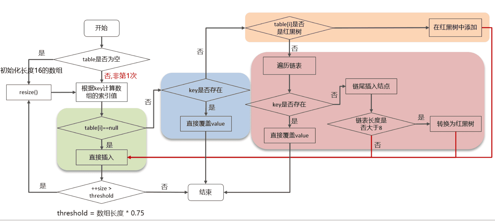
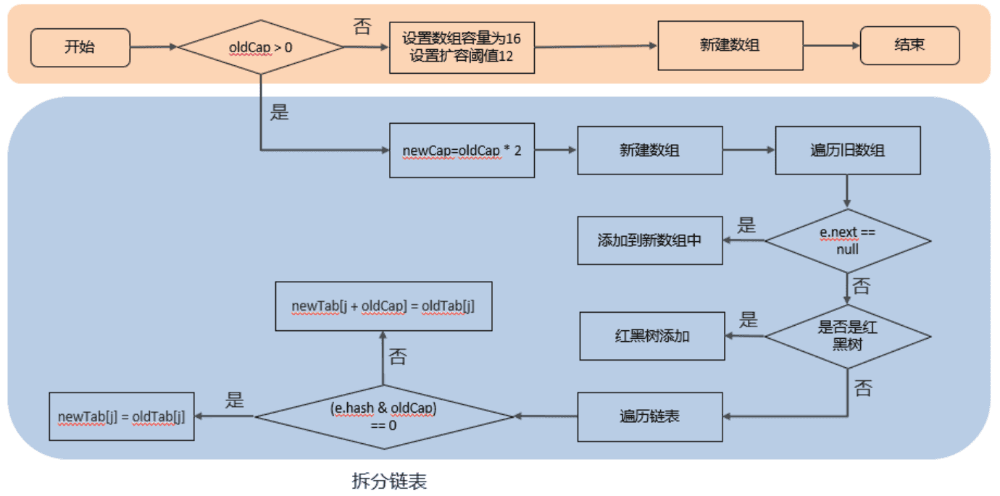

‍

## 概念

‍

‍

### 为什么很多工程师不喜欢 Java

啰嗦。在语言上比较繁琐以及架构上各种过度设计。

‍

‍

### JAVA特性(优势)

> 区分面向对象的封装, 继承, 多态

‍

主要是套话, 还是推荐关联自己其他语言的角度来说, 加入:

1. GO / Kotlin Java家族其他
2. JS / Python 脚本语言
3. C, Cpp, C# C家族

* 广泛使用简单易懂 (入手和市场)
* 平台无关, 安全 (JRE隔离) (JVM的)
* 面向对象, 多线程, 较为高效(基础_)

‍

切入点还有: 

> 垃圾回收器, 一方面简化了手动处理内存和清理无用对象的烦恼, 简化了开发, 但是另一方面导致了性能上的缺失和高精密度场景下的不稳定 (你回收一下STW了哪怕一点点时间都不行, 硬伤, 而且这个只能优化不能根治) 这个对比的是C家族的成员.

当然再加上和Python这种更慢的脚本语言肯定有对比, 下面是AI回答

‍

‍

#### Java vs. Go / Kotlin (java家族)

‍

##### Java

* **优势**：

  * **成熟的生态系统**：丰富的库和框架支持。
  * **跨平台**：通过JVM实现跨平台运行。
  * **强类型系统**：编译时类型检查，减少运行时错误。
  * **广泛的企业应用**：在企业级应用中有广泛使用。
* **劣势**：

  * **较慢的编译速度**：编译时间较长。
  * **冗长的语法**：代码相对冗长。

‍

##### Go

* **优势**：

  * **简单的语法**：易于学习和使用。
  * **高性能**：接近C语言的性能。
  * **内置并发支持**：通过goroutines实现高效并发。
* **劣势**：

  * **较少的库和框架**：生态系统不如Java成熟。
  * **缺乏泛型**：在某些情况下限制了代码的重用性（Go 1.18开始支持泛型）

‍

‍

##### Kotlin

* **优势**：

  * **与Java互操作性**：可以无缝调用Java代码
  * **简洁的语法**：减少样板代码
  * **现代特性**：如空安全、扩展函数等
* **劣势**：

  * **较新的语言**：生态系统和社区支持不如Java
  * **编译速度**：有时比Java慢

‍

‍

#### Java vs. JavaScript / Python (泛脚本语言)

‍

##### JavaScript

* **优势**：

  * **广泛的应用**：特别是在Web开发中。
  * **动态类型**：灵活性高。
  * **事件驱动**：适合处理异步操作。
* **劣势**：

  * **动态类型**：容易引发运行时错误。
  * **性能**：通常不如Java高效。

‍

##### Python

* **优势**：

  * **简洁的语法**：易于学习和使用。
  * **丰富的库**：特别是在数据科学和机器学习领域。
  * **动态类型**：灵活性高。
* **劣势**：

  * **性能**：通常不如Java高效。
  * **动态类型**：容易引发运行时错误。

‍

‍

#### Java vs. C / C++ / C# (c家族)

‍

##### C

* **优势**：

  * **高性能**：接近硬件层的操作。
  * **广泛使用**：特别是在系统编程中。
* **劣势**：

  * **手动内存管理**：容易引发内存泄漏和错误。
  * **缺乏现代特性**：如面向对象编程。

‍

##### C++

* **优势**：

  * **高性能**：适合高性能应用。
  * **面向对象**：支持面向对象编程。
  * **丰富的库**：如STL。
* **劣势**：

  * **复杂的语法**：学习曲线陡峭。
  * **手动内存管理**：容易引发内存泄漏和错误。

‍

‍

‍

### JAVA版本特性一览

‍

* JDK 7 2011 3年级 MC安装JRE

  1. try-with-resources 语句
  2. 多重 catch
  3. 钻石操作符（<>）
* JDK 8 2014 5年级 MC热门常用JRE

  1. Lambda
  2. Stream
  3. LocalDateTime
  4. Optional
* JDK 11 2018 高中

  LTS

  1. var 简化局部变量的声明
  2. 更多的字符串方法, 如 isBlank()
* JDK 17 2021 大学 - Python + Cpp时期

  LTS

  1. 密封类: 允许类或接口限制其子类
  2. Switch增强
  3. 文本块
* JDK 21 2023 大学 - Java时期

  LTS

  1. 虚拟线程, 提供轻量级的线程实现，简化并发编程
  2. 记录模式: 增强模式匹配功能，支持在 `record`​ 类中使用模式匹配
  3. 字符串模板: 提供更灵活的字符串插值方式，简化字符串拼接

‍

‍

‍

‍

‍

‍

## String 

‍

### String 为什么是不可变的?

真正不可变有下面几点原因：

1. ==保存字符串的数组==被 `final`​ 修饰且为私有的，并且`String`​ 类没有提供/暴露修改这个字符串的方法。
2. ​`String`​ 类被 `final`​ 修饰导致其不能被==继承==，进而避免了子类破坏 `String`​ 不可变

‍

‍

#### String final修饰的好处

安全, 高效 - 实现字符串常量池

> Java 语言之父James Gosling的回答是，他会更倾向于使用final，因为它能够缓存结果，当你在传参时不需要考虑谁会修改它的值；如果是可变类的话，则有可能需要重新拷贝出来一个新值进行传参，这样在性能上就会有一定的损失。
>
> James Gosling 还说迫使String类设计成 不可变 的另一个原因是安全，当你在调用其他方法时，比如调用一些系统级操作指令之前，可能会有一系列校验，如果是可变类的话，可能在你校验过后，它的内部的值又被改变了，这样有可能会引起严重的系统崩溃问题，这是迫使String类设计成不可变类的一个重要原因。

‍

‍

‍

### 字符型常量和字符串常量的区别?

* **形式** : 字符常量是单引号引起的一个字符，字符串常量是双引号引起的 0 个或若干个字符。
* **含义** : 字符常量相当于一个整型值( ASCII 值), 可以参加表达式运算; 字符串常量代表一个**地址值**(该字符串在内存中存放位置)。
* **占内存大小**：字符常量 `char`​ 在 Java 中占两个字节; 字符串常量占若干个字节

‍

‍

‍

‍

‍

‍

### 创建方式的区别

* 直接赋值的方式`"String s1="Java";"`​
* ​`"String s2=new String("Java");"`​

‍

两者在JVM的存储区域却截然不同，在JDK1.8中:

变量s1会先去字符串常量池中找字符串`"Java”`​，如果有相同的字符则**直接返回常量句柄**

如果没有此字符串则会先在常量池中创建此字符串，然后再返回常量句柄；而变量s2是直接在堆上创建一个变量，如果调用`intern`​方法才会把此字符串保存到常量池中 intern: 逮捕

‍

```java
String s1 = new String("Java"); // 存入堆
String s2 = s1.intern();     //s1存入常量池后提取引用
String s3 = "Java";    //直接从常量池获取引用
System.out.println(s1 == s2); // false
System.out.println(s2 == s3); // true
```

它们在 JVM 存储的位置，如下所示

> Stack    s1    s2    s3
>
> |        ||
>
> Heap   "java" -> [常量池]

‍

‍

#### new String("dabin")会创建几个对象？

使用这种方式会创建两个字符串对象（前提是**字符串常量池**中没有 "dabin" 这个字符串对象）。

* "dabin" 属于字符串字面量，因此编译时期会在字符串常量池中创建一个字符串对象，指向这个 "dabin" 字符串字面量；
* 使用 new 的方式会在堆中创建一个字符串对象。

‍

‍

### String最大长度是多少？

length方法返回值为int类型，取值上限为2^31 -1。 (32位)

所以理论上String的最大长度为此

‍

#### **达到这个长度的话需要多大的内存吗**？

String内部是使用一个char数组来维护字符序列的，一个char占用两个字节。如果说String最大长度是2^31 -1的话，那么最大的字符串占用内存空间约等于4GB。-> 2^30

‍

‍

#### **那String一般都存储在JVM的哪块区域呢**？

字符串在JVM中的存储分两种情况，一种是String对象，存储在JVM的堆栈中(引用 -> 实体)。一种是字符串常量，存储在常量池(独立)里面。当**通过字面量进行字符串声明时**，比如String s = "程序pp";，这个字符串在编译之后会以常量的形式进入到常量池。

‍

‍

#### **那常量池中的字符串最大长度是2^31-1吗**？

不是的，常量池对String的长度是有**另外限制**的。。Java中的UTF-8编码的Unicode字符串在常量池中以CONSTANT_Utf8类型表示。

```java
CONSTANT_Utf8_info {
    u1 tag;
    u2 length;
    u1 bytes[length];
}
```

length在这里就是代表字符串的长度，length的类型是u2，u2是无符号的16位整数，也就是说最大长度可以做到2^16-1 即 65535。

不过javac编译器做了限制，需要length < 65535。所以字符串常量在常量池中的最大长度是65535 - 1 = 65534。

‍

最后总结一下：

String在不同的状态下，具有不同的长度限制。

* 字符串常量长度不能超过65534
* 堆内字符串的长度不超过2^31-1

‍

‍

### String 是如何实现的？它有哪些重要的方法

以主流的 JDK 版本 1.8 来说，String 内部实际存储结构为 ==char 数组==

```java
public final class String implements java.io.Serializable,Comparable<String>,CharSequence{
    //用于存储字符串的值
    private final charvalue[];
    //缓存字符串的 hash code
    private int hash; //Default to 0
    //......其他内容
}
```

‍

**Stirng中的几个重要方法**

‍

#### 多构造方法

String字符串中4个重要的构造方法:

```java
// String 为参数的构造方法
public String(String original) {
        this.value = original.value;
        this.hash = original.hash;
    }

// char[] 为参数的构造方法
public String(char value[]) {
        this.value = Arrays.copyOf(value, value.length);
    }

// StringBuffer 为参数的构造方法
  public String(StringBuffer buffer) {
        synchronized(buffer) {
            this.value = Arrays.copyOf(buffer.getValue(), buffer.length());
        }
    }

// StringBuilder 为参数的构造方法
public String(StringBuilder builder) {
        this.value = Arrays.copyOf(builder.getValue(), builder.length());
    }
```

‍

‍

#### equals()比较两个字符串是否相等

源码

```java
public boolean equals(Object anObject) {
    // 对象引用相同直接返回true
    if (this == anObject) {
        return true;
    }

    // 判断需要对比的值是否为 String 类型，如果不是则直接返回 false
    if (anObject instanceof String) {
        String anotherString = (String)anObject;
        int n = value.length;
        if (n == anotherString.value.length) {
            // 把两个字符串转化为 char 数组对比
            char v1[] = value;
            char v2[] = anotherString.value;
            int i = 0;
            // 循环比对两个字符串的每一字符
            while (n-- != 0) {
                // 如果其中一个字符不相等就返回false 若相等就继续比对
                if (v1[i] != v2[i])
                    return false;
                i++;
            }
            return true;
        }
    }
    return false;
}
```

‍

​`String`​类型重写了`Object`​中的`equals()`​方法，`equals()`​方法需要传递一个`Object`​类型的参数值，在比较时会先通过`instanceof`​判断是否为`String`​类型，如果不是则会直接返回`false`​

当判断参数为`String`​类型之后，会循环对比两个字符串中的每一个字符，当所有字符都相等时返回`true`​，否则则返回`false`​

‍

‍

#### compareTo()比较两个字符串

compareTo() 方法用于比较两个字符串，返回的结果为 int 类型的值

```java
public int compareTo(String anotherString) {
        int len1 = value.length;
        int len2 = anotherString.value.length;
        // 获取两个字符串长度最短的那个 int 值
        int lim = Math.min(len1, len2);
        char v1[] = value;
        char v2[] = anotherString.value;

        int k = 0;
    	// 对比每个字符串
        while (k < lim) {
            char c1 = v1[k];
            char c2 = v2[k];
            if (c1 != c2) {
                // 有字符不相等就返回差值
                return c1 - c2;
            }
            k++;
        }
        return len1 - len2;
    }
```

‍

‍

‍

### String、StringBuilder、StringBuffer的区别？

* 使用 `String`​ 处理不可变字符串
* 使用 `StringBuilder`​ 处理可变字符串，适用于单线程环境
* 使用 `StringBuffer`​ 处理可变字符串，适用于多线程环境

‍

1. ​**​`String`​**​:

    * **不可变**：`String`​ 对象是不可变的，一旦创建就不能修改。如果对 `String`​ 进行任何修改操作，都会生成一个新的 `String`​ 对象。
    * **线程安全**：由于 `String`​ 是不可变的，因此是**线程安全**的。
    * **性能**：由于每次修改都会创建新的对象，因此在频繁修改字符串的场景下，性能较差。

    ```java
    String str = "Hello";
    str = str + " World"; // 生成了一个新的 String 对象
    ```
2. ​**​`StringBuilder`​**​:

    * **可变**：`StringBuilder`​ 对象是可变的，可以直接对其内容进行修改，而不会生成新的对象。
    * **非线程安全**：`StringBuilder`​ **不是线程安全**的，因此在多线程环境下不推荐使用。
    * **性能**：由于不需要创建新的对象，因此在频繁修改字符串的场景下，性能较好。底层实现使用了一个可变的字符数组来存储字符串数据。每次对 StringBuilder 进行修改时，实际上是对这个字符数组进行操作，而不是创建新的对象。

    ```java
    StringBuilder sb = new StringBuilder("Hello");
    sb.append(" World"); // 直接修改了原有对象
    ```
3. ​**​`StringBuffer`​**​:

    * **可变**：`StringBuffer`​ 对象也是可变的，可以直接对其内容进行修改。 (buffer意味着缓存)
    * **线程安全**：`StringBuffer`​ 是**线程安全**的，所有的方法都是同步的，因此在多线程环境下可以安全使用。
    * **性能**：由于方法是同步的，因此在单线程环境下性能不如 `StringBuilder`​。

    ```java
    StringBuffer sbf = new StringBuffer("Hello");
    sbf.append(" World"); // 直接修改了原有对象
    ```

总结：

* 使用 `String`​ 处理不可变的字符串。
* 使用 `StringBuilder`​ 处理单线程环境下频繁修改的字符串。
* 使用 `StringBuffer`​ 处理多线程环境下频繁修改的字符串。

新版本JDK9之后有优化.

‍

‍

#### 字符串拼接用“+” 还是 StringBuilder?

在循环内使用“+”进行字符串的拼接的话，存在比较明显的缺陷：**编译器不会创建单个** **​`StringBuilder`​**​ **以复用，会导致创建过多的** **​`StringBuilder`​**​ **对象**。

在 JDK9 当中，字符串相加 “+” 改为了用动态方法 `makeConcatWithConstants()`​ 来实现，而不是大量的 `StringBuilder`​ 了

JDK 9 之后，你可以放心使用“+” 进行字符串拼接了

‍

### Comparable 和 Comparator 的区别

​`Comparable`​ 接口实际上是出自`java.lang`​包 它有一个 `compareTo(Object obj)`​方法用来排序

​`Comparator`​接口实际上是出自 `java.util`​ 包它有一个`compare(Object obj1, Object obj2)`​方法用来排序

‍

### CompareTo 与 Equals 区别

从源码中可以看出，`compareTo()`​方法会循环对比所有的字符，当两个字符串中有任意一个字符不相同时，则`return char1-char2`​。比如，两个字符串分别存储的是1和2，返回的值是-1；如果存储的是1和1，则返回的值是0，如果存储的是2和1，则返回的值是1。

‍

​`compareTo()`​方法和`equals()`​方法都是用于比较两个字符串的，但它们有两点不同：

* ​`equals()`​可以接收一个`Object`​ 类型的参数，而`compareTo()`​只能接收一个`String`​类型的参数;
* ​`equals()`​返回值为`Boolean`​，而`compareTo()`​的返回值则为`int`​。

‍

‍

### 用反射创建出一个字符串对象要经过几步？

参考

* **获取Class对象：**  通过 `Class.forName("java.lang.String")`​ 或 `String.class`​ 获得 `Class<String>`​ 对象。
* **获取构造方法：**  利用 `Class#getDeclaredConstructor`​ 获取对应构造器（例如无参构造器、或含参数构造器）。
* **设置可访问性：**  如果构造器为私有，需要调用 `setAccessible(true)`​ 以允许反射访问。
* **调用构造方法创建实例：**  使用 `Constructor#newInstance`​ 来创建对象实例，并进行初始化。

‍

‍

## Array

‍

‍

### 数组转集合 asList()

使用工具类 `Arrays.asList()`​ 把数组转换成集合时，不能使用其修改集合相关的方法，它的 `add/remove/clear`​ 方法会抛出 `UnsupportedOperationException`​ 异常。

‍

​`Arrays.asList()`​是临时的的将一个数组转换为一个 `List`​ 集合, 只能当做一个快照使用

```java
String[] myArray = {"Apple", "Banana", "Orange"};
List<String> myList = Arrays.asList(myArray);
```

‍

注意事项

**1、**​**​`Arrays.asList()`​** ​**是泛型方法，传递的数组必须是对象数组，而不是基本类型。**

传入一个原生数据类型数组时，`Arrays.asList()`​ 的真正得到的参数就不是数组中的元素，而是数组对象**本身**！此时 `List`​ 的唯一元素就是这个数组，使用包装类型数组!

```java
Integer[] myArray = {1, 2, 3}; //true
```

‍

‍

**2、使用集合的修改方法:**  **​`add()`​** ​ **、**​**​`remove()`​** ​ **、**​**​`clear()`​** ​**会抛出异常。**

​`Arrays.asList()`​ 方法返回的并不是 `java.util.ArrayList`​ ，而是 `java.util.Arrays`​ 的一个内部类,这个内部类并没有实现集合的修改方法或者说并没有重写这些方法

‍

‍

#### Arrays.asList转List后，如果修改了数组内容，list受影响吗？List用toArray转数组后，如果修改了List内容，数组受影响吗

(如上) Arrays.asList转换list之后，如果修改了数组的内容，list会受影响，因为它的底层使用的Arrays类中的一个内部类ArrayList来构造的集合，在这个集合的构造器中，把我们传入的这个集合进行了包装而已，最终指向的都是同一个内存地址

(就是拷贝了) list用了toArray转数组后，如果修改了list内容，数组不会影响，当调用了toArray以后，在底层是它是进行了数组的拷贝，跟原来的元素就没啥关系了，所以即使list修改了以后，数组也不受影响。

‍

‍

### **正确的将数组转换为List?**

> 手动实现 / Guava / Hutool工具类和使用new的 new ArrayList<>(Arrays.asList("a", "b", "c")) 不说了

‍

‍

1. 调用 array.stream 的 toList()

    ```java
    Integer [] myArray = { 1, 2, 3 };
    List myList = Arrays.stream(myArray).collect(Collectors.toList());

    //基本类型也可以实现转换（依赖boxed的装箱操作）
    int [] myArray2 = { 1, 2, 3 };
    List myList = Arrays.stream(myArray2).boxed().collect(Collectors.toList());
    ```
2. Java9 的 `List.of({Array})`​方法

‍

‍

### 数组去重

1. 大伙生产都是使用Stream, 如果担心大批量数据处理时的性能问题，可以考虑使用并行流来提高性能, 利用多核处理器 (但是这个又有各种问题, 因此还是简单点吧)

    ```java
            List<Integer> distinctList = Arrays.stream(array)
                                               //.parallel()
                                               .distinct()
                                               .collect(Collectors.toList());
    ```
2. 平时闹着玩用set, 这还需要显式转成List再操作. 并且ds之后肯定还需要处理. 如果是大批量的肯定出问题, JVM爆炸啥的都有可能. 因此我不推荐

    ```java
            Set<Integer> ds = new HashSet<>(Arrays.asList(array));
    ```

‍

‍

‍

‍

‍

‍

## List

‍

‍

### ArrayList介绍-特性

​`ArrayList`​ 的底层是"**动态数组&quot;** ，它的容量能动态增长。在添加大量元素前，应用可以使用`ensureCapacity`​操作增加 `ArrayList`​ 实例的容量

​`ArrayList`​ 中可以存储任何类型的对象，包括 `null`​ 值

‍

‍

#### 为啥底层数组下标为0开始

在数组在内存中查找元素的时候，是有一个寻址公式的; 看OS源码就知道了, 需要快速从**第一块空间**往后进行分配, 那么第一个自然就是0号位, 删除掉后面的这个大小就好算了

```java
arr[i] = baseAddress + i * dataTypeSize
```

‍

‍

### ArrayList 和 Array（数组）的区别

‍

* ​`ArrayList`​ 内部基于**动态数组**实现，比 `Array`​（**静态数组**）使用起来更加灵活 -- `ArrayList`​会根据实际存储的元素动态地扩容或缩容，而 `Array`​ 被创建之后就不能改变它的长度了
* ​`ArrayList`​ 允许用**泛型**来确保类型安全，`Array`​ 则不可以
* ​`ArrayList`​ **只能存储对象**。对于基本类型数据，需要使用其对应的包装类
* ​`ArrayList`​ 支持插入、删除、遍历等常见操作，并且提供了丰富的 API 操作方法，比如 `add()`​、`remove()`​等。`Array`​ 只是一个固定长度的数组，只能按照下标访问其中的元素，不具备动态添加、删除元素的能力
* ​`ArrayList`​创建时不需要指定大小(封装了)，而`Array`​创建时必须指定大小
* 从概念上说, List 是集合, 是Array更高层的东西. Array 是数组, 是更加基层的玩意.

‍

‍

### ArrayList 和 Vector 的区别

* ​`ArrayList`​ 是 `List`​ 的主要实现类，底层使用 `Object[]`​存储，适用于频繁的查找工作，线程不安全 。
* ​`Vector`​ 是 `List`​ 的古老实现类，底层使用`Object[]`​ 存储，线程安全。
* ArrayList在内存不够时扩容为原来的1.5倍，Vector是扩容为原来的2倍。

‍

‍

‍

‍

‍

### ArrayList和LinkedList的区别是什么？

* 底层数据结构

  * ArrayList 是动态数组的数据结构实现
  * LinkedList 是双向链表的数据结构实现
* 操作数据效率

  * ArrayList按照下标查询的时间复杂度O(1)【内存是连续的，根据寻址公式】， LinkedList不支持下标查询
  * 查找（未知索引）： ArrayList需要遍历，链表也需要链表，时间复杂度都是O(n)
  * 新增和删除

    * ArrayList尾部插入和删除，时间复杂度是O(1)；其他部分增删需要挪动数组，时间复杂度是O(n)
    * LinkedList头尾节点增删时间复杂度是O(1)，其他都需要遍历链表，时间复杂度是O(n)
* 内存空间占用

  * ArrayList底层是数组，内存连续，节省内存
  * LinkedList 是双向链表需要存储数据，和两个指针，更占用内存
* 线程安全

  * ArrayList和LinkedList都不是线程安全的
  * 如果需要保证线程安全，有两种方案：

    * 在方法内使用，局部变量则是线程安全的
    * 使用线程安全的ArrayList和LinkedList

      ```java
      List<Object> syncArrayList = Collections.synchronizedList(new ArrayList<>());
      List<Object> syncLinkedList = Collections.synchronizedList(new LinkedList<>());
      ```

‍

‍

‍

### ArrayList扩容机制

ArrayList list = new ArrayList(20)中的 list 扩充几次 : 有传参，没必要扩容，所以次数是0

‍

ArrayList 的扩容机制是通过增加其内部数组的容量来实现的:

> 当调用add方法添加一个元素时，首先会确保当前ArrayList维护的数组具有存储新元素的能力。如果数组的容量不足以存储新元素，那么就会通过grow方法进行扩容。扩容的方式是将数组的容量扩大到原来的1.5倍，然后将原数组的数据复制到新的数组中。最后，将新元素添加到数组的末尾

‍

扩容机制的关键点：

* 初始容量：==默认初始容量为10==
* 扩容因子：每次扩容时，新容量为旧容量的**1.5倍**（具体为oldCapacity + (oldCapacity >> 1)）
* 复制元素：扩容时，会将旧数组中的元素**复制到新数组中**

‍

‍

### ArrayList 和 LinkedList 不是线程安全的咋搞

1. 集合优先在方法内使用，定义为局部变量 --> 

    > **本地(局部)变量**存储在**线程专属的栈**上, 这意味着每个线程有自己的本地变量副本。因此不存在对集合的同一实例的并发访问
    >
2. 非要在Class的成员变量中使用的话，可以使用线程安全的集合来替代

    * ArrayList 可以通过 Collections 的 synchronizedList 方法将 ArrayList 包装转换成线程安全的容器后再使用

      ```java
      public class ThreadSafeArrayListExample {
          private List<Integer> synchronizedList = Collections.synchronizedList(new ArrayList<>());

          public void addElement(Integer element) {
              synchronizedList.add(element);
          }

          public Integer getElement(int index) {
              return synchronizedList.get(index);
          }
      }
      ```
    * LinkedList 换成 ConcurrentLinkedQueue 来使用 (如我们的 CSS 里面就写了这个模拟)

      ```java
      public class ThreadSafeLinkedListExample {
          private ConcurrentLinkedQueue<Integer> concurrentQueue = new ConcurrentLinkedQueue<>();

          public void addElement(Integer element) {
              concurrentQueue.add(element);
          }

          public Integer pollElement() {
              return concurrentQueue.poll();
          }
      }
      ```

‍

### 线程安全集合类

‍

java.util包下的集合类大部分都是线程不安全的，例如我们常用的HashSet、TreeSet、ArrayList、LinkedList、ArrayDeque、HashMap、TreeMap，这些都是线程不安全的集合类，但是它们的优点是性能好。

‍

如果需要使用线程安全的集合类，则可以使用Collections工具类提供的synchronizedXxx()方法，将这些集合类包装成线程安全的集合类。**java.util包下也有线程安全的集合类，例如Vector、Hashtable。这些集合类都是比较古老的API，虽然实现了线程安全，但是性能很差。** 所以即便是需要使用线程安全的集合类，也建议将线程不安全的集合类包装成线程安全集合类的方式，而不是直接使用这些古老的API。

‍

从Java5开始，Java在java.util.concurrent包下提供了大量支持高效并发访问的集合类，它们既能包装良好的访问性能，有能包装线程安全。这些集合类可以分为两部分，它们的特征如下：

* 以Concurrent开头的集合类： 以Concurrent开头的集合类代表了支持并发访问的集合，它们可以支持多个线程并发写入访问， 这些写入线程的所有操作都是线程安全的，但读取操作不必锁定。以Concurrent开头的集合类采 用了更复杂的算法来保证永远不会锁住整个集合，因此在并发写入时有较好的性能。
* 以CopyOnWrite开头的集合类： 以CopyOnWrite开头的集合类采用复制底层数组的方式来实现写操作。当线程对此类集合执行读 取操作时，线程将会直接读取集合本身，无须加锁与阻塞。当线程对此类集合执行写入操作时，集 合会在底层复制一份新的数组，接下来对新的数组执行写入操作。由于对集合的写入操作都是对数 组的副本执行操作，因此它是线程安全的。

‍

‍

### ArrayList 快速失败机制 + 安全失败机制

ArrayList的快速失败（fail-fast）是Java集合框架中的一种**错误检测机制**

当多个线程对同一个ArrayList进行操作时，如果一个线程在遍历该集合的过程中，另一个线程同时尝试修改它（例如添加、删除元素），那么遍历线程会抛出`ConcurrentModificationException`​异常。

旨在防止并发修改导致的数据不一致问题。

‍

‍

#### 什么是fail safe安全失败机制？

采用安全失败机制的集合容器，在遍历时不是直接在集合内容上访问的，而是**先复制原有集合内容**，在拷贝的集合上进行遍历。java.util.concurrent包下的容器都是安全失败，可以在多线程下并发使用，并发修改。

> 创建一个拷贝来独立的进行

‍

**原理**：由于迭代时是对原集合的拷贝进行遍历，所以在遍历过程中对原集合所作的修改并不能被迭代器检测到，所以不会触发Concurrent Modification Exception。

‍

**缺点**：基于拷贝内容的优点是避免了Concurrent Modification Exception，但同样地，迭代器并不能访问到修改后的内容，即：迭代器遍历的是开始遍历那一刻拿到的集合拷贝，在遍历期间原集合发生的修改迭代器是不知道的。

‍

‍

### 时间复杂度Array&Link辨析

‍

**头部插入**：由于ArrayList头部插入需要移动后面所有元素，所以必然导致效率低。LinkedList不用移动后面元素，自然会快一些。

‍

**中间插入**：查看源码会注意到LinkedList的中间插入, 其实是**先判断插入位置距离头尾哪边更接近**，然后从近的一端遍历找到对应位置，而ArrayList是需要将后半部分的数据复制重排 --所以两种方式其实都逃不过遍历的操作，相对效率都很低，但是从实验结果还是ArrayList更胜一筹，猜测这与数组在内存中是连续存储有关

‍

**尾部插入**：ArrayList并不需要复制重排数据，所以效率很高，这也应该是我们日常写代码时的首选操作，而LinkedList由于还需要**new对象和变换指针**，所以效率反而低于ArrayList。

‍

**删除操作/添加操作**: 没有什么区别

‍

> 所以认定LinkedList插入删除效率比ArrayList高是不对的，有时候反而还低。
>
> 之所以笼统的说LinkedList插入删除效率比ArrayList高，猜测是ArrayList**复制数组需要时间**，也占一定的时间复杂度。而因为**数据量太少**，这种效果就体现不出来

‍

‍

‍

### 集合遍历方法

**不要在 foreach 循环里进行元素的** **​`remove/add`​**​ **操作。remove 元素请使用** **​`Iterator`​**​ **方式，如果并发操作，需要对** **​`Iterator`​**​ **对象加锁。**

> 通过反编译你会发现 foreach 语法底层其实还是依赖 `Iterator`​ 。不过， `remove/add`​ 操作直接调用的是集合自己的方法，而不是 `Iterator`​ 的 `remove/add`​方法
>
> 这就导致 `Iterator`​ 莫名其妙地发现自己有元素被 `remove/add`​ ，然后，它就会抛出一个 `ConcurrentModificationException`​ 来提示用户发生了并发修改异常。这就是单线程状态下产生的 **fail-fast 机制**

‍

推荐

1. 使用普通 for 循环比对. 要复制个新的直接双指针拷贝也可以
2. 使用 fail-safe 的集合类 (并发concurrent包) : `java.util`​包下面的所有的集合类都是 fail-fast 的，而`java.util.concurrent`​包下面的所有的类都是 fail-safe 的
3. List自己的 `Collection  removeIf()`​方法删除满足特定条件的元素,如

    ```java
    list.removeIf(filter -> filter % 2 == 0); /* 删除list中的所有偶数 *
    ```

‍

### 如何让一个集合(和他的内容)不被修改？final可以吗?

‍

可以采用Collections包下的 unmodifiableMap/unmodifiableList/unmodifiableSet 方法，通过这个方法返回的集合，是不可以修改的。如果修改的话，会抛出 java.lang.UnsupportedOperationException异常。

```
    List<String> list = new ArrayList<>();
    list.add("x");
    Collection<String> clist = Collections.unmodifiableCollection(list);
    clist.add("y"); // 运行时此行报错
    System.out.println(list. size());
```

对于List/Set/Map集合，Collections包都有相应的支持。

‍

‍

不可以。

**final关键字修饰的**​**==成员变量==**​**如果是是引用类型的话，则表示这个引用的**​**==地址值==**​**是不能改变的，但是这个引用所指向的对象里面的内容还是可以改变的。**

> 这里隐含的意义是, 集合里面存的成员变量实际上是引用, 不是实际的对象直接"嵌"在里面的

而集合类都是引用类型，用final修饰的话，集合里面的内容还是可以修改的。

‍

### ArrayList 里的对象取出来直接修改值需要再放回去吗?

不需要再放回去，列表里该对象的值会自动改变，因为存储的实际上是引用

‍

## Map

‍

### Map有哪些类？

Map接口有很多实现类，其中比较常用的有HashMap、LinkedHashMap、TreeMap、ConcurrentHashMap。

‍

* 对于**不需要排序**的场景，优先考虑使用HashMap，因为它是性能最好的Map实现。

  * 如果需要保证线程安全，则可以使用ConcurrentHashMap。它的性能好于Hashtable，因为它在put时采用分段锁/CAS的加锁机制，而不是像Hashtable那样，无论是put还是get都做同步处理。(1.7 ConcurrentHashMap 引入了分段锁, 1.8 引入了红黑树)
* 对于需要排序的场景，如果需要按**插入顺序排序**则可以使用LinkedHashMap (`LinkedHashMap`​ 使用双向链表来维护元素的顺序，顺序为插入顺序或者最近最少使用(LRU)顺序)，如果需要将key按**自然顺序排列**甚至是**自定义**顺序排列，则可以选择TreeMap (基于红黑树实现)

  * 如果需要保证线程安全，则可以使用Collections工具类将上述实现类包装成线程安全的Map。

‍

‍

#### HashMap和LinkedHashMap的区别

* 功能

  LinkedHashMap 维护插入顺序或访问顺序（取决于构造函数参数）。遍历时按插入顺序或最近访问顺序, 适用于需要维护元素顺序的场景，如实现LRU缓存
* 性能

  当然 HashMap 好点
* 底层    

  HashMap：基于哈希表实现, LinkedHashMap 加上双向链表

‍

‍

#### HashMap 和 Hashtable 的区别

* **线程是否安全：**​`HashMap`​ 是非线程安全的，`Hashtable`​ 是线程安全的,因为 `Hashtable`​ 内部的方法基本都经过`synchronized`​ 修饰。（如果你要保证线程安全的话就使用 `ConcurrentHashMap`​ ）
* **效率：**  因为线程安全的问题，`HashMap`​ 要比 `Hashtable`​ 效率高一点。另外，`Hashtable`​ 基本被淘汰，不要在代码中使用它；
* **对 Null key 和 Null value 的支持：**​`HashMap`​ 可以存储 null 的 key 和 value，但 null 作为键只能有一个，null 作为值可以有多个；Hashtable 不允许有 null 键和 null 值，否则会抛出 `NullPointerException`​。
* **初始容量大小和每次扩充容量大小的不同：**

  ① 创建时如果不指定容量初始值，`Hashtable`​ 默认的初始大小为 11，之后每次扩充，容量变为原来的 2n+1。`HashMap`​ 默认的初始化大小为 16。之后每次扩充，容量变为**原来的 2 倍**。

  ② 创建时如果给定了容量初始值，那么 `Hashtable`​ 会**直接使用**你给定的大小，而 `HashMap`​ 会**将其扩充**为 2 的幂次方大小（`HashMap`​ 中的`tableSizeFor()`​方法保证，下面给出了源代码）。也就是说 `HashMap`​ 总是使用 2 的幂作为哈希表的大小
* **底层数据结构：**  JDK1.8 以后的 `HashMap`​ 在解决哈希冲突时有了较大的变化，当链表长度大于阈值（默认为 8）时，将链表转化为红黑树（将链表转换成红黑树前会判断，如果当前数组的长度小于 64，那么会选择先进行数组扩容，而不是转换为红黑树），以减少搜索时间（后文中我会结合源码对这一过程进行分析）。`Hashtable`​ 没有这样的机制。

‍

‍

### 哈希函数的关键特性

* 高效率的计算过程

  * 高效使用
* 雪崩效应

  * 输入的微小变化（例如一个比特的变化）会导致输出的哈希值有显著变化
  * 确保哈希值的均匀分布，增加了哈希函数的安全性和抗碰撞性
* 输出长度固定

  * 方便高效

‍

‍

### 集合转 Map

**在使用** **​`java.util.stream.Collectors`​**​ **类的** **​`toMap()`​** ​ **方法转为** **​`Map`​**​ **集合时，一定要注意当 value 为 null 时会抛 NPE 异常。**

‍

[Java集合使用注意事项总结 | JavaGuide](https://javaguide.cn/java/collection/java-collection-precautions-for-use.html#%E9%9B%86%E5%90%88%E8%BD%AC-map)

‍

‍

‍

‍

‍

### 底层实现

HashMap

‍

在JDK1.7中`HashMap`​是以数组加链表的形式组成的，JDK1.8之后新增了红黑树的组成结构，当链表大于8时，链表结构会转换成红黑树结构

可以看出每个哈希桶中包含了四个字段：hash、key、value、next，其中next 表示链表的下一个节点。

JDK 1.8之所以添加红黑树是因为一旦链表过长，会严重影响`HashMap`​的性能，而红黑树具有快速增删改查的特点，这样就可以有效的解决链表过长时操作比较慢的问题

‍

数组中的元素我们称之为==哈希桶==

```java
static class Node<K,V> implements Map.Entry<K,V> {
        final int hash;
        final K key;
        V value;
        Node<K,V> next;

        Node(int hash, K key, V value, Node<K,V> next) {
            this.hash = hash;
            this.key = key;
            this.value = value;
            this.next = next;
        }

        public final int hashCode() {
            return Objects.hashCode(key) ^ Objects.hashCode(value);
        }

        public final boolean equals(Object o) {
            if (o == this)
                return true;
            if (o instanceof Map.Entry) {
                Map.Entry<?,?> e = (Map.Entry<?,?>)o;
                if (Objects.equals(key, e.getKey()) &&
                    Objects.equals(value, e.getValue()))
                    return true;
            }
            return false;
        }
    }
```

‍

​`HashMap`​ 是 Java 中常用的集合类，其底层实现是基于数组和链表的哈希表。以下是 `HashMap`​ 的一些关键点：

1. **数组**：`HashMap`​ 使用一个数组来存储键值对。数组中的每个位置称为一个桶（bucket）。
2. **链表**：当多个键的哈希值相同时，这些键值对会存储在同一个桶中，并以链表的形式链接在一起。
3. **红黑树**：在 Java 8 及以后的版本中，当链表长度超过一定阈值（默认是 8）时，链表会转换为红黑树，以提高查找效率。
4. **哈希函数**：`HashMap`​ 使用键的 `hashCode()`​ 方法来计算哈希值，并通过哈希值确定键值对在数组中的位置。

‍

以下是一个简化的 `HashMap`​ 底层结构示意

```java
class HashMap<K, V> {
    // 默认初始容量
    static final int DEFAULT_INITIAL_CAPACITY = 16;
    // 默认负载因子
    static final float DEFAULT_LOAD_FACTOR = 0.75f;
  
    // 数组，存储链表或红黑树的头节点
    Node<K, V>[] table;
  
    // 链表节点
    static class Node<K, V> {
        final int hash;
        final K key;
        V value;
        Node<K, V> next;
    
        Node(int hash, K key, V value, Node<K, V> next) {
            this.hash = hash;
            this.key = key;
            this.value = value;
            this.next = next;
        }
    }
  
    // 其他方法和成员变量省略...
}
```

‍

‍

#### 加载因子是0.75？

加载因子也叫扩容因子或负载因子，用来判断什么时候进行扩容的，假如加载因子是0.5，`HashMap`​的初始化容量是16，那么当`HashMap`​中有16*0.5=8个元素时，`HashMap`​就会进行扩容。

这个数字是出于容量和性能之间平衡的结果

> 和链表到容量了扩容不一样, Hash避免碰撞肯定是不能满了再来扩容的

‍

‍

#### 三个重要方法：**查询**、**新增**和**数据扩容**

‍

##### 查询

> SK口头描述: 首先对定位到的第一处地方进行非空判断, 然后始终判断第一个节点(非空, 哈希吗相同), 不是的话判断下面一个非空, 根据是不是树结构进行判断, 是的话就调用树操作进行获取, 不是的话循环向下遍历. 都找不到return null.

```java
public V get(Object key) {
        Node<K,V> e;
    	// 对key进行哈希操作
        return (e = getNode(hash(key), key)) == null ? null : e.value;
    }

final Node<K,V> getNode(int hash, Object key) {
        Node<K,V>[] tab; Node<K,V> first, e; int n; K k;
    	// 非空判断
        if ((tab = table) != null && (n = tab.length) > 0 &&
            (first = tab[(n - 1) & hash]) != null) {
            // 判断第一个是否是要查询的元素
            if (first.hash == hash && // always check first node
                ((k = first.key) == key || (key != null && key.equals(k))))
                return first;
            // 判断下一个节点是否非空
            if ((e = first.next) != null) {
                // 如果第一节点时树结构，则使用getTreeNode获取相应的数据
                if (first instanceof TreeNode)
                    return ((TreeNode<K,V>)first).getTreeNode(hash, key);
                do {
                    // 非树结构，循环判断
                    // hash相等并且key相等，返回此节点
                    if (e.hash == hash &&
                        ((k = e.key) == key || (key != null && key.equals(k))))
                        return e;
                } while ((e = e.next) != null);
            }
        }
        return null;
    }
```

‍

‍

##### 新增

SK口头描述过程:

> 你准备往hash表里插入一个元素的时候, 首先查哈希表长度, 能不能放得下了或者是有没有这个表(没有需要初始化resize()).
>
> 根据key -Hash映射下找到对应的目标下标index -> 看看那个地方有没有被人占座了? 没有就直接插入(1). 有人了, 就要和他判断一下是不是同一个key值, 如果是, 把他傻乐直接插入(2). 不是, 那么就要挂载了. 首先看看是挂载的红黑树还是链表(要看JDK版本), 如果是就采用红黑树的流程插入(3). 不是就是链表插入, 链表插入还要考虑要不要立刻变成红黑树承载. 是的话转红黑树插入(4), 不是的话就还是链表插入(5), 最后5种插入结果都要判断一下需不需要resize扩容. 不要就结束.

```java
public V put(K key, V value) {
    	// 对key进行哈希操作
        return putVal(hash(key), key, value, false, true);
    }
final V putVal(int hash, K key, V value, boolean onlyIfAbsent,
                   boolean evict) {
        Node<K,V>[] tab; Node<K,V> p; int n, i;
    	// 哈希表为空则创建表
        if ((tab = table) == null || (n = tab.length) == 0)
            n = (tab = resize()).length;
    	// 根据 key 的哈希值计算出要插入的数组索引 i
        if ((p = tab[i = (n - 1) & hash]) == null)
            // 如果table[i]等于nul1，则直接插入
            tab[i] = newNode(hash, key, value, null);
        else {
            Node<K,V> e; K k;
            // 如果key已经存在了，直接覆盖 value
            if (p.hash == hash &&
                ((k = p.key) == key || (key != null && key.equals(k))))
                e = p;
            // 如果key不存在，判断是否为红黑树
            else if (p instanceof TreeNode)
                // 红黑树直接插入键值对
                e = ((TreeNode<K,V>)p).putTreeVal(this, tab, hash, key, value);
            else {
                // 为链表结构，循环准备插入
                for (int binCount = 0; ; ++binCount) {
                    // 下一个元素为空时
                    if ((e = p.next) == null) {
                        p.next = newNode(hash, key, value, null);
                        //链表长度大于8转换为红黑树进行处理
                        if (binCount >= TREEIFY_THRESHOLD - 1) // -1 for 1st
                            treeifyBin(tab, hash);
                        break;
                    }
                    // key已经存在直接覆盖 value
                    if (e.hash == hash &&
                        ((k = e.key) == key || (key != null && key.equals(k))))
                        break;
                    p = e;
                }
            }
            if (e != null) { // existing mapping for key
                V oldValue = e.value;
                if (!onlyIfAbsent || oldValue == null)
                    e.value = value;
                afterNodeAccess(e);
                return oldValue;
            }
        }
        ++modCount;
    	// 超过最大容量，扩容
        if (++size > threshold)
            resize();
        afterNodeInsertion(evict);
        return null;
    }

```

‍

流程图



‍

‍

##### 扩容

```java
final Node<K,V>[] resize() {
    	// 扩容前的数组
        Node<K,V>[] oldTab = table;
    	// 扩容前的数组的大小和阈值
        int oldCap = (oldTab == null) ? 0 : oldTab.length;
        int oldThr = threshold;

    	//预定义新数组的大小和阈值
        int newCap, newThr = 0;
        if (oldCap > 0) {
            //超过最大值就不再扩容了
            if (oldCap >= MAXIMUM_CAPACITY) {
                threshold = Integer.MAX_VALUE;
                return oldTab;
            }
            //扩大容量为当前容量的两倍，但不能超过MAXIMUM_CAPACITY
            else if ((newCap = oldCap << 1) < MAXIMUM_CAPACITY &&
                     oldCap >= DEFAULT_INITIAL_CAPACITY)
                newThr = oldThr << 1; // double threshold
        }
    	//当前数组没有数据，使用初始化的值
        else if (oldThr > 0) // initial capacity was placed in threshold
            newCap = oldThr;
        else {               // zero initial threshold signifies using defaults
            //如果初始化的值为0，则使用默认的初始化容量
            newCap = DEFAULT_INITIAL_CAPACITY;
            newThr = (int)(DEFAULT_LOAD_FACTOR * DEFAULT_INITIAL_CAPACITY);
        }
    	//如果新的容量等于0
        if (newThr == 0) {
            float ft = (float)newCap * loadFactor;
            newThr = (newCap < MAXIMUM_CAPACITY && ft < (float)MAXIMUM_CAPACITY ?
                      (int)ft : Integer.MAX_VALUE);
        }
        threshold = newThr;
        @SuppressWarnings({"rawtypes","unchecked"})
            Node<K,V>[] newTab = (Node<K,V>[])new Node[newCap];
    	//开始扩容，将新的容量赋值给 table
        table = newTab;
    	//原数据不为空，将原数据复制到新 table中
        if (oldTab != null) {
            //根据容量循环数组，复制非空元素到新 table
            for (int j = 0; j < oldCap; ++j) {
                Node<K,V> e;
                if ((e = oldTab[j]) != null) {
                    oldTab[j] = null;
                    //如果链表只有一个，则进行直接赋值
                    if (e.next == null)
                        newTab[e.hash & (newCap - 1)] = e;
                    else if (e instanceof TreeNode)
                        // 红黑树相关操作
                        ((TreeNode<K,V>)e).split(this, newTab, j, oldCap);
                    else { // preserve order
                        //链表复制，JDK1.8扩容优化部分
                        Node<K,V> loHead = null, loTail = null;
                        Node<K,V> hiHead = null, hiTail = null;
                        Node<K,V> next;
                        do {
                            next = e.next;
                            // 原索引
                            if ((e.hash & oldCap) == 0) {
                                if (loTail == null)
                                    loHead = e;
                                else
                                    loTail.next = e;
                                loTail = e;
                            }
                            // 原索引 + oldCap
                            else {
                                if (hiTail == null)
                                    hiHead = e;
                                else
                                    hiTail.next = e;
                                hiTail = e;
                            }
                        } while ((e = next) != null);
                        // 将原索引放到哈希桶中
                        if (loTail != null) {
                            loTail.next = null;
                            newTab[j] = loHead;
                        }
                        // 将 原索引+oldCap 放到哈希桶中
                        if (hiTail != null) {
                            hiTail.next = null;
                            newTab[j + oldCap] = hiHead;
                        }
                    }
                }
            }
        }
        return newTab;
    }
```

‍

* 在添加元素或初始化的时候需要调用 resize 方法进行扩容，第一次添加数据初始化数组长度为 16，以后每次每次扩容都是达到了扩容阈值（数组长度 * 0.75）
* 每次扩容的时候，都是扩容之前容量的 2 倍；
* 扩容之后，会新创建一个数组，需要把老数组中的数据挪动到新的数组中

  * 没有 hash 冲突的节点，则直接使用 e.hash & (newCap - 1) 计算新数组的索引位置
  * 如果是红黑树，走红黑树的添加
  * 如果是链表，则需要遍历链表，可能需要拆分链表，判断(e.hash & oldCap)是否为 0，该元素的位置要么停留在原始位置，要么移动到原始位置+增加的数组大小这个位置上

‍

从以上源码可以看出，JDK1.8在扩容时并没有像JDK1.7那样，重新计算每个元素的哈希值，而是通过高位运算(`e.hash&oldCap`​)来确定元素是否需要移动

‍

‍



‍

‍

‍

##### hash()

‍

先获取 key 的 hashCode 值，然后右移 16 位 异或运算 原来的 hashCode 值，主要作用就是使原来的 hash 值更加均匀，减少 hash 冲突

```java
static final int hash(Object key) {
    int h;
    return (key == null)? 0 : (h = key.hashCode())^ (h >>>16);
}
```

有了 hash 值之后，就很方便的去计算当前 key 的在数组中存储的下标

```java
final V putVal(int hash，K key, V value, boolean onlylfAbsent, boolean evict){
    ......
    if ((p = tab[i = (n - 1) & hash]) == null)
    ......
}
```

(n-1) & hash : 二次哈希, 得到数组中的索引，代替取模，性能更好，数组长度必须是 2 的 n 次幂

‍

‍

**索引计算方法**

* 首先，计算对象的 hashCode()
* 再进行调用 HashMap 的 hash() 方法进行二次哈希

  * 二次 hash() 是为了综合高位数据，让哈希分布更为均匀
* 最后 & (capacity – 1) 得到索引

‍

‍

‍

### 长度一般是2的整数次幂的特性

优化哈希表的性能

‍

**容量是 2 的 n 次幂** 

‍

#### 高效的哈希计算

> 如果是 2 的 n 次幂可以使用位与运算代替取模

​`HashMap`​ 使用哈希值来确定键值对在数组中的位置。通过将哈希值与数组长度减 1 进行**按位与运算**（`hash & (length - 1)`​），可以快速计算出索引位置。当数组长度是 2 的整数次幂时，这种运算可以确保哈希值的每一位都能参与到索引计算中，从而减少哈希冲突。

‍

#### 高效的扩容机制

> 扩容时重新计算索引效率更高： hash & oldCap == 0 的元素留在原来位置 ，否则新位置 = 旧位置 + oldCap

​`HashMap`​ 在扩容时，会将容量翻倍（仍然是 2 的整数次幂），并重新计算所有键值对的位置。由于新容量是旧容量的两倍，键值对的位置要么保持不变，要么移动到新位置。这种扩容机制非常高效。

‍

#### 分散性问题

hash 的分散性就不好，需要二次 hash 来作为补偿，没有采用这一设计的典型例子是 Hashtable

```java
int hash = key.hashCode();
hash ^= (hash >>> 16);
```

‍

‍

### 树化与退化

‍

**树化意义**

* 红黑树防止链表超长时性能下降
* hash 表的查找，更新的时间复杂度是 𝑂(1)O(1)，而红黑树的查找，更新的时间复杂度是 𝑂(𝑙𝑜𝑔2⁡𝑛)O(log2⁡n)，TreeNode 占用空间也比普通 Node 的大，如非必要，尽量还是使用链表
* hash 值如果足够随机，则在 hash 表内按泊松分布，在负载因子 0.75 的情况下，长度超过 8 的链表出现概率是 0.00000006，树化阈值选择 8 就是为了让树化几率足够小

‍

**树化规则**

* 当链表长度超过树化阈值 8 时，先尝试扩容来减少链表长度，如果数组容量已经 >=64，才会进行树化

‍

**退化规则**

* 情况1：在扩容时如果拆分树时，树元素个数 <= 6 则会退化链表
* 情况2：remove 树节点时，若 root、root.left、root.right、root.left.left 有一个为 null ，也会退化为链表

‍

‍

### HashMap中当链表长度超过阈值时优化为红黑树，红黑树是一个二叉比较树，需要比较key的大小，但HashMap中的key不要求实现comparable接口的，也不需要传比较器，那么它是如何把key放在红黑树中的

‍

1. 使用键的哈希值进行比较

​`HashMap`​ 首先使用键的哈希值进行比较。如果两个键的哈希值不同，则可以直接根据哈希值确定它们在红黑树中的位置。

2. 当哈希值相同时，使用 `equals`​ 方法进行比较

如果两个键的哈希值相同，`HashMap`​ 会进一步使用键的 `equals`​ 方法进行比较，以确定它们是否相等。如果键相等，则认为是同一个键；如果键不相等，则需要在红黑树中进一步处理

3. 当哈希值相同且 `equals`​ 方法返回 `false`​ 时，使用系统标识符（`System.identityHashCode`​）进行比较

在极少数情况下，如果两个键的哈希值相同且 `equals`​ 方法返回 `false`​，`HashMap`​ 会使用系统标识符（`System.identityHashCode`​）进行比较，以确保键在红黑树中的唯一性和正确位置。

‍

‍

### rehash过程的解决1.7 情况下死循环问题

> 在数组进行扩容的时候，因为链表是头插法，在进行数据迁移的过程中，有可能导致死循环(就两个节点, 后一个节点的next在多线程下反而指向前驱了)

‍

‍

> 在 jdk1.7 的 hashmap 中在数组进行扩容的时候，因为链表是头插法，在进行数据迁移的过程中，有可能导致死循环
>
> 比如说，现在有两个线程
>
> 线程一：读取到当前的 hashmap 数据，数据中一个链表，在准备扩容时，线程二介入
>
> 线程二：也读取 hashmap，直接进行扩容。因为是头插法，链表的顺序会进行颠倒过来。比如原来的顺序是 AB，扩容后的顺序是 BA，线程二执行结束。
>
> 线程一：继续执行的时候就会出现死循环的问题。
>
> 线程一先将 A 移入新的链表，再将 B 插入到链头，由于另外一个线程的原因，B 的 next 指向了 A，
>
> 所以 B->A->B,形成循环。
>
> 当然，JDK 8 将扩容算法做了调整，不再将元素加入链表头（而是保持与扩容前一样的顺序），**尾插法**，就避免了 jdk7 中死循环的问题。

‍

1.7：

1. 空间不够用了，所以需要分配一个大一点的空间，然后保存在里面的内容需要重新计算 hash
2. 在准备好新的数组后，map会遍历数组的每个“桶”，然后遍历桶中的每个Entity，重新计算其hash值（也有可能不计算），找到新数组中的对应位置，以头插法插入新的链表
3. 因为是头插法，因此新旧链表的元素位置会发生转置现象。元素迁移的过程中在多线程情境下有可能会触发死循环（无限进行链表反转），因此HashMap线程不安全

‍

‍

1.8：

1. 底层结构为：数组+单链表/红黑树。因此如果某个桶中的链表长度大于等于8了，则会判断当前的hashmap的容量是否大于64，如果小于64，则会进行扩容；如果大于64，则将链表转为红黑树
2. java1.8+在扩容时，不需要重新计算元素的hash进行元素迁移。而是用原先位置key的hash值与旧数组的长度（oldCap）进行"与"操作。
3. 如果结果是0，那么当前元素的桶位置不变。
4. 如果结果为1，那么桶的位置就是原位置+原数组 长度
5. 值得注意的是：为了防止java1.7之前元素迁移头插法在多线程是会造成死循环，java1.8+后使用尾插法

‍

‍

‍

### 传参来设置容量提升性能减少扩容次数

当我们明确知道 HashMap 中元素的个数的时候，把默认容量设置成 expectedSize / 0.75F + 1.0F 是一个在性能上相对好的选择，但是，同时也会牺牲些内存

‍

guava 中有实现，开发的时候，可以直接通过 Maps 类创建一个HashMap

```java
Map<String, String> map = Maps.newHashMapWithExpectedSize(7);
```

‍

‍

### 简单表述HashMap的底层是什么？

**HashMap的底层实际上就是“数组 + 链表 + 红黑树”的组合结构**

* **数组：**  HashMap内部维护了一个数组，每个数组元素称为一个“桶”。
* **链表：**  当多个键的hash值冲突时，会在桶内形成一个链表来存储多个元素。
* **红黑树：**  从Java 8开始，当单个桶内的链表长度超过一定阈值（默认8）时，会将链表转换为红黑树，以提高查询性能。

  

‍

### hashMap中key可以为null吗，value可以为null吗，concurrentHashMap中value可以为null吗？

HashMap中，key可以为null，并且只能有一个key为null的键值对。这是因为HashMap在计算哈希值时，对于null键有特殊的处理方式。value也可以为null，可以存在多个value为null的键值对。例如：

```
HashMap<String, Integer> map = new HashMap<>();
map.put(null, 1);
map.put("key1", null);
```

ConcurrentHashMap中，key和value都不允许为null。这是因为ConcurrentHashMap是线程安全的，用于高并发场景，null值在多线程环境下可能会带来不确定性和潜在的空指针异常。如果允许null值，在处理并发操作时，很难区分某个键或值是不存在还是为null，从而增加了实现的复杂性和出错的风险。

‍

比较好的解答

[为什么Map不能插入null？ | Javaᶜⁿ 面试突击 (javacn.site)](https://javacn.site/interview/basic/map-null.html#_3-1-%E4%BB%80%E4%B9%88%E6%98%AF%E4%BA%8C%E4%B9%89%E6%80%A7%E9%97%AE%E9%A2%98)

‍

‍

### HashMap和ConcurrentHashMap的区别？分段锁是加在哪里？段的大概的范围是什么？这个范围跟 1.8 相比对桶加锁他有什么区别？段的范围可以设置吗？HashMap哪些操作是线程安全的？ 介绍下computeIfAbsent方法？

‍

* **基本区别**

  * **HashMap**：非线程安全，适用于单线程或只读场景，若在多线程环境下修改可能导致数据不一致甚至死循环。
  * **ConcurrentHashMap**：线程安全，采用不同的并发策略保证高并发下的性能。
* **分段锁（Segment）与JDK8的锁机制**

  * **JDK7中的ConcurrentHashMap**

    * 内部分为多个 Segment（默认16个），每个 Segment 内部维护一部分桶，锁粒度为 Segment 级别。
    * 分段锁的范围：每个 Segment管理一部分桶（大约 Map 总桶数/Segment 数），这个分段数量在创建时固定，不能动态设置。
  * **JDK8中的ConcurrentHashMap**

    * 不再使用分段锁，而是采用对每个桶上使用CAS操作和在冲突时对链表或树结构使用 synchronized 来保证线程安全。
    * 锁粒度更细（通常锁住单个桶），提高了并发性能，避免了Segment锁数量固定带来的限制。
* **HashMap哪些操作是线程安全的？**

  * 单纯的只读操作在没有结构修改的场景下通常是线程安全的，但如果存在并发写操作（例如 put、resize 等），HashMap 就不再安全。
* **computeIfAbsent方法**

  * **功能**：当指定键不存在时，通过给定的函数计算出一个值并将其插入 Map，整个过程是原子性的。
  * **好处**：避免了多线程环境下重复计算同一键对应的值问题。
  * **示例**：

    ```java
    ConcurrentHashMap<String, Data> map = new ConcurrentHashMap<>();
    Data data = map.computeIfAbsent("key", k -> loadDataFromDB(k));
    ```

‍

‍

## 量

‍

### 引用与指针有什么区别 (C)

* 引用必须被初始化，指针不必。
* 引用初始化以后不能被改变，指针可以改变所指的对象。
* 不存在指向空值的引用，但是存在指向空值的指针。

‍

### i+1比i小的数存在吗?

基础数据类型的最大值 + 1 会变负数

‍

‍

### **变量初始化是否是原子操作**

基本数据类型和引用类型的变量初始化通常是原子操作，但对于**64位数据类型**和**对象的初始化**，可能不是原子操作

‍

> 64位的数据类型（如`long`​和`double`​），变量的初始化可能不是原子操作
>
> 在32位的机器上，变量的读写操作可能需要分两次进行，因为32位机器一次只能处理32位的数据。这意味着在多线程环境中，可能会出现一个线程在读写64位数据时被另一个线程打断的情况，从而导致数据不一致

‍

除此之外的**基本数据类型(int、float、boolean等), 和引用类型 是:**

> 引用类型的变量在JVM中被视为32位的地址

‍

对象的初始化不用说就不是

‍

‍

### Integer和int的区别

1. Integer是int的包装类，int则是java的一种基本的数据类型
2. Integer实际上是对象的引用 (通俗的说, 就是包装)，当new一个Integer时，实际上生成一个指针指向对象. 而int则直接存储数值

    实际上类似这样: 

    ```java
    public final class Integer extends Number implements Comparable<Integer> {
        private final int value;

        public Integer(int value) {
            this.value = value;
        }

        public int intValue() {
            return value;
        }

        // Other methods...
    }
    ```

    那么在存储的时候, Integer本身是引用类型, 本身存储在堆, 对这个Integer的引用指针存在栈.
3. Integer的默认值是 null(引用)，而int的默认值是 0
4. Integer 值大小在 -128到127之内时候会使用IntegerCache
5. 值比对的时候走自动拆装箱机制, Integer转化为int进行比较

‍

‍

### Java用的什么传递?

**在 Java 中，（传递参数时）无论是基本数据类型还是对象（或数组），使用的都是值传递的方式**。只是对于对象（或数组）而言，传递的值是对象引用副本，而非对象引用本身。

‍

‍

#### 值传递与引用传递的区别

Java 的参数是以**==值传递==**的形式传入方法中

值传递和引用传递的区别在于传递后会不会影响实参的值：**值传递会创建副本**，引用传递不会创建副本

‍

那么在值传递的情况下, 分两种情况讨论

* 基本数据类型(传递数量)：形式参数的改变，==不影响实际参数==

  每个方法在栈内存中，都会有独立的栈空间，方法运行结束后就会弹栈消失
* 引用类型(传递地址)：形式参数的改变，==影响实际参数的值==

  **引用数据类型的传参，本质上是将对象的地址以值的方式传递到形参中**，内存中会造成两个引用指向同一个内存的效果，所以即使方法弹栈，堆内存中的数据也已经是改变后的结果

‍

1. **值传递（Pass by Value）** ：在值传递中，实际参数的值被复制一份，然后将这份复制的值传递给函数或方法的相应参数。因此，函数或方法内对参数所做的任何修改都不会影响到实际参数的值。
2. **引用传递（Pass by Reference）** ：在引用传递中，传递给方法的是实际参数的引用（或地址）。这意味着方法内对参数所做的任何修改都会直接影响到实际参数。

需要注意的是，有些编程语言，如 C++ 提供了真正的引用传递机制，允许你直接传递变量的引用，并且可以在函数或方法中改变这个引用的指向。而**在 Java 中，即使是对象，也是通过值传递的，只不过这个值是对象引用副本（而非对象引用本身）**

‍

‍

### 包装类型缓存机制

‍

Java 基本数据类型的包装类型的大部分都用到了缓存机制来提升性能

‍

​`Byte`​,`Short`​,`Integer`​,`Long`​ 这 4 种包装类默认创建了数值  **[-128，127]**  的相应类型的缓存数据，`Character`​ 创建了数值在  **[0,127]**  范围的缓存数据，`Boolean`​ 直接返回 `True`​ or `False`​。

如果超出对应范围仍然会去创建新的对象，缓存的范围区间的大小只是在性能和资源之间的权衡。

**两种浮点数类型的包装类** **​`Float`​**​ **,**​**​`Double`​**​ **并没有实现缓存机制**

‍

```java
Integer i1 = 40;
Integer i2 = new Integer(40);
System.out.println(i1==i2);
```

​`Integer i1=40`​ 这一行代码会发生装箱，这行代码等价于 `Integer i1=Integer.valueOf(40)`​ 。因此，`i1`​ 直接使用的是缓存中的对象。而`Integer i2 = new Integer(40)`​ 会要求直接创建新的对象。

‍

因此：**所有整型包装类对象之间值的比较，全部使用 equals 方法比较**。

‍

‍

### BigDecimal问题

当使用float/double这些浮点数据时，会丢失精度; String/int则不会，BigDecimal(double)存在精度损失风险

等值比较应使用compareTo()方法。equals()方法会比较值和精度（1.0与1.00返回结果为false)，而compareTo()则会忽略精度

除法商的结果需要指定精度

科学计数法的使用问题

‍

### 为什么要求日期格式化时必须使用 y 表示年，而不能用 Y ？

‍

SimpleDateFormat 是 Java 提供的一个格式化和解析日期的工具类。它允许进行格式化（日期 -> 文本）、解析（文本 -> 日期）和规范化。SimpleDateFormat 使得可以选择任何用户定义的日期 - 时间格式的模式

在 Java 中，可以使用 SimpleDateFormat 的 format 方法，将一个 Date 类型转化成 String 类型，并且可以指定输出格式。

‍

```java
// Date 转 String
Date data = new Date();
SimpleDateFormat sdf = new SimpleDateFormat("yyyy-MM-dd HH:mm:ss");
String dataStr = sdf.format(data);
System.out.println(dataStr);
```

在 Java 中，可以使用 SimpleDateFormat 的 parse 方法，将一个 String 类型转化成 Date 类型。

```java
// String 转 Data
System.out.println(sdf.parse(dataStr));
```

‍

模式字母通常是重复的，其数量确定其精确表示。如前面我们用过的”yyyy- MM-dd HH:mm:ss”。我们知道其中的 y 其实是 year 的缩写，所以我们都知道使用y 来表示年，默认情况下，我们都会使用 y 而不是 Y，那么这两者之间有何区别呢？一旦用错了会带来什么后果呢？

其实在规定中，y 表示 year，而 Y 表示 Week Year ！

不同人对于日期和时间的表示方法有不同的理解, 这个具体看一个ISO 8601标准. 按照各地的立法区分年份

‍

‍

### 给定一个布尔类型的变量的坑

‍

#### 命名加is吗

定义 POJO 中的布尔类型的变量时，不要使用 isSuccess 这种形式，而要直接使用 success

由于序列化时候框架会出现冲突, 可能会错误的解析field names, 所以从头避免他

‍

#### 包装还是基本

Boolean 对象的默认值是 null，boolean 基本数据类型的默认值是 false

‍

> 关于基本数据类型与包装数据类型的使用标准如下:
>
> 1）【强制】所有的POJO类属性必须使用包装数据类型。
>
> 2）【强制】RPC方法的返回值和参数必须使用包装数据类型。
>
> 3）【推荐】所有的局部变量使用基本数据类型。

‍

说明:PO0类属性没有初值是提醒使用者在需要使用时，必须自己显式地进行赋值，任何NPE问题，或者入库检查，都由使用者来保证。

正例:数据库的查询结果可能是null，因为自动拆箱，用基本数据类型接收有 NPE 风险。

‍

例如

> 计费系统异常，他可能会返回个默认值，如果这个字段是 Double 类型的话，该默认值为 null，如果该字段是 double 类型的话，该默认值为 0.0

‍

如果扣费系统对于该费率返回值没做特殊处理的话，拿到 null 值进行计算会直接报错，阻断程序。拿到 0.0 可能就直接进行计算，得出接口为 0 后进行扣费了。这种异常情况就无法被感知。  
这种使用包装类型定义变量的方式，通过异常来阻断程序，进而可以被识别到这种线上问题。如果使用基本数据类型的话，系统可能不会报错，进而认为无异常。

‍

‍

### 怎么实现一个方法输入int转换成byte数组

‍

一种常见的实现方式是利用位移和掩码操作，将一个int类型拆分为4个byte：

```java
public byte[] intToBytes(int value) {
    byte[] bytes = new byte[4];
    bytes[0] = (byte) ((value >> 24) & 0xFF);
    bytes[1] = (byte) ((value >> 16) & 0xFF);
    bytes[2] = (byte) ((value >> 8) & 0xFF);
    bytes[3] = (byte) (value & 0xFF);
    return bytes;
}
```

‍

**原理**

* 一个 `int`​ 占4个字节，利用右移操作依次取出每个字节，按大端（网络字节序）顺序存储在数组中。
* 也可根据实际需求采用小端存储。

‍

### 基本数据类型可以是null吗，包装类可以是null吗

‍

Java的基本数据类型不能为null。基本数据类型包括byte、short、int、long、float、double、char、boolean，它们都有各自的默认值，比如int类型的默认值是0，boolean类型的默认值是false 。这些基本数据类型在栈上分配内存，它们的值是直接存储在内存中的，而不是通过引用，所以不能赋值为null。

而包装类可以为null。包装类是基本数据类型对应的类，如Integer对应int，Boolean对应boolean等。包装类是对象，在堆上分配内存，通过引用来访问，所以可以赋值为null，表示这个对象没有指向任何实际的实例。例如：

```
Integer num = null;
```

此时num就是一个空引用，不指向任何Integer对象。

‍

‍

### 两次new Integer对象是一样的吗，如果用Integer.valueOf呢

new是不一样的，而valueof是一样的，因为有缓存

‍

‍

## OO

‍

### 对象浅拷贝、深拷贝、引用拷贝

两个栈中的对象变量, 命名为 pop 和 popCopy, 都是 People类的, 下面讨论他们和堆中的实际对象(Object类)实质的互动情况

‍

* 浅拷贝

  * 行为    创建一个新对象，但不复制对象内部的引用类型成员变量。新对象的引用类型成员变量仍然指向原对象中相同的内存地址
  * 底层    实际在堆中创建了两个实际的对象类型 (People), 他们指向同一个内存地址(一般指被复制的主体), 那里放的才是具体的内容(实质内容, 修改之后双方可见).
  * 逻辑上的指针为

    ```java
    pop -> Person1 -> Address0
    popCopy -> Person2 -> Address0
    ```
* 深拷贝

  * 行为    深拷贝会创建一个新对象，并递归地复制所有引用类型成员变量，使得新对象与原对象完全独立
  * 底层    最终在堆中创建了两个实际的对象类型 (People), 他们都有独立的内存地址, 内存地址被直接包含在对应的People里面, 具体内容就在对应的Person里面
  * 逻辑上的指针为

    ```java
    pop -> Person1(Address1)
    popCopy -> Person2(Address2)
    ```
* 引用拷贝

  * 行为    引用拷贝只是复制对象的引用，而不创建新对象。两个引用指向同一个对象
  * 底层    复制引用, 他们指向同一个东西, 这Person内部持有 Address 地址内容
  * 逻辑上的指针为

    ```java
    pop + popCopy -> Person(Address)
    ```

‍

‍

#### clone()

Object 对 clone() 方法的约定有三条：

* 对于所有对象来说，x.clone() !=x 应当返回 true，因为克隆对象与原对象不是同一个对象；
* 对于所有对象来说，x.clone().getClass() == x.getClass() 应当返回 true，因为克隆对象与原对象的类型是一样的；
* 对于所有对象来说，x.clone().equals(x) 应当返回 true，因为使用 equals 比较时，它们的值都是相同的。

除了注释信息外，我们看 clone() 的实现方法，发现 clone() 是使用 native 修饰的本地方法，因此执行的性能会很高，并且它返回的类型为 Object，因此在调用克隆之后要把对象强转为目标类型才行

‍

‍

#### 深克隆实现方式汇总

深克隆的实现方式有很多种，大体可以分为以下几类：

‍

1. 所有对象都实现克隆方法

    ```java

            @Override
            protected People clone() throws CloneNotSupportedException {
                People people = (People) super.clone();
                people.setAddress(this.address.clone()); // 引用类型克隆赋值
                return people;
            }
            // 忽略构造方法、set、get 方法
    ```
2. 通过构造方法实现深克隆 (就是直接new对象)

    推荐使用构造器（Copy Constructor）来实现深克隆，如果构造器的参数为基本数据类型或字符串类型则直接赋值，如果是对象类型，则需要重新 new 一个对象

    ```java
    // 调用构造函数克隆对象
            People p2 = new People(p1.getId(), p1.getName(),
                    new Address(p1.getAddress().getId(), p1.getAddress().getCity()));
    ```
3. 使用 JDK 自带的字节流实现深克隆 (麻烦)

    原型对象写入到内存中的字节流，然后再从这个字节流中读出刚刚存储的信息，来作为一个新的对象返回，那么这个新对象和原型对象就不存在任何地址上的共享，这样就实现了深克隆

    此方式需要注意的是，由于是通过字节流序列化实现的深克隆，因此每个对象必须能被序列化，必须实现 Serializable 接口，标识自己可以被序列化，否则会抛出异常 (java.io.NotSerializableException)

    ```java
    // 通过字节流实现克隆
            People p2 = (People) StreamClone.clone(p1);


     /**
         * 通过字节流实现克隆
         */
        static class StreamClone {
            public static <T extends Serializable> T clone(People obj) {
                T cloneObj = null;
                try {
                    // 写入字节流
                    ByteArrayOutputStream bo = new ByteArrayOutputStream();
                    ObjectOutputStream oos = new ObjectOutputStream(bo);
                    oos.writeObject(obj);
                    oos.close();
                    // 分配内存,写入原始对象,生成新对象
                    ByteArrayInputStream bi = new ByteArrayInputStream(bo.toByteArray());//获取上面的输出字节流
                    ObjectInputStream oi = new ObjectInputStream(bi);
                    // 返回生成的新对象
                    cloneObj = (T) oi.readObject();
                    oi.close();
                } catch (Exception e) {
                    e.printStackTrace();
                }
                return cloneObj;
            }
        }

    ```
4. 使用第三方工具实现深克隆，比如 Apache Commons Lang + 使用 JSON 工具类实现深克隆，比如 Gson、FastJSON 等

    ```java
            People p2 = (People) SerializationUtils.clone(p1);
    ```

    ```java
            // 调用 Gson 克隆对象
            Gson gson = new Gson();
            People p2 = gson.fromJson(gson.toJson(p1), People.class);

            // 修改原型对象
            p1.getAddress().setCity("西安");
    ```

    ‍

‍

‍

‍

‍

‍

‍

‍

‍

### 为什么禁止开发人员修改 serialVersionUID 字段的值？

序列化是将对象的状态信息转换为可存储或传输的形式的过程。我们都知道，Java 对象是保存在 JVM 的堆内存中的，也就是说，如果 JVM 堆不存在了，那么对象也就跟着消失了。

而序列化提供了一种方案，可以让你在即使 JVM 停机的情况下也能把对象保存下来的方案。就像我们平时用的 U 盘一样。把 Java 对象序列化成可存储或传输的形式（如二进制流），比如保存在文件中。这样，当再次需要这个对象的时候，从文件中读取出二进制流，再从二进制流中反序列化出对象。

虚拟机是否允许反序列化，不仅取决于类路径和功能代码是否一致，一个非常重要的一点是两个类的序列化 ID 是否一致，这个所谓的序列化 ID，就是我们在代码中定义的 serialVersionUID

‍

在进行反序列化时，JVM 会把传来的字节流中的 serialVersio- nUID 与本地相应实体类的 serialVersionUID 进行比较，如果相同就认为是一致的，可以进行反序列化，否则就会出现序列化版本不一致的异常，即是 Invalid- CastException。

‍

《Java 开发手册》中规定，在兼容性升级中，在修改类的时候，不要修改 serialVersionUID 的原因。除非是完全不兼容的两个版本。所以，seri- alVersionUID 其实是验证版本一致性的

‍

‍

‍

### 说一下对象的创建过程

‍

1. new TargetClass() (执行这个代码)
2. 类加载检查
3. 分配内存空间
4. 初始化"零值"
5. 设置对象头
6. ‍

‍

详细点展开:

‍

#### new TargetClass()

读取这一行代码

‍

#### 类加载检查

检查目标对象是否已经被加载并初始化完毕.

如果没有, 需要立刻加载目标类. 调用目标类的加载器(双亲委派), 完成初始化; 这主要就是把类信息加载到内存里面的过程

‍

#### 初始化过程

对目标类的静态变量, 成员变量, 静态代码块进行初始化

这一步之后就可以在常量池找到, 并看到基本的类元信息

‍

#### 分配内存空间

需要根据类元信息中对象的大小, 去堆中分配内存空间.

两种分配方法 (会根据内存是否规整进行选择): 指针碰撞 | 空闲列表

‍

#### 初始化"零值"

基础类型赋值为 "0", 保证对象里面的实例字段不需要初始化就能直接使用.

‍

#### 设置对象头

* 对象所属类元信息
* 对象的GC分代年龄
* hashcode
* 锁标记

这样对于JVM而言, 新对象已经创建好了, 但是对于Java而言还没有

‍

#### 执行<init>方法

执行目标对象内部生成的<init>方法. 这个是java文件编译之后, 在字节码文件生成的 (.class)

就是一个实例构造器, 会把构造块等实例化方法组织在一起.

能够完成一系列Java的实例化需要

‍

‍

#### 空Object对象的占多大空间

开启压缩指针情况下, Object 本体默认占用12个字节

避免伪共享问题, 需要填充为8的倍数, 到16个字节

于是开启或不开启压缩指针, 最终都占用 16个字节

‍

> 伪共享:

‍

在HotSpot虚拟机中, 对象在堆内存的内存布局是用 OOP 表示: 三部分

‍

* 对象头

  * _mark:markOop    Markword

    * 存储对象运行时相关数据, Hashcode, 分代标记, 锁等等. 64位系统占用8B, 32占4B
  * _klass:klassOop    类元指针

    * 指向当前实例对象属于哪个类, 开启压缩指针情况下4B, 未开启8B
  * _length:int    数组长度

    * 是数组的时候才会有, 存储长度, 4B
* 实例数据

  * instance data    

    * 存储对象中的字段信息
* 对齐填充

  * padding    

    * Java对象需要按照8的大小去对齐, 避免伪共享

‍

‍

总结, 64位OS中, Hotspot虚拟机的JVM的一个空对象, 在开启压缩指针情况下, 占用16B

* Markword 8B
* 类元指针 4B
* 对齐填充 4B

‍

‍

### 创建对象的方式

* new关键字
* Class.newInstance
* Constructor.newInstance
* clone
* 反序列化

‍

‍

#### 获取class对象的四种方式

* 调用具体类的class方法
* class.forName()传入类的全路径
* 对象实例的getClass()获取
* 类加载器的loadClass()方法传入类的路径

‍

‍

### static，final 关键字讲下

final关键字，意思是最终的、不可修改的，用来修饰类、方法和变量。final修饰的类不能被继承，final修饰的方法不能被重写，final修饰的变量是常量，如果是基本数据类型的变量，其数值一旦初始化后就不能更改；如果是引用类型的变量，对其初始化后就不能再指向另一个对象。

static关键字是静态的意思，可以用来修饰成员变量、成员方法、代码块、内部类等。被static修饰的成员属于类，而不属于类的某个对象。静态成员变量存放在java内存区域的方法区中。静态代码块定义在类中方法外，静态代码块在非静态代码块之前执行，并且只执行一次。静态内部类和非静态内部类的最大区别就是非静态内部类在编译完成后会隐含地保存着一个引用，该引用指向创建它的外围类，但是静态内部类没有。

‍

‍

‍

## 方法 

‍

### 执行顺序

```java
/**
 * 随从类
 */
class Code {
    public Code() {
        System.out.println("Code的构造方法1111");
    }

    {
        System.out.println("Code的构造代码块22222");
    }

    static {
        System.out.println("Code的静态代码块33333");
    }
}

public class CodeBlock03 {

    {
        System.out.println("CodeBlock03的构造代码块22222");
    }

    static {
        System.out.println("CodeBlock03的静态代码块33333");
    }

    public CodeBlock03() {
        System.out.println("CodeBlock03的构造方法33333");
    }


    public static void main(String[] args) {

        System.out.println("我是主类======");
        new Code();
        System.out.println("======");
        new Code();
        System.out.println("======");
        new CodeBlock03();
    }
}
```

```text
CodeBlock03的静态代码块33333
我是主类======
Code的静态代码块33333
Code的构造代码块22222
Code的构造方法1111
======
Code的构造代码块22222
Code的构造方法1111
======
CodeBlock03的构造代码块22222
CodeBlock03的构造方法33333
```

类被加载到内存的时候，首先需要执行的是静态方法

再次实例化的时候，因此该类已经在内存中，所以不再运行静态代码块了

‍

---

```java
class Father {
    {
        System.out.println("我是父亲代码块");
    }
    public Father() {
        System.out.println("我是父亲构造");
    }
    static {
        System.out.println("我是父亲静态代码块");
    }
}

class Son extends Father{
    public Son() {
        System.out.println("我是儿子构造");
    }
    {
        System.out.println("我是儿子代码块");
    }

    static {
        System.out.println("我是儿子静态代码块");
    }
}

public class CodeBlock04 {

    public static void main(String[] args) {

        System.out.println("我是主类======");
        new Son();
        System.out.println("======");
        new Son();
        System.out.println("======");
        new Father();
    }
}
```

输出结果

```text
我是主类======

我是父亲静态代码块
我是儿子静态代码块

我是父亲代码块
我是父亲构造

我是儿子代码块
我是儿子构造

======

我是父亲代码块
我是父亲构造
我是儿子代码块
我是儿子构造

======

我是父亲代码块
我是父亲构造
```

‍

任何一个类被加载，必须加载这个类的静态代码块

同时如果存在父子关系的时候，调用子类的构造方法，同时子类的构造方法，在最顶部会调用super()也就是**父类的构造方法**，一般这个是被省略的

所以在子类初始化之前，还需要调用父类构造，所以父类需要加载进内存，也就是从父到子，静态执行，并且只加载一次

然后父类在进行实例化，在调用构造方法之前，需要调用本类的代码块

最后父类初始化成功后，再调用子类的

在执行第二次的 new Son()的时候，因为该类已经被装载在内存中了，因此静态代码块不需要执行，我们只需要从父到子执行即可

‍

‍

‍

‍

### 重载重写

‍

|区别点|重载方法|重写方法|
| ------------| ----------| -------------------------------------------------------|
|发生范围|同一个类|子类|
|参数列表|必须修改|一定不能修改|
|返回类型|可修改|子类方法返回值类型应比父类方法返回值 **类型更小或相等**|
|异常|可修改|子类方法声明抛出的异常类应比父类方法声明抛出的异常类 **更小或相等**|
|访问修饰符|可修改|一定不能做更严格的限制（**可以降低限制**）|
|发生阶段|编译期|运行期|

‍

**方法的重写要遵循“两同两小一大”**

* “两同”即方法名相同、形参列表相同；
* “两小”指的是子类方法返回值类型应比父类方法返回值类型更小或相等，子类方法声明抛出的异常类应比父类方法声明抛出的异常类更小或相等；
* “一大”指的是子类方法的访问权限应比父类方法的访问权限更大或相等。

‍

**重写的返回值类型**

如果方法的返回类型是 void 和基本数据类型，则返回值重写时不可修改。但是如果方法的返回值是引用类型，重写时是可以返回该引用类型的子类的。

‍

‍

‍

### 三目运算符时必需要注意类型对齐

三目运算符 condition?表达式1:表达式2中，高度注意表达式1和2在类型对齐时，可能抛出因自动拆箱导致的NPE异常。

‍

说明∶以下两种场景会触发类型对齐的拆箱操作∶

1）表达式1或表达式2的值只要有一个是原始类型  
2）表达式1或表达式2的值的类型不一致，会强制拆箱升级成表示范围更大的那个类型

‍

NPE 的原因应该是三目运算符和自动拆箱导致了空指针异常

根据规定，三目运算符的第二、第三位操作数的返回值类型应该是一样的，这样才能当把一个三目运算符的结果赋值给一个变量

‍

‍

### 动态代理是如何实现的？JDK Proxy 和 CGLib 有什么区别？

动态代理的常用实现方式是反射。反射机制是指程序在运行期间可以访问、检测和修改其本身状态或行为的一种能力，使用反射我们可以调用任意一个类对象，以及类对象中包含的属性及方法。

但动态代理不止有反射一种实现方式，例如，动态代理可以通过 CGLib 来实现，而 CGLib 是基于 ASM（一个 Java 字节码操作框架）而非反射实现的。简单来说，动态代理是一种行为方式，而反射或 ASM 只是它的一种实现手段而已。

JDK Proxy 和 CGLib 的区别主要体现在以下几个方面：

* JDK Proxy 是 Java 语言自带的功能，无需通过加载第三方类实现；
* Java 对 JDK Proxy 提供了稳定的支持，并且会持续的升级和更新 JDK Proxy，例如 Java 8 版本中的 JDK Proxy 性能相比于之前版本提升了很多；
* JDK Proxy 是通过拦截器加反射的方式实现的；
* JDK Proxy 只能代理继承接口的类；
* JDK Proxy 实现和调用起来比较简单；
* CGLib 是第三方提供的工具，基于 ASM 实现的，性能比较高；
* CGLib 无需通过接口来实现，它是通过实现子类的方式来完成调用的。

‍

‍

### `while`​ 死循环中，如果你一直执行 `i++`​

‍

在一个 `while`​ 死循环中，如果你一直执行 `i++`​，会导致以下情况：

1. **CPU 占用率高**：由于循环没有终止条件，CPU 会一直执行这个循环，导致 CPU 占用率非常高。
2. **内存泄漏**：如果在循环中有内存分配操作而没有适当的释放，会导致内存泄漏。
3. **整数溢出**：如果 `i`​ 是一个有限大小的整数类型（如 `int`​），当 `i`​ 增加到其最大值时，会发生整数溢出，`i`​ 会变为负数或从最小值重新开始。

以下是一个简单的示例：

```java
public class InfiniteLoop {
    public static void main(String[] args) {
        int i = 0;
        while (true) {
            i++;
            // 其他操作
        }
    }
}
```

在这个示例中，`i`​ 会不断增加，直到达到 `int`​ 的最大值 `2147483647`​，然后溢出变为 `-2147483648`​，继续增加。这个循环永远不会终止。

可以打条件端点来确认

‍

‍

### 接口和抽象类的区别

* 接口方法默认public，抽象类还有protected和default，它们都不能有private，因为生来只为被重写
* 接口只能有static、final变量，抽象类不一定
* 一个类只能继承一个类/抽象类，但可以实现多个接口。一个接口也可以继承多个接口
* 设计上讲，抽象类抽象一类事物，接口抽象一组行为
* 在 jdk 7 或更早版本中，接口里面只能有常量变量和抽象方法。这些接口方法必须由选择实现接口的类实现。jdk 8 的时候接口可以有默认方法和静态方法功能。Jdk 9 在接口中引入了私有方法和私有静态方法。

‍

‍

## 设模综合

> 因为蛇魔实在太少了, 搬到这里

‍

‍

### 设计模式六大原则

* 单一职责
* 开闭原则
* 接口隔离
* 里氏替换：程序扩展中抽象(父类)可以被具体(子类)替换
* 迪米特：高内聚，低耦合。尽量不要依赖细节
* 依赖倒置：面向抽象(接口)编程

‍

## 异常

‍

‍

### 有一段代码catch 里面return了，finally还会执行吗；如果是在try里面return了，finally会执行吗？

‍

在Java中，无论是catch里面return还是try里面return，finally块都会执行。这是因为Java的异常处理机制规定，finally块的代码是一定会被执行的，除非在try、catch块中执行了System.exit()方法终止了JVM。

‍

当catch里面return时，程序会先执行finally块中的代码，然后再返回catch中的返回值。

‍

‍

### error过程是可逆的吗？可以恢复吗？

‍

**错误处理的不可逆性：**

一般来说，当错误（error）发生后，程序执行的错误过程不可直接“逆转”。

如果错误导致了数据状态的改变，通常需要通过设计事务回滚、补偿机制或重试策略来恢复到一致状态。

对于严重错误（如系统崩溃、不可捕获的异常），常常只能通过重启或使用外部备份数据来恢复。

‍

‍

**可恢复的策略：**

通过合理的异常捕获与处理，设计幂等操作、利用事务回滚以及日志记录等手段，可以在一定程度上实现错误后的恢复，但这并非“逆转”错误过程，而是事先做好防范措施。

‍

‍

‍

## 组件

‍

### 注解的解析方法有哪几种？

* **编译期直接扫描**：编译器在编译 Java 代码的时候扫描对应的注解并处理，比如某个方法使用`@Override`​ 注解，编译器在编译的时候就会检测当前的方法是否重写了父类对应的方法。
* **运行期通过反射处理**：像框架中自带的注解(比如 Spring 框架的 `@Value`​、`@Component`​)都是通过反射来进行处理的。

‍

‍

‍

### spi是什么

SPI 即 Service Provider Interface ，字面意思就是：“服务提供者的接口”，专门提供给服务提供者或者扩展框架功能的开发者去使用的一个接口。SPI 将服务接口和具体的服务实现分离开来，将服务调用方和服务实现者解耦，修改或者替换服务实现并不需要修改调用方。优点：大大地提高接口设计的灵活性。缺点：需要遍历加载所有的实现类，不能做到按需加载

‍

#### spi破坏了双亲委派机制吗

SPI机制在一定程度上“破坏”了双亲委派机制。这是因为SPI机制允许服务提供商的jar包中的类由自己的类加载器加载，而不是由启动类加载器或扩展类加载器加载。这种做法使得同一个接口的不同实现可以由不同的类加载器加载，从而绕过了双亲委派模型。

‍

#### SPI机制的ServiceLoader是如何进行加载的

查找服务提供者的配置文件；读取配置文件获取实现类的全限定名；通过类加载器加载实现类；反射创建实例；然后迭代器遍历所有的服务提供者实例。

1. **查找服务提供者配置文件**：当调用`ServiceLoader.load()`​方法时，`ServiceLoader`​会在`META-INF/services`​目录下查找与全限定服务接口名称相对应的文件。
2. **读取配置文件**：配置文件包含一个或多个实现类的全限定名，每行一个。`ServiceLoader`​会读取这些名称。
3. **加载实现类**：对于配置文件中的每个实现类名称，`ServiceLoader`​将尝试通过其类加载器来加载这个类。
4. **创建服务实例**：加载实现类后，`ServiceLoader`​会通过反射创建这些类的实例。
5. **提供迭代器**：`ServiceLoader`​实现了`Iterable`​接口，因此可以通过迭代器或`for-each`​循环来遍历所有可用的服务提供者实例。

‍

‍

## IO

‍

‍

### 常见的IO模型

‍

简单

* 同步阻塞IO（Blocking IO）：用户线程发起IO读/写操作之后，线程阻塞，直到可以开始处理数据；对CPU资源的利用率不够；
* 同步非阻塞IO（Non-blocking IO）：发起IO请求之后可以立即返回，如果没有就绪的数据，需要不断地发起IO请求直到数据就绪；不断重复请求消耗了大量的CPU资源；
* IO多路复用
* 异步IO（Asynchronous IO）：用户线程发出IO请求之后，继续执行，由内核进行数据的读取并放在用户指定的缓冲区内，在IO完成之后通知用户线程直接使用。

‍

#### BIO    阻塞IO（Blocking IO）

BIO  每个线程，是每一个连接

BIO是最传统的I/O模型，它的操作都是阻塞的。这意味着，当一个线程发起一个I/O操作后，必须等待操作完成才能进行其他任务。因此，BIO在处理大量并发连接时效率较低，但其编程模型简单。

‍

优势：可以接收很多的连接

劣势：线程内存浪费。CPU调度损耗

根源：阻塞（BLOCKING）。accept，recv指令阻塞

解决方案：非阻塞（NONBLOCKING）

> BIO受阻于内核，内核指令不支持非阻塞

‍

‍

#### NIO    非阻塞IO（Nonblocking IO）

> 内核的发展，支持非阻塞

NIO是Java 1.4引入的新IO模型，也称为同步非阻塞IO，它提供了一种基于事件驱动的方式来处理I/O操作。

‍

相比于传统的BIO模型，NIO采用了Channel、Buffer和Selector等组件，线程可以对某个IO事件进行监听，并继续执行其他任务，不需要阻塞等待。当IO事件就绪时，线程会得到通知，然后可以进行相应的操作，实现了非阻塞式的高伸缩性网络通信。在NIO模型中，数据总是从Channel读入Buffer，或者从Buffer写入Channel，这种模式提高了IO效率，并且可以充分利用系统资源。

‍

NIO主要由三部分组成：**选择器（Selector）** 、**缓冲区（Buffer）** 和**通道（Channel）** 。**Channel**是一个可以进行数据读写的对象，所有的数据都通过**Buffer**来处理，这种方式避免了直接将字节写入通道中，而是将数据写入包含一个或者多个字节的缓冲区。在多线程模式下，一个线程可以处理多个请求，这是通过将客户端的连接请求注册到多路复用器上，然后由多路复用器轮询到连接有I/O请求时进行处理。

对于NIO，如果从特性来看，它是非阻塞式IO，N是**Non-Blocking**的意思；如果从技术角度，NIO对于BIO来说是一个新技术，N的意思是**New**的意思。所以NIO也常常被称作**Non-Blocking I/O**或**New I/O**。

‍

NIO适用于连接数目多且连接比较短（轻操作）的架构，例如聊天服务器、弹幕系统、服务器间通讯等。它通过引入非阻塞通道的概念，提高了系统的伸缩性和并发性能。同时，NIO的使用也简化了程序编写，提高了开发效率。

‍

**优势**：避免多线程的问题

**劣势**：假设1万个连接，只有一个发来数据，每循环一次，必须向内核发送1万次recv的系统调用（产生软中断），那么就有9999次是无意义的，浪费时间和资源。

 用户空间向内核空间的循环遍历，复杂度在系统调用上

 解决方案：==多路复用== - selector - 基于内核的发展

‍

‍

#### IOM    IO多路复用（IO Multiplexing）

主要是说Redis这个概念

‍

是指利用单个线程来同时监听多个Socket ，并在某个Socket可读、可写时得到通知，从而避免无效的等待，充分利用CPU资源。目前的I/O多路复用都是采用的epoll模式实现，它会在通知用户进程Socket就绪的同时，把已就绪的Socket写入用户空间，不需要挨个遍历Socket来判断是否就绪，提升了性能。

‍

‍

‍

#### AIO    异步非阻塞IO (Asynchronous I/O)

Java AIO（Asynchronous I/O）是Java提供的异步非阻塞IO编程模型，从Java 7版本开始支持，AIO又称NIO 2.0

相比于NIO模型，AIO模型更进一步地实现了异步非阻塞IO，提高了系统的并发性能和伸缩性。在NIO模型中，虽然可以通过多路复用器处理多个连接请求，但仍需要在每个连接上进行读写操作，这仍然存在一定的阻塞。而在AIO模型中，所有的IO操作都是异步的，不会阻塞任何线程，可以更好地利用系统资源。

‍

AIO模型有以下特性：

1. **异步能力**：AIO模型的最大特性是异步能力，对于socket和I/O操作都有效。读写操作都是异步的，完成后会自动调用回调函数。
2. **回调函数**：在AIO模型中，当一个异步操作完成后，会通知相关线程进行后续处理，这种处理方式称为“回调”。回调函数可以由开发者自行定义，用于处理异步操作的结果。
3. **非阻塞**：AIO模型实现了完全的异步非阻塞IO，不会阻塞任何线程，可以更好地利用系统资源。
4. **高性能**：由于AIO模型的异步能力和非阻塞特性，它可以更好地处理高并发、高伸缩性的网络通信场景，进一步提高系统的性能和效率。
5. **操作系统支持**：AIO模型需要操作系统的支持，因此在不同的操作系统上可能会有不同的表现。在Linux内核2.6版本之后增加了对真正异步IO的实现。

‍

‍

**优缺点**

‍

**优点：**

1. **非阻塞**：AIO的主要优点是它是非阻塞的。这意味着在读写操作进行时，程序可以继续执行其他任务。这对于需要处理大量并发连接的高性能服务器来说是非常有用的。
2. **高效**：由于AIO可以处理大量并发连接，因此它通常比同步I/O（例如Java的传统I/O和NIO）更高效。
3. **简化编程模型**：AIO使用了回调函数，这使得编程模型相对简单。当一个操作完成时，会自动调用回调函数，无需程序员手动检查和等待操作的完成。

‍

**缺点：**

1. **复杂性**：虽然AIO的编程模型相对简单，但是由于其非阻塞的特性，编程复杂性可能会增加。例如，需要处理操作完成的通知，以及可能的并发问题。
2. **资源消耗**：AIO可能会消耗更多的系统资源。因为每个操作都需要创建一个回调函数，如果并发连接数非常大，可能会消耗大量的系统资源。
3. **可移植性**：AIO在某些平台上可能不可用或者性能不佳。因此，如果需要跨平台的可移植性，可能需要考虑使用其他I/O模型。

‍

AIO适合一些极端的、超高频的、超长连接的通信场景，例如云计算、大数据等。

需要注意的是，目前AIO模型还没有广泛应用，Netty等网络框架仍然是基于NIO模型

‍

‍

‍

### 介绍一下NIO、BIO在模型上面的区别

‍

**BIO（Blocking IO）**

* **阻塞模型：**  每次I/O操作（例如读、写）都需要等待操作系统返回结果。在等待期间，当前线程会一直阻塞，不能进行其他操作。
* **线程绑定：**  通常每个连接都会由一个独立线程负责，如果并发连接数较多时，线程数会急剧增加，系统资源（如线程上下文切换）压力较大。
* **适用场景：**  适合连接数较少、并发量不高的场景，开发简单但扩展性有限。

‍

**NIO（Non-blocking IO）**

* **非阻塞模型：**  通过Channel、Buffer以及Selector实现非阻塞I/O。单个线程可以监听多个通道事件，只在有数据准备好时才进行操作，从而避免线程一直等待。
* **事件驱动：**  利用事件通知机制（例如Java中的Selector），使得一个线程能够高效管理大量连接。
* **适用场景：**  适合高并发、大流量、连接数巨大的场景，但编程模型相对复杂，需要处理好事件分发和状态管理。

‍

‍

### 使用BIO作为通信工具只能一次处理一个请求吗? 

‍

**BIO本质：**  BIO中的每个阻塞I/O调用在等待时都会阻塞所在的线程，因此同一个线程在处理请求期间不能并行处理其他请求。

‍

**线程池/多线程方案：**

* 虽然单个线程一次只能处理一个请求，但服务端可以通过为每个连接分配一个独立线程（或使用线程池）来并发处理多个请求。
* 这就意味着，使用BIO并非只能“串行”处理所有请求，而是**依赖于线程数来实现并发**。如果连接数较少或者线程资源充足，可以达到较好的并发效果；但在大并发场景下会因为线程过多而导致资源消耗、上下文切换增多，性能下降。

‍

### Java在等待IO时会占用CPU时间吗？

‍

**阻塞I/O状态下**

* 当线程进入阻塞状态等待I/O操作完成时，操作系统会将该线程挂起，不会消耗CPU周期来执行业务逻辑。
* 当然，线程调度和上下文切换会有少量的CPU开销，但整体来说等待期间并不会进行“忙等”或持续占用大量CPU资源。

‍

**异步或非阻塞模式下**

* 如果是采用轮询（polling）的方式等待I/O，则可能会有一定的CPU占用。但Java的BIO方式一般不会采用这种策略。

‍

‍

‍

### I/O 多路复用

ps：超级高频，他要敢问io多路相关，你就从select到poll到epoll给他全讲一遍。

---

‍

select的执行原理：1.将当前进程的所有文件描述符，一次性的从用户态拷贝到内核态2.在内核中快速的无差别遍历每个文件描述符fd,判断是否有数据到达3.将所有文件描述符fd状态，从内核态拷贝到用户态，并返回已就绪fd的个数4.用户态遍历判断具体哪个fd已就绪，然后进行相应的事件处理

select的不足：1.文件描述符表为bitmap结构，有长度为1024的限制2.fdset无法做到重用，每次循环必须重新创建3.频繁的用户态和内核态拷贝，开销比较大4.需要对文件描述符表进行遍历，需要o(n)的轮询时间复杂度

‍

poll模型是对select模型的改进版，他的执行原理和select类似，只是poll使用了pollfd结构数组，解决了select的1024个文件描述符的限制。但仍然存在一些不足，比如仍然需要频繁的用户态和内核态拷贝，开销比较大，需要对文件描述符表进行遍历，需要o(n)的轮询时间复杂度

‍

epoll原理：当调用epoll\_create方法时，Linux内核会创建一个eventpoll结构体，用于存放通过epoll\_ctl方法向epoll对象中添加进来的事件。这些事件都会挂载在红黑树中，如此，重复添加的事件就可以通过红黑树而高效的识别出来。而所有添加到epoll中的事件都会与设备(网卡)驱动程序建立回调关系，也就是说，当相应的事件发生时会调用这个回调方法，它会将发生的事件添加到rdlist双链表中。当调用epoll\_wait检查是否有事件发生时，只需要检查eventpoll对象中的rdlist双链表中是否有epitem元素即可。如果rdlist不为空，则把发生的事件复制到用户态，同时将事件数量返回给用户。

epoll的优势：epoll模型基于红黑树+双链表存储事件，没有最大连接数的限制。在epoll\_ctl()函数中，为每个文件描述符都指定了回调函数，基于回调函数把就绪事件放到就绪队列中，因此时间复杂度从o(n)将为了o(1)。并且只需要在epoll\_ctl()时传递一次文件描述符，epoll\_wait()不需要再次传递文件描述符。

epoll的触发机制：LT和ET；LT模式下，只要一个句柄上的事件一次没有处理完，会在以后调用epoll\_wait时次次返回这个句柄，而ET模式仅在第一次返回。

‍

---

阻塞 I/O，是指进程发起调用后，会被挂起（阻塞），直到收到数据再返回。如果调用一直不返回，进程就会一直被挂起。因此，当使用阻塞 I/O 时，需要使用**多线程**来处理多个文件描述符。

多线程切换有一定的开销，因此引入非阻塞 I/O。非阻塞 I/O 不会将进程挂起，调用时会立即返回成功或错误，因此可以在**一个线程**里*轮询*多个文件描述符是否就绪。

但是非阻塞 I/O 的缺点是：每次发起系统调用，只能检查**一个**文件描述符是否就绪。当文件描述符很多时，系统调用的成本很高。

因此引入了 I/O 多路复用，可以**通过一次系统调用，检查多个文件描述符的状态**。这是 I/O 多路复用的主要优点，相比于非阻塞 I/O，在文件描述符较多的场景下，避免了频繁的用户态和内核态的切换，减少了系统调用的开销。

‍

I/O 多路复用相当于将「遍历所有文件描述符、通过非阻塞 I/O 查看其是否就绪」的过程从用户线程移到了**内核**中，由内核来负责轮询。

进程可以通过 select、poll、epoll 发起 I/O 多路复用的系统调用，这些系统调用都是同步阻塞的：**如果传入的多个文件描述符中，有描述符就绪，则返回就绪的描述符；否则如果所有文件描述符都未就绪，就阻塞调用进程，直到某个描述符就绪，或者阻塞时长超过设置的 timeout 后，再返回**。I/O 多路复用内部使用*非阻塞 I/O* 检查每个描述符的就绪状态。

如果 `timeout`​ 参数设为 NULL，会无限阻塞直到某个描述符就绪；如果 `timeout`​ 参数设为 0，会立即返回，不阻塞。

‍

I/O 多路复用引入了一些额外的操作和开销，性能更差。但是好处是用户可以在一个线程内同时处理多个 I/O 请求。如果不采用 I/O 多路复用，则必须通过多线程的方式，每个线程处理一个 I/O 请求。后者线程切换也是有一定的开销的

‍

‍

‍

#### 在Redis的应用

Redis 是一个单线程的工作模型，使用 I/O 多路复用来处理客户端的多个连接。为什么 Redis 选择单线程也能效率这么高？

I/O 设备（如磁盘、网络）等速度远远慢于 CPU，因此引入了多线程技术。当一个线程发起 I/O 请求时，先将它挂起，切换到别的线程；当 I/O 设备就绪时，再切换回该线程。总之，**多线程技术是为了充分利用 CPU 的计算资源，适用于下层存储慢速的场景**。

而 redis 是纯内存操作，读写速度非常快。所有的操作都会在内存中完成，不涉及任何 I/O 操作，因此**多线程频繁的上下文切换反而是一种负优化**。Redis 选择基于非阻塞 I/O 的 **I/O 多路复用机制**，在单线程里**并发**处理客户端的多个连接，减少多线程带来的系统开销，同时也有更好的可维护性，方便开发和调试。

‍

不过 redis 在最新的几个版本中**也引入了多线程**，目的是：

1. **异步处理删除操作**。当删除超大键值对的时候，单线程内同步地删除可能会**阻塞**待处理的任务
2. 应对**网络 I/O** 的场景，网络 I/O 是慢速 I/O。redis6 吞吐量提高了 1 倍

‍

‍

‍

### 什么是多路IO复用模型, 附带提 select poll epoll ，还有 epoll的边缘触发和水平触发

‍

**基本概念**

* **多路IO复用**：是一种能够让单个线程（或进程）同时监控多个I/O通道（文件描述符）状态变化的技术。当其中一个或多个通道变得“就绪”（例如可读、可写、异常等），系统就会通知应用程序进行相应的I/O操作。
* **目的**：主要为了解决传统BIO（阻塞IO）模型中，一个连接对应一个线程所带来的资源浪费问题，从而提高系统在高并发场景下的性能和可伸缩性。

‍

**常见实现方式**

* **select**：使用固定大小的文件描述符集合进行监控，存在最大FD限制（通常是1024），每次调用都需要将整个FD集合从用户态复制到内核态，性能随着监控FD数量增加而下降。
* **poll**：采用动态数组管理待监控的文件描述符，无固定大小限制，但同样需要遍历整个数组来查找就绪事件，时间复杂度随FD数量线性增长。
* **epoll**（Linux专用）：采用事件驱动方式，可以在就绪时直接返回事件列表，支持边缘触发（ET）和水平触发（LT）两种工作模式，且不需要每次遍历整个监控列表，性能优秀。

‍

‍

#### 对比select epoll，以及epoll边缘触发水平触发的使用场景

‍

select 与 epoll 的对比

* **select**

  * **优点**：跨平台，使用简单。
  * **缺点**：

    * 有文件描述符数量上限（FD\_SETSIZE，通常1024）。
    * 每次调用都需要遍历整个FD集合，性能随监控数量增长而降低。
    * 用户态和内核态之间不断拷贝数据。
* **epoll**

  * **优点**：

    * 支持海量连接，不受固定FD上限限制。
    * 事件就绪通知机制：只返回有事件变化的FD，避免遍历整个FD集合，具有更好的扩展性。
    * 提供持久化的内核事件表，减少重复注册的开销。
  * **缺点**：仅适用于Linux系统。

‍

‍

epoll的边缘触发（ET）与水平触发（LT）

* **水平触发（Level Triggered, LT）**

  * **特点**：默认工作模式，只要条件满足（例如缓冲区非空），每次调用epoll\_wait都会返回该事件。
  * **使用场景**：实现简单，适合业务逻辑对数据处理要求不高且对效率要求不极端的场景。
  * **优点**：开发时容易避免遗漏数据；不要求每次读取数据直到耗尽。
  * **缺点**：可能会重复通知相同事件，导致不必要的系统调用。
* **边缘触发（Edge Triggered, ET）**

  * **特点**：仅在状态发生变化时触发事件通知，例如从无数据到有数据，只会通知一次。
  * **使用场景**：适用于高性能要求的场景，但要求使用非阻塞I/O，并且每次事件返回后必须把数据读取或写入干净（即“把读缓冲区或写缓冲区状态刷新至空”）。
  * **优点**：减少了系统调用的次数，适合海量连接高并发场景。
  * **缺点**：开发复杂度较高，如果没有将数据全部读取或写入，可能会导致事件遗漏，从而影响程序正确性。

‍

‍

#### select/poll/epoll三者的区别？

* ​`select`​：将文件描述符放入一个集合中，调用select时，将这个集合从用户空间拷贝到内核空间（缺点1：每次都要复制，**开销大**），由内核根据就绪状态修改该集合的内容。（缺点2）**集合大小有限制**，32位机默认是1024（64位：2048）；采用水平触发机制。select函数返回后，需要通过遍历这个集合，找到就绪的文件描述符（缺点3：**轮询的方式效率较低**），当文件描述符的数量增加时，效率会线性下降；
* ​`poll`​：和select几乎没有区别，区别在于文件描述符的存储方式不同，poll采用链表的方式存储，没有最大存储数量的限制；
* ​`epoll`​：通过内核和用户空间共享内存，避免了不断复制的问题；支持的同时连接数上限很高（1G左右的内存支持10W左右的连接数）；文件描述符就绪时，采用回调机制，避免了轮询（回调函数将就绪的描述符添加到一个链表中，执行epoll\_wait时，返回这个链表）；支持水平触发和边缘触发，采用边缘触发机制时，只有活跃的描述符才会触发回调函数。

‍

区别主要在于：

* 一个线程/进程所能打开的最大连接数
* 文件描述符传递方式（是否复制）
* 水平触发 or 边缘触发
* 查询就绪的描述符时的效率（是否轮询）

‍

‍

#### 什么时候使用select/poll，什么时候使用epoll？

当连接数较多并且有很多的不活跃连接时，epoll的效率比其它两者高很多；但是当连接数较少并且都十分活跃的情况下，由于epoll需要很多回调，因此性能可能低于其它两者。

‍

‍

#### 什么是文件描述符？

文件描述符在形式上是一个非负整数。实际上，它是一个索引值，指向内核为每一个进程所维护的该进程打开文件的记录表。当程序打开一个现有文件或者创建一个新文件时，内核向进程返回一个文件描述符。

内核通过文件描述符来访问文件。文件描述符指向一个文件

‍

‍

#### 什么是水平触发？什么是边缘触发？

* 水平触发（LT，Level Trigger）模式下，只要一个文件描述符就绪，就会触发通知，如果用户程序没有一次性把数据读写完，下次还会通知；
* 边缘触发（ET，Edge Trigger）模式下，当描述符从未就绪变为就绪时通知一次，之后不会再通知，直到再次从未就绪变为就绪（缓冲区从不可读/写变为可读/写）。
* 区别：边缘触发效率更高，减少了被重复触发的次数，函数不会返回大量用户程序可能不需要的文件描述符。
* 为什么边缘触发一定要用非阻塞（non-block）IO：避免由于一个描述符的阻塞读/阻塞写操作让处理其它描述符的任务出现饥饿状态。

‍

‍
