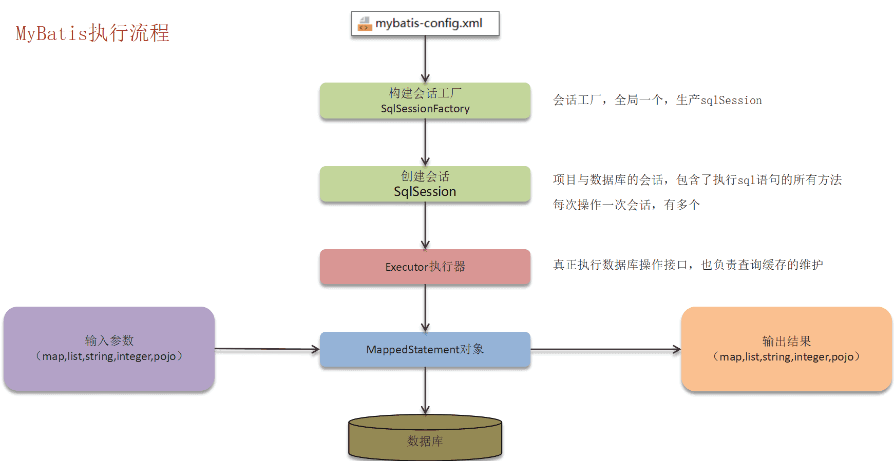
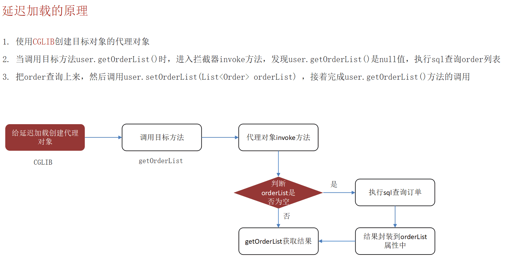

‍

‍

## 概念

‍

### ORM 和原生 SQL 的区别

ORM **封装了数据库底层实现的差异**，开发人员不需要关注数据库是 mysql、mssql 还是 mongodb（不同数据库在 SQL 语法上有差异）。

ORM 使用**链式函数调用**来构建 SQL 语句，比直接写 SQL 语句更加友好，也不容易出错。

ORM 定义的**模型是强类型**的，能够编写类型友好的代码。而原生 SQL，返回的数据类型是未知的。

此外 ORM 能够**抽象表与表之间的关系**，可以让开发者专注于逻辑的编写。ORM 是面向对象的，利于管理和组织代码。

ORM 的缺点是效率低，另外有些场景只能用原生 SQL 实现。

‍

‍

‍

‍

## JOOQ

JOOQ（Java Object Oriented Querying）是一个用于构建类型安全的 SQL 查询的库。它将 SQL 语句封装成 Java 对象，使得开发者可以使用 Java 代码来构建和执行 SQL 查询。JOOQ 提供了强大的类型安全和编译时检查，减少了运行时错误的可能性。

‍

### 特点

1. **类型安全**：JOOQ 生成的代码是类型安全的，能够在编译时检查 SQL 语法和类型错误。
2. **自动生成代码**：JOOQ 可以根据数据库模式**自动生成** Java 类，简化了数据库操作。
3. **强大的 DSL**：JOOQ 提供了一个强大的领域特定语言（DSL），使得构建复杂的 SQL 查询变得简单直观。
4. **支持多种数据库**：JOOQ 支持多种数据库，包括 MySQL、PostgreSQL、Oracle、SQL Server 等

‍

### 和 MyBatis/MP 的对比

‍

1. **查询方式**：

    * **JOOQ**：使用类型安全的 DSL 构建 SQL 查询，查询语句在编译时进行检查。
    * **MyBatis/MP**：使用 XML 或注解编写 SQL 查询，查询语句在运行时进行检查。
2. **代码生成**：

    * **JOOQ**：根据数据库模式**自动生成 Java 类**，简化了数据库操作。
    * **MyBatis/MP**：需要手动编写或使用第三方工具生成映射文件和实体类。
3. **类型安全**：

    * **JOOQ**：提供强大的类型安全和**编译时检查**，减少了运行时错误。
    * **MyBatis/MP**：SQL 查询在运行时进行检查，缺乏编译时的类型安全。
4. **灵活性**：

    * **JOOQ**：适合需要构建复杂 SQL 查询的场景，提供了丰富的 SQL 功能支持。
    * **MyBatis/MP**：适合需要灵活控制 SQL 查询的场景，支持动态 SQL 和自定义查询。

‍

‍

### 示例

使用 JOOQ 构建查询

```java
DSLContext create = DSL.using(connection, SQLDialect.MYSQL);
Result<Record> result = create.select()
                              .from("users")
                              .where("id = ?", 1)
                              .fetch();
```

TSQL也是一样的感觉, DS.select(TSQL....) 都是函数式的编程, 非常优雅. 基本不需要写SQL (懒是一方面, 我承认)

‍

‍

## JPA

‍

‍

## Mybatis

‍

‍

### Mybatis中#与$的区别

经常使用的是`#{}`​, 一般解说是因为这种方式可以防止SQL注入，简单的说`#{}`​这种方式SQL语句是经过预编译的，它是把`#{}`​中间的参数转义成字符串

#{} 这种取值是**编译好SQL语句再取值**

${} 这种是取值以后再去编译SQL语句

‍

示例

```java
预编译后,会动态解析成一个参数标记符?：

select * from student where student_name = ?

而使用${}在动态解析时候，会传入参数字符串

select * from student where student_name = 'lyrics'
```

‍

‍

### 将 sql 执行结果封装为目标对象并返回的？都有哪些映射形式？

答：第一种是使用 `<resultMap>`​ 标签，逐一定义列名和对象属性名之间的映射关系。第二种是使用 sql 列的别名功能，将列别名书写为对象属性名，比如 T_NAME AS NAME，对象属性名一般是 name，小写，但是列名不区分大小写，MyBatis 会忽略列名大小写，智能找到与之对应对象属性名，你甚至可以写成 T_NAME AS NaMe，MyBatis 一样可以正常工作。

有了列名与属性名的映射关系后，MyBatis 通过反射创建对象，同时使用反射给对象的属性逐一赋值并返回，那些找不到映射关系的属性，是无法完成赋值的。

‍

‍

### Dao 接口里的方法，参数不同时方法能重载吗？

Dao 接口里的方法可以重载，但是 Mybatis 的 xml 里面的 **ID 不允许重复**

‍

‍

### xml 映射文件标签

常见的 select、insert、update、delete

 `<resultMap>`​、 `<parameterMap>`​、 `<sql>`​、 `<include>`​、 `<selectKey>`​ ，加上动态 sql 的 9 个标签， `trim|where|set|foreach|if|choose|when|otherwise|bind`​ 等，其中 `<sql>`​ 为 sql 片段标签，通过 `<include>`​ 标签引入 sql 片段， `<selectKey>`​ 为不支持自增的主键生成策略标签。

‍

‍

### Dao 接口工作原理

最佳实践中，通常一个 xml 映射文件，都会写一个 Dao 接口与之对应。Dao 接口就是人们常说的 `Mapper`​ 接口，接口的全限名，就是映射文件中的 namespace 的值

接口的方法名，就是映射文件中 `MappedStatement`​ 的 id 值，接口方法内的参数，就是传递给 sql 的参数。

​`Mapper`​ 接口是没有实现类的，当调用接口方法时，接口全限名+方法名拼接字符串作为 key 值，可唯一定位一个 `MappedStatement`​

‍

‍

### MyBatis执行流程



1. 读取MyBatis配置文件：mybatis-config.xml加载运行环境和映射文件
2. 构造会话工厂SqlSessionFactory
3. 会话工厂创建SqlSession对象（包含了执行SQL语句的所有方法）
4. 操作数据库的接口，Executor执行器，同时负责查询缓存的维护
5. Executor接口的执行方法中有一个MappedStatement类型的参数，封装了映射信息
6. 输入参数映射
7. 输出结果映射

‍

‍

### Mybatis是否支持延迟加载？

Mybatis支持延迟记载，但默认没有开启  
什么叫做延迟加载？ --List<ids>这样的字段不会先给你查出来

‍

‍

​

‍

延迟加载的意思是：就是在需要用到数据时才进行加载，不需要用到数据时就不加载数据。

Mybatis支持一对一关联对象和一对多关联集合对象的延迟加载

在Mybatis配置文件中，可以配置是否启用延迟加载lazyLoadingEnabled=true|false，默认是关闭的

‍

‍

‍

延迟加载的底层原理知道吗？

1. 使用CGLIB创建目标对象的代理对象
2. 当调用目标方法时，进入拦截器invoke方法，发现目标方法是null值，执行sql查询
3. 获取数据以后，调用set方法设置属性值，再继续查询目标方法，就有值了

‍

‍

> **面试官**：Mybatis是否支持延迟加载？
>
> **候选人**：
>
> 是支持的~
>
> 延迟加载的意思是：就是在需要用到数据时才进行加载，不需要用到数据时就不加载数据。
>
> Mybatis支持一对一关联对象和一对多关联集合对象的延迟加载
>
> 在Mybatis配置文件中，可以配置是否启用延迟加载lazyLoadingEnabled=true|false，默认是关闭的

‍

‍

### Mybatis的一级、二级缓存用过吗？

‍

> mybatis的一级缓存: 基于 PerpetualCache 的 HashMap 本地缓存，其存储作用域为 Session，当Session进行flush或close之后，该Session中的所有Cache就将清空，默认打开一级缓存
>
> 关于二级缓存需要单独开启
>
> 二级缓存是基于namespace和mapper的作用域起作用的，不是依赖于SQL session，默认也是采用 PerpetualCache，HashMap 存储。
>
> 如果想要开启二级缓存需要在全局配置文件和映射文件中开启配置才行。
>
> ‍
>
> Mybatis的二级缓存什么时候会清理缓存中的数据
>
> 当某一个作用域(一级缓存 Session/二级缓存Namespaces)的进行了新增、修改、删除操作后，默认该作用域下所有 select 中的缓存将被 clear。

‍

> 一级缓存: 基于 PerpetualCache 的 HashMap 本地缓存，其存储作用域为 Session，当Session进行flush或close之后，该Session中的所有Cache就将清空，默认打开一级缓存  
> 二级缓存是基于namespace和mapper的作用域起作用的，不是依赖于SQL session，默认也是采用 PerpetualCache，HashMap 存储。需要单独开启，一个是核心配置，一个是mapper映射文件

‍

本地缓存，基于PerpetualCache，本质是一个HashMap  
一级缓存：作用域是session级别  
二级缓存：作用域是namespace和mapper的作用域，不依赖于session

‍

‍

#### 一级缓存

一级缓存: 基于 PerpetualCache 的 HashMap 本地缓存，其存储作用域为 Session，当Session进行flush或close之后，该Session中的所有Cache就将清空，默认打开一级缓存

‍

#### 二级缓存

二级缓存是基于namespace和mapper的作用域起作用的，不是依赖于SQL session，默认也是采用 PerpetualCache，HashMap 存储

‍

注意

1，对于缓存数据更新机制，当某一个作用域(一级缓存 Session/二级缓存Namespaces)的进行了新增、修改、删除操作后，默认该作用域下所有 select 中的缓存将被 clear  
2，二级缓存需要缓存的数据实现Serializable接口  
3，只有会话提交或者关闭以后，一级缓存中的数据才会转移到二级缓存中

‍

‍

## MybatisPlusJoin

‍

‍
