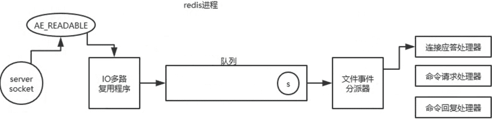
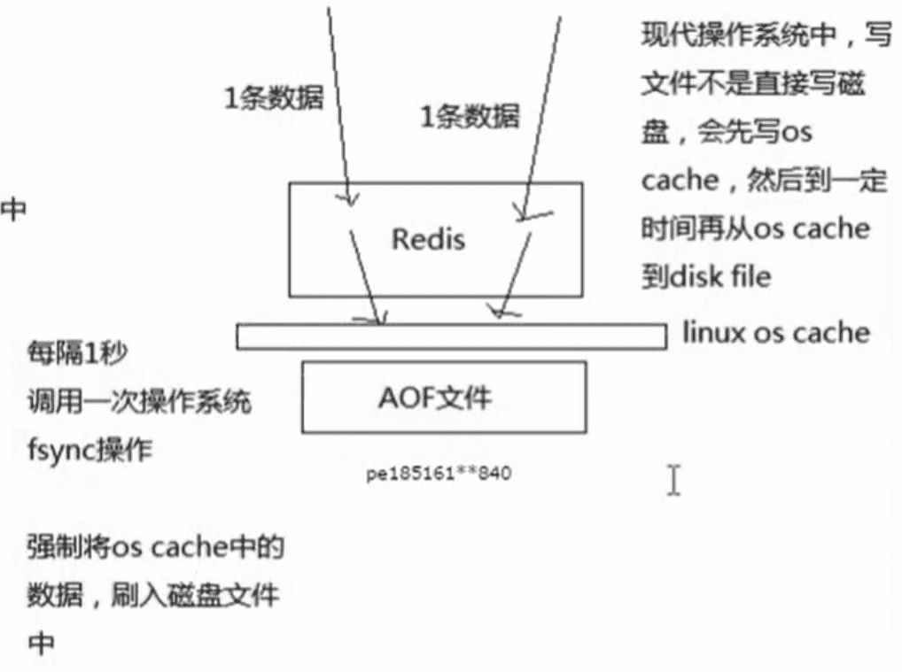

‍

‍

## 介绍

‍

### Redis 优点

(1) 速度快，因为数据存在内存中，类似于 HashMap，HashMap 的优势就是查找和操作的时间复杂度都是 O(1)

(2) 支持丰富数据类型，支持 string，list，set，sorted set，hash

(3) 支持事务，操作都是原子性，所谓的原子性就是对数据的更改要么全部执行，要么全部不执行

(4) 丰富的特性：可用于缓存，消息，按 key 设置过期时间，过期后将会自动删除

‍

‍

### Redis 缺点

1. **内存消耗大**：Redis 是一个内存数据库，所有数据都存储在内存中，这意味着它的**内存消耗非常大**，尤其是当数据量很大时。
2. **持久化机制**：虽然 Redis 提供了持久化选项（RDB 和 AOF），但它们并不是实时的，可能会导致数据丢失。此外，持久化操作会**影响性能**
3. **数据一致性**：在主从复制模式下，数据的一致性可能会受到影响，尤其是在主节点故障或网络分区的情况下。
4. **有限的数据类型**：虽然 Redis 支持多种数据类型，但与关系型数据库相比，数据类型仍然有限，可能不适合某些复杂的数据模型。
5. **缺乏高级查询功能**：Redis 不支持复杂的查询操作，如 SQL 中的 JOIN、GROUP BY 等，这使得它在某些场景下的使用受到限制。

‍

‍

‍

### NoSQL 越来越流行了？

1. 传统的 SQL 数据库需要**使用 ORM 进行调用处理**
2. NoSQL 一般开始设计的时候就**考虑了分布式的问题**
3. **非结构化的数据**越来越多

‍

‍

### **Redis 6 的新特性**

* **多线程 I/O**：在网络 I/O 层面引入多线程处理，提升多核处理性能；
* **ACL（访问控制列表）** ：更精细的安全权限管理；
* **改进的 RESP3 协议**：新协议格式更适合复杂数据交互；
* **性能和稳定性改进**：包括内存管理和集群模式的改进；
* **其他改进**：部分命令行为的调整以及更完善的监控和诊断工具。

‍

‍

## 数据结构

‍

‍

### Key类型选择

‍

‍

#### String 还是 Hash 存储对象数据更好呢？

* String 存储的是**序列化**后的对象数据，存放的是整个对象。Hash 是对对象的**每个字段**单独存储，可以获取部分字段的信息，也可以修改或者添加部分字段，节省网络流量。如果对象中某些字段需要经常变动或者经常需要**单独查询对象中的个别字段信息**，Hash 就非常适合。
* String 存储相对来说**更加节省内存**，缓存相同数量的对象数据，String 消耗的内存约是 Hash 的一半。并且，存储具有多层嵌套的对象时也方便很多。如果系统对性能和资源消耗非常敏感的话，String 就非常适合。

在绝大部分情况，建议使用 String 来存储对象数据即可！

‍

‍

##### 购物车信息用 String 还是 Hash 存储更好呢?

由于购物车中的**商品频繁修改和变动**，购物车信息建议使用 Hash 存储：

* 用户 id 为 key
* 商品 id 为 field，商品数量为 value

‍

那用户购物车信息的维护具体应该怎么操作呢？

* 用户添加商品就是往 Hash 里面增加新的 field 与 value；
* 查询购物车信息就是遍历对应的 Hash；
* 更改商品数量直接修改对应的 value 值（直接 set 或者做运算皆可）；
* 删除商品就是删除 Hash 中对应的 field；
* 清空购物车直接删除对应的 key 即可。

‍

‍

### Redis中的哈希Hash相关

‍

#### Redis遇到哈希冲突怎么办？

原理跟 Java 的 HashMap 类似，都是数组+链表 (没有红黑树) 的结构。当发生 hash 碰撞时将会把元素追加到链表上

‍

#### redis对hash扩容进行了优化你知道吗，如何降低扩容的时间复杂度?

Redis 对 hash 扩容进行了优化，以降低扩容的时间复杂度。Redis 采用渐进式 rehashing（rehashing）来优化 hash 扩容过程。以下是一些关键点：

‍

1. **渐进式 rehashing**：

    * Redis 不会一次性完成整个 hash 表的 rehashing 操作，而是将其分成多个小步骤，逐步完成。
    * 在 rehashing 过程中，Redis 会同时维护两个 hash 表：一个旧表和一个新表。
    * 每次对 hash 表进行操作时，Redis 会将旧表中的一部分数据迁移到新表中，直到所有数据都迁移完毕。
2. **降低时间复杂度**：

    * 通过渐进式 rehashing，Redis 将一次性的大量计算分散到多次小的计算中，避免了单次操作时间过长的问题。
    * 这种方法有效地降低了 rehashing 对系统性能的影响，使得扩容过程更加平滑。

‍

‍

### Zset的底层是什么, 以及为什么Zset用跳表不用红黑树，B+树

​`Zset`​（有序集合）是 Redis 中的一种数据结构，它的底层实现主要是跳表（Skip List）和哈希表（Hash Table）的结合。

‍

#### 底层实现

1. **跳表（Skip List）** ：用于维护元素的有序性，支持高效的范围查询和排序操作。
2. **哈希表（Hash Table）** ：用于快速定位元素，支持 O(1) 时间复杂度的查找操作。

‍

‍

#### 为什么 Zset 用跳表而不用红黑树或 B+ 树

1. **实现复杂度**：

    * 跳表的**实现相对简单**，代码量少，易于维护。
    * 红黑树和 B+ 树的实现复杂度较高，维护成本较大。
2. **性能**：

    * 跳表在平均情况下的时间复杂度为 O(log n)，与红黑树和 B+ 树相当。
    * 跳表的插入、删除和查找操作在大多数情况下都能保持较高的性能。
3. **内存使用**：

    * 跳表的内存使用较为**灵活**，可以根据需要动态调整层数。
    * 红黑树和 B+ 树的内存使用较为固定，可能会导致内存浪费。
4. **范围查询**：

    * 跳表在进行**范围查询**时非常高效，能够**快速遍历**有序元素。
    * 红黑树和 B+ 树在范围查询上虽然也有较好的性能，但实现复杂度较高。

综上所述，跳表在实现复杂度、性能和内存使用等方面都有较好的平衡，因此 Redis 选择使用跳表作为 Zset 的底层数据结构。

‍

‍

‍

### Redis 常见数据类型

(不是底层的)

* **5 种基础数据类型**：String（字符串）、List（列表）、Set（集合）、Hash（散列）、Zset（有序集合）
* **3 种特殊数据类型**：HyperLogLog（基数统计）、Bitmap （位图）、Geospatial (地理位置)

不同的数据类型的具体实现

[Redis设计与实现 — Redis 设计与实现 (huangz.works)](https://huangz.works/redisbook1e/)

‍

### 消息队列

> Reids在内存存储引擎领域的一大优点是提供 list 和 set 操作，这使得Redis能作为一个很好的消息队列平台来使用。而且Redis中还有pub/sub这样的专用结构，用于1对N的消息通信模式。

‍

四种方式

* 使用 List 实现消息队列
* 使用 ZSet 实现消息队列
* 使用 发布订阅者模式 实现消息队列
* 使用 Stream 实现消息队列

‍

‍

#### List

**最为简单和直接**，通过 lpush、rpop 存入和读取实现消息队列的

lpush 可以把最新的消息存储到消息队列（List 集合）的首部，而 rpop 可以读取消息队列的尾部，这样就实现了先进先出

‍

```shell
127.0.0.1:6379> lpush mq "java" #推送消息 java
(integer) 1
127.0.0.1:6379> lpush mq "msg" #推送消息 msg
(integer) 2
127.0.0.1:6379> rpop mq #接收到消息 java
"java"
127.0.0.1:6379> rpop mq #接收到消息 msg
"mq"
```

‍

* 消息可以被持久化，List 可以借助 Redis 本身的持久化功能，AOF 或者是 RDB 或混合持久化的方式，用于把数据保存至磁盘: 重启之后，消息不会丢失。
* 消息不支持重复消费、没有按照主题订阅的功能、不支持消费消息确认等。

‍

#### ZSet

‍

和 List 类似, 利用 zadd 和 zrangebyscore 来实现存入和读取消息

ZSet 的实现方式更为复杂一些，因为 ZSet 多了一个分值（score）属性，可以使用它来实现更多的功能

比如用它来存储时间戳，以此来实现延迟消息队列等

‍

* ZSet 同样具备持久化的功能
* List 存在的问题它也同样存在

  * 不但如此，使用 ZSet 还不能存储相同元素的值。因为它是有序集合，有序集合的存储元素值是不能重复的，但分值可以重复，也就是说当消息值重复时，只能存储一条信息在 ZSet 中

---

#### Publisher Subscriber

‍

Publisher（发布者）和 Subscriber（订阅者）来实现消息队列

* 发布消息，publish channel "message"
* 订阅消息，subscribe channel

‍

使用发布和订阅的类型实现主题订阅的功能，也就是 Pattern Subscribe 的功能。

可以使用一个消费者“queue_*”来订阅所有以“queue_”开头的消息队列

‍

3 个问题：

* **无法持久化**保存消息，如果 Redis 服务器宕机或重启，那么所有的消息将会丢失 (难顶)
* 发布订阅模式是  **“发后既忘”**  的工作模式，如果有订阅者离线重连之后就**不能消费之前的历史消息**
* 不支持**消费者确认机制**，稳定性不能得到保证

‍

---

#### Stream

‍

Redis 5.0 之后新增了 Stream 类型，使用 Stream 的 xadd 和 xrange 来实现消息的存入和读取

Stream 提供了 xack 手动确认消息消费的命令

‍

消费确认增加了消息的可靠性，一般在业务处理完成之后，需要执行 xack 确认消息已经被消费完成

```text
xack key group-key ID [ID ...] 
```

其中“Group”为群组，消费者也就是接收者需要订阅到群组才能正常获取到消息

‍

‍

### 延时队列

‍

#### 基本实现描述

‍

Redis 延迟队列通常使用 有序集合（Sorted Set）来实现。

* 每个任务作为一个成员存入有序集合，score 值一般设为任务执行的时间戳。
* 轮询（或定时脚本）根据当前时间取出 score 小于当前时间的任务，进行处理。

> 使用sortedset，拿时间戳作为score，消息内容作为key，调用zadd来生产消息，消费者用`zrangebyscore`​指令获取N秒之前的数据轮询进行处理。

‍

#### 为什么不能用过期key实现延迟队列?

‍

**不能简单用过期 key 实现原因**：

* Redis key 的过期机制是**被动的**（lazy expiration）和**定时扫描**（active expiration）的混合，不保证在精确时间点删除。
* 过期 key **不会触发特定的回调事件**，难以确保任务能被及时处理。
* 另外，过期 key 机制受内存和系统压力影响，容易出现批量失效和延迟处理的情况，不适合精确控制延迟任务的执行时间。

‍

‍

### 基础数据类型总结

‍

#### STRING

String类型的底层的数据结构实现主要是SDS(简单动态字符串)。应用场景主要有：

* 缓存对象：例如可以用STRING缓存整个对象的JSON。
* 计数：Redis处理命令是单线程，所以执行命令的过程是原子的，因此String数据类型适合计数场景，比如计算访问次数、点赞、转发、库存数量等等。
* 分布式锁：可以利用SETNX命令。
* 共享Session信息：服务器都会去同一个Redis获取相关的Session信息，解决了分布式系统下Session存储的问题。

‍

#### LIST

List 类型的底层数据结构是由**双向链表或压缩列表**实现的：

* 如果列表的元素个数小于 512 个，列表每个元素的值都小于 64 字节，Redis 会使用**压缩列表**作为 List 类型的底层数据结构；
* 如果列表的元素不满足上面的条件，Redis 会使用**双向链表**作为 List 类型的底层数据结构；

在 Redis 3.2 版本之后，List 数据类型底层数据结构只由 quicklist 实现，替代了双向链表和压缩列表。在 Redis 7.0 中，压缩列表数据结构被废弃，由 listpack 来实现。应用场景主要有：

* **微信朋友圈点赞**：要求按照点赞顺序显示点赞好友信息，如果取消点赞，移除对应好友信息。
* **消息队列**：可以使用左进右出的命令组成来完成队列的设计。比如：数据的生产者可以通过Lpush命令从左边插入数据，多个数据消费者，可以使用BRpop命令阻塞的”抢”列表尾部的数据。

‍

#### HASH

Hash 类型的底层数据结构是由压缩列表或哈希表实现的：

* 如果哈希类型元素个数小于 512 个，所有值小于 64 字节的话，Redis 会使用压缩列表作为 Hash 类型的底层数据结构；
* 如果哈希类型元素不满足上面条件，Redis 会使用哈希表作为 Hash 类型的底层数据结构。

在Redis 7.0 中，压缩列表数据结构被废弃，交由 listpack 来实现。应用场景主要有：

* **缓存对象**：一般对象用 String + Json 存储，对象中某些频繁变化的属性可以考虑抽出来用 Hash 类型存储。
* **购物车**：以用户 id 为 key，商品 id 为 field，商品数量为 value，恰好构成了购物车的3个要素。

‍

‍

#### SET

Set 类型的底层数据结构是由**哈希表或整数集合**实现的：

* 如果集合中的元素都是整数且元素个数小于 512个，Redis 会使用**整数集合**作为 Set 类型的底层数据结构；
* 如果集合中的元素不满足上面条件，则 Redis 使用**哈希表**作为 Set 类型的底层数据结构。

应用场景主要有：

* **点赞**：key 是文章id，value 是用户id。
* **共同关注**：Set 类型支持交集运算，所以可以用来计算共同关注的好友、公众号等。key 可以是用户id，value 则是已关注的公众号的id。
* **抽奖活动**：存储某活动中中奖的用户名 ，Set 类型因为有去重功能，可以保证同一个用户不会中奖两次。

‍

> Set 的差集、并集和交集的计算复杂度较高，在数据量较大的情况下，如果直接执行这些计算，会导致 Redis 实例阻塞。在主从集群中，为了避免主库因为 Set 做聚合计算（交集、差集、并集）时导致主库被阻塞，可以选择一个从库完成聚合统计，或者把数据返回给客户端，由客户端来完成聚合统计。

‍

#### Zset

Zset类型(Sorted Set，有序集合)可以根据元素的权重来排序，可以自己来决定每个元素的权重值。比如说，可以根据元素插入Sorted Set 的时间确定权重值，先插入的元素权重小，后插入的元素权重大。应用场景主要有：

* 在面对需要展示最新列表、排行榜等场景时，如果数据更新频繁或者需要分页显示，可以优先考虑使用 Zset。
* **排行榜**：有序集合比较典型的使用场景就是排行榜。例如学生成绩的排名榜、游戏积分排行榜、视频播放排名、电商系统中商品的销量排名等。

‍

#### BitMap

bit 是计算机中最小的单位，使用它进行储存将非常节省空间，特别适合一些数据量大且使用二值统计的场景。可以用于签到统计、判断用户登陆态等操作。

‍

#### HyperLogLog

HyperLogLog用于基数统计，统计规则是基于概率完成的，不准确，标准误算率是 0.81%。优点是，在输入元素的数量或者体积非常非常大时，所需的内存空间总是固定的、并且很小。比如百万级网页 UV 计数等

‍

#### GEO

主要用于存储地理位置信息，并对存储的信息进行操作。底层是由Zset实现的，使用GeoHash编码方法实现了经纬度到Zset中元素权重分数的转换，这其中的两个关键机制就是「对二维地图做区间划分」和「对区间进行编码」。一组经纬度落在某个区间后，就用区间的编码值来表示，并把编码值作为Zset元素的权重分数。

‍

‍

#### Stream

Redis专门为消息队列设计的数据类型。相比于基于 List 类型实现的消息队列，有这两个特有的特性：自动生成全局唯一消息ID，支持以消费组形式消费数据。

之前方法缺陷：不能持久化，无法可靠的保存消息，并且对于离线重连的客户端不能读取历史消息。

‍

‍

### 底层数据类型总结

‍

#### SDS

SDS 不仅可以保存文本数据，还可以保存二进制数据。

O(1)复杂度获取字符串长度，因为有Len属性。

不会发生缓冲区溢出，因为 SDS 在拼接字符串之前会检查空间是否满足要求，如果空间不够会自动扩容，所以不会导致缓冲区溢出的问题。

‍

‍

#### 链表

节点是一个双向链表，在双向链表基础上封装了listNode这个数据结构。包括链表节点数量 len、以及可以自定义实现的 dup、free、match 函数。

* listNode 链表节点的结构里带有 prev 和 next 指针，获取某个节点的前置节点或后置节点的时间复杂度只需O(1)，而且这两个指针都可以指向 NULL，所以链表是无环链表；
* list 结构因为提供了表头指针 head 和表尾节点 tail，所以获取链表的表头节点和表尾节点的时间复杂度只需O(1)；

‍

缺陷：

* 链表每个节点之间的内存都是不连续的，无法很好利用 CPU 缓存。能很好利用CPU缓存的数据结构是数组，因为数组的内存是连续的。
* 保存一个链表节点的值都需要一个链表节点结构头的分配，内存开销较大。

‍

‍

#### 压缩列表

‍

压缩列表是由连续内存块组成的顺序型数据结构，类似于数组。不仅可以利用 CPU 缓存，而且会针对不同长度的数据，进行相应编码，这种方法可以有效地节省内存开销。不能保存过多的元素，否则查询效率就会降低；新增或修改某个元素时，压缩列表占用的内存空间需要重新分配，甚至可能引发连锁更新的问题。

‍

**缺陷：**

* 空间扩展操作也就是重新分配内存，因此连锁更新一旦发生，就会导致压缩列表占用的内存空间要多次重新分配，直接影响到压缩列表的访问性能。
* 如果保存的元素数量增加了，或是元素变大了，会导致内存重新分配，会有连锁更新的问题。
* 压缩列表只会用于保存的节点数量不多的场景，只要节点数量足够小，即使发生连锁更新也能接受。

‍

‍

#### **哈希**

哈希表是一种保存键值对(key-value)的数据结构。优点在于能以O(1)的复杂度快速查询数据。Redis 采用了拉链法来解决哈希冲突，在不扩容哈希表的前提下，将具有相同哈希值的数据串起来，形成链接。渐进式哈希的过程如下：

Redis定义一个dict结构体，这个结构体里定义了**两个哈希表(ht[2])** 。

* 给ht2分配空间；
* 在 rehash 进行期间，每次哈希表元素进行新增、删除、查找或者更新操作时，Redis 除了会执行对应的操作之外，还会顺序将ht1中索引位置上的所有数据迁移到ht2上；
* 随着处理客户端发起的哈希表操作请求数量越多，最终在某个时间点会把「哈希表 1 」的所有 key-value 迁移到「哈希表 2」，从而完成 rehash 操作。

‍

‍

##### 渐进式哈希的触发条件？

‍

**触发条件**：

负载因子 \= 哈希表已保存节点数/哈希表大小

当负载因子大于等于 1 ，没有执行 RDB 快照或没有进行 AOF 重写的时候，就会进行 rehash 操作。

当负载因子大于等于 5 时，此时说明哈希冲突非常严重了，不管有没有有在执行 RDB 快照或 AOF 重写，都会强制进行 rehash 操作。

‍

‍

#### 跳表

一种多层的有序链表，能快读定位数据。当数据量很大时，跳表的查找复杂度就是O(logN)。

节点同时保存元素和元素的权重，每个跳表节点都有一个后向指针，指向前一个节点，目的是为了方便从跳表的尾节点开始访问节点，为了倒序查找时方便。跳表是一个带有层级关系的链表，而且每一层级可以包含多个节点，每一个节点通过指针连接起来。Zset数组中一个属性是level数组，一个level数组就代表跳表的一层，定义了指向下一个节点的指针和跨度。

‍

跳表的相邻两层的节点数量的比例会影响跳表的查询性能。相邻两层的节点数量最理想的比例是 2:1，查找复杂度可以降低到 O(logN)。为了防止插入删除时间消耗，跳表在创建节点的时候，随机生成每个节点的层数。具体的做法是，跳表在创建节点时候，会生成范围为[0-1]的一个随机数，如果这个随机数小于 0.25（相当于概率 25%），那么层数就增加 1 层，然后继续生成下一个随机数，直到随机数的结果大于 0.25 结束，最终确定该节点的层数。

‍

##### 跳表的查找过程？

查找一个跳表节点的过程时，跳表会从头节点的最高层开始，逐一遍历每一层。在遍历某一层的跳表节点时，会用跳表节点中的 SDS 类型的元素和元素的权重来进行判断：

* 如果当前节点的权重小于要查找的权重时，跳表就会访问该层上的下一个节点。
* 如果当前节点的权重等于要查找的权重时，并且当前节点的 SDS 类型数据小于要查找的数据时，跳表就会访问该层上的下一个节点。

如果上面两个条件都不满足，或者下一个节点为空时，跳表就会使用目前遍历到的节点的 level 数组里的下一层指针，然后沿着下一层指针继续查找。

‍

‍

#### **整数集合**

整数集合本质上是一块连续内存空间。

整数集合有一个升级规则，就是当将一个新元素加入到整数集合里面，如果新元素的类型（int32\_t）比整数集合现有所有元素的类型（int16\_t）都要长时，整数集合需要先进行升级，也就是按新元素的类型（int32\_t）扩展 contents 数组的空间大小，然后才能将新元素加入到整数集合里，升级的过程中也要维持整数集合的有序性。

‍

##### **quicklist**

其实 quicklist 就是双向链表 + 压缩列表组合，quicklist 就是一个链表，而链表中的每个元素又是一个压缩列表。quicklist 解决办法，通过控制每个链表节点中的压缩列表的大小或者元素个数，来规避连锁更新的问题。因为压缩列表元素越少或越小，连锁更新带来的影响就越小，从而提供了更好的访问性能。

‍

##### **listpack**

listpack 没有压缩列表中记录前一个节点长度的字段了，listpack 只记录当前节点的长度，当向 listpack 加入一个新元素的时候，不会影响其他节点的长度字段的变化，从而避免了压缩列表的连锁更新问题。

‍

## 交互API

‍

### Redis常用命令

‍

#### 字符串操作命令

Redis 中字符串类型常用命令：

* **SET** key value 设置指定key的值
* **GET** key 获取指定key的值
* **SETEX** key seconds value 设置指定key的值，并将 key 的过期时间设为 seconds 秒 (set expire)
* **SETNX** key value 只有在 key 不存在时设置 key 的值 (set not-exist)

‍

#### 哈希操作命令

Redis hash 是一个string类型的 field 和 value 的映射表，hash特别适合用于存储对象，常用命令：

* **HSET** key field value 将哈希表 key 中的字段 field 的值设为 value
* **HGET** key field 获取存储在哈希表中指定字段的值
* **HDEL** key field 删除存储在哈希表中的指定字段
* **HKEYS** key 获取哈希表中所有字段
* **HVALS** key 获取哈希表中所有值

‍

#### 列表操作命令

Redis 列表是简单的字符串列表，按照插入顺序排序，常用命令：

* **LPUSH** key value1 [value2] 将一个或多个值插入到列表头部
* **LRANGE** key start stop 获取列表指定范围内的元素
* **RPOP** key 移除并获取列表最后一个元素
* **LLEN** key 获取列表长度
* **BRPOP** key1 [key2 ] timeout 移出并获取列表的最后一个元素， 如果列表没有元素会阻塞列表直到等待超 时或发现可弹出元素为止

‍

‍

#### 集合操作命令

Redis set 是string类型的无序集合。集合成员是唯一的，这就意味着集合中不能出现重复的数据，常用命令：

* **SADD** key member1 [member2] 向集合添加一个或多个成员
* **SMEMBERS** key 返回集合中的所有成员
* **SCARD** key 获取集合的成员数
* **SINTER** key1 [key2] 返回给定所有集合的交集
* **SUNION** key1 [key2] 返回所有给定集合的并集
* **SREM** key member1 [member2] 移除集合中一个或多个成员

‍

‍

#### 有序集合操作命令

Redis有序集合是string类型元素的集合，且不允许有重复成员。每个元素都会关联一个double类型的分数。常用命令：

* **ZADD** key score1 member1 [score2 member2] 向有序集合添加一个或多个成员
* **ZRANGE** key start stop [WITHSCORES] 通过索引区间返回有序集合中指定区间内的成员
* **ZINCRBY** key increment member 有序集合中对指定成员的分数加上增量 increment
* **ZREM** key member [member ...] 移除有序集合中的一个或多个成员

‍

‍

#### 通用命令

Redis的通用命令是不分数据类型的，都可以使用的命令：

* KEYS pattern 查找所有符合给定模式( pattern)的 key
* EXISTS key 检查给定 key 是否存在
* TYPE key 返回 key 所储存的值的类型
* DEL key 该命令用于在 key 存在是删除 key

‍

‍

### RedisTemplate的两种序列化实践方案

* 方案一：自定义RedisTemplate修改RedisTemplate的序列化器为GenericJackson2JsonRedisSerializer
* 方案二：使用StringRedisTemplate写入Redis时，手动把对象序列化为JSON读取Redis时，手动把读取到的JSON反序列化为对象

‍

‍

‍

## Key基础

‍

‍

### Redis 单个 key 能够承受的最大 QPS

10W量级

‍

‍

‍

### Key的**逻辑访问次数是如何计算的**？(热度计算)

由于记录访问次数的只有`8bit`​，即便是无符号数，最大值只有255，不可能记录真实的访问次数。因此Redis统计的其实是逻辑访问次数。这其中有一个计算公式，会根据当前的访问次数做计算，结果要么是次数`+1`​，要么是次数不变。但随着当前访问次数越大，`+1`​的概率也会越低，并且最大值不超过255.

除此以外，逻辑访问次数还有一个衰减周期，默认为1分钟，即每隔1分钟逻辑访问次数会`-1`​。这样逻辑访问次数就能基本反映出一个`key`​的访问热度了。

‍

‍

‍

### 如果redis的这个key没有过期，但是并不能抗住当前的并发量，你如何去做?

‍

1. **使用 Redis 集群**：将数据分片到多个 Redis 实例上，以分散负载。
2. **使用缓存穿透、缓存击穿和缓存雪崩的解决方案**：

    * **缓存穿透**：使用布隆过滤器来避免无效请求直接打到数据库。
    * **缓存击穿**：使用互斥锁（如 `SETNX`​）来防止大量并发请求在缓存失效时同时访问数据库。
    * **缓存雪崩**：设置不同的过期时间，避免大量缓存同时失效。
3. **使用本地缓存**：在应用程序中引入本地缓存（如 Guava Cache 或 Caffeine），减少对 Redis 的访问频率。
4. **优化数据结构**：选择合适的数据结构和序列化方式，减少 Redis 的存储和网络开销。
5. **限流和降级**：对高并发请求进行限流，必要时进行服务降级。

‍

‍

‍

### redis里面大key是啥，热key是啥？会导致什么?

* **大 key** 会导致内存消耗过大、操作延迟和阻塞等问题。
* **热 key** 会导致负载不均、缓存穿透和性能瓶颈等问题。

在使用 Redis 时，应尽量避免大 key 和热 key 的出现，或者采取相应的措施来缓解其影响。

‍

#### 大 key

**大 key** 是指在 Redis 中存储的数据量非常大的 key。大 key 可能是一个包含大量元素的集合（如 list、set、zset 或 hash），也可能是一个非常长的字符串。

‍

**影响**：

1. **内存消耗**：大 key 会占用大量内存，可能导致 Redis 内存不足。
2. **操作延迟**：对大 key 的操作（如读取、删除）可能会导致较长的延迟，影响 Redis 的性能。
3. **阻塞**：某些操作（如删除大 key）可能会阻塞 Redis，影响其他请求的处理。

‍

‍

#### 热 key

**热 key** 是指在 Redis 中被频繁访问的 key。热 key 可能会导致 Redis 的负载集中在某些特定的 key 上。

‍

**影响**：

1. **负载不均**：热 key 会导致 Redis 的**负载不均衡**，某些节点可能会因为频繁访问而过载。
2. **缓存穿透**：如果热 key **频繁被访问但不存在**，可能会导致缓存穿透，增加后端数据库的压力。
3. **性能瓶颈**：热 key 可能成为系统的性能瓶颈，影响整体性能。

‍

‍

‍

#### 你觉得有个服务有1个接口，调用这个redis的大key/热key，这会发生什么？业务层上监控的指标会有什么变化？你觉变化的量级会是多少？(综合)

如果一个服务有一个接口频繁调用 Redis 的大 key 或热 key，可能会发生以下情况：

‍

发生的问题

1. **大 key**：

    * **内存消耗**：大 key 会占用大量内存，可能导致 Redis 内存不足。
    * **操作延迟**：对大 key 的操作（如读取、删除）可能会导致较长的延迟，影响 Redis 的性能。
    * **阻塞**：某些操作（如删除大 key）可能会阻塞 Redis，影响其他请求的处理。
2. **热 key**：

    * **负载不均**：热 key 会导致 Redis 的负载不均衡，某些节点可能会因为频繁访问而过载。
    * **缓存穿透**：如果热 key 频繁被访问但不存在，可能会导致缓存穿透，增加后端数据库的压力。
    * **性能瓶颈**：热 key 可能成为系统的性能瓶颈，影响整体性能。

‍

‍

业务层监控的指标变化

1. **响应时间**：

    * **大 key**：操作大 key 可能会导致响应时间显著增加，尤其是删除或修改大 key 时。
    * **热 key**：频繁访问热 key 可能会导致响应时间增加，尤其是在 Redis 负载过高时。
2. **CPU 和内存使用率**：

    * **大 key**：内存使用率会显著增加，CPU 使用率也可能增加。
    * **热 key**：CPU 使用率会显著增加，内存使用率可能会波动。
3. **请求失败率**：

    * **大 key**：由于操作延迟和阻塞，可能会导致请求失败率增加。
    * **热 key**：由于负载过高，可能会导致请求失败率增加。

‍

‍

变化的量级

* **响应时间**：可能会增加数倍，具体取决于大 key 的大小和热 key 的访问频率。
* **CPU 和内存使用率**：可能会显著增加，具体取决于大 key 的大小和热 key 的访问频率。
* **请求失败率**：可能会显著增加，具体取决于 Redis 的负载情况。

‍

‍

### Big Key处理

‍

可能发生的场景：

* 部分列表类存储： 例如，存储粉丝列表或商品列表的大型数据结构。
* 统计类的集合： 需要按天统计某类用户的集合，随着用户数量的增加，该Key的大小也会增加。
* 大数据缓存类： Redis作为数据库缓存，若缓存的数据量过大，例如将几万行的数据存储为一个JSON，就会产生大Key。

‍

‍

发现大 Key的方法：

* 分析 RDB 文件： 对RDB文件进行分析，找出其中的大Key。
* scan + debug： 结合scan命令和debug object命令，筛选出当前实例所有Key的大小，找到大Key。
* redis-cli --bigkeys： 使用redis-cli的bigkeys命令，找到实例中各种数据类型的最大Key。

‍

‍

删除大 Key的方法：

* Lazy Free： Redis 4.0提供了异步延时释放Key内存的功能，将释放操作放在后台线程处理，减少对主线程的阻塞。
* UNLINK命令： Redis 4.0.0引入了UNLINK命令，其时间复杂度是O(1)，能够快速删除大Key。
* 集合scan命令： 对于低版本的Redis，可以使用集合配套的scan命令分批删除大Key的元素。

‍

‍

#### 存了很大量的数据的一个key, 怎么安全的删除他

在 Redis 中删除一个包含大量数据的 key 时，直接使用 `DEL`​ 命令可能会导致阻塞，影响 Redis 的性能。

为了安全地删除这个 key，可以使用 `UNLINK`​ 命令 或 `SCAN`​ 命令结合 `DEL`​ 命令逐步删除(复杂略)

‍

使用 `UNLINK`​ 命令

​`UNLINK`​ 命令是**非阻塞的**，它会将 key 从键空间中移除，并在**后台异步释放内存**

```shell
UNLINK key_name
```

‍

‍

‍

### 如果只有一个redis服务器，又有上千万的并发请求？应该怎么做？（高并发怎么解决？）

应该可以用热key来解决, 因为其他场景固定死了

‍

首先可以进行一个监控, 对监控的结果进行日志输出分析

* 按业务场景预估热点 key： 根据业务特点预估一些热门key，如促销商品等。这种方法简单但依赖人工经验，无法发现意外的热点。
* 客户端收集： 封装代码统计Redis的所有访问命令，对命令进行统计分析。简单方便但需要代码修改。
* 代理层收集： 在访问Redis之前添加访问代理层，代理层收敛请求并进行统计。无代码侵入但架构复杂。
* Redis监控命令： 使用Redis提供的监控命令，如hotkeys命令，实时监控热 Key。无代码侵入但对大集群扫描较慢。
* 网络抓包分析： 抓取Redis服务器侧的包进行分析，发现流量倾斜和热 Key。无代码侵入但可能恶化现有问题
* 京东hotkeys框架： 京东开源的hotkeys框架可用于实时侦测热 Key，并自动推送到本地缓存。适用于电商等场景的热 Key 发现和处理。

‍

‍

处理热 Key

* 本地缓存： 在访问Redis之前加一层本地缓存，将部分热 Key 存储在本地。需要合理设计淘汰策略和热 Key 发现机制。
* 本机Redis备机： 将Redis备机部署在本地，充当本地缓存的角色。需要考虑一致性和维护成本。

‍

‍

‍

‍

### Redis如何处理大key (放的啥)

‍

**定义**：String 类型的值大于 10 KB；Hash、List、Set、ZSet 类型的元素的个数超过5000个；

‍

**影响**：

* **客户端超时阻塞**：由于 Redis 执行命令是单线程处理，然后在操作大 key 时会比较耗时。客户端认为很久没有响应。
* **引发网络阻塞**：每次获取大 key 产生的网络流量较大。
* **阻塞工作线程**：如果使用 del 删除大 key 时，会阻塞工作线程，这样就没办法处理后续的命令。
* **内存分布不均**：集群模型在 slot 分片均匀情况下，会出现数据和查询倾斜情况，部分有大 key 的 Redis 节点占用内存多，QPS 也会比较大。

‍

**处理**：

* 当vaule是string时，比较难拆分，则使用序列化、压缩算法将key的大小控制在合理范围内，但是序列化和反序列化都会带来更多时间上的消耗。
* 当value是string，压缩之后仍然是大key，则需要进行拆分，一个大key分为不同的部分，记录每个部分的key，使用multiget等操作实现事务读取。
* 分拆成几个key-value，存储在一个hash中，每个field代表一个具体的属性，使用hget，hmget来获取部分的value，使用hset，hmset来更新部分属性
* 当value是list/set等集合类型时，根据预估的数据规模来进行分片，不同的元素计算后分到不同的片。

‍

‍

‍

‍

## Key过期与内存淘汰策略

‍

### 介绍下Redis的(Key)过期与(内存)淘汰策略

> Redis过期策略包含定期删除和惰性删除两部分。定期删除是在Redis内部有一个定时任务，会定期删除一些过期的key。惰性删除是当用户查询某个Key时，会检查这个Key是否已经过期，如果没过期则返回用户，如果过期则删除。
>
> 但是这两个策略都无法保证过期key一定删除，漏网之鱼越来越多，还可能导致内存溢出。当发生内存不足问题时，Redis还会做内存回收。内存回收采用LRU策略，就是最近最少使用。其原理就是记录每个Key的最近使用时间，内存回收时，随机抽取一些Key，比较其使用时间，把最老的几个删除。
>
> Redis的逻辑是：最近使用过的，很可能再次被使用

‍

‍

### Key过期策略类型(简单)

> 这里是三种, 因为合并起来了

‍

三种过期删除策略：

* 定时删除：**在设置 key 的过期时间时，同时创建一个定时事件，当时间到达时，由事件处理器执行 key 的删除操作。**

  * **优点**：内存可以被尽快地释放。定时删除对内存是最友好的。
  * **缺点**：定时删除策略对 CPU 不友好，删除过期 key 可能会占用相当一部分 CPU 时间，CPU 紧张的情况下将 CPU 用于删除和当前任务无关的过期键上，会对服务器的响应时间和吞吐量造成影响。
* 惰性删除：**不主动删除过期键，每次从数据库访问 key 时检测 key 是否过期，如果过期则删除该key。**

  * **优点**：只会使用很少的系统资源，对 CPU 最友好。
  * **缺点**：如果一个 key 已经过期，而这个 key 又仍然保留在数据库中，那么只要这个过期 key 一直没有被访问，它所占用的内存就不会释放。惰性删除策略对内存不友好。
* 定期删除：**每隔一段时间随机从数据库中取出一定数量的 key 进行检查，并删除其中的过期key。**

  * **优点**：限制删除操作执行的时长和频率来减少删除操作对 CPU 的影响，同时也能删除一部分过期的数据减少了过期键对空间的无效占用。
  * **缺点**：内存清理方面没有定时删除效果好，同时没有惰性删除使用的系统资源少。难以确定删除操作执行的时长和频率。

‍

**Redis 选择惰性删除+定期删除这两种策略配和使用**，以求在合理使用 CPU 时间和避免内存浪费之间取得平衡。Redis 在访问或者修改 key 之前，都会调用 expireIfNeeded 函数对其进行检查，检查 key 是否过期：

* 如果过期，则删除该 key，然后返回 null 客户端；
* 如果没有过期，不做任何处理，然后返回正常的键值对给客户端；

从过期字典中随机抽取 20 个 key；检查这 20 个 key 是否过期，并删除已过期的 key；已过期 key 的数量占比随机抽取 key 的数量大于 25%，则继续重复步骤直到比重小于25%

‍

‍

### Key过期策略类型

对于已过期数据，在Redis中，同时使用了定期删除和惰性删除

推荐的Redis的过期删除策略：惰性删除 + 定期删除两种策略进行配合使用

‍

推荐回答

> 在redis中提供了两种数据过期删除策略
>
> 第一种是 **惰性删除**，在设置该key过期时间后，我们不去管它，当需要该key时，我们在检查其是否过期，如果过期，我们就删掉它，反之返回该key。
>
> 第二种是 **定期删除**，就是说每隔一段时间，我们就对一些key进行检查，删除里面过期的key
>
> ‍
>
> 定期清理的两种模式：
>
> * SLOW模式是**定时任务**，执行频率默认为10hz，每次不超过25ms，以通过修改配置文件redis.conf 的 **hz** 选项来调整这个次数
> * FAST模式**执行频率不固定**，每次事件循环会尝试执行，但两次间隔不低于2ms，每次耗时不超过1ms
>
> Redis的过期删除策略：**惰性删除 + 定期删除**两种策略进行配合使用

‍

‍

‍

‍

#### 惰性删除

不主动删除过期的键值，而是当访问键值时，再检查当前的键值是否过期

‍

* 优点 ：对CPU友好，只会在使用该key时才会进行过期检查，对于很多用不到的key不用浪费时间进行过期检查: 不会浪费太多的系统资源，只是在每次访问时才检查键值是否过期
* 缺点 ：对内存不友好，如果一个key已经过期，但是一直没有使用，那么该key就会一直存在内存中，内存永远不会释放，造成了一定的空间浪费。

‍

‍

#### 定期删除

服务器每隔一段时间会检查一下数据库，看看是否有过期键可以被清除

Redis定期删除采用的是**随机抽取的方式删除部分Key**，因此不能保证过期key 100%的删除

‍

---

默认情况下 Redis 定期检查的频率是每秒扫描 10 次，用于定期清除过期键。

配置文件进行设置，在 redis.conf 中修改配置“hz”

‍

‍

定期删除的扫描并不是遍历所有的键值对，这样的话比较费时且太消耗系统资源。

Redis 服务器采用的是随机抽取形式，每次**从过期字典中**，取出 20 个键进行过期检测，过期字典中存储的是所有**设置了过期时间的键值对**。如果这批随机检查的数据中**有 25% 的比例过期**，那么会再抽取 20 个随机键值进行检测和删除，并且会循环执行这个流程，直到抽取的这批数据中过期键值小于 25%，此次检测才算完成。

为了保证过期删除策略不会导致线程卡死，会给过期扫描增加了**最大执行时间**为 25ms。

‍

---

两种模式：

* **SLOW**模式：通过一个定时任务，定期的抽样部分带有TTL的KEY，判断其是否过期。默认情况下定时任务的执行频率是每秒10次，但每次执行不能超过25毫秒。如果执行抽样后发现时间还有剩余，并且过期KEY的比例较高，则会多次抽样。
* **FAST**模式：在Redis每次处理NIO事件之前，都会抽样部分带有TTL的KEY，判断是否过期，因此执行频率较高。但是每次执行时长不能超过1ms，如果时间充足并且过期KEY比例过高，也会多次抽样

‍

1. SLOW模式是定时任务，执行频率默认为10hz，每次不超过25ms，以通过修改配置文件redis.conf 的hz 选项来调整这个次数
2. FAST模式执行频率不固定，但两次间隔不低于2ms，每次耗时不超过1ms

‍

* 优点：可以通过限制删除操作执行的时长和频率来减少删除操作对 CPU 的影响。另外定期删除，也能有效释放过期键占用的内存，对内存较友好
* 缺点：难以确定删除操作执行的时长和频率。占用了大量的CPU资源去处理过期的数据，会影响Redis的吞吐量和响应时间

‍

‍

‍

### 内存淘汰策略

当 Redis 的内存超过最大允许的内存之后，Redis 会触发内存淘汰策略

> 这和过期策略是完全不同的两个概念，经常有人把二者搞混，这两者一个是在正常情况下清除过期键，一个是在非正常情况下为了保证 Redis 顺利运行的保护策略。

‍

Redis的内存淘汰策略，是指内存达到maxmemory极限时，使用某种算法来决定清理掉哪些数据，以保证新数据的存入

‍

‍

使用 `config get maxmemory-policy`​ 命令，来查看当前 Redis 的内存淘汰策略; redis.conf 对应的配置项是“maxmemory-policy noeviction”

```shell
127.0.0.1:6379> config get maxmemory-policy
1) "maxmemory-policy"
2) "noeviction"
```

‍

当前 Redis 服务器设置的是 “noeviction” 类型的内存淘汰策略，那么这表示什么含义呢？Redis 又有几种内存淘汰策略呢？

‍

‍

最新版Redis 的内存淘汰策略

* noeviction：不淘汰任何数据，当内存不足时，执行缓存新增操作会报错，它是 Redis **默认内存淘汰策略**
* allkeys-lru：淘汰整个键值中最久未使用的键值: 在键空间（`server.db[i].dict`​）中，移除最近最少使用的 key（这个是最常用的）
* allkeys-random：随机淘汰任意键值。
* allkeys-lfu，淘汰整个键值中最少使用的键值。
* volatile-lru：淘汰所有设置了过期时间的键值中最久未使用的键值。
* volatile-random：随机淘汰设置了过期时间的任意键值。
* volatile-ttl：优先淘汰更早过期的键值。
* volatile-lfu，淘汰所有设置了过期时间的键值中最少使用的键值；

> allkeys-xxx 表示从**所有的键值**中淘汰数据，而 volatile-xxx 表示从**设置了过期键的键值**中淘汰数据。

‍

简单的修改内存淘汰策略的方式，我们可以使用命令行工具输入“config set maxmemory-policy noeviction”来修改内存淘汰的策略，这种修改方式的好处是执行成功之后就会生效，无需重启 Redis 服务器。坏处是不能持久化内存淘汰策略，每次重启 Redis 服务器之后设置的内存淘汰策略就会丢失。

‍

---

什么时候会进行淘汰？

Redis会在**每一次处理命令的时候**（processCommand函数调用freeMemoryIfNeeded）判断当前**redis是否达到了内存的最大限制**，如果达到限制，则使用对应的算法去处理需要删除的key。

‍

---

内存淘汰算法主要包含两种：LRU 淘汰算法和 LFU 淘汰算法。

‍

‍

‍

#### LRU 淘汰算法

LRU（Least Recently Used，最近最少使用）淘汰算法：是一种常用的页面置换算法，也就是说**最久没有使用的缓存将会被淘汰**。

LRU 是基于**链表结构**实现的，链表中的元素按照操作顺序从前往后排列，最新操作的键会被**移动到表头**，当需要进行内存淘汰时，只需要删除链表尾部的元素即可。

Redis 使用的是一种近似 LRU 算法，目的是为了更好的节约内存，它的实现方式是给现有的数据结构添加一个额外的字段，用于记录此键值的**最后一次访问时间**。Redis 内存淘汰时，会使用随机采样的方式来淘汰数据，它是随机取 5 个值 (此值可配置) ，然后淘汰最久没有使用的数据。

‍

在淘汰key时，Redis默认最常用的是**LRU算法**（Latest Recently Used）。Redis通过在每一个redisObject保存lru属性来保存key最近的访问时间，在实现LRU算法时直接读取key的lru属性。

具体实现时，Redis遍历每一个db，从每一个db中随机抽取一批样本key，默认是3个key，再从这3个key中，删除最近最少使用的key。

‍

‍

‍

#### LFU 淘汰算法

LFU（Least Frequently Used，最不常用的）淘汰算法：最不常用的算法是根据总访问次数来淘汰数据的，它的核心思想是 “如果数据过去被访问多次，那么将来被访问的频率也更高”。

‍

LFU 相对来说比 LRU 更“**智能**”，因为它解决了使用频率很低的缓存，只是最近被访问了一次就不会被删除的问题。如果是使用 LRU 类似这种情况数据是不会被删除的，而使用 LFU 的话，这个数据就会被删除。

Redis 内存淘汰策略使用了 LFU 和**近 LRU** 的淘汰算法，具体使用哪种淘汰算法，要看服务器是如何设置内存淘汰策略的，也就是要看“maxmemory-policy”的值是如何设置的。

‍

‍

‍

#### 建议

* 优先使用 allkeys-lru 策略。充分利用 LRU 算法的优势，把最近最常访问的数据留在缓存中。如果业务有明显的冷热数据区分，建议使用:

  * 如果业务中数据访问频率差别不大，没有明显**冷热数据区分**，建议使用 allkeys-random，**随机选择淘汰**
  * 如果业务中有置顶的需求，可以使用 volatile-lru 策略，**同时置顶数据不设置过期时间**，这些数据就一直不被删除，会淘汰其他设置过期时间的数据
  * 如果业务中有短时**高频访问**的数据，可以使用 allkeys-lfu 或 volatile-lfu 策略

‍

‍

‍

#### 数据库有1000万数据 ,Redis只能缓存20w数据, 如何保证Redis中的数据都是热点数据 ?

使用allkeys-lru(挑选最近最少使用的数据淘汰)淘汰策略，留下来的都是经常访问的热点数据

‍

‍

#### Redis的内存用完了会发生什么？

要看redis的数据淘汰策略是什么，如果是默认的配置，redis内存用完以后则直接报错。我们当时设置的 allkeys-lru 策略。把最近最常访问的数据留在缓存中

‍

‍

### redis内存溢出了，现在有少量大key，大量小key. redis如何进行内存淘汰？如果是你，又如何设计方案？

‍

1. **分析大key**：首先，分析 Redis 中的大key，确定它们的用途和必要性。如果大key是可以拆分的，可以考虑将其**拆分成多个小key**。
2. **使用合适的淘汰策略**：根据业务需求选择合适的内存淘汰策略。例如，如果大部分键都有过期时间，可以选择 `volatile-lru`​ 或 `volatile-ttl`​ 策略。
3. **设置合理的过期时间**：为所有可以设置过期时间的键设置合理的过期时间，确保不必要的数据能够及时被淘汰。
4. **监控和报警**：设置 Redis 的内存监控和报警机制，及时发现和处理内存使用异常情况。

‍

‍

‍

### 大量 key 集中过期问题

我在前面提到过：对于过期 key，Redis 采用的是 **定期删除+惰性/懒汉式删除** 策略。

定期删除执行过程中，如果突然遇到大量过期 key 的话，客户端请求必须等待定期清理过期 key 任务线程执行完成，因为这个这个定期任务线程是在 Redis 主线程中执行的。这就导致客户端请求没办法被及时处理，响应速度会比较慢。

‍

**如何解决呢？**  下面是两种常见的方法：

1. 给 key 设置**随机过期时间**。
2. 开启 lazy-free（惰性删除/延迟释放） 。lazy-free 特性是 Redis 4.0 开始引入的，指的是让 Redis 采用异步方式延迟释放 key 使用的内存，将该操作交给单独的子线程处理，避免阻塞主线程。

‍

个人建议不管是否开启 lazy-free，我们都尽量给 key 设置随机过期时间

‍

‍

### 缓存冷热数据分离

‍

**背景资料**

Redis使用的是内存存储，当需要海量数据存储时，成本非常高。

经过调研发现，当前主流DDR3内存和主流SATA SSD的单位成本价格差距大概在20倍左右，为了优化redis机器综合成本，我们考虑实现基于**热度统计 的数据分级存储**及数据在RAM/FLASH之间的动态交换，从而大幅度降低成本，达到性能与成本的高平衡。

‍

**基本思路**

基于key访问次数(LFU)的热度统计算法识别出热点数据，并将热点数据保留在redis中，对于无访问/访问次数少的数据则转存到SSD上，如果SSD上的key再次变热，则重新将其加载到redis内存中。

‍

目前流行的高性能磁盘存储，并且遵循Redis协议的方案包括：

* SSDB：[http://ssdb.io/zh_cn/](http://ssdb.io/zh_cn/)
* RocksDB：[https://rocksdb.org.cn/](https://rocksdb.org.cn/)

因此，我们就需要在应用程序与缓存服务之间引入代理，实现Redis和SSD之间的切换

这样的代理方案阿里云提供的就有。当然也有一些开源方案，例如：[https://github.com/JingchengLi/swapdb](https://github.com/JingchengLi/swapdb)

‍

‍

‍

## 业务功能实现

‍

‍

‍

### redis 最适合的场景

‍

Redis最适合所有数据in-momory的场景，虽然Redis也提供持久化功能，但实际更多的是一个disk-backed的功能，跟传统意义上的持久化有比较大的差别，那么可能大家就会有疑问，似乎Redis更像一个加强版的Memcached，那么何时使用Memcached,何时使用Redis呢?

‍

1. 会话缓存（Session Cache）  

    最常用的一种使用Redis的情景是会话缓存（session cache）。用Redis缓存会话比其他存储（如Memcached）的优势在于：Redis提供持久化。当维护一个不是严格要求一致性的缓存时，如果用户的购物车信息全部丢失，大部分人都会不高兴的，现在，他们还会这样吗？  
    幸运的是，随着 Redis 这些年的改进，很容易找到怎么恰当的使用Redis来缓存会话的文档。甚至广为人知的商业平台Magento也提供Redis的插件。
2. 全页缓存（FPC）

    除基本的会话token之外，Redis还提供很简便的FPC平台。回到一致性问题，即使重启了Redis实例，因为有磁盘的持久化，用户也不会看到页面加载速度的下降，这是一个极大改进，类似PHP本地FPC。  
    再次以Magento为例，Magento提供一个插件来使用Redis作为全页缓存后端。  
    此外，对WordPress的用户来说，Pantheon有一个非常好的插件 wp-redis，这个插件能帮助你以最快速度加载你曾浏览过的页面。
3. 队列  

    Reids在内存存储引擎领域的一大优点是提供 list 和 set 操作，这使得Redis能作为一个很好的消息队列平台来使用。Redis作为队列使用的操作，就类似于本地程序语言（如Python）对 list 的 push/pop 操作。  
    如果你快速的在Google中搜索“Redis queues”，你马上就能找到大量的开源项目，这些项目的目的就是利用Redis创建非常好的后端工具，以满足各种队列需求。例如，Celery有一个后台就是使用Redis作为broker，你可以从这里去查看。
4. 排行榜/计数器  

    Redis在内存中对数字进行递增或递减的操作实现的非常好。集合（Set）和有序集合（Sorted Set）也使得我们在执行这些操作的时候变的非常简单，Redis只是正好提供了这两种数据结构。所以，我们要从排序集合中获取到排名最靠前的10个用户–我们称之为“user_scores”，我们只需要像下面一样执行即可：  
    当然，这是假定你是根据你用户的分数做递增的排序。如果你想返回用户及用户的分数，你需要这样执行：  
    ZRANGE user_scores 0 10 WITHSCORES  
    Agora Games就是一个很好的例子，用Ruby实现的，它的排行榜就是使用Redis来存储数据的，你可以在这里看到。
5. 发布/订阅  

    最后（但肯定不是最不重要的）是Redis的发布/订阅功能。发布/订阅的使用场景确实非常多。我已看见人们在社交网络连接中使用，还可作为基于发布/订阅的脚本触发器，甚至用Redis的发布/订阅功能来建立聊天系统！（不，这是真的，你可以去核实）。  
    Redis提供的所有特性中，我感觉这个是喜欢的人最少的一个，虽然它为用户提供如果此多功能。

‍

‍

### 数据缓存

Redis采用内存存储，读写效率较高。我们可以把数据库的访问频率高的热点数据存储到redis中，这样用户请求时优先从redis中读取，减少数据库压力，提高并发能力。

‍

‍

### **共享session**

在分布式系统下，服务会部署在不同的tomcat，因此多个tomcat的session无法共享，以前存储在session中的数据无法实现共享，可以用redis代替session，解决分布式系统间数据共享问题。

‍

‍

### 分布式锁

Redis中的乐观锁机制，可以帮助我们实现分布式锁的效果，用于解决分布式系统下的多线程安全问题

‍

‍

### 消息队列

见上方

‍

‍

### 搜索引擎

Redis 是可以实现全文搜索引擎功能的，需要借助 **RediSearch** ，这是一个基于 Redis 的搜索引擎模块。

对于小型项目的简单搜索场景来说，使用 RediSearch 来作为搜索引擎还是没有问题的（搭配 RedisJSON 使用）

‍

‍

### 既然Redis那么快，为什么不用它做主数据库，只用它做缓存？

虽然Redis非常快，但它也有一些局限性，不能完全替代主数据库。有以下原因：

‍

**事务处理：** Redis只支持简单的事务处理，对于复杂的事务无能为力，比如跨多个键的事务处理。

**数据持久化：** Redis是内存数据库，数据存储在内存中，如果服务器崩溃或断电，数据可能丢失。虽然Redis提供了数据持久化机制，但有一些限制。

**数据处理：** Redis只支持一些简单的数据结构，比如字符串、列表、哈希表等。如果需要处理复杂的数据结构，比如关系型数据库中的表，那么Redis可能不是一个好的选择。

**数据安全：** Redis没有提供像主数据库那样的安全机制，比如用户认证、访问控制等等。

因此，虽然Redis非常快，但它还有一些限制，不能完全替代主数据库。所以，使用Redis作为缓存是一种很好的方式，可以提高应用程序的性能，并减少数据库的负载

‍

‍

‍

## 缓存模型

‍

‍

### 为啥在项目里要用缓存？

用缓存，主要是两个用途：高性能 和 高并发

‍

#### 高性能

假设有这么个场景，有一个操作，一个请求过来，然后执行N条SQL语句，然后半天才查询出一个结果，耗时600ms，但是这个结果可能接下来几个小时就不会变了，或者变了也可以不用立即反馈给用户，这个时候就可以使用缓存了。

我们可以把花费了600ms查询出来的数据，丢进缓存中，一个key对应一个value，下次再有人来查询的时候，就不走mysql了，而是直接从缓存中读取，通过key直接查询出value，耗时2ms，性能提升300倍。这就是所谓的高性能。

就是把一些复杂操作耗时查询出来的结果，如果确定后面不怎么变化了，但是马上还有很多读请求，这个时候，就可以直接把结果存放在缓存中，后面直接读取缓存即可。

‍

#### 高并发

首先因为缓存是走内存的，内存天然就可以支持高并发

但是数据库因为是存储在硬盘上的，因此不要超过2000QPS

‍

‍

‍

‍

### 缓存热点高并发问题\*3

> 《缓存三兄弟》  
> 穿透无中生有key，布隆过滤null隔离。  
> 缓存击穿过期key， 锁与非期解难题。  
> 雪崩大量过期key，过期时间要随机。  
> 面试必考三兄弟，可用限流来保底

‍

‍

#### 1）缓存穿透

参考资料：

* 什么是缓存穿透

  * 正常情况下，我们去查询数据都是存在。那么请求去查询一条压根儿数据库中根本就不存在的数据，也就是缓存和数据库都查询不到这条数据，但是请求每次都会打到数据库上面去。这种查询不存在数据的现象我们称为**缓存穿透**。
* 穿透带来的问题

  * 试想一下，如果有黑客会对你的系统进行攻击，拿一个不存在的id 去查询数据，会产生大量的请求到数据库去查询。可能会导致你的数据库由于压力过大而宕掉。
* 解决办法

  * 缓存空值：之所以会发生穿透，就是因为缓存中没有存储这些空数据的key。从而导致每次查询都到数据库去了。那么我们就可以为这些key对应的值设置为null 丢到缓存里面去。后面再出现查询这个key 的请求的时候，直接返回null 。这样，就不用在到数据库中去走一圈了，但是别忘了设置过期时间。
  * BloomFilter（布隆过滤）：将所有可能存在的数据哈希到一个足够大的bitmap中，一个一定不存在的数据会被 这个bitmap拦截掉，从而避免了对底层存储系统的查询压力。在缓存之前在加一层 BloomFilter ，在查询的时候先去 BloomFilter 去查询 key 是否存在，如果不存在就直接返回，存在再走查缓存 -> 查 DB。

‍

**话术：**

缓存穿透有两种解决方案：**其一**是把不存在的key设置null值到缓存中。**其二**是使用布隆过滤器，在查询缓存前先通过布隆过滤器判断key是否存在，存在再去查询缓存。

设置null值可能被恶意针对，攻击者使用大量不存在的不重复key ，那么方案一就会缓存大量不存在key数据。此时我们还可以对Key规定格式模板，然后对不存在的key做**正则规范**匹配，如果完全不符合就不用存null值到redis，而是**直接返回错误**。

‍

‍

> 缓存穿透是指查询一个一定**不存在**的数据，如果从存储层查不到数据则不写入缓存，这将导致这个不存在的数据每次请求都要到 DB 去查询，可能导致 DB 挂掉。这种情况大概率是遭到了攻击。
>
> 解决方案的话，我们通常都会用布隆过滤器来解决它
>
> ---
>
> 布隆过滤器主要是用于检索一个元素是否在一个集合中。我们当时使用的是redisson实现的布隆过滤器。
>
> 它的底层主要是先去初始化一个比较大数组，里面存放的二进制0或1。在一开始都是0，当一个key来了之后经过3次hash计算，模于数组长度找到数据的下标然后把数组中原来的0改为1，这样的话，三个数组的位置就能标明一个key的存在。查找的过程也是一样的。
>
> 当然是有缺点的，布隆过滤器有可能会产生一定的误判，我们一般可以设置这个误判率，大概不会超过5%，其实这个误判是必然存在的，要不就得增加数组的长度，其实已经算是很划分了，5%以内的误判率一般的项目也能接受，不至于高并发下压倒数据库。

‍

‍

#### 2）缓存击穿

‍

**相关资料**：

* 什么是缓存击穿？

key可能会在某些时间点被超高并发地访问，是一种非常“热点”的数据。这个时候，需要考虑一个问题：缓存被“击穿”的问题。

当这个key在失效的瞬间，redis查询失败，持续的大并发就穿破缓存，直接请求数据库，就像在一个屏障上凿开了一个洞。

‍

**解决方案**

* 使用互斥锁(mutex key)：mutex，就是互斥。简单地来说，就是在缓存失效的时候（判断拿出来的值为空），不是立即去load db，而是先使用Redis的SETNX去set一个互斥key，当操作返回成功时，再进行load db的操作并回设缓存；否则，就重试整个get缓存的方法。SETNX，是「SET if Not eXists」的缩写，也就是只有不存在的时候才设置，可以**利用它来实现互斥的效果**
* 软过期：也就是逻辑过期，不使用redis提供的过期时间，而是业务层在数据中存储过期时间信息。查询时由业务程序判断是否过期，如果数据**即将过期时**，将缓存的时效延长，程序可以派遣一个线程去数据库中获取最新的数据，其他线程这时看到延长了的过期时间，就会继续使用旧数据，等派遣的线程获取最新数据后再更新缓存。

‍

推荐使用互斥锁，因为软过期会有业务**逻辑侵入和额外的判断**

‍

‍

**面试话术**：

缓存击穿主要担心的是某个Key过期，更新缓存时引起对数据库的突发高并发访问。因此我们可以在更新缓存时采用互斥锁控制，**只允许一个线程去更新缓存，其它线程等待并重新读取缓存**。例如Redis的setnx命令就能实现互斥效果。

‍

还是要看业务场景, 互联网项目toC的一般用后者, 逻辑过期, 允许部分不同步, 保障访问性能. 而toB的场景可能需要保证安全与可靠性, 全程加锁.

‍

‍

> 缓存击穿的意思是对于设置了过期时间的key，缓存在某个时间点过期的时候，恰好这时间点对这个Key有大量的并发请求过来，这些请求发现缓存过期一般都会从后端 DB 加载数据并回设到缓存，这个时候大并发的请求可能会瞬间把 DB 压垮。
>
> ‍
>
> 解决方案有两种方式：
>
> ‍
>
> 第一可以使用互斥锁：当缓存失效时，不立即去load db，先使用如 Redis 的 setnx 去设置一个互斥锁，当操作成功返回时再进行 load db的操作并回设缓存，否则重试get缓存的方法
>
> ‍
>
> 第二种方案可以设置当前key逻辑过期，大概是思路如下：
>
> ①：在设置key的时候，设置一个过期时间字段一块存入缓存中，不给当前key设置过期时间
>
> ②：当查询的时候，从redis取出数据后判断时间是否过期
>
> ③：如果过期则开通另外一个线程进行数据同步，当前线程正常返回数据，这个数据不是最新
>
> 当然两种方案各有利弊：
>
> 如果选择数据的强一致性，建议使用分布式锁的方案，性能上可能没那么高，锁需要等，也有可能产生死锁的问题
>
> 如果选择key的逻辑删除，则优先考虑的高可用性，性能比较高，但是数据同步这块做不到强一致。

‍

‍

‍

#### 3）缓存雪崩

‍

**相关资料**：

缓存雪崩，是指在某一个时间段，缓存集中过期失效。对这批数据的访问查询，都落到了数据库上，对于数据库而言，就会产生周期性的压力波峰。

‍

**解决方案：**

* 数据分类分批处理：采取不同分类数据，缓存不同周期

  相同分类数据：采用固定时长加随机数方式设置缓存

  热点数据缓存时间长一些，冷门数据缓存时间短一些
* 给不同的Key的TTL添加随机值(综合) -> 均匀过期时间
* 避免redis节点宕机引起雪崩，搭建主从集群 / 哨兵模式，保证高可用
* 上多级缓存    Guava或Caffeine
* 给缓存业务添加降级限流策略    (sentinel)
* **双key策略**

  使用两个key，一个是主key，设置过期时间，一个是备key，不会设置过期，key不一样，但是value值是一样。当业务线程访问不到主key的缓存数据时，就直接返回备key的缓存数据，然后在更新缓存的时候，同时更新主key和备key的数据。
* **后台更新缓存**

  业务线程不再负责更新缓存，缓存也不设置有效期，而是让缓存“永久有效”，并将更新缓存的工作交由后台线程定时更新。

‍

‍

**面试话术：**

解决缓存雪崩问题的关键是让缓存Key的过期时间分散。因此我们可以把数据按照业务分类，然后设置不同过期时间。相同业务类型的key，设置固定时长加随机数。尽可能保证每个Key的过期时间都不相同。

另外，Redis宕机也可能导致缓存雪崩，因此我们还要搭建Redis主从集群及哨兵监控，保证Redis的高可用。

‍

> 缓存雪崩意思是设置缓存时采用了相同的过期时间，导致缓存在某一时刻同时失效，请求全部转发到DB，DB 瞬时压力过重雪崩。与缓存击穿的区别：雪崩是很多key，击穿是某一个key缓存。
>
> 解决方案主要是可以将缓存失效时间分散开，比如可以在原有的失效时间基础上增加一个随机值，比如1-5分钟随机，这样每一个缓存的过期时间的重复率就会降低，就很难引发集体失效的事件。

‍

‍

### 对于大量的请求，如果此时缓存中还没有写入数据怎么办？

> 我的回答是: 哦豁完蛋--那样肯定用户感觉不好, 可能会有延迟. 如果是没上线角度就是做预热, 如果上线了才发现进行补救, 可以立刻手填数据Mock掉?

‍

当缓存为空（冷启动）或命中率较低时，大量请求直接落到后端数据库，会产生“缓存穿透”或“缓存雪崩”问题

‍

解决 (参考些雪崩和穿透)

* **预热缓存**：在系统启动前提前加载常用数据；
* **设置合理的 TTL 和随机失效时间**：避免大量缓存同时过期；
* **加锁或请求合并**：当一个数据缺失时，让第一个请求负责加载数据，其他请求等待结果，避免并发大量请求同时查询数据库；
* **布隆过滤器**：拦截明显不存在的数据请求，防止恶意攻击或无效查询；
* **降级策略**：在流量过大时临时返回默认数据或错误提示，保护数据库。

‍

‍

### 线上服务缓存击穿已经发生了怎么办, 怎么抢救

 (既然是抢救, 那就要区分开发, 别再说什么逻辑过期和锁了)

1. 先考虑数据库限流或者直接拉黑对应的SQL，避免频繁的查库操作压塌数据库。
2. 下架穿透的商品，直接从应用层就拒绝了常规流量的再次进入。
3. 手动mock缓存，你不是redis缓存一直重建不起来吗？我手动给你mock
4. 重启服务，进行对应bug的修理和重新上线

‍

### 业务一致性要求高怎么办

> 给锁设置过期时间防止阻塞

‍

**先更新数据库再更新缓存**

可以先更新数据库再更新缓存，但是可能会有并发更新的缓存不一致的问题。解决办法是更新缓存前加一个分布式锁，保证同一时间只运行一个请求更新缓存，加锁后对于写入的性能就会带来影响；在更新完缓存时，给缓存加上较短的**过期时间**，出现缓存不一致的情况缓存的数据也会很快过期。

‍

**延迟双删**

采用延迟双删，先删除缓存，然后更新数据库，等待一段时间再删除缓存。保证第一个操作再睡眠之后，第二个操作完成更新缓存操作。但是具体睡眠多久其实是个**玄学**，很难评估出来，这个方案也只是**尽可能**保证一致性而已，依然也会出现缓存不一致的现象。

‍

‍

### 如何避免缓存失效？

由后台线程频繁地检测缓存是否有效，检测到缓存失效了马上从数据库读取数据，并更新到缓存。

或者在业务线程发现缓存数据失效后，**通过消息队列发送一条消息通知后台线程更新缓存**，后台线程收到消息后，在更新缓存前可以判断缓存是否存在，存在就不执行更新缓存操作；不存在就读取数据库数据，并将数据加载到缓存。

在业务刚上线的时候，最好提前把数据缓起来，而不是等待用户访问才来触发缓存构建，这就是所谓的**缓存预热**，后台更新缓存的机制刚好也适合干这个事情

‍

‍

### 设计一个缓存策略，可以动态缓存热点数据

热点数据动态缓存的策略总体思路：**通过数据最新访问时间来做排名，并过滤掉不常访问的数据，只留下经常访问的数据**。用 zadd 方法和 zrange 方法来完成排序队列和获取前面商品

‍

> 以电商平台场景中的例子，现在要求只缓存用户经常访问的 Top 1000 的商品。具体细节如下：
>
> * 先通过缓存系统做一个排序队列（比如存放 1000 个商品），系统会根据商品的访问时间，更新队列信息，越是最近访问的商品排名越靠前；
> * 同时系统会定期过滤掉队列中排名最后的 200 个商品，然后再从数据库中随机读取出 200 个商品加入队列中；
> * 当请求每次到达的时候，会先从队列中获取商品 ID，如果命中，就根据 ID 再从另一个缓存数据结构中读取实际的商品信息，并返回。

‍

‍

## 功能组件

‍

‍

### 连接池合集

‍

#### redsi连接池在Spring里面怎么配置, 如何销毁的?

spring.redis.lettuce.pool, 以及销毁参数

‍

‍

### 慢查询日志

‍

Redis的慢查询日志，用于记录执行时间超过给定时长的命令请求，用户可以通过这个日志来监视和优化查询速度。

‍

服务器有两个选项和慢查询有关：

* ​`slowlog-log-slower-than`​，指定执行时间超过多少微妙的命令请求会被记录到日志上。
* ​`slowlog-max-len`​，指定服务器上最多保存多少条慢查询日志。数量超过，则先入先出。

‍

​`SLOWLOG GET`​可以查看服务器保存的慢查询日志

‍

‍

‍

### Redis布隆组件

> 我就有这个

‍

#### 如果Redis实现的布隆过滤器挂了，里边存的数据全丢失了，怎么恢复呢

‍

1. **依靠Redis的持久化备份恢复**

    * **启用持久化机制**：在Redis中，可以开启RDB快照或AOF持久化，这样当Redis重启时，会自动从磁盘上的持久化文件恢复数据。如果布隆过滤器的数据存储在Redis中且持久化功能开启，那么重启后数据就会恢复回来。
    * **主从复制**：使用Redis的主从架构（或集群），确保即使主节点数据丢失，从节点中也保存有数据，从而可以快速进行故障转移和数据恢复。
2. **重新构建布隆过滤器**

    * **从原始数据源重建**：从原始数据库中重新扫描并把这些数据重新加载到布隆过滤器中。执行一次预热操作...
3. **备份与定期快照**

    * **定期导出数据**：可以定期将Redis中布隆过滤器相关的数据（例如对应的位图）导出备份，存储在外部系统中。出现故障时，可以从这些备份文件中恢复数据，而无需完全依赖Redis本身的持久化机制 (手工啥的导, 运维受累)

‍

总结来说，最佳实践是在生产环境中

* **配置Redis持久化（RDB/AOF）或采用主从/集群架构**，以减少因单点故障而导致的数据丢失风险；
* 同时，在应用层保留一份原始数据来源，当发现Redis中布隆过滤器数据丢失时，能够迅速重新构建过滤器。

‍

‍

### Redis管道有什么用

管道技术是客户端提供的一种批处理技术，用于一次处理多个 Redis 命令，从而提高整个交互的性能。使用**管道技术可以解决多个命令执行时的网络等待**，它是把多个命令整合到一起发送给服务器端处理之后统一返回给客户端，这样就免去了每条命令执行后都要等待的情况，从而有效地提高了程序的执行效率。

但使用管道技术也要注意避免发送的命令过大，或管道内的数据太多而导致的网络阻塞。管道技术本质上是客户端提供的功能，而非 Redis 服务器端的功能

‍

‍

## 事务

‍

### 简介

> 1. MYSQL每个事务的操作都有 begin、commit 和 rollback，begin 指示事务的开始，commit 指示事务的提交，rollback 指示事务的回滚。
>
>     Redis 在形式上看起来也差不多，分别是 multi/exec/discard。
>
>     multi 指示事务的开始，exec 指示事务的执行，discard 指示事务的丢弃。
> 2. 所有的指令在 exec 之前不执行，而是缓存在服务器的一个**事务队列**中，服务器一旦收到 exec 指令，才开执行整个事务队列，执行完毕后一次性返回所有指令的运行结果。
>
>     因为 Redis 的单线程特性，它不用担心自己在执行队列的时候被其它指令打搅，可以保证他们能得到的 **「原子性」** 执行
>
>     但是 Redis 的事务根本不能算「原子性」，而**仅仅是满足了事务的「隔离性」** ，隔离性中的串行化 ——当前执行的事务有着不被其它事务打断的权利

‍

Redis通过`MULTI`​、`EXEC`​、`WATCH`​等命令实现事务（transaction）功能。事务提供一种将多个命令请求打包，然后一次性、按顺序地执行多个命令的机制。在事务执行期间，服务器不会中断事务去执行其他客户端的命令请求。

事务以`MULTI`​开始，接着是多个命令放入事务之中，最后由`EXEC`​将这个事务提交（commit）到服务器执行。

一个事务包含了多个命令，服务器在执行事务期间，不会改去执行其它客户端的命令请求。

事务中的多个命令被一次性发送给服务器，而不是一条一条发送，这种方式被称为流水线，它可以减少客户端与服务器之间的网络通信次数从而提升性能。

Redis 最简单的事务实现方式是使用 MULTI 和 EXEC 命令将事务操作包围起来。

‍

### 组件

‍

#### 事务队列

每个Redis客户端都有自己的事务状态，保存在客户端状态的`mstate`​属性中：

```c
typedef struct redisClient {
	multiState mstate;
} redisClient;

typedef struct multiState {
 	// 事务队列，FIFO顺序
	multiCmd *commands;
  
  	// 已入队命令计数
  	int count;
} multiState;

typedef struct multiCmd {
  	// 参数
  	robj **argv;
  
   // 参数数量
   int argc;
  
   // 命令指正
   struct redisCommand *cmd;
} multiCmd;
```

‍

‍

### 事务的ACID性质

Redis的事务总是具有原子性（atomicity）、一致性（consistency）、隔离性（isolation），且当Redis运行在某种特定的持久化模式下，事务也具有耐久性（durability）。

‍

#### 原子性

Redis的事务与传统关系型数据库事务的区别在于，Redis不支持事务的回滚机制（rollback），即使事务队列中的某个命令执行出现错误，整个事务也会继续执行下去，直到所有命令执行完毕。

‍

#### 一致性

Redis通过谨慎的错误检测和简单的设计来保证事务的一致性。

1. 入队错误。  
    如果事务在入队命令的过程中，出现了命令不存在，或者命令格式不正确等情况，Redis会拒绝执行该事务。
2. 执行错误。  
    执行过程中的错误是不能再入队时被服务器发现的，这些错误只会在命令实际执行时被触发。事务的执行过程中出现错误，服务器也不会中断事务的执行，而是继续执行其他命令，一致性的命令不会被出错的命令影响。
3. 服务器停机。  
    执行事务的过程中停机，不管服务器使用的何种持久化模式，Redis总能保持重启后的数据库一致性。

‍

‍

#### 隔离性

Redis采用单线程执行事务，所以事务总是以串行的方式执行，也当然具有隔离性。

‍

#### 持久性

Redis没有为事务提供额外的持久化功能，事务的持久化由Redis使用的持久化模式决定的：

* 无持久化：事务不具持久性，一旦停机，所有服务器的数据都将丢失。
* RDB持久化：只有执行`BGSAVE`​才会对数据库进行保存，且异步执行的`BGSAVE`​不能保证事务数据在第一时间被保存。因此RDB持久化也不能保证事务的持久性。
* AOF持久化，且`appendfsync`​选项为`always`​时：程序执行命令后会调用同步操作，将命令数据保存到硬盘。这时事务是有持久性的。
* AOF持久化，且`appendfsync`​选项为`everysec`​时：每秒一次同步命令数据到硬盘，事务也不具有持久性。
* AOF持久化，且`appendfsync`​选项为`no`​时：程序交由操作系统来决定何时同步到硬盘，事务也不具有持久性。

‍

‍

‍

‍

### WATCH命令的实现

​`WATCH`​命令是个乐观锁，它可以再`EXEC`​执行之前，监视任意数量的数据库键，并在`EXEC`​执行时，检查被监视的键是否至少有一个已经被修改过了。如果是，服务器将拒绝执行事务，并返回客户端事务执行失败的空回复。

‍

#### 使用 WATCH 命令监视数据库键

每个Redis数据库都保存了一个`watched_keys`​字典，键是某个被`WATCH`​的数据库键，值是一个链表，记录了所有监视该键的客户端：

```c
typedef struct redisDb {
  dict *watched_keys;
} redisDb;
```

‍

#### 监视机制的触发

所有对数据库进行修改的命令，执行之后都会调用`multi.h/touchWatchKey`​函数对`watched_keys`​字典进行检查。如果被监视的键被修改，那么打开监视该键的客户端的`REDIS_DIRTY_CAS`​标识，表示该客户端的事务安全性已遭破坏。

‍

#### 判断事务是否安全

服务器收到`EXEC`​命令后，根据这个客户端是否打开了`REDIS_DIRTY_CAS`​标识来决定是否执行事务。

‍

#### 悲观锁与乐观锁

我正在买票`ticket -1 , money -100`​而票只有1张, 如果在我multi之后,和exec之前, 票被别人买了,即ticket变成0了.我该如何观察这种情景,并不再提交

悲观的想法:

世界充满危险,肯定有人和我抢, 给 ticket上锁, 只有我能操作. [悲观锁]

乐观的想法:

没有那么人和我抢,因此,我只需要注意,  
--有没有人更改ticket的值就可以了 [乐观锁]

Redis的事务中,启用的是乐观锁,只负责监测key没有被改动

```bash
具体的命令----  watch命令

redis 127.0.0.1:6379> watch ticket
OK
redis 127.0.0.1:6379> multi
OK
redis 127.0.0.1:6379> decr ticket
QUEUED
redis 127.0.0.1:6379> decrby money 100
QUEUED
redis 127.0.0.1:6379> exec
(nil)   // 返回nil,说明监视的ticket已经改变了,事务就取消了.
redis 127.0.0.1:6379> get ticket
"0"
redis 127.0.0.1:6379> get money
"200"

watch key1 key2  ... keyN
作用:监听key1 key2..keyN有没有变化,如果有变, 则事务取消

unwatch
作用: 取消所有watch监听

```

‍

‍

‍

### 实现

‍

Redis事务功能是通过MULTI、EXEC、DISCARD和WATCH 四个原语实现的。Redis会将一个事务中的所有命令**序列化**，然后按顺序执行。

‍

* ​`MULTI`​: 用于开启一个事务，它总是返回OK。 MULTI执行之后，客户端可以继续向服务器发送任意多条命令，这些命令不会立即被执行，而是被放到一个**待执行命令队列**中
* ​`EXEC`​：**按顺序执行**命令队列内的所有命令。返回所有命令的返回值。事务执行过程中，Redis不会执行其它事务的命令。
* ​`DISCARD`​：**清空命令队列**，并放弃执行事务，并且客户端会从事务状态中退出
* ​`WATCH`​：Redis的**乐观锁机制**，利用 compare-and-set（CAS）原理，可以监控一个或多个键，一旦其中有一个键被修改，之后的事务就不会执行

‍

Redis事务**不支持回滚**操作，命令运行出错后，正确的命令会继续执行。

‍

‍

#### Redis 实现一个事务应该怎么做

‍

Redis 通过 `MULTI`​/`EXEC`​ 命令来实现事务：

* 在 `MULTI`​ 后，将一系列命令入队；
* 执行 `EXEC`​ 时，所有命令按顺序一次性执行，且具有原子性。
* 注意：如果队列中某个命令执行失败，其他命令仍然会执行（没有回滚机制）。

‍

‍

‍

### 执行流程

‍

#### 事务实现

一个事务从开始到结束经历三个阶段：

1. 事务开始
2. 命令入队
3. 事务执行

‍

#### 事务开始

​`MULTI`​命令标志着事务的开始，它将客户端从非事务状态切换到事务状态，即打开客户端状态的`flags`​属性的`REDIS_MULTI`​标识：

```text
def MULTI():
    client.flags |= REDIS_MULTI
    replyOK()
```

#### 命令入队

客户端切换到事务状态后，服务器会根据不同的命令执行不同的操作：

* ​`EXEC`​、`DISCARD`​、`WATCH`​、`MULTI`​其中一个，服务器立即执行该命令。
* 否则，服务器将命令放入一个事务队列，然后向客户端返回 `QUEUED`​ 回复。

‍

#### 执行事务

服务器收到`EXEC`​命令后，会遍历客户端的事务列表，执行其中的所有命令。最后将执行所得的结果返回给客户端。

```python
def EXEC():
    # 创建空白的回复队列
    reply_queue = []
  
    # 遍历事务列表中的每个项
    for argv, argc, cmd in client.mstate.commands:
    
        # 执行命令
        reply = execute_command(cmd, argv, argc)
        reply_quque.append(reply)
   
    # 移除 REDIS_MULTI 标识
    client.flags &= ~REDIS_MULTI
  
    # 清空客户端的事务状态，清零计数器，释放事务队列
    client.mstate.count = 0
    release_transaction_queue(client.mstate.commands)
  
    send_reply_to_client(client, reply_queue)
```

‍

‍

‍

### 使用时可能会遇上的两种错误

* 执行 EXEC 之前，**入队的命令可能会出错**。比如说，命令可能会产生语法错误（参数数量错误，参数名错误，等等），或者其他更严重的错误，比如内存不足（如果服务器使用 `maxmemory`​ 设置了最大内存限制的话）。

  * Redis 2.6.5 开始，服务器会对命令入队失败的情况进行记录，并在客户端调用 EXEC 命令时，拒绝执行并自动放弃这个事务。
* 命令可能在 EXEC 调用之后失败。

  举个例子，事务中的命令可能处理了错误类型的键，比如将列表命令用在了字符串键上面，诸如此类。

  * 即使事务中有某个/某些命令在执行时产生了错误， 事务中的其他命令**仍然会继续执行，不会回滚**。

‍

‍

‍

### Redis支持事务回滚吗? 为什么不能支持回滚？

不支持，Redis 提供的 DISCARD 命令只能用来主动放弃事务执行，把暂存的命令队列清空，起不到回滚的效果。因为Redis 事务的执行时，错误通常都是编程错误造成的，这种错误通常只会出现在开发环境中，而很少会在实际的生产环境中出现，所以官方认为没有必要为 Redis 开发事务回滚功能。

‍

---

redis是**先执行指令，然后记录日志**，如果执行失败，日志也不会记录，也就不能回滚了

‍

以下是这种做法的优点：

* Redis 命令只会因为错误的语法而失败（并且这些问题不能在入队时发现），或是命令用在了错误类型的键上面：这也就是说，从实用性的角度来说，失败的命令是由**编程错误**造成的，而这些错误应该在开发的过程中被发现，而不应该出现在生产环境中。
* 因为**不需要对回滚进行支持**，所以 Redis 的内部可以保持简单且快速。

‍

鉴于没有任何机制能避免程序员自己造成的错误，并且这类错误通常不会在生产环境中出现，所以 Redis 选择了更简单、更快速的**无回滚方式**来处理事务

‍

‍

**面试话术：**

Redis事务其实是把一系列Redis命令放入队列，然后批量执行，执行过程中不会有其它事务来打断。不过与关系型数据库的事务不同，Redis事务不支持回滚操作，事务中某个命令执行失败，其它命令依然会执行。

为了弥补不能回滚的问题，Redis会在事务**入队时就检查命令**，如果命令异常则会放弃整个事务。

因此，只要程序员编程是正确的，理论上说Redis会正确执行所有事务，无需回滚。

‍

‍

### 事务跑一半的时候宕机？

Redis有持久化机制，因为可靠性问题，我们一般使用AOF持久化。事务的所有命令也会写入AOF文件

但是如果在执行EXEC命令之前，Redis已经宕机，则**AOF文件中事务不完整**。使用 `redis-check-aof`​ 程序可以移除 AOF 文件中不完整事务的信息，确保服务器可以顺利启动。

‍

‍

### 如何解决 Redis 事务的缺陷？Lua

‍

Redis 从 2.6 版本开始支持执行 Lua 脚本，它的功能和事务非常类似。我们可以利用 Lua 脚本来**批量执行多条** Redis 命令，这些 Redis 命令会被提交到 Redis 服务器一次性执行完成，大幅减小了网络开销。

‍

一段 Lua 脚本可以视作一条命令执行，一段 Lua 脚本执行过程中不会有其他脚本或 Redis 命令同时执行，保证了操作不会被其他指令插入或打扰。

‍

不过，如果 Lua 脚本运行时出错并中途结束，出错之后的命令是不会被执行的。并且，出错之前执行的命令是无法被撤销的，无法实现类似关系型数据库执行失败可以回滚的那种原子性效果。因此， **严格来说的话，通过 Lua 脚本来批量执行 Redis 命令实际也是不完全满足原子性的。**

如果想要让 Lua 脚本中的命令全部执行，必须保证语句语法和命令都是对的。

另外，Redis 7.0 新增了 [Redis functionsopen in new window](https://redis.io/docs/manual/programmability/functions-intro/) 特性，你可以将 Redis functions 看作是比 Lua 更强大的脚本。

‍

‍

‍

‍

## 线程模型

‍

‍

### 为什么Redis单线程模型效率这么高？/ Redis是单线程的，但是为什么还那么快？/ Redis采用单线程，如何保证高并发？/ 单线程优势

‍

Redis快的主要原因是：

1. 基本是**纯内存**操作
2. 高效的数据结构
3. **C 语言实现**, 更底层
4. 核心是基于**非阻塞的 IO 多路复用机制，充分利用CPU资源处理大量的客户端 Socket 请求**
5. 单线程**避免了多线程的频繁上下文切换问题**，预防了竞争问题提升性能 (也避免死锁)

‍

‍

好处是什么？

单线程优势有下面几点：

* 代码更清晰，处理逻辑更简单
* 不用去考虑各种锁的问题，不存在加锁释放锁操作，没有因为锁而导致的性能消耗
* 不存在多进程或者多线程导致的CPU切换，充分利用CPU资源

‍

‍

### redis单线程模型详解

Redis基于Reactor模式开发了网络事件处理器，这个处理器被称为**文件事件处理器**。它的组成结构为4部分：

‍

* 多个套接字Socket
* IO多路复用程序
* 文件事件分派器

  * 队列
* 事件处理器

因为文件事件分派器队列的消费是单线程的，所以Redis才叫单线程模型

‍

* 文件事件处理器使用I/O多路复用（multiplexing）程序来同时监听多个套接字，并根据套接字目前执行的任务来为套接字关联不同的事件处理器
* 当被监听的套接字准备好执行连接accept、read、write、close等操作时，与操作相对应的文件事件就会产生，这时文件事件处理器就会调用套接字之前关联好的事件处理器来处理这些事件

‍

虽然文件事件处理器以单线程方式运行，但通过使用 I/O 多路复用程序来监听多个套接字，文件事件处理器既实现了高性能的网络通信模型， 又可以很好地与 redis 服务器中**其他同样以单线程方式运行的模块**进行对接，这保持了 Redis 内部单线程设计的简单性

‍

---

Redis 单线程指的是 **「接收客户端请求-&gt;解析请求 -&gt;进行数据读写等操作-&gt;发生数据给客户端」** 这个过程是由一个线程（主线程）来完成的但是，Redis 程序并不是单线程的，Redis 在启动的时候，是会启动后台线程（BIO）的

‍

* Redis 在 2.6 版本，会启动 2 个后台线程，分别处理关闭文件、AOF 刷盘这两个任务；
* Redis 在 4.0 版本之后，新增了一个新的后台线程，用来异步释放 Redis 内存，也就是 lazyfree 线程。例如执行 unlink key / flushdb async / flushall async 等命令，会把这些删除操作交给后台线程来执行，好处是不会导致 Redis 主线程卡顿。因此，当我们要删除一个大 key 的时候，不要使用 del 命令删除，因为 del 是在主线程处理的，这样会导致 Redis 主线程卡顿，因此我们应该使用 unlink 命令来异步删除大key

‍

‍

#### 文件事件处理器



Redis基于reactor模式开发了网络事件处理器，这个处理器叫做文件事件处理器，file event handler，这个文件事件处理器是单线程的，因此Redis才叫做单线程的模型，采用IO多路复用机制同时监听多个socket，根据socket上的事件来选择相应的事件处理器来处理这个事件。

‍

文件事件处理器是单线程模式下运行的，但是通过IO多路复用机制监听了多个socket，可以实现高性能的网络通信模型，又可以跟内部的其它单线程的模块进行对接，保证了Redis内部的线程模型的简单性。

文件事件处理器的结构包含4个部分：多个socket，IO多路复用程序，文件事件分派器，事件处理器等。

‍

多个socket可能并发的产生不同的操作，每个操作对应不同的文件事件，但是IO多路复用程序会监听多个socket，但是会把socket放入到一个队列中排队，每次从队列中取出一个socket给事件分派器，事件分派器把socket给对应的时间处理器。

‍

每次我们一个socket请求过来 和 redis中的 server socket建立连接后，通过IO多路复用程序，就会往队列中插入一个socket，文件事件分派器就是将队列中的socket取出来，分派到对应的处理器，在处理器处理完成后，才会从队列中在取出一个。

‍

这里也就是用一个线程，监听了客户端的所有请求，被称为Redis的单线程模型。

‍

‍

‍

### I/O多路复用模型

‍

Redis的IO多路复用是一种处理连接的机制，它使用一个**主线程**来监听**多个连接**，并在需要时进行处理，从而减少了线程切换的开销，允许Redis在高并发场景下保持高性能。

这种技术基于**Reactor模式**和**非阻塞IO模型**

‍

IO 多路复用机制是指一个线程处理多个 IO 流，就是我们经常听到的 select/epoll 机制。简单来说，在 Redis 只运行单线程的情况下，该机制允许内核中，同时存在多个监听 Socket 和已连接 Socket。内核会一直监听这些 Socket 上的连接请求或数据请求。一旦有请求到达，就会交给 Redis 线程处理，这就实现了一个 Redis 线程处理多个 IO 流的效果。

‍

‍

> I/O多路复用是指利用单个线程来同时监听多个Socket ，并在某个Socket可读、可写时得到通知，从而避免无效的等待，充分利用CPU资源。目前的I/O多路复用都是采用的epoll模式实现，它会在通知用户进程Socket就绪的同时，把已就绪的Socket写入用户空间，不需要挨个遍历Socket来判断是否就绪，提升了性能。
>
> 其中Redis的网络模型就是使用I/O多路复用结合事件的处理器来应对多个Socket请求，比如，提供了连接应答处理器、命令回复处理器，命令请求处理器；
>
> 在Redis6.0之后，为了提升更好的性能，在命令回复处理器使用了多线程来处理回复事件，在命令请求处理器中，将命令的转换使用了多线程，增加命令转换速度，在命令执行的时候，依然是单线程

‍

‍

‍

### Redis6.0 之后为何引入了多线程？

‍

**Redis6.0 之前为什么不使用多线程？**

* 单线程编程容易并且更容易维护；
* Redis 的性能瓶颈不在 CPU，主要在内存和网络；
* 多线程就会存在死锁、线程上下文切换等问题，甚至会影响性能。

‍

**Redis6.0 引入多线程主要是为了提高网络 IO 读写性能**，因为这个算是 Redis 中的一个性能瓶颈（Redis 的瓶颈主要受限于内存和网络）

‍

虽然，Redis6.0 引入了多线程，但是 Redis 的多线程只是在**网络数据的读写这类耗时操作**上使用了，执行命令仍然是单线程顺序执行。因此，你也不需要担心线程安全问题。

‍

对于读写命令，Redis 仍然使用单线程来处理，Redis 官方表示，Redis 6.0 版本引入的多线程 I/O 特性对性能提升至少是一倍以上

‍

‍

‍

### 单线程，命令是 按顺序执行无并发，已经有Multi 和 Exec了为什么还需要 Watch?

‍

执行时是**单线程运行的**。但是在执行前有可能别的客户端**已经修改了事务里执行的key**。所以在multi事务开始之前用watch检测这个**key**避免被其他客户端改变的

‍

如果这个 key 被改变 了 exec 的时候就会报错 不执行这个事务

‍

这里的 “other client” 并不一定是另外一个客户端，watch操作执行之后，multi之外任何操作都可以认为是other clinet在操作（即使仍然是在同一个客户端上操作），exec该事务也仍旧会失败

‍

> redis使用watch实现cas[具体示例](https://www.jianshu.com/p/0244a875aa26)

‍

分布式锁是悲观锁，redis的watch机制是**乐观锁**。悲观锁的意思就是我不允许你修改。乐观锁的意思就是你修改了之后要告诉我，我让我的操作失败。

‍

‍

‍

### 访问redis的线程太多导致崩溃，重启时要注意哪些地方？

在重启 Redis 时，如果访问 Redis 的线程太多导致崩溃，需要注意以下几点：

‍

1. **检查 Redis 配置**：

    * 确保 `maxclients`​ 配置项设置合理，限制最大客户端连接数。
    * 调整 `timeout`​ 配置项，设置合理的客户端连接超时时间。
2. **优化连接池**：

    * 使用连接池来管理 Redis 连接，避免频繁创建和销毁连接。
    * 设置合理的连接池大小，避免过多的线程同时访问 Redis。
3. **监控和日志**：

    * 启用 Redis 的监控和日志功能，查看崩溃前的日志信息，分析问题原因。
    * 使用 Redis 的 `INFO`​ 命令查看当前连接数和内存使用情况。
4. **资源限制**：

    * 检查服务器的资源限制，如文件描述符限制，确保足够的资源可用。
    * 使用 `ulimit`​ 命令调整文件描述符限制。
5. **分布式架构**：

    * 考虑使用 Redis 集群或分片，分散负载，避免单点压力过大。

‍

‍

‍

### Redis网络模型

‍

就是使用I/O多路复用结合事件的处理器来应对多个Socket请求

* 连接应答处理器
* 命令回复处理器，在Redis6.0之后，为了提升更好的性能，使用了多线程来处理回复事件
* 命令请求处理器，在Redis6.0之后，将命令的转换使用了多线程，增加命令转换速度，在命令执行的时候，依然是单线程

‍

‍

‍

## 持久化

‍

‍

### 类型介绍

> RDB是一个快照文件，它是把redis内存存储的数据写到磁盘上，当redis实例宕机恢复数据的时候，方便从RDB的快照文件中恢复数据。
>
> AOF的含义是追加文件，当redis操作写命令的时候，都会存储这个文件中，当redis实例宕机恢复数据的时候，会从这个文件中再次执行一遍命令来恢复数据

‍

当出现Redis宕机时，我们需要做的是重启redis，尽快让他对外提供服务，缓存全部无法命中，在redis里根本找不到数据，这时候就会出现缓存雪崩的问题。所有的请求，没有在Redis中命中，就会去MySQL数据库这种数据源头中找，一下子MySQL无法承受高并发，那么系统将直接宕机。这个时候MySQL宕机，因为没办法从MySQL中将缓存恢复到Redis中，因为Redis中的数据是从MySQL中来的。

‍

如果我们想要Redis仅仅作为纯内存的缓存来使用，那么可以禁止RDB和AOF所有的持久化机制

通过AOF和RDB，都可以将Redis内存中的数据给持久化到磁盘上面来，然后可以将这些数据备份到其它地方去，例如阿里云的OOS。

如果Redis挂了，服务器上的内存和磁盘上的数据都丢了，可以从云服务上拷贝回来之前的数据，放到指定的目录下，然后重新启动Redis，Redis就会自动根据持久化数据文件，去恢复内存中的数据，继续对外提供服务。

如果同时使用RDB和AOF两种持久化机制，那么在Redis重启的时候，会使用AOF来重新构建数据，因为AOF中的数据更加完整。

‍

#### RDB 持久化

RDB持久化可以使用save或bgsave，为了不阻塞主进程业务，一般都使用bgsave，流程：

* Redis 进程会 fork 出一个子进程（与父进程内存数据一致）。
* 父进程继续处理客户端请求命令
* 由子进程将内存中的所有数据写入到一个临时的 RDB 文件中。
* 完成写入操作之后，旧的 RDB 文件会被新的 RDB 文件替换掉。

‍

简单来说RDB：就是将Redis中的数据，每一段时间，进行数据持久化

‍

##### 配置

下面是一些和 RDB 持久化相关的配置：

* ​`save 60 10000`​：如果在 60 秒内有 10000 个 key 发生改变，那就执行 RDB 持久化。
* ​`stop-writes-on-bgsave-error yes`​：如果 Redis 执行 RDB 持久化失败（常见于操作系统内存不足），那么 Redis 将不再接受 client 写入数据的请求。
* ​`rdbcompression yes`​：当生成 RDB 文件时，同时进行压缩。
* ​`dbfilename dump.rdb`​：将 RDB 文件命名为 dump.rdb。
* ​`dir /var/lib/redis`​：将 RDB 文件保存在`/var/lib/redis`​目录下。

当然在实践中，我们通常会将`stop-writes-on-bgsave-error`​设置为`false`​，同时让监控系统在 Redis 执行 RDB 持久化失败时发送告警，以便人工介入解决，而不是粗暴地拒绝 client 的写入请求。

‍

‍

##### 评估

RDB持久化的优点：

* RDB持久化文件小，Redis数据恢复时速度快
* 子进程不影响父进程，父进程可以持续处理客户端命令
* 子进程fork时采用copy-on-write方式，大多数情况下，没有太多的内存消耗，效率比较好。

‍

* RDB会生成多个数据文件，每个数据文件都代表了某个时刻中Redis的数据，这种多个数据文件的方式，非常适合做冷备份，可以将这种完整的数据文件发送到一些远程的安全存储上去，例如阿里云ODPS分布式存储上，以预定好的备份策略来定期备份Redis中的数据

  * RDB也可以做冷备份，生成多个文件，每个文件代表了某个时刻的完整的数据快照
  * AOF也可以做冷备，只有一个文件，但是你可以每隔一段时间，去copy一份文件出来
  * RDB做冷备份的优势在于，可以由Redis去控制固定时长生成快照文件的事情，比较方便。AOF还需要自己写一些脚本去做这个事情，各种定时。
* RDB对Redis对外提供的读写服务，影响非常小，可以让Redis保持高性能，因为Redis主进程只需要fork一个子进程，让子进程执行磁盘IO操作来进行RDB持久化即可。

  * RDB每次写都是些Redis内存的，只是在一定的时间内，才将数据写入磁盘
  * AOF每次都要写文件，虽然可以快速写入 OS Cache中，但是还是会有一定的时间开销，速度肯定比RDB略慢一点。
* 相对于AOF持久化机制来说，直接基于RDB数据文件来重启和恢复Redis进程，更加快速。

  * RDB数据做冷备份，在最坏的情况下，提供数据恢复的时候，速度比AOF快。
  * AOF，存放的指令日志，做数据恢复的时候，其实是要回放和执行所有的指令日志，来恢复出来内存中的所有数据的，而RDB就是一份数据文件，恢复的时候，直接加载进内存即可。

综合上面可以知道：RDB特别适合做冷备份

‍

‍

RDB 持久化的缺点：

* 子进程fork时采用copy-on-write方式，如果Redis此时写操作较多，可能导致额外的内存占用，甚至内存溢出
* RDB文件压缩会减小文件体积，但通过时会对CPU有额外的消耗
* 如果业务场景很看重数据的持久性 (durability)，那么不应该采用 RDB 持久化。譬如说，如果 Redis 每 5 分钟执行一次 RDB 持久化，要是 Redis 意外奔溃了，那么最多会丢失 5 分钟的数据。

‍

* 如果想要在Redis故障时，尽可能的少丢失数据，那么RDB没有AOF好，一般来说，RDB数据快照文件，都是每隔5分钟，或者更长时间生成一次，这个时候就得接受一旦Redis经常宕机，那么丢失最近5分钟的数据。

  这个文件也是RDB最大的缺点，就是不适合做第一优先级的恢复方案，如果你依赖RDB做第一优先级方案，会导致数据丢失的比较多。

* RDB每次在fork子进程来执行RDB快照数据生成的时候，如果数据文件特别大，可能会导致对客户端提供的服务暂停数毫秒，或者甚至数秒

  * 一般不要让RDB的间隔太长，否则每次生成的RDB文件太长，会对Redis本身的性能会有影响

‍

‍

‍

‍

#### AOF 持久化

‍

可以使用`appendonly yes`​配置项来开启 AOF 持久化。Redis 执行 AOF 持久化时，会将接收到的写命令追加到 AOF 文件的末尾，因此 Redis 只要对 AOF 文件中的命令进行回放，就可以将数据库还原到原先的状态。

与 RDB 持久化相比，AOF 持久化的一个明显优势就是，它可以提高数据的持久性 (durability)。因为在 AOF 模式下，Redis 每次接收到 client 的写命令，就会将命令`write()`​到 AOF 文件末尾。

然而，在 Linux 中，将数据`write()`​到文件后，数据并不会立即刷新到磁盘，而会先暂存在 OS 的文件系统缓冲区。在合适的时机，OS 才会将缓冲区的数据刷新到磁盘（如果需要将文件内容刷新到磁盘，可以调用`fsync()`​或`fdatasync()`​）。

‍

Redis将内存中的数据，存放到一个AOF文件中，但是因为Redis只会写一个AOF文件，因此这个AOF文件会越来越大。

AOF机制对每条写入命令作为日志，以append-only的模式写入一个日志文件中，在Redis重启的时候，可以通过回放AOF日志中的写入指令来重新构建整个数据集。

​

‍

因为Redis中的数据是有一定限量的，不可能说Redis内存中的数据不限量增长，进而导致AOF无限量增长。

内存大小是一定的，到一定时候，Redis就会用缓存淘汰算法，LRU，自动将一部分数据从内存中给清除。

AOF，是存放每条写命令的，所以会不断的膨胀，当大到一定的时候，AOF做rewrite操作。

AOF rewrite操作，就会基于当时redis内存中的数据，来重新构造一个更小的AOF文件，然后将旧的膨胀的很大的文件给删了。

‍

##### 配置

通过`appendfsync`​配置项，可以控制 Redis 将命令同步到磁盘的频率：

* ​`always`​：每次 Redis 将命令`write()`​到 AOF 文件时，都会调用`fsync()`​，将命令刷新到磁盘。这可以保证最好的数据持久性，但却会给系统带来极大的开销。
* ​`no`​：Redis 只将命令`write()`​到 AOF 文件。这会让 OS 决定何时将命令刷新到磁盘。
* ​`everysec`​：除了将命令`write()`​到 AOF 文件，Redis 还会每秒执行一次`fsync()`​。在实践中，推荐使用这种设置，一定程度上可以保证数据持久性，又不会明显降低 Redis 性能。**一般用这个**

‍

‍

‍

|配置项|刷盘时机|优点|缺点|
| ----------| --------------| ------------------------| ------------------------------|
|Always|同步刷盘|可靠性高，几乎不丢数据|性能影响大|
|everysec|每秒刷盘|性能适中|最多丢失1秒数据|
|no|操作系统控制|性能最好|可靠性较差，可能丢失大量数据|

‍

缺点

Redis 会不断将接收到的写命令追加到 AOF 文件中，导致 AOF 文件越来越大。过大的 AOF 文件会消耗磁盘空间，并且导致 Redis 重启时更加缓慢。

‍

为了解决这个问题，在适当情况下，Redis 会对 AOF 文件进行重写，去除文件中冗余的命令，以减小 AOF 文件的体积。在重写 AOF 文件期间， Redis 会启动一个子进程，由子进程负责对 AOF 文件进行重写。

‍

可以通过下面两个配置项，控制 Redis 重写 AOF 文件的频率：

* ​`auto-aof-rewrite-min-size 64mb`​
* ​`auto-aof-rewrite-percentage 100`​

上面两个配置的作用：当 AOF 文件的体积大于 64MB，并且 AOF 文件的体积比上一次重写之后的体积大了至少一倍，那么 Redis 就会执行 AOF 重写。

‍

‍

##### 评估

优点

* 持久化频率高，数据可靠性高
* 没有额外的内存或CPU消耗

‍

* AOF可以更好的保护数据不丢失，一般AOF会间隔一秒，通过一个后台线程执行一次fsync操作，最多丢失1秒
* AOF日志文件以append-only模式写入，所有没有任何磁盘寻址开销，写入性能非常高，而且文件不容易破损，即使文件尾部破损，也很容易快速修复。
* AOF日志文件及时过大的时候，出现后台的重写操作，也不会影响客户端的读写，因为rewrite log 的时候，会对其中的数据进行压缩，创建出一份需要恢复数据的最小日志出来，再创建新日志文件的时候，老的日志文件还是照常写入，当新的merge后的日志文件ready的时候，再交换新老日志文件即可。
* AOF日志文件的命令通过非常可读的方式进行记录，这个特性非常适合做灾难性的误删除的紧急恢复，比如某人不小心用了 flushall命令，清空了整个Redis数据，只要这个时候后台rewrite还没有发生，那么就可以立即拷贝AOF文件，将最后一条flushall命令删除了，然后再将该AOF文件放回去，就可以通过恢复机制，自动回复所有的数据。

‍

‍

缺点

* 文件体积大
* 文件大导致服务数据恢复时效率较低

‍

* 对于同一份数据来说，AOF日志通常比RDB数据快照文件更大
* AOF开启后，支持写QPS会比RDB支持的写QPS低，因为AOF一般会配置成每秒fsync一次日志文件，因此这也就造成了性能不是很高。

  * 如果你要保证一条数据都不丢，也可以的，AOF的fsync设置成每次写入一条数据，fsync一次，这样Redis的QPS会大降。
* AOF这种较为复杂的基于命令日志/merge/回放的方式，比基于RDB每次持久化一份完整的数据快照的方式，更加脆弱一些，容易有BUG，不过AOF就是为了避免rewrite过程导致的BUG，因此每次rewrite并不是基于旧的指令来进行merge的，而是基于当时内存中数据进行指令的重新构建，这与健壮性会好一些。
* 唯一的缺点：就是做数据恢复的时候，会比较慢，还有做冷备，定期的被封，不太方便，可能要自己手动写复杂的脚本去做。

‍

‍

#### 总结

* 不要仅仅使用RDB，因为那样会导致你丢失很多的数据
* 也不要仅仅使用AOF，因为这样有两个问题

  * AOF做冷备，没有RDB冷备恢复快
  * RDB每次简单粗暴的生成数据快照，更加健壮，可以避免AOF这种复杂的被封和恢复机制的BUG
* 综合使用AOF和RDB两种持久化机制，用AOF来保证数据不丢失，作为数据恢复的第一选择，用RDB来做不同程度的冷备，在AOF文件都丢失或者损坏不可用的时候，可以使用RDB来进行快速的数据恢复。

‍

‍

### 这两种方式，哪种恢复的比较快呢？

Redis 提供了两种数据持久化的方式，一种是 RDB，另一种是 AOF。默认情况下，Redis 使用的是 RDB 持久化。

RDB持久化文件体积较小，但是保存数据的频率一般较低，可靠性差，容易丢失数据。另外RDB写数据时会采用Fork函数拷贝主进程，可能有额外的内存消耗，文件压缩也会有额外的CPU消耗。

ROF持久化可以做到每秒钟持久化一次，可靠性高。但是持久化文件体积较大，导致数据恢复时读取文件时间较长，效率略低

‍

这两种方式，哪种恢复的比较快呢？

> RDB因为是二进制文件，在保存的时候体积也是比较小的，它恢复的比较快，但是它有可能会丢数据，我们通常在项目中也会使用AOF来恢复数据，虽然AOF恢复的速度慢一些，但是它丢数据的风险要小很多，在AOF文件中可以设置刷盘策略，我们当时设置的就是每秒批量写入一次命令

‍

||RDB|AOF|
| ----------------| ----------------------------------------------| ----------------------------------------------------------|
|持久化方式|定时对整个内存做快照|记录每一次执行的命令|
|数据完整性|不完整，两次备份之间会丢失|相对完整，取决于刷盘策略|
|文件大小|会有压缩，文件体积小|记录命令，文件体积很大|
|宕机恢复速度|很快|慢|
|数据恢复优先级|低，因为数据完整性不如AOF|高，因为数据完整性更高|
|系统资源占用|高，大量CPU和内存消耗|低，主要是磁盘IO资源<br />但AOF重写时会占用大量CPU和内存资源|
|使用场景|可以容忍数分钟的数据丢失，追求更快的启动速度|对数据安全性要求较高常见|

‍

‍

### Redis的AOF + RDB混合持久化会丢数据吗？会在哪个范围丢数据，为什么？一个redis实例一般会丢失多少数据，这个数量级是多少？

‍

Redis的AOF（Append-Only File）和RDB（Redis Database Backup）混合持久化策略可以减少数据丢失的可能性，但仍然可能会丢失少量数据。具体丢失数据的范围和数量级取决于以下几个因素：

‍

1. **AOF重写期间的数据丢失**：

    * 在AOF重写过程中，Redis会创建一个新的AOF文件，并将当前内存中的数据写入该文件。如果在重写过程中Redis崩溃，可能会丢失重写期间的数据。
    * 丢失的数据量取决于重写的频率和数据写入的速度。
2. **RDB快照期间的数据丢失**：

    * RDB快照是定期将内存中的数据保存到磁盘的过程。如果在快照过程中Redis崩溃，可能会丢失自上次快照以来的数据。
    * 丢失的数据量取决于快照的频率和数据写入的速度。
3. **AOF写入策略**：

    * AOF有三种写入策略：`always`​、`everysec`​ 和 `no`​。其中 `everysec`​ 是默认策略，**每秒将数据写入磁盘一次**。如果Redis在写入间隔内崩溃，可能会丢失**最多1秒的数据**。
    * 丢失的数据量通常在毫秒到秒级别。

‍

* **丢失数据的范围**：主要在AOF重写期间和RDB快照期间
* **丢失数据的数量级**：通常在毫秒到秒级别，具体取决于AOF写入策略和RDB快照频率。

‍

‍

### AOF持久化的时间有哪些？

AOF（Append-Only File）持久化的时间策略主要有以下三种：

‍

1. **always**：

    * 每次有数据变更时，立即将数据同步到AOF文件。
    * 优点：数据丢失风险最小。
    * 缺点：性能开销较大。
2. **everysec**（默认策略）：

    * 每秒将数据同步到AOF文件一次。
    * 优点：性能和数据安全性之间的平衡。
    * 缺点：可能会丢失最多1秒的数据。
3. **no**：

    * 仅将数据写入操作系统的缓冲区，不主动同步到AOF文件。
    * 优点：性能最高。
    * 缺点：数据丢失风险最大，可能会丢失大量数据。

‍

‍

**配置示例**

在Redis配置文件`redis.conf`​中，可以通过`appendfsync`​参数设置AOF持久化的时间策略：

```plaintext
# appendfsync always
# appendfsync everysec
# appendfsync no
```

默认配置为`appendfsync everysec`​，即每秒同步一次。

‍

### AOF的磁盘重写机制

随着执行的命令越多，AOF 文件的体积自然也会越来越大，为了避免日志文件过大， Redis 提供了 AOF 重写机制，它会直接扫描数据中所有的键值对数据，然后为每一个键值对生成一条写操作命令，接着将该命令写入到新的 AOF 文件，重写完成后，就替换掉现有的 AOF 日志。重写的过程是由后台子进程完成的，这样可以使得主进程可以继续正常处理命令。

‍

‍

### 常用配置

‍

#### RDB持久化配置

* Redis会将数据集的快照dump到dump.rdb文件中。此外，我们也可以通过配置文件来修改Redis服务器dump快照的频率，在打开6379.conf文件之后，我们搜索save，可以看到下面的配置信息：

```text
save 900 1              #在900秒(15分钟)之后，如果至少有1个key发生变化，则dump内存快照。

save 300 10            #在300秒(5分钟)之后，如果至少有10个key发生变化，则dump内存快照。

save 60 10000        #在60秒(1分钟)之后，如果至少有10000个key发生变化，则dump内存快照
```

‍

‍

#### AOF持久化配置

* 在Redis的配置文件中存在三种同步方式，它们分别是：

```text
appendfsync always     #每次有数据修改发生时都会写入AOF文件。

appendfsync everysec  #每秒钟同步一次，该策略为AOF的缺省策略。

appendfsync no          #从不同步。高效但是数据不会被持久化。
```

‍

‍

‍

### 二者优缺点

‍

#### RDB存在哪些优势呢？

1. 一旦采用该方式，那么你的整个Redis数据库将只包含一个文件，这对于文件备份而言是非常完美的。比如，你可能打算每个小时归档一次最近24小时的数据，同时还要每天归档一次最近30天的数据。通过这样的备份策略，一旦系统出现灾难性故障，我们可以非常容易的进行恢复。
2. 对于灾难恢复而言，RDB是非常不错的选择。因为我们可以非常轻松的将一个单独的文件压缩后再转移到其它存储介质上。
3. 性能最大化。对于Redis的服务进程而言，在开始持久化时，它唯一需要做的只是fork出子进程，之后再由子进程完成这些持久化的工作，这样就可以极大的避免服务进程执行IO操作了。
4. 相比于AOF机制，如果数据集很大，RDB的启动效率会更高。

‍

#### RDB又存在哪些劣势呢？

1. 如果你想保证数据的高可用性，即最大限度的避免数据丢失，那么RDB将不是一个很好的选择。因为系统一旦在定时持久化之前出现宕机现象，此前没有来得及写入磁盘的数据都将丢失。
2. 由于RDB是通过fork子进程来协助完成数据持久化工作的，因此，如果当数据集较大时，可能会导致整个服务器停止服务几百毫秒，甚至是1秒钟。

‍

‍

#### AOF的优势有哪些呢？

1. 该机制可以带来更高的数据安全性，即数据持久性。Redis中提供了3中同步策略，即每秒同步、每修改同步和不同步。事实上，每秒同步也是异步完成的，其效率也是非常高的，所差的是一旦系统出现宕机现象，那么这一秒钟之内修改的数据将会丢失。而每修改同步，我们可以将其视为同步持久化，即每次发生的数据变化都会被立即记录到磁盘中。可以预见，这种方式在效率上是最低的。至于无同步，无需多言，我想大家都能正确的理解它。
2. 由于该机制对日志文件的写入操作采用的是append模式，因此在写入过程中即使出现宕机现象，也不会破坏日志文件中已经存在的内容。然而如果我们本次操作只是写入了一半数据就出现了系统崩溃问题，不用担心，在Redis下一次启动之前，我们可以通过redis-check-aof工具来帮助我们解决数据一致性的问题。
3. 如果日志过大，Redis可以自动启用rewrite机制。即Redis以append模式不断的将修改数据写入到老的磁盘文件中，同时Redis还会创建一个新的文件用于记录此期间有哪些修改命令被执行。因此在进行rewrite切换时可以更好的保证数据安全性。
4. AOF包含一个格式清晰、易于理解的日志文件用于记录所有的修改操作。事实上，我们也可以通过该文件完成数据的重建。

‍

‍

#### AOF的劣势有哪些呢？

1. 对于相同数量的数据集而言，AOF文件通常要大于RDB文件。RDB 在恢复大数据集时的速度比 AOF 的恢复速度要快。
2. 根据同步策略的不同，AOF在运行效率上往往会慢于RDB。总之，每秒同步策略的效率是比较高的，同步禁用策略的效率和RDB一样高效。

‍

‍

#### 二者选择的标准

就是看系统是愿意牺牲一些性能，换取更高的缓存一致性（aof），还是愿意写操作频繁的时候，不启用备份来换取更高的性能，待手动运行save的时候，再做备份（rdb）。rdb这个就更有些 eventually consistent的意思了。

‍

‍

### 如果Redis有4G内存保存数据，RDB备份的时候需要8G内存吗?

不一定

Redis 在进行 RDB 备份时，会调用 `fork()`​ 来生成子进程，由于操作系统采用 写时复制（Copy-on-Write, CoW）机制，父子进程最初共享同一份内存页。

只有当父进程继续写入数据时，受影响的页才会被复制到子进程，从而增加内存消耗。如果系统写操作不频繁，并不会同时占用 8G 内存。但如果在备份期间写操作非常密集，则可能会出现内存峰值上升的情况。

‍

‍

### BGSAVE会有什么问题呢？

**BGSAVE 机制**：利用 `fork()`​ 生成子进程将内存数据持久化到 RDB 文件。

‍

**可能的问题**：

* **内存压力**：写时复制可能导致内存峰值增大，尤其在高写入场景；
* **I/O 竞争**：子进程写磁盘时可能与主进程竞争系统 I/O 资源，影响性能；
* **阻塞风险**：如果系统资源不足，fork 失败可能导致备份失败。

‍

### 为什么先执行Redis命令，再把数据写入AOF日志呢？

**好处**：

* **保证正确写入**：如果当前的命令语法有问题，错误的命令记录到 AOF 日志里后可能还会进行语法检查。先执行Redis命令，再把数据写入AOF日志可以保证写入的都是正确可执行的命令。
* **不阻塞当前写操作**：因为当写操作命令执行成功后才会将命令记录到AOF日志，避免写入阻塞。

‍

**缺陷**：

* **数据可能会丢失：**  执行写操作命令和记录日志是两个过程，Redis还没来得及将命令写入到硬盘时发生宕机，数据会有丢失的风险。
* **阻塞其他操作：**  不会阻塞当前命令的执行，但因为 AOF 日志也是在主线程中执行，所以当 Redis 把日志文件写入磁盘的时候，还是会阻塞后续的操作无法执行。

‍

‍

### AOF的重写的具体过程

触发重写机制后，主进程会创建重写 AOF 的子进程，此时父子进程共享物理内存，重写子进程只会对这个内存进行只读。重写 AOF 子进程读取数据库里的所有数据，并逐一把内存数据的键值对转换成一条命令，再将命令记录到重写日志。

在发生写操作的时候，操作系统才会去复制物理内存，这样是为了防止 fork 创建子进程时，由于物理内存数据的复制时间过长而导致父进程长时间阻塞的问题。

‍

‍

### AOF子进程的内存数据跟主进程的内存数据不一致怎么办？

Redis设置了一个 **AOF 重写缓冲区**，这个缓冲区在创建 bgrewriteaof 子进程之后开始使用。在重写 AOF 期间，当 Redis 执行完一个写命令之后，它会**同时将这个写命令写入到AOF 缓冲区和AOF 重写缓冲区**。当子进程完成 AOF 重写工作后，会向主进程发送一条信号。主进程收到该信号后，会调用一个信号处理函数，将 AOF 重写缓冲区中的所有内容追加到新的 AOF 的文件中，使得新旧两个 AOF 文件所保存的数据库状态一致；新的 AOF 的文件进行改名，覆盖现有的 AOF 文件。

‍

‍

#### Redis 的重写 AOF 过程是由后台子进程 bgrewriteaof 来完成的，这有两个好处：

> * 子进程进行 AOF 重写期间，主进程可以继续处理命令请求，从而避免阻塞主进程；
> * 子进程带有主进程的数据副本，使用子进程而不是线程，因为如果是使用线程，多线程之间会共享内存，那么在修改共享内存数据的时候，需要通过加锁来保证数据的安全，而这样就会降低性能。创建子进程时，父子进程是共享内存数据的，不过这个共享的内存只能以只读的方式，而当父子进程任意一方修改了该共享内存，会发生写时复制，于是父子进程就有了独立的数据副本，不用加锁来保证数据安全。

‍

‍

### RDB 在执行快照的时候，数据能修改吗？

可以。执行 bgsave 过程中，Redis 依然**可以继续处理操作命令**的，数据是能被修改的，采用的是写时复制技术（Copy-On-Write, COW）。执行 bgsave 命令的时候，会通过 fork（）创建子进程，此时子进程和父进程是共享同一片内存数据的，因为创建子进程的时候，会复制父进程的页表，但是页表指向的物理内存还是一个，由于共享父进程的所有数据，可以直接读取主线程里的内存数据，并将数据写入到 RDB 文件。此时如果主线程执行读操作，则主线程和 bgsave 子进程互相不影响。如果主线程要修改共享数据里的某一块数据，就会发生写时复制，数据的物理内存就会被复制一份，主线程在这个数据副本进行修改操作。与此同时，子进程可以继续把原来的数据写入到 RDB 文件。

‍

‍

‍

## 分布式锁 (redis)

> 这边要联系"分布式"文章的分布式章节

‍

### 基本概念

‍

分布式锁要满足的条件

* 多进程互斥：同一时刻，只有一个进程可以获取锁
* 保证锁可以释放：任务结束或出现异常，锁一定要释放，避免死锁
* 阻塞锁（可选）：获取锁失败时可否重试
* 重入锁（可选）：获取锁的代码递归调用时，依然可以获取锁

‍

传统的单机锁, 可以实现多线程的安全, 但是在集群(多JVM)下不行, 基本需要依靠其他组件来进行(推荐ZK, 但是拷打ZK就会被破防. 因此尽量回避吧)

‍

‍

### 锁类型

‍

#### 1）最基本的分布式锁 SETNX

利用Redis的setnx命令，这个命令的特征时如果多次执行，只有第一次执行会成功，可以实现`互斥`​的效果。但是为了保证服务宕机时也可以释放锁，需要利用expire命令给锁设置一个有效期

```text
setnx lock thread-01 # 尝试获取锁
expire lock 10 # 设置有效期
```

‍

**面试官问题1**：如果expire之前服务宕机怎么办？

要保证setnx和expire命令的原子性。redis的set命令可以满足：

```text
set key value [NX] [EX time] 
```

需要添加nx和ex的选项：

* NX：与setnx一致，第一次执行成功
* EX：设置过期时间

‍

‍

**面试官问题2**：释放锁的时候，如果自己的锁已经过期了，此时会出现安全漏洞，如何解决？

在锁中存储当前进程和**线程标识**，释放锁时对锁的标识判断，如果是自己的则删除，不是则放弃操作。

但是这两步操作要保证原子性，需要通过Lua脚本来实现。

```text
if redis.call("get",KEYS[1]) == ARGV[1] then
    redis.call("del",KEYS[1])
end
```

‍

‍

#### 2）可重入分布式锁

如果有重入的需求，则除了在锁中记录进程标识，还要记录重试次数，流程如下：

​

‍

‍

假设锁的key为“`lock`​”，hashKey是当前线程的id：“`threadId`​”，锁自动释放时间假设为20

‍

获取锁的步骤：

‍

先判断lock是否存在 `EXISTS lock`​

* 存在，说明有人获取锁了，下面判断是不是自己的锁

  * 判断当前线程id作为hashKey是否存在：`HEXISTS lock threadId`​

    * 不存在，说明锁已经有了，且不是自己获取的，锁获取失败，end
    * 存在，说明是自己获取的锁，重入次数+1：`HINCRBY lock threadId 1`​，去到 (*)
* 不存在，说明可以获取锁，然后设置线程的id标识 (*) `HSET key threadId 1`​ 并设置锁自动释放时间，`EXPIRE lock 20`​

‍

释放锁的步骤：

* 1、判断当前线程id作为hashKey是否存在：`HEXISTS lock threadId`​

  * 不存在，说明锁已经失效，不用管了
  * 存在，说明锁还在，重入次数减1：`HINCRBY lock threadId -1`​，获取新的重入次数
* 2、判断重入次数是否为0：

  * 为0，说明锁全部释放，删除key：`DEL lock`​
  * 大于0，说明锁还在使用，重置有效时间：`EXPIRE lock 20`​

‍

‍

对应的Lua脚本如下：

‍

1获取锁：

```lua
local key = KEYS[1]; -- 锁的key
local threadId = ARGV[1]; -- 线程唯一标识
local releaseTime = ARGV[2]; -- 锁的自动释放时间

if(redis.call('exists', key) == 0) then -- 判断是否存在
	redis.call('hset', key, threadId, '1'); -- 不存在, 获取锁
	redis.call('expire', key, releaseTime); -- 设置有效期
	return 1; -- 返回结果
end;

if(redis.call('hexists', key, threadId) == 1) then -- 锁已经存在，判断threadId是否是自己
	redis.call('hincrby', key, threadId, '1'); -- 不存在, 获取锁，重入次数+1
	redis.call('expire', key, releaseTime); -- 设置有效期
	return 1; -- 返回结果
end;

return 0; -- 代码走到这里,说明获取锁的不是自己，获取锁失败
```

‍

2释放锁：

```lua
local key = KEYS[1]; -- 锁的key
local threadId = ARGV[1]; -- 线程唯一标识
local releaseTime = ARGV[2]; -- 锁的自动释放时间

if (redis.call('HEXISTS', key, threadId) == 0) then -- 判断当前锁是否还是被自己持有
    return nil; -- 如果已经不是自己，则直接返回
end;

local count = redis.call('HINCRBY', key, threadId, -1); -- 是自己的锁，则重入次数-1

if (count > 0) then -- 判断是否重入次数是否已经为0
    redis.call('EXPIRE', key, releaseTime); -- 大于0说明不能释放锁，重置有效期然后返回
    return nil;
else
    redis.call('DEL', key); -- 等于0说明可以释放锁，直接删除
    return nil;
end;
```

‍

‍

‍

‍

#### 3）高可用的锁

‍

​`面试官问题`​：redis分布式锁依赖redis，如果redis宕机则锁失效。如何解决？

此时大多数同学会回答说：搭建主从集群，做数据备份。

这样就进入了陷阱，因为面试官的下一个问题就来了：

‍

​`面试官问题`​：如果搭建主从集群做数据备份时，进程A获取锁，master还没有把数据备份到slave，master宕机，slave升级为master，此时原来锁失效，其它进程也可以获取锁，出现安全问题。如何解决？

‍

关于这个问题，Redis官网给出了解决方案，使用**RedLock思路**可以解决：

> 在Redis的分布式环境中，我们假设有N个Redis master。
>
> 这些节点完全互相独立，不存在主从复制或者其他集群协调机制。之前我们已经描述了在Redis单实例下怎么安全地获取和释放锁。我们确保将在每（N)个实例上使用此方法获取和释放锁。在这个样例中，我们假设有5个Redis master节点，需要在5台机器上面或者5台虚拟机上面运行这些实例，这样保证他们不会同时都宕掉。
>
> ‍
>
> 为了取到锁，客户端应该执行以下操作:
>
> 1. 获取当前Unix时间，以毫秒为单位。
> 2. 依次尝试从N个实例，使用相同的key和随机值获取锁。在步骤2，当向Redis设置锁时,客户端应该设置一个网络连接和响应超时时间，这个**超时时间应该小于锁的失效时间**。例如你的锁自动失效时间为10秒，则超时时间应该在5-50毫秒之间。这样可以避免服务器端Redis已经挂掉的情况下，客户端还在死死地等待响应结果。如果服务器端没有在规定时间内响应，客户端应该尽快尝试另外一个Redis实例。
> 3. 客户端使用当前时间减去开始获取锁时间（步骤1记录的时间）就得到获取锁使用的时间。当且仅当从大多数（这里是3个节点）的Redis节点都取到锁，并且使用的时间小于锁失效时间时，锁才算获取成功。
> 4. 如果取到了锁，key的真正有效时间等于有效时间减去获取锁所使用的时间（步骤3计算的结果）。
> 5. 如果因为某些原因，获取锁失败（*没有*在至少N/2+1个Redis实例取到锁或者取锁时间已经超过了有效时间），客户端应该在所有的Redis实例上进行解锁（即便某些Redis实例根本就没有加锁成功）。

红锁, 但是不太推荐现实使用

‍

‍

‍

### 看门狗

在redisson的分布式锁中，提供了一个WatchDog(看门狗），一个线程获取锁成功以后， WatchDog会给持有锁的线程续期（默认是每隔10秒续期一次）

‍

加锁后通过看门狗进行续期

```java
boolean isLock = lock.tryLock(10, TimeUnit.SECONDS); //不加锁自动释放时间的参数, 就把这个委托给看门狗进行设置
```

加锁, 设置过期时间等都是用Lua进行保证原子性的

‍

‍

‍

### 锁的可重入

利用hash结构记录线程id和重入次数

存储对应锁在当前线程剩余可以重入的次数, 可以设置

‍

> 可以重入，多个锁重入需要判断是否是当前线程，在redis中进行存储的时候使用的hash结构，来存储线程信息和重入的次数

‍

> 嗯，是可以重入的。这样做是为了避免死锁的产生。这个重入其实在内部就是判断是否是当前线程持有的锁，如果是当前线程持有的锁就会计数，如果释放锁就会在计算上减一。在存储数据的时候采用的hash结构，大key可以按照自己的业务进行定制，其中小key是当前线程的唯一标识，value是当前线程重入的次数

‍

‍

‍

### 主从一致性的关联 RedLock(红锁) / ZK

特别是这种主从后进行选举出新节点的场景, 原来的锁跑丢了. 不能解决

‍

#### RedLock(红锁)

不只在一个redis实例上创建锁，应该是在多个redis实例上创建锁(n / 2 + 1)，避免在一个redis实例上加锁。

‍

不推荐

1. 因为Redis本身就是基于AP**最终一致**的场景设计的, 要完成CP需要借用ZK的节点 (场景不同)
2. 实现复杂
3. 性能差
4. 运维繁琐

‍

‍

> **Redisson锁能解决主从数据一致的问题吗**
>
> 不能解决，但是可以使用redisson提供的红锁来解决，但是这样的话，性能就太低了，如果业务中非要保证数据的强一致性，建议采用zookeeper实现的分布式锁
>
> ‍
>
> --这个是不能的，比如，当线程1加锁成功后，master节点数据会异步复制到slave节点，此时当前持有Redis锁的master节点宕机，slave节点被提升为新的master节点，假如现在来了一个线程2，再次加锁，会在新的master节点上加锁成功，这个时候就会出现两个节点同时持有一把锁的问题。
>
> 我们可以利用redisson提供的红锁来解决这个问题，它的主要作用是，不能只在一个redis实例上创建锁，应该**是在多个redis实例上创建锁**，并且要求在大多数redis节点上都成功创建锁，红锁中要求是redis的节点数量要过半。这样就能避免线程1加锁成功后master节点宕机导致线程2成功加锁到新的master节点上的问题了。
>
> 但是，如果使用了红锁，因为需要同时在多个节点上都添加锁，**性能就变的很低了，并且运维维护成本也非常高**，所以，我们一般在项目中也不会直接使用红锁，并且官方也暂时废弃了这个红锁

‍

‍

#### ZK

‍

**如果业务非要保证数据的强一致性，这个该怎么解决呢？**

如果有强一致性要求高的业务，建议使用zookeeper实现的分布式锁，它是可以保证强一致性的

‍

‍

‍

### 利用原生的redis实现分布式锁？讲讲原理和加解锁的逻辑？

‍

‍

#### 原理

Redis 可以通过其原子操作来实现分布式锁。主要原理是使用 `SET`​ 命令来设置一个带有过期时间的键，如果键不存在则设置成功，从而实现加锁。

解锁时，通过检查锁的持有者并使用 `DEL`​ 命令删除锁。

‍

‍

#### 加锁逻辑

1. 使用 `SET key value NX PX expireTime`​ 命令尝试加锁。

    * ​`key`​ 是锁的标识。
    * ​`value`​ 是锁的持有者标识（通常是一个唯一的标识符，如 UUID）。
    * ​`NX`​ 表示只有在键不存在时才设置键。
    * ​`PX expireTime`​ 设置键的过期时间，防止死锁。

‍

#### 解锁逻辑

1. 使用 `GET key`​ 获取锁的持有者标识。
2. 如果持有者标识与当前客户端匹配，则使用 `DEL key`​ 删除锁。

‍

‍

### 分布式锁

单机锁的一些知识，包括悲观锁、乐观锁、可重入锁、共享锁和独占锁等内容，但它们都属于单机锁也就是程序级别的锁，如果在分布式环境下使用就会出现锁不生效的问题

‍

分布式锁的常见实现方式有四种：

* 基于 MySQL 的==悲观锁==来实现分布式锁，这种方式使用的最少，因为这种实现方式的**性能不好**，且容易造成死锁；
* 基于 Memcached 实现分布式锁，可使用 add 方法来实现，如果添加成功了则表示分布式锁创建成功；
* 基于 ==Redis 实现分布式锁==，可以使用 setnx 方法来实现；
* 基于 ZooKeeper 实现分布式锁，利用 ZooKeeper 顺序临时节点来实现。

‍

> 由于 MySQL 的执行效率问题和死锁问题，所以这种实现方式会被我们先排除掉，而 Memcached 和 Redis 的实现方式比较类似，但因为 Redis 技术比较普及，所以会优先使用 Redis 来实现分布式锁
>
> ZooKeeper 确实可以很好的实现分布式锁。但此技术在中小型公司的普及率不高，尤其是**非 Java 技术栈**的公司使用的较少，如果只是为了实现分布式锁而重新搭建一套 **ZooKeeper 集群**，显然实现成本和维护成本太高，所以综合以上因素，我们本文会采用 Redis 来实现分布式锁。

‍

Redis + Lua实现分布式锁

‍

‍

#### 实现分布式锁

‍

> 先按照自己简历上的业务进行描述分布式锁使用的场景  
> 我们当使用的redisson实现的分布式锁，底层是setnx和lua脚本（保证原子性）
>
> 在redis中提供了一个命令setnx(SET if not exists)
>
> 由于redis的单线程的，用了命令之后，只能有一个客户端对某一个key设置值，在没有过期或删除key的时候是其他客户端是不能设置这个key的

‍

使用 Redis 实现分布式锁主要需要使用 setnx 方法，也就是 set if not exists（不存在则创建），具体的实现代码如下：

```shell
127.0.0.1:6379> setnx lock true
(integer) 1 #创建锁成功

#逻辑业务处理...
127.0.0.1:6379> del lock
(integer) 1 #释放锁
```

‍

获取锁

```java
添加锁，NX是互斥、EX是设置超时时间
SET lock value NX EX 10

释放锁，删除即可
DEL key
```

当执行 setnx 命令之后返回值为 1 的话，则表示创建锁成功，否则就是失败。释放锁使用 del 删除即可，当其他程序 setnx 失败时，则表示此锁正在使用中，这样就可以实现简单的分布式锁了。

‍

需要设置锁的超时时间，否则如果出现异常情况，会导致锁未被释放，而其他线程又在排队等待此锁就会导致程序不可用

‍

想到使用 expire 来设置键值的过期时间来解决这个问题

```shell
127.0.0.1:6379> setnx lock true
(integer) 1 #创建锁成功
127.0.0.1:6379> expire lock 30 #设置锁的(过期)超时时间为 30s
(integer) 1 
#逻辑业务处理...
127.0.0.1:6379> del lock
(integer) 1 #释放锁
```

但这样执行仍然会有问题，因为 setnx lock true 和 expire lock 30 命令是**非原子的**，也就是一个执行完另一个才能执行。但如果在 setnx 命令执行完之后，发生了异常情况，那么就会导致 expire 命令不会执行，**因此依然没有解决死锁的问题**。

‍

‍

**使用一条 set 命令**来执行键值存储，并且可以判断键是否存在以及设置超时时间了

```shell
127.0.0.1:6379> set lock true ex 30 nx
OK #创建锁成功
```

其中，ex 是用来设置超时时间的，而 nx 是 not exists 的意思，用来判断键是否存在。如果返回的结果为“OK”则表示创建锁成功，否则表示此锁有人在使用

‍

‍

#### 锁超时

‍

> 如何控制Redis实现分布式锁有效时长呢？
>
> redis的setnx指令不好控制这个问题，我们当时采用的redis的一个框架redisson实现的。
>
> 在redisson中需要手动加锁，并且可以控制锁的失效时间和等待时间，当锁住的一个业务还没有执行完成的时候，在redisson中引入了一个看门狗机制，就是说每隔一段时间就检查当前业务是否还持有锁，如果持有就增加加锁的持有时间，当业务执行完成之后需要使用释放锁就可以了
>
> 还有一个好处就是，在高并发下，一个业务有可能会执行很快，先客户1持有锁的时候，客户2来了以后并不会马上拒绝，它会自旋不断尝试获取锁，如果客户1释放之后，客户2就可以马上持有锁，性能也得到了提升。

‍

‍

例如，我们给锁**设置了超时时间为 10s**，但程序的执行需要使用 15s，那么在第 10s 时此锁因为**超时就会被释放**，这时候线程二在执行 set 命令时正常获取到了锁，于是在很短的时间内 2s 之后删除了此锁，这就造成了锁被误删的情况

‍

锁被误删的解决方案是在使用 set 命令创建锁时，==给 value 值设置一个==​==**归属标识**==。

例如，在 value 中插入一个 UUID，每次在删除之前先要判断 UUID 是不是属于当前的线程，如果属于再删除，这样就避免了锁被误删的问题。

‍

注意：在锁的归属判断和删除的过程中，**不能先判断锁再删除锁，** 如下代码所示：

```java
if(uuid.equals(uuid)){ // 判断是否是自己的锁
	del(luck); // 删除锁
}
```

‍

‍

应该把**判断和删除放到一个原子单元**中去执行，因此需要借助 Lua 脚本来执行

基础jedis实现:

```java
/**
 * 释放分布式锁
 * @param jedis Redis客户端
 * @param lockKey 锁的 key
 * @param flagId 锁归属标识
 * @return 是否释放成功
 */
public static boolean unLock(Jedis jedis, String lockKey, String flagId) {
    String script = "if redis.call('get', KEYS[1]) == ARGV[1] then return redis.call('del', KEYS[1]) else return 0 end";

    Object result = jedis.eval(script, Collections.singletonList(lockKey), Collections.singletonList(flagId));

    if ("1L".equals(result)) { // 判断执行结果
        return true;
    }
    return false;
}
```

‍

实在不行要减少锁超时可以通过两种方案来解决：

* 把执行**耗时的方法从锁中剔除**，减少锁中代码的执行时间，保证锁在超时之前，代码一定可以执行完；
* 把锁的超时时间**设置的长一些**，正常情况下我们在使用完锁之后，会调用删除的方法手动删除锁，因此可以把超时时间设置的稍微长一些。

‍

‍

‍

‍

### 为什么用redisson？redisson底层原理你懂吗？看门狗机制具体怎么实现的？redisson如何解决主节点宕机问题（setnx进入master，但是宕机，slave节点还没有收到写命令）

‍

Redisson 是一个基于 Redis 的 Java 驻内存数据网格（In-Memory Data Grid），它提供了许多分布式数据结构和服务。使用 Redisson 的主要原因包括：

1. **简化开发**：Redisson 提供了许多常用的分布式数据结构（如分布式锁、分布式集合等）
2. **高性能**：Redisson 充分利用了 Redis 的高性能特性，提供了快速的读写操作。
3. **高可用性**：Redisson 支持 Redis 的主从复制和哨兵模式，提供了高可用性。

‍

‍

#### Redisson 底层原理

Redisson 底层基于 Redis 的数据结构和命令，通过 Java 客户端与 Redis 服务器进行通信。它使用了 Redis 的发布/订阅机制、Lua 脚本等特性来实现分布式锁、分布式集合等功能。

‍

‍

#### 看门狗机制

Redisson 的看门狗机制用于**自动延长分布式锁的过期时间**，防止锁在持有期间**意外过期**。具体实现如下：

1. 当一个线程获取到锁时，Redisson 会启动一个看门狗线程。
2. 看门狗线程会定期检查锁的过期时间，并在必要时延长锁的过期时间。
3. 如果持有锁的线程在锁过期前释放了锁，看门狗线程会停止工作。

‍

‍

#### Redisson 如何解决主节点宕机问题

哨兵模式 主从复制

1. **哨兵模式**：Redis 哨兵会监控主节点和从节点的状态，当主节点宕机时，哨兵会自动将一个从节点提升为新的主节点。
2. **主从复制**：当主节点宕机时，新的主节点会从旧的主节点同步数据，确保数据的一致性。

‍

对于 `SETNX`​ 命令进入主节点但主节点宕机的情况，Redisson 通过以下方式解决：

1. **事务机制**：Redisson 使用 Lua 脚本来保证 `SETNX`​ 和其他相关命令的原子性，确保在主节点宕机前命令能够正确执行。
2. **数据同步**：当主节点宕机时，新的主节点会从旧的主节点同步数据，确保数据的一致性。

通过这些机制，Redisson 能够在主节点宕机时保持数据的一致性和高可用性。

‍

‍

### redis宕机 分布式锁会出现什么错误情景, 怎么解决

‍

当Redis宕机时，分布式锁可能会出现以下错误情景：

1. **锁无法获取**：应用程序尝试获取锁时，由于Redis不可用，获取锁的请求会失败，导致应用程序无法继续执行需要锁保护的操作。
2. **锁无法释放**：如果应用程序在Redis宕机前已经获取了锁，但在执行完关键操作后无法释放锁，这可能会导致其他尝试获取同一锁的请求被阻塞，直到Redis恢复。
3. **锁状态不一致**：在Redis宕机期间，锁的状态可能无法正确维护，导致锁的持有状态不一致。例如，某个节点认为自己持有锁，但实际上锁已经失效或被其他节点获取。
4. **数据一致性问题**：由于分布式锁通常用于保护关键操作的并发执行，Redis宕机可能导致多个节点同时执行关键操作，进而引发数据一致性问题。

‍

为了应对Redis宕机导致的分布式锁问题，可以采取以下措施：

* **高可用Redis集群**：使用Redis集群或主从复制来提高Redis的可用性，确保即使某个节点宕机，其他节点仍然可以提供服务。
* **锁超时机制**：设置锁的超时时间，确保即使锁无法正常释放，也会在超时后自动释放，避免长时间阻塞。
* **重试机制**：在获取锁失败时，应用程序可以实现重试机制，等待一段时间后再次尝试获取锁。
* **故障转移**：在检测到Redis宕机时，应用程序可以切换到备用的锁实现（例如基于数据库的锁）来继续提供服务。

‍

‍

### 如何为分布式锁设置合理的超时时间？

可以基于续约的方式设置超时时间：

先给锁设置一个超时时间，然后启动一个守护线程，让守护线程在一段时间后，重新设置这个锁的超时时间。

‍

实现方式就是：写一个守护线程，然后去判断锁的情况，当锁快失效的时候，再次进行续约加锁，当主线程执行完成后，销毁续约锁即可，不过这种方式实现起来相对复杂。

‍

‍

## DB同步

‍

### Redis-MySQL双写一致

mysql的数据如何与redis进行同步呢？（双写一致性）

‍

> 就说我最近做的这个项目，里面有xxxx（**根据自己的简历上写**）的功能，需要让数据库与redis高度保持一致，因为要求时效性比较高，我们当时采用的读写锁保证的强一致性。
>
> 我们采用的是redisson实现的读写锁，在读的时候添加共享锁，可以保证读读不互斥，读写互斥。当我们更新数据的时候，添加排他锁，它是读写，读读都互斥，这样就能保证在写数据的同时是不会让其他线程读数据的，避免了脏数据。这里面需要注意的是读方法和写方法上需要使用同一把锁才行。
>
> ‍
>
> **面试官**：那这个排他锁是如何保证读写、读读互斥的呢？
>
> **候选人**：其实排他锁底层使用也是setnx，保证了同时只能有一个线程操作锁住的方法
>
> **面试官**：你听说过延时双删吗？为什么不用它呢？
>
> **候选人**：延迟双删，如果是写操作，我们先把缓存中的数据删除，然后更新数据库，最后再延时删除缓存中的数据，其中这个延时多久不太好确定，在延时的过程中可能会出现脏数据，并不能保证强一致性，所以没有采用它。
>
> **面试官**：redis为缓存，mysql的数据如何与redis进行同步呢？（双写一致性）
>
> **候选人**：嗯！就说我最近做的这个项目，里面有xxxx（**根据自己的简历上写**）的功能，数据同步可以有一定的延时（符合大部分业务）
>
> 我们当时采用的阿里的canal组件实现数据同步：不需要更改业务代码，部署一个canal服务。canal服务把自己伪装成mysql的一个从节点，当mysql数据更新以后，canal会读取binlog数据，然后在通过canal的客户端获取到数据，更新缓存即可。

‍

‍

#### 强一致方案1 延迟双删

删除缓存 -> 修改数据库 -> 延时一定后再删除缓存

(会有并发问题)

性能高, 基本强一致

‍

> 有脏数据风险, 降低一部分, 因为可能被新进来的操作把缓存覆盖了

‍

#### 强一致方案2 加Redisson读写锁(分布式)

(读锁和写锁)

保证强一致, 但是性能低

‍

#### 弱一致方案1 异步通知 (MQ)

需要保证MQ可靠性 

‍

‍

#### 弱一致方案1 异步通知 (Canal)

听MySQL的binlog, 需要主从同步架构(实现复杂)

几乎是零侵入的

‍

‍

### 3种常用的缓存读写策略

‍

#### Cache Aside Pattern（旁路缓存模式）

**Cache Aside Pattern 是我们平时使用比较多的一个缓存读写模式，比较适合读请求比较多的场景。**

Cache Aside Pattern 中服务端需要同时维系 db 和 cache，并且是以 db 的结果为准

‍

**写**

* 先更新 db
* 然后直接删除 cache

**读**

* 从 cache 中读取数据，读取到就直接返回
* cache 中读取不到的话，就从 db 中读取数据返回
* 再把数据放到 cache 中

‍

‍

##### 1.**在写数据的过程中，可以先删除 cache ，后更新 db 么？**

不行，因为这样可能会造成 **数据库（db）和缓存（Cache）数据不一致**的问题。举例：请求 1 先写数据 A，请求 2 随后读数据 A 的话，就很有可能产生数据不一致性的问题。

过程如下：请求 1 先把 cache 中的 A 数据删除 -> 请求 2 从 db 中读取数据->请求 1 再把 db 中的 A 数据更新。

‍

##### 2.**在写数据的过程中，先更新 db，后删除 cache 就没有问题了么？**

理论上来说还是可能会出现数据不一致性的问题，不过**概率非常小**，因为缓存的写入速度是比数据库的写入速度快很多。举例：请求 1 先读数据 A，请求 2 随后写数据 A，并且数据 A 在请求 1 请求之前不在缓存中的话，也有可能产生数据不一致性的问题。

大概过程是：请求 1 从 db 读数据 A-> 请求 2 更新 db 中的数据 A（此时缓存中无数据 A ，故不用执行删除缓存操作 ） -> 请求 1 将数据 A 写入 cache

‍

##### 3.**Cache Aside Pattern 的缺陷**和解决办法

‍

**缺陷 1：首次请求数据一定不在 cache 的问题**

解决办法：可以将热点数据可以提前放入 cache 中 (预热)

‍

**缺陷 2：写操作比较频繁的话导致 cache 中的数据会被频繁被删除，这样会影响缓存命中率**

解决办法

* 数据库和缓存数据强一致场景：更新 db 的时候同样更新 cache，采用redisson实现的读写锁。在读的时候添加共享锁，可以保证读读不互斥，读写互斥(其他线程可以一起读，但是不能写)。当我们更新数据的时候，添加排他锁，它是读写，读读都互斥（其他线程不能读也不能写），这样就能保证在写数据的同时是不会让其他线程读数据的，避免了脏数据。那这个排他锁是如何保证读写、读读互斥的呢？其实排他锁底层使用也是setnx，保证了同时只能有一个线程操作锁住的方法
* 可以短暂地允许数据库和缓存数据不一致的场景：更新 db 的时候同样更新 cache，但是给缓存加一个比较短的过期时间，这样的话就可以保证即使数据不一致的话影响也比较小。

‍

‍

#### Read/Write Through Pattern（读写穿透）

Read/Write Through Pattern 中服务端**把 cache 视为主要数据存储**，从中读取数据并将数据写入其中。cache 服务负责将此数据读取和写入 db，从而减轻了应用程序的职责。

‍

**写（Write Through）：**

* 先查 cache，cache 中不存在，直接更新 db
* cache 中存在，则先更新 cache，然后 cache 服务自己更新 db（**同步更新 cache 和 db**）

‍

**读(Read Through)：**

* 从 cache 中读取数据，读取到就直接返回
* 读取不到的话，先从 db 加载，写入到 cache 后返回响应

‍

和 Cache Aside Pattern 一样， Read-Through Pattern 也有首次请求数据一定不再 cache 的问题，对于热点数据可以提前放入缓存中。

‍

‍

#### Write Behind Pattern（异步缓存写入）

Write Behind Pattern 和 Read/Write Through Pattern 很相似，两者都是由 cache 服务来负责 cache 和 db 的读写。

但是，两个又有很大的不同：Read/Write Through 是同步更新 cache 和 db，而 Write Behind 则是只更新缓存，**不直接更新 db**，而是改为异步批量的方式来更新 db。

Write Behind Pattern 下 db 的写性能非常高，非常适合一些数据经常变化又对**数据一致性要求**没那么高的场景，比如浏览量、点赞量。

‍

‍

### mysql的数据如何与redis进行同步呢？（双写一致性）

双写一致性：当修改了数据库的数据也要同时更新缓存的数据，缓存和数据库的数据要保持一致

**Cache Aside Pattern (旁路缓存模式)** 中遇到写请求是这样的：更新 DB，然后直接删除 cache

‍

如果更新数据库成功，而删除缓存这一步失败的情况的话，简单说两个解决方案：

1. **缓存失效时间变短（不推荐，治标不治本）** ：我们让缓存数据的过期时间变短，这样的话缓存就会从数据库中加载数据。另外，这种解决办法对于先操作缓存后操作数据库的场景不适用。
2. **增加 cache 更新重试机制（常用）** ：如果 cache 服务当前不可用导致缓存删除失败的话，我们就隔一段时间进行重试，重试次数可以自己定。如果多次重试还是失败的话，我们可以把当前更新失败的 key 存入队列中，等缓存服务可用之后，再将缓存中对应的 key 删除即可。

‍

‍

怎么解决读写

‍

#### 1.若一致性要求高：强一致方案

采用redisson实现的读写锁。

在读的时候添加共享锁，可以保证读读不互斥，读写互斥(其他线程可以一起读，但是不能写)。当我们更新数据的时候，添加排他锁，它是读写，读读都互斥（其他线程不能读也不能写），这样就能保证在写数据的同时是不会让其他线程读数据的，**避免了脏数据**。

那这个排他锁是如何保证读写、读读互斥的呢？

其实排他锁底层使用也是setnx，保证了同时只能有一个线程操作锁住的方法

‍

#### 2.若允许短暂延迟一致:

更新 db 的时候同样更新 cache，但是给缓存加一个比较短的过期时间，这样的话就可以保证即使数据不一致的话影响也比较小。

‍

‍

‍

### 数据库与缓存数据一致？

‍

面试话术

‍

实现方案有下面几种类型(本地/跨服务)

* **本地缓存同步**：当前微服务的数据库数据与缓存数据同步，可以直接**在数据库修改时加入对Redis的修改逻辑**，保证一致。(先修改数据库再修改缓存) 这个写得好@[Link](https://blog.csdn.net/qq_39033181/article/details/119276120)
* **跨服务缓存同步**：服务A调用了服务B，并对查询结果缓存。服务B数据库修改，可以通过MQ通知服务A，服务A修改Redis缓存数据 (微服务中的监听器MQListener操作)
* **通用方案**：使用Canal框架，伪装成MySQL的salve节点，监听MySQL的binLog变化，然后修改Redis缓存数据

‍

‍

### 数据库与缓存更新与读取操作进行异步串行化

更新数据的时候，根据数据的唯一标识，将操作路由之后，发送到一个jvm内部的队列中，读取数据的时候，如果发现数据不在缓存中，那么将重新读取数据+更新缓存的操作，根据唯一标识路由之后，也发送同一个jvm内部的队列中，一个队列对应一个工作线程，每个工作线程串行拿到对应的操作，然后一条一条的执行

这样的话，一个数据变更的操作，先执行，删除缓存，然后再去更新数据库，但是还没完成更新

此时如果一个读请求过来，读到了空的缓存，那么可以先将缓存更新的请求发送到队列中，此时会在队列中积压，然后同步等待缓存更新完成

‍

这里有一个优化点，一个队列中，其实多个更新缓存请求串在一起是没意义的，因此可以做过滤，如果发现队列中已经有一个更新缓存的请求了，那么就不用再放个更新请求操作进去了，直接等待前面的更新操作请求完成即可

待那个队列对应的工作线程完成了上一个操作的数据库的修改之后，才会去执行下一个操作，也就是缓存更新的操作，此时会从数据库中读取最新的值，然后写入缓存中

如果请求还在等待时间范围内，不断轮询发现可以取到值了，那么就直接返回; 如果请求等待的时间超过一定时长，那么这一次直接从数据库中读取当前的旧值

‍

‍

‍

假设出现了数据库没有这条数据的场景时：

这个时候需要判断一下，内存队列中有没有数据库更新操作，如果没有数据库更新操作，说明这条数据压根可能就是空的，那么直接就返回空。

‍

‍

#### 更新与读取请求串行化缺点

一般来说，如果你的系统不是严格要求缓存 + 数据库必须一致性的话，缓存可以稍微的跟数据库偶尔有不一致的情况，最好不要使用这个方案，因为读请求 和 写请求 串行化，串到一个内存队列中去，这样就可以保证一定不会出现不一致的情况。

串行化之后，就会导致系统的吞吐量大幅度的降低，用比较正常情况下多几倍的机器去支撑线上的请求。

‍

‍

#### 高并发的场景下，该解决方案要注意的问题

‍

##### 读请求长时阻塞

由于读请求进行了非常轻度的异步化，所以一定要注意读超时的问题，每个读请求必须在超时时间范围内返回

‍

该解决方案，最大的风险点在于说，可能数据更新很频繁，导致队列中积压了大量更新操作在里面，然后读请求会发生大量的超时，最后导致大量的请求直接走数据库

‍

务必通过一些模拟真实的测试，看看更新数据的频繁是怎样的

‍

另外一点，因为一个队列中，可能会积压针对多个数据项的更新操作，因此需要根据自己的业务情况进行测试，可能需要部署多个服务，每个服务分摊一些数据的更新操作

如果一个内存队列里居然会挤压100个商品的库存修改操作，每隔库存修改操作要耗费10ms区完成，那么最后一个商品的读请求，可能等待10 * 100 = 1000ms = 1s后，才能得到数据

这个时候就导致读请求的长时阻塞

一定要做根据实际业务系统的运行情况，去进行一些压力测试，和模拟线上环境，去看看最繁忙的时候，内存队列可能会挤压多少更新操作，可能会导致最后一个更新操作对应的读请求，会hang多少时间，如果读请求在200ms返回，如果你计算过后，哪怕是最繁忙的时候，积压10个更新操作，最多等待200ms，那还可以的

如果一个内存队列可能积压的更新操作特别多，那么你就要加机器，让每个机器上部署的服务实例处理更少的数据，那么每个内存队列中积压的更新操作就会越少

‍

其实根据之前的项目经验，一般来说数据的写频率是很低的，因此实际上正常来说，在队列中积压的更新操作应该是很少的

针对读高并发，读缓存架构的项目，一般写请求相对读来说，是非常非常少的，每秒的QPS能到几百就不错了

一秒，500的写操作，5份，每200ms，就100个写操作

单机器，20个内存队列，每个内存队列，可能就积压5个写操作，每个写操作性能测试后，一般在20ms左右就完成

那么针对每个内存队列中的数据的读请求，也就最多hang一会儿，200ms以内肯定能返回了

写QPS扩大10倍，但是经过刚才的测算，就知道，单机支撑写QPS几百没问题，那么就扩容机器，扩容10倍的机器，10台机器，每个机器20个队列，200个队列

大部分的情况下，应该是这样的，大量的读请求过来，都是直接走缓存取到数据的

少量情况下，可能遇到读跟数据更新冲突的情况，如上所述，那么此时更新操作如果先入队列，之后可能会瞬间来了对这个数据大量的读请求，但是因为做了去重的优化，所以也就一个更新缓存的操作跟在它后面

等数据更新完了，读请求触发的缓存更新操作也完成，然后临时等待的读请求全部可以读到缓存中的数据

‍

‍

##### 读请求并发量过高

这里还必须做好压力测试，确保恰巧碰上上述情况的时候，还有一个风险，就是突然间大量读请求会在几十毫秒的延时hang在服务上，看服务能不能抗的住，需要多少机器才能抗住最大的极限情况的峰值

但是因为并不是所有的数据都在同一时间更新，缓存也不会同一时间失效，所以每次可能也就是少数数据的缓存失效了，然后那些数据对应的读请求过来，并发量应该也不会特别大

按1:99的比例计算读和写的请求，每秒5万的读QPS，可能只有500次更新操作

如果一秒有500的写QPS，那么要测算好，可能写操作影响的数据有500条，这500条数据在缓存中失效后，可能导致多少读请求，发送读请求到库存服务来，要求更新缓存

一般来说，1:1，1:2，1:3，每秒钟有1000个读请求，会hang在库存服务上，每个读请求最多hang多少时间，200ms就会返回

在同一时间最多hang住的可能也就是单机200个读请求，同时hang住

单机hang200个读请求，还是ok的

1:20，每秒更新500条数据，这500秒数据对应的读请求，会有20 * 500 = 1万

1万个读请求全部hang在库存服务上，就死定了

‍

‍

##### 多服务实例部署的请求路由

可能这个服务部署了多个实例，那么必须保证说，执行数据更新操作，以及执行缓存更新操作的请求，都通过nginx**服务器路由**到相同的服务实例上

‍

##### 热点商品的路由问题，导致请求的倾斜

万一某个商品的读写请求特别高，全部打到相同的机器的相同的队列里面去了，可能造成某台机器的压力过大

就是说，因为只有在商品数据更新的时候才会清空缓存，然后才会导致读写并发，所以更新频率不是太高的话，这个问题的影响并不是特别大，但是的确可能某些机器的负载会高一些

‍

‍

## 高可用集群

‍

### 综述

> 简单介绍, 深入讲看下面的

‍

Redis 高可用的手段主要有以下四种：

* 数据持久化
* 主从数据同步（主从复制）
* 哨兵模式（Sentinel）
* 集群（Cluster）

‍

数据持久化保证了系统在发生宕机或者重启之后数据不会丢失，增加了系统的可靠性和减少了系统不可用的时间（省去了手动恢复数据的过程）；

主从数据同步将数据存储至多台服务器，这样当遇到一台服务器宕机之后，可以很快地切换至另一台服务器以继续提供服务

哨兵模式用于发生故障之后自动切换服务器

集群提供了多主多从的 Redis 分布式集群环境，用于提供性能更好的 Redis 服务，并且它自身拥有故障自动切换的能力。

‍

‍

#### 数据持久化

> 持久化功能是 Redis 和 Memcached 的主要区别之一，因为只有 Redis 提供了此功能。

‍

在 Redis 4.0 之前数据持久化方式有两种：AOF 方式和 RDB 方式

‍

* RDB（Redis DataBase，快照方式）是将某一个时刻的内存数据，**以二进制的方式写入磁盘**
* AOF（Append Only File，文件追加方式）是指将所有的操作命令，**以文本的形式追加到文件中**

---

RDB 默认的保存文件为 dump.rdb，优点是以**二进制存储**的，因此占用的空间更小、数据存储更紧凑，并且与 AOF 相比，RDB 具备更快的重启恢复能力。

AOF 默认的保存文件为 appendonly.aof，它的优点是**存储频率更高**，因此丢失数据的风险就越低，并且 AOF 并不是以二进制存储的，所以它的存储信息更易懂。缺点是占用空间大，重启之后的数据恢复速度比较慢。

‍

可以看出 RDB 和 AOF 各有利弊，RDB 具备更快速的数据重启恢复能力，并且占用更小的磁盘空间，但有数据丢失的风险；而 AOF 文件的可读性更高，但却占用了更大的空间，且重启之后的恢复速度更慢

---

‍

Redis 4.0 就推出了混合持久化的功能。

混合持久化的功能指的是 Redis 可以**使用 RDB + AOF 两种格式来进行数据持久化**

开始的数据以 RDB 的格式进行存储，因此**只会占用少量的空间**，并且之后的命令会以 AOF 的方式进行**数据追加**，这样就可以减低数据丢失的风险，同时可以提高数据恢复的速度。

‍

存储示意图

```java
appendonly.aof
----------------
|    RDB格式    |
|    AOF格式    |
----------------
```

‍

使用`config get aof-use-rdb-preamble`​的命令来查询 Redis 混合持久化的功能是否开启

```shell
127.0.0.1:6379> config get aof-use-rdb-preamble
1) "aof-use-rdb-preamble"
2) "yes"
```

如果执行结果为“no”则表示混合持久化功能关闭，使用`config set aof-use-rdb-preamble yes`​的命令打开此功能

‍

‍

‍

‍

#### 主从同步 (主从复制)

用一个redis实例作为主机，其余的实例作为从机。主机和从机的数据完全一致，主机支持数据的写入和读取等各项操作，而从机则只支持与主机数据的同步和读取。因而可以将写入数据的命令发送给主机执行，而读取数据的命令发送给不同的从机执行，从而达到读写分离的目的。

问题是主从模式如果所连接的redis实例因为故障下线了，没有提供一定的手段通知客户端另外可连接的客户端地址，因而需要手动更改客户端配置重新连接。如果主节点由于故障下线了，那么从节点因为没有主节点而同步中断，因而需要人工进行故障转移工作。为了解决这两个问题，在2.8版本之后redis正式提供了sentinel（哨兵）架构。

‍

‍

多机运行中最基础的功能，它是把多个 Redis 节点组成一个 Redis 集群，在这个集群当中有一个主节点用来进行数据的操作，其他从节点用于同步主节点的内容，并且提供给客户端进行数据查询

‍

分为：主从模式和从从模式

1. 主从模式    一个主节点和多个一级从节点
2. 从从模式    一级从节点下面还可以拥有更多的从节点

‍

* 提高 Redis 的整体运行速度，因为使用主从模式就可以实现数据的**读写分离**，把写操作的请求分发到主节点上，把其他的读操作请求分发到从节点上，这样就减轻了 Redis 主节点的运行压力，并且提高了 Redis 的整体运行速度。
* 实现了 Redis 的高可用，当主服务器宕机之后，可以很迅速的把**从节点提升为主节点**，为 Redis 服务器的宕机恢复节省了宝贵的时间。
* 降低了**数据丢失**的风险，因为数据是完整拷贝在多台服务器上的，当一个服务器磁盘坏掉之后，可以从其他服务器拿到完整的备份数据。

‍

‍

‍

介绍一下redis的主从同步

> 单节点Redis的并发能力是有上限的，要进一步提高Redis的并发能力，就需要搭建主从集群，实现读写分离。  
> 一般都是一主多从，主节点负责写数据，从节点负责读数据

‍

‍

##### 流程介绍(原理)

能说一下，主从同步数据的流程

‍

名词:

* Replication Id: 简称replid，是数据集的标记，id一致则说明是同一数据集。每一个master都有唯一的replid, slave则会继承master节点的replid
* offset: 偏移量，随着记录在repl_baklog中的数据增多而逐渐增大。slave完成同步时也会记录当前同步的offset。如果slave的offset小于master的offset，说明slave数据落后于master，需要更新

‍

**全量同步**

1. 从节点 执行 replicaof 命令, 建立与主节点的连接
2. 从节点请求主节点同步数据（replication id、 offset）
3. 主节点判断是否是第一次请求，是第一次就与从节点同步版本信息（replication id和offset）从节点保存版本信息
4. 主节点执行bgsave，生成rdb文件后，发送给从节点去执行
5. 从节点清空本地数据, 加载RDB文件
6. 在rdb生成执行期间，主节点会以命令的方式记录到缓冲区（一个日志文件）(记录RDB期间的命令 -> repl_baklog)
7. 把生成之后的命令日志文件发送给从节点进行同步, 从节点接受并执行

‍

‍

**增量同步**

1. 从节点重启或恢复
2. 从节点请求主节点同步数据 psync replid offset
3. 主节点判断请求的 replid 是否一致. 不是第一次请求就获取从节点的offset值 (知道是增量)
4. 从节点保存版本信息
5. 主节点从命令日志 (repl_baklog) 中获取offset值之后的数据，发送给从节点进行数据同步, 从节点执行命令

​​

‍

‍

#### 哨兵(主从复制 + 哨兵(多个))

Redis 主从复制模式有那么多的优点，但是有一个致命的缺点，就是当 Redis 的主节点宕机之后，必须人工介入手动恢复

Redis 哨兵模式就是用来监视 Redis 主从服务器的，当 Redis 的主从服务器发生故障之后，Redis 哨兵提供了自动容灾修复的功能

‍

‍

Redis 哨兵模块存储在 Redis 的 src/redis-sentinel 目录下

命令`./src/redis-sentinel sentinel.conf`​来启动哨兵功能

‍

> 哨兵的工作原理是每个哨兵会以每秒钟 1 次的频率，向已知的主服务器和从服务器，发送一个 PING 命令。如果最后一次有效回复 PING 命令的时间，超过了配置的最大下线时间（Down-After-Milliseconds）时，默认是 30s，那么这个实例会被哨兵标记为**主观下线**。
>
> 如果一个主服务器被标记为主观下线，那么正在监视这个主服务器的所有哨兵节点，要以每秒 1 次的频率确认主服务器是否进入了主观下线的状态。如果有足够数量（quorum 配置值）的哨兵证实该主服务器为==主观下线==，那么这个主服务器被标记为==客观下线==。此时所有的哨兵会按照规则（协商）自动选出新的主节点服务器，并自动完成主服务器的自动切换功能，而整个过程都是无须人工干预的。

‍

Redis提供了哨兵（Sentinel）机制来实现主从集群的自动故障恢复

‍

Sentinel基于心跳机制监测服务状态，每隔1秒向集群的每个实例发送ping命令：

* 主观下线：如果某sentinel节点发现某实例未在规定时间响应，则认为该实例主观下线。
* 客观下线：若超过指定数量（quorum）的sentinel都认为该实例主观下线，则该实例客观下线。quorum值最好超过Sentinel实例数量的一半。

‍

哨兵选主规则

* 首先判断主与从节点断开时间长短，如超过指定值就排该从节点
* 然后判断从节点的slave-priority值，越小优先级越高
* 如果slave-prority一样，则判断slave节点的offset值，越大优先级越高
* 最后是判断slave节点的运行id大小，越小优先级越高。

‍

> 怎么保证Redis的 基础 **高并发(集群) 高可用(哨兵)**
>
> 哨兵模式：实现主从集群的自动故障恢复（监控、自动故障恢复、通知）
>
> ‍
>
> 你们使用redis是单点还是集群，哪种集群
>
> 主从（1主1从）+ 哨兵就可以了。单节点不超过10G内存，如果Redis内存不足则可以给不同服务分配独立的Redis主从节点

‍

‍

##### 脑裂

参与对象

```java
RedisClient    -- 写数据 --> 主从同步集群 <--集群状态监控--  Sentinel/哨兵  -- 服务状态变更通知-->  RedisClient    
```

‍

‍

redis中有两个配置参数

```java
min-replicas-to-write 1   表示最少的salve节点为1个
min-replicas-max-lag 5  表示数据复制和同步的延迟不能超过5秒
```

‍

> redis集群脑裂，该怎么解决呢？
>
> 集群脑裂是由于主节点和从节点和sentinel处于不同的网络分区，使得sentinel没有能够心跳感知到主节点，所以通过选举的方式提升了一个从节点为主，这样就存在了两个master，就像大脑分裂了一样，这样会导致客户端还在老的主节点那里写入数据，新节点无法同步数据，当网络恢复后，sentinel会将老的主节点降为从节点，这时再从新master同步数据，就会导致数据丢失  
> 解决：我们可以修改redis的配置，可以设置最少的从节点数量以及缩短主从数据同步的延迟时间，达不到要求就拒绝请求，就可以避免大量的数据丢失

‍

‍

‍

#### 集群

Redis Cluster

将数据分布在不同的主服务器上以此来降低系统对单主节点的依赖， 提高 Redis 服务的读写性能。

除了拥有 主从模式 + 哨兵模式 的所有功能之外，还提供了多个主从节点的集群功能，实现了真正意义上的分布式集群服务

‍

Redis 集群可以实现**数据分片服务**

在 Redis 集群中有 16384 个槽位用来存储所有的数据，当我们有 N 个主节点时，可以把 16384 个槽位平均分配到 N 台主服务器上

当有键值存储时，Redis 会使用 crc16 算法进行 hash 得到一个整数值，然后用这个整数值对 16384 进行取模来得到具体槽位，再把此键值存储在对应的服务器上，读取操作也是同样的道理，这样我们就实现了数据分片的功能。

‍


‍

redis主从或哨兵模式的每个实例都是**全量存储所有数据**，浪费内存且有木桶效应。

为了最大化利用内存，可以采用集群，就是分布式存储。

集群将数据分片存储，每组节点存储一部分数据，从而达到分布式集群的目的。

‍

上图是主从模式与集群模式的区别，redis集群中数据是和槽（slot）挂钩的，其总共定义了16384个槽，所有的数据根据一致哈希算法会被映射到这16384个槽中的某个槽中；另一方面，这16384个槽是按照设置被分配到不同的redis节点上。

但集群模式会直接导致访问数据方式的改变，比如客户端向A节点发送GET命令但该数据在B节点，redis会返回重定向错误给客户端让客户端再次发送请求，这也直接导致了必须在相同节点才能执行的一些高级功能（如Lua、事务、Pipeline）无法使用。另外还会引发数据分配的一致性hash问题可以参看[这里](https://github.com/crossoverJie/JCSprout/blob/master/MD/Consistent-Hash.md)

‍

主从和哨兵可以解决高可用、高并发读的问题。但是依然有两个问题没有解决：

* 海量数据存储问题
* 高并发写的问题

‍

使用分片集群可以解决上述问题，分片集群特征：

* 集群中有多个master，每个master保存不同数据
* 每个master都可以有多个slave节点
* master之间通过ping监测彼此健康状态
* 客户端请求可以访问集群任意节点，最终都会被转发到正确节点

**取消了哨兵, 而是每个Master互相对对方就是哨兵**

‍

‍

##### 数据读写

Redis 分片集群引入了哈希槽的概念，Redis 集群有 16384 个哈希槽，每个 key通过 CRC16 校验后对 16384 取模来决定放置哪个槽，集群的每个节点负责一部分 hash 槽。

‍

> Redis 分片集群引入了哈希槽的概念，Redis 集群有 16384 个哈希槽  
> 将16384个插槽分配到不同的实例  
> 读写数据：根据key的有效部分计算哈希值，对16384取余（有效部分，如果key前面有大括号，大括号的内容就是有效部分，如果没有，则以key本身做为有效部分）余数做为插槽，寻找插槽所在的实例

‍

‍

‍

‍

#### 如何选择

1. 集群的优势在于高可用，将写操作分开到不同的节点，如果写的操作较多且数据量巨大，且不需要高级功能则可能考虑集群
2. 哨兵的优势在于高可用，支持高级功能，且能在读的操作较多的场景下工作，所以在绝大多数场景中是适合的
3. 主从的优势在于支持高级功能，且能在读的操作较多的场景下工作，但无法保证高可用，不建议在数据要求严格的场景下使用

‍

‍

‍

### 集群架构

‍

Redis集群可以分为**主从集群**和**分片集群**两类。

‍

**主从集群**一般==一主多从==，主库用来写数据，从库用来读数据。结合哨兵，可以再主库宕机时从新选主，**目的是保证Redis的高可用**。

‍

**分片集群**是数据分片，让多个Redis节点组成集群，并将**16383个插槽**分到不同的节点上。存储数据时利用对key做hash运算，得到插槽值后存储到对应的节点即可。因为存储数据面向的是插槽而非节点本身，因此可以做到集群动态伸缩。**目的是让Redis能存储更多数据**

‍

‍

#### 1）主从集群

主从集群，也是**读写分离集群**。一般都是**一主多从**方式

Redis 的复制（replication）功能允许用户根据一个 Redis 服务器来创建任意多个该服务器的复制品，其中被复制的服务器为主服务器（master），而通过复制创建出来的服务器复制品则为从服务器（slave）。

只要主从服务器之间的网络连接正常，主从服务器两者会具有相同的数据，主服务器就会一直将发生在自己身上的数据更新同步给从服务器，从而一直保证主从服务器的数据相同。

* 写数据时只能通过主节点完成
* 读数据可以从任何节点完成
* 如果配置了`哨兵节点`​，当master宕机时，哨兵会从salve节点选出一个新的主

‍

因此主从集群分两种：带有哨兵的集群 - 不带的

‍

‍

‍

#### 2）分片集群

主从集群中，每个节点都要**保存所有信息**，容易形成木桶效应。并且当**数据量较大**时，单个机器无法满足需求。此时我们就要使用分片集群了。

‍

集群特征：

* 每个节点都**保存不同数据**
* 所有的redis节点彼此**互联**(心跳PING-PONG机制),内部使用二进制协议优化传输速度和带宽.
* 节点的fail是通过集群中超过**半数的节点**检测失效时才生效.
* 客户端与redis节点**直连**,不需要中间proxy层连接集群中任何一个可用节点都可以访问到数据
* redis-cluster把所有的物理节点映射到[0-16383] slot（插槽）上，实现动态伸缩

​​

为了保证Redis中每个节点的高可用，我们还可以给每个节点创建 replication（slave节点）

那么就是几个互相心跳的主, 每个主还有几个从...

‍

‍

##### 现在有个redis cluster，8个主，有个宕机了，缓存命中率会下降多少，为什么？

在一个 Redis Cluster 中，如果有 8 个主节点，其中一个宕机了，缓存命中率的下降取决于以下几个因素：

1. **数据分布**：

    * Redis Cluster 使用一致性哈希算法将数据分布到不同的主节点上。每个主节点负责一部分数据槽（slots）
    * 如果一个主节点宕机，那么该节点负责的数据槽将暂时不可用，导致这些数据无法被访问。
2. **请求分布**：

    * 如果请求的数据正好在宕机的主节点上，那么这些请求将无法命中缓存，导致缓存命中率下降。
    * 假设数据和请求是均匀分布的，那么宕机一个主节点会导致大约 1/8（12.5%） 的数据无法被访问。
3. **故障转移**：

    * 如果 Redis Cluster 配置了从节点（replica），那么主节点宕机后，从节点可以提升为新的主节点，继续提供服务。
    * 故障转移的时间和配置会影响缓存命中率的恢复速度。

‍

总结

在一个有 8 个主节点的 Redis Cluster 中，如果一个主节点宕机，且没有立即进行故障转移，缓存命中率可能会下降大约 12.5%。具体的下降幅度取决于数据和请求的分布情况以及故障转移的配置。

‍

‍

### 一致性哈希问题

一致性哈希（Consistent Hashing）是一种分布式系统中的哈希算法，主要用于解决数据分布和负载均衡问题。它的核心思想是将所有可能的哈希值组织成一个环形结构（哈希环），并将数据和节点映射到这个环上。

‍

‍

#### 特点

1. **哈希环**：

    * 将哈希值空间组织成一个环，环的起点和终点相连。
    * 节点和数据都通过哈希函数映射到环上的某个位置。
2. **数据分布**：

    * 数据通过哈希函数映射到环上的某个位置，然后**顺时针找到第一个**节点，将数据存储在该节点上。
3. **节点增加和删除**：

    * 当增加一个节点时，只需要重新分配该节点**顺时针方向**的部分数据，其他数据不受影响。
    * 当删除一个节点时，只需要重新分配该节点上的数据到下一个节点，其他数据不受影响。

‍

‍

#### 优点

* **负载均衡**：数据均匀分布在各个节点上，避免了数据倾斜。
* **扩展性**：增加或删除节点时，只需要重新分配少量数据，减少了数据迁移的开销。
* **高可用性**：某个节点宕机时，只影响该节点上的数据，其他节点不受影响。

‍

‍

#### 一致性哈希的话，有个节点宕机了，缓存命中率会下降多少，为什么？

取决于节点总数和数据分布的均匀性。通常情况下，缓存命中率会下降约 1/节点总数

‍

‍

#### 一般一致性哈希中会提到一个虚拟节点，虚拟节点是用来干什么？

在一致性哈希中，虚拟节点（Virtual Nodes）是用来提高数据分布的均匀性和系统的容错能力的。具体来说，虚拟节点有以下几个作用：

‍

1. **提高数据分布的均匀性**：

    * 通过将每个物理节点映射到多个虚拟节点，可以使数据在整个哈希环上分布得更加均匀，避免数据倾斜。
2. **减少单点故障的影响**：

    * 当一个物理节点宕机时，只有该节点对应的虚拟节点上的数据需要重新分配到其他节点上，从而减少了数据迁移的范围和影响。
3. **提高负载均衡**：

    * 由于每个物理节点对应多个虚拟节点，负载可以更加均匀地分布在所有物理节点上，避免某些节点过载。

‍

‍

#### 加了虚拟节点的一致性哈希，有个宕机了，缓存命中率和不加虚拟节点一不一样，为什么？

在一致性哈希中，使用虚拟节点和不使用虚拟节点在节点宕机时对缓存命中率的影响是不同的。

‍

‍

##### 使用虚拟节点的影响

1. **数据分布更均匀**：

    * 虚拟节点使得数据在哈希环上分布得更加均匀，减少了数据倾斜的可能性。
    * 当一个物理节点宕机时，只有该节点对应的虚拟节点上的数据需要重新分配到其他节点上。
2. **减少缓存命中率的下降**：

    * 由于数据分布更均匀，单个节点宕机时，影响的数据范围更小。
    * 这意味着缓存命中率的下降幅度会比不使用虚拟节点时更小。

‍

‍

##### 不使用虚拟节点的影响

1. **数据分布不均匀**：

    * 数据直接映射到物理节点上，可能会导致数据倾斜。
    * 当一个物理节点宕机时，所有该节点上的数据都需要重新分配到其他节点上。
2. **缓存命中率下降更明显**：

    * 由于数据分布不均匀，单个节点宕机时，影响的数据范围更大。
    * 这意味着缓存命中率的下降幅度会比使用虚拟节点时更大。

‍

‍

### 线上生产环境的Redis是怎么部署的？/...

看看你了解不了解你们公司的redis生产集群的部署架构，你的redis是主从架构？集群架构？用了哪种集群方案？有没有做高可用保证？有没有开启持久化机制确保可以进行数据恢复？线上redis给几个G的内存？设置了哪些参数？压测后你们redis集群承载多少QPS？

‍

示例 (运维的东西我不知道, 公司机密, 只有最后暴露出来的能力...)

> redis cluster，10台机器，5台机器部署了redis主实例，另外5台机器部署了redis的从实例，每个主实例挂了一个从实例，5个节点对外提供读写服务，每个节点的读写高峰qps可能可以达到每秒5万，5台机器最多是25万读写请求/s。
>
> 机器是什么配置？32G内存+8核CPU+1T磁盘，但是分配给redis进程的是10g内存，一般线上生产环境，redis的内存尽量不要超过10g，超过10g可能会有问题。
>
> 5台机器对外提供读写，一共有50g内存。因为每个主实例都挂了一个从实例，所以是高可用的，任何一个主实例宕机，都会自动故障迁移，redis从实例会自动变成主实例继续提供读写服务
>
> 你往内存里写的是什么数据？每条数据的大小是多少？商品数据，每条数据是10kb。100条数据是1mb，10万条数据是1g。常驻内存的是200万条商品数据，占用内存是20g，仅仅不到总内存的50%。
>
> 目前高峰期每秒就是3500左右的请求量，比如我们吧，大型的公司，其实基础架构的team，会负责缓存集群的运维

‍

### 主从模式是同步复制还是异步复制？

异步。因为主节点收到写命令之后，先写到内部的缓冲区，然后再异步发送给从节点

‍

## 调优

‍

### Redis 常见的性能问题都有哪些？如何解决？

‍

* Master写内存快照，save命令调度rdbSave函数，会阻塞主线程的工作，当快照比较大时对性能影响是非常大的，会间断性暂停服务.. Master调用 BGREWRITEAOF 重写AOF文件，AOF在重写的时候会占大量的CPU和内存资源，导致服务load过高，出现短暂服务暂停现象
* Master AOF持久化，如果**不重写**AOF文件，这个持久化方式对性能的影响是最小的，但是AOF文件会不断增大，AOF文件过大会影响Master重启的恢复速度
* Redis主从复制的性能问题

‍

* 所以Master最好不要写内存快照 ../ Master 最好不要做任何持久化工作，如 RDB 内存快照和 AOF 日志文件
* Master最好不要做任何持久化工作，包括内存快照和AOF日志文件，特别是不要启用内存快照做持久化,如果数据比较关键，某个Slave开启AOF备份数据，策略为每秒同步一次。如果数据比较重要，某个 Slave 开启 AOF 备份数据，策略设置为每秒同步一次
* 尽量避免在压力很大的主库上增加从库, 为了主从复制的速度和连接的稳定性，Slave和Master最好在同一个局域网内

  主从复制不要用图状结构，**用单向链表结构**更为稳定，即： Master <- Slave1 <- Slave2 <-Slave3…

‍

‍

### 优化方案

‍

#### 缩短键值对的存储长度

在 key 不变的情况下，value 值越大操作效率越慢，因为 Redis 对于同一种数据类型会使用不同的内部编码进行存储，比如字符串的内部编码就有三种：int（整数编码）、raw（优化内存分配的字符串编码）、embstr（动态字符串编码），这是因为 Redis 的作者是想通过不同编码实现效率和空间的平衡，然而数据量越大使用的内部编码就越复杂，而越是复杂的内部编码存储的性能就越低

‍

#### 使用 lazy free（延迟删除）特性

lazy free 特性是 Redis 4.0 新增的一个非常实用的功能，它可以理解为惰性删除或延迟删除。意思是在删除的时候提供异步延时释放键值的功能，把键值释放操作放在 BIO(Background I/O) 单独的子线程处理中，以减少删除删除对 Redis 主线程的阻塞，可以有效地避免删除 big key 时带来的性能和可用性问题。

‍

在 Redis 配置文件 redis.conf 中开启 lazy free：

```java
# 开启lazy free机制
lazyfree-lazy-eviction yes
```

‍

‍

#### 设置合理的过期时间

根据实际的业务情况，对键值设置合理的过期时间，这样 Redis 会帮你自动清除过期的键值对，以节约对内存的占用，以**避免键值过多的堆积，频繁的触发内存淘汰策略**

‍

#### 禁用长耗时的查询命令

生产环境禁止使用 keys 命令、避免一次查询所有的成员，要使用 scan 命令进行分批的，游标式的遍历、通过机制严格控制 Hash、Set、Sorted Set 等结构的数据大小、将排序、并集、交集等操作放在客户端执行，以减少 Redis 服务器运行压力。

‍

#### 使用 slowlog 优化耗时命令

使用 slowlog 功能找出最耗时的 Redis 命令进行相关的优化，以提升 Redis 的运行速度

‍

#### 使用 Pipeline 批量操作数据

Pipeline (管道技术) 是客户端提供的一种批处理技术，用于一次处理多个 Redis 命令，从而提高整个交互的性能

‍

#### 避免大量数据同时失效

如果在大型系统中有大量缓存在同一时间同时过期，那么会导致 Redis 循环多次持续扫描删除过期字典，直到过期字典中过期键值被删除的比较稀疏为止，而在整个执行过程会导致 Redis 的读写出现明显的卡顿，卡顿的另一种原因是内存管理器需要频繁回收内存页，因此也会消耗一定的 CPU。

‍

#### 优化客户端使用

在客户端的使用上我们除了要尽量使用 Pipeline 的技术外，还需要注意要尽量使用 Redis 连接池，而不是频繁创建销毁 Redis 连接，这样就可以减少网络传输次数和减少了非必要调用指令。

‍

#### 限制 Redis 内存大小

在 64 位操作系统中 Redis 的内存大小是没有限制的，这样就会导致在物理内存不足时，使用 swap 空间既交换空间，而当操心系统将 Redis 所用的内存分页移至 swap 空间时，将会阻塞 Redis 进程，导致 Redis 出现延迟，从而影响 Redis 的整体性能。因此我们需要限制 Redis 的内存大小为一个固定的值，来限制 Redis 的内存大小。

‍

#### 使用物理机部署 Redis

使用物理机而非虚拟机安装 Redis，在虚拟机中运行 Redis 服务器，因为和物理机共享一个物理网口，并且一台物理机可能有多个虚拟机在运行，因此在内存占用上和网络延迟方面都会有很糟糕的表现。

‍

#### 合理使用持久化的策略

对于不重要的数据，我们可以关闭持久化功能，以提升 Redis 的性能

‍

‍

#### 使用集群模式增加读写吞吐量

Redis 集群是通过将数据库分散存储到多个节点，以提升 Redis 的整体吞吐量的。

‍

‍

### 场景题:百万数据插入Redis咋搞

‍

**预处理和压缩**

在开始执行数据插入之前，可以先进行以下操作：

1. **数据预处理**：在写入之前对数据进行必要的预处理，比如去除重复数据、转换数据格式等，可以减少实际写入 Redis 的数据量，提高效率。
2. **数据压缩**：如果存储的数据可以进行压缩的情况下，可以考虑使用 Redis 的压缩功能（如 LZF、Snappy 等压缩算法）来减少内存占用。压缩后的数据占用更少的内存，可以提高存储容量和存取速度。

‍

**插入方案**

1. 批处理

    * **使用管道技术（Pipeline）** ：允许客户端发送多个命令到服务器，而不需要等待每个命令的回复。这减少了网络延迟的影响，提高了写入速度。
    * **使用批量操作指令**：如使用 MSET 或 HMSET 命令可以一次设置多个键值对或哈希表字段，这比单独使用 SET 或 HSET 要快得多。
2. 数据分片

    数据分片指的是使用 Redis 的分片功能，将数据分布在多个 Redis 实例或节点上，可以考虑使用 Redis 集群。集群模式下，数据可以分布在多个节点上，从而分散负载并提高写入吞吐量。
3. 使用 Lua 脚本

    原子操作批处理
4. 异步加载

    将一个大任务分成多个小任务，然后再通过异步加载的方式批量写入 Redis，这样可以避免阻塞主线程，提高应用的整体响应性。

‍

‍

‍

‍

## Lua

‍

‍

‍

### redis的lua脚本可以回滚吗

Redis 中的 Lua 脚本是以原子方式执行的，也就是说，脚本中的所有命令会一次性执行，要么全部执行成功，要么在遇到错误时终止执行并不改变数据状态。

如果脚本在执行过程中出现错误，整个脚本会终止，但这不是“回滚”操作，而是**原子执行失败**，已经执行的命令不会被撤销

因此 Lua 脚本没有类似传统关系型数据库那样的显式回滚机制，设计脚本时需确保逻辑正确
