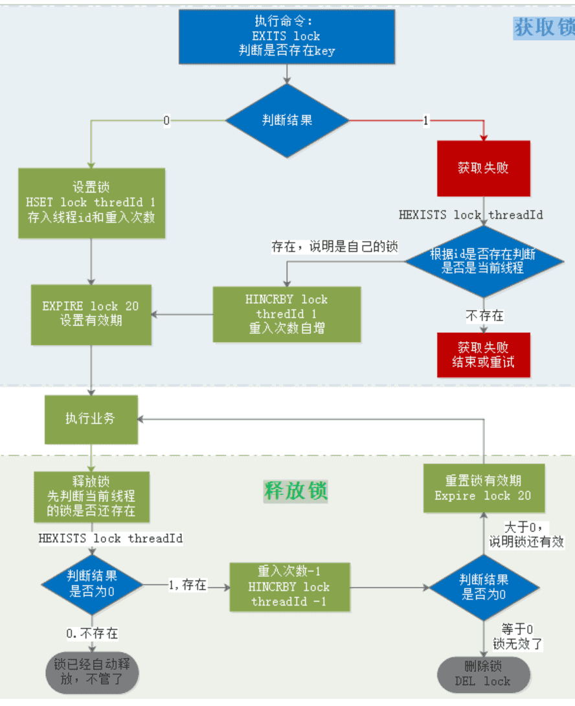
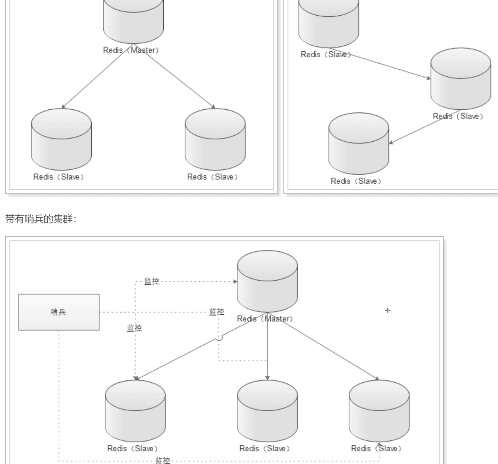
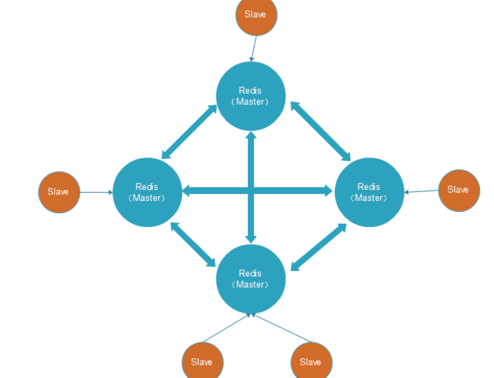
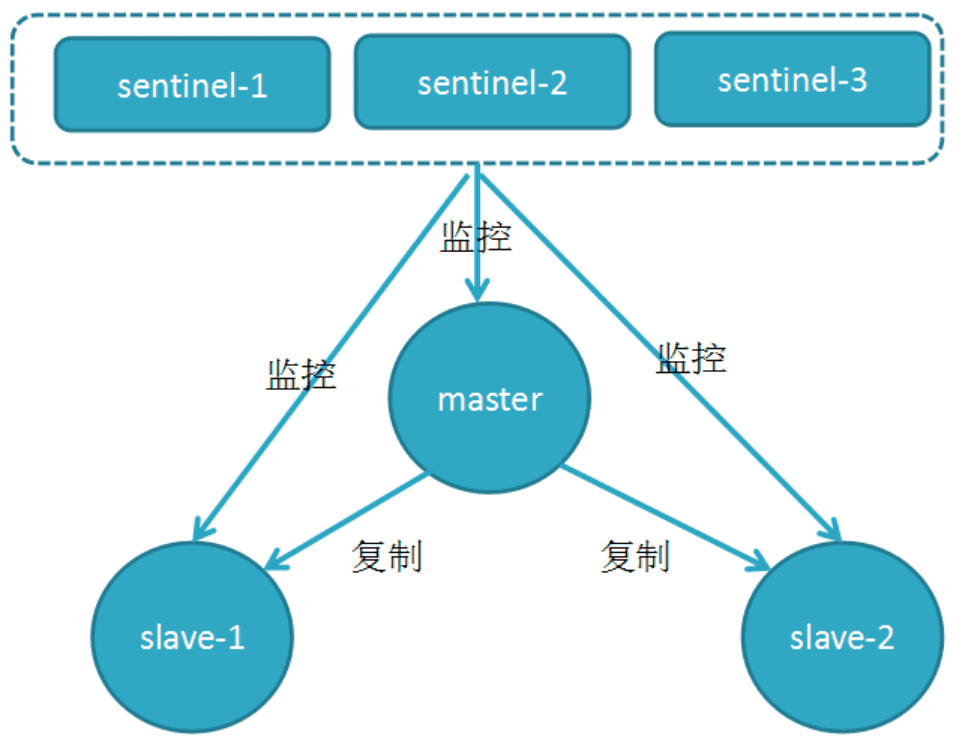
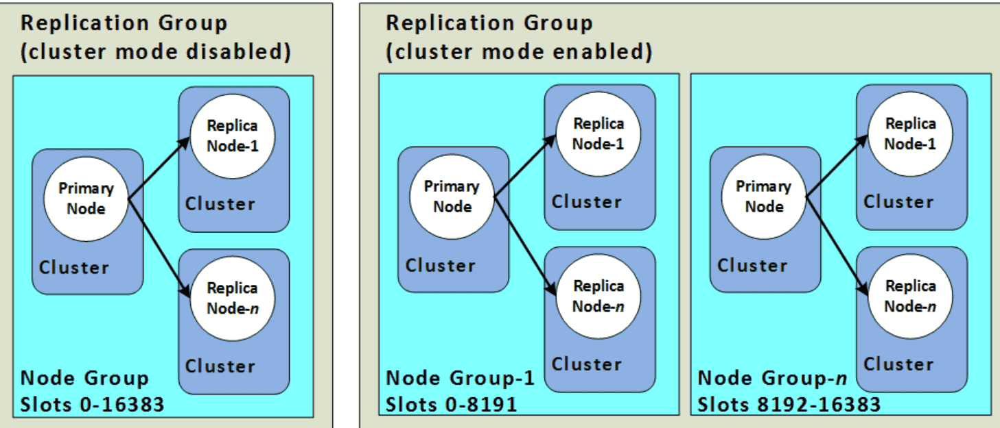

‍

# 概念

‍

## 零碎

‍

### Redis 单个 key 能够承受的最大 QPS

10W量级

‍

### 如何解决 Redis 事务的缺陷？

‍

Redis 从 2.6 版本开始支持执行 Lua 脚本，它的功能和事务非常类似。我们可以利用 Lua 脚本来批量执行多条 Redis 命令，这些 Redis 命令会被提交到 Redis 服务器一次性执行完成，大幅减小了网络开销。

一段 Lua 脚本可以视作一条命令执行，一段 Lua 脚本执行过程中不会有其他脚本或 Redis 命令同时执行，保证了操作不会被其他指令插入或打扰。

不过，如果 Lua 脚本运行时出错并中途结束，出错之后的命令是不会被执行的。并且，出错之前执行的命令是无法被撤销的，无法实现类似关系型数据库执行失败可以回滚的那种原子性效果。因此， **严格来说的话，通过 Lua 脚本来批量执行 Redis 命令实际也是不完全满足原子性的。**

如果想要让 Lua 脚本中的命令全部执行，必须保证语句语法和命令都是对的。

另外，Redis 7.0 新增了 [Redis functionsopen in new window](https://redis.io/docs/manual/programmability/functions-intro/) 特性，你可以将 Redis functions 看作是比 Lua 更强大的脚本。

‍

‍

### Redis 常见数据类型

(不是底层的)

* **5 种基础数据类型**：String（字符串）、List（列表）、Set（集合）、Hash（散列）、Zset（有序集合）
* **3 种特殊数据类型**：HyperLogLog（基数统计）、Bitmap （位图）、Geospatial (地理位置)

不同的数据类型的具体实现

[Redis设计与实现 — Redis 设计与实现 (huangz.works)](https://huangz.works/redisbook1e/)

‍

### NoSQL 越来越流行了？

1. 传统的 SQL 数据库需要**使用 ORM 进行调用处理**
2. NoSQL 一般开始设计的时候就**考虑了分布式的问题**
3. **非结构化的数据**越来越多

‍

‍

‍

### Key的**逻辑访问次数是如何计算的**？

由于记录访问次数的只有`8bit`​，即便是无符号数，最大值只有255，不可能记录真实的访问次数。因此Redis统计的其实是逻辑访问次数。这其中有一个计算公式，会根据当前的访问次数做计算，结果要么是次数`+1`​，要么是次数不变。但随着当前访问次数越大，`+1`​的概率也会越低，并且最大值不超过255.

除此以外，逻辑访问次数还有一个衰减周期，默认为1分钟，即每隔1分钟逻辑访问次数会`-1`​。这样逻辑访问次数就能基本反映出一个`key`​的访问热度了。

‍

### 缓存冷热数据分离

‍

**背景资料**：

Redis使用的是内存存储，当需要海量数据存储时，成本非常高。

经过调研发现，当前主流DDR3内存和主流SATA SSD的单位成本价格差距大概在20倍左右，为了优化redis机器综合成本，我们考虑实现基于**热度统计 的数据分级存储**及数据在RAM/FLASH之间的动态交换，从而大幅度降低成本，达到性能与成本的高平衡。

‍

基本思路：基于key访问次数(LFU)的热度统计算法识别出热点数据，并将热点数据保留在redis中，对于无访问/访问次数少的数据则转存到SSD上，如果SSD上的key再次变热，则重新将其加载到redis内存中。

‍

目前流行的高性能磁盘存储，并且遵循Redis协议的方案包括：

* SSDB：[http://ssdb.io/zh_cn/](http://ssdb.io/zh_cn/)
* RocksDB：[https://rocksdb.org.cn/](https://rocksdb.org.cn/)

因此，我们就需要在应用程序与缓存服务之间引入代理，实现Redis和SSD之间的切换

这样的代理方案阿里云提供的就有。当然也有一些开源方案，例如：[https://github.com/JingchengLi/swapdb](https://github.com/JingchengLi/swapdb)

‍

### redsi连接池在Spring里面怎么配置, 如何销毁的?

spring.redis.lettuce.pool, 以及销毁参数

‍

### 为啥在项目里要用缓存？

用缓存，主要是两个用途：高性能 和 高并发

‍

#### 高性能

假设有这么个场景，有一个操作，一个请求过来，然后执行N条SQL语句，然后半天才查询出一个结果，耗时600ms，但是这个结果可能接下来几个小时就不会变了，或者变了也可以不用立即反馈给用户，这个时候就可以使用缓存了。

我们可以把花费了600ms查询出来的数据，丢进缓存中，一个key对应一个value，下次再有人来查询的时候，就不走mysql了，而是直接从缓存中读取，通过key直接查询出value，耗时2ms，性能提升300倍。这就是所谓的高性能。

就是把一些复杂操作耗时查询出来的结果，如果确定后面不怎么变化了，但是马上还有很多读请求，这个时候，就可以直接把结果存放在缓存中，后面直接读取缓存即可。

‍

#### 高并发

首先因为缓存是走内存的，内存天然就可以支持高并发

但是数据库因为是存储在硬盘上的，因此不要超过2000QPS

‍

‍

### Redis好处

(1) 速度快，因为数据存在内存中，类似于 HashMap，HashMap 的优势就是查找和操作的时间复杂度都是 O(1)

(2) 支持丰富数据类型，支持 string，list，set，sorted set，hash

(3) 支持事务，操作都是原子性，所谓的原子性就是对数据的更改要么全部执行，要么全部不执行

(4) 丰富的特性：可用于缓存，消息，按 key 设置过期时间，过期后将会自动删除

‍

‍

### 在项目中用到地方

‍

#### （1）**共享session**

在分布式系统下，服务会部署在不同的tomcat，因此多个tomcat的session无法共享，以前存储在session中的数据无法实现共享，可以用redis代替session，解决分布式系统间数据共享问题。

‍

#### （2）数据缓存

Redis采用内存存储，读写效率较高。我们可以把数据库的访问频率高的热点数据存储到redis中，这样用户请求时优先从redis中读取，减少数据库压力，提高并发能力。

‍

#### （3）异步队列

Reids在内存存储引擎领域的一大优点是提供 list 和 set 操作，这使得Redis能作为一个很好的消息队列平台来使用。而且Redis中还有pub/sub这样的专用结构，用于1对N的消息通信模式。

‍

#### （4）分布式锁

Redis中的乐观锁机制，可以帮助我们实现分布式锁的效果，用于解决分布式系统下的多线程安全问题

‍

### Redis遇到哈希冲突怎么办？

原理跟 Java 的 HashMap 类似，都是数组+链表的结构。当发生 hash 碰撞时将会把元素追加到链表上。

‍

‍

### 如果redis的这个key没有过期，但是并不能抗住当前的并发量，你如何去做?

1. **使用 Redis 集群**：将数据分片到多个 Redis 实例上，以分散负载。
2. **使用缓存穿透、缓存击穿和缓存雪崩的解决方案**：

    * **缓存穿透**：使用布隆过滤器来避免无效请求直接打到数据库。
    * **缓存击穿**：使用互斥锁（如 `SETNX`​）来防止大量并发请求在缓存失效时同时访问数据库。
    * **缓存雪崩**：设置不同的过期时间，避免大量缓存同时失效。
3. **使用本地缓存**：在应用程序中引入本地缓存（如 Guava Cache 或 Caffeine），减少对 Redis 的访问频率。
4. **优化数据结构**：选择合适的数据结构和序列化方式，减少 Redis 的存储和网络开销。
5. **限流和降级**：对高并发请求进行限流，必要时进行服务降级。

‍

‍

### 访问redis的线程太多导致崩溃，重启时要注意哪些地方？

在重启 Redis 时，如果访问 Redis 的线程太多导致崩溃，需要注意以下几点：

1. **检查 Redis 配置**：

    * 确保 `maxclients`​ 配置项设置合理，限制最大客户端连接数。
    * 调整 `timeout`​ 配置项，设置合理的客户端连接超时时间。
2. **优化连接池**：

    * 使用连接池来管理 Redis 连接，避免频繁创建和销毁连接。
    * 设置合理的连接池大小，避免过多的线程同时访问 Redis。
3. **监控和日志**：

    * 启用 Redis 的监控和日志功能，查看崩溃前的日志信息，分析问题原因。
    * 使用 Redis 的 `INFO`​ 命令查看当前连接数和内存使用情况。
4. **资源限制**：

    * 检查服务器的资源限制，如文件描述符限制，确保足够的资源可用。
    * 使用 `ulimit`​ 命令调整文件描述符限制。
5. **分布式架构**：

    * 考虑使用 Redis 集群或分片，分散负载，避免单点压力过大。

‍

‍

‍

‍

### redis对hash扩容进行了优化你知道吗，如何降低扩容的时间复杂度?

Redis 对 hash 扩容进行了优化，以降低扩容的时间复杂度。Redis 采用渐进式 rehashing（rehashing）来优化 hash 扩容过程。以下是一些关键点：

‍

1. **渐进式 rehashing**：

    * Redis 不会一次性完成整个 hash 表的 rehashing 操作，而是将其分成多个小步骤，逐步完成。
    * 在 rehashing 过程中，Redis 会同时维护两个 hash 表：一个旧表和一个新表。
    * 每次对 hash 表进行操作时，Redis 会将旧表中的一部分数据迁移到新表中，直到所有数据都迁移完毕。
2. **降低时间复杂度**：

    * 通过渐进式 rehashing，Redis 将一次性的大量计算分散到多次小的计算中，避免了单次操作时间过长的问题。
    * 这种方法有效地降低了 rehashing 对系统性能的影响，使得扩容过程更加平滑。

‍

‍

### Redis 的缺点包括

1. **内存消耗大**：Redis 是一个内存数据库，所有数据都存储在内存中，这意味着它的内存消耗非常大，尤其是当数据量很大时。
2. **持久化机制**：虽然 Redis 提供了持久化选项（RDB 和 AOF），但它们并不是实时的，可能会导致数据丢失。此外，持久化操作会影响性能。
3. **数据一致性**：在主从复制模式下，数据的一致性可能会受到影响，尤其是在主节点故障或网络分区的情况下。
4. **有限的数据类型**：虽然 Redis 支持多种数据类型，但与关系型数据库相比，数据类型仍然有限，可能不适合某些复杂的数据模型。
5. **缺乏高级查询功能**：Redis 不支持复杂的查询操作，如 SQL 中的 JOIN、GROUP BY 等，这使得它在某些场景下的使用受到限制。

这些缺点需要根据具体的应用场景来权衡和考虑。

‍

## redis宕机分布式锁会出现什么错误情景, 怎么解决

当Redis宕机时，分布式锁可能会出现以下错误情景：

1. **锁无法获取**：应用程序尝试获取锁时，由于Redis不可用，获取锁的请求会失败，导致应用程序无法继续执行需要锁保护的操作。
2. **锁无法释放**：如果应用程序在Redis宕机前已经获取了锁，但在执行完关键操作后无法释放锁，这可能会导致其他尝试获取同一锁的请求被阻塞，直到Redis恢复。
3. **锁状态不一致**：在Redis宕机期间，锁的状态可能无法正确维护，导致锁的持有状态不一致。例如，某个节点认为自己持有锁，但实际上锁已经失效或被其他节点获取。
4. **数据一致性问题**：由于分布式锁通常用于保护关键操作的并发执行，Redis宕机可能导致多个节点同时执行关键操作，进而引发数据一致性问题。

为了应对Redis宕机导致的分布式锁问题，可以采取以下措施：

* **高可用Redis集群**：使用Redis集群或主从复制来提高Redis的可用性，确保即使某个节点宕机，其他节点仍然可以提供服务。
* **锁超时机制**：设置锁的超时时间，确保即使锁无法正常释放，也会在超时后自动释放，避免长时间阻塞。
* **重试机制**：在获取锁失败时，应用程序可以实现重试机制，等待一段时间后再次尝试获取锁。
* **故障转移**：在检测到Redis宕机时，应用程序可以切换到备用的锁实现（例如基于数据库的锁）来继续提供服务。

‍

‍

## 大量 key 集中过期问题

我在前面提到过：对于过期 key，Redis 采用的是 **定期删除+惰性/懒汉式删除** 策略。

定期删除执行过程中，如果突然遇到大量过期 key 的话，客户端请求必须等待定期清理过期 key 任务线程执行完成，因为这个这个定期任务线程是在 Redis 主线程中执行的。这就导致客户端请求没办法被及时处理，响应速度会比较慢。

**如何解决呢？**  下面是两种常见的方法：

1. 给 key 设置随机过期时间。
2. 开启 lazy-free（惰性删除/延迟释放） 。lazy-free 特性是 Redis 4.0 开始引入的，指的是让 Redis 采用异步方式延迟释放 key 使用的内存，将该操作交给单独的子线程处理，避免阻塞主线程。

个人建议不管是否开启 lazy-free，我们都尽量给 key 设置随机过期时间。

‍

‍

‍

‍

‍

‍

## redis里面大key是啥，热key是啥？会导致什么?

在 Redis 中，大 key 和热 key 是两个常见的概念，它们可能会导致不同的问题。

‍

### 大 key

**大 key** 是指在 Redis 中存储的数据量非常大的 key。大 key 可能是一个包含大量元素的集合（如 list、set、zset 或 hash），也可能是一个非常长的字符串。

**影响**：

1. **内存消耗**：大 key 会占用大量内存，可能导致 Redis 内存不足。
2. **操作延迟**：对大 key 的操作（如读取、删除）可能会导致较长的延迟，影响 Redis 的性能。
3. **阻塞**：某些操作（如删除大 key）可能会阻塞 Redis，影响其他请求的处理。

‍

### 热 key

**热 key** 是指在 Redis 中被频繁访问的 key。热 key 可能会导致 Redis 的负载集中在某些特定的 key 上。

**影响**：

1. **负载不均**：热 key 会导致 Redis 的负载不均衡，某些节点可能会因为频繁访问而过载。
2. **缓存穿透**：如果热 key 频繁被访问但不存在，可能会导致缓存穿透，增加后端数据库的压力。
3. **性能瓶颈**：热 key 可能成为系统的性能瓶颈，影响整体性能。

‍

### 总结

* **大 key** 会导致内存消耗过大、操作延迟和阻塞等问题。
* **热 key** 会导致负载不均、缓存穿透和性能瓶颈等问题。

在使用 Redis 时，应尽量避免大 key 和热 key 的出现，或者采取相应的措施来缓解其影响。

‍

### 你觉得有个服务有1个接口，调用这个redis的大key/热key，这会发生什么？业务层上监控的指标会有什么变化？你觉变化的量级会是多少？

如果一个服务有一个接口频繁调用 Redis 的大 key 或热 key，可能会发生以下情况：

‍

发生的问题

1. **大 key**：

    * **内存消耗**：大 key 会占用大量内存，可能导致 Redis 内存不足。
    * **操作延迟**：对大 key 的操作（如读取、删除）可能会导致较长的延迟，影响 Redis 的性能。
    * **阻塞**：某些操作（如删除大 key）可能会阻塞 Redis，影响其他请求的处理。
2. **热 key**：

    * **负载不均**：热 key 会导致 Redis 的负载不均衡，某些节点可能会因为频繁访问而过载。
    * **缓存穿透**：如果热 key 频繁被访问但不存在，可能会导致缓存穿透，增加后端数据库的压力。
    * **性能瓶颈**：热 key 可能成为系统的性能瓶颈，影响整体性能。

‍

业务层监控的指标变化

1. **响应时间**：

    * **大 key**：操作大 key 可能会导致响应时间显著增加，尤其是删除或修改大 key 时。
    * **热 key**：频繁访问热 key 可能会导致响应时间增加，尤其是在 Redis 负载过高时。
2. **CPU 和内存使用率**：

    * **大 key**：内存使用率会显著增加，CPU 使用率也可能增加。
    * **热 key**：CPU 使用率会显著增加，内存使用率可能会波动。
3. **请求失败率**：

    * **大 key**：由于操作延迟和阻塞，可能会导致请求失败率增加。
    * **热 key**：由于负载过高，可能会导致请求失败率增加。

‍

变化的量级

* **响应时间**：可能会增加数倍，具体取决于大 key 的大小和热 key 的访问频率。
* **CPU 和内存使用率**：可能会显著增加，具体取决于大 key 的大小和热 key 的访问频率。
* **请求失败率**：可能会显著增加，具体取决于 Redis 的负载情况。

‍

‍

## 高可用综述

> 简单介绍, 深入讲看下面的

Redis 高可用的手段主要有以下四种：

* 数据持久化
* 主从数据同步（主从复制）
* 哨兵模式（Sentinel）
* 集群（Cluster）

‍

数据持久化保证了系统在发生宕机或者重启之后数据不会丢失，增加了系统的可靠性和减少了系统不可用的时间（省去了手动恢复数据的过程）；

主从数据同步将数据存储至多台服务器，这样当遇到一台服务器宕机之后，可以很快地切换至另一台服务器以继续提供服务

哨兵模式用于发生故障之后自动切换服务器

集群提供了多主多从的 Redis 分布式集群环境，用于提供性能更好的 Redis 服务，并且它自身拥有故障自动切换的能力。

‍

‍

### 数据持久化

> 持久化功能是 Redis 和 Memcached 的主要区别之一，因为只有 Redis 提供了此功能。

‍

在 Redis 4.0 之前数据持久化方式有两种：AOF 方式和 RDB 方式

‍

* RDB（Redis DataBase，快照方式）是将某一个时刻的内存数据，**以二进制的方式写入磁盘**
* AOF（Append Only File，文件追加方式）是指将所有的操作命令，**以文本的形式追加到文件中**

---

RDB 默认的保存文件为 dump.rdb，优点是以**二进制存储**的，因此占用的空间更小、数据存储更紧凑，并且与 AOF 相比，RDB 具备更快的重启恢复能力。

AOF 默认的保存文件为 appendonly.aof，它的优点是**存储频率更高**，因此丢失数据的风险就越低，并且 AOF 并不是以二进制存储的，所以它的存储信息更易懂。缺点是占用空间大，重启之后的数据恢复速度比较慢。

‍

可以看出 RDB 和 AOF 各有利弊，RDB 具备更快速的数据重启恢复能力，并且占用更小的磁盘空间，但有数据丢失的风险；而 AOF 文件的可读性更高，但却占用了更大的空间，且重启之后的恢复速度更慢

---

‍

Redis 4.0 就推出了混合持久化的功能。

混合持久化的功能指的是 Redis 可以**使用 RDB + AOF 两种格式来进行数据持久化**

开始的数据以 RDB 的格式进行存储，因此**只会占用少量的空间**，并且之后的命令会以 AOF 的方式进行**数据追加**，这样就可以减低数据丢失的风险，同时可以提高数据恢复的速度。

‍

存储示意图

```java
appendonly.aof
----------------
|    RDB格式    |
|    AOF格式    |
----------------
```

‍

使用`config get aof-use-rdb-preamble`​的命令来查询 Redis 混合持久化的功能是否开启

```shell
127.0.0.1:6379> config get aof-use-rdb-preamble
1) "aof-use-rdb-preamble"
2) "yes"
```

如果执行结果为“no”则表示混合持久化功能关闭，使用`config set aof-use-rdb-preamble yes`​的命令打开此功能

‍

‍

‍

‍

### 主从同步

多机运行中最基础的功能，它是把多个 Redis 节点组成一个 Redis 集群，在这个集群当中有一个主节点用来进行数据的操作，其他从节点用于同步主节点的内容，并且提供给客户端进行数据查询

‍

分为：主从模式和从从模式

1. 主从模式    一个主节点和多个一级从节点
2. 从从模式    一级从节点下面还可以拥有更多的从节点

‍

* 提高 Redis 的整体运行速度，因为使用主从模式就可以实现数据的**读写分离**，把写操作的请求分发到主节点上，把其他的读操作请求分发到从节点上，这样就减轻了 Redis 主节点的运行压力，并且提高了 Redis 的整体运行速度。
* 实现了 Redis 的高可用，当主服务器宕机之后，可以很迅速的把**从节点提升为主节点**，为 Redis 服务器的宕机恢复节省了宝贵的时间。
* 降低了**数据丢失**的风险，因为数据是完整拷贝在多台服务器上的，当一个服务器磁盘坏掉之后，可以从其他服务器拿到完整的备份数据。

‍

‍

### 哨兵

Redis 主从复制模式有那么多的优点，但是有一个致命的缺点，就是当 Redis 的主节点宕机之后，必须人工介入手动恢复

Redis 哨兵模式就是用来监视 Redis 主从服务器的，当 Redis 的主从服务器发生故障之后，Redis 哨兵提供了自动容灾修复的功能

‍

‍

Redis 哨兵模块存储在 Redis 的 src/redis-sentinel 目录下

命令`./src/redis-sentinel sentinel.conf`​来启动哨兵功能

‍

> 哨兵的工作原理是每个哨兵会以每秒钟 1 次的频率，向已知的主服务器和从服务器，发送一个 PING 命令。如果最后一次有效回复 PING 命令的时间，超过了配置的最大下线时间（Down-After-Milliseconds）时，默认是 30s，那么这个实例会被哨兵标记为**主观下线**。
>
> 如果一个主服务器被标记为主观下线，那么正在监视这个主服务器的所有哨兵节点，要以每秒 1 次的频率确认主服务器是否进入了主观下线的状态。如果有足够数量（quorum 配置值）的哨兵证实该主服务器为==主观下线==，那么这个主服务器被标记为==客观下线==。此时所有的哨兵会按照规则（协商）自动选出新的主节点服务器，并自动完成主服务器的自动切换功能，而整个过程都是无须人工干预的。

‍

‍

### 集群

Redis Cluster

将数据分布在不同的主服务器上以此来降低系统对单主节点的依赖， 提高 Redis 服务的读写性能。

除了拥有 主从模式 + 哨兵模式 的所有功能之外，还提供了多个主从节点的集群功能，实现了真正意义上的分布式集群服务

‍

Redis 集群可以实现**数据分片服务**

在 Redis 集群中有 16384 个槽位用来存储所有的数据，当我们有 N 个主节点时，可以把 16384 个槽位平均分配到 N 台主服务器上

当有键值存储时，Redis 会使用 crc16 算法进行 hash 得到一个整数值，然后用这个整数值对 16384 进行取模来得到具体槽位，再把此键值存储在对应的服务器上，读取操作也是同样的道理，这样我们就实现了数据分片的功能。

‍

‍

‍

## 搜索引擎

Redis 是可以实现全文搜索引擎功能的，需要借助 **RediSearch** ，这是一个基于 Redis 的搜索引擎模块。

对于小型项目的简单搜索场景来说，使用 RediSearch 来作为搜索引擎还是没有问题的（搭配 RedisJSON 使用）

‍

‍

## 数据库与缓存数据一致？

‍

面试话术

‍

实现方案有下面几种类型(本地/跨服务)

* **本地缓存同步**：当前微服务的数据库数据与缓存数据同步，可以直接**在数据库修改时加入对Redis的修改逻辑**，保证一致。(先修改数据库再修改缓存) 这个写得好@[Link](https://blog.csdn.net/qq_39033181/article/details/119276120)
* **跨服务缓存同步**：服务A调用了服务B，并对查询结果缓存。服务B数据库修改，可以通过MQ通知服务A，服务A修改Redis缓存数据 (微服务中的监听器MQListener操作)
* **通用方案**：使用Canal框架，伪装成MySQL的salve节点，监听MySQL的binLog变化，然后修改Redis缓存数据

‍

## Key选择

‍

### String 还是 Hash 存储对象数据更好呢？

* String 存储的是序列化后的对象数据，存放的是整个对象。Hash 是对对象的每个字段单独存储，可以获取部分字段的信息，也可以修改或者添加部分字段，节省网络流量。如果对象中某些字段需要经常变动或者经常需要单独查询对象中的个别字段信息，Hash 就非常适合。
* String 存储相对来说更加节省内存，缓存相同数量的对象数据，String 消耗的内存约是 Hash 的一半。并且，存储具有多层嵌套的对象时也方便很多。如果系统对性能和资源消耗非常敏感的话，String 就非常适合。

在绝大部分情况，我们建议使用 String 来存储对象数据即可！

‍

‍

### 购物车信息用 String 还是 Hash 存储更好呢?

由于购物车中的商品频繁修改和变动，购物车信息建议使用 Hash 存储：

* 用户 id 为 key
* 商品 id 为 field，商品数量为 value

‍

那用户购物车信息的维护具体应该怎么操作呢？

* 用户添加商品就是往 Hash 里面增加新的 field 与 value；
* 查询购物车信息就是遍历对应的 Hash；
* 更改商品数量直接修改对应的 value 值（直接 set 或者做运算皆可）；
* 删除商品就是删除 Hash 中对应的 field；
* 清空购物车直接删除对应的 key 即可。

‍

## RedisTemplate的两种序列化实践方案

* 方案一：自定义RedisTemplate修改RedisTemplate的序列化器为GenericJackson2JsonRedisSerializer
* 方案二：使用StringRedisTemplate写入Redis时，手动把对象序列化为JSON读取Redis时，手动把读取到的JSON反序列化为对象

‍

‍

## 既然Redis那么快，为什么不用它做主数据库，只用它做缓存？

虽然Redis非常快，但它也有一些局限性，不能完全替代主数据库。有以下原因：

**事务处理：** Redis只支持简单的事务处理，对于复杂的事务无能为力，比如跨多个键的事务处理。

**数据持久化：** Redis是内存数据库，数据存储在内存中，如果服务器崩溃或断电，数据可能丢失。虽然Redis提供了数据持久化机制，但有一些限制。

**数据处理：** Redis只支持一些简单的数据结构，比如字符串、列表、哈希表等。如果需要处理复杂的数据结构，比如关系型数据库中的表，那么Redis可能不是一个好的选择。

**数据安全：** Redis没有提供像主数据库那样的安全机制，比如用户认证、访问控制等等。

因此，虽然Redis非常快，但它还有一些限制，不能完全替代主数据库。所以，使用Redis作为缓存是一种很好的方式，可以提高应用程序的性能，并减少数据库的负载

‍

‍

## Zset的底层是什么, 以及为什么Zset用跳表不用红黑树，B+树

​`Zset`​（有序集合）是 Redis 中的一种数据结构，它的底层实现主要是跳表（Skip List）和哈希表（Hash Table）的结合。

‍

### 底层实现

1. **跳表（Skip List）** ：用于维护元素的有序性，支持高效的范围查询和排序操作。
2. **哈希表（Hash Table）** ：用于快速定位元素，支持 O(1) 时间复杂度的查找操作。

‍

### 为什么 Zset 用跳表而不用红黑树或 B+ 树

1. **实现复杂度**：

    * 跳表的实现相对简单，代码量少，易于维护。
    * 红黑树和 B+ 树的实现复杂度较高，维护成本较大。
2. **性能**：

    * 跳表在平均情况下的时间复杂度为 O(log n)，与红黑树和 B+ 树相当。
    * 跳表的插入、删除和查找操作在大多数情况下都能保持较高的性能。
3. **内存使用**：

    * 跳表的内存使用较为灵活，可以根据需要动态调整层数。
    * 红黑树和 B+ 树的内存使用较为固定，可能会导致内存浪费。
4. **范围查询**：

    * 跳表在进行范围查询时非常高效，能够快速遍历有序元素。
    * 红黑树和 B+ 树在范围查询上虽然也有较好的性能，但实现复杂度较高。

综上所述，跳表在实现复杂度、性能和内存使用等方面都有较好的平衡，因此 Redis 选择使用跳表作为 Zset 的底层数据结构。

‍

‍

‍

# 大块

‍

‍

## 持久化

‍

**相关资料：**

1）RDB 持久化

RDB持久化可以使用save或bgsave，为了不阻塞主进程业务，一般都使用bgsave，流程：

* Redis 进程会 fork 出一个子进程（与父进程内存数据一致）。
* 父进程继续处理客户端请求命令
* 由子进程将内存中的所有数据写入到一个临时的 RDB 文件中。
* 完成写入操作之后，旧的 RDB 文件会被新的 RDB 文件替换掉。

下面是一些和 RDB 持久化相关的配置：

* ​`save 60 10000`​：如果在 60 秒内有 10000 个 key 发生改变，那就执行 RDB 持久化。
* ​`stop-writes-on-bgsave-error yes`​：如果 Redis 执行 RDB 持久化失败（常见于操作系统内存不足），那么 Redis 将不再接受 client 写入数据的请求。
* ​`rdbcompression yes`​：当生成 RDB 文件时，同时进行压缩。
* ​`dbfilename dump.rdb`​：将 RDB 文件命名为 dump.rdb。
* ​`dir /var/lib/redis`​：将 RDB 文件保存在`/var/lib/redis`​目录下。

当然在实践中，我们通常会将`stop-writes-on-bgsave-error`​设置为`false`​，同时让监控系统在 Redis 执行 RDB 持久化失败时发送告警，以便人工介入解决，而不是粗暴地拒绝 client 的写入请求。

RDB持久化的优点：

* RDB持久化文件小，Redis数据恢复时速度快
* 子进程不影响父进程，父进程可以持续处理客户端命令
* 子进程fork时采用copy-on-write方式，大多数情况下，没有太多的内存消耗，效率比较好。

RDB 持久化的缺点：

* 子进程fork时采用copy-on-write方式，如果Redis此时写操作较多，可能导致额外的内存占用，甚至内存溢出
* RDB文件压缩会减小文件体积，但通过时会对CPU有额外的消耗
* 如果业务场景很看重数据的持久性 (durability)，那么不应该采用 RDB 持久化。譬如说，如果 Redis 每 5 分钟执行一次 RDB 持久化，要是 Redis 意外奔溃了，那么最多会丢失 5 分钟的数据。

‍

2）AOF 持久化

可以使用`appendonly yes`​配置项来开启 AOF 持久化。Redis 执行 AOF 持久化时，会将接收到的写命令追加到 AOF 文件的末尾，因此 Redis 只要对 AOF 文件中的命令进行回放，就可以将数据库还原到原先的状态。  
　　与 RDB 持久化相比，AOF 持久化的一个明显优势就是，它可以提高数据的持久性 (durability)。因为在 AOF 模式下，Redis 每次接收到 client 的写命令，就会将命令`write()`​到 AOF 文件末尾。  
　　然而，在 Linux 中，将数据`write()`​到文件后，数据并不会立即刷新到磁盘，而会先暂存在 OS 的文件系统缓冲区。在合适的时机，OS 才会将缓冲区的数据刷新到磁盘（如果需要将文件内容刷新到磁盘，可以调用`fsync()`​或`fdatasync()`​）。  
　　通过`appendfsync`​配置项，可以控制 Redis 将命令同步到磁盘的频率：

* ​`always`​：每次 Redis 将命令`write()`​到 AOF 文件时，都会调用`fsync()`​，将命令刷新到磁盘。这可以保证最好的数据持久性，但却会给系统带来极大的开销。
* ​`no`​：Redis 只将命令`write()`​到 AOF 文件。这会让 OS 决定何时将命令刷新到磁盘。
* ​`everysec`​：除了将命令`write()`​到 AOF 文件，Redis 还会每秒执行一次`fsync()`​。在实践中，推荐使用这种设置，一定程度上可以保证数据持久性，又不会明显降低 Redis 性能。

‍

然而，AOF 持久化并不是没有缺点的：Redis 会不断将接收到的写命令追加到 AOF 文件中，导致 AOF 文件越来越大。过大的 AOF 文件会消耗磁盘空间，并且导致 Redis 重启时更加缓慢。为了解决这个问题，在适当情况下，Redis 会对 AOF 文件进行重写，去除文件中冗余的命令，以减小 AOF 文件的体积。在重写 AOF 文件期间， Redis 会启动一个子进程，由子进程负责对 AOF 文件进行重写。  
　　可以通过下面两个配置项，控制 Redis 重写 AOF 文件的频率：

* ​`auto-aof-rewrite-min-size 64mb`​
* ​`auto-aof-rewrite-percentage 100`​

上面两个配置的作用：当 AOF 文件的体积大于 64MB，并且 AOF 文件的体积比上一次重写之后的体积大了至少一倍，那么 Redis 就会执行 AOF 重写。

优点：

* 持久化频率高，数据可靠性高
* 没有额外的内存或CPU消耗

缺点：

* 文件体积大
* 文件大导致服务数据恢复时效率较低

‍

**面试话术：**

Redis 提供了两种数据持久化的方式，一种是 RDB，另一种是 AOF。默认情况下，Redis 使用的是 RDB 持久化。

RDB持久化文件体积较小，但是保存数据的频率一般较低，可靠性差，容易丢失数据。另外RDB写数据时会采用Fork函数拷贝主进程，可能有额外的内存消耗，文件压缩也会有额外的CPU消耗。

ROF持久化可以做到每秒钟持久化一次，可靠性高。但是持久化文件体积较大，导致数据恢复时读取文件时间较长，效率略低

‍

‍

### Redis的AOF + RDB混合持久化会丢数据吗？会在哪个范围丢数据，为什么？一个redis实例一般会丢失多少数据，这个数量级是多少？

‍

Redis的AOF（Append-Only File）和RDB（Redis Database Backup）混合持久化策略可以减少数据丢失的可能性，但仍然可能会丢失少量数据。具体丢失数据的范围和数量级取决于以下几个因素：

‍

1. **AOF重写期间的数据丢失**：

    * 在AOF重写过程中，Redis会创建一个新的AOF文件，并将当前内存中的数据写入该文件。如果在重写过程中Redis崩溃，可能会丢失重写期间的数据。
    * 丢失的数据量取决于重写的频率和数据写入的速度。
2. **RDB快照期间的数据丢失**：

    * RDB快照是定期将内存中的数据保存到磁盘的过程。如果在快照过程中Redis崩溃，可能会丢失自上次快照以来的数据。
    * 丢失的数据量取决于快照的频率和数据写入的速度。
3. **AOF写入策略**：

    * AOF有三种写入策略：`always`​、`everysec`​ 和 `no`​。其中 `everysec`​ 是默认策略，**每秒将数据写入磁盘一次**。如果Redis在写入间隔内崩溃，可能会丢失**最多1秒的数据**。
    * 丢失的数据量通常在毫秒到秒级别。

‍

* **丢失数据的范围**：主要在AOF重写期间和RDB快照期间。
* **丢失数据的数量级**：通常在毫秒到秒级别，具体取决于AOF写入策略和RDB快照频率。

通过合理配置AOF和RDB的频率，可以将数据丢失的风险降到最低。

‍

‍

### AOF持久化的时间有哪些？

AOF（Append-Only File）持久化的时间策略主要有以下三种：

1. **always**：

    * 每次有数据变更时，立即将数据同步到AOF文件。
    * 优点：数据丢失风险最小。
    * 缺点：性能开销较大。
2. **everysec**（默认策略）：

    * 每秒将数据同步到AOF文件一次。
    * 优点：性能和数据安全性之间的平衡。
    * 缺点：可能会丢失最多1秒的数据。
3. **no**：

    * 仅将数据写入操作系统的缓冲区，不主动同步到AOF文件。
    * 优点：性能最高。
    * 缺点：数据丢失风险最大，可能会丢失大量数据。

‍

**配置示例**

在Redis配置文件`redis.conf`​中，可以通过`appendfsync`​参数设置AOF持久化的时间策略：

```plaintext
# appendfsync always
# appendfsync everysec
# appendfsync no
```

默认配置为`appendfsync everysec`​，即每秒同步一次。

‍

‍

## 分布式锁

分布式锁要满足的条件：

* 多进程互斥：同一时刻，只有一个进程可以获取锁
* 保证锁可以释放：任务结束或出现异常，锁一定要释放，避免死锁
* 阻塞锁（可选）：获取锁失败时可否重试
* 重入锁（可选）：获取锁的代码递归调用时，依然可以获取锁

‍

‍

### 1）最基本的分布式锁：

利用Redis的setnx命令，这个命令的特征时如果多次执行，只有第一次执行会成功，可以实现`互斥`​的效果。但是为了保证服务宕机时也可以释放锁，需要利用expire命令给锁设置一个有效期

```text
setnx lock thread-01 # 尝试获取锁
expire lock 10 # 设置有效期
```

‍

**面试官问题1**：如果expire之前服务宕机怎么办？

要保证setnx和expire命令的原子性。redis的set命令可以满足：

```text
set key value [NX] [EX time] 
```

需要添加nx和ex的选项：

* NX：与setnx一致，第一次执行成功
* EX：设置过期时间

‍

**面试官问题2**：释放锁的时候，如果自己的锁已经过期了，此时会出现安全漏洞，如何解决？

在锁中存储当前进程和**线程标识**，释放锁时对锁的标识判断，如果是自己的则删除，不是则放弃操作。

但是这两步操作要保证原子性，需要通过Lua脚本来实现。

```text
if redis.call("get",KEYS[1]) == ARGV[1] then
    redis.call("del",KEYS[1])
end
```

‍

### 2）可重入分布式锁

如果有重入的需求，则除了在锁中记录进程标识，还要记录重试次数，流程如下：

​​

‍

‍

假设锁的key为“`lock`​”，hashKey是当前线程的id：“`threadId`​”，锁自动释放时间假设为20

‍

获取锁的步骤：

* 1、判断lock是否存在 `EXISTS lock`​

  * 存在，说明有人获取锁了，下面判断是不是自己的锁

    * 判断当前线程id作为hashKey是否存在：`HEXISTS lock threadId`​

      * 不存在，说明锁已经有了，且不是自己获取的，锁获取失败，end
      * 存在，说明是自己获取的锁，重入次数+1：`HINCRBY lock threadId 1`​，去到步骤3
  * 2、不存在，说明可以获取锁，`HSET key threadId 1`​
  * 3、设置锁自动释放时间，`EXPIRE lock 20`​

‍

释放锁的步骤：

* 1、判断当前线程id作为hashKey是否存在：`HEXISTS lock threadId`​

  * 不存在，说明锁已经失效，不用管了
  * 存在，说明锁还在，重入次数减1：`HINCRBY lock threadId -1`​，获取新的重入次数
* 2、判断重入次数是否为0：

  * 为0，说明锁全部释放，删除key：`DEL lock`​
  * 大于0，说明锁还在使用，重置有效时间：`EXPIRE lock 20`​

‍

对应的Lua脚本如下：

1获取锁：

```lua
local key = KEYS[1]; -- 锁的key
local threadId = ARGV[1]; -- 线程唯一标识
local releaseTime = ARGV[2]; -- 锁的自动释放时间

if(redis.call('exists', key) == 0) then -- 判断是否存在
	redis.call('hset', key, threadId, '1'); -- 不存在, 获取锁
	redis.call('expire', key, releaseTime); -- 设置有效期
	return 1; -- 返回结果
end;

if(redis.call('hexists', key, threadId) == 1) then -- 锁已经存在，判断threadId是否是自己
	redis.call('hincrby', key, threadId, '1'); -- 不存在, 获取锁，重入次数+1
	redis.call('expire', key, releaseTime); -- 设置有效期
	return 1; -- 返回结果
end;
return 0; -- 代码走到这里,说明获取锁的不是自己，获取锁失败
```

2释放锁：

```lua
local key = KEYS[1]; -- 锁的key
local threadId = ARGV[1]; -- 线程唯一标识
local releaseTime = ARGV[2]; -- 锁的自动释放时间

if (redis.call('HEXISTS', key, threadId) == 0) then -- 判断当前锁是否还是被自己持有
    return nil; -- 如果已经不是自己，则直接返回
end;
local count = redis.call('HINCRBY', key, threadId, -1); -- 是自己的锁，则重入次数-1

if (count > 0) then -- 判断是否重入次数是否已经为0
    redis.call('EXPIRE', key, releaseTime); -- 大于0说明不能释放锁，重置有效期然后返回
    return nil;
else
    redis.call('DEL', key); -- 等于0说明可以释放锁，直接删除
    return nil;
end;
```

‍

‍

‍

‍

### 3）高可用的锁

‍

​`面试官问题`​：redis分布式锁依赖redis，如果redis宕机则锁失效。如何解决？

此时大多数同学会回答说：搭建主从集群，做数据备份。

这样就进入了陷阱，因为面试官的下一个问题就来了：

‍

​`面试官问题`​：如果搭建主从集群做数据备份时，进程A获取锁，master还没有把数据备份到slave，master宕机，slave升级为master，此时原来锁失效，其它进程也可以获取锁，出现安全问题。如何解决？

‍

关于这个问题，Redis官网给出了解决方案，使用**RedLock思路**可以解决：

> 在Redis的分布式环境中，我们假设有N个Redis master。
>
> 这些节点完全互相独立，不存在主从复制或者其他集群协调机制。之前我们已经描述了在Redis单实例下怎么安全地获取和释放锁。我们确保将在每（N)个实例上使用此方法获取和释放锁。在这个样例中，我们假设有5个Redis master节点，这是一个比较合理的设置，所以我们需要在5台机器上面或者5台虚拟机上面运行这些实例，这样保证他们不会同时都宕掉。
>
> 为了取到锁，客户端应该执行以下操作:
>
> 1. 获取当前Unix时间，以毫秒为单位。
> 2. 依次尝试从N个实例，使用相同的key和随机值获取锁。在步骤2，当向Redis设置锁时,客户端应该设置一个网络连接和响应超时时间，这个**超时时间应该小于锁的失效时间**。例如你的锁自动失效时间为10秒，则超时时间应该在5-50毫秒之间。这样可以避免服务器端Redis已经挂掉的情况下，客户端还在死死地等待响应结果。如果服务器端没有在规定时间内响应，客户端应该尽快尝试另外一个Redis实例。
> 3. 客户端使用当前时间减去开始获取锁时间（步骤1记录的时间）就得到获取锁使用的时间。当且仅当从大多数（这里是3个节点）的Redis节点都取到锁，并且使用的时间小于锁失效时间时，锁才算获取成功。
> 4. 如果取到了锁，key的真正有效时间等于有效时间减去获取锁所使用的时间（步骤3计算的结果）。
> 5. 如果因为某些原因，获取锁失败（*没有*在至少N/2+1个Redis实例取到锁或者取锁时间已经超过了有效时间），客户端应该在所有的Redis实例上进行解锁（即便某些Redis实例根本就没有加锁成功）。

‍

‍

### 利用原生的redis实现分布式锁？讲讲原理和加解锁的逻辑？

‍

‍

#### 原理

Redis 可以通过其原子操作来实现分布式锁。主要原理是使用 `SET`​ 命令来设置一个带有过期时间的键，如果键不存在则设置成功，从而实现加锁。

解锁时，通过检查锁的持有者并使用 `DEL`​ 命令删除锁。

‍

#### 加锁逻辑

1. 使用 `SET key value NX PX expireTime`​ 命令尝试加锁。

    * ​`key`​ 是锁的标识。
    * ​`value`​ 是锁的持有者标识（通常是一个唯一的标识符，如 UUID）。
    * ​`NX`​ 表示只有在键不存在时才设置键。
    * ​`PX expireTime`​ 设置键的过期时间，防止死锁。

‍

#### 解锁逻辑

1. 使用 `GET key`​ 获取锁的持有者标识。
2. 如果持有者标识与当前客户端匹配，则使用 `DEL key`​ 删除锁。

‍

‍

‍

## Key过期策略

对于已过期数据，在Redis中，同时使用了定期删除和惰性删除

‍

### 定时删除

对于每一个设置了过期时间的key都会创建一个定时器，一旦到达过期时间就立即删除。该策略可以立即清除过期的数据，对内存较友好，但是缺点是占用了大量的CPU资源去处理过期的数据，会影响Redis的吞吐量和响应时间。

‍

‍

### 惰性删除

不主动删除过期的键值，而是当访问键值时，再检查当前的键值是否过期

‍

* 不会浪费太多的系统资源，只是在每次访问时才检查键值是否过期
* 删除过期键不及时，造成了一定的空间浪费。

> 在计算机科学中，懒惰删除（英文：lazy deletion）指的是从一个散列表（也称哈希表）中删除元素的一种方法。在这个方法中，删除仅仅是指标记一个元素被删除，而不是整个清除它。被删除的位点在插入时被当作空元素，在搜索之时被当作已占据。

‍

### 定期删除

服务器每隔一段时间会检查一下数据库，看看是否有过期键可以被清除

Redis定期删除采用的是**随机抽取的方式删除部分Key**，因此不能保证过期key 100%的删除

‍

---

默认情况下 Redis 定期检查的频率是每秒扫描 10 次，用于定期清除过期键。

配置文件进行设置，在 redis.conf 中修改配置“hz”

‍

定期删除的扫描并不是遍历所有的键值对，这样的话比较费时且太消耗系统资源。

Redis 服务器采用的是随机抽取形式，每次**从过期字典中**，取出 20 个键进行过期检测，过期字典中存储的是所有**设置了过期时间的键值对**。如果这批随机检查的数据中**有 25% 的比例过期**，那么会再抽取 20 个随机键值进行检测和删除，并且会循环执行这个流程，直到抽取的这批数据中过期键值小于 25%，此次检测才算完成。

为了保证过期删除策略不会导致线程卡死，会给过期扫描增加了**最大执行时间**为 25ms。

‍

---

两种模式：

* **SLOW**模式：通过一个定时任务，定期的抽样部分带有TTL的KEY，判断其是否过期。默认情况下定时任务的执行频率是每秒10次，但每次执行不能超过25毫秒。如果执行抽样后发现时间还有剩余，并且过期KEY的比例较高，则会多次抽样。
* **FAST**模式：在Redis每次处理NIO事件之前，都会抽样部分带有TTL的KEY，判断是否过期，因此执行频率较高。但是每次执行时长不能超过1ms，如果时间充足并且过期KEY比例过高，也会多次抽样

‍

‍

## 内存淘汰策略

当 Redis 的内存超过最大允许的内存之后，Redis 会触发内存淘汰策略

> 这和过期策略是完全不同的两个概念，经常有人把二者搞混，这两者一个是在正常情况下清除过期键，一个是在非正常情况下为了保证 Redis 顺利运行的保护策略。

Redis的内存淘汰策略，是指内存达到maxmemory极限时，使用某种算法来决定清理掉哪些数据，以保证新数据的存入。

‍

‍

使用 `config get maxmemory-policy`​命令，来查看当前 Redis 的内存淘汰策略; redis.conf 对应的配置项是“maxmemory-policy noeviction”

```shell
127.0.0.1:6379> config get maxmemory-policy
1) "maxmemory-policy"
2) "noeviction"
```

‍

当前 Redis 服务器设置的是 “noeviction” 类型的内存淘汰策略，那么这表示什么含义呢？Redis 又有几种内存淘汰策略呢？

‍

最新版Redis 的内存淘汰策略

* noeviction：不淘汰任何数据，当内存不足时，执行缓存新增操作会报错，它是 Redis **默认内存淘汰策略**。
* allkeys-lru：淘汰整个键值中最久未使用的键值: 在键空间（`server.db[i].dict`​）中，移除最近最少使用的 key（这个是最常用的）
* allkeys-random：随机淘汰任意键值。
* allkeys-lfu，淘汰整个键值中最少使用的键值。
* volatile-lru：淘汰所有设置了过期时间的键值中最久未使用的键值。
* volatile-random：随机淘汰设置了过期时间的任意键值。
* volatile-ttl：优先淘汰更早过期的键值。
* volatile-lfu，淘汰所有设置了过期时间的键值中最少使用的键值；

> allkeys-xxx 表示从**所有的键值**中淘汰数据，而 volatile-xxx 表示从**设置了过期键的键值**中淘汰数据。

‍

简单的修改内存淘汰策略的方式，我们可以使用命令行工具输入“config set maxmemory-policy noeviction”来修改内存淘汰的策略，这种修改方式的好处是执行成功之后就会生效，无需重启 Redis 服务器。坏处是不能持久化内存淘汰策略，每次重启 Redis 服务器之后设置的内存淘汰策略就会丢失。

‍

---

什么时候会进行淘汰？

Redis会在**每一次处理命令的时候**（processCommand函数调用freeMemoryIfNeeded）判断当前**redis是否达到了内存的最大限制**，如果达到限制，则使用对应的算法去处理需要删除的key。

‍

---

内存淘汰算法主要包含两种：LRU 淘汰算法和 LFU 淘汰算法。

‍

在淘汰key时，Redis默认最常用的是**LRU算法**（Latest Recently Used）。Redis通过在每一个redisObject保存lru属性来保存key最近的访问时间，在实现LRU算法时直接读取key的lru属性。

具体实现时，Redis遍历每一个db，从每一个db中随机抽取一批样本key，默认是3个key，再从这3个key中，删除最近最少使用的key。

‍

### LRU 淘汰算法

LRU（Least Recently Used，最近最少使用）淘汰算法：是一种常用的页面置换算法，也就是说**最久没有使用的缓存将会被淘汰**。

LRU 是基于**链表结构**实现的，链表中的元素按照操作顺序从前往后排列，最新操作的键会被**移动到表头**，当需要进行内存淘汰时，只需要删除链表尾部的元素即可。

Redis 使用的是一种近似 LRU 算法，目的是为了更好的节约内存，它的实现方式是给现有的数据结构添加一个额外的字段，用于记录此键值的**最后一次访问时间**。Redis 内存淘汰时，会使用随机采样的方式来淘汰数据，它是随机取 5 个值 (此值可配置) ，然后淘汰最久没有使用的数据。

‍

‍

### LFU 淘汰算法

LFU（Least Frequently Used，最不常用的）淘汰算法：最不常用的算法是根据总访问次数来淘汰数据的，它的核心思想是 “如果数据过去被访问多次，那么将来被访问的频率也更高”。

LFU 相对来说比 LRU 更“智能”，因为它解决了使用频率很低的缓存，只是最近被访问了一次就不会被删除的问题。如果是使用 LRU 类似这种情况数据是不会被删除的，而使用 LFU 的话，这个数据就会被删除。

Redis 内存淘汰策略使用了 LFU 和**近 LRU** 的淘汰算法，具体使用哪种淘汰算法，要看服务器是如何设置内存淘汰策略的，也就是要看“maxmemory-policy”的值是如何设置的。

‍

‍

‍

### 分布式锁

单机锁的一些知识，包括悲观锁、乐观锁、可重入锁、共享锁和独占锁等内容，但它们都属于单机锁也就是程序级别的锁，如果在分布式环境下使用就会出现锁不生效的问题

‍

分布式锁的常见实现方式有四种：

* 基于 MySQL 的==悲观锁==来实现分布式锁，这种方式使用的最少，因为这种实现方式的**性能不好**，且容易造成死锁；
* 基于 Memcached 实现分布式锁，可使用 add 方法来实现，如果添加成功了则表示分布式锁创建成功；
* 基于 ==Redis 实现分布式锁==，这也是本课时要介绍的重点，可以使用 setnx 方法来实现；
* 基于 ZooKeeper 实现分布式锁，利用 ZooKeeper 顺序临时节点来实现。

‍

> 由于 MySQL 的执行效率问题和死锁问题，所以这种实现方式会被我们先排除掉，而 Memcached 和 Redis 的实现方式比较类似，但因为 Redis 技术比较普及，所以会优先使用 Redis 来实现分布式锁
>
> ZooKeeper 确实可以很好的实现分布式锁。但此技术在中小型公司的普及率不高，尤其是**非 Java 技术栈**的公司使用的较少，如果只是为了实现分布式锁而重新搭建一套 **ZooKeeper 集群**，显然实现成本和维护成本太高，所以综合以上因素，我们本文会采用 Redis 来实现分布式锁。

‍

Redis + Lua实现分布式锁

‍

#### 实现分布式锁

使用 Redis 实现分布式锁主要需要使用 setnx 方法，也就是 set if not exists（不存在则创建），具体的实现代码如下：

```shell
127.0.0.1:6379> setnx lock true
(integer) 1 #创建锁成功

#逻辑业务处理...
127.0.0.1:6379> del lock
(integer) 1 #释放锁
```

当执行 setnx 命令之后返回值为 1 的话，则表示创建锁成功，否则就是失败。释放锁使用 del 删除即可，当其他程序 setnx 失败时，则表示此锁正在使用中，这样就可以实现简单的分布式锁了。

‍

需要设置锁的超时时间，否则如果出现异常情况，会导致锁未被释放，而其他线程又在排队等待此锁就会导致程序不可用

‍

想到使用 expire 来设置键值的过期时间来解决这个问题

```shell
127.0.0.1:6379> setnx lock true
(integer) 1 #创建锁成功
127.0.0.1:6379> expire lock 30 #设置锁的(过期)超时时间为 30s
(integer) 1 
#逻辑业务处理...
127.0.0.1:6379> del lock
(integer) 1 #释放锁
```

但这样执行仍然会有问题，因为 setnx lock true 和 expire lock 30 命令是**非原子的**，也就是一个执行完另一个才能执行。但如果在 setnx 命令执行完之后，发生了异常情况，那么就会导致 expire 命令不会执行，**因此依然没有解决死锁的问题**。

‍

‍

**使用一条 set 命令**来执行键值存储，并且可以判断键是否存在以及设置超时时间了

```shell
127.0.0.1:6379> set lock true ex 30 nx
OK #创建锁成功
```

其中，ex 是用来设置超时时间的，而 nx 是 not exists 的意思，用来判断键是否存在。如果返回的结果为“OK”则表示创建锁成功，否则表示此锁有人在使用

‍

‍

#### 锁超时

‍

‍

从上面的内容可以看出，使用 set 命令之后好像一切问题都解决了，但在这里我要告诉你，其实并没有。

例如，我们给锁**设置了超时时间为 10s**，但程序的执行需要使用 15s，那么在第 10s 时此锁因为**超时就会被释放**，这时候线程二在执行 set 命令时正常获取到了锁，于是在很短的时间内 2s 之后删除了此锁，这就造成了锁被误删的情况

‍

锁被误删的解决方案是在使用 set 命令创建锁时，==给 value 值设置一个==​==**归属标识**==。

例如，在 value 中插入一个 UUID，每次在删除之前先要判断 UUID 是不是属于当前的线程，如果属于再删除，这样就避免了锁被误删的问题。

‍

注意：在锁的归属判断和删除的过程中，**不能先判断锁再删除锁，** 如下代码所示：

```java
if(uuid.equals(uuid)){ // 判断是否是自己的锁
	del(luck); // 删除锁
}
```

‍

‍

应该把**判断和删除放到一个原子单元**中去执行，因此需要借助 Lua 脚本来执行

基础jedis实现: 

```java
/**
 * 释放分布式锁
 * @param jedis Redis客户端
 * @param lockKey 锁的 key
 * @param flagId 锁归属标识
 * @return 是否释放成功
 */
public static boolean unLock(Jedis jedis, String lockKey, String flagId) {
    String script = "if redis.call('get', KEYS[1]) == ARGV[1] then return redis.call('del', KEYS[1]) else return 0 end";

    Object result = jedis.eval(script, Collections.singletonList(lockKey), Collections.singletonList(flagId));

    if ("1L".equals(result)) { // 判断执行结果
        return true;
    }
    return false;
}
```

‍

---

实在不行要减少锁超时可以通过两种方案来解决：

* 把执行**耗时的方法从锁中剔除**，减少锁中代码的执行时间，保证锁在超时之前，代码一定可以执行完；
* 把锁的超时时间**设置的长一些**，正常情况下我们在使用完锁之后，会调用删除的方法手动删除锁，因此可以把超时时间设置的稍微长一些。

‍

‍

### 总结Key过期+内存淘汰

Redis过期策略包含定期删除和惰性删除两部分。定期删除是在Redis内部有一个定时任务，会定期删除一些过期的key。惰性删除是当用户查询某个Key时，会检查这个Key是否已经过期，如果没过期则返回用户，如果过期则删除。

但是这两个策略都无法保证过期key一定删除，漏网之鱼越来越多，还可能导致内存溢出。当发生内存不足问题时，Redis还会做内存回收。内存回收采用LRU策略，就是最近最少使用。其原理就是记录每个Key的最近使用时间，内存回收时，随机抽取一些Key，比较其使用时间，把最老的几个删除。

Redis的逻辑是：最近使用过的，很可能再次被使用

‍

### redis内存溢出了，现在有少量大key，大量小key. redis如何进行内存淘汰？如果是你，又如何设计方案？

‍

1. **分析大key**：首先，分析 Redis 中的大key，确定它们的用途和必要性。如果大key是可以拆分的，可以考虑将其**拆分成多个小key**。
2. **使用合适的淘汰策略**：根据业务需求选择合适的内存淘汰策略。例如，如果大部分键都有过期时间，可以选择 `volatile-lru`​ 或 `volatile-ttl`​ 策略。
3. **设置合理的过期时间**：为所有可以设置过期时间的键设置合理的过期时间，确保不必要的数据能够及时被淘汰。
4. **监控和报警**：设置 Redis 的内存监控和报警机制，及时发现和处理内存使用异常情况。

‍

‍

## 消息队列

‍

四种方式

* 使用 List 实现消息队列
* 使用 ZSet 实现消息队列
* 使用 发布订阅者模式 实现消息队列
* 使用 Stream 实现消息队列

‍

‍

### List

**最为简单和直接**，通过 lpush、rpop 存入和读取实现消息队列的

lpush 可以把最新的消息存储到消息队列（List 集合）的首部，而 rpop 可以读取消息队列的尾部，这样就实现了先进先出

‍

```shell
127.0.0.1:6379> lpush mq "java" #推送消息 java
(integer) 1
127.0.0.1:6379> lpush mq "msg" #推送消息 msg
(integer) 2
127.0.0.1:6379> rpop mq #接收到消息 java
"java"
127.0.0.1:6379> rpop mq #接收到消息 msg
"mq"
```

‍

* 消息可以被持久化，List 可以借助 Redis 本身的持久化功能，AOF 或者是 RDB 或混合持久化的方式，用于把数据保存至磁盘: 重启之后，消息不会丢失。
* 消息不支持重复消费、没有按照主题订阅的功能、不支持消费消息确认等。

---

### ZSet

‍

和 List 类似, 利用 zadd 和 zrangebyscore 来实现存入和读取消息

ZSet 的实现方式更为复杂一些，因为 ZSet 多了一个分值（score）属性，可以使用它来实现更多的功能

比如用它来存储时间戳，以此来实现延迟消息队列等

‍

* ZSet 同样具备持久化的功能
* List 存在的问题它也同样存在

  * 不但如此，使用 ZSet 还不能存储相同元素的值。因为它是有序集合，有序集合的存储元素值是不能重复的，但分值可以重复，也就是说当消息值重复时，只能存储一条信息在 ZSet 中

---

### Publisher Subscriber

‍

Publisher（发布者）和 Subscriber（订阅者）来实现消息队列

* 发布消息，publish channel "message"
* 订阅消息，subscribe channel

‍

使用发布和订阅的类型实现主题订阅的功能，也就是 Pattern Subscribe 的功能。

可以使用一个消费者“queue_*”来订阅所有以“queue_”开头的消息队列

‍

3 个问题：

* **无法持久化**保存消息，如果 Redis 服务器宕机或重启，那么所有的消息将会丢失 (难顶)
* 发布订阅模式是  **“发后既忘”**  的工作模式，如果有订阅者离线重连之后就**不能消费之前的历史消息**
* 不支持**消费者确认机制**，稳定性不能得到保证

‍

---

### Stream

‍

Redis 5.0 之后新增了 Stream 类型，使用 Stream 的 xadd 和 xrange 来实现消息的存入和读取

Stream 提供了 xack 手动确认消息消费的命令

‍

消费确认增加了消息的可靠性，一般在业务处理完成之后，需要执行 xack 确认消息已经被消费完成

```text
xack key group-key ID [ID ...] 
```

其中“Group”为群组，消费者也就是接收者需要订阅到群组才能正常获取到消息

‍

‍

### 实现延时队列

使用sortedset，拿时间戳作为score，消息内容作为key，调用zadd来生产消息，消费者用`zrangebyscore`​指令获取N秒之前的数据轮询进行处理。

‍

‍

## 事务

‍

简单介绍

> 1. MYSQL每个事务的操作都有 begin、commit 和 rollback，begin 指示事务的开始，commit 指示事务的提交，rollback 指示事务的回滚。
>
>     Redis 在形式上看起来也差不多，分别是 multi/exec/discard。
>
>     multi 指示事务的开始，exec 指示事务的执行，discard 指示事务的丢弃。
> 2. 所有的指令在 exec 之前不执行，而是缓存在服务器的一个**事务队列**中，服务器一旦收到 exec 指令，才开执行整个事务队列，执行完毕后一次性返回所有指令的运行结果。
>
>     因为 Redis 的单线程特性，它不用担心自己在执行队列的时候被其它指令打搅，可以保证他们能得到的 **「原子性」** 执行
>
>     但是 Redis 的事务根本不能算「原子性」，而**仅仅是满足了事务的「隔离性」** ，隔离性中的串行化 ——当前执行的事务有着不被其它事务打断的权利

‍

Redis事务功能是通过MULTI、EXEC、DISCARD和WATCH 四个原语实现的。Redis会将一个事务中的所有命令**序列化**，然后按顺序执行。

Redis事务**不支持回滚**操作，命令运行出错后，正确的命令会继续执行。

‍

‍

‍

‍

‍

‍

* ​`MULTI`​: 用于开启一个事务，它总是返回OK。 MULTI执行之后，客户端可以继续向服务器发送任意多条命令，这些命令不会立即被执行，而是被放到一个**待执行命令队列**中
* ​`EXEC`​：**按顺序执行**命令队列内的所有命令。返回所有命令的返回值。事务执行过程中，Redis不会执行其它事务的命令。
* ​`DISCARD`​：**清空命令队列**，并放弃执行事务，并且客户端会从事务状态中退出
* ​`WATCH`​：Redis的**乐观锁机制**，利用 compare-and-set（CAS）原理，可以监控一个或多个键，一旦其中有一个键被修改，之后的事务就不会执行

‍

‍

‍

‍

### 使用时可能会遇上的两种错误

* 执行 EXEC 之前，**入队的命令可能会出错**。比如说，命令可能会产生语法错误（参数数量错误，参数名错误，等等），或者其他更严重的错误，比如内存不足（如果服务器使用 `maxmemory`​ 设置了最大内存限制的话）。

  * Redis 2.6.5 开始，服务器会对命令入队失败的情况进行记录，并在客户端调用 EXEC 命令时，拒绝执行并自动放弃这个事务。
* 命令可能在 EXEC 调用之后失败。

  举个例子，事务中的命令可能处理了错误类型的键，比如将列表命令用在了字符串键上面，诸如此类。

  * 即使事务中有某个/某些命令在执行时产生了错误， 事务中的其他命令**仍然会继续执行，不会回滚**。

‍

‍

‍

‍

### 为什么不能支持回滚？

redis是**先执行指令，然后记录日志**，如果执行失败，日志也不会记录，也就不能回滚了

‍

以下是这种做法的优点：

* Redis 命令只会因为错误的语法而失败（并且这些问题不能在入队时发现），或是命令用在了错误类型的键上面：这也就是说，从实用性的角度来说，失败的命令是由**编程错误**造成的，而这些错误应该在开发的过程中被发现，而不应该出现在生产环境中。
* 因为**不需要对回滚进行支持**，所以 Redis 的内部可以保持简单且快速。

鉴于没有任何机制能避免程序员自己造成的错误， 并且这类错误通常不会在生产环境中出现， 所以 Redis 选择了更简单、更快速的**无回滚方式**来处理事务。

‍

‍

**面试话术：**

Redis事务其实是把一系列Redis命令放入队列，然后批量执行，执行过程中不会有其它事务来打断。不过与关系型数据库的事务不同，Redis事务不支持回滚操作，事务中某个命令执行失败，其它命令依然会执行。

为了弥补不能回滚的问题，Redis会在事务**入队时就检查命令**，如果命令异常则会放弃整个事务。

因此，只要程序员编程是正确的，理论上说Redis会正确执行所有事务，无需回滚。

‍

‍

### 事务跑一半的时候宕机？

Redis有持久化机制，因为可靠性问题，我们一般使用AOF持久化。事务的所有命令也会写入AOF文件

但是如果在执行EXEC命令之前，Redis已经宕机，则**AOF文件中事务不完整**。使用 `redis-check-aof`​ 程序可以移除 AOF 文件中不完整事务的信息，确保服务器可以顺利启动。

‍

‍

### 单线程，命令是 按顺序执行无并发，已经有Multi 和 Exec了为什么还需要Watch?

‍

执行时是**单线程运行的**。但是在执行前有可能别的客户端已经修改了事务里执行的key。所以在multi事务开始之前用watch检测这个**key**避免被其他客户端改变的。

如果这个key被改变 了 exec的时候就会报错 不执行这个事务

‍

这里的 “other client” 并不一定是另外一个客户端，watch操作执行之后，multi之外任何操作都可以认为是other clinet在操作（即使仍然是在同一个客户端上操作），exec该事务也仍旧会失败。

> redis使用watch实现cas[具体示例](https://www.jianshu.com/p/0244a875aa26)

‍

分布式锁是悲观锁，redis的watch机制是乐观锁。悲观锁的意思就是我不允许你修改。乐观锁的意思就是你修改了之后要告诉我，我让我的操作失败。

‍

‍

## Redis常用命令

‍

### 字符串操作命令

Redis 中字符串类型常用命令：

* **SET** key value 设置指定key的值
* **GET** key 获取指定key的值
* **SETEX** key seconds value 设置指定key的值，并将 key 的过期时间设为 seconds 秒
* **SETNX** key value 只有在 key 不存在时设置 key 的值

‍

### 哈希操作命令

Redis hash 是一个string类型的 field 和 value 的映射表，hash特别适合用于存储对象，常用命令：

* **HSET** key field value 将哈希表 key 中的字段 field 的值设为 value
* **HGET** key field 获取存储在哈希表中指定字段的值
* **HDEL** key field 删除存储在哈希表中的指定字段
* **HKEYS** key 获取哈希表中所有字段
* **HVALS** key 获取哈希表中所有值

‍

### 列表操作命令

Redis 列表是简单的字符串列表，按照插入顺序排序，常用命令：

* **LPUSH** key value1 [value2] 将一个或多个值插入到列表头部
* **LRANGE** key start stop 获取列表指定范围内的元素
* **RPOP** key 移除并获取列表最后一个元素
* **LLEN** key 获取列表长度
* **BRPOP** key1 [key2 ] timeout 移出并获取列表的最后一个元素， 如果列表没有元素会阻塞列表直到等待超 时或发现可弹出元素为止

‍

### 集合操作命令

Redis set 是string类型的无序集合。集合成员是唯一的，这就意味着集合中不能出现重复的数据，常用命令：

* **SADD** key member1 [member2] 向集合添加一个或多个成员
* **SMEMBERS** key 返回集合中的所有成员
* **SCARD** key 获取集合的成员数
* **SINTER** key1 [key2] 返回给定所有集合的交集
* **SUNION** key1 [key2] 返回所有给定集合的并集
* **SREM** key member1 [member2] 移除集合中一个或多个成员

‍

‍

### 有序集合操作命令

Redis有序集合是string类型元素的集合，且不允许有重复成员。每个元素都会关联一个double类型的分数。常用命令：

常用命令：

* **ZADD** key score1 member1 [score2 member2] 向有序集合添加一个或多个成员
* **ZRANGE** key start stop [WITHSCORES] 通过索引区间返回有序集合中指定区间内的成员
* **ZINCRBY** key increment member 有序集合中对指定成员的分数加上增量 increment
* **ZREM** key member [member ...] 移除有序集合中的一个或多个成员

‍

‍

### 通用命令

Redis的通用命令是不分数据类型的，都可以使用的命令：

* KEYS pattern 查找所有符合给定模式( pattern)的 key
* EXISTS key 检查给定 key 是否存在
* TYPE key 返回 key 所储存的值的类型
* DEL key 该命令用于在 key 存在是删除 key

‍

‍

## redis线程模型

‍

‍

‍

### redis单线程模型

Redis基于Reactor模式开发了网络事件处理器，这个处理器被称为文件事件处理器。它的组成结构为4部分：多个套接字、IO多路复用程序、文件事件分派器、事件处理器。因为文件事件分派器队列的消费是单线程的，所以Redis才叫单线程模型。

* 文件事件处理器使用I/O多路复用（multiplexing）程序来同时监听多个套接字， 并根据套接字目前执行的任务来为套接字关联不同的事件处理器。
* 当被监听的套接字准备好执行连接accept、read、write、close等操作时， 与操作相对应的文件事件就会产生， 这时文件事件处理器就会调用套接字之前关联好的事件处理器来处理这些事件。

虽然文件事件处理器以单线程方式运行， 但通过使用 I/O 多路复用程序来监听多个套接字， 文件事件处理器既实现了高性能的网络通信模型， 又可以很好地与 redis 服务器中其他同样以单线程方式运行的模块进行对接， 这保持了 Redis 内部单线程设计的简单性。

‍

---

Redis 单线程指的是「接收客户端请求->解析请求 ->进行数据读写等操作->发生数据给客户端」这个过程是由一个线程（主线程）来完成的但是，Redis 程序并不是单线程的，Redis 在启动的时候，是会启动后台线程（BIO）的：

Redis 在 2.6 版本，会启动 2 个后台线程，分别处理关闭文件、AOF 刷盘这两个任务；

Redis 在 4.0 版本之后，新增了一个新的后台线程，用来异步释放 Redis 内存，也就是 lazyfree 线程。例如执行 unlink key / flushdb async / flushall async 等命令，会把这些删除操作交给后台线程来执行，好处是不会导致 Redis 主线程卡顿。因此，当我们要删除一个大 key 的时候，不要使用 del 命令删除，因为 del 是在主线程处理的，这样会导致 Redis 主线程卡顿，因此我们应该使用 unlink 命令来异步删除大key。

---

**那 Redis6.0 之前为什么不使用多线程？**  主要原因有 3 点：

* 单线程编程容易并且更容易维护；
* Redis 的性能瓶颈不在 CPU，主要在内存和网络；
* 多线程就会存在死锁、线程上下文切换等问题，甚至会影响性能。

‍

‍

### Redis6.0 之后为何引入了多线程？

**Redis6.0 引入多线程主要是为了提高网络 IO 读写性能**，因为这个算是 Redis 中的一个性能瓶颈（Redis 的瓶颈主要受限于内存和网络）。

虽然，Redis6.0 引入了多线程，但是 Redis 的多线程只是在网络数据的读写这类耗时操作上使用了，执行命令仍然是单线程顺序执行。因此，你也不需要担心线程安全问题。

对于读写命令，Redis 仍然使用单线程来处理，Redis 官方表示，Redis 6.0 版本引入的多线程 I/O 特性对性能提升至少是一倍以上。

‍

‍

‍

### Redis采用单线程，如何保证高并发？

‍

Redis快的主要原因是：

1. 是**纯内存**操作
2. 数据结构简单，对数据操作也简单
3. **C 语言实现**, 更底层
4. 核心是基于**非阻塞的 IO 多路复用机制，充分利用CPU资源**
5. 单线程**避免了多线程的频繁上下文切换问题**，预防了竞争问题提升性能

‍

好处是什么？

单线程优势有下面几点：

* 代码更清晰，处理逻辑更简单
* 不用去考虑各种锁的问题，不存在加锁释放锁操作，没有因为锁而导致的性能消耗
* 不存在多进程或者多线程导致的CPU切换，充分利用CPU资源

‍

Redis 采用单线程为什么还这么快？

1. Redis 的大部分操作都在内存中完成，并且采用了高效的数据结构
2. Redis 采用单线程模型可以避免了多线程之间的竞争，省去了多线程切换带来的时间和性能上的开销，而且也不会导致死锁问题
3. Redis 采用了I/O 多路复用机制处理大量的客户端 Socket 请求

‍

### io多路复用是什么

‍

Redis的IO多路复用是一种处理连接的机制，它使用一个**主线程**来监听**多个连接**，并在需要时进行处理，从而减少了线程切换的开销，允许Redis在高并发场景下保持高性能。

这种技术基于**Reactor模式**和**非阻塞IO模型**

‍

IO 多路复用机制是指一个线程处理多个 IO 流，就是我们经常听到的 select/epoll 机制。简单来说，在 Redis 只运行单线程的情况下，该机制允许内核中，同时存在多个监听 Socket 和已连接 Socket。内核会一直监听这些 Socket 上的连接请求或数据请求。一旦有请求到达，就会交给 Redis 线程处理，这就实现了一个 Redis 线程处理多个 IO 流的效果。

‍

‍

## 缓存读写一致性问题

‍

### 1. 3种常用的缓存读写策略详解

‍

#### Cache Aside Pattern（旁路缓存模式）

**Cache Aside Pattern 是我们平时使用比较多的一个缓存读写模式，比较适合读请求比较多的场景。**

Cache Aside Pattern 中服务端需要同时维系 db 和 cache，并且是以 db 的结果为准。

‍

**写**：

* 先更新 db
* 然后直接删除 cache 。

**读** :

* 从 cache 中读取数据，读取到就直接返回
* cache 中读取不到的话，就从 db 中读取数据返回
* 再把数据放到 cache 中。

‍

##### 1.**在写数据的过程中，可以先删除 cache ，后更新 db 么？**

不行，因为这样可能会造成 **数据库（db）和缓存（Cache）数据不一致**的问题。举例：请求 1 先写数据 A，请求 2 随后读数据 A 的话，就很有可能产生数据不一致性的问题。

过程如下：请求 1 先把 cache 中的 A 数据删除 -> 请求 2 从 db 中读取数据->请求 1 再把 db 中的 A 数据更新。

‍

##### 2.**在写数据的过程中，先更新 db，后删除 cache 就没有问题了么？**

理论上来说还是可能会出现数据不一致性的问题，不过**概率非常小**，因为缓存的写入速度是比数据库的写入速度快很多。举例：请求 1 先读数据 A，请求 2 随后写数据 A，并且数据 A 在请求 1 请求之前不在缓存中的话，也有可能产生数据不一致性的问题。

大概过程是：请求 1 从 db 读数据 A-> 请求 2 更新 db 中的数据 A（此时缓存中无数据 A ，故不用执行删除缓存操作 ） -> 请求 1 将数据 A 写入 cache

‍

##### 3.**Cache Aside Pattern 的缺陷**和解决办法

‍

**缺陷 1：首次请求数据一定不在 cache 的问题**

解决办法：可以将热点数据可以提前放入 cache 中。

‍

**缺陷 2：写操作比较频繁的话导致 cache 中的数据会被频繁被删除，这样会影响缓存命中率 。**

解决办法：

* 数据库和缓存数据强一致场景：更新 db 的时候同样更新 cache，采用redisson实现的读写锁。在读的时候添加共享锁，可以保证读读不互斥，读写互斥(其他线程可以一起读，但是不能写)。当我们更新数据的时候，添加排他锁，它是读写，读读都互斥（其他线程不能读也不能写），这样就能保证在写数据的同时是不会让其他线程读数据的，避免了脏数据。那这个排他锁是如何保证读写、读读互斥的呢？其实排他锁底层使用也是setnx，保证了同时只能有一个线程操作锁住的方法
* 可以短暂地允许数据库和缓存数据不一致的场景：更新 db 的时候同样更新 cache，但是给缓存加一个比较短的过期时间，这样的话就可以保证即使数据不一致的话影响也比较小。

‍

‍

#### Read/Write Through Pattern（读写穿透）

Read/Write Through Pattern 中服务端**把 cache 视为主要数据存储**，从中读取数据并将数据写入其中。cache 服务负责将此数据读取和写入 db，从而减轻了应用程序的职责。

‍

**写（Write Through）：**

* 先查 cache，cache 中不存在，直接更新 db。
* cache 中存在，则先更新 cache，然后 cache 服务自己更新 db（**同步更新 cache 和 db**）。

**读(Read Through)：**

* 从 cache 中读取数据，读取到就直接返回 。
* 读取不到的话，先从 db 加载，写入到 cache 后返回响应。

‍

和 Cache Aside Pattern 一样， Read-Through Pattern 也有首次请求数据一定不再 cache 的问题，对于热点数据可以提前放入缓存中。

‍

‍

#### Write Behind Pattern（异步缓存写入）

Write Behind Pattern 和 Read/Write Through Pattern 很相似，两者都是由 cache 服务来负责 cache 和 db 的读写。

但是，两个又有很大的不同：Read/Write Through 是同步更新 cache 和 db，而 Write Behind 则是只更新缓存，不直接更新 db，而是改为异步批量的方式来更新 db。

Write Behind Pattern 下 db 的写性能非常高，非常适合一些数据经常变化又对数据一致性要求没那么高的场景，比如浏览量、点赞量。

‍

‍

### 2.mysql的数据如何与redis进行同步呢？（双写一致性）

双写一致性：当修改了数据库的数据也要同时更新缓存的数据，缓存和数据库的数据要保持一致

**Cache Aside Pattern (旁路缓存模式)** 中遇到写请求是这样的：更新 DB，然后直接删除 cache

‍

如果更新数据库成功，而删除缓存这一步失败的情况的话，简单说两个解决方案：

1. **缓存失效时间变短（不推荐，治标不治本）** ：我们让缓存数据的过期时间变短，这样的话缓存就会从数据库中加载数据。另外，这种解决办法对于先操作缓存后操作数据库的场景不适用。
2. **增加 cache 更新重试机制（常用）** ：如果 cache 服务当前不可用导致缓存删除失败的话，我们就隔一段时间进行重试，重试次数可以自己定。如果多次重试还是失败的话，我们可以把当前更新失败的 key 存入队列中，等缓存服务可用之后，再将缓存中对应的 key 删除即可。

‍

‍

怎么解决读写

‍

#### 1.若一致性要求高：强一致方案

采用redisson实现的读写锁。

在读的时候添加共享锁，可以保证读读不互斥，读写互斥(其他线程可以一起读，但是不能写)。当我们更新数据的时候，添加排他锁，它是读写，读读都互斥（其他线程不能读也不能写），这样就能保证在写数据的同时是不会让其他线程读数据的，**避免了脏数据**。

那这个排他锁是如何保证读写、读读互斥的呢？

其实排他锁底层使用也是setnx，保证了同时只能有一个线程操作锁住的方法

‍

#### 2.若允许短暂延迟一致:

更新 db 的时候同样更新 cache，但是给缓存加一个比较短的过期时间，这样的话就可以保证即使数据不一致的话影响也比较小。

‍

‍

## 为什么用redisson？redisson底层原理你懂吗？看门狗机制具体怎么实现的？redisson如何解决主节点宕机问题（setnx进入master，但是宕机，slave节点还没有收到写命令）

‍

Redisson 是一个基于 Redis 的 Java 驻内存数据网格（In-Memory Data Grid），它提供了许多分布式数据结构和服务。使用 Redisson 的主要原因包括：

1. **简化开发**：Redisson 提供了许多常用的分布式数据结构（如分布式锁、分布式集合等）
2. **高性能**：Redisson 充分利用了 Redis 的高性能特性，提供了快速的读写操作。
3. **高可用性**：Redisson 支持 Redis 的主从复制和哨兵模式，提供了高可用性。

‍

### Redisson 底层原理

Redisson 底层基于 Redis 的数据结构和命令，通过 Java 客户端与 Redis 服务器进行通信。它使用了 Redis 的发布/订阅机制、Lua 脚本等特性来实现分布式锁、分布式集合等功能。

‍

### 看门狗机制

Redisson 的看门狗机制用于**自动延长分布式锁的过期时间**，防止锁在持有期间**意外过期**。具体实现如下：

1. 当一个线程获取到锁时，Redisson 会启动一个看门狗线程。
2. 看门狗线程会定期检查锁的过期时间，并在必要时延长锁的过期时间。
3. 如果持有锁的线程在锁过期前释放了锁，看门狗线程会停止工作。

‍

### Redisson 如何解决主节点宕机问题

哨兵模式 主从复制

1. **哨兵模式**：Redis 哨兵会监控主节点和从节点的状态，当主节点宕机时，哨兵会自动将一个从节点提升为新的主节点。
2. **主从复制**：当主节点宕机时，新的主节点会从旧的主节点同步数据，确保数据的一致性。

‍

对于 `SETNX`​ 命令进入主节点但主节点宕机的情况，Redisson 通过以下方式解决：

1. **事务机制**：Redisson 使用 Lua 脚本来保证 `SETNX`​ 和其他相关命令的原子性，确保在主节点宕机前命令能够正确执行。
2. **数据同步**：当主节点宕机时，新的主节点会从旧的主节点同步数据，确保数据的一致性。

通过这些机制，Redisson 能够在主节点宕机时保持数据的一致性和高可用性。

‍

‍

# 高级

‍

‍

## 缓存高并发问题

‍

### 1）缓存穿透

参考资料：

* 什么是缓存穿透

  * 正常情况下，我们去查询数据都是存在。那么请求去查询一条压根儿数据库中根本就不存在的数据，也就是缓存和数据库都查询不到这条数据，但是请求每次都会打到数据库上面去。这种查询不存在数据的现象我们称为**缓存穿透**。
* 穿透带来的问题

  * 试想一下，如果有黑客会对你的系统进行攻击，拿一个不存在的id 去查询数据，会产生大量的请求到数据库去查询。可能会导致你的数据库由于压力过大而宕掉。
* 解决办法

  * 缓存空值：之所以会发生穿透，就是因为缓存中没有存储这些空数据的key。从而导致每次查询都到数据库去了。那么我们就可以为这些key对应的值设置为null 丢到缓存里面去。后面再出现查询这个key 的请求的时候，直接返回null 。这样，就不用在到数据库中去走一圈了，但是别忘了设置过期时间。
  * BloomFilter（布隆过滤）：将所有可能存在的数据哈希到一个足够大的bitmap中，一个一定不存在的数据会被 这个bitmap拦截掉，从而避免了对底层存储系统的查询压力。在缓存之前在加一层 BloomFilter ，在查询的时候先去 BloomFilter 去查询 key 是否存在，如果不存在就直接返回，存在再走查缓存 -> 查 DB。

**话术：**

缓存穿透有两种解决方案：**其一**是把不存在的key设置null值到缓存中。**其二**是使用布隆过滤器，在查询缓存前先通过布隆过滤器判断key是否存在，存在再去查询缓存。

设置null值可能被恶意针对，攻击者使用大量不存在的不重复key ，那么方案一就会缓存大量不存在key数据。此时我们还可以对Key规定格式模板，然后对不存在的key做**正则规范**匹配，如果完全不符合就不用存null值到redis，而是直接返回错误。

‍

‍

### 2）缓存击穿

**相关资料**：

* 什么是缓存击穿？

key可能会在某些时间点被超高并发地访问，是一种非常“热点”的数据。这个时候，需要考虑一个问题：缓存被“击穿”的问题。

当这个key在失效的瞬间，redis查询失败，持续的大并发就穿破缓存，直接请求数据库，就像在一个屏障上凿开了一个洞。

* 解决方案：

  * 使用互斥锁(mutex key)：mutex，就是互斥。简单地来说，就是在缓存失效的时候（判断拿出来的值为空），不是立即去load db，而是先使用Redis的SETNX去set一个互斥key，当操作返回成功时，再进行load db的操作并回设缓存；否则，就重试整个get缓存的方法。SETNX，是「SET if Not eXists」的缩写，也就是只有不存在的时候才设置，可以利用它来实现互斥的效果。
  * 软过期：也就是逻辑过期，不使用redis提供的过期时间，而是业务层在数据中存储过期时间信息。查询时由业务程序判断是否过期，如果数据即将过期时，将缓存的时效延长，程序可以派遣一个线程去数据库中获取最新的数据，其他线程这时看到延长了的过期时间，就会继续使用旧数据，等派遣的线程获取最新数据后再更新缓存。

推荐使用互斥锁，因为软过期会有业务逻辑侵入和额外的判断。

**面试话术**：

缓存击穿主要担心的是某个Key过期，更新缓存时引起对数据库的突发高并发访问。因此我们可以在更新缓存时采用互斥锁控制，只允许一个线程去更新缓存，其它线程等待并重新读取缓存。例如Redis的setnx命令就能实现互斥效果。

‍

‍

### 3）缓存雪崩

**相关资料**：

缓存雪崩，是指在某一个时间段，缓存集中过期失效。对这批数据的访问查询，都落到了数据库上，对于数据库而言，就会产生周期性的压力波峰。

解决方案：

* 数据分类分批处理：采取不同分类数据，缓存不同周期
* 相同分类数据：采用固定时长加随机数方式设置缓存
* 热点数据缓存时间长一些，冷门数据缓存时间短一些
* 避免redis节点宕机引起雪崩，搭建主从集群，保证高可用

**面试话术：**

解决缓存雪崩问题的关键是让缓存Key的过期时间分散。因此我们可以把数据按照业务分类，然后设置不同过期时间。相同业务类型的key，设置固定时长加随机数。尽可能保证每个Key的过期时间都不相同。

另外，Redis宕机也可能导致缓存雪崩，因此我们还要搭建Redis主从集群及哨兵监控，保证Redis的高可用。

‍

‍

‍

‍

## 集群架构

‍

Redis集群可以分为**主从集群**和**分片集群**两类。

‍

**主从集群**一般==一主多从==，主库用来写数据，从库用来读数据。结合哨兵，可以再主库宕机时从新选主，**目的是保证Redis的高可用**。

‍

**分片集群**是数据分片，让多个Redis节点组成集群，并将**16383个插槽**分到不同的节点上。存储数据时利用对key做hash运算，得到插槽值后存储到对应的节点即可。因为存储数据面向的是插槽而非节点本身，因此可以做到集群动态伸缩。**目的是让Redis能存储更多数据**

‍

‍

### 1）主从集群

主从集群，也是**读写分离集群**。一般都是**一主多从**方式

Redis 的复制（replication）功能允许用户根据一个 Redis 服务器来创建任意多个该服务器的复制品，其中被复制的服务器为主服务器（master），而通过复制创建出来的服务器复制品则为从服务器（slave）。

只要主从服务器之间的网络连接正常，主从服务器两者会具有相同的数据，主服务器就会一直将发生在自己身上的数据更新同步给从服务器，从而一直保证主从服务器的数据相同。

* 写数据时只能通过主节点完成
* 读数据可以从任何节点完成
* 如果配置了`哨兵节点`​，当master宕机时，哨兵会从salve节点选出一个新的主

‍

因此主从集群分两种：带有哨兵的集群 - 不带的

​​

‍

‍

‍

### 2）分片集群

主从集群中，每个节点都要**保存所有信息**，容易形成木桶效应。并且当**数据量较大**时，单个机器无法满足需求。此时我们就要使用分片集群了。

‍

集群特征：

* 每个节点都**保存不同数据**
* 所有的redis节点彼此**互联**(心跳PING-PONG机制),内部使用二进制协议优化传输速度和带宽.
* 节点的fail是通过集群中超过**半数的节点**检测失效时才生效.
* 客户端与redis节点**直连**,不需要中间proxy层连接集群中任何一个可用节点都可以访问到数据
* redis-cluster把所有的物理节点映射到[0-16383]slot（插槽）上，实现动态伸缩

‍

为了保证Redis中每个节点的高可用，我们还可以给每个节点创建replication（slave节点），如图：

​​

‍

‍

### 现在有个redis cluster，8个主，有个宕机了，缓存命中率会下降多少，为什么？

在一个 Redis Cluster 中，如果有 8 个主节点，其中一个宕机了，缓存命中率的下降取决于以下几个因素：

1. **数据分布**：

    * Redis Cluster 使用一致性哈希算法将数据分布到不同的主节点上。每个主节点负责一部分数据槽（slots）。
    * 如果一个主节点宕机，那么该节点负责的数据槽将暂时不可用，导致这些数据无法被访问。
2. **请求分布**：

    * 如果请求的数据正好在宕机的主节点上，那么这些请求将无法命中缓存，导致缓存命中率下降。
    * 假设数据和请求是均匀分布的，那么宕机一个主节点会导致大约 1/8（12.5%） 的数据无法被访问。
3. **故障转移**：

    * 如果 Redis Cluster 配置了从节点（replica），那么主节点宕机后，从节点可以提升为新的主节点，继续提供服务。
    * 故障转移的时间和配置会影响缓存命中率的恢复速度。

总结

在一个有 8 个主节点的 Redis Cluster 中，如果一个主节点宕机，且没有立即进行故障转移，缓存命中率可能会下降大约 12.5%。具体的下降幅度取决于数据和请求的分布情况以及故障转移的配置。

‍

‍

## 集群模式等待合并-

来源：  
[https://my.oschina.net/zhangxufeng/blog/905611](https://my.oschina.net/zhangxufeng/blog/905611)  
[https://www.cnblogs.com/leeSmall/p/8398401.html](https://www.cnblogs.com/leeSmall/p/8398401.html)  
[https://docs.aws.amazon.com/zh_cn/AmazonElastiCache/latest/red-ug/CacheNodes.NodeGroups.html](https://docs.aws.amazon.com/zh_cn/AmazonElastiCache/latest/red-ug/CacheNodes.NodeGroups.html)

‍

### 主从

用一个redis实例作为主机，其余的实例作为从机。主机和从机的数据完全一致，主机支持数据的写入和读取等各项操作，而从机则只支持与主机数据的同步和读取。因而可以将写入数据的命令发送给主机执行，而读取数据的命令发送给不同的从机执行，从而达到读写分离的目的。

问题是主从模式如果所连接的redis实例因为故障下线了，没有提供一定的手段通知客户端另外可连接的客户端地址，因而需要手动更改客户端配置重新连接。如果主节点由于故障下线了，那么从节点因为没有主节点而同步中断，因而需要人工进行故障转移工作。为了解决这两个问题，在2.8版本之后redis正式提供了sentinel（哨兵）架构。

‍

### 哨兵

​​

由Sentinel节点定期监控发现主节点是否出现了故障，当主节点出现故障时，由Redis Sentinel自动完成故障发现和转移，并通知应用方，实现高可用性。

‍

### 集群

​​

‍

redis主从或哨兵模式的每个实例都是全量存储所有数据，浪费内存且有木桶效应。为了最大化利用内存，可以采用集群，就是分布式存储。集群将数据分片存储，每组节点存储一部分数据，从而达到分布式集群的目的。

上图是主从模式与集群模式的区别，redis集群中数据是和槽（slot）挂钩的，其总共定义了16384个槽，所有的数据根据一致哈希算法会被映射到这16384个槽中的某个槽中；另一方面，这16384个槽是按照设置被分配到不同的redis节点上。

但集群模式会直接导致访问数据方式的改变，比如客户端向A节点发送GET命令但该数据在B节点，redis会返回重定向错误给客户端让客户端再次发送请求，这也直接导致了必须在相同节点才能执行的一些高级功能（如Lua、事务、Pipeline）无法使用。另外还会引发数据分配的一致性hash问题可以参看[这里](https://github.com/crossoverJie/JCSprout/blob/master/MD/Consistent-Hash.md)

‍

### 如何选择

1. 集群的优势在于高可用，将写操作分开到不同的节点，如果写的操作较多且数据量巨大，且不需要高级功能则可能考虑集群
2. 哨兵的优势在于高可用，支持高级功能，且能在读的操作较多的场景下工作，所以在绝大多数场景中是适合的
3. 主从的优势在于支持高级功能，且能在读的操作较多的场景下工作，但无法保证高可用，不建议在数据要求严格的场景下使用

‍

‍

## 存了很大量的数据的一个key, 怎么安全的删除他

在 Redis 中删除一个包含大量数据的 key 时，直接使用 `DEL`​ 命令可能会导致阻塞，影响 Redis 的性能。为了安全地删除这个 key，可以使用 `UNLINK`​ 命令 或 `SCAN`​ 命令结合 `DEL`​ 命令逐步删除(复杂略)

‍

使用 `UNLINK`​ 命令

​`UNLINK`​ 命令是**非阻塞的**，它会将 key 从键空间中移除，并在**后台异步释放内存**

```shell
UNLINK key_name
```

‍

‍

## 一致性哈希问题

一致性哈希（Consistent Hashing）是一种分布式系统中的哈希算法，主要用于解决数据分布和负载均衡问题。它的核心思想是将所有可能的哈希值组织成一个环形结构（哈希环），并将数据和节点映射到这个环上。

‍

### 特点

1. **哈希环**：

    * 将哈希值空间组织成一个环，环的起点和终点相连。
    * 节点和数据都通过哈希函数映射到环上的某个位置。
2. **数据分布**：

    * 数据通过哈希函数映射到环上的某个位置，然后顺时针找到第一个节点，将数据存储在该节点上。
3. **节点增加和删除**：

    * 当增加一个节点时，只需要重新分配该节点顺时针方向的部分数据，其他数据不受影响。
    * 当删除一个节点时，只需要重新分配该节点上的数据到下一个节点，其他数据不受影响。

‍

### 优点

* **负载均衡**：数据均匀分布在各个节点上，避免了数据倾斜。
* **扩展性**：增加或删除节点时，只需要重新分配少量数据，减少了数据迁移的开销。
* **高可用性**：某个节点宕机时，只影响该节点上的数据，其他节点不受影响。

‍

### 一致性哈希的话，有个节点宕机了，缓存命中率会下降多少，为什么？

取决于节点总数和数据分布的均匀性。通常情况下，缓存命中率会下降约 1/节点总数

‍

‍

### 一般一致性哈希中会提到一个虚拟节点，虚拟节点是用来干什么？

在一致性哈希中，虚拟节点（Virtual Nodes）是用来提高数据分布的均匀性和系统的容错能力的。具体来说，虚拟节点有以下几个作用：

1. **提高数据分布的均匀性**：

    * 通过将每个物理节点映射到多个虚拟节点，可以使数据在整个哈希环上分布得更加均匀，避免数据倾斜。
2. **减少单点故障的影响**：

    * 当一个物理节点宕机时，只有该节点对应的虚拟节点上的数据需要重新分配到其他节点上，从而减少了数据迁移的范围和影响。
3. **提高负载均衡**：

    * 由于每个物理节点对应多个虚拟节点，负载可以更加均匀地分布在所有物理节点上，避免某些节点过载。

‍

‍

### 加了虚拟节点的一致性哈希，有个宕机了，缓存命中率和不加虚拟节点一不一样，为什么？

在一致性哈希中，使用虚拟节点和不使用虚拟节点在节点宕机时对缓存命中率的影响是不同的。

‍

### 使用虚拟节点的影响

1. **数据分布更均匀**：

    * 虚拟节点使得数据在哈希环上分布得更加均匀，减少了数据倾斜的可能性。
    * 当一个物理节点宕机时，只有该节点对应的虚拟节点上的数据需要重新分配到其他节点上。
2. **减少缓存命中率的下降**：

    * 由于数据分布更均匀，单个节点宕机时，影响的数据范围更小。
    * 这意味着缓存命中率的下降幅度会比不使用虚拟节点时更小。

‍

### 不使用虚拟节点的影响

1. **数据分布不均匀**：

    * 数据直接映射到物理节点上，可能会导致数据倾斜。
    * 当一个物理节点宕机时，所有该节点上的数据都需要重新分配到其他节点上。
2. **缓存命中率下降更明显**：

    * 由于数据分布不均匀，单个节点宕机时，影响的数据范围更大。
    * 这意味着缓存命中率的下降幅度会比使用虚拟节点时更大。

‍

‍
