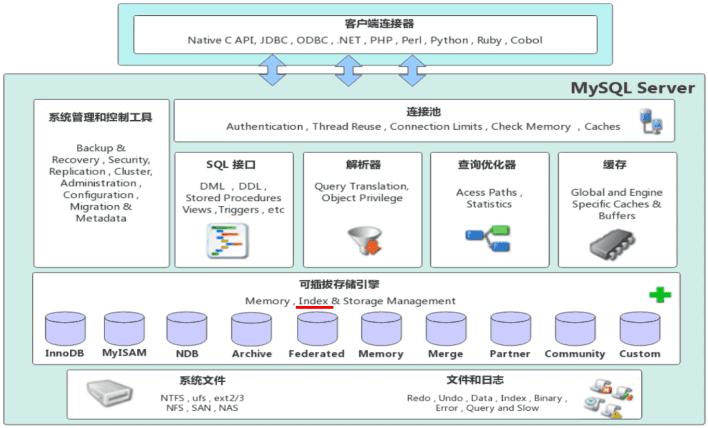
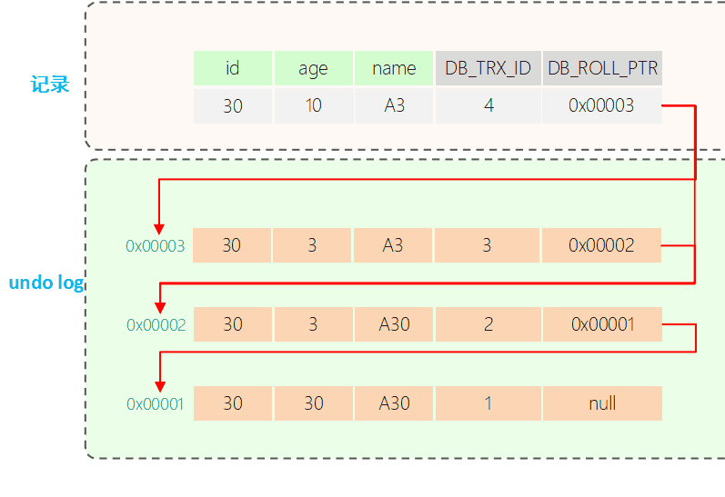

‍

给表添加索引的时候，是会对表加锁的。

如果不谨慎操作可能出现生产事故的，比如过程中发生了数据修改（如DELETE、UPDATE），则可能会读取到不一致或错误的数据。

可以参考以下方法：

1.先创建一张跟原表A数据结构相同的新表B。

2.在新表B添加需要加上的新索引。

3.把原表A数据导到新表B

4.rename新表B为原表的表名A，原表A换别的表名；

一句话：腾笼换鸟，建新表+建索引+导数据+废旧表

‍

‍

‍

# 概念

‍

## 零碎

‍

### 主键 超键 候选键 外键是什么

(当初的数据库课内容)

我的人话, 超键就是主键加上其他几个玩意, 候选键是可以当主键的玩意, 外键相对于这个主键来说的

‍

‍

### 数据库三大范式

第一范式（1NF）、第二范式（2NF）和第三范式（3NF）。

1. **第一范式（1NF, First Normal Form）** ：

    * 要求数据库表中的==每一列都是原子性==的，不可再分的。
    * 每个字段只能包含一个值，不能包含重复的组或数组。
2. **第二范式（2NF, Second Normal Form）** ：

    * 在满足第一范式的基础上，要求表中的每个==非主键列都完全依赖于主键==。
    * 消除部分依赖，即非主键列不能依赖于主键的一部分。
3. **第三范式（3NF, Third Normal Form）** ：

    * 在满足第二范式的基础上，要求表中的每个==非主键列都直接依赖于主键，而不能依赖于其他非主键列==。
    * 消除传递依赖，即非主键列不能依赖于其他非主键列。

‍

‍

‍

### 结合b+树的结构讲一下为什么一定要最左匹配才行

在 B+ 树中，最左匹配原则是指在进行范围查询或前缀匹配时，必须从最左边的键开始匹配。这是因为 B+ 树的结构和索引机制决定了它的查询方式。

B+ 树是一种平衡树结构，所有的键值都存储在叶子节点中，并且叶子节点通过链表相连。内部节点只存储键值的索引，用于指导搜索路径。以下是 B+ 树的几个关键点：

1. **有序性**：B+ 树中的键值是有序的，内部节点的键值用于分割子树的范围。
2. **范围查询**：由于键值是有序的，范围查询可以通过找到范围的起始点，然后顺序遍历叶子节点来完成。
3. **前缀匹配**：前缀匹配查询依赖于键值的有序性，从最左边的键开始匹配，确保查询路径的正确性。

‍

最左匹配原则的原因如下：

1. **索引路径确定**：在 B+ 树中，查询路径是由内部节点的键值决定的。只有从最左边的键开始匹配，才能确定正确的查询路径。
2. **范围查询效率**：最左匹配可以利用键值的有序性，快速定位范围的起始点，然后顺序遍历叶子节点，提高查询效率。
3. **避免全表扫描**：如果不遵循最左匹配原则，查询可能无法利用索引，导致全表扫描，降低查询性能。

‍

‍

### MySQL事务中加锁的过程是什么

‍

1. **启动事务**：使用 `START TRANSACTION`​ 或 `BEGIN`​ 语句启动一个事务。
2. **执行查询并加锁**：

    * **SELECT 语句**：如果使用 `SELECT ... FOR UPDATE`​ 或 `SELECT ... LOCK IN SHARE MODE`​，会对读取的行加锁。
    * **INSERT、UPDATE、DELETE 语句**：这些语句会自动对涉及的行加锁。
3. **锁的类型**：

    * **共享锁（S 锁）** ：允许其他事务读取但不允许修改。使用 `LOCK IN SHARE MODE`​。
    * **排他锁（X 锁）** ：不允许其他事务读取或修改。使用 `FOR UPDATE`​。
4. **提交或回滚事务**：使用 `COMMIT`​ 提交事务，释放所有锁；使用 `ROLLBACK`​ 回滚事务，释放所有锁。

‍

### 你可以讲一下，当我有一个字段，比如说 a 这个字段，它我检索一次 a 等于 10 的这一条数据，它在这个 b +树上它的检索过程是什么

‍

在 B+ 树中检索一个字段的过程如下：

1. **从根节点开始**：从 B+ 树的根节点开始检索。
2. **比较键值**：将要检索的键值（例如 `a = 10`​）与当前节点中的键值进行比较。
3. **选择子节点**：根据比较结果，选择合适的子节点。如果键值小于当前节点的键值，选择左子节点；如果键值大于当前节点的键值，选择右子节点。
4. **重复步骤 2 和 3**：在选定的子节点中重复步骤 2 和 3，直到到达叶子节点。
5. **检索叶子节点**：在叶子节点中查找键值为 `10`​ 的记录。

‍

### 身份证号加索引怎么加

对于长度较长的字符串，我们可以这么建立索引：

* 前缀索引
* 倒序存储
* 哈希存储
* 字段拆分

‍

**身份证长度为18，不适合作为索引。身份证号码特点：前6位代表地址，中间8位为年月日**

因为身份证后六位区分度高，那么我们可以将身份证倒序存储，然后索引为id_card(6)

‍

可以新增一个字段存储身份证号码的哈希值,加上索引，存入身份证时候，对身份证进行crc3()计算，得到的值存入id_card_crc,索引长度为4，因为hash可能会发生碰撞，所以查询时候加上身份证作为筛选条件：

```java
select * from user where id_card_crc = crc32("输入的身份证号码") and id_card = '输入身份证号'；
```

哈希存储只适用等值查询。

‍

**身份证号码拆分存储**

可以将区分度高的，比如后六位单独存储。

‍

‍

### MySQL为什么用JSON存储, 那么大JSON怎么做更新部分字段?

在 MySQL 中使用 JSON 存储数据的一个主要原因是其灵活性和可扩展性。JSON 数据类型允许存储结构化数据，而不需要预定义的模式，这对于需要存储动态或复杂数据结构的应用程序非常有用。

对于更新 JSON 数据中的部分字段，可以使用 MySQL 提供的 JSON 函数，如 `JSON_SET`​、`JSON_REPLACE`​ 和 `JSON_REMOVE`​。以下是一个示例，展示了如何更新 JSON 字段中的部分数据：

‍

假设有一个表 `users`​，其中包含一个 JSON 字段 `info`​：

```sql
CREATE TABLE users (
    id INT PRIMARY KEY,
    info JSON
);
```

插入一些示例数据：

```sql
INSERT INTO users (id, info) VALUES
(1, '{"name": "John", "age": 30, "address": {"city": "New York", "zip": "10001"}}'),
(2, '{"name": "Jane", "age": 25, "address": {"city": "Los Angeles", "zip": "90001"}}');
```

现在，假设我们需要更新 `id`​ 为 1 的用户的 `age`​ 字段和 `address`​ 中的 `city`​ 字段：

```sql
UPDATE users
SET info = JSON_SET(info, '$.age', 31, '$.address.city', 'San Francisco')
WHERE id = 1;
```

在这个示例中，`JSON_SET`​ 函数用于更新 JSON 字段中的 `age`​ 和 `address.city`​。`$.age`​ 和 `$.address.city`​ 是 JSON 路径表达式，用于指定要更新的字段。

更新后的数据可以通过以下查询查看：

```sql
SELECT * FROM users WHERE id = 1;
```

结果将显示 `info`​ 字段中的 `age`​ 和 `address.city`​ 已被更新：

```json
{
    "name": "John",
    "age": 31,
    "address": {
        "city": "San Francisco",
        "zip": "10001"
    }
}
```

通过这种方式，可以方便地更新 MySQL 中 JSON 字段的部分数据。

‍

‍

### MySQL虚拟字段介绍一下

MySQL 虚拟字段（Virtual Columns）是一种特殊的列，它的值不是直接存储在表中，而是根据其他列的值计算得出的。虚拟字段有两种类型：生成列（Generated Columns）和存储列（Stored Columns）。

1. **生成列（Generated Columns）** ：值是动态计算的，不存储在磁盘上。每次查询时都会重新计算。
2. **存储列（Stored Columns）** ：值是计算后存储在磁盘上的，类似于普通列。

‍

创建虚拟字段

生成列

生成列的值在查询时动态计算，不占用存储空间。

```sql
CREATE TABLE example (
    id INT,
    value1 INT,
    value2 INT,
    sum_value INT AS (value1 + value2)  -- 生成列
);
```

存储列

存储列的值在插入或更新时计算并存储，占用存储空间。

```sql
CREATE TABLE example (
    id INT,
    value1 INT,
    value2 INT,
    sum_value INT AS (value1 + value2) STORED  -- 存储列
);
```

‍

‍

### 为什么要了解(MySQL)的原理, 这不是叫厨师去造锅?

玩mysql不懂索引原理，经常会写出一些头疼的语句，轻则索引失效慢查询、重则导致全表被锁出现业务事故，从而经常收到DBA的亲切问候。

‍

‍

‍

### count(1)，count(*)，count(filed) 区别

* count(*)包括了所有的列，相当于行数，在统计结果的时候，不会忽略列值为NULL
* count(1)包括了忽略所有列，用1代表代码行，在统计结果的时候，不会忽略列值为NULL
* count(列名)只包括列名那一列，在统计结果的时候，会忽略列值为空（这里的空不是只空字符串或者0，而是表示null）的计数，即某个字段值为NULL时，不统计。

‍

```java
对于COUNT(1)和COUNT(*)执行优化器的优化是完全一样的, 直接count(*)即可
```

‍

‍

‍

‍

‍

### "N+1 问题" 如何解决？

举个例子，我们数据库中有两张表，一个是Customers，一个是Orders。Orders中含有一个外键customer_id，指向了Customers的主键id。

‍

想要得到所有Customer以及其分别对应的Order，一种写法是 `SELECT * FROM Customers;`​  
对于每一个Customer: `SELECT * FROM Orders WHERE Orders.customer_id = #{customer.id}`​

这样我们实际对数据库做了N+1次查询：选择所有Customer一次得到N个Customer，对于N个Customer分别选择其对应的Order一共N次。  
所以，一共执行了N+1次查询，这就是N+1问题

‍

N+1问题的一般解决方法

使用Left Join一次性取出所有数据：`SELECT * FROM Customers LEFT JOIN Orders on Customers.id = Orders.customer_id`​。 这样虽然取出的数据相对多一些，但是只需要一次执行

‍

> 数据库所谓的几个范式优点纸上谈兵，如果完全按照这些范式设计的话，性能就成渣了，互联网公司实际上极少用join

‍

‍

### 覆盖索引介绍

* **定义**：如果查询的所有列都包含在非主键索引中，那么查询可以直接从索引中获取数据，而不需要回表。这种情况称为覆盖索引
* **优势**：使用覆盖索引可以减少I/O操作，提高查询效率。

‍

### MySQL中用主键和非主键去查询时候引擎处理的差别

‍

‍

#### 主键查询

**主键索引（聚簇索引）** ：

* **数据存储**：在InnoDB中，主键索引的叶子节点存储的是整行数据，因此主键索引也被称为聚簇索引。
* **查询过程**：当使用主键进行查询时，InnoDB引擎直接通过B+树找到对应的叶子节点，获取整行数据。这种方式效率较高，因为不需要进行额外的查找操作

‍

‍

#### 非主键查询

(**非聚簇索引）**

* **数据存储**：非主键索引的叶子节点存储的是主键的值，而不是整行数据。
* **查询过程**：当使用非主键进行查询时，InnoDB引擎首先通过非主键索引找到对应的主键值，然后再通过主键索引找到整行数据。这种过程称为“回表”。由于需要进行两次查找，查询效率相对较低。

‍

‍

### **mysql的全连接**

用full join

或者使用联合连接union把左右连接合起来

```sql
select * from a left join b on a.id = b.id
union
select * from a right join b on a.id = b.id
```

‍

‍

### 为什么Mysql不能做到单线程跟redis一样快？要求说多种原因

1. **数据存储模型**：

    * **MySQL**：MySQL是一个关系型数据库管理系统（RDBMS），它使用复杂的数据存储模型和索引结构来支持SQL查询。这些复杂的操作需要更多的计算资源和时间。
    * **Redis**：Redis是一个内存中的键值存储数据库，数据存储在内存中，访问速度非常快。它的操作相对简单，通常是O(1)时间复杂度。
2. **持久化机制**：

    * **MySQL**：MySQL需要将数据持久化到磁盘，这涉及到磁盘I/O操作，这些操作相对较慢。
    * **Redis**：Redis主要在内存中操作，虽然也支持持久化，但其主要设计目标是高性能的内存操作。
3. **事务处理**：

    * **MySQL**：MySQL支持复杂的事务处理，确保数据的一致性和完整性。这些事务处理需要额外的开销。
    * **Redis**：Redis也支持事务，但其事务模型相对简单，不支持复杂的事务隔离级别。
4. **查询复杂性**：

    * **MySQL**：MySQL支持复杂的SQL查询，包括多表连接、子查询等，这些操作需要更多的计算资源。
    * **Redis**：Redis的查询操作相对简单，通常是基于键值的直接访问。
5. **锁机制**：

    * **MySQL**：MySQL使用锁机制来确保数据一致性，这些锁操作会影响性能。
    * **Redis**：Redis是单线程的，不需要复杂的锁机制来管理并发访问。
6. **内存管理**：

    * **MySQL**：MySQL需要管理内存和磁盘之间的数据交换，这增加了额外的开销。
    * **Redis**：Redis的数据全部存储在内存中，访问速度非常快。

综上所述，MySQL和Redis在设计目标和使用场景上有很大的不同，这导致了它们在单线程性能上的差异。Redis在内存中操作，设计简单，适合高性能的键值存储，而MySQL则是一个功能强大的关系型数据库，支持复杂的查询和事务处理。

‍

‍

### static有什么用途

* 在函数体，一个被声明为静态的变量在这一函数被调用过程中**维持其值不变**。
* 在模块内（但在函数体外），一个被声明为静态的变量可以被模块内所用函数访问，但不能被模块外其它函数访问。它是一个**本地的全局变量**。
* 在模块内，一个被声明为静态的函数只可被这一模块内的其它函数调用。那就是，这个函数被限制在声明它的模块的**本地范围内使用**

‍

‍

### 引用与指针有什么区别 (C)

* 引用必须被初始化，指针不必。
* 引用初始化以后不能被改变，指针可以改变所指的对象。
* 不存在指向空值的引用，但是存在指向空值的指针。

‍

‍

### 为什么mysql不推荐使用text

1. **性能问题**：`TEXT`​类型的数据存储和检索性能较差，因为它们存储在一个单独的区域，而不是行内存储。每次访问`TEXT`​字段时，都会有额外的I/O开销。
2. **索引限制**：`TEXT`​类型的字段不能直接创建索引，必须指定前缀长度，这会限制索引的有效性和性能。
3. **内存使用**：`TEXT`​类型的字段在处理时会消耗大量内存，尤其是在排序和临时表操作时，可能会导致内存不足的问题。
4. **操作限制**：某些操作（如`GROUP BY`​和`ORDER BY`​）在处理`TEXT`​类型字段时会有额外的限制和开销。
5. **替代方案**：在大多数情况下，可以使用`VARCHAR`​类型代替`TEXT`​类型。`VARCHAR`​类型在MySQL 5.0及以上版本中支持的最大长度为65535字节，足以满足大多数需求，并且性能更好。

‍

### 从 innodb 的索引结构分析，为什么索引的 key 长度不能太长？

key 太长会导致一个页当中能够存放的 key 的数目变少，间接导致索引树的页数目变多，索引层次增加，从而影响整体查询变更的效率。

‍

### 一般为什么mysql的b+树设计为3层

MySQL 的 B+ 树索引通常设计为 3 层是为了在性能和存储之间取得平衡。以下是一些原因：

1. **磁盘 I/O 性能**：B+ 树的设计使得每个节点可以包含多个键值对，从而减少树的高度。较少的树层数意味着在查找过程中需要的磁盘 I/O 操作更少，从而提高查询性能。
2. **内存利用率**：B+ 树的非叶子节点只存储键值，而叶子节点存储实际的数据记录。这样可以在内存中存储更多的索引节点，提高内存利用率。
3. **平衡性**：B+ 树是一种平衡树，所有叶子节点在同一层，保证了查找、插入和删除操作的时间复杂度为 O(log n)。3 层的 B+ 树可以容纳大量的数据，同时保持较高的查找效率。
4. **数据量和节点大小**：假设每个节点可以存储 1000 个键值对，3 层的 B+ 树可以存储大约 1000^3 = 10 亿个键值对，足以满足大多数应用场景的需求。

综上所述，3 层的 B+ 树设计在性能、存储和复杂度之间取得了良好的平衡，适合大多数 MySQL 数据库的应用场景。

‍

‍

### varchar与char的区别

​`VARCHAR`​和`CHAR`​是两种用于存储字符串的字段类型，它们之间的主要区别如下：

1. **存储方式**：

    * ​`CHAR`​：固定长度的字符串。如果存储的字符串长度小于定义的长度，剩余的空间会用空格填充。
    * ​`VARCHAR`​：可变长度的字符串。存储的字符串长度可以小于定义的长度，不会用空格填充。
2. **存储效率**：

    * ​`CHAR`​：由于是固定长度，存取速度较快，但可能会浪费存储空间。
    * ​`VARCHAR`​：由于是可变长度，存储空间利用率较高，但存取速度可能稍慢。
3. **使用场景**：

    * ​`CHAR`​：适用于存储长度固定的字符串，如国家代码、邮政编码等。
    * ​`VARCHAR`​：适用于存储长度不固定的字符串，如姓名、地址等。

‍

‍

### 数据库约束

数据库约束是用于确保数据库中数据的完整性和一致性的一组规则

常见的数据库约束包括：

1. **主键约束（Primary Key Constraint）** ：

    * 确保每一行都有一个唯一的标识符，不能包含空值。
2. **唯一约束（Unique Constraint）** ：

    * 确保一列或多列的值在表中是唯一的，可以包含空值。
3. **外键约束（Foreign Key Constraint）** ：

    * 确保一列或多列的值必须在另一表的主键或唯一键中存在，用于维护表之间的关系。
4. **非空约束（Not Null Constraint）** ：

    * 确保一列不能包含空值。
5. **检查约束（Check Constraint）** ：

    * 确保一列或多列的值满足指定的条件。
6. **默认约束（Default Constraint）** ：

    * 为一列指定默认值，如果插入数据时没有提供该列的值，则使用默认值。

‍

‍

## MySQL 的数据如何恢复到任意时间点

恢复到任意时间点以定时的做全量备份，以及备份增量的 binlog 日志为前提。恢复到任意时间点首先将全量备份恢复之后，再此基础上回放增加的 binlog 直至指定的时间点。

‍

‍

## 自增值不连续的 4 个场景

1. 自增初始值和自增步长设置不为 1
2. 唯一键冲突
3. 事务回滚
4. 批量插入（如 `insert...select`​ 语句）

‍

‍

## drop,delete与truncate的区别

drop直接删掉表 truncate删除表中数据，再插入时自增长id又从1开始 delete删除表中数据，可以加where字句。

（1） DELETE语句执行删除的过程是每次从表中删除一行，并且同时将该行的删除操作作为事务记录在日志中保存以便进行进行回滚操作。TRUNCATE TABLE 则一次性地从表中删除所有的数据并不把单独的删除操作记录记入日志保存，删除行是不能恢复的。并且在删除的过程中不会激活与表有关的删除触发器。执行速度快。

（2） 表和索引所占空间。当表被TRUNCATE 后，这个表和索引所占用的空间会恢复到初始大小，而DELETE操作不会减少表或索引所占用的空间。drop语句将表所占用的空间全释放掉。

（3） 一般而言，drop > truncate > delete

（4） 应用范围。TRUNCATE 只能对TABLE；DELETE可以是table和view

（5） TRUNCATE 和DELETE只删除数据，而DROP则删除整个表（结构和数据）。

（6） truncate与不带where的delete ：只删除数据，而不删除表的结构（定义）drop语句将删除表的结构被依赖的约束（constrain),触发器（trigger)索引（index);依赖于该表的存储过程/函数将被保留，但其状态会变为：invalid。

（7） delete语句为DML（Data Manipulation Language),这个操作会被放到 rollback segment中,事务提交后才生效。如果有相应的 tigger,执行的时候将被触发。

（8） truncate、drop是DDL（Data Define Language),操作立即生效，原数据不放到 rollback segment中，不能回滚

（9） 在没有备份情况下，谨慎使用 drop 与 truncate。要删除部分数据行采用delete且注意结合where来约束影响范围。回滚段要足够大。要删除表用drop;若想保留表而将表中数据删除，如果于事务无关，用truncate即可实现。如果和事务有关，或老是想触发trigger,还是用delete。

（10） Truncate table 表名 速度快,而且效率高,因为: truncate table 在功能上与不带 WHERE 子句的 DELETE 语句相同：二者均删除表中的全部行。但 TRUNCATE TABLE 比 DELETE 速度快，且使用的系统和事务日志资源少。DELETE 语句每次删除一行，并在事务日志中为所删除的每行记录一项。TRUNCATE TABLE 通过释放存储表数据所用的数据页来删除数据，并且只在事务日志中记录页的释放。

（11） TRUNCATE TABLE 删除表中的所有行，但表结构及其列、约束、索引等保持不变。新行标识所用的计数值重置为该列的种子。如果想保留标识计数值，请改用 DELETE。如果要删除表定义及其数据，请使用 DROP TABLE 语句。

（12） 对于由 FOREIGN KEY 约束引用的表，不能使用 TRUNCATE TABLE，而应使用不带 WHERE 子句的 DELETE 语句。由于 TRUNCATE TABLE 不记录在日志中，所以它不能激活触发器。

‍

‍

‍

## 数据库类型

‍

### 关系型

‍

关系数据库（Relational Database）是建立在关系模型基础上的数据库，借助于几何代数等数学概念和方法来处理数据库中的数据。所谓关系模型是一对一、一对多或者多对多等关系，常见的关系型数据库有 Oracle、SQL Server、DB2、MySQL 等。

而文档型数据库是一种非关系型数据库，非关系型数据库（Not Only SQL，NoSQL）正好与关系型数据库相反，它不是建立在“关系模型”上的数据库。文档型数据库的典型代表是 MongoDB。

‍

‍

### 非关系型

非关系型数据通常包含 3 种数据库类型：文档型数据库、键值型数据库和全文搜索型数据库

‍

#### 1.文档型数据库

文档型数据库以 MongoDB 和 Apache CouchDB 为代表，文档型数据库通常以 JSON 或者 XML 为格式进行数据存储。

‍

文档型数据库的使用场景如下。

* **敏捷开发**，因为 MongoDB 拥有比关系型数据库更快的开发速度，使用 MongoDB 只需要在程序层面严格把关就行，程序提交的数据结构可以直接更新到数据库中，并不需要繁杂的设计数据库模型再生成修改语句等过程。
* **日志系统**，使用 MongoDB 数据库非常适合存储日志，日志对应到数据库中就是很多个文件，而 MongoDB 更擅长存储和查询文档，它提供了更简单的存储和更方便的查询功能。
* **社交系统**，使用 MongoDB 可以很方便的存储用户的位置信息，可以方便的实现查询附近的人以及附近的地点等功能。

‍

‍

#### 2.键值型数据库

键值数据库也就是 Key-Value 数据库，它的典型代表数据库是 Redis 和 Memcached，而它们通常被当做非持久化的内存型数据库缓存来使用。当然 Redis 数据库是具备可持久化得能力的，但是开启持久化会降低系统的运行效率，因此在使用时需要根据实际的情况，选择开启或者关闭持久化的功能。

键值型数据库以极高的性能著称，且除了 Key-Value 字符串类型之外，还包含一些其他的数据类型。以 Redis 为例，它提供了字符串类型（String）、列表类型（List）、哈希表类型（Hash）、集合类型（Set）、有序集合类型（ZSet）等五种最常用的基础数据类型，还有管道类型（Pipeline）、地理位置类型（GEO）、基数统计类型（HyperLogLog）和流类型（Stream），并且还提供了消息队列的功能。

此数据库的优点是性能比较高，缺点是对事务的支持不是很好。

‍

‍

#### 3.全文搜索型数据库

传统的关系型数据库主要是依赖索引来实现快速查询功能的，而在全文搜索的业务下，索引很难满足查询的需求。因为全文搜索需要支持模糊匹配的，当数据量比较大的情况下，传递的关系型数据库的查询效率是非常低的；另一个原因是全文搜索需要支持多条件随意组合排序，如果要通过索引来实现的话，则需要创建大量的索引，而传统型数据库也很难实现，因此需要专门全文搜索引擎和相关的数据库才能实现此功能。

全文搜索型数据库以 ElasticSearch 和 Solr 为代表，它们的出现解决了关系型数据库全文搜索功能较弱的问题。

‍

‍

‍

## MySQL执行流程

MySQL 的执行流程是这样的，首先客户端先要发送用户信息去服务器端进行授权认证。如果使用的是命令行工具，通常需要输入如下信息

> mysql -h 主机名(IP) -u 用户名 -P 端口 -p

* -h 表示要连接的数据库服务器的主机名或者 IP 信息；
* -u 表示数据库的用户名称；
* -P 表示数据库服务器的端口号，
* 小写的 -p 表示需要输入数据库的密码。

‍

连接服务器端成功之后就可以正常的执行 SQL 命令

MySQL 服务器拿到 SQL 命令之后，会使用 MySQL 的**分析器**解析 SQL 指令，同时会根据**语法分析器**验证 SQL 指令，查询 SQL 指令是否满足 MySQL 的语法规则。如果不支持此语法，则会提示“SQL syntax”语法错误信息

当分析器**验证并解析** SQL 命令之后，会进入优化器阶段: 执行生成计划，并设置相应的索引

上面的这些步骤都执行完之后，就进入了执行器阶段，并开始正式执行 SQL 命令。

在执行命令之前，会先对你的执行命令进行权限查询，看看是否有操作某个表的权限. 如果有相应的权限，执行器就去调用 MySQL 数据库引擎提供的接口，执行相应的命令；如果是**非查询操作会记录对应的操作日志**，再命令执行完成之后返回结果给客户端

如果执行的是 select 语句并且是 MySQL 8.0 之前的版本的话，则会去 MySQL 的**查询缓存**中查看之前是否有执行过这条 SQL；如果缓存中可以查到，则会直接返回查询结果，这样查询性能就会提升很高 (之后取消了, 不一致性)

‍

> 分析器 -> 优化器 -> 执行器 -> 结果展现

‍

‍

‍

## **优化数据库方法**

> 还是要落地到业务场景和自己的项目和准备中去

1. 硬件    主要在存储层优化
2. 网络    提升传输效率
3. 操作系统调优
4. **表结构设计优化**
5. sql优化
6. 减少函数使用
7. 索引优化
8. 大字段及全文检索优化
9. 连接池优化
10. 事务优化
11. 数据库集群化
12. 加入缓存
13. **冷热存储**    不需要的可以存到旧库里面, 需要的时候导出来
14. **分库分表**

‍

## 数据库迁移

比如从 MySQL 迁移到 postgresql？如果你需要管理这样的项目，你预期会遇到什么问题？

‍

首先，如果这个项目是可以停掉的，那直接停掉，迁移完毕之后验证数据就好了

‍

如果这个项目不能停掉，可以按下面的步骤

1. 更改代码，数据开始**双写新旧数据库**
2. 更改读取代码，开始灰度读取新数据库数据
3. 把历史数据导入新数据库
4. 灰度下掉老数据库

预期会有数据不一致，性能问题等

‍

‍

## 数据库查询语句有几部分组成, 并述说这些部分在DB执行顺序

1. **SELECT**：指定要查询的列。
2. **FROM**：指定要查询的表。
3. **WHERE**：指定查询条件。
4. **GROUP BY**：对结果进行分组。
5. **HAVING**：对分组后的结果进行过滤。
6. **ORDER BY**：对结果进行排序。
7. **LIMIT**：限制返回的行数。

‍

‍

### 全使用示例

以下是一个包含所有这些部分的 SQL 查询示例：

```sql
SELECT column1, column2
FROM table_name
WHERE condition
GROUP BY column1
HAVING condition
ORDER BY column1 ASC
LIMIT 10;
```

这个查询语句的作用是从 `table_name`​ 表中选择 `column1`​ 和 `column2`​ 列，满足 `WHERE`​ 条件的记录，然后按 `column1`​ 分组，过滤满足 `HAVING`​ 条件的分组，按 `column1`​ 升序排序，并限制返回的行数为 10。

‍

‍

### 执行顺序

与其书写顺序不同

1. **FROM**：确定数据源表。
2. **WHERE**：过滤数据。
3. **GROUP BY**：对数据进行分组。
4. 聚集函数进行计算
5. **HAVING**：过滤分组后的数据。
6. 计算表达式
7. **SELECT**：选择要返回的列。
8. **ORDER BY**：对结果进行排序。
9. **LIMIT**：限制返回的行数。

确保了数据在各个阶段被正确处理和过滤

‍

‍

### having和where区别？

* 二者作用的对象不同，`where`​子句作用于表和视图，`having`​作用于组。
* ​`where`​在数据分组前进行过滤，`having`​在数据分组后进行过滤。
* 另一方面，`HAVING`​子句中不能使用除了分组字段和聚合函数之外的其他字段
* 先执行where,然后group by 然后having

‍

‍

## 表连接的底层原理

在数据库中，表连接的底层原理涉及以下几个关键步骤：

1. **扫描表**：数据库首先扫描两个表的数据。扫描方式可以是全表扫描，也可以是索引扫描，具体取决于查询条件和表的索引情况。
2. **生成笛卡尔积**：对于没有连接条件的表连接，数据库会生成两个表的笛卡尔积，即每个表的每一行与另一个表的每一行进行组合。这种方式通常效率较低。
3. **应用连接条件**：对于有连接条件的表连接（如 `INNER JOIN`​），数据库会根据连接条件过滤笛卡尔积的结果，只保留满足条件的记录。
4. **优化执行计划**：数据库会根据统计信息和索引情况，选择最优的执行计划。例如，数据库可能会选择哈希连接、嵌套循环连接或合并连接等不同的连接算法。
5. **返回结果**：最终，数据库会将连接后的结果返回给用户。

‍

‍

### 嵌套循环连接算法

嵌套循环连接是最简单的一种连接算法，适用于小表连接。其基本步骤如下：

1. 外层循环扫描表A的每一行。
2. 内层循环扫描表B的每一行。
3. 对于每一对记录，检查是否满足连接条件。
4. 如果满足条件，则将记录加入结果集。

> 两层for

‍

‍

## 索引下推

索引下推（Index Condition Pushdown，简称 ICP）是 MySQL 5.6 引入的一种查询优化技术。它的主要目的是在索引扫描过程中尽早应用 WHERE 子句中的条件，从而减少回表和访问存储引擎的次数，提高查询效率

‍

‍

### 工作原理

在没有使用索引下推的情况下，MySQL 的查询过程如下：

1. 存储引擎读取索引记录。
2. 根据索引中的主键值，定位并读取完整的行记录。
3. 存储引擎将记录交给 Server 层，Server 层检测该记录是否满足 WHERE 条件。

‍

使用索引下推的情况下，查询过程如下：

1. 存储引擎读取索引记录（不是完整的行记录）
2. 判断 **WHERE 条件部分能否用索引中的列来做检查**，条件不满足则处理下一行索引记录。
3. 条件满足时，使用索引中的主键去定位并读取完整的行记录（即回表）。
4. 存储引擎将记录交给 Server 层，Server 层检测该记录是否满足 WHERE 条件的其余部分。

‍

### 优点

* **减少回表次数**：通过在索引层过滤掉不符合条件的记录，减少了回表的次数。
* **提高查询效率**：减少了存储引擎必须检查的行数，从而提高了查询效率。

‍

‍

## **数据库查询 offset 的流程**

1. 查询 offset 的流程：

    1. 先通过辅助索引找到*所有*主键值
    2. 再*逐条*回表查询，根据主键值找到数据块的内容，重复 `offset + limit`​ 次
    3. 丢弃前面的 `offset`​ 条数据，只保留最后的 `limit`​ 条
    4. 例如：`LIMIT 30000, 10`​ 的意思是，扫描满足条件的 30010 行，扔掉前面的 30000 行，然后返回最后的 10 行
2. MySQL 不会自动优化上面的语句，所以如果 offset 过大，会导致频繁通过主键索引访问 I/O，造成性能下降
3. 如何优化？可以**在有序主键上进行子查询优化**，即先查出偏移后的主键，再根据该主键回表查询：

    ```sql
     # 性能低下的语句：
     select * from member where gender=1 limit 300000,1;
     # 可以优化为：
     select a.* from member as a inner 
       join (
         select id from member where gender=1 limit 300000,1
       ) as b 
       on a.id=b.id
    ```

‍

‍

### 深度分页问题

基于主键分页：使用主键或唯一索引进行分页查询，而不是使用 OFFSET。

```java
SELECT * FROM your_table
WHERE id > (SELECT id FROM your_table ORDER BY id LIMIT 1 OFFSET 1000)
ORDER BY id
LIMIT 10;
```

直接把id作为条件去查找

‍

当offset非常大时，server层会从引擎层获取到很多无用的数据，而当select后面是*号时，就需要拷贝完整的行信息，**拷贝完整数据**相比**只拷贝行数据里的其中一两个列字段**更耗费时间。这就是深度分页问题。

‍

优化方法：

延迟关联法，就是把条件转移到主键索引树，然后减少回表。

先用子查询查出符合条件的主键，再用主键ID做条件查出所有字段。

‍

**阿里的方案：**

配置limit的偏移量和获取数一个最大值，超过这个最大值，就返回空数据。因为按照业务来说，超过这个值你已经不是在分页了，而是在刷数据了，如果确认要找数据，应该输入合适条件来缩小范围，而不是一页一页分页。

客户请求request的时候 如果offset大于某个数值就先返回一个4xx的错误，避免黑客攻击or刷单行为呢，正常人，很少翻查10页以后的内容。

另外，该有的限流、降级也应该考虑进去。比如工具多线程调用，在短时间频率内5000次调用，可以使用计数服务判断并反馈用户调用过于频繁，直接给予断掉

‍

## 怎么定位慢查询？

‍

* **运维监控工具skywalking**

我们当时做压测的时候有的接口非常的慢，接口的响应时间超过了2秒以上，因为我们当时的系统部署了运维的监控系统skywalking，在展示的报表中可以看到是哪一个接口比较慢，并且可以分析这个接口哪部分比较慢，这里可以看到SQL的具体的执行时间，所以可以定位是哪个sql出了问题

* mysql慢查询日志

‍

‍

‍

## 有张表用uuid建表，有张表用自增id建表，1kw行记录，添加数据的效率谁更高？为什么？谁的查询效率高？为什么？

‍

### 添加数据的效率

1. **索引维护**：自增ID是顺序递增的，插入新记录时总是追加到表的末尾，索引维护开销较小。而UUID是随机的，插入新记录时可能会导致索引的频繁重排和页分裂，增加了开销。
2. **页分裂**：自增ID不会导致页分裂，而UUID由于是随机的，可能会导致频繁的页分裂，影响插入性能。

‍

### 查询效率

1. **索引结构**：自增ID的索引是顺序的，查询时可以利用二分查找等高效算法。而UUID是随机的，索引结构较为分散，查询效率较低。
2. **缓存命中率**：自增ID的索引更容易被缓存，查询时的缓存命中率更高。而UUID的索引较为分散，缓存命中率较低。

‍

### 总结

* **添加数据效率**：自增ID建表更高，因为索引维护和页分裂开销较小。
* **查询效率**：自增ID建表更高，因为**索引结构更紧凑**，缓存命中率更高。

‍

‍

## 悲观锁乐观锁、如何写对应的SQL

悲观锁：在悲观锁机制下，事务认为在它执行期间数据一定会被其他事务修改，因此在读取数据时就立即对其加锁，阻止其他事务对同一数据进行操作，直到当前事务结束并释放锁。SELECT ... FOR UPDATE或SELECT ... LOCK IN SHARE MODE  
乐观锁：乐观锁并不在读取数据时立即加锁，而是在更新数据时检查自上次读取以来数据是否已被其他事务修改过。这通常通过在表中添加一个版本号字段或者时间戳字段来实现。

‍

‍

‍

# 大块

‍

‍

‍

‍

## 数据类型选择

‍

‍

### 同财务相关的金额类数据必须使用 decimal 类型

* **非精准浮点**：float,double
* **精准浮点**：decimal

decimal 类型为精准浮点数，在计算时不会丢失精度。占用空间由定义的宽度决定，每 4 个字节可以存储 9 位数字，并且小数点要占用一个字节。并且，decimal 可用于存储比 bigint 更大的整型数据

不过， 由于 decimal 需要额外的空间和计算开销，应该尽量只在需要对数据进行精确计算时才使用 decimal

‍

‍

### Boolean如何表示？

MySQL 中没有专门的布尔类型，而是用 TINYINT(1) 类型来表示布尔值。TINYINT(1) 类型可以存储 0 或 1，分别对应 false 或 true。

‍

‍

### 一定不要用字符串存储日期

对于日期类型来说， 一定不要用字符串存储日期

可以考虑 DATETIME、TIMESTAMP 和 数值型时间戳。 容量够就DT, 范围最广, 虽然不带时区信息

这三种种方式都有各自的优势，根据实际场景选择最合适的

|类型|存储空间|日期格式|日期范围|是否带时区信息|
| --------------| ----------| --------------------------------| --------------------------------------------------------------| ----------------|
|DATETIME|5~8 字节|YYYY-MM-DD hh:mm:ss[.fraction]|1000-01-01 00:00:00[.000000] ～ 9999-12-31 23:59:59[.999999]|否|
|TIMESTAMP|4~7 字节|YYYY-MM-DD hh:mm:ss[.fraction]|1970-01-01 00:00:01[.000000] ～ 2038-01-19 03:14:07[.999999]|是|
|数值型时间戳|4 字节|全数字如 1578707612|1970-01-01 00:00:01 之后的时间|否|

‍

‍

‍

## 空值处理

‍

### NULL 和 '' 的区别是什么？

​`NULL`​ 跟 `''`​(空字符串)是两个完全不一样的值，区别如下：

* ​`NULL`​ 代表一个不确定的值,就算是两个 `NULL`​,它俩也不一定相等。例如，`SELECT NULL=NULL`​的结果为 false，但是在我们使用`DISTINCT`​,`GROUP BY`​,`ORDER BY`​时,`NULL`​又被认为是相等的。
* ​`''`​的长度是 0，是不占用空间的，而`NULL`​ 是需要占用空间的。
* ​`NULL`​ 会影响聚合函数的结果。例如，`SUM`​、`AVG`​、`MIN`​、`MAX`​ 等聚合函数会忽略 `NULL`​ 值。 `COUNT`​ 的处理方式取决于参数的类型。如果参数是 `*`​(`COUNT(*)`​)，则会统计所有的记录数，包括 `NULL`​ 值；如果参数是某个字段名(`COUNT(列名)`​)，则会忽略 `NULL`​ 值，只统计非空值的个数。
* 查询 `NULL`​ 值时，必须使用 `IS NULL`​ 或 `IS NOT NULLl`​ 来判断，而不能使用 =、!=、 <、> 之类的比较运算符。而`''`​是可以使用这些比较运算符的。

‍

‍

### null处理方式

> 为什么数据库把 null 当做一个特殊值来处理？比如说 `Select * From table Where Field = null`​ 不会匹配到含有 null 的行？

因为 null 表示的是没有值，它**不和任何值相等**

‍

### 尽可能把所有列定义为 NOT NULL

除非有特别的原因使用 NULL 值，应该总是让字段保持 NOT NULL。

* 索引 NULL 列需要额外的空间来保存，所以要占用更多的空间；
* 进行比较和计算时要对 NULL 值做特别的处理。

‍

‍

## Mysql的架构/组成

MySQL主要分为 Server 层和存储引擎层：

* **Server 层**：主要包括连接器、查询缓存、分析器、优化器、执行器等，所有跨存储引擎的功能都在这一层实现，比如存储过程、触发器、视图，函数等，还有一个通用的日志模块 binglog 日志模块。
* **存储引擎**： 实现数据的存储和提取，不同的存储引擎如InnoDB、MyISAM通过这些API与Server层交互。存储引擎层提供数据存储和提取的具体实现，而Server层通过API调用这些功能，使得不同存储引擎能够与Server层无缝对接。

‍

**Server 层基本组件**

* **连接器：**  负责与客户端建立连接，并管理连接的权限验证和维持。当客户端连接 MySQL 时，server层会对其进行身份认证和权限校验。
* **查询缓存 (8.0取消):**  执行查询语句的时候，会先查询缓存，先校验这个 select语句 是否执行过，如果有缓存这个 sql，就会直接返回给客户端，如果没有命中，就会执行后续的操作。
* **分析器:**  没有命中缓存的话，SQL 语句就会经过分析器，主要分为两步，词法分析和语法分析。首先通过词法分析识别出各个字符串的意义，然后进行语法分析，检查语句是否符合语法结构。如有错误，会提示错误位置。
* **优化器：**  优化器对查询进行优化，选择最有效的查询路径，包括索引的选择和表的读取顺序，生成执行计划，包括选择合适的索引、表扫描顺序等。
* **执行器：**  根据优化后的执行计划调用存储引擎的API来实际执行SQL语句。在执行前会再次检查权限，确认当前用户有权执行该操作，然后通过存储引擎接口访问数据。

‍

### 数据库引擎

选择数据库引擎要从实际的业务情况入手，比如是否需要支持==事务==？是否需要支持==外键==？是否需要支持==持久化==？以及是否支持地理位置存储以及索引等方面进行综合考量。

‍

常用的数据库引擎有 InnoDB、MyISAM、MEMORY 等，其中 **InnoDB 支持事务功能，而 MyISAM 不支持事务**，但 MyISAM 拥有**较高的插入和查询的速度。** 而 MEMORY 是内存型的数据库引擎，它会将表中的数据存储到内存中，因为它是内存级的数据引擎，因此具备最快速的**查询效率，可以作为临时表来使用**，但它的缺点是，重启数据库之后，所有数据都会丢失，因为这些数据是存放在内存中的, 反之InnoDB 和 MyISAM 都支持持久化. 

根据实际的情况设置相关的数据库引擎，还可以针对不同的表设置不同的数据引擎，只需要在创建表的时候指定 engine=引擎名称即可

‍

1. InnoDB支持事务
2. InnoDB支持外键
3. InnoDB有行级锁，MyISAM是表级锁

MyISAM相对简单所以在效率上要优于InnoDB。如果系统插入和查询操作多，不需要事务外键。选择MyISAM  
如果需要频繁的更新、删除操作，或者需要事务、外键、行级锁的时候。选择InnoDB。

‍

#### MyISAM

‍

MySQL 原生引擎，但它并不支持事务功能，这也是后来被 InnoDB 替代为默认引擎的主要原因。MyISAM 有独立的索引文件，因此在读取数据方面的性能很高，它也支持全文索引、地理位置存储和索引等功能，但==不支持外键。==

MyISAM是表锁，不支持**事务**和**主外键**

MyIsam是非聚集索引，数据和文件是分离的，索引保存的是数据文件的指针，主键索引和辅助索引是独立的。

MyIsam支持全文检索，查询效率上MyIsam要高

‍

‍

#### InnoDB

‍

Mysql 5.5以后默认使用InnoDB为搜索引擎

InnoDB默认可以创建16个索引

* InnoDB支持事务，对于InnoDB每一条SQL语言都**默认封装成事务**，自动提交，这样会影响速度，所以最好把多条SQL语言放到begin 和 commit之间，**组成一个事务**；
* InnoDB支持外键，而MyIsam不支持，对一个包含外键的InnoDB表转成MyIsam表会失败
* InnoDB是**聚集索引**，**数据文件和索引绑定在一块**，必须要有主键，通过主键索引效率很高. 但是辅助索引需要两次查询，先查询到主键，然后在通过主键查询到数据。

  因此主键不应该过大。主键过大的时候，其它索引也会很大
* InnoDB不支持全文检索

‍

InnoDB 还支持外键、崩溃后的快速恢复、支持全文检索（需要 5.6.4+ 版本）、集群索引，以及地理位置类型的存储和索引等功能。

‍

‍

#### 特性

‍

‍

##### 自增主键

‍

> 在一个自增表里面一共有 5 条数据，id 从 1 到 5，删除了最后两条数据，也就是 id 为 4 和 5 的数据，之后重启的 MySQL 服务器，又新增了一条数据，请问新增的数据 id 为几？

‍

我们通常的答案是如果表为 ==MyISAM 引擎，那么 id 就是 6==，如果是 ==InnoDB 那么 id 就是 4==。

但是这个情况在高版本的 InnoDB 中，也就是 MySQL 8.0 之后就不准确了，它的 id 就不是 4 了，而是 6 了。

在 MySQL 8.0 之后 InnoDB 会把**索引持久化到日志中，重启服务之后自增索引是不会丢失的**，因此答案是 6

> 我的实操情况是, MySQL一般都是8.0.36差不多的版本了, 于是都是持久化的永久的自增, 不会因为断电停下的.

‍

‍

## SQL语句在Mysql中的执行过程

分为两种，一种是查询，一种是更新（增加，修改，删除）

‍

### 1.查询语句执行流程

大概有4步：

* 先**连接器**检查该语句是否有权限，如果没有权限，直接返回错误信息

  如果有权限，会先查询缓存(8.0之前)，以这条 SQL 语句为 key 在内存中查询是否有结果，如果有直接返回缓存结果，如果没有，执行下一步。
* 通过**分析器**进行词法分析，提取 SQL 语句的关键元素。然后判断这个 SQL 语句是否有语法错误，比如关键词是否正确等等，如果检查没问题就执行下一步。
* 接下来就是**优化器**进行确定执行方案，优化器根据自己的优化算法进行选择执行效率最好的一个方案
* 进行**权限校验**，如果没有权限就会返回错误信息，如果有权限就会调用数据库引擎接口，返回引擎的执行结果。

‍

### 2.更新语句执行流程

举个例子，更新语句是这样的：

```
update user set name = '张三' where id = 1;
```

‍

1.先查询到 id 为1的记录，有缓存会使用缓存。(8.0...)

2.拿到查询结果，将 name 更新为张三，然后调用引擎接口，写入更新数据，innodb 引擎将数据保存在内存中，同时记录`redo log`​，此时`redo log`​进入 `准备`​状态。

3.执行器收到通知后记录`binlog`​，然后调用引擎接口，提交`redo log`​为提交状态。

4.更新完成。

‍

**为什么记录完**​**​`redo log`​**​ **，不直接提交，而是先进入**​**​`准备`​**​**状态？**

假设先写`redo log`​直接提交，然后写`binlog`​，写完`redo log`​后，机器挂了，`binlog`​日志没有被写入，那么机器重启后，这台机器会通过`redo log`​恢复数据，但是这个时候`binlog`​并没有记录该数据，后续进行机器备份的时候，就会丢失这一条数据，同时主从同步也会丢失这一条数据。

‍

‍

## 缓存

8.0不看

‍

### 查询缓存的利弊

MySQL 8.0 之前可以正常的使用查询缓存的功能，可通过`SHOW GLOBAL VARIABLES LIKE 'query_cache_type`​ 命令查询数据库是否开启了查询缓存的功能

* OFF，关闭了查询缓存功能；
* ON，开启了查询缓存功能；
* DEMAND，在 sql 语句中指定 sql_cache 关键字才会有查询缓存，也就是说必须使用 sql_cache 才可以把该 select 语句的查询结果缓存起来，比如`select sql_cache name from token where tid=1010`​语句

‍

开启和关闭查询缓存可以通过修改 MySQL 的配置文件 my.cnf 进行修改，它的配置项如下：

```cnf
query_cache_type = ON
```

> 注意：配置被更改之后需要重启 MySQL 服务才能生效。

‍

查询缓存的功能要根据实际的情况进行使用，建议设置为按需缓存（DEMAND）模式，因为查询缓存的功能并不是那么好用。比如我们设置了 `query_cache_type = ON`​，当我们好不容易缓存了很多查询语句之后，任何一条对此表的更新操作都会把和这个表关联的所有查询缓存全部清空，那么在更新频率相对较高的业务中，查询缓存功能完全是一个鸡肋。

因此，在 MySQL 8.0 的版本中已经完全移除了此功能，也就是说在 MySQL 8.0 之后就**完全没有查询缓存这个概念和功能**了。

> 已经没有了! 查询缓存

‍

‍

‍

## 事务

Innodb

‍

### ACID 特性保证

‍

* 保证一致性：

  * 从数据库层面，数据库**通过原子性、隔离性、持久性来保证一致性**。也就是说ACID四大特性之中，C(一致性)是目的，A(原子性)、I(隔离性)、D(持久性)是手段，是为了保证一致性，数据库提供的手段
  * 从应用层面，通过代码判断数据库数据是否有效，然后决定回滚还是提交数据！
* 保证原子性

  undo log回滚日志，是实现原子性的关键。undo log记录了这些回滚需要的信息，当事务执行失败或调用了rollback，导致事务需要回滚，便可以利用undo log中的信息将数据回滚到修改之前的样子。
* 保证持久性

  redo log。当做数据修改的时候，不仅在内存中操作，还会在redo log中记录这次操作。当事务提交的时候，会将redo log日志进行刷盘。当数据库宕机重启的时候，会将redo log中的内容恢复到数据库中，再根据undo log和binlog内容决定回滚数据还是提交数据

  好处就是将redo log进行刷盘比 对数据页刷盘 效率高，具体表现如下

  * redo log体积小，毕竟只记录了哪一页修改了啥，因此体积小，刷盘快。
  * redo log是一直往末尾进行追加，属于顺序IO。效率显然比随机IO来的快。
* 保证隔离性：

  锁和MVCC机制

‍

‍

‍

### 事务隔离级别 + 并发问题

* READ-UNCOMMITTED(读取未提交)： 最低的隔离级别，允许读取尚未提交的数据变更，可能会导致**脏读、幻读或不可重复读**。
* READ-COMMITTED(读取已提交)： 只允许读取并发事务已经提交的数据，可以阻止脏读，但是**幻读**或**不可重复读**仍有可能发生。
* REPEATABLE-READ(可重复读)： 在同一个事务内对同一数据的多次读取结果都是一致的，除非数据是被本身事务自己所修改，可以阻止脏读和不可重复读，但**幻读**仍有可能发生。
* SERIALIZABLE(可串行化)： 最高的隔离级别，完全服从ACID的隔离级别。所有的事务依次逐个执行，这样事务之间就完全不可能产生干扰，也就是说，该级别可以防止脏读、不可重复读以及幻读。

‍

**脏写（Dirty Write）** ：如果一个事务修改了另一个未提交事务修改过的数据，那就意味着发生了`脏写`​，

**脏读(Drity Read)** ：如果一个事务读到了另一个未提交事务修改过的数据，那就意味着发生了`脏读`​【某个事务已更新一份数据，另一个事务在此时读取了同一份数据，由于某些原因，前一个RollBack了操作，则后一个事务所读取的数据就会是不正确的。】

**不可重复读(Non-repeatable read)** :如果一个事务能读到另一个已经提交的事务修改过的数据，并且其他事务每对该数据进行一次修改并提交后，该事务都能查询得到最新值。【强调的是每次都能读到最新数据】

**幻读(Phantom Read)** :如果一个事务先根据某些条件查询出一些记录，之后另一个事务又向表中插入了符合这些条件的记录，原先的事务再次按照该条件查询时，能把另一个事务插入的记录也读出来，那就意味着发生了`幻读`​【那对于先前已经读到的记录，之后又读取不到这种情况，算啥呢？其实这相当于对每一条记录都发生了不可重复读的现象。幻读只是重点强调了读取到了之前读取没有获取到的记录。】

‍

---

1. 原子性（Atomicity）：事务作为一个整体被执行 ，要么全部执行，要么全部不执行；
2. 一致性（Consistency）：在事务开始之前和事务结束以后，数据库的完整性没有被破坏。这表示写入的资料必须完全符合所有的预设规则，这包含资料的精确度、串联性以及后续数据库可以自发性地完成预定的工作；
3. 隔离性（Isolation）：多个事务并发执行时，一个事务的执行不应影响其他事务的执行，然后你可以扯到隔离级别；
4. 持久性（Durability）：一个事务一旦提交，对数据库的修改应该永久保存。

不同事务隔离级别的问题：

1. 读未提交（Read Uncommitted）：在这个级别下，一个事务可以读取到另一个事务尚未提交的数据变更，即脏读（Dirty Read）现象可能发生。这种隔离级别允许最大的并行处理能力，但并发事务间的数据一致性最弱。
2. 读已提交（Read Committed）：在这种级别下，一个事务只能看到其他事务已经提交的数据，解决了脏读的问题。但是，在同一个事务内，前后两次相同的查询可能会返回不同的结果，这被称为不可重复读（Non-repeatable Read）。
3. 可重复读（Repeatable Read）：这是MySQL InnoDB存储引擎默认的事务隔离级别。在这个级别下，事务在整个生命周期内可以看到第一次执行查询时的快照数据，即使其他事务在此期间提交了对这些数据的修改，也不会影响本事务内查询的结果，因此消除了不可重复读的问题。但是，它不能完全避免幻读（Phantom Read），即在同一事务内，前后两次相同的范围查询可能因为其他事务插入新的行而返回不同数量的结果。

为什么可重复读不能完全避免幻读：

1. 幻读的定义： 幻读是指在一个事务内，同一个查询语句多次执行时，由于其他事务提交了新的数据插入或删除操作，导致前后两次查询结果集不一致的情况。具体表现为：即使事务A在开始时已经获取了一个数据范围的快照，当它再次扫描这个范围时，发现出现了之前未读取到的新行，这些新行如同“幻影”一般突然出现。
2. 可重复读与幻读的关系： 在可重复读隔离级别下，对于已存在的记录，MVCC确保事务能够看到第一次查询时的数据状态，因此不会发生不可重复读。但是，当有新的行被插入到符合事务查询条件的范围内时，MVCC本身并不能阻止这种现象的发生，因为新插入的行对于当前事务是可见的（取决于插入事务的提交时间点和当前事务的Read View）。
3. 为了减轻幻读的影响，InnoDB在执行某些范围查询时会采用间隙锁（Gap Locks）或者Next-Key Locks来锁定索引区间，防止其他事务在这个范围内插入新的记录，但并非所有的范围查询都会自动加上这样的锁，而且这仅限于使用基于索引的操作，非索引字段的范围查询无法通过间隙锁完全避免幻读。

‍

‍

### Mysql默认隔离级别？如何保证并发安全？

* Mysql 默认采用的 REPEATABLE_READ隔离级别
* 并发安全的实现基于锁机制和并发调度。其中并发调度使用的是==MVVC==（多版本并发控制），通过保存修改的旧版本信息来支持并发一致性读和回滚等特性。

‍

‍

### 隔离级别的单位是数据表还是数据行？如串行化级别，两个事务访问不同的数据行，能并发？

* READ-UNCOMMITTED(读取未提交)：**不加锁**
* READ-COMMITTED(读取已提交)： **行锁**
* REPEATABLE-READ(可重复读)： **行锁**
* SERIALIZABLE(可串行化)： **表锁**

不能，串行化就直接把表锁住了，无法并发。

‍

* 读未提交：也就是一个事务还没有提交时，它做的变更就能被其他事务看到。
* 读已提交：指的是一个事务只有提交了之后，其他事务才能看得到它的变更。
* 可重复读：此方式为默认的隔离级别，它是指一个事务在执行过程中（从开始到结束）看到的数据都是一致的，在这个过程中未提交的变更对其他事务也是不可见的。
* 串行化：是指对同一行记录的读、写都会添加读锁和写锁，后面访问的事务必须等前一个事务执行完成之后才能继续执行，所以这种事务的执行效率很低。

‍

‍

### 事务丢失

‍

#### 第一类事务丢失

​`称为：回滚丢失`​ 被卖了

对于第一类事务丢失，就是比如A和B同时在执行一个数据，然后B事务已经提交了，然后A事务回滚了，这样B事务的操作就因A事务回滚而丢失了。

‍

#### 第二类事务丢失

​`称为：覆盖丢失`​ 被冲了

对于第二类事务丢失，也称为**覆盖丢失**，就是A和B一起执行一个数据，两个同时取到一个数据，然后B事务首先提交，但是A事务接下来又提交，这样就覆盖了B事务

‍

‍

### 两阶段加锁

两阶段是事务执行两阶段，加锁阶段和解锁阶段。加锁阶段申请 S/X 锁，申请到了才能继续执行，否则等待；解锁阶段解一个锁之后就不能再获取锁，但仍可以操作数据，只能继续逐步解锁，事务结束时释放所有的锁。这样的规定确保了事务在获取锁和释放锁的过程中不会出现环路造成的死锁（但没解决逻辑上循环依赖的死锁），并使得事务具有较高的并发度，因为解锁不必发生在事务结尾

‍

‍

## 连接池

工作机制是什么?

‍

Key

1. 连接池与线程池实现原理一样
2. 限流与复用
3. 数据库建立一个连接的开销要比客户端大
4. 数据库连接池负责分配、管理和释放数据库连接，它允许应用程序重复使用一个现有的数据库连接，而再不是重新建立一个

‍

答：

1. 预先创建好一些数据库连接，放到连接池中
2. 连接池中设置最小连接数和最大连接数
3. 最小连接不断开和数据库的连接
4. 超过最小链接的那些线程，在长时间不使用时会被回收，也就是断开和数据库的连接
5. 所有向数据库发送请求的业务必须通过 连接池 获得数据库连接
6. 当连接全部在使用中，可以使用队列等待

‍

‍

## 锁

‍

### 分类

### 锁的种类

按功能分类：

1. 共享锁：Shared Locks，简称S锁。在事务要读取一条记录时，需要先获取该记录的S锁。
2. 独占锁：排他锁，英文名：Exclusive Locks，简称X锁。在事务要改动一条记录时，需要先获取该记录的X锁。

‍

按粒度分类：

* 表锁. 对一整张表加锁，虽然可分为读锁和写锁，但毕竟是锁住整张表，会导致并发能力下降，一般是做ddl处理时使用。另外表级别还有AUTO-INC锁:在执行插入语句时就在表级别加一个AUTO-INC锁，然后为每条待插入记录的AUTO_INCREMENT修饰的列分配递增的值，在该语句执行结束后，再把AUTO-INC锁释放掉。这样一个事务在持有AUTO-INC锁的过程中，其他事务的插入语句都要被阻塞，可以保证一个语句中分配的递增值是连续的
* 行锁 / 记录锁，顾名思义就是在记录上加的锁。锁住数据行，这种加锁方法比较复杂，但是由于只锁住有限的数据，对于其它数据不加限制，所以并发能力强，MySQL一般都是用行锁来处理并发事务。下面是行锁的类型：
* 记录锁 Record Locks：当一个事务获取了一条记录的S型记录锁后，其他事务也可以继续获取该记录的S型记录锁，但不可以继续获取X型记录锁；当一个事务获取了一条记录的X型记录锁后，其他事务既不可以继续获取该记录的S型记录锁，也不可以继续获取X型记录锁；
* 间隙锁 Gap Locks：是为了防止插入幻影记录而提出的，不允许其他事务往这条记录前面的间隙插入新记录。在REPEATABLE READ隔离级别下是可以解决幻读问题的，解决方案有两种，可以使用MVCC方案解决，也可以采用加锁方案解决，但是在使用加锁方案解决时有个大问题，就是事务在第一次执行读取操作时，那些幻影记录尚不存在，我们无法给这些幻影记录加上记录锁
* 临键锁 Next-Key Locks：记录锁和一个gap锁的合体。锁住某条记录，又想阻止其他事务在该记录前面的间隙插入新记录
* 插入意向锁 Insert Intention Locks：一个事务在插入一条记录时需要判断一下插入位置是不是被别的事务加了所谓的gap锁，如果有的话，插入操作需要等待，直到拥有gap锁的那个事务提交
* 隐式锁：当事务需要加锁的时，如果这个锁不可能发生冲突，InnoDB会跳过加锁环节，这种机制称为隐式锁。隐式锁是InnoDB实现的一种延迟加锁机制，其特点是只有在可能发生冲突时才加锁，从而减少了锁的数量，提高了系统整体性能

‍

‍

### 表级锁和行级锁了解吗？有什么区别？

MyISAM **仅仅支持表级锁**(table-level locking)，一锁就锁整张表，这在并发写的情况下性非常差。

InnoDB 不光支持表级锁(table-level locking)，还**支持行级锁**(row-level locking)，默认为行级锁。 行级锁的粒度更小，仅对相关的记录上锁即可（对一行或者多行记录加锁），所以对于并发写入操作来说， InnoDB 的性能更高。

‍

‍

**表级锁和行级锁对比**：

* **表级锁：**  MySQL 中锁定粒度最大的一种锁（全局锁除外），是针对非索引字段加的锁，对当前操作的整张表加锁，实现简单，资源**消耗也比较少，加锁快，不会出现死锁**。不过，触发锁冲突的概率最高，高并发下效率极低。表级锁和存储引擎无关，MyISAM 和 InnoDB 引擎都支持表级锁。
* **行级锁：**  MySQL 中锁定粒度最小的一种锁，是 **针对索引字段加的锁** ，只针对当前操作的行记录进行加锁。 行级锁能大大减少数据库操作的冲突。其加锁粒度最小，并发度高，但**加锁的开销也最大，加锁慢，会出现死锁**。行级锁和存储引擎有关，是在存储引擎层面实现的。

‍

### 什么情况下会把行锁扩大成表锁

行锁（Row Lock）可能会被扩大成表锁（Table Lock）情况: 尤其要小心, 可能出现业务故障是表锁的问题(锁住了别人等急了)

1. **存储引擎**：

    * MyISAM存储引擎不支持行级锁，==只支持表级锁==。
    * InnoDB存储引擎支持行级锁，但在某些情况下也可能会升级为表级锁。
2. **事务隔离级别**：

    * 在较低的隔离级别（如READ UNCOMMITTED或READ COMMITTED）下，InnoDB可能会使用表锁来提高性能。
3. **锁冲突**：

    * 当多个事务==频繁地锁定和解锁同一组行==时，InnoDB可能会将行锁升级为表锁以减少锁冲突。
4. **大批量操作**：

    * 在执行大批量的插入、更新或删除操作时，InnoDB可能会将行锁升级为表锁以提高操作效率。
5. **外键约束**：

    * 当涉及外键约束的操作时，InnoDB可能会将行锁升级为表锁以确保数据一致性。
6. **死锁检测**：

    * 如果InnoDB检测到死锁，它可能会将行锁升级为表锁以解决死锁问题。
7. **锁定策略**：

    * 在某些情况下，InnoDB可能会根据其内部锁定策略决定将行锁升级为表锁。

总结：行锁升级为表锁通常是为了提高性能或解决锁冲突，但这也可能会导致并发性能下降。因此，在设计数据库和编写SQL语句时，应尽量避免可能导致行锁升级为表锁的情况。

‍

‍

### 请编写sql语句触发这些锁。

大惊！我大意了，没有闪，一上来就给我这个24岁的大小伙子出这种难题，一下仅供参考。

select for update 触发行锁，select in share mode 触发读锁，DML语句 会触发行锁，DDL语句触发表锁。

‍

‍

### 行级锁

InnoDB 的行锁是针对**索引字段**加的锁，表级锁是针对**非索引字段**加的锁。当我们执行 `UPDATE`​、`DELETE`​ 语句时，如果 `WHERE`​条件中字段没有**命中唯一索引或者索引失效**的话，就会导致扫描全表对表中的==所有行记录进行加锁==。

所以一定要让索引生效

不过，很多时候即使用了索引也有可能会走全表扫描，这是因为 MySQL 优化器的原因: 判断全表更快

‍

‍

#### 类型

* **记录锁（Record Lock）** ：也被称为记录锁，属于单个行记录上的锁。
* **间隙锁（Gap Lock）** ：锁定一个范围，不包括记录本身。
* **==临键锁==**​ **（Next-Key Lock）** ：Record Lock+Gap Lock，锁定一个范围，包含记录本身，主要目的是为了解决幻读问题。记录锁只能锁住**已经存**在的记录，为了**避免插入新记录**，需要依赖间隙锁。

‍

在 InnoDB 默认的隔离级别 REPEATABLE-READ 下，行锁 默认使用的是 Next-Key Lock

但如果操作的索引是唯一索引或**主键**，InnoDB 会对 Next-Key Lock 进行优化，将其**降级为 Record Lock，即仅锁住索引本身，而不是范围**。

‍

‍

### 表级锁 

‍

‍

#### 意向锁

如果需要用到表锁的话，如何判断表中的记录没有行锁呢，一行一行遍历肯定是不行，性能太差。我们需要用到一个叫做意向锁的东东来快速判断是否可以对某个表使用表锁。

‍

意向锁是表级锁，共有两种： IS, IX

* **意向共享锁（Intention Shared Lock，IS 锁）** ：事务有意向对表中的某些记录加共享锁（S 锁），加共享锁前必须先取得该表的 IS 锁。
* **意向排他锁（Intention Exclusive Lock，IX 锁）** ：事务有意向对表中的某些记录加排他锁（X 锁），加排他锁之前必须先取得该表的 IX 锁。

意向锁是由数据引擎自己维护的，用户无法手动操作意向锁，在为数据行加共享/排他锁之前，InooDB 会先获取该数据行所在在数据表的对应意向锁。

‍

意向锁之间全部都是互相兼容的, 但是意向锁和共享锁和排它锁互斥（这里指的是表级别的共享锁和排他锁，意向锁不会与行级的共享锁和排他锁互斥）

||IS 锁|IX 锁|
| ------| -------| -------|
|S 锁|兼容|互斥|
|X 锁|互斥|互斥|

‍

‍

### 说一下间隙锁和next-key lock，如何利用这两者解决幻读问题，这两者是对什么进行加锁

间隙锁（Gap Lock）和Next-Key Lock是InnoDB存储引擎中用于解决幻读问题的两种锁机制。它们主要用于在可重复读（REPEATABLE READ）隔离级别下，确保事务的一致性。

‍

‍

间隙锁是对索引记录之间的间隙进行加锁。它可以防止其他事务在间隙中插入新记录，从而避免幻读。

‍

#### Next-Key Lock

Next-Key Lock是间隙锁和行锁的组合。它不仅锁住了索引记录本身，还锁住了索引记录前后的间隙。这样可以防止其他事务在锁定范围内插入新记录。

‍

#### 解决幻读问题

幻读问题是指在一个事务中，两次读取同一范围的数据时，发现第二次读取的数据比第一次多了或少了。这是因为在两次读取之间，其他事务插入或删除了数据。

通过使用间隙锁和Next-Key Lock，可以防止其他事务在当前事务读取的范围内插入或删除数据，从而解决幻读问题。

‍

#### 加锁对象

* **间隙锁**：对索引记录之间的间隙进行加锁。
* **Next-Key Lock**：对索引记录本身及其前后的间隙进行加锁。

‍

#### 示例

假设有一个表`users`​，包含`id`​和`name`​字段。我们在事务中执行以下查询：

```sql
SELECT * FROM users WHERE id BETWEEN 10 AND 20 FOR UPDATE;
```

在可重复读隔离级别下，InnoDB会对`id`​在10到20之间的记录及其前后的间隙加上Next-Key Lock，防止其他事务在这些范围内插入或删除记录，从而避免幻读问题。

‍

‍

## 索引

Mysql官方对索引的定位为：索引是帮助Mysql高效获取数据的数据结构，可以得到索引的本质就是**数据结构**

理解为：排好序的快速查找 B+树 数据结构，B+树中的B 代表平衡(balance) 而不是 二叉（binary）

‍

‍

**关键点：**

1. 是哪种数据库, 关系型都差不多; 以mysql为例 b+树
2. 索引的好处和代价
3. 索引失效的情况
4. 优化：

    1. 硬件 层面
    2. 软件 层面

‍

‍

### 原理

讲使用的数据结构和其特点和用到其的实现即可

1. 以mysql为例，默认引擎InnoDB**使用了b+树实现索引**，在索引查找时 实现了log（n）的时间复杂度
2. 聚簇索引记录了主键id（完整数据），非聚簇索引的索引树中记录数据（索引字段+主键）
3. 在聚簇索引的叶子节点中记录了完整的值，非聚簇索引的叶子节点记录的是主键以及索引字段，如果需要完整值的话需要回表操作，即使用主键去聚簇索引中再次查找完整数据
4. 索引的叶子节点以链表的形式存储，方便顺序查找和排序

‍

* 聚集索引：数据行的物理顺序与列值（一般是主键的那一列）的逻辑顺序相同，所以一个表中只能拥有一个聚集索引。叶子结点即存储了真实的数据行，不再有另外单独的数据页
* 非聚集索引：该索引中索引的逻辑顺序与磁盘上行的物理存储顺序不同，所以一个表中可以拥有多个非聚集索引。叶子结点包含索引字段值及指向数据页数据行的逻辑指针

‍

‍

‍

### MyISAM 和 InnoDB引擎 **B+Tree实现**

MyISAM 引擎和 InnoDB 引擎都是使用 B+Tree，但是两者的实现方式不太一样

‍

MyISAM 引擎中，B+Tree 叶节点的 data 域存放的是数据记录的**地址**。在索引检索的时候，首先按照 B+Tree 搜索算法搜索索引，如果指定的 Key 存在，则取出其 data 域的值，然后以 data 域的值为地址读取相应的数据记录。这被称为“**非聚簇索引（非聚集索引）** ”, 就是只放地址, 之后你自己去找

‍

InnoDB 引擎中，其数据文件本身就是索引文件。相比 MyISAM，索引文件和数据文件是分离的，其表数据文件本身就是按 B+Tree 组织的一个索引结构，树的叶节点 data 域保存了完整的数据记录。这个索引的 key 是数据表的主键，因此 InnoDB 表数据文件本身就是主索引。这被称为“**聚簇索引（聚集索引）** ”，而其余的索引都作为 **辅助索引** ，辅助索引的 data 域存储**相应记录主键的值**而不是地址

在根据主索引搜索时，直接==找到 key 所在的节点即可取出数据==；在根据辅助索引查找时，则需要==先取出主键的值，再走一遍主索引==。

因此，在设计表的时候，不建议使用**过长的字段**作为主键 (容量, 不好存了)

也不建议使用**非单调**的字段作为主键，这样会造成主索引**频繁分裂 (排序啥的性能下降厉害)**

‍

‍

### 聚簇索引和非聚簇索引

* 聚簇索引：将数据存储与索引放到一块，索引结构的叶子节点保存了行数据
* 非聚簇索引：将数据与索引分开，索引结构的叶子节点指向了数据对应的位置

在InnoDB中，在聚簇索引之上创建的索引被称为**辅助索引**，非聚簇索引都是辅助索引，像复合索引，前缀索引，唯一索引。辅助索引叶子节点存储不再是行的物理位置，而是**主键值**，辅助索引访问数据总是需要二次查找，这个就被称为 ==回表操作==

‍

InnoDB使用的是==聚簇索引==，**将主键组织到一棵B+树中，而行数据就储存在叶子节点上**，若使用"where id = 14"这样的条件查找主键，则按照B+树的检索算法即可查找到对应的叶节点，之后获得行数据。

若对Name列进行条件搜索，则需要两个步骤：第一步在辅助索引B+树中检索Name，到达其叶子节点获取对应的主键。第二步使用主键在主索引B+树中再执行一次B+树检索操作，最终到达叶子节点即可获取整行数据。（重点在于通过其他键需要建立辅助索引）

‍

聚簇索引特性

* **聚簇索引具有**​**==唯一性==**，由于聚簇索引是将数据跟索引结构放到一块，因此一个表仅有一个聚簇索引。
* **表中行的物理顺序和索引中行的物理顺序是相同的**，**在创建任何非聚簇索引之前创建聚簇索引**，这是因为聚簇索引改变了表中行的物理顺序，数据行 按照一定的顺序排列，并且自动维护这个顺序；
* **聚簇索引默认是**​**==主键==**，如果表中没有定义主键，InnoDB 会选择一个**唯一且非空的索引**代替。如果没有这样的索引，InnoDB 会**隐式定义一个主键（类似oracle中的RowId）** 来作为聚簇索引。如果已经设置了主键为聚簇索引又希望再单独设置聚簇索引，必须先删除主键，然后添加我们想要的聚簇索引，最后恢复设置主键即可。

‍

‍

非聚簇索引

**非聚簇索引的两棵B+树看上去没什么不同**，节点的结构完全一致只是存储的内容不同而已，主键索引B+树的节点存储了主键，辅助键索引B+树存储了辅助键。表数据存储在独立的地方，这两颗B+树的叶子节点都使用一个地址指向真正的表数据，对于表数据来说，这两个键没有任何差别。由于**索引树是独立的，通过辅助键检索**​**==无需访问主键的索引树==**。

‍

‍

#### 聚簇索引的优势

**每次使用**​**==辅助索引==**​**检索都要经过**​**==两次==**​**B+树查找，** 看上去聚簇索引的效率明显要低于非聚簇索引，这不是多此一举吗？聚簇索引的优势在哪？

‍

1.由于行数据和聚簇索引的叶子节点存储在一起，同一页中会有多条行数据，访问同一数据页不同行记录时，已经把页加载到了==Buffer==中（缓存器），再次访问时，会在内存中完成访问，不必访问磁盘。这样**主键和行数据是一起被载入内存的**，找到叶子节点就可以立刻将行数据返回了，如果按照**主键Id来组织数据**，获得数据更快。

2.辅助索引的叶子节点，存储**主键值**，而不是数据的存放地址, 好处

* 当行数据变化时，索引树的节点也需要分裂变化；或者是我们需要查找的数据，在上一次IO读写的缓存中没有，需要发生一次新的IO操作时，可以避免对辅助索引的维护工作，只需要维护聚簇索引树就好了。
* 辅助索引存放的是主键值，减少了辅助索引占用的存储空间大小。

> 注：我们知道一次io读写，可以获取到16K大小的资源，我们称之为读取到的数据区域为Page - 页。而我们的B树，B+树的索引结构，叶子节点上存放好多个关键字（索引值）和对应的数据，都会在**一次IO操作中被读取到缓存中**，所以在访问同一个页中的不同记录时，会在内存里操作，而不用再次进行IO操作了。除非发生了页的分裂，即要查询的行数据不在上次IO操作的换村里，才会触发新的IO操作。 --单位是操作系统的页, 一般就是16KB

3.因为MyISAM的主索引并非聚簇索引，那么他的数据的**物理地址必然是凌乱的**，拿到这些物理地址，按照合适的算法进行I/O读取，于是开始不停的**寻道**不停的**旋转**。聚簇索引则只需一次I/O。（强烈的对比）

4.不过，如果涉及到==大数据量==的排序、全表扫描、count之类的操作的话，还是==MyISAM==占优势些，因为索引所占空间小，这些操作是需要在内存中完成的。

‍

‍

#### **UUID是非论**

‍

‍

**当使用主键为聚簇索引时，主键最好不要使用uuid**

> 联合我的项目来说, 主键采用自增的场景

> 因为uuid的值太过离散，不适合排序且可能出新增加记录的uuid，会插入在索引树中间的位置，导致索引树调整复杂度变大，消耗更多的时间和资源。

‍

==建议使用int类型的自增==，方便排序并且默认会在索引树的末尾增加主键值，对索引树的结构影响最小。而且，主键值占用的存储空间越大，辅助索引中保存的主键值也会跟着变大，占用存储空间，也会影响到IO操作读取到的数据量。

‍

**为什么主键通常建议使用自增id**

> **聚簇索引的数据的物理存放顺序与索引顺序是一致的**，即：**只要索引是相邻的，那么对应的数据一定也是相邻地存放在磁盘上的**。如果主键不是自增id，那么可以想象，它会干些什么，不断地调整数据的物理地址、分页，当然也有其他一些措施来减少这些操作，但却无法彻底避免。但，如果是自增的，那就简单了，它只需要一页一页地写，索引结构相对紧凑，磁盘碎片少，效率也高。

UUID主要是怕id被猜出来, 那既然这样就直接使用所谓的 DTO + BO + VO 多级层级来进行数据的屏蔽就好. 

‍

‍

‍

### 联合索引 -前缀匹配

使用了 B+ 树的 MySQL 数据库引擎，比如 InnoDB 引擎，在每次**查询复合字段**时是==从左往右匹配数据的==，因此在创建联合索引的时候需要注意索引创建的顺序。

例如创建了一个联合索引是 idx(name,age,sex)，那么当我们使用，姓名+年龄+性别、姓名+年龄、姓名等这种最左前缀查询条件时，就会触发联合索引进行查询

‍

**然而如果非最左匹配的查询条件**，例如，性别+姓名这种查询条件就不会触发联合索引。

当然，当我们已经有了（name,age）这个联合索引之后，一般情况下就不需要在 name 字段单独创建索引了，这样就可以少维护一个索引

‍

‍

#### 最左前缀匹配关键点

filesort : 全表扫描

‍

1. 如果排序字段不在索引列上，filesort有两种算法： mysql就要启动双路排序和单路排序
2. **无过滤不索引**
3. order by非最左 filesort
4. 顺序错 filesort
5. 方向反 filesort
6. 记不住多动手做实验，熟练使用explain，必要时使用optimizer_trace来查看不同的情况下语句的性能消耗

‍

‍

最左前缀法则示例, 假设联合索引是index(a,b,c)

|Where语句|索引是否被使用|
| ------------------------------------------------------------| --------------------------------------------------------------------------------------------|
|where a = 3|Y,使用到a|
|where a =  3 and b = 5|Y,使用到a，b|
|where a =  3 and b = 5 and c = 4|Y,使用到a,b,c|
|where b =  3 或者 where b = 3 and c =  4 或者 where c =  4|N|
|where a =  3 and c = 5|使用到a， 但是c不可以，b中间断了|
|where a =  3 and b > 4 and c = 5|使用到a和b， c不能用在范围之后，b断了|
|where a is  null and b is not null|is null 支持索引  但是is not null 不支持,所以 a 可以使用索引,但是 b不一定能用上索引（8.0）|
|where a  <> 3|不能使用索引|
|where  abs(a) =3|不能使用 索引|
|where a =  3 and b like 'kk%' and c = 4|Y,使用到a,b,c|
|where a =  3 and b like '%kk' and c = 4|Y,只用到a|
|where a =  3 and b like '%kk%' and c = 4|Y,只用到a|
|where a =  3 and b like 'k%kk%' and c =  4|Y,使用到a,b,c|

‍

‍

#### 最左匹配相关SQL调优内容**建议**

1. 首先要对sql进行分析检查必要的查询字段，过滤字段，排序字段是否按顺序创建好了索引
2. 如果查询字段不再索引中可能会产生回表操作, 这会导致filesort，降低性能
3. 一定要有过滤字段, 不然不能使用索引
4. 排序字段和索引顺序不一致会导致filesort，降低性能
5. 多个字段排序时如果方向不一致也会导致filesort，降低性能
6. 使用explain观察 查询类型 和 索引利用 情况
7. 尽可能减少不必要的filesort

‍

‍

#### 一般性建议

1. 对于单键索引，尽量选择过滤性更好的索引（例如：手机号，邮件，身份证）
2. 在选择组合索引的时候，过滤性最好的字段在索引字段顺序中，位置越靠前越好。
3. 选择组合索引时，尽量包含where中更多字段的索引
4. 组合索引出现范围查询时，尽量把这个字段放在索引次序的最后面
5. 尽量避免造成索引失效的情况

‍

‍

‍

### 哈希索引

对于哈希索引来说，底层的数据结构就是哈希表。

对于哈希索引，**InnoDB是自适应哈希索引**的（hash索引的创建由InnoDB存储引擎引擎自动优化创建，我们干预不了

‍

* 哈希索引也没办法利用索引完成**排序**
* 不支持**最左匹配原则**
* 在有大量重复键值情况下，哈希索引的效率也是极低的---->**哈希碰撞**问题。
* **不支持范围查询**

‍

‍

‍

‍

### 创建索引的缺点

1. 会占用空间
2. 更新时会级联更新索引占用性能
3. 高并发写影响性能

‍

‍

#### 索引失效情况

* 四则计算、函数处理
* 使用like时 通配符在前 比如 `LIKE '%abc';`​
* 不等于 (!= 或者<>)
* 联合索引不符合最左前缀法则
* IS NOT NULL 可能失效（不同版本和数据决定） IS NULL有效
* 在查询条件中使用 OR, 且 OR 的前后条件中**有一个列没有索引**，涉及的索引都不会被使用到 (旧版)
* 类型转换
* 索引列类型是**字符串**，查询条件未加引号
* 数据库优化器觉得不用索引更快的时候 : e.g.使用索引需要扫描的行数过多，这时mysql优化器会直接使用全表扫描

  再如数据分布不均：如果索引列的数据分布非常不均匀，查询优化器可能会选择不使用索引

‍

> 在 MySQL 5.0 之前的版本要尽量避免使用 or 查询，可以使用 union 或者子查询来替代，因为早期的 MySQL 版本使用 or 查询可能会导致索引失效，在 MySQL 5.0 之后的版本中引入了**索引合并**，简单来说就是把多条件查询，比如 or 或 and 查询的结果集进行合并交集或并集的功能，因此就不会导致索引失效的问题了。

‍

### 正确使用建议

‍

‍

#### 选择合适的字段创建索引

核心: 区分度最高, 重复率最低

* **==不为 NULL==**  **的字段**：索引字段的数据应该尽量不为 NULL，因为对于数据为 NULL 的字段，数据库较难优化。如果字段频繁被查询，但又避免不了为 NULL，建议使用 0,1,true,false 这样语义较为清晰的短值或短字符作为替代。
* **==离散度大==** **选择性高的字段**, 列中不同值的数量多的更适合建立索引，因为它们能更有效地减少扫描的行数。
* **被频繁**​**==查询==**​**的字段**：我们创建索引的字段应该是查询操作非常频繁的字段。
* **被作为条件查询的字段**：被作为 WHERE / GROUP BY / ORDER BY / ON 查询的字段，应该被考虑建立索引。
* **频繁需要**​**==排序==**​**的字段**：索引已经排序，这样查询可以利用索引的排序，加快排序查询时间。
* **被经常频繁用于**​**==连接==**​**的字段**：经常用于连接的字段可能是一些外键列，对于外键列并不一定要建立外键，只是说该列**涉及到表与表的关系**。对于频繁被连接查询的字段，可以考虑建立索引，提高多表连接查询的效率。
* **索引字段小**: 因为数据库按页存储的，如果每次查询IO读取的页越少查询效率越高

‍

‍

#### 被频繁更新的字段慎重建立

虽然索引能带来查询上的效率，但是维护索引的成本也是不小的。 如果一个字段不被经常查询，反而被经常修改，那么就更不应该在这种字段上建立索引了。

‍

‍

#### 限制每张表上的索引数量

索引可以增加查询效率，但同样也会降低插入和更新的效率，甚至有些情况下会降低查询效率。

因为 MySQL 优化器在选择如何优化查询时，会根据统一信息，对每一个可以用到的索引来进行**评估**，以生成出一个最好的执行计划，如果同时有很多个索引都可以用于查询，就会增加 **MySQL 优化器**生成执行计划的时间，同样会降低查询性能。

‍

‍

#### 尽可能的考虑建立联合索引而不是单列索引

> 这里直接说索引过多的问题也可以, 但是也要说一下, 联合索引不生效的情况 -> 索引失效内容

因为索引是需要占用磁盘空间的，可以简单理解为每个索引都对应着一颗 B+树。如果一个表的字段过多，索引过多，那么当这个表的数据达到一个体量后，索引占用的空间也是很多的，且修改索引时，耗费的时间也是较多的。如果是联合索引，多个字段在一个索引上，那么将会节约很大磁盘空间，且修改数据的操作效率也会提升。

‍

> 结合自己业务场景, 说几个字段是一起的关系, 在查询的时候需要一起查, 把SQL给出来.

‍

‍

#### 避免冗余索引

冗余索引指的是索引的功能相同，能够命中索引(a, b)就肯定能命中索引(a) ，那么索引(a)就是冗余索引。如（name,city ）和（name ）这两个索引就是冗余索引，能够命中前者的查询肯定是能够命中后者的 在大多数情况下，都应该尽量扩展已有的索引而不是创建新索引。

‍

‍

#### 前缀索引代替普通索引

字符串类型的字段使用: 前缀索引仅限于字符串类型，较普通索引会占用更小的空间，所以可以考虑使用前缀索引带替普通索引。

‍

‍

#### 分析语句是否走索引查询检验

我们可以使用 `EXPLAIN`​ 命令来分析 SQL 的 **执行计划** ，这样就知道语句是否命中索引了。执行计划是指一条 SQL 语句在经过 MySQL 查询优化器的优化会后，具体的执行方式。

​`EXPLAIN`​ 并不会真的去执行相关的语句，而是通过 **查询优化器** 对语句进行分析，找出最优的查询方案，并显示对应的信息。

‍

‍

### 数据库为什么用 B+ 树做索引？如果是内存数据库用什么

用 B+ 树是为了减少 I/O 次数：

* 不可能把索引全部加载到内存中，只能逐一加载每个索引节点
* B+ 树的单个节点中包含的值个数越多，那么节点总数就会越少，I/O 次数也越少
* B+ 树高度一般为 2-4 层，查找记录时最多只需要 2-4 次 I/O
* 相反，二叉搜索树的高度高，所以需要的 I/O 次数更多

‍

‍

如果是内存数据库，**不涉及磁盘 I/O**，可以直接用**二叉搜索树**

‍

B树：Balance Tree，多路平衡查找树

B+树：加强版多路平衡查找树

> tip：没有B"-"树，B-树就是B树，中间不是减号而是横线

‍

主要是从B+ 树相对于B 树的优化讲起.

1、B+树**只有叶节点存放数据**，其余节点用来存索引，而B-树是每个索引节点都会有Data域。B+树单一节点同一大小能存储更多的数据，使得查询的IO次数更少。

2、所有查询都要**查找到叶子节点返回**，查询**性能稳定**。

3、B+树所有数据都在叶子节点，所有叶子节点形成==有序链表==，便于范围查询

‍

---

为什么使用B+树来构建索引？

1. b+树的中间节点不保存数据，所以磁盘页能容纳更多节点元素；
2. b+树查询必须查找到叶子节点，b树只要匹配到即可不用管元素位置，因此b+树查找更稳定
3. 对于范围查找来说，b+树只需遍历叶子节点链表即可，b树却需要重复地中序遍历
4. 红黑树最多只有两个子节点，所以高度会非常高，导致遍历查询的次数会多
5. 红黑树在数组中存储的方式，导致逻辑上很近的父节点与子节点可能在物理上很远，导致无法使用磁盘预读的局部性原理，需要很多次IO才能找到磁盘上的数据。B+树一个节点中可以存储很多个索引的key，且将大小设置为一个页，一次磁盘IO就能读取很多个key
6. 叶子节点之间还加上了下个叶子节点的指针，遍历索引也会很快。

‍

‍

‍

### **联合索引的主要优势**

减少结果集数量：如果根据 `col1`​、`col2`​、`col3`​ 的单列索引进行查询，需要分别得到 `num[i]`​ 个结果，然后再取交集；而如果使用联合索引查询，只会得到很少的一段数据

‍

联合索引属于：

* 覆盖索引：如果 `select a, b, c from table`​ 且 `(a b c)`​ 是联合索引的*前缀列* (比如联合索引是 `(a, b, c, d)`​)，那么不用进行回表查询，直接可以从索引表中获得这几个列的值
* 辅助索引：叶节点存储主键的值

‍

‍

### 为什么性别不适合作为索引

1. **低选择性**：性别字段通常只有两个或三个值（例如，男、女、其他），这意味着它的选择性很低。低选择性的字段作为索引时，索引的效率不高，因为索引不能有效地过滤大量的行。 (你这是什么话)
2. **索引开销**：创建和维护索引是有开销的，尤其是对于低选择性的字段，索引的维护成本可能超过其带来的查询性能提升。
3. **查询优化**：数据库查询优化器在处理低选择性索引时，可能会选择全表扫描而不是使用索引，因为全表扫描在这种情况下可能更高效。

‍

更适合作为索引的字段是那些具有高选择性、能够显著减少查询结果集大小的字段。

‍

## 生SQL

‍

### row_number()、rank() 和 dense_rank() 的区别

‍

* ROW_NUMBER()：为**每一行分配唯一的行号**，适合唯一标识需求。
* RANK()：为**重复值分配相同的排名**，并在后续排名中**跳过名次**，适合需要**处理排名**的场景。
* DENSE_RANK()：为**重复值分配相同的排名**，但不跳过名次，适合希望连续排名的场景。

‍

|函数|特点|排名示例|
| ----------------| ----------------------------------------| ----------------|
|ROW\_NUMBER|为每行分配唯一的数字|1, 2, 3, 4, …|
|RANK|相同的值共享相同的排名，排名会跳过数字|1, 1, 3, 4, …|
|DENSE\_RANK|相同的值共享相同的排名，不跳过数字|1, 1, 2, 3, …|

‍

‍

#### 用例

```sql
SELECT id, name, salary,
       ROW_NUMBER() OVER (ORDER BY salary DESC) AS rn,
       RANK() OVER (ORDER BY salary DESC) AS rank,
       DENSE_RANK() OVER (ORDER BY salary DESC) AS dense_rank
FROM test;
```

会生成rn, rank, dense_rank这几列, 按照哪几列进行排序

‍

## MySQL 是如何保证数据不丢失的？

* 只要redolog 和 binlog 保证持久化磁盘就能确保MySQL异常重启后回复数据
* 在恢复数据时，redolog 状态为 commit 则说明 binlog 也成功，直接恢复数据；如果 redolog 是 prepare，则需要查询对应的 binlog事务是否成功，决定是回滚还是执行。

‍

## 为什么自增主键 ID 不连续？

MySQL 自增主键 ID 不连续的原因可能有以下几点：

1. 插入数据失败：当插入数据时，如果某些原因导致插入失败，那么自增 ID 会跳过这个值，导致不连续。
2. 删除数据：当删除某条记录时，自增 ID 不会回退，因此会导致不连续。
3. 事务回滚：在事务中插入数据时，如果发生错误导致事务回滚，那么已经分配的自增 ID 也会被跳过，导致不连续。
4. 数据库备份和恢复：在进行数据库备份和恢复时，可能会涉及到数据的重新分配，导致自增 ID 不连续。
5. 分布式系统：在分布式系统中，多个节点可能同时分配自增 ID，虽然每个节点内部是连续的，但在整个系统中可能会出现不连续的情况。
6. 手动设置自增 ID：如果在插入数据时手动设置了自增 ID，可能会导致不连续。

为了避免自增 ID 不连续的问题，可以采取以下措施：

1. 使用 UUID 作为主键，而不是自增 ID。
2. 在不影响性能的前提下，尽量减少事务回滚和数据删除操作。
3. 在分布式系统中，使用全局唯一 ID 生成策略，如雪花算法（Snowflake）等

‍

## orderby 排序内部原理

在 MySQL 中，`ORDER BY`​ 用于对查询结果进行排序。它有两种排序方式：

1. 全字段排序：按照查询语句中 ORDER BY 后面的字段进行排序。这种方式比较直观，直接按照指定的字段排序即可。
2. RowNumber 排序：当 ORDER BY 后面没有指定具体的字段时，MySQL 会采用 RowNumber 排序方式。这种方式是 MySQL 内部实现的排序机制，具体实现过程如下：首先，MySQL 会根据表的大小，分配一块内存空间（称为 Sort Buffer），用于存放需要排序的数据。然后，MySQL 会将表中的数据按照 RowNumber 的顺序，依次读取到 Sort Buffer 中。这个过程是通过多路归并排序算法实现的，即将表中的数据分成多个小的子集，每个子集内部按照 RowNumber 排序，然后再将子集合并成一个有序的大集合。最后，MySQL 会按照 Sort Buffer 中的数据顺序，依次输出结果。

需要注意的是，由于 Sort Buffer 的大小是有限的，因此在处理大表时，RowNumber 排序可能会导致内存不足的问题。此时，可以考虑使用外部排序的方式，即通过磁盘文件进行排序操作。

‍

‍

## MySQL优化

‍

### 数据库优化的底层逻辑

数据库就是一个在磁盘上把数据按照一定顺序存储的软件。数据本身不在表里而在磁盘上，所谓的表只是数据存储空间的名字。数据库优化的底层逻辑，就是优化cpu从磁盘读写数据的时间。降低时间有2种方式，一种是提高速度（1.改变硬件规格，更换更加高端的cpu,频率更高的内存，把机械硬盘换成更好的固态硬盘；2.增加mysql缓冲池的大小，mysql很多时候不会直接读写磁盘数据，会根据自己的算法通过缓冲池缓存磁盘的数据到内存中，来提高查询效率，并且会不断根据淘汰算法，来更新缓存中的冷热数据，保证缓存的命中率），另一种就是缩短查询路径(索引：数据库就像是一本字典，索引就是他的目录)

‍

### 数据表结构设计优化

* 不能完全按照数据库三大范式设计。数据库范式就是让一个字段干一个字段的事，一个表干一个表的事，拒绝冗余。但如果完全没有冗余的话，很多时候会引起多表join降低性能，适当增加冗余可以提高查询性能。比如要查询班级里学生的姓名，如果在班级表里冗余学生字段的话就不用去join查询学生表了，一般我们冗余的事不太容易发生变化的字段比如姓名性别等；
* 当不可避免需要join的时候，可以设计个中间表去存储所有数据，用了中间表就要考虑到这张表的更新机制避免数据不一致的情况（最好定期轮询检查）
* 要设计一个游标字段（自增主键和时间戳很适合当游标字段），减少limit查询(limit n,m)尽量依靠游标来查，比如说你用主键，下次查询就>或<上次查询的最后一个id就可以了

‍

## 如何分析sql的性能(`EXPLAIN`​ 命令)

我们可以使用 `EXPLAIN`​ 命令来分析 SQL 的 **执行计划** 

‍

### 1.什么是执行计划

**执行计划** 是指一条 SQL 语句在经过 **MySQL 查询优化器** 的优化会后，具体的执行方式。

通过 `EXPLAIN`​ 的结果，可以了解到如数据表的查询顺序、数据查询操作的操作类型、哪些索引可以被命中、哪些索引实际会命中、每个数据表有多少行记录被查询等信息。

‍

### 2.执行计划常用字段

MySQL 为我们提供了 `EXPLAIN`​ 命令，来获取执行计划的相关信息。

需要注意的是，`EXPLAIN`​ 语句并不会真的去执行相关的语句，而是通过查询优化器对语句进行分析，找出最优的查询方案，并显示对应的信息。

执行计划有12个字段组成，常用的有：

**1.type**:查询执行的类型，描述了查询是如何执行的。以下性能从好到坏依次是：`system`​ > `const`​ > `eq_ref`​ > `ref`​ > `ref_or_null`​ > `index_merge`​ > `unique_subquery`​ > `index_subquery`​ > `range`​ > `index`​ > `ALL`​

**2.possible_keys**:表示 MySQL 执行查询时可能用到的索引。如果这一列为 NULL ，则表示没有可能用到的索引；这种情况下，需要检查 WHERE 语句中所使用的的列，看是否可以通过给这些列中某个或多个添加索引的方法来提高查询性能。

**3.key**:表示 MySQL 实际使用到的索引。如果为 NULL，则表示未用到索引。

**4.key_len**:表示 MySQL 实际使用的索引的最大长度；当使用到联合索引时，有可能是多个列的长度和。在满足需求的前提下越短越好。如果 key 列显示 NULL ，则 key_len 列也显示 NULL 。

**5.rows**:估算要找到所需的记录，需要读取的行数，这是一个估计值。

**6.extra:** 这列包含了 MySQL 解析查询的额外信息，通过这些信息，可以更准确的理解 MySQL 到底是如何执行查询的。常见的值如下：

* **Using filesort**：在排序时使用了外部的索引排序，没有用到表内索引进行排序。
* **Using temporary**：MySQL 需要创建临时表来存储查询的结果，常见于 ORDER BY 和 GROUP BY。
* **Using index**：表明查询使用了覆盖索引，不用回表，查询效率非常高。
* **Using index condition**：表示查询优化器选择使用了索引条件下推这个特性。
* **Using where**：表明查询使用了 WHERE 子句进行条件过滤。一般在没有使用到索引的时候会出现。
* **Using join buffer (Block Nested Loop)** ：连表查询的方式，表示当被驱动表的没有使用索引的时候，MySQL 会先将驱动表读出来放到 join buffer 中，再遍历被驱动表与驱动表进行查询。

‍

### 3.explain具体怎么分析一条慢sql?

如果一条sql执行很慢的话，我们通常会使用mysql自动的执行计划explain来去查看这条sql的执行情况，

比如在这里面可以通过key和key_len检查是否命中了索引，如果本身已经添加了索引，也可以判断索引是否有失效的情况，

第二个，可以通过type字段查看sql是否有进一步的优化空间，是否存在全索引扫描或全盘扫描，

第三个可以通过extra建议来判断，是否出现了回表的情况，如果出现了，可以尝试添加索引或修改返回字段来修复

‍

‍

## 慢查询问题

‍

### 0.接口响应慢怎么办？

您可以尝试以下方法来优化Java接口的性能：

1. **代码优化**：审查接口代码，确保它们没有不必要的循环、嵌套或递归，尽可能减少资源消耗和时间复杂度。
2. **数据库优化**：如果接口涉及数据库操作，可以优化SQL查询，添加索引以提高检索速度，或者考虑使用缓存来减少数据库访问次数。
3. **并发处理**：使用多线程或异步处理来处理并发请求，提高系统吞吐量和响应速度。
4. **资源管理**：及时释放资源，如关闭数据库连接、IO流等，以避免资源泄露导致性能下降。
5. **缓存**：考虑将频繁使用的数据缓存起来，减少重复计算或查询的开销。
6. **网络优化**：确保网络连接稳定，并尽量减少网络通信的延迟。
7. **代码审查和性能测试**：定期进行代码审查和性能测试，及时发现并解决潜在的性能问题。

以上是一些常见的优化方法，根据具体情况，您可能需要结合实际场景进行调整和优化。

‍

### 1.怎么定位慢查询

嗯~，我们当时做压测的时候有的接口非常的慢，接口的响应时间超过了2秒以上，因为我们当时的系统部署了运维的监控系统Skywalking ，在展示的报表中可以看到是哪一个接口比较慢，并且可以分析这个接口哪部分比较慢，这里可以看到SQL的具体的执行时间，所以可以定位是哪个sql出了问题

‍

### 2.导致MySQL慢查询有哪些原因？

1. 没有索引，或者索引失效。
2. 单表数据量太大
3. 查询使用了临时表
4. join 或者子查询过多
5. in元素过多。如果使用了in，即使后面的条件加了索引，还是要注意in后面的元素不要过多哈。in元素一般建议不要超过500个，如果超过了，建议分组，每次500一组进行。
6. limit深度分页问题

‍

### 3.大表查询慢常见优化措施？

当MySQL单表记录数过大时，数据库的性能会明显下降，一些常见的优化措施如下：

* 合理建立索引。在合适的字段上建立索引，例如在WHERE和ORDER BY命令上涉及的列建立索引，可根据EXPLAIN来查看是否用了索引还是全表扫描
* 对SQL优化。
* 建立分区。对关键字段建立水平分区，比如时间字段，若查询条件往往通过时间范围来进行查询，能提升不少性能
* 利用缓存。利用Redis等缓存热点数据，提高查询效率
* 限定数据的范围。比如：用户在查询历史信息的时候，可以控制在一个月的时间范围内
* 读写分离。经典的数据库拆分方案，主库负责写，从库负责读
* 通过分库分表的方式进行优化，主要有垂直拆分和水平拆分

‍

### 4.慢sql的优化分析思路？

步骤如下：

**1.查看慢查询日志记录，分析慢SQL**

通过慢查询日志slow log，定位那些执行效率较低的SQL语句，重点关注分析

**2.explain查看分析SQL的执行计划**

当定位出查询效率低的SQL后，可以使用`explain`​查看`SQL`​的执行计划。

比如在这里面可以通过key和key_len检查是否命中了索引，如果本身已经添加了索引，也可以判断索引是否有失效的情况，

第二个，可以通过type字段查看sql是否有进一步的优化空间，是否存在全索引扫描或全盘扫描，

第三个可以通过extra建议来判断，是否出现了回表的情况，如果出现了，可以尝试添加索引或修改返回字段来修复

**3.profile 分析执行耗时**

​`explain`​只是看到`SQL`​的预估执行计划，如果要了解`SQL`​**真正的执行线程状态及消耗的时间**，需要使用`profiling`​。开启`profiling`​参数后，后续执行的`SQL`​语句都会记录其资源开销，包括`IO，上下文切换，CPU，内存`​等等，我们可以根据这些开销进一步分析当前慢SQL的瓶颈再进一步进行优化。

**4.Optimizer Trace分析详情**

profile只能查看到SQL的执行耗时，但是无法看到SQL真正执行的过程信息，即不知道MySQL优化器是如何选择执行计划。这时候，我们可以使用`Optimizer Trace`​，它可以跟踪执行语句的解析优化执行的全过程。

大家可以查看分析其执行树，会包括三个阶段：

* join_preparation：准备阶段
* join_optimization：分析阶段
* join_execution：执行阶段

**5.确定问题并采用相应的措施**

最后确认问题，就采取对应的措施。

* 多数慢SQL都跟索引有关，比如不加索引，索引不生效、不合理等，这时候，我们可以**优化索引**。
* 我们还可以优化SQL语句，比如一些in元素过多问题（分批），深分页问题（基于上一次数据过滤等），进行时间分段查询
* SQl没办法很好优化，可以改用ES的方式，或者数仓。
* 如果单表数据量过大导致慢查询，则可以考虑分库分表
* 如果数据库在刷脏页导致慢查询，考虑是否可以优化一些参数，跟DBA讨论优化方案
* 如果存量数据量太大，考虑是否可以让部分数据归档

‍

‍

## sql优化经验

‍

### sql语句优化小技巧

SQL语句优化

* 查询时只返回必要的列，用具体的字段列表代替 select * 语句,因为要尽量用聚集索引防止回表查询
* SQL语句要避免造成索引失效的写法
* 尽量用union all代替union union会多一次过滤，效率低
* 避免在where子句中对字段进行表达式操作
* Join优化 能用inner join 就不用left join right join，如必须使用 一定要以小表为驱动， （ 内连接会对两个表进行优化，优先把小表放到外边，把大表放到里边。left join 或 right join，不会重新调整顺序）
* 使用varchar代替char.(因为可变常字段存储空间小，可节省空间)
* 将多次插入换成批量Insert插入

‍

* 对经常查询的列建立索引，但索引建多了当数据改变时修改索引会增大开销
* 减少[子查询](http://www.cnblogs.com/zhengyun_ustc/p/slowquery3.html)，使用Join替代
* 不用NOT IN，因为会使用全表扫描而不是索引；不用IS NULL，NOT IS NULL，因为会使索引、索引统计和值更加复杂，并且需要额外一个字节的存储空间。

‍

### group by查询效率慢,如何优化

group by详解链接：[看一遍就理解：group by详解 (qq.com)](https://gw-c.nowcoder.com/api/sparta/jump/link?link=https%3A%2F%2Fmp.weixin.qq.com%2Fs%3F__biz%3DMzkyMzU5Mzk1NQ%3D%3D%26mid%3D2247506361%26idx%3D1%26sn%3D10deb37b89452dcc650515676167d031%26source%3D41%23wechat_redirect)

​`group by`​一般用于分组统计，它表达的逻辑就是根据一定的规则，进行分组。日常开发中，我们使用得比较频繁。如果不注意，很容易产生慢`SQL`​。

​` group by`​可能会慢在哪里？**因为它既用到临时表，又默认用到排序。有时候还可能用到磁盘临时表。**

* 如果执行过程中，会发现内存临时表大小到达了上限（控制这个上限的参数就是`tmp_table_size`​），会把内存临时表转成磁盘临时表。
* 如果数据量很大，很可能这个查询需要的磁盘临时表，就会占用大量的磁盘空间。

如何优化group by呢?

* group by 后面的字段加索引
* order by null 不用排序
* 尽量只使用内存临时表
* 使用SQL_BIG_RESULT

‍

### order by查询效率慢,如何优化.

order by详解链接：[看一遍就理解：order by详解 (qq.com)](https://gw-c.nowcoder.com/api/sparta/jump/link?link=https%3A%2F%2Fmp.weixin.qq.com%2Fs%3F__biz%3DMzkyMzU5Mzk1NQ%3D%3D%26mid%3D2247506133%26idx%3D1%26sn%3D8f7fd82ce1e4611e64294155f0f96e66%26source%3D41%23wechat_redirect)

​`order by`​排序，分为全字段排序和`rowid`​排序。它是拿`max_length_for_sort_data`​和结果行数据长度对比，如果结果行数据长度超过`max_length_for_sort_data`​这个值，就会走`rowid`​排序，相反，则走全字段排序。

​`rowid`​排序，一般需要回表去找满足条件的数据，所以效率会慢一点.如果是`order by`​排序,可能会借助磁盘文件排序的话，效率就更慢一点.

如何优化`order by`​的文件排序?

* 因为数据是无序的，所以就需要排序。如果数据本身是有序的，那就不会再用到文件排序啦。而索引数据本身是有序的，我们通过建立索引来优化`order by`​语句。
* 我们还可以通过调整`max_length_for_sort_data、sort_buffer_size`​等参数优化；

‍

‍

### 原本可以执行得很快的 SQL 语句，执行速度却比预期的慢很多，原因是什么？如何解决？

原因：从大到小可分为四种情况

* MySQL 数据库本身被堵住了，比如：系统或网络资源不够。
* SQL 语句被堵住了，比如：表锁，行锁等，导致存储引擎不执行对应的 SQL 语句。
* 确实是索引使用不当，没有走索引。
* 表中数据的特点导致的，走了索引，但回表次数庞大。

解决：

* 考虑采用 force index 强行选择一个索引
* 考虑修改语句，引导 MySQL 使用我们期望的索引。比如把“order by b limit 1” 改成 “order by b,a limit 1” ，语义的逻辑是相同的。
* 第三种方法是，在有些场景下，可以新建一个更合适的索引，来提供给优化器做选择，或删掉误用的索引。
* 如果确定是索引根本没必要，可以考虑删除索引。

‍

‍

### 全表扫描比遍历索引更高效的场景

在某些情况下，全表扫描可能比遍历索引更高效。这是因为数据库优化器会基于成本估算和统计数据来决定是否使用索引。具体来说，如果查询需要返回表中大部分数据，或者查询条件不足以显著减少需要检索的数据量，全表扫描可能会更快。

以一个例子来说明：假设有一张包含10万行数据的表，每个数据块可以存放100行数据，那么整张表大约有1000个数据块。如果一个查询需要返回20%的数据，也就是2万行，那么即使使用了索引，数据库仍然需要读取大量的数据块。在这种情况下，如果索引的选择性不高，即索引列中的值重复率较高，那么索引的优势就会减弱。因为索引本身也占用空间，且在索引中查找到每一行后，还需要回到表中获取完整的行数据，这个过程称为“回表”。如果回表的次数非常多，那么这个额外的开销就可能导致索引扫描不如全表扫描高效。

此外，全表扫描在某些情况下可以避免。例如，如果查询可以通过仅访问索引而不需要访问表数据来完成，那么全索引扫描（也称为快速全索引扫描）可能会更高效。这通常发生在查询只需要返回索引列的情况下。

总的来说，数据库优化器会根据多种因素决定是否使用索引，包括表的大小、索引的选择性、查询的复杂性以及数据分布等。在实际应用中，理解这些原理有助于编写更高效的SQL查询，并在必要时对索引策略进行调整。

‍

‍

## 写SQL题

‍

### 寻找score第二大的学生

‍

完成任务就简单写个子查询就行. 但是一般在业务中子查询需要两次查(查出子查询再手动封第二次查询)

```java
SELECT *
FROM student
WHERE score < (SELECT MAX(score) FROM student)
ORDER BY score DESC
LIMIT 1;
```

然后直接一转: 这种处理联表的操作在我的项目里也有, 如果您感兴趣我们可以聊一聊联表这个话题.

‍

‍

‍

‍

# 高级

‍

‍

## 日志

redo |undo | binlog

‍

‍

### undo log

为了回滚而记录

‍

‍

### redo log

InnoDB引擎特有的 - 事务相关

‍

只是想让已经提交了的事务对数据库中数据所做的修改永久生效，即使后来系统崩溃，在重启后也能把这种修改恢复出来。

没有必要在每次事务提交时就把该事务在内存中修改过的全部页面刷新到磁盘，只需要把修改了哪些东西记录一下就好, 这就是redo log

‍

是物理日志，记录的是“在某个数据页上做了什么修改” 

redo log是循环写的，空间固定会用完；

‍

‍

### bin log

binlog是MySQL的Server层实现的，所有引擎都使用。

‍

是逻辑日志，记录的是这个语句的原始逻辑，比如“给ID=2这一行的c字段加1 ”

binlog是可以追加写入的。binlog文件写到一定大小后会切换到下一个，并不会覆盖以前的日志。

‍

binlog其实就是记录了数据库执行更改的所有操作，因此很显然，它可以用来做数据归档和数据恢复

binlog主要用来做数据归档，但是它并不具备崩溃恢复的能力，也就是说如果你的系统突然崩溃，重启后可能会有部分数据丢失，而redo log的存在则可以完美解决这个问题。

‍

‍

## 数据库调优

‍

‍

### SQL 和 索引优化

‍

‍

#### 使用正确索引避免失效 / 查询

不添加索引，那么在查询时就会触发全表扫描，因此查询的数据就会很多，并且查询效率会很低，为了提高查询的性能，我们就需要给最常使用的查询字段上并 尽可能的使用**主键查询**，而非其他索引查询，因为主键查询不会触发**回表查询**，因此节省了一部分时间，变相的提高了查询的性能。

‍

‍

#### 查询具体的字段而非 * 

要尽量避免使用 select *，而是查询需要的字段

提升速度，并减少网络传输的带宽压力

‍

‍

#### 优化子查询

尽量使用 Join 语句来替代子查询，因为子查询是嵌套查询，而嵌套查询会新创建一张临时表，而临时表的创建与销毁会占用一定的系统资源以及花费一定的时间，但 Join 语句并不会创建临时表，因此性能会更高。

‍

‍

#### 注意查询结果集

尽量使用小表驱动大表的方式进行查询

(子查询的顺序)

> 如果 B 表的数据小于 A 表的数据，那执行的顺序就是先查 B 表再查 A 表

```sql
select name
from A 
where id in 
(select id 
from B);
```

‍

‍

#### 不要在列上进行运算操作

不要在列字段上进行算术运算或其他表达式运算，否则可能会导致查询引擎无法正确使用索引，从而影响了查询的效率。

‍

‍

#### 适当增加冗余字段

增加冗余字段可以减少大量的连表查询，因为多张表的连表查询性能很低，所有可以适当的增加冗余字段，以减少多张表的关联查询，这是以空间换时间的优化策略。

再就是用非持久化字段, 干脆不要存数据库了 (做减法)

‍

‍

‍

### 数据库结构优化

‍

‍

#### 最小数据长度 能省则省

一般说来数据库的表越小，那么它的查询速度就越快，因此为了提高表的效率，应该将表的字段设置的尽可能小，比如身份证号，可以设置为 char(18) 就不要设置为 varchar(18)。

‍

#### 使用最简单数据类型

能使用 int 类型就不要使用 varchar 类型，因为 int 类型比 varchar 类型的查询效率更高

‍

#### 尽量少定义 text 类型

text 类型的查询效率很低，如果必须要使用 text 定义字段，可以把此字段分离成子表，需要查询此字段时使用联合查询，这样可以提高主表的查询效率。

‍

#### 适当分表、分库策略

分表和分库方案也是我们经常说的垂直分隔（分表）和水平分隔（分库）。

**分表**是指当一张表中的==字段==更多时，可以尝试将一张大表拆分为多张子表，把使用比较高频的主信息放入主表中，其他的放入子表，这样我们大部分查询只需要查询字段更少的主表就可以完成了，从而有效的提高了查询的效率。 这部分还有水平和垂直拆分内容, 这里其实说的是垂直拆字段, 水平就是分几个表, 广义的都行, 狭义的和下面一样要分到其他库去降低查询压力, 一般就是直接上分布式架构+负载均衡了

**分库**是指将一个数据库分为多个数据库。比如我们把一个数据库拆分为了多个数据库，一个主数据库用于写入和修改数据，其他的用于同步主数据并提供给客户端查询，这样就把一个库的读和写的压力，分摊给了多个库，从而提高了数据库整体的运行效率。

‍

‍

‍

### 硬件优化

MySQL 对硬件的要求主要体现在三个方面：磁盘、网络和内存。

‍

#### 磁盘

磁盘应该尽量使用有高性能读写能力的磁盘，比如固态硬盘，这样就可以减少 I/O 运行的时间，从而提高了 MySQL 整体的运行效率。

磁盘也可以尽量使用多个小磁盘而不是一个大磁盘，因为磁盘的转速是固定的，有多个小磁盘就相当于拥有多个并行运行的磁盘一样。

‍

#### 网络

保证网络带宽的通畅（低延迟）以及够大的网络带宽是 MySQL 正常运行的基本条件，如果条件允许的话也可以设置多个网卡，以提高网络高峰期 MySQL 服务器的运行效率。

‍

#### 内存

MySQL 服务器的内存越大，那么存储和缓存的信息也就越多，而内存的性能是非常高的，从而提高了整个 MySQL 的运行效率。

‍

‍

## 慢查询排查

慢查询通常的排查手段是先使用慢查询日志功能，查询出比较慢的 SQL 语句，然后再通过 explain 来查询 ==SQL 语句的执行计划==，最后分析并定位出问题的根源，再进行处理。

‍

慢查询日志指的是在 MySQL 中可以通过配置来开启**慢查询日志的记录功能**，超过 ==long_query_time== 值的 SQL 将会被记录在日志中。我们可以通过设置 “slow_query_log=1” 来开启慢查询，它的开启方式有两种：

‍

* 通过 MySQL 命令行的模式进行开启，只需要执行“set global slow_query_log=1”即可，然而这种配置模式再**重启 MySQL 服务之后就会失效**；
* 另一种方式可通过修改 MySQL 配置文件的方式进行开启，我们需要配置 my.cnf 中的“slow_query_log=1”即可，并且可以通过设置“slow_query_log_file=/tmp/mysql_slow.log”来**配置慢查询日志的存储目录**，但这种方式配置完成之后需要重启 MySQL 服务器才可生效。

需要注意的是，在开启慢日志功能之后，会对 MySQL 的性能造成一定的影响，因此在生产环境中要慎用此功能。

‍

explain 执行计划的使用示例 SQL 如下：

```sql
explain select * from person where uname = 'Java';
```

‍

‍

### 抓取慢sql

‍

**正确方式**

开启慢查询日志，可以让MySQL记录下查询超过指定时间的语句，通过定位分析性能的瓶颈

‍

首先要在设置打开慢查询

```text
show variables like 'long_query_time';
```

‍

#### 方法一：全局变量设置

‍

将 slow_query_log 全局变量设置为“ON”状态

```java
mysql> set global slow_query_log='ON';
```

‍

设置慢查询日志存放的位置

```java
mysql> set global slow_query_log_file='/usr/local/mysql/data/slow.log';
```

‍

查询超过1秒就记录

```text
mysql> set global long_query_time=1;
```

‍

‍

#### 方法二：配置文件设置

修改配置文件my.cnf，在[mysqld]下的下方加入

```text
[mysqld]
slow_query_log = ON
slow_query_log_file = /usr/local/mysql/data/slow.log
long_query_time = 1
```

‍

重启MySQL服务

```text
service mysqld restart
```

执行一条慢查询SQL语句

```text
mysql> select sleep(2);
```

查看是否生成慢查询日志

```text
ls /usr/local/mysql/data/slow.log
```

‍

如果日志存在，MySQL开启慢查询设置成功！

‍

‍

#### explain分析sql

‍

#### show profile分析sql

‍

‍

### EXPLAIN

只关注三种，分别是type，key，rows

‍

‍

#### type

代表着`MySQL`​对某个表的执行查询时的访问类型

‍

常见的几种：

all< index < range < ref < eq_ref < const

const：根据**主键**或者**唯一二级索引**列与常数进行==等值匹配==时

ref：当通过**普通的二级索引列**与常量进行等值匹配时来查询某个表

all: 全表

‍

‍

#### possible_keys和key

在`EXPLAIN`​语句输出的执行计划中，`possible_keys`​列表示在某个查询语句中，对某个表执行单表查询时可能用到的索引有哪些，`key`​列表示实际用到的索引有哪些，比方说下边这个查询：

```text
mysql> EXPLAIN SELECT * FROM s1 WHERE key1 > 'z' AND key3 = 'a';
+----+-------------+-------+------------+------+-------------------+----------+---------+-------+------+----------+-------------+
| id | select_type | table | partitions | type | possible_keys     | key      | key_len | ref   | rows | filtered | Extra       |
+----+-------------+-------+------------+------+-------------------+----------+---------+-------+------+----------+-------------+
|  1 | SIMPLE      | s1    | NULL       | ref  | idx_key1,idx_key3 | idx_key3 | 303     | const |    6 |     2.75 | Using where |
+----+-------------+-------+------------+------+-------------------+----------+---------+-------+------+----------+-------------+
1 row in set, 1 warning (0.01 sec)
```

上述执行计划的`possible_keys`​列的值是`idx_key1,idx_key3`​，表示该查询可能使用到`idx_key1,idx_key3`​两个索引，然后`key`​列的值是`idx_key3`​，表示经过查询优化器计算使用不同索引的成本后，最后决定使用`idx_key3`​来执行查询比较划算。

‍

‍

#### rows

如果查询优化器决定使用全表扫描的方式对某个表执行查询时，执行计划的`rows`​列就代表预计需要扫描的**行数**，如果使用索引来执行查询时，执行计划的`rows`​列就代表预计扫描的**索引记录行数**

‍

‍

#### explain详解

1. id：select 查询序列号。id相同，执行顺序由上至下；id不同，id值越大优先级越高，越先被执行。
2. select_type：查询数据的操作类型，其值如下：

* simple：简单查询，不包含子查询或 union
* primary:包含复杂的子查询，最外层查询标记为该值
* subquery：在 select 或 where 包含子查询，被标记为该值
* derived：在 from 列表中包含的子查询被标记为该值，MySQL 会递归执行这些子查询，把结果放在临时表
* union：若第二个 select 出现在 union 之后，则被标记为该值。若 union 包含在 from 的子查询中，外层 select 被标记为 derived
* union result：从 union 表获取结果的 select

3. table：显示该行数据是关于哪张表
4. partitions：匹配的分区
5. type：表的连接类型，其值，性能由高到底排列如下：

* system：表只有一行记录，相当于系统表
* const：通过索引一次就找到，只匹配一行数据
* eq_ref：唯一性索引扫描，对于每个索引键，表中只有一条记录与之匹配。常用于主键或唯一索引扫描
* ref：非唯一性索引扫描，返回匹配某个单独值的所有行。用于=、< 或 > 操作符带索引的列
* range：只检索给定范围的行，使用一个索引来选择行。一般使用between、>、<情况
* index：只遍历索引树
* ALL：全表扫描，性能最差  
  注：前5种情况都是理想情况的索引使用情况。通常优化至少到range级别，最好能优化到 ref

6. possible_keys：显示 MySQL 理论上使用的索引，查询涉及到的字段上若存在索引，则该索引将被列出，但不一定被查询实际使用。如果该值为 NULL，说明没有使用索引，可以建立索引提高性能
7. key：显示 MySQL 实际使用的索引。如果为 NULL，则没有使用索引查询
8. key_len：表示索引中使用的字节数，通过该列计算查询中使用的索引的长度。在不损失精确性的情况下，长度越短越好 显示的是索引字段的最大长度，并非实际使用长度
9. ref：显示该表的索引字段关联了哪张表的哪个字段
10. rows：根据表统计信息及选用情况，大致估算出找到所需的记录或所需读取的行数，数值越小越好
11. filtered：返回结果的行数占读取行数的百分比，值越大越好
12. extra：包含不合适在其他列中显示但十分重要的额外信息，常见的值如下：

* using filesort：说明 MySQL 会对数据使用一个外部的索引排序，而不是按照表内的索引顺序进行读取。出现该值，应该优化 SQL
* using temporary：使用了临时表保存中间结果，MySQL 在对查询结果排序时使用临时表。常见于排序 order by 和分组查询 group by。出现该值，应该优化 SQL
* using index：表示相应的 select 操作使用了覆盖索引，避免了访问表的数据行，效率不错
* using where：where 子句用于限制哪一行
* using join buffer：使用连接缓存
* distinct：发现第一个匹配后，停止为当前的行组合搜索更多的行

‍

‍

### SQL执行慢的原因

‍

#### 偶尔比较慢

‍

1.数据库**刷新脏页**

* redo log写满：更新数据或者插入数据时，会先在内存中将相应的数据更新，并不会立刻持久化到磁盘中去，而是把更新记录存到redolog日志中去，待到空闲时，再通过redolog把最新数据**同步到磁盘**中去。所以当redolog写满的时候，就不会等到空闲时，而是暂停手中的活，去把数据同步到磁盘中，所以这个时候SQL就会执行的比较慢 类似 STW操作
* 内存写满：如果一次查询的数据过多，查询的数据页并不在内存中，这时候就需要申请新的内存空间，而如果此时内存已满，就需要淘汰一部分内存数据页，如果是干净页就直接释放，如果是脏页就需要flush

数据库认为空闲的时候：这时候系统不忙, 去刷  
数据库正常关闭：内存脏页flush到磁盘上

‍

2.**无法获取锁**

卡住了

‍

‍

#### 一直很慢

‍

1. 字段没有索引
2. 有索引那就是没用
3. 数据库选错索引： 

    > 通过区分度判断走索引的话反而扫描的行数很大而且索引要走两边，选择全表扫描
    >

‍

‍

## 主从复制

[Link](https://www.jianshu.com/p/faf0127f1cb2)

‍

> 前提是作为主服务器角色的数据库服务器必须开启二进制日志，且复制是异步的

‍

1、主服务器上面的任何修改都会通过自己的 I/O tread(I/O 线程)保存在二进制日志 `Binary log`​ 里面。

2、从服务器上面也启动一个 I/O thread，通过配置好的用户名和密码, 连接到主服务器上面请求**读取二进制日志**，然后把读取到的二进制日志写到本地的一个`Realy log`​（中继日志）里面

3、从服务器上面同时开启一个 SQL thread 定时检查 `Realy log`​(这个文件也是二进制的)，如果发现有更新立即把更新的内容在本机的数据库上面执行一遍。

‍

问题情境:

* 这里有一个非常重要的一点，就是**从库同步主库数据的过程是串行化**的，也就是说主库上并行的操作，在从库上会串行执行。

  由于从库从主库拷贝日志以及串行执行 SQL 的特点，在高并发场景下，从库的数据一定会比主库慢一些，是**有延时**的。所以经常出现，刚写入主库的数据可能是读不到的，要过几十毫秒，甚至几百毫秒才能读取到。
* 如果主库突然宕机，然后恰好数据还没同步到从库，那么有些数据可能在从库上是没有的，有些数据可能就丢失了

‍

MySQL 实际上在这一块有两个机制

* **半同步复制**，用来解决主库数据丢失问题

  也叫 `semi-sync`​ 复制，指的就是主库写入 binlog 日志之后，就会将**强制**此时立即将数据同步到从库，从库将日志写入自己本地的 relay log 之后，接着会==返回一个 ack== 给主库，主库接收到**至少一个从库**的 ack 之后才会认为写操作完成了
* **并行复制**，用来解决主从同步延时问题

  指的是从库开启多个线程，并行读取 relay log 中不同库的日志，然后**并行重放不同库的日志**，这是库级别的并行

‍

‍

‍

### 延时问题

‍

一般来说，如果主从延迟较为严重，有以下解决方案

* ==分库==，将一个主库拆分为多个主库，每个主库的**写并发就减少了几倍**，此时主从延迟可以忽略不计。
* 打开 MySQL 支持的==并行复制==，多个库并行复制。如果说某个库的写入并发就是特别高，单库写并发达到了 2000/s，并行复制还是没意义。
* ==重写代码==，写代码的同学，要慎重，插入数据时立马查询可能查不到
* 如果确实是存在 必须先插入，立马要求就查询到，然后立马就要反过来执行一些操作，对这个查询**设置**​**==直连主库==**。

  当然**不推荐**这种方法，你要是这么搞，读写分离的意义就丧失了。

‍

‍

‍

## 分库分表

[Link](https://gitee.com/youthlql/advanced-java/blob/master/docs/high-concurrency/database-shard.md)

‍

‍

### 分库分表带来问题

* **join 操作**：同一个数据库中的表分布在了**不同的数据库**中，导致无法使用 join 操作。这样就导致我们需要**手动进行数据的封装**，比如你在一个数据库中查询到一个数据之后，再根据这个数据去另外一个数据库中找对应的数据

  > 不过，很多大厂的资深 DBA 都是建议尽量不要使用 join 操作。因为 ==join 的效率低，并且会对分库分表造成影响==。对于需要用到 join 操作的地方，可以采用多次查询业务层进行数据组装的方法。不过，这种方法需要考虑业务上多次==查询的事务性的容忍度。==
  >
* **事务问题**：同一个数据库中的表分布在了不同的数据库中，如果单个操作涉及到多个数据库，那么数据库自带的事务就无法满足我们的要求了。这个时候，我们就需要引入分布式事务了。关于分布式事务常见解决方案总结，网站上也有对应的总结：[https://javaguide.cn/distributed-system/distributed-transaction.htmlopen in new window](https://javaguide.cn/distributed-system/distributed-transaction.html)
* **分布式 ID**：分库之后， 数据遍布在不同服务器上的数据库，数据库的自增主键已经没办法满足生成的**主键唯一**了。我们如何为不同的数据节点生成全局唯一主键呢？这个时候，我们就需要为我们的系统引入**分布式 ID** 了。关于分布式 ID 的详细介绍&实现方案总结，可以看我写的这篇文章：[分布式 ID 介绍&amp;实现方案总结open in new window](https://javaguide.cn/distributed-system/distributed-id.html)。
* **跨库聚合查询问题**：分库分表会导致常规聚合查询操作，如 group by，order by 等变得异常复杂。这是因为这些操作需要在多个分片上进行数据汇总和排序，而不是在单个数据库上进行。为了实现这些操作，需要编写复杂的业务代码，或者使用中间件来协调分片间的通信和数据传输。这样会增加开发和维护的成本，以及影响查询的性能和可扩展性。
* ……

‍

‍

### 分表

单表到几百万的时候，性能就会相对差一些了，就得分表了

‍

‍

### 分库

分库就是你一个库一般而言，最多支撑到并发 2000，一定要扩容了，而且一个健康的单库并发值你最好保持在每秒 1000 左右，不要太大。那么你可以将一个库的数据拆分到多个库中，访问的时候就访问一个库好了。

‍

‍

### 分库分表中间件

‍

#### Sharding-jdbc

开源的，属于 client 层方案，目前已经更名为 [`ShardingSphere`](https://github.com/apache/incubator-shardingsphere)​（后文所提到的 `Sharding-jdbc`​，等同于 `ShardingSphere`​）。确实之前用的还比较多一些，因为 SQL 语法支持也比较多，没有太多限制，而且截至 2019.4，已经推出到了 `4.0.0-RC1`​ 版本，支持分库分表、读写分离、分布式 id 生成、柔性事务（最大努力送达型事务、TCC 事务）。

Sharding-jdbc 这种 client 层方案的**优点在于不用部署，运维成本低，不需要代理层的二次转发请求，性能很高**，但是如果遇到升级啥的需要各个系统都重新升级版本再发布，各个系统都需要**耦合** Sharding-jdbc 的依赖；

‍

‍

#### Mycat

基于 Cobar 改造的，属于 proxy 层方案，支持的功能非常完善。

Mycat 这种 proxy 层方案的**缺点在于需要部署**，自己运维一套中间件，运维成本高，但是**好处在于对于各个项目是透明的**，如果遇到升级之类的都是自己中间件那里搞就行了。

‍

‍

### 拆分维度

* 水平拆分的意思，就是把一个表的数据给弄到多个库的多个表里去，但是每个库的表结构都一样，只不过每个库表放的数据是不同的，所有库表的数据加起来就是全部数据。水平拆分的意义，就是将数据均匀放更多的库里，然后用多个库来扛更高的并发，还有就是用多个库的存储容量来进行扩容。
* 垂直拆分**的意思，就是**把一个有很多字段的表给拆分成多个表，**或者是多个库上去**。每个库表的结构都不一样，每个库表都包含部分字段。一般来说，会**将较少的访问频率很高的字段放到一个表里去**，然后**将较多的访问频率很低的字段放到另外一个表里去**。因为数据库是有缓存的，你访问频率高的行字段越少，就可以在缓存里缓存更多的行，性能就越好。这个一般在表层面做的较多一些。

‍

‍

### 如何让系统从 未分库分表动态 切换到 分库分表 上？

‍

‍

#### 停机迁移方案

好用, 但是呆

‍

#### 双写迁移方案

1、简单来说，就是在线上系统里面，之前所有写库的地方，增删改操作，**除了对老库增删改，都加上对新库的增删改**，这就是所谓的**双写**，同时写俩库，老库和新库。

2、然后**系统部署**之后，新库数据差太远，用导数据工具，跑起来读老库数据写新库，写的时候要根据 modified 这类字段判断这条数据最后修改的时间，除非是读出来的数据在新库里没有，或者是比新库的数据新才会写。简单来说，就是不允许用老数据覆盖新数据。

3、导完一轮之后，有可能数据还是存在不一致，那么就程序自动做一轮校验，比对新老库每个表的每条数据，接着如果有不一样的，就针对那些不一样的，从老库读数据再次写。反复循环，直到两个库每个表的数据都完全一致为止。

4、接着当数据完全一致了，就 ok 了，基于仅仅使用分库分表的最新代码，重新部署一次，不就仅仅基于分库分表在操作了么，还没有几个小时的停机时间，很稳。所以现在基本玩儿数据迁移之类的，都是这么干的。

‍

‍

### 如何设计可以动态扩容缩容的分库分表方案？

1、第一次分库分表，就一次性给他分个够，一开始上来就是 32 个库，每个库 32 个表，那么总共是 1024 张表。这个分法，第一，基本上国内的互联网肯定都是够用了，第二，无论是并发支撑还是数据量支撑都没问题。

2、每个库正常承载的写入并发量是 1000，那么 32 个库就可以承载 32 * 1000 = 32000 的写并发，如果每个库承载 1500 的写并发，32 * 1500 = 48000 的写并发，接近 5 万每秒的写入并发，前面再加一个MQ，削峰，每秒写入 MQ 8 万条数据，每秒消费 5 万条数据。

3、一个实践是利用 `32 * 32`​ 来分库分表，即分为 32 个库，每个库里一个表分为 32 张表。一共就是 1024 张表。根据某个 id 先根据 32 取模路由到库，再根据 32 取模路由到库里的表。

‍

‍

#### 分库分表之后，id 主键如何处理？ - 分布式id

‍

‍

##### snowflake 算法

snowflake 算法是 twitter 开源的分布式 id 生成算法，采用 Scala 语言实现，是把一个 64 位的 long 型的 id，1 个 bit 是不用的，用其中的 41 bit 作为毫秒数，用 10 bit 作为工作机器 id，12 bit 作为序列号。

‍

### 分库分表的场景下如何查询数据？以及对数据库索引的影响（比如按照用户id进行分表）

‍

### 查询数据

在 MySQL 分库分表的场景下，查询数据的方式会有所不同，通常有以下几种方法：

1. **通过中间件**：使用 MyCAT、ShardingSphere 等中间件来管理分库分表，提供统一的查询接口。
2. **应用层处理**：在应用层根据分库分表的规则，确定查询的具体库和表。

‍

### 对数据库索引的影响

1. **索引分散**：分表后，每个表的数据量减少，索引也会分散到各个表中，查询时需要根据分表规则确定具体的表。
2. **索引维护**：分表后，每个表的索引维护成本降低，因为每个表的数据量减少，索引的深度也会降低。
3. **全局索引**：如果需要跨表查询（如分页查询），可能需要维护全局索引或使用中间件来处理。

‍

‍

## 乐观并发控制

除了悲观并发控制机制 - 锁之外，我们其实还有其他的并发控制机制，*乐观并发控制*（Optimistic Concurrency Control）。乐观并发控制也叫乐观锁，但是它并不是真正的锁 (思想)

‍

### 基于时间戳的协议

锁协议按照不同事务对同一数据项请求的时间依次执行，因为后面执行的事务想要获取的数据已将被前面的事务加锁，只能等待锁的释放，所以基于锁的协议执行事务的顺序与获得锁的顺序有关。在这里想要介绍的基于时间戳的协议能够在事务执行之前先决定事务的执行顺序。

每一个事务都会具有一个全局唯一的时间戳，它即可以使用系统的时钟时间，也可以使用计数器，只要能够保证所有的时间戳都是唯一并且是随时间递增的就可以。

基于时间戳的协议能够保证事务并行执行的顺序与事务按照时间戳串行执行的效果完全相同；每一个数据项都有两个时间戳，读时间戳和写时间戳，分别代表了当前成功执行对应操作的事务的时间戳。

该协议能够保证所有冲突的读写操作都能按照时间戳的大小串行执行，在执行对应的操作时不需要关注其他的事务只需要关心数据项对应时间戳的值就可以了

无论是读操作还是写操作都会从左到右依次比较读写时间戳的值，如果小于当前值就会直接被拒绝然后回滚，数据库系统会给回滚的事务添加一个新的时间戳并重新执行这个事务。

‍

### 基于验证的协议

*乐观并发控制*其实本质上就是基于验证的协议，因为在多数的应用中只读的事务占了绝大多数，事务之间因为写操作造成冲突的可能非常小，也就是说大多数的事务在不需要并发控制机制也能运行的非常好，也可以保证数据库的一致性；而并发控制机制其实向整个数据库系统添加了很多的开销，我们其实可以通过别的策略降低这部分开销。

而验证协议就是我们找到的解决办法，它根据事务的只读或者更新将所有事务的执行分为两到三个阶段：

‍

在读阶段，数据库会执行事务中的**全部读操作和写操作**，并将所有写后的值存入临时变量中，并不会真正更新数据库中的内容；在这时候会进入下一个阶段，数据库程序会检查当前的改动是否合法，也就是是否有其他事务在 RAED PHASE 期间更新了数据，如果通过测试那么直接就进入 WRITE PHASE 将所有存在临时变量中的改动全部写入数据库，没有通过测试的事务会直接被终止。

为了保证乐观并发控制能够正常运行，我们需要知道一个事务不同阶段的发生时间，包括事务开始时间、验证阶段的开始时间以及写阶段的结束时间；通过这三个时间戳，我们可以保证任意冲突的事务不会同时写入数据库，一旦由一个事务完成了验证阶段就会立即写入，其他读取了相同数据的事务就会回滚重新执行。

作为乐观的并发控制机制，它会假定所有的事务在最终都会通过验证阶段并且执行成功，而锁机制和基于时间戳排序的协议是悲观的，因为它们会在发生冲突时强制事务进行等待或者回滚，哪怕有不需要锁也能够保证事务之间不会冲突的可能。

‍

‍

‍

‍

‍

‍

‍

## MVCC

==事务实现原理 - MVCC==

‍

[Link](https://dev.mysql.com/doc/refman/5.7/en/innodb-multi-versioning.html)

Multi-Version Concurrency Control 多版本并发控制，*MVCC* 是一种并发控制的方法，一般在数据库管理系统中，实现对数据库的并发访问

InnoDB是一个多版本的存储引擎。它保存有关已更改行的旧版本的信息，以支持并发和回滚等事务特性。这些信息存储在一个称为回滚段的数据结构中的系统表空间或undo表空间中。

InnoDB使用回滚段中的信息来执行事务回滚所需的撤消操作。它还使用这些信息构建行的早期版本，以实现一致的读取

MVCC 的实现依赖于：隐藏字段、Read View、undo log

MVCC 并不是一个与乐观和悲观并发控制对立的东西，它能够与两者很好的结合以增加事务的并发量，在目前最流行的 SQL 数据库 MySQL 和 PostgreSQL 中都对 MVCC 进行了实现；但是由于它们分别实现了悲观锁和乐观锁，所以 MVCC 实现的方式也不同。

‍

一般介绍答：

1. mysql是由mvcc实现的事务控制
2. MVCC 的实现依赖于：==隐藏字段==、==Read View==、==undo log==
3. 在不同的事务隔离级别下通过设置**readview**内容，控制了哪些数据可见于不可见

‍

‍

‍

### 依赖

‍

#### **隐藏字段**

* A 6-byte `DB_TRX_ID`​ 用来标识最近一次对本行记录做修改 (insert 、update) 的事务的标识符 ，即最后一次修改本行记录的事务 id。 如果是 delete 操作， 在 InnoDB 存储引擎内部也属于一次 update 操作，即更新行中的一个特殊位 ，将行标识为己删除，并非真正删除。
* A 7-byte `DB_ROLL_PTR`​ 回滚指针，指向该行的 undo log 。如果该行未被更新，则为空.
* A 6-byte `DB_ROW_ID`​ 如果没有设置主键且该表没有唯一非空索引时，`InnoDB`​ 会使用该 id 来生成聚簇索引.

‍

#### **Read View**

不同的事务隔离级别中，当有事物在执行过程中修改了数据（更新版本号），在并发事务时需要判断一下版本链中的哪个版本是当前事务可见的。为此InnoDB有了ReadView的概念，使用ReadView来记录和隔离不同事务并发时此记录的哪些版本是对当前访问事务是可见的

‍

#### **undo log**

除了用来回滚数据，还可以读取可见版本的数据。以此实现非锁定读

‍

‍

### 原理

MySQL 中实现的多版本两阶段锁协议（Multiversion 2PL）将 MVCC 和 2PL 的优点结合了起来，每一个版本的数据行都具有一个唯一的时间戳，当有读事务请求时，数据库程序会直接从多个版本的数据项中具有最大时间戳的返回。

‍

更新操作就稍微有些复杂了，事务会先读取最新版本的数据计算出数据更新后的结果，然后创建一个新版本的数据，新数据的时间戳是目前数据行的最大版本 `＋1`​：

数据版本的删除也是根据时间戳来选择的，MySQL 会将版本最低的数据定时从数据库中清除以保证不会出现大量的遗留内容。

‍

‍

## InnoDB里面数据页默认大小 + 页分裂和页合并是什么

‍

InnoDB 中的数据页默认大小为 16KB。

**页分裂 (Page Split)**  和 **页合并 (Page Merge)**  是 InnoDB 中的两种操作，用于管理 B+ 树索引结构中的数据页。

‍

### 页分裂 (Page Split)

当一个数据页已满且需要插入新的记录时，InnoDB 会将该页分裂成两个页。页分裂的过程如下：

1. 创建一个新的数据页。
2. 将原数据页中的一半记录移动到新页中。
3. 更新 B+ 树索引以反映新的页结构。

‍

### 页合并 (Page Merge)

当两个相邻的数据页中的记录数量减少到一定程度时，InnoDB 会将这两个页合并成一个页。页合并的过程如下：

1. 将两个相邻页中的记录合并到一个页中。
2. 释放另一个页。
3. 更新 B+ 树索引以反映新的页结构。

这些操作有助于保持 B+ 树的平衡和高效性。

‍

## MySQL 怎么解决幻读？

通过 MVCC+临键锁解决幻读，普通 Select 用 MVCC 快照读，当前读是临键锁避免插入新数据

‍

## 讲讲 MVCC 机制

多版本并发控制，为每一行数据维护多个版本，事务开始时创建读视图，根据可见性规则决定读视图能看到的数据版本。

优点在于并发性高，可以并发读而不用获取锁，减少了锁竞争；缺点是空间换时间，多版本数据占用空间更多，需要及时清理（利远大于弊）

‍

‍

## 介绍一下mysql写入数据的流程，越详细越好；

MySQL 写入数据的流程涉及多个步骤和组件，以下是详细的流程：

### 1. 客户端发送请求

客户端通过连接器（如 JDBC、ODBC）向 MySQL 服务器发送 SQL 写入请求（如 `INSERT`​、`UPDATE`​、`DELETE`​）。

### 2. 解析器解析 SQL 语句

MySQL 服务器接收到请求后，首先由解析器（Parser）对 SQL 语句进行解析，生成解析树（Parse Tree）。

### 3. 优化器优化 SQL 语句

解析树传递给优化器（Optimizer），优化器会对查询进行优化，生成执行计划（Execution Plan）。优化包括选择合适的索引、重写查询等。

### 4. 执行器执行 SQL 语句

执行计划传递给执行器（Executor），执行器根据执行计划执行相应的操作。

### 5. 存储引擎处理数据

执行器将写入操作传递给存储引擎（如 InnoDB）。存储引擎负责实际的数据存储和管理。

#### InnoDB 存储引擎的写入流程：

1. **写入缓冲池**：数据首先写入缓冲池（Buffer Pool），这是内存中的缓存区域。
2. **更新内存数据**：缓冲池中的数据页被更新。
3. **记录重做日志**：同时，InnoDB 会将写操作记录到重做日志（Redo Log）中，以便在崩溃恢复时使用。
4. **写入二进制日志**：MySQL 服务器会将写操作记录到二进制日志（Binary Log）中，用于主从复制和数据恢复。
5. **刷脏页**：当缓冲池中的数据页被修改后，会被标记为脏页（Dirty Page）。InnoDB 会在适当的时候将脏页刷回磁盘，以确保数据持久化。

### 6. 提交事务

如果写操作在事务中，事务提交时会将所有修改的数据页和日志同步到磁盘，确保数据一致性。

### 7. 返回结果

MySQL 服务器将执行结果返回给客户端，完成写入操作。

‍

‍

## 主从延迟同步方案

‍

主从延迟：为了完成主从复制，从库需要通过 I/O 线程获取主库中 dump 线程读取的 binlog 内容并写入到自己的中继日志 relay log 中，从库的 SQL 线程再读取中继日志，重做中继日志中的日志，相当于再执行一遍 SQL，更新自己的数据库，以达到数据的一致性。主从延迟，就是同一个事务，从库执行完成的时间与主库执行完成的时间之差

‍

1. 「异步复制」：MySQL 默认的复制即是异步的，主库在执行完客户端提交的事务后会立即将结果返给客户端，并不关心从库是否已经接收并处理。这样就会有一个问题，一旦主库宕机，此时主库上已经提交的事务可能因为网络原因并没有传到从库上，如果此时执行故障转移，强行将从提升为主，可能导致新主上的数据不完整。
2. 「全同步复制」：指当主库执行完一个事务，并且所有的从库都执行了该事务，主库才提交事务并返回结果给客户端。因为需要等待所有从库执行完该事务才能返回，所以全同步复制的性能必然会收到严重的影响。
3. 「半同步复制」：是介于全同步复制与全异步复制之间的一种，主库只需要等待至少一个从库接收到并写到 Relay Log 文件即可，主库不需要等待所有从库给主库返回 ACK。主库收到这个 ACK 以后，才能给客户端返回 “事务完成” 的确认。这样会出现一个问题，就是实际上主库已经将该事务 commit 到了存储引擎层，应用已经可以看到数据发生了变化，只是在等待返回而已。如果此时主库宕机，可能从库还没写入 Relay Log，就会发生主从库数据不一致。为了解决上述问题，MySQL 5.7 引入了增强半同步复制。针对上面这个图，“Waiting Slave dump” 被调整到了 “Storage Commit” 之前，即主库写数据到 binlog 后，就开始等待从库的应答 ACK，直到至少一个从库写入 Relay Log 后，并将数据落盘，然后返回给主库 ACK，通知主库可以执行 commit 操作，然后主库再将事务提交到事务引擎层，应用此时才可以看到数据发生了变化。
4. 一主多从：如果从库承担了大量查询请求，那么从库上的查询操作将耗费大量的 CPU 资源，从而影响了同步速度，造成主从延迟。那么我们可以多接几个从库，让这些从库来共同分担读的压力。
5. 强制走主库：如果某些操作对数据的实时性要求比较苛刻，需要反映实时最新的数据，比如说涉及金钱的金融类系统、在线实时系统、又或者是写入之后马上又读的业务，这时我们就得放弃读写分离，让此类的读请求也走主库，这就不存延迟问题了。
6. 并行复制：MySQL在5.6版本中使用并行复制来解决主从延迟问题。所谓并行复制，指的就是从库开启多个SQL线程，并行读取relay log中不同库的日志，然后并行重放不同库的日志，这是库级别的并行。MySQL 5.7对并行复制做了进一步改进，开始支持真正的并行复制功能。MySQL5.7的并行复制是基于组提交的并行复制，官方称为enhanced multi-threaded slave（简称MTS），延迟问题已经得到了极大的改善。其核心思想是：一个组提交的事务都是可以并行回放（配合binary log group commit）；slave机器的relay log中 last_committed相同的事务（sequence_num不同）可以并发执行。

‍

‍

### 强制走主库之后，如何在处理大数据量的时候保证实时写查：

1. 表结构与索引优化：确保表结构设计合理，尽量避免数据冗余和更新异常。根据查询条件创建合适的索引，特别是对于高频查询字段，可以显著提高读取速度。
2. 分区表（Partitioning）：对于非常大的表，可以考虑使用分区表功能，将大表物理分割成多个小表，根据时间、范围或其他业务逻辑进行划分，这样不仅能提高查询效率，还可以通过并行处理提高写入速度。
3. 分库分表：当单表数据量过大时，采用水平拆分或垂直拆分策略将数据分布到多个数据库或表中，进一步提升读写性能。
4. 查询优化：避免全表扫描，尽可能使用覆盖索引。编写高效的SQL语句，减少不必要的计算和排序操作。
5. 缓存机制：在数据库层面，可以考虑使用内存表或者缓存技术（如Redis）来临时存储最近写入的数据，以便快速响应实时查询请求。
6. 实时分析型数据库：对于大数据量且实时性要求极高的场景，可以考虑引入实时分析型数据库系统，例如ClickHouse、Druid等，它们设计之初就为实时写入和查询提供了高效的支持。

‍

‍

## 三层缓存

‍

MySQL的三层缓存机制主要包括以下三个层次：

1. **查询缓存（Query Cache）** ：

    * 查询缓存是MySQL的第一级缓存，用于缓存完整的SQL查询结果。当相同的查询再次执行时，MySQL会直接从缓存中返回结果，而不需要重新执行查询。
    * 查询缓存的优点是可以显著提高查询性能，特别是对于频繁执行的相同查询。
    * 需要注意的是，查询缓存在==MySQL 8.0中已被移除==
2. **InnoDB缓冲池（InnoDB Buffer Pool）** ：

    * InnoDB缓冲池是MySQL的第二级缓存，用于缓存表数据和索引。它是InnoDB存储引擎的核心组件，负责将磁盘上的数据页缓存到内存中，以提高数据访问速度。
    * 缓冲池的大小可以通过`innodb_buffer_pool_size`​参数进行配置，通常建议设置为物理内存的70%-80%。
3. **操作系统缓存（Operating System Cache）** ：

    * 操作系统缓存是MySQL的第三级缓存，由操作系统管理。**操作系统**会将磁盘上的数据缓存到内存中，以减少磁盘I/O操作。
    * MySQL在读取数据时，如果数据不在InnoDB缓冲池中，会通过操作系统缓存来读取数据。

‍

这三层缓存共同作用，可以显著提高MySQL的查询性能和数据访问速度。

‍

‍

# 暂存

‍

‍

## 定位慢查询

方案一：开源工具  
调试工具：Arthas  
运维工具：Prometheus 、Skywalking

‍

方案二：MySQL自带慢日志  
慢查询日志记录了所有执行时间超过指定参数（long_query_time，单位：秒，默认10秒）的所有SQL语句的日志  
如果要开启慢查询日志，需要在MySQL的配置文件（/etc/my.cnf）中配置如下信息

```java
# 开启MySQL慢日志查询开关
slow_query_log=1
# 设置慢日志的时间为2秒，SQL语句执行时间超过2秒，就会视为慢查询，记录慢查询日志
long_query_time=2
```

‍

配置完毕之后，通过以下指令重新启动MySQL服务器进行测试，查看慢日志文件中记录的信息​

```java
/var/lib/mysql/localhost-slow.log
```

‍

‍

> 如何定位慢查询?
>
> 介绍一下当时产生问题的场景（我们当时的一个接口测试的时候非常的慢，压测的结果大概5秒钟）  
> 我们系统中当时采用了运维工具（ Skywalking ），可以监测出哪个接口，最终因为是sql的问题  
> 在mysql中开启了慢日志查询，我们设置的值就是2秒，一旦sql执行超过2秒就会记录到日志中（调试阶段）

> 如何定位慢查询?
>
> --我们当时做压测的时候有的接口非常的慢，接口的响应时间超过了2秒以上，因为我们当时的系统部署了运维的监控系统Skywalking ，在展示的报表中可以看到是哪一个接口比较慢，并且可以分析这个接口哪部分比较慢，这里可以看到SQL的具体的执行时间，所以可以定位是哪个sql出了问题
>
> 如果，项目中没有这种运维的监控系统，其实在MySQL中也提供了慢日志查询的功能，可以在MySQL的系统配置文件中开启这个慢日志的功能，并且也可以设置SQL执行超过多少时间来记录到一个日志文件中，我记得上一个项目配置的是2秒，只要SQL执行的时间超过了2秒就会记录到日志文件中，我们就可以在日志文件找到执行比较慢的SQL了。
>
> **面试官：** 那这个SQL语句执行很慢, 如何分析呢？
>
> **候选人：** 如果一条sql执行很慢的话，我们通常会使用mysql自动的执行计划explain来去查看这条sql的执行情况，比如在这里面可以通过key和key_len检查是否命中了索引，如果本身已经添加了索引，也可以判断索引是否有失效的情况，第二个，可以通过type字段查看sql是否有进一步的优化空间，是否存在全索引扫描或全盘扫描，第三个可以通过extra建议来判断，是否出现了回表的情况，如果出现了，可以尝试添加索引或修改返回字段来修复

‍

‍

‍

### 查询语句的字段

‍

#### Extra

* possible_key  当前sql可能会使用到的索引
* key 当前sql实际命中的索引    **通过它们两个查看是否可能会命中索引**
* key_len 索引占用的大小    **通过它们两个查看是否可能会命中索引**
* Extra 额外的优化建议

|Extra|含义|
| --------------------------| ------------------------------------------------------------------|
|Using where; Using Index|查找使用了索引，需要的数据都在索引列中能找到，不需要回表查询数据|
|Using index condition|查找使用了索引，但是需要回表查询数据|

‍

#### type

‍

这条sql的连接的类型，性能由好到差为NULL、system、const、eq_ref、ref、range、 index、all

system：查询系统中的表  
const：根据主键查询  
eq_ref：主键索引查询或唯一索引查询  
ref：索引查询  
range：范围查询  
index：索引树扫描  
all：全盘扫描

‍

> 可以采用MySQL自带的分析工具 EXPLAIN  
> 通过key和key_len检查是否命中了索引（索引本身存在是否有失效的情况）  
> 通过type字段查看sql是否有进一步的优化空间，是否存在全索引扫描或全盘扫描  
> 通过extra建议判断，是否出现了回表的情况，如果出现了，可以尝试添加索引或修改返回字段来修复

‍

‍

## 存储引擎

存储引擎就是存储数据、建立索引、更新/查询数据等技术的实现方式 。存储引擎是基于表的，而不是基于库的，所以存储引擎也可被称为表类型。

|特性|MyISAM|InnoDB|MEMORY|
| ----------| --------| -----------| --------|
|事务安全|不支持|支持|不支持|
|锁机制|表锁|表锁/行锁|表锁|
|外键|不支持|支持|不支持|

‍

​​

‍

‍

* 连接层
* 服务层
* 引擎层
* 存储层

‍

MYSQL支持的存储引擎有哪些, 有什么区别

> 在mysql中提供了很多的存储引擎，比较常见有InnoDB、MyISAM、Memory  
> InnoDB存储引擎是mysql5.5之后是默认的引擎，它支持事务、外键、表级锁和行级锁  
> MyISAM是早期的引擎，它不支持事务、只有表级锁、也没有外键，用的不多  
> Memory主要把数据存储在内存，支持表级锁，没有外键和事务，用的也不多

‍

‍

## 覆盖索引是指查询使用了索引，并且需要返回的列，在该索引中已经全部能够找到

覆盖索引是指查询使用了索引，返回的列，必须在索引中全部能够找到  
使用id查询，直接走聚集索引查询，一次索引扫描，直接返回数据，性能高。  
如果返回的列中没有创建索引，有可能会触发回表查询，尽量避免使用select *

‍

‍

## MYSQL超大分页处理

优化思路: 一般分页查询时，通过创建 覆盖索引 能够比较好地提高性能，可以通过覆盖索引加子查询形式进行优化

‍

> **面试官：** 什么是聚簇索引什么是非聚簇索引 ?
>
> **候选人：**
>
> 好的~，聚簇索引主要是指数据与索引放到一块，B+树的叶子节点保存了整行数据，有且只有一个，一般情况下主键在作为聚簇索引的
>
> 非聚簇索引值的是数据与索引分开存储，B+树的叶子节点保存对应的主键，可以有多个，一般我们自己定义的索引都是非聚簇索引
>
> **面试官：** 知道什么是回表查询嘛 ?
>
> **候选人：** 嗯，其实跟刚才介绍的聚簇索引和非聚簇索引是有关系的，回表的意思就是通过二级索引找到对应的主键值，然后再通过主键值找到聚集索引中所对应的整行数据，这个过程就是回表
>
> 【**备注**：如果面试官直接问回表，则需要先介绍聚簇索引和非聚簇索引】
>
> **面试官：** 知道什么叫覆盖索引嘛 ?
>
> **候选人：** 嗯~，清楚的
>
> 覆盖索引是指select查询语句使用了索引，在返回的列，必须在索引中全部能够找到，如果我们使用id查询，它会直接走聚集索引查询，一次索引扫描，直接返回数据，性能高。
>
> 如果按照二级索引查询数据的时候，返回的列中没有创建索引，有可能会触发回表查询，尽量避免使用select *，尽量在返回的列中都包含添加索引的字段
>
> **面试官：** MYSQL超大分页怎么处理 ?
>
> **候选人：** 嗯，超大分页一般都是在数据量比较大时，我们使用了limit分页查询，并且需要对数据进行排序，这个时候效率就很低，我们可以采用覆盖索引和子查询来解决
>
> 先分页查询数据的id字段，确定了id之后，再用子查询来过滤，只查询这个id列表中的数据就可以了
>
> 因为查询id的时候，走的覆盖索引，所以效率可以提升很多

‍

‍

‍

## Temp below

> ‍
>
> **面试官**：undo log和redo log的区别
>
> **候选人**：好的，其中redo log日志记录的是数据页的物理变化，服务宕机可用来同步数据，而undo log 不同，它主要记录的是逻辑日志，当事务回滚时，通过逆操作恢复原来的数据，比如我们删除一条数据的时候，就会在undo log日志文件中新增一条delete语句，如果发生回滚就执行逆操作；
>
> redo log保证了事务的持久性，undo log保证了事务的原子性和一致性
>
> **面试官**：事务中的隔离性是如何保证的呢？(你解释一下MVCC)
>
> **候选人**：事务的隔离性是由锁和mvcc实现的。
>
> 其中mvcc的意思是多版本并发控制。指维护一个数据的多个版本，使得读写操作没有冲突，它的底层实现主要是分为了三个部分，第一个是隐藏字段，第二个是undo log日志，第三个是readView读视图
>
> 隐藏字段是指：在mysql中给每个表都设置了隐藏字段，有一个是trx_id(事务id)，记录每一次操作的事务id，是自增的；另一个字段是roll_pointer(回滚指针)，指向上一个版本的事务版本记录地址
>
> undo log主要的作用是记录回滚日志，存储老版本数据，在内部会形成一个版本链，在多个事务并行操作某一行记录，记录不同事务修改数据的版本，通过roll_pointer指针形成一个链表
>
> readView解决的是一个事务查询选择版本的问题，在内部定义了一些匹配规则和当前的一些事务id判断该访问那个版本的数据，不同的隔离级别快照读是不一样的，最终的访问的结果不一样。如果是rc隔离级别，每一次执行快照读时生成ReadView，如果是rr隔离级别仅在事务中第一次执行快照读时生成ReadView，后续复用
>
> **面试官**：MySQL主从同步原理
>
> **候选人**：MySQL主从复制的核心就是二进制日志(DDL（数据定义语言）语句和 DML（数据操纵语言）语句)，它的步骤是这样的：
>
> 第一：主库在事务提交时，会把数据变更记录在二进制日志文件 Binlog 中。
>
> 第二：从库读取主库的二进制日志文件 Binlog ，写入到从库的中继日志 Relay Log 。
>
> 第三：从库重做中继日志中的事件，将改变反映它自己的数据
>
> **面试官**：你们项目用过MySQL的分库分表吗？
>
> **候选人**：
>
> 嗯，因为我们都是微服务开发，每个微服务对应了一个数据库，是根据业务进行拆分的，这个其实就是垂直拆分。
>
> **面试官**：那你之前使用过水平分库吗？
>
> **候选人**：
>
> 嗯，这个是使用过的，我们当时的业务是(xxx)，一开始，我们也是单库，后来这个业务逐渐发展，业务量上来的很迅速，其中(xx)表已经存放了超过1000万的数据，我们做了很多优化也不好使，性能依然很慢，所以当时就使用了水平分库。
>
> 我们一开始先做了3台服务器对应了3个数据库，由于库多了，需要分片，我们当时采用的mycat来作为数据库的中间件。数据都是按照id（自增）取模的方式来存取的。
>
> 当然一开始的时候，那些旧数据，我们做了一些清洗的工作，我们也是按照id取模规则分别存储到了各个数据库中，好处就是可以让各个数据库分摊存储和读取的压力，解决了我们当时性能的问题

‍

‍

‍

## MVCC

全称 Multi-Version Concurrency Control，多版本并发控制。指维护一个数据的多个版本，使得读写操作没有冲突  
MVCC的具体实现，主要依赖于数据库记录中的隐式字段、undo log日志、readView。

‍

### 记录中的隐藏字段

|隐藏字段|含义|
| ---------------------| ------------------------------------------------------------------------|
|DB\_TRX\_ID|最近修改事务ID，记录插入这条记录或最后一次修改该记录的事务ID。|
|DB\_ROLL\_PTR|回滚指针，指向这条记录的上一个版本，用于配合undo log，指向上一个版本。|
|DB\_ROW\_ID|隐藏主键，如果表结构没有指定主键，将会生成该隐藏字段。|

‍

‍

### undo log

回滚日志，在insert、update、delete的时候产生的便于数据回滚的日志。  
当insert的时候，产生的undo log日志只在回滚时需要，在事务提交后，可被立即删除。  
而update、delete的时候，产生的undo log日志不仅在回滚时需要，mvcc版本访问也需要，不会立即被删除。

‍

‍

‍

#### undo log版本链

不同事务或相同事务对同一条记录进行修改，会导致该记录的undolog生成一条记录版本链表，链表的头部是最新的旧记录，链表尾部是最早的旧记录。

​​

‍

### readview

ReadView（读视图）是 快照读 SQL执行时MVCC提取数据的依据，记录并维护系统当前活跃的事务（未提交的）adView（读视图）是 快照读 SQL执行时MVCC提取数据的依据，记录并维护系统当前活跃的事务（未提交的）id。

‍

#### 当前读

读取的是记录的最新版本，读取时还要保证其他并发事务不能修改当前记录，会对读取的记录进行加锁。对于我们日常的操作，如：select ... lock in share mode(共享锁)，select ... for update、update、insert、delete(排他锁)都是一种当前读。

‍

‍

#### 快照读

简单的select（不加锁）就是快照读，快照读，读取的是记录数据的可见版本，有可能是历史数据，不加锁，是非阻塞读。

* Read Committed：每次select，都生成一个快照读。
* Repeatable Read：开启事务后第一个select语句才是快照读的地方。

#### ReadView中包含了四个核心字段：

|字段|含义|
| ------------------------| ------------------------------------------------------|
|m\_ids|当前活跃的事务ID集合|
|min\_trx\_id|最小活跃事务ID|
|max\_trx\_id|预分配事务ID，当前最大事务ID+1（因为事务ID是自增的）|
|creator\_trx\_id|ReadView创建者的事务ID|

‍

​​

‍

不同的隔离级别，生成ReadView的时机不同：  
READ COMMITTED ：在事务中每一次执行快照读时生成ReadView。  
REPEATABLE READ：仅在事务中第一次执行快照读时生成ReadView，后续复用该ReadView。

‍

MySQL中的多版本并发控制。指维护一个数据的多个版本，使得读写操作没有冲突

* 隐藏字段：

  trx_id(事务id)，记录每一次操作的事务id，是自增的  
  roll_pointer(回滚指针)，指向上一个版本的事务版本记录地址
* undo log：

  回滚日志，存储老版本数据  
  版本链：多个事务并行操作某一行记录，记录不同事务修改数据的版本，通过roll_pointer指针形成一个链表
* readView

  解决的是一个事务查询选择版本的问题  
  根据readView的匹配规则和当前的一些事务id判断该访问那个版本的数据  
  不同的隔离级别快照读是不一样的，最终的访问的结果不一样  
      RC ：每一次执行快照读时生成ReadView  
      RR：仅在事务中第一次执行快照读时生成ReadView，后续复用

‍

‍

‍

## 主从同步原理

‍

MySQL主从复制的核心就是二进制日志

二进制日志（BINLOG）记录了所有的 DDL（数据定义语言）语句和 DML（数据操纵语言）语句，但不包括数据查询（SELECT、SHOW）语句。

‍

复制分成三步：

1. Master 主库在事务提交时，会把数据变更记录在二进制日志文件 Binlog 中。
2. 从库读取主库的二进制日志文件 Binlog ，写入到从库的中继日志 Relay Log 。
3. slave重做中继日志中的事件，将改变反映它自己的数据。

​​

‍

## 分库分表

分库分表的时机：  
1，前提，项目业务数据逐渐增多，或业务发展比较迅速  
2，优化已解决不了性能问题（主从读写分离、查询索引…）  
3，IO瓶颈（磁盘IO、网络IO）、CPU瓶颈（聚合查询、连接数太多）

‍

* 垂直

  * 分库    以表为依据，根据业务将不同表拆分到不同库中。

    > 特点：  
    > 按业务对数据分级管理、维护、监控、扩展  
    > 在高并发下，提高磁盘IO和数据量连接数
    >
  * 分表    以字段为依据，根据字段属性将不同字段拆分到不同表中。

    > 特点：  
    > 1，冷热数据分离  
    > 2，减少IO过渡争抢，两表互不影响
    >
* 水平

  * 分库    将一个库的数据拆分到多个库中

    > 特点：  
    > 解决了单库大数量，高并发的性能瓶颈问题  
    > 提高了系统的稳定性和可用性
    >
    > 路由规则  
    > 根据id节点取模  
    > 按id也就是范围路由，节点1(1-100万 ),节点2(100万-200万)
    >
  * 分表    将一个表的数据拆分到多个表中(可以在同一个库内)

    > 特点：  
    > 优化单一表数据量过大而产生的性能问题;  
    > 避免IO争抢并减少锁表的几率;
    >

‍

‍

分库之后的问题：

分布式事务一致性问题  
跨节点关联查询  
跨节点分页、排序函数  
主键避重

‍

分库分表中间件：  
sharding-sphere  
mycat

‍

‍

> 业务介绍  
> 1，根据自己简历上的项目，想一个数据量较大业务（请求数多或业务累积大）  
> 2，达到了什么样的量级（单表1000万或超过20G）
>
> 具体拆分策略  
> 1，水平分库，将一个库的数据拆分到多个库中，解决海量数据存储和高并发的问题  
> 2，水平分表，解决单表存储和性能的问题  
> 3，垂直分库，根据业务进行拆分，高并发下提高磁盘IO和网络连接数  
> 4，垂直分表，冷热数据分离，多表互不影响

‍

‍

## 多个索引优先级是如何匹配的?

1.主键（唯一索引)匹配

2.全值匹配（单值匹配)

3.最左前缀匹配

4.范围匹配

5.索引扫描

6.全表扫描

‍

‍

## group by分组和order by在索引使用上有什么区别?

group by使用索引的原则几乎跟order by一致，唯一区别:

* group by先排序再分组，遵照索引建的最佳左前缀法则
* group by没有过滤条件，也可以用上索引。Order By 必须有过滤条件才能使用上索引

‍

## MySQL直接存储文件

可以使用BLOB (binary large object)，用来存储二进制大对象的字段类型。

TibyBlob 255值的长度加上用于记录长度的1个字节(8位)

Blob 65K值的长度加上用于记录长度的2个字节(16位)

MediumBlob 16M值的长度加上用于记录长度的3个字节(24位)

LongBlob 4G值的长度加上用于记录长度的4个字节(32位)

‍

## 如何存储ip地址?

* 使用字符串
* 使用无符号整型  

  * 4个字节即解决问题
  * 可以支持范围查询
  * 需要用这个来转化为字符串: INET_ATON()和INET_NTOA() ipv6使用INET6_ATON()和INET6_NTOA()

‍

‍

## mysql服务器毫无规律的异常重启如何排查问题?

首先是查看mysql和系统日志来定位错误

‍

最常见的是关闭swap分区后OOM问题:

mysql分为应用进程和守护进程

当应用进程内存占用过高的时候操作系统可能会kill掉进程

此时守护进程又帮我们重启了应用进程，运行一段时间后又来一次

‍

可以排查以下几个关键点

* 运行时内存占用率
* mysql buffer相关参数
* mysql网络连接相关参数

‍

异常关机或kill -9 mysql后导致表文件损坏

* 直接使用备份
* 配置 innodb_force_recovery 跳过启动恢复过程

‍

## 如何优化过多join查询关联?

* 适当使用冗余字段减少多表关联查询
* 驱动表和被驱动表（小表join大表)
* 业务允许的话尽量使用inner join让系统帮忙自动选择驱动表
* 关联字段一定创建索引
* 调整JOIN BUFFER大小

‍

## 子查询与join哪个效率高?

子查询虽然很灵活，但是执行效率并不高。

‍

### 为什么子查询效率低?

在执行子查询的时候，MYSQL创建了临时表，查询完毕后再删除这些临时表

子查询的速度慢的原因是多了一个创建和销毁临时表的过程。  
而join 则不需要创建临时表所以会比子查询快一点

‍

### Mysql对join查询有什么限制吗?

建议join不超过3张表关联，mysql对内存敏感，关联过多会占用更多内存空间，使性能下降

‍

### join查询算法了解吗?

* Simple Nested-Loop Join: SNLJ，简单嵌套循环连接
* Index Nested-Loop Join: INLJ，索引嵌套循环连接
* Block Nested-Loop Join: BNLJ，缓存块嵌套循环连接

‍

‍

## 表上的锁的类型

‍

* 表级锁  
  开销小，加锁快;不会出现死锁; 锁定粒度大，发生锁冲突的概率最高,并发度最低
* 行级锁  
  开销大，加锁慢;会出现死锁; 锁定粒度最小，发生锁冲突的概率最低,并发度也最高
* 页面锁(不要求)  
  开销和加锁时间界于表锁和行锁之间;会出现死锁;锁定粒度界于表锁和行锁之间，并发度一般

‍

## 本意是好的, 加了索引执行坏了

InnoDB的行锁，是通过锁住索引来实现的，如果加锁查询的时候没有使用到索引，会将整个聚簇索引都锁住，相当于锁表了。

命中索引锁行，没有命中锁表，问题会扩大化，小心

‍

‍

‍

## 如果生产一张表数据量级是千万级别以上的，要给这张表添加索引，你需要怎么做呢?

给表添加索引的时候，是会对表加锁的。

如果不谨慎操作可能出现生产事故的，比如过程中发生了数据修改（如DELETE、UPDATE），则可能会读取到不一致或错误的数据。

可以参考以下方法：

1.先创建一张跟原表A数据结构相同的新表B。

2.在新表B添加需要加上的新索引。

3.把原表A数据导到新表B

4.rename新表B为原表的表名A，原表A换别的表名；

一句话：腾笼换鸟，建新表+建索引+导数据+废旧表

‍

‍

## 解决线上数据库存在重复数据的问题

‍

‍

### 编写查看有重复记录的SQL?

公式：

```java
Select * 
From 表
Where 重复字段 In 
    (Select 重复字段
     From 表
     Group By 重复字段
     Having Count(1)>1
    )
```

‍

‍

### 编写删除重复记录的SQL?

重复全部删除

```java
DELETE FROM student
WHERE NAME IN 
    (SELECT t.NAME 
        FROM (SELECT NAME
             FROM student
             GROUP BY NAME
             HAVING COUNT( 1 ) > 1 
            ) t 
    )
```

‍

删除表中删除重复数据仅保留一条, 可以先查出来一下看看

```java
DELETE 
FROM student 
WHERE id NOT IN (
       SELECT    t.id 
       FROM   (SELECT MIN( id ) AS id 
            FROM student 
            GROUP BY `name` ) t 
 )
```

‍
