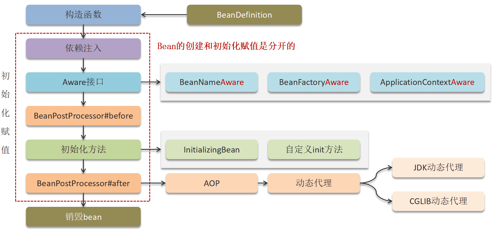
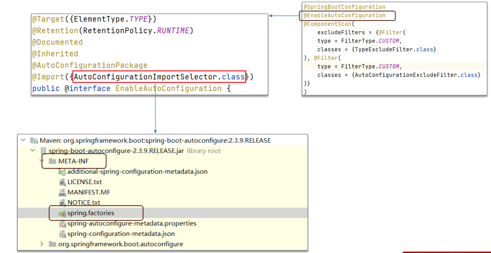
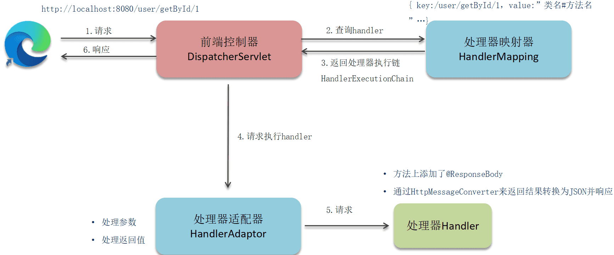

‍

‍

‍

‍

## 整体介绍

‍

‍

### 什么是 Spring 框架, 给我喵两句

Spring 是一种轻量级开发框架，旨在提高开发人员的开发效率以及系统的可维护性。Spring 官网：[https://spring.io/](https://spring.io/)。

我们一般说 Spring 框架指的都是 Spring Framework，它是很多模块的集合，使用这些模块可以很方便地协助我们进行开发。这些模块是：核心容器、数据访问/集成,、Web、AOP（面向切面编程）、工具、消息和测试模块。比如：Core Container 中的 Core 组件是Spring 所有组件的核心，Beans 组件和 Context 组件是实现IOC和依赖注入的基础，AOP组件用来实现面向切面编程。

‍

Spring 官网列出的 Spring 的 6 个特征:

* **核心技术** ：依赖注入(DI)，AOP，事件(events)，资源，i18n，验证，数据绑定，类型转换，SpEL
* **测试** ：模拟对象，TestContext框架，Spring MVC 测试，WebTestClient。
* **数据访问** ：事务，DAO支持，JDBC，ORM，编组XML。
* **Web支持** : Spring MVC和Spring WebFlux Web框架。
* **集成** ：远程处理，JMS，JCA，JMX，电子邮件，任务，调度，缓存。
* **语言** ：Kotlin，Groovy，动态语言。

‍

主要分模块

核心容器、数据访问/集成,、Web、AOP（面向切面编程）、工具、消息和测试模块

‍

‍

### spinrgboot简化了spring哪一个部分的工作量？

Spring Boot 主要简化了 Spring **应用的配置和启动部署**工作量。具体来说，它通过以下方式降低了开发者的负担：

‍

* **自动配置（Auto-Configuration）** ：无需大量手动编写 XML 或 Java 配置，Spring Boot 根据依赖和环境自动配置常用组件。
* **Starter 依赖**：通过一组预定义的 “starter” 包，简化依赖管理，开发者只需引入相应的 starter，就能获得一整套所需依赖。
* **嵌入式服务器**：内置 Tomcat、Jetty 或 Undertow，支持直接运行独立的 jar 包，无需部署到外部服务器。
* **约定优于配置**：通过合理的默认配置，减少重复配置，使开发者能够专注于业务逻辑而非样板代码

‍

‍

### Spring中注解和xml两种配置适用的场景和区别？

‍

#### 注解配置

**适用场景**：

* 适用于小型或中型项目。
* 适用于开发团队熟悉注解和 Java 配置的项目。
* 适用于需要快速开发和简化配置的项目。

**优点**：

* 配置更简洁，减少了 XML 文件的数量。
* 更加直观，配置和代码紧密结合，易于理解和维护。
* 支持类型安全，编译时可以检查配置错误。

**缺点**：

* 配置分散在代码中，可能不易于集中管理。
* 对于大型项目，可能会导致代码和配置混杂在一起，降低可读性。

‍

#### XML 配置

**适用场景**：

* 适用于大型项目或需要复杂配置的项目。
* 适用于需要集中管理配置的项目。
* 适用于开发团队对 XML 配置更为熟悉的项目。

**优点**：

* 配置集中，易于管理和查看。
* 适用于需要动态修改配置的场景（如通过外部配置文件）。
* 更加灵活，支持一些注解不支持的高级配置。

**缺点**：

* 配置文件较多，可能会显得冗长和复杂。
* 配置和代码分离，可能不直观，增加了理解和维护的难度。

‍

示例

**注解配置**：

```java
import org.springframework.context.annotation.Bean;
import org.springframework.context.annotation.Configuration;

@Configuration
public class AppConfig {

    @Bean
    public MyService myService() {
        return new MyServiceImpl();
    }
}
```

**XML 配置**：

```xml
<beans xmlns="http://www.springframework.org/schema/beans"
       xmlns:xsi="http://www.w3.org/2001/XMLSchema-instance"
       xsi:schemaLocation="http://www.springframework.org/schema/beans
           http://www.springframework.org/schema/beans/spring-beans.xsd">

    <bean id="myService" class="com.example.MyServiceImpl"/>
</beans>
```

总结来说，注解配置适用于**快速开发和简化配置**，而 XML 配置适用于需要**集中管理和复杂配置**的场景

‍

‍

‍

‍

### 用到哪些设计模式？

* **工厂设计模式** : Spring使用工厂模式通过 `BeanFactory`​、`ApplicationContext`​ 创建 bean 对象
* **代理设计模式** : Spring AOP 功能的实现
* **单例设计模式** : Spring 中的 Bean 默认都是单例
* **模板方法模式** : Spring 中 `jdbcTemplate`​、`hibernateTemplate`​ 等以 **Template** 结尾的对数据库操作的类，它们就使用到了模板模式
* **包装器设计模式** : 我们的项目需要连接多个数据库，而且不同的客户在每次访问中根据需要会去访问不同的数据库。这种模式让我们可以根据客户的需求能够动态切换不同的数据源
* **观察者模式:**  Spring **事件**驱动模型 就是观察者模式很经典的一个应用。
* **适配器模式** :Spring AOP 的增强或通知(Advice) 使用到了适配器模式、spring MVC 中也是用到了适配器模式适配 `Controller`​。
* ...

‍

### Spring模块介绍

> 目前最新的5.x版本中 Web 模块的 Portlet 组件已经被废弃掉，同时增加了用于异步响应式处理的 WebFlux 组件

‍

简化

* **Spring Core：**  基础,可以说 Spring 其他所有的功能都需要依赖于该类库。主要提供 IoC 依赖注入功能。
* **Spring AOP** ：提供了面向切面的编程实现。
* **Spring JDBC** : Java数据库连接。
* **Spring ORM** : 用于支持Hibernate等ORM工具。
* **Spring Web** : 为创建Web应用程序提供支持。
* **Spring JMS** ：Java消息服务。
* **Spring Test** : 提供了对 JUnit 和 TestNG 测试的支持。

‍

* 核心容器

  * **Spring Core**：基础模块，提供了依赖注入（IoC）功能，是其他所有模块的基础。
  * **Spring Beans**：提供了 BeanFactory，这是一个复杂的工厂模式的实现，用于管理 Spring Bean 的生命周期。
  * **Spring Context**：基于 Core 和 Beans 模块，提供了框架式的对象访问方式，类似于 JNDI 注册表。
  * **Spring Expression Language (SpEL)** ：提供了强大的表达式语言，用于在运行时查询和操作对象图。
* 面向切面

  * **Spring AOP**：提供了面向切面编程的实现，允许定义方法拦截器和切入点。
  * **Spring Aspects**：为与 AspectJ 的集成提供支持。
* 数据访问/集成

  * **Spring JDBC**：提供了简化的 JDBC 数据访问功能。
  * **Spring ORM**：提供了对 ORM 框架（如 Hibernate、JPA、MyBatis）的支持。
  * **Spring Transaction**：提供了对编程式和声明式事务管理的支持。
* Web

  * **Spring Web**：提供了创建 Web 应用程序的基础支持，包括多部分文件上传功能和初始化 Web 应用程序的 IoC 容器。
  * **Spring WebMVC**：提供了基于 MVC 设计模式的 Web 应用程序开发支持。
  * **Spring WebFlux**：提供了响应式编程支持，用于构建非阻塞的 Web 应用程序。
* 工具、消息和测试模块

  * **Spring JMS**：提供了对 Java 消息服务（JMS）的支持。
  * **Spring Test**：提供了对 JUnit 和 TestNG 测试的支持，允许在 Spring 容器中进行集成测试。

‍

### SpringBoot哪些优点？它和 Spring 有什么区别？

‍

典型回答:

Spring 为 Java 程序提供了全面的**基础架构支持**，包含了很多非常**实用的功能**，如 Spring JDBC、Spring AOP、Spring ORM、Spring Test 等，这些模块的出现，大大的缩短了应用程序的开发时间，同时提高了应用开发的效率

Spring Boot 本质上是 Spring 框架的**延伸和扩展**，它的诞生是为了简化 Spring 框架**初始搭建以及开发**的过程，使用它可以不再依赖 Spring 应用程序中的 **XML 配置**，为更快、更高效的开发 Spring 提供更加有力的支持。Spring Boot 具体的特性有:

‍

‍

#### 特性一：更快速的构建能力

Spring Boot 提供了更多的 **Starters** 用于快速构建业务框架，Starters 可以理解为启动器，它包含了一系列可以集成到应用里面的依赖包，你可以一站式集成 Spring 及其他技术，而不需要到处找依赖包

‍

‍

#### 特性二：起步依赖

Spring Boot 提供了**起步依赖**，也就是在创建 Spring Boot 时可以直接勾选依赖模块，这样在项目初始化时就会把相关依赖直接添加到项目中，大大缩短了查询并添加依赖的时间

> 注意, 依赖管理主要是Maven做的, 这里等于是DLC

‍

‍

#### 特性三：内嵌容器支持

Spring Boot 内嵌了 **Tomcat**、Jetty、Undertow 三种容器，其默认嵌入的容器是 Tomcat，这个在我们启动 Spring Boot 项目的时候，在控制台上就能看到，具体信息如下：

> o.s.b.w.embedded.tomcat.TomcatWebServer :Tomcat started on port(s): 8080 (http) with context path ''

可以看出 Spring Boot 默认使用的是 Tomcat 容器启动的。

我们可以通过修改 pom.xml 来移除内嵌的 Tomcat 更换为其他的容器

‍

‍

#### 特性四：Actuator 监控

Spring Boot 自带了 Actuator 监控功能，主要用于提供对应用程序监控，以及控制的能力，比如监控应用程序的运行状况，或者内存、线程池、Http 请求统计等，同时还提供了关闭应用程序等功能。

可以借助这个进行一些系统状态监控, 但是感觉还是需要结合其他运维组件来... 做探针可以做

‍

### 设计模式

‍

#### **Singleton**

请区分 singleton pattern 与 Spring 中的 singleton bean

* 根据单例模式的目的 *Ensure a class only has one instance, and provide a global point of access to it*
* 显然 Spring 中的 singleton bean 并非实现了单例模式，singleton bean 只能保证每个容器内，相同 id 的 bean 单实例
* 当然 Spring 中也用到了单例模式，例如

  * org.springframework.transaction.TransactionDefinition#withDefaults
  * org.springframework.aop.TruePointcut#INSTANCE
  * org.springframework.aop.interceptor.ExposeInvocationInterceptor#ADVISOR
  * org.springframework.core.annotation.AnnotationAwareOrderComparator#INSTANCE
  * org.springframework.core.OrderComparator#INSTANCE

> 当然, 泛泛说还是可以的, 比如容器本身应该是唯一的

‍

#### **Builder**

它的主要亮点有三处：

1. 较为灵活的构建产品对象
2. 在不执行最后 build 方法前，产品对象都不可用
3. 构建过程采用链式调用，看起来比较爽

‍

Spring 中体现 Builder 模式的地方：

* org.springframework.beans.factory.support.BeanDefinitionBuilder
* org.springframework.web.util.UriComponentsBuilder
* org.springframework.http.ResponseEntity.HeadersBuilder
* org.springframework.http.ResponseEntity.BodyBuilder

‍

‍

#### **Factory Method**

根据上面的定义，Spring 中的 ApplicationContext 与 BeanFactory 中的 getBean 都可以视为工厂方法，它隐藏了 bean （产品）的创建过程和具体实现

Spring 中其它工厂：

* org.springframework.beans.factory.FactoryBean
* @Bean 标注的静态方法及实例方法
* ObjectFactory 及 ObjectProvider

前两种工厂主要封装第三方的 bean 的创建过程，后两种工厂可以推迟 bean 创建，解决循环依赖及单例注入多例等问题

‍

‍

#### **Adapter**

装饰器

典型的实现有两处：

* org.springframework.web.servlet.HandlerAdapter – 因为控制器实现有各种各样，比如有

  * 大家熟悉的 @RequestMapping 标注的控制器实现
  * 传统的基于 Controller 接口（不是 @Controller注解啊）的实现
  * 较新的基于 RouterFunction 接口的实现
  * 它们的处理方法都不一样，为了统一调用，必须适配为 HandlerAdapter 接口
* org.springframework.beans.factory.support.DisposableBeanAdapter – 因为销毁方法多种多样，因此都要适配为 DisposableBean 来统一调用销毁方法

‍

‍

#### **Composite**

* org.springframework.web.method.support.HandlerMethodArgumentResolverComposite
* org.springframework.web.method.support.HandlerMethodReturnValueHandlerComposite
* org.springframework.web.servlet.handler.HandlerExceptionResolverComposite
* org.springframework.web.servlet.view.ViewResolverComposite

组合 composite 对象的作用是，将分散的调用集中起来，统一调用入口，它的特征是，与具体干活的实现实现同一个接口，当调用 composite 对象的接口方法时，其实是委托具体干活的实现来完成

‍

‍

#### **Decorator**

* org.springframework.web.util.ContentCachingRequestWrapper

装饰, 包装类

‍

‍

#### **Proxy**

装饰器模式注重的是功能增强，避免子类继承方式进行功能扩展，而代理模式更注重控制目标的访问

典型实现：

* org.springframework.aop.framework.JdkDynamicAopProxy
* org.springframework.aop.framework.ObjenesisCglibAopProxy

AOP, Cglib

‍

#### **Chain of Responsibility**

典型实现

* org.springframework.web.servlet.HandlerInterceptor

拦截器处理完了之后, 按照优先级选下一个

‍

‍

#### **Observer**

典型实现：

* org.springframework.context.ApplicationListener
* org.springframework.context.event.ApplicationEventMulticaster
* org.springframework.context.ApplicationEvent

SpringEvent

‍

#### **Strategy**

典型实现：

* org.springframework.beans.factory.support.InstantiationStrategy
* org.springframework.core.annotation.MergedAnnotations.SearchStrategy
* org.springframework.boot.autoconfigure.condition.SearchStrategy

‍

‍

#### **Template Method**

典型实现：

* 大部分以 Template 命名的类，如 JdbcTemplate，TransactionTemplate
* 很多以 Abstract 命名的类，如 AbstractApplicationContext

‍

### 常见注解有哪些

Spring

|注解|说明|
| ------------------------------------------------| --------------------------------------------------------------|
|@Component、@Controller、@Service、@Repository|使用在类上用于实例化Bean|
|@Autowired|使用在字段上用于根据类型依赖注入|
|@Qualifier|结合@Autowired一起使用用于根据名称进行依赖注入|
|@Scope|标注Bean的作用范围|
|@Configuration|指定当前类是一个Spring配置类，当创建容器时会从该类上加载注解|
|@ComponentScan|用于指定Spring在初始化容器时要扫描的包|
|@Bean|使用在方法上，标注将该方法的返回值存储到Spring容器中|
|@Import|使用@Import导入的类会被Spring加载到IOC容器中|
|@Aspect、@Before、@After、@Around、@Pointcut|用于切面编程（AOP）|

‍

MVC

|注解|说明|
| -----------------| --------------------------------------------------------------------------------------------------|
|@RequestMapping|用于映射请求路径，可以定义在类上和方法上。用于类上，则表示类中的所有的方法都是以该地址作为父路径|
|@RequestBody|注解实现接收http请求的json数据，将json转换为java对象|
|@RequestParam|指定请求参数的名称|
|@PathViriable|从请求路径下中获取请求参数(/user/{id})，传递给方法的形式参数|
|@ResponseBody|注解实现将controller方法返回对象转化为json对象响应给客户端|
|@RequestHeader|获取指定的请求头数据|
|@RestController|@Controller + @ResponseBody|

‍

Boot

|注解|
| --------------------------|
|@SpringBootConfiguration|
|@EnableAutoConfiguration|
|@ComponentScan|
|@SpringBootApplication|

‍

‍

## Bean

‍

### IoC思想

IoC（Inverse of Control:控制反转）是一种**设计思想**，就是 **将原本在程序中手动创建对象的控制权，交由Spring框架来管理。**  IoC 在其他语言中也有应用，并非 Spring 特有。 **IoC 容器是 Spring 用来实现 IoC 的载体， IoC 容器实际上就是个Map（key，value）,Map 中存放的是各种对象**

将对象之间的相互依赖关系交给 IoC 容器来管理，并由 IoC 容器完成对象的注入。这样可以很大程度上简化应用的开发，把应用从复杂的依赖关系中解放出来。 **IoC 容器就像是一个工厂一样，当我们需要创建一个对象的时候，只需要配置好配置文件/注解即可，完全不用考虑对象是如何被创建出来的。**

‍

**IOC**（Inversion of Control，翻译为“控制反转”）不是一个具体的技术，而是一种**设计思想**。与传统控制流相比，IOC 会颠倒控制流，在传统的编程中需要开发者自行创建并销毁对象，而在 IOC 中会把这些操作交给框架来处理，这样开发者就不用关注具体的实现细节了，拿来直接用就可以了，这就是控制反转。

IOC 很好的体现出了面向对象的设计法则之一——好莱坞法则：“别找我们，我们找你”。即由 IOC 容器帮对象找到相应的依赖对象并注入，而不是由对象主动去找

‍

‍

### DI思想

**DI**（Dependency Injection，翻译为“依赖注入”）表示组件间的依赖关系交由容器在运行期自动生成，也就是说，由容器动态的将某个依赖关系注入到组件之中，这样就能提升组件的重用频率。

通过依赖注入机制，只需要通过简单的配置，就可指定目标需要的资源，完成自身的业务逻辑，而不需要关心资源来自哪里、由谁实现等问题

> IOC 和 DI 其实是**同一个概念从不同角度**的描述的，由于控制反转这个概念比较含糊（可能只理解成了容器控制对象这一个层面，很难让人想到谁来维护对象关系）
>
> 所以 2004 年被开发者尊称为“教父”的 Martin Fowler（世界顶级专家，敏捷开发方法的创始人之一）又给出了一个新的名字“依赖注入”，相对 IOC 而言，“依赖注入”明确描述了“被注入对象依赖 IOC 容器配置依赖对象”

‍

‍

### bean作用域有哪些?

单例, 非单例. 特种面对 HTTP请求设计的

* singleton : 唯一 bean 实例，Spring 中的 bean 默认都是单例的。
* prototype : 每次请求都会创建一个新的 bean 实例。
* request : 每一次HTTP请求都会产生一个新的 bean，该bean仅在当前HTTP request内有效。
* session : 每一次HTTP请求都会产生一个新的 bean，该bean仅在当前 HTTP session 内有效。

‍

‍

### 单例 bean 线程安全问题

当多个线程操作同一个对象的时候，对这个对象的成员变量的写操作会存在线程安全问题

但是，一般情况下，我们常用的 `Controller`​、`Service`​、`Dao`​ 这些 Bean 是**无状态**的。无状态的 Bean **不能保存数据**，因此是线程安全的

‍

常见的有 2 种解决办法：

* 在类中定义一个 `ThreadLocal`​ 成员变量，将需要的可变成员变量保存在 `ThreadLocal`​ 中（推荐的一种方式）
* 改变 Bean 的作用域为 “prototype”：每次请求都会创建一个新的 bean 实例，自然不会存在线程安全问题. 但是问题:

  1. 性能开销：每次请求都创建一个**新的实例**会增加内存和 CPU 的开销，尤其是在**高并发**的情况下会爆炸
  2. 资源管理：于是就需要额外的**资源管理和清理**工作，每个请求都会创建新的对象实例，可能会导致内存泄漏或资源浪费
  3. 依赖注入复杂性：如果原型 Bean **依赖于其他单例** Bean，可能会导致复杂的依赖管理和生命周期管理问题

‍

‍

### @Component 和 @Bean 的区别

‍

1. 作用对象不同: `@Component`​ 注解作用于**类**，而`@Bean`​注解作用于**方法**
2. ​`@Component`​通常是通过**类路径扫描**来自动侦测以及自动装配到Spring容器中（我们可以使用 `@ComponentScan`​ 注解定义要扫描的路径从中找出标识了需要装配的类自动装配到 Spring 的 bean 容器中）

    ​`@Bean`​ 注解通常是我们在标有该注解的方法中**定义产生**这个 bean,`@Bean`​告诉了Spring这返回值是某个类的示例，当我需要用它的时候还给我。
3. ​`@Bean`​ 注解比 `Component`​ 注解的**自定义性更强**，而且很多地方我们只能通过 `@Bean`​ 注解来注册bean。比如当我们引用第三方库中的类需要装配到 `Spring`​容器时，则只能通过 `@Bean`​来实现

‍

‍

‍

​`@Bean`​注解使用

```java
@Configuration
public class AppConfig {

    @Bean
    public TransferService transferService() {
        return new TransferServiceImpl();
    }

}
```

‍

相当于下面的 xml 配置

```xml
<beans>
    <bean id="transferService" class="com.acme.TransferServiceImpl"/>
</beans>
```

‍

‍

这个例子是通过 `@Component`​ 无法实现的

```java
    @Bean
    public OneService getService(status) {
  
        case (status)  {
  
            when 1:
                    return new serviceImpl1();
            when 2:
                    return new serviceImpl2();
            when 3:
                    return new serviceImpl3();
  
        }
    }
```

‍

‍

‍

### BeanFactory与ApplicationContext有什么区别

​`BeanFactory`​和`ApplicationContext`​是Spring框架中用于管理Bean的两种容器接口

‍

1. **BeanFactory**:

    * **基本容器**：`BeanFactory`​是Spring框架中**最基本的容器**，提供了基本的依赖注入功能。
    * **延迟初始化**：`BeanFactory`​在需要时才创建Bean实例（懒加载），这可以提高启动性能。
    * **较少功能**：`BeanFactory`​只提供了基本的容器功能，不支持更高级的特性，如事件发布、国际化、AOP等。

    ```java
    BeanFactory factory = new XmlBeanFactory(new ClassPathResource("beans.xml"));
    MyBean myBean = (MyBean) factory.getBean("myBean");
    ```
2. **ApplicationContext**:

    * **高级容器**：`ApplicationContext`​是`BeanFactory`​的**子接口**，提供了更多的功能和特性。
    * **立即初始化**：`ApplicationContext`​在容器启动时就创建所有单例Bean实例 **（预加载）** ，这可以发现配置问题。
    * **丰富功能**：`ApplicationContext`​支持事件发布、国际化、AOP、注解等高级特性。
    * **多种实现**：`ApplicationContext`​有多种实现，如`ClassPathXmlApplicationContext`​、`FileSystemXmlApplicationContext`​、`AnnotationConfigApplicationContext`​等。

    ```java
    ApplicationContext context = new ClassPathXmlApplicationContext("beans.xml");
    MyBean myBean = (MyBean) context.getBean("myBean");
    ```

‍

‍

总结

* ​`BeanFactory`​适用于资源受限的环境，提供基本的依赖注入功能
* ​`ApplicationContext`​适用于大多数应用，提供丰富的功能和特性

‍

‍

‍

### bean生命周期详细

> 划分的阶段和名称并不重要，重要的是理解整个过程中做了哪些事情

‍

简单版

‍

> 首先会通过一个非常重要的类，叫做BeanDefinition获取bean的定义信息，这里面就封装了bean的所有信息，比如，类的全路径，是否是延迟加载，是否是单例等等这些信息
>
> 在创建bean的时候，第一步是调用构造函数实例化bean
>
> 第二步是bean的依赖注入，比如一些set方法注入，像平时开发用的@Autowire都是这一步完成
>
> 第三步是处理Aware接口，如果某一个bean实现了Aware接口就会重写方法执行
>
> 第四步是bean的后置处理器BeanPostProcessor，这个是前置处理器
>
> 第五步是初始化方法，比如实现了接口InitializingBean或者自定义了方法init-method标签或@PostContruct
>
> 第六步是执行了bean的后置处理器BeanPostProcessor，主要是对bean进行增强，有可能在这里产生代理对象
>
> 最后一步是销毁bean

‍

1. 通过BeanDefinition获取bean的定义信息
2. 调用构造函数实例化bean
3. bean的依赖注入
4. 处理Aware接口(BeanNameAware、BeanFactoryAware、ApplicationContextAware)
5. Bean的后置处理器BeanPostProcessor-前置
6. 初始化方法(InitializingBean、init-method)
7. Bean的后置处理器BeanPostProcessor-后置
8. 销毁bean



‍

---

详细

bean 的生命周期从调用 beanFactory 的 getBean 开始，到这个 bean 被销毁，可以总结为以下七个阶段

‍

1. 处理名称，检查缓存
2. 处理父子容器
3. 处理 dependsOn
4. 选择 scope 策略
5. 创建 bean
6. 类型转换处理
7. 销毁 bean

‍

**1. 处理名称，检查缓存**

* 这一步会处理别名，将别名解析为实际名称
* 对 FactoryBean 也会特殊处理，如果以 & 开头表示要获取 FactoryBean 本身，否则表示要获取其产品
* 这里针对单例对象会检查一级、二级、三级缓存

  * singletonFactories 三级缓存，存放单例工厂对象
  * earlySingletonObjects 二级缓存，存放单例工厂的产品对象

    * 如果发生循环依赖，产品是代理；无循环依赖，产品是原始对象
  * singletonObjects 一级缓存，存放单例成品对象

‍

**2. 处理父子容器**

* 如果当前容器根据名字找不到这个 bean，此时若父容器存在，则执行父容器的 getBean 流程
* 父子容器的 bean 名称可以重复

‍

**3. 处理 dependsOn**

* 如果当前 bean 有通过 dependsOn 指定了非显式依赖的 bean，这一步会提前创建这些 dependsOn 的 bean
* 所谓非显式依赖，就是指两个 bean 之间不存在直接依赖关系，但需要控制它们的创建先后顺序

‍

**4. 选择 scope 策略**

* 对于 singleton scope，首先到单例池去获取 bean，如果有则直接返回，没有再进入创建流程
* 对于 prototype scope，每次都会进入创建流程
* 对于自定义 scope，例如 request，首先到 request 域获取 bean，如果有则直接返回，没有再进入创建流程

‍

**5.1 创建 bean - 创建 bean 实例**

|**要点**|**总结**|
| --------------------------------------| -------------------------------------------------------------------------------------------------------------------------------------------------------|
|有自定义 TargetSource 的情况|由 AnnotationAwareAspectJAutoProxyCreator 创建代理返回|
|Supplier 方式创建 bean 实例|为 Spring 5.0 新增功能，方便编程方式创建 bean 实例|
|FactoryMethod 方式 创建 bean 实例|① 分成静态工厂与实例工厂；② 工厂方法若有参数，需要对工厂方法参数进行解析，利用 resolveDependency；③ 如果有多个工厂方法候选者，还要进一步按权重筛选|
|AutowiredAnnotationBeanPostProcessor|① 优先选择带 @Autowired 注解的构造；② 若有唯一的带参构造，也会入选|
|mbd.getPreferredConstructors|选择所有公共构造，这些构造之间按权重筛选|
|采用默认构造|如果上面的后处理器和 BeanDefiniation 都没找到构造，采用默认构造，即使是私有的|

‍

**5.2 创建 bean - 依赖注入**

|**要点**|**总结**|
| --------------------------------------| -----------------------------------------------------------------------------------------------------------------------------------------------------------------------------------------------------------------------------------------------------------------------|
|AutowiredAnnotationBeanPostProcessor|识别 @Autowired 及 @Value 标注的成员，封装为 InjectionMetadata 进行依赖注入|
|CommonAnnotationBeanPostProcessor|识别 @Resource 标注的成员，封装为 InjectionMetadata 进行依赖注入|
|resolveDependency|用来查找要装配的值，可以识别：① Optional；② ObjectFactory 及 ObjectProvider；③ @Lazy 注解；④ @Value 注解（\${ }, #{ }, 类型转换）；⑤ 集合类型（Collection，Map，数组等）；⑥ 泛型和 @Qualifier（用来区分类型歧义）；⑦ primary 及名字匹配（用来区分类型歧义）|
|AUTOWIRE\_BY\_NAME|根据成员名字找 bean 对象，修改 mbd 的 propertyValues，不会考虑简单类型的成员|
|AUTOWIRE\_BY\_TYPE|根据成员类型执行 resolveDependency 找到依赖注入的值，修改 mbd 的 propertyValues|
|applyPropertyValues|根据 mbd 的 propertyValues 进行依赖注入（即xml中 \`\<property name ref|

‍

**5.3 创建 bean - 初始化**

|**要点**|**总结**|
| -----------------------| -------------------------------------------------------------------------------------------|
|内置 Aware 接口的装配|包括 BeanNameAware，BeanFactoryAware 等|
|扩展 Aware 接口的装配|由 ApplicationContextAwareProcessor 解析，执行时机在 postProcessBeforeInitialization|
|@PostConstruct|由 CommonAnnotationBeanPostProcessor 解析，执行时机在 postProcessBeforeInitialization|
|InitializingBean|通过接口回调执行初始化|
|initMethod|根据 BeanDefinition 得到的初始化方法执行初始化，即 `<bean init-method>`​ 或 @Bean(initMethod)|
|创建 aop 代理|由 AnnotationAwareAspectJAutoProxyCreator 创建，执行时机在 postProcessAfterInitialization|

‍

**5.4 创建 bean - 注册可销毁 bean**

在这一步判断并登记可销毁 bean

* 判断依据

  * 如果实现了 DisposableBean 或 AutoCloseable 接口，则为可销毁 bean
  * 如果自定义了 destroyMethod，则为可销毁 bean
  * 如果采用 @Bean 没有指定 destroyMethod，则采用自动推断方式获取销毁方法名（close，shutdown）
  * 如果有 @PreDestroy 标注的方法
* 存储位置

  * singleton scope 的可销毁 bean 会存储于 beanFactory 的成员当中
  * 自定义 scope 的可销毁 bean 会存储于对应的域对象当中
  * prototype scope 不会存储，需要自己找到此对象销毁
* 存储时都会封装为 DisposableBeanAdapter 类型对销毁方法的调用进行适配

‍

**6. 类型转换处理**

* 如果 getBean 的 requiredType 参数与实际得到的对象类型不同，会尝试进行类型转换

‍

**7. 销毁 bean**

* 销毁时机

  * singleton bean 的销毁在 ApplicationContext.close 时，此时会找到所有 DisposableBean 的名字，逐一销毁
  * 自定义 scope bean 的销毁在作用域对象生命周期结束时
  * prototype bean 的销毁可以通过自己手动调用 AutowireCapableBeanFactory.destroyBean 方法执行销毁
* 同一 bean 中不同形式销毁方法的调用次序

  * 优先后处理器销毁，即 @PreDestroy
  * 其次 DisposableBean 接口销毁
  * 最后 destroyMethod 销毁（包括自定义名称，推断名称，AutoCloseable 接口 多选一）

‍

‍

#### spring 的 bean 的后置处理器，就是像 BeanPostProcessor 这个后置处理器你之前有了解过吗？

‍

Spring 的 `BeanPostProcessor`​ 是一个接口，允许在 Spring 容器实例化 bean 之后但在其初始化方法（如 `afterPropertiesSet`​ 或自定义的初始化方法）之前对 bean 进行自定义修改。`BeanPostProcessor`​ 提供了两个方法：

‍

1. ​`postProcessBeforeInitialization(Object bean, String beanName)`​：在 bean 的初始化方法调用之前执行。
2. ​`postProcessAfterInitialization(Object bean, String beanName)`​：在 bean 的初始化方法调用之后执行。

‍

以下是一个简单的示例，展示了如何实现一个自定义的 `BeanPostProcessor`​：

```java
import org.springframework.beans.BeansException;
import org.springframework.beans.factory.config.BeanPostProcessor;
import org.springframework.stereotype.Component;

@Component
public class CustomBeanPostProcessor implements BeanPostProcessor {

    @Override
    public Object postProcessBeforeInitialization(Object bean, String beanName) throws BeansException {
        System.out.println("Before Initialization: " + beanName);
        // 可以在这里对 bean 进行自定义修改
        return bean;
    }

    @Override
    public Object postProcessAfterInitialization(Object bean, String beanName) throws BeansException {
        System.out.println("After Initialization: " + beanName);
        // 可以在这里对 bean 进行自定义修改
        return bean;
    }
}
```

‍

‍

### bean生命周期详细

Spring Bean是Spring应用中最最重要的部分了。所以来看看Spring容器在初始化一个bean的时候会做那些事情，顺序是怎样的，在容器关闭的时候，又会做哪些事情。

‍

##### initialization 和 destroy

有时我们需要在Bean属性值set好之后和Bean销毁之前做一些事情，比如检查Bean中某个属性是否被正常的设置好值了。Spring框架提供了多种方法让我们可以在Spring Bean的生命周期中执行initialization和pre-destroy方法。

‍

**1.实现InitializingBean和DisposableBean接口**

这两个接口都只包含一个方法。通过实现InitializingBean接口的afterPropertiesSet()方法可以在Bean属性值设置好之后做一些操作，实现DisposableBean接口的destroy()方法可以在销毁Bean之前做一些操作。

例子如下：

```java
public class GiraffeService implements InitializingBean,DisposableBean {
    @Override
    public void afterPropertiesSet() throws Exception {
        System.out.println("执行InitializingBean接口的afterPropertiesSet方法");
    }
    @Override
    public void destroy() throws Exception {
        System.out.println("执行DisposableBean接口的destroy方法");
    }
}
```

这种方法比较简单，但是不建议使用。因为这样会将Bean的实现和Spring框架耦合在一起。

‍

**2.在bean的配置文件中指定init-method和destroy-method方法**

Spring允许我们创建自己的 init 方法和 destroy 方法，只要在 Bean 的配置文件中指定 init-method 和 destroy-method 的值就可以在 Bean 初始化时和销毁之前执行一些操作。

例子如下：

```java
public class GiraffeService {
    //通过<bean>的destroy-method属性指定的销毁方法
    public void destroyMethod() throws Exception {
        System.out.println("执行配置的destroy-method");
    }
    //通过<bean>的init-method属性指定的初始化方法
    public void initMethod() throws Exception {
        System.out.println("执行配置的init-method");
    }
}
```

配置文件中的配置：

```text
<bean name="giraffeService" class="com.giraffe.spring.service.GiraffeService" init-method="initMethod" destroy-method="destroyMethod">
</bean>
```

需要注意的是自定义的init-method和post-method方法可以抛异常但是不能有参数。

这种方式比较推荐，因为可以自己创建方法，无需将Bean的实现直接依赖于spring的框架。

‍

**3.使用@PostConstruct和@PreDestroy注解**

除了xml配置的方式，Spring 也支持用 `@PostConstruct`​和 `@PreDestroy`​注解来指定 `init`​ 和 `destroy`​ 方法。这两个注解均在`javax.annotation`​ 包中。为了注解可以生效，需要在配置文件中定义org.springframework.context.annotation.CommonAnnotationBeanPostProcessor或context:annotation-config

例子如下：

```java
public class GiraffeService {
    @PostConstruct
    public void initPostConstruct(){
        System.out.println("执行PostConstruct注解标注的方法");
    }
    @PreDestroy
    public void preDestroy(){
        System.out.println("执行preDestroy注解标注的方法");
    }
}
```

配置文件：

```xml
  
<bean class="org.springframework.context.annotation.CommonAnnotationBeanPostProcessor" />

```

‍

‍

##### 实现 *Aware接口 在Bean中使用Spring框架的一些对象

有些时候我们需要在 Bean 的初始化中使用 Spring 框架自身的一些对象来执行一些操作，比如获取 ServletContext 的一些参数，获取 ApplicaitionContext 中的 BeanDefinition 的名字，获取 Bean 在容器中的名字等等。为了让 Bean 可以获取到框架自身的一些对象，Spring 提供了一组名为*Aware的接口。

这些接口均继承于`org.springframework.beans.factory.Aware`​标记接口，并提供一个将由 Bean 实现的set*方法,Spring通过基于setter的依赖注入方式使相应的对象可以被Bean使用。  
网上说，这些接口是利用观察者模式实现的，类似于servlet listeners，目前还不明白，不过这也不在本文的讨论范围内。  
介绍一些重要的Aware接口：

* **ApplicationContextAware**: 获得ApplicationContext对象,可以用来获取所有Bean definition的名字。
* **BeanFactoryAware**:获得BeanFactory对象，可以用来检测Bean的作用域。
* **BeanNameAware**:获得Bean在配置文件中定义的名字。
* **ResourceLoaderAware**:获得ResourceLoader对象，可以获得classpath中某个文件。
* **ServletContextAware**:在一个MVC应用中可以获取ServletContext对象，可以读取context中的参数。
* **ServletConfigAware**： 在一个MVC应用中可以获取ServletConfig对象，可以读取config中的参数。

```java
public class GiraffeService implements   ApplicationContextAware,
        ApplicationEventPublisherAware, BeanClassLoaderAware, BeanFactoryAware,
        BeanNameAware, EnvironmentAware, ImportAware, ResourceLoaderAware{
         @Override
    public void setBeanClassLoader(ClassLoader classLoader) {
        System.out.println("执行setBeanClassLoader,ClassLoader Name = " + classLoader.getClass().getName());
    }
    @Override
    public void setBeanFactory(BeanFactory beanFactory) throws BeansException {
        System.out.println("执行setBeanFactory,setBeanFactory:: giraffe bean singleton=" +  beanFactory.isSingleton("giraffeService"));
    }
    @Override
    public void setBeanName(String s) {
        System.out.println("执行setBeanName:: Bean Name defined in context="
                + s);
    }
    @Override
    public void setApplicationContext(ApplicationContext applicationContext) throws BeansException {
        System.out.println("执行setApplicationContext:: Bean Definition Names="
                + Arrays.toString(applicationContext.getBeanDefinitionNames()));
    }
    @Override
    public void setApplicationEventPublisher(ApplicationEventPublisher applicationEventPublisher) {
        System.out.println("执行setApplicationEventPublisher");
    }
    @Override
    public void setEnvironment(Environment environment) {
        System.out.println("执行setEnvironment");
    }
    @Override
    public void setResourceLoader(ResourceLoader resourceLoader) {
        Resource resource = resourceLoader.getResource("classpath:spring-beans.xml");
        System.out.println("执行setResourceLoader:: Resource File Name="
                + resource.getFilename());
    }
    @Override
    public void setImportMetadata(AnnotationMetadata annotationMetadata) {
        System.out.println("执行setImportMetadata");
    }
}
```

‍

‍

##### BeanPostProcessor

上面的*Aware接口是针对某个实现这些接口的Bean定制初始化的过程，  
Spring同样可以针对容器中的所有Bean，或者某些Bean定制初始化过程，只需提供一个实现BeanPostProcessor接口的类即可。 该接口中包含两个方法，postProcessBeforeInitialization和postProcessAfterInitialization。 postProcessBeforeInitialization方法会在容器中的Bean初始化之前执行， postProcessAfterInitialization方法在容器中的Bean初始化之后执行。

例子如下：

```java
public class CustomerBeanPostProcessor implements BeanPostProcessor {
    @Override
    public Object postProcessBeforeInitialization(Object bean, String beanName) throws BeansException {
        System.out.println("执行BeanPostProcessor的postProcessBeforeInitialization方法,beanName=" + beanName);
        return bean;
    }
    @Override
    public Object postProcessAfterInitialization(Object bean, String beanName) throws BeansException {
        System.out.println("执行BeanPostProcessor的postProcessAfterInitialization方法,beanName=" + beanName);
        return bean;
    }
}
```

要将BeanPostProcessor的Bean像其他Bean一样定义在配置文件中

```xml
<bean class="com.giraffe.spring.service.CustomerBeanPostProcessor"/>
```

‍

‍

##### 总结

Spring Bean的生命周期

* Bean容器找到配置文件中 Spring Bean 的定义。
* Bean容器利用Java Reflection API创建一个Bean的实例。
* 如果涉及到一些属性值 利用set方法设置一些属性值。
* 如果Bean实现了BeanNameAware接口，调用setBeanName()方法，传入Bean的名字。
* 如果Bean实现了BeanClassLoaderAware接口，调用setBeanClassLoader()方法，传入ClassLoader对象的实例。
* 如果Bean实现了BeanFactoryAware接口，调用setBeanFactory()方法，传入BeanFactory对象的实例。
* 与上面的类似，如果实现了其他*Aware接口，就调用相应的方法。
* 如果有和加载这个Bean的Spring容器相关的BeanPostProcessor对象，执行postProcessBeforeInitialization()方法
* 如果Bean实现了InitializingBean接口，执行afterPropertiesSet()方法。
* 如果Bean在配置文件中的定义包含init-method属性，执行指定的方法。
* 如果有和加载这个Bean的Spring容器相关的BeanPostProcessor对象，执行postProcessAfterInitialization()方法
* 当要销毁Bean的时候，如果Bean实现了DisposableBean接口，执行destroy()方法。
* 当要销毁Bean的时候，如果Bean在配置文件中的定义包含destroy-method属性，执行指定的方法。

‍

‍

‍

‍

‍

### 单例bean是线程安全的吗？

‍

singleton : bean在每个Spring IOC容器中只有一个实例。  
prototype：一个bean的定义可以有多个实例。

‍

只给一个 Bean 只能说他不是完全线程安全的 (不是线程安全的)

Spring框架中有一个@Scope注解，默认的值就是singleton，单例的

因为一般在spring的bean的中都是注入**无状态**的对象，没有线程安全问题，如果在bean中定义了可修改的成员变量，是要考虑线程安全问题的，可以使用多例或者加锁来解决

> Spring bean并没有可变的状态(比如Service类和DAO类) 无状态，所以在某种程度上说Spring的单例bean是线程安全的
>
> **但是里面的成员变量需考虑线程安全**
>
> 除非明确说了, 不然就这样说

‍

如果你的bean有多种状态的话（比如 View Model对象），就需要自行保证线程安全。最浅显的解决办法就是将多态bean的作用由“**singleton**”变更为“**prototype**”

‍

> 当多用户同时请求一个服务时，容器会给每一个请求分配一个线程，这是多个线程会并发执行该请求对应的业务逻辑（成员方法），如果该处理逻辑中有对该单列状态的修改（体现为该单例的成员属性），则必须考虑线程同步问题
>
> Spring框架并没有对单例bean进行任何多线程的封装处理。关于单例bean的线程安全和并发问题需要开发者自行去搞定

‍

‍

### Bean单例管理实例

‍

##### 单例管理的对象

当scope=”singleton”，即默认情况下，会在启动容器时（即实例化容器时）时实例化。但我们可以指定Bean节点的lazy-init=”true”来延迟初始化bean，这时候，只有在第一次获取bean时才会初始化bean，即第一次请求该bean时才初始化

```xml
<bean id="ServiceImpl" class="cn.csdn.service.ServiceImpl" lazy-init="true"/>  
```

‍

如果想对所有的默认单例bean都应用延迟初始化，可以在根节点beans设置default-lazy-init属性为true，如下所示：

```xml
<beans default-lazy-init="true" …>
```

‍

默认情况下，Spring 在读取 xml 文件的时候，就会创建对象。在创建对象的时候先调用构造器，然后调用 init-method 属性值中所指定的方法。对象在被销毁的时候，会调用 destroy-method 属性值中所指定的方法（例如调用Container.destroy()方法的时候）

‍

‍

##### 非单例管理的对象

当`scope=”prototype”`​时，容器也会延迟初始化 bean，Spring 读取xml 文件的时候，并不会立刻创建对象，而是在第一次请求该 bean 时才初始化（如调用getBean方法时）。在第一次请求每一个 prototype 的bean 时，Spring容器都会调用其构造器创建这个对象，然后调用`init-method`​属性值中所指定的方法。对象销毁的时候，Spring 容器不会帮我们调用任何方法，因为是非单例，这个类型的对象有很多个，Spring容器一旦把这个对象交给你之后，就不再管理这个对象了。

‍

为了测试prototype bean的生命周期life.xml配置如下：

```xml
<bean id="life_prototype" class="com.bean.LifeBean" scope="prototype" init-method="init" destroy-method="destory"/>
```

‍

测试程序：

```java
public class LifeTest {
    @Test 
    public void test() {
        AbstractApplicationContext container = new ClassPathXmlApplicationContext("life.xml");
        LifeBean life1 = (LifeBean)container.getBean("life_singleton");
        System.out.println(life1);

        LifeBean life3 = (LifeBean)container.getBean("life_prototype");
        System.out.println(life3);
        container.close();
    }
}
```

‍

运行结果：

```text
LifeBean()构造函数
this is init of lifeBean
com.bean.LifeBean@573f2bb1
LifeBean()构造函数
this is init of lifeBean
com.bean.LifeBean@5ae9a829
……
this is destory of lifeBean com.bean.LifeBean@573f2bb1
```

‍

可以发现，对于作用域为 prototype 的 bean ，其`destroy`​方法并没有被调用。**如果 bean 的 scope 设为prototype时，当容器关闭时，**​**​`destroy`​**​ **方法不会被调用。对于 prototype 作用域的 bean，有一点非常重要，那就是 Spring不能对一个 prototype bean 的整个生命周期负责：容器在初始化、配置、装饰或者是装配完一个prototype实例后，将它交给客户端，随后就对该prototype实例不闻不问了。**  不管何种作用域，容器都会调用所有对象的初始化生命周期回调方法。但对prototype而言，任何配置好的析构生命周期回调方法都将不会被调用。**清除prototype作用域的对象并释放任何prototype bean所持有的昂贵资源，都是客户端代码的职责**（让Spring容器释放被prototype作用域bean占用资源的一种可行方式是，通过使用bean的后置处理器，该处理器持有要被清除的bean的引用）。谈及prototype作用域的bean时，在某些方面你可以将Spring容器的角色看作是Java new操作的替代者，任何迟于该时间点的生命周期事宜都得交由客户端来处理。

‍

**Spring 容器可以管理 singleton 作用域下 bean 的生命周期，在此作用域下，Spring 能够精确地知道bean何时被创建，何时初始化完成，以及何时被销毁。而对于 prototype 作用域的bean，Spring只负责创建，当容器创建了 bean 的实例后，bean 的实例就交给了客户端的代码管理，Spring容器将不再跟踪其生命周期，并且不会管理那些被配置成prototype作用域的bean的生命周期。**

‍

‍

‍

### Spring的@Conditional注解有什么用?

主要是"某某条件下装载这个Bean"的功能, 重写它的matches方法后可以用来设置 Bean 是否能被装载的判断逻辑

还有各种扩展, ConditionalOnClass等等

‍

‍

### Spring 中，有两个 id 相同的 bean会报错吗

XML配置的

* 同一个XML配置文件里面不行, 因为id是唯一属性, Spring启动会去验证;
* 两个不同的XML文件可以: 默认会进行 Bean 覆盖

‍

注解的

* 同一个里面只有最顶上的有用, 下面的重复名字不注册了. 不会报错
* 不同的就覆盖

‍

‍

### Spring中有哪些方式可以把Bean注入到IOC容器

* XML声明
* ComponentScan注解扫描 声明了 @Controller等的类
* Configuration注解声明配置类, @Bean注入
* @Import注解导入配置类或者普通的Bean
* 使用 FactoryBean 工厂Bean 动态构造 Bean 实例 (SC的OpenFeign动态代理实例)
* 实现 ImportBeanDefinition-Register 接口, 动态注入实例 (SB的启动注解)
* 实现 ImportSelector 接口, 动态批量注入配置类或者 Bean 对象 (SB的自动装配机制)

‍

### 项目启动时对数据作初始化应该如何实现？

‍

**使用 @PostConstruct 注解**

托管的 Bean 中定义方法并用 `@PostConstruct`​ 注解

该方法会在**依赖注入完成后、Bean 初始化结束之前**自动调用，是执行初始化逻辑的好地方

‍

```java
@Component
public class DataInitializer {

    @Autowired
    private RedisTemplate<String, Object> redisTemplate;

    @Autowired
    private HotDataService hotDataService;  // 用于从数据库读取热点数据

    @PostConstruct
    public void init() {
        // 从数据库或配置文件中加载热点数据
        List<HotData> hotDataList = hotDataService.loadHotData();
        // 存入 Redis，建议设置适当的 key 和过期时间
        redisTemplate.opsForValue().set("hotData", hotDataList);
        System.out.println("项目启动初始化数据已加载到 Redis");
    }
}
```

其他

* 若使用 Spring Boot，也可以借助 `ApplicationRunner`​ 或 `CommandLineRunner`​ 接口来实现初始化逻辑，但 `@PostConstruct`​ 更简单直观。
* 在初始化过程中注意捕获异常，避免启动过程中因初始化失败导致应用不可用。
* 同时也可以结合配置中心或定时任务对数据进行动态更新。

‍

‍

## 依赖管理/配置项目

‍

### SB依赖管理

sb如何管理版本依赖?

‍

Key

1.maven

2.springboot pom.xml 父子关系

3.spring-boot-starter

‍

答：

1. springboot底层**使用maven管理依赖**，通过控制pom.xml**父子关系来完成细节配置**，在父pom中定义具体框架和版本号以及额外的信息
2. 提供了很多场景的**spring-boot-starter** 的 pom.xml文件，设定好版本信息来标准化的引入依赖避免冲突

‍

起步依赖指的是各种starter命名的pom依赖项目: 重点是pom.xml,其中包含了框架所需要的其他依赖以及默认配置文件，不需要我们手动配置了

‍

‍

‍

### 循环依赖解决？

循环依赖是指 Bean 对象循环引用，是两个或多个 Bean 之间相互持有对方的引用，例如 CircularDependencyA → CircularDependencyB → CircularDependencyA

控制台会输出循环依赖的图标示意 (太熟悉了)

‍

Spring 框架通过使用三级缓存来解决这个问题，确保即使在循环依赖的情况下也能正确创建 Bean。

Spring 中的三级缓存其实就是三个 Map，如下：

```java
// 一级缓存
/** Cache of singleton objects: bean name to bean instance. */
private final Map<String, Object> singletonObjects = new ConcurrentHashMap<>(256);

// 二级缓存
/** Cache of early singleton objects: bean name to bean instance. */
private final Map<String, Object> earlySingletonObjects = new HashMap<>(16);

// 三级缓存
/** Cache of singleton factories: bean name to ObjectFactory. */
private final Map<String, ObjectFactory<?>> singletonFactories = new HashMap<>(16);

```

‍

简单来说，Spring 的三级缓存包括：

1. **一级缓存（singletonObjects）** ：存放==最终形态==的 Bean（已经实例化、属性填充、初始化），单例池，为“Spring 的单例属性”⽽⽣。一般情况我们获取 Bean 都是从这里获取的，但是并不是所有的 Bean 都在单例池里面，例如原型 Bean 就不在里面。
2. **二级缓存（earlySingletonObjects）** ：存放==过渡== Bean（半成品，尚未属性填充），也就是三级缓存中`ObjectFactory`​产生的对象，与三级缓存配合使用的，可以防止 AOP 的情况下，每次调用`ObjectFactory#getObject()`​都是会产生新的代理对象的。
3. **三级缓存（singletonFactories）** ：存放`ObjectFactory`​，`ObjectFactory`​的`getObject()`​方法（最终调用的是`getEarlyBeanReference()`​方法）可以生成原始 Bean 对象或者代理对象（如果 Bean 被 AOP 切面代理）。三级缓存只会对单例 Bean 生效。

‍

‍

#### 创建 Bean 流程

1. 先去 **一级缓存** **​`singletonObjects`​**​ 中获取，存在就返回；
2. 如果不存在或者对象正在创建中，于是去 **二级缓存** **​`earlySingletonObjects`​**​ 中获取；
3. 如果还没有获取到，就去 **三级缓存** **​`singletonFactories`​**​ 中获取，通过执行 `ObjectFacotry`​ 的 `getObject()`​ 就可以获取该对象，获取成功之后，从三级缓存移除，并将该对象加入到二级缓存中。

‍

Spring 在创建 Bean 的时候，如果允许循环依赖的话，Spring 就会将刚刚**实例化完成但是属性还没有初始化完**的 Bean 对象给**提前暴露**出去，这里通过 `addSingletonFactory`​ 方法，向三级缓存中添加一个 `ObjectFactory`​ 对象：

```java
// AbstractAutowireCapableBeanFactory # doCreateBean #
public abstract class AbstractAutowireCapableBeanFactory ... {
	protected Object doCreateBean(...) {
        //...

        // 支撑循环依赖：将 ()->getEarlyBeanReference 作为一个 ObjectFactory 对象的 getObject() 方法加入到三级缓存中
		addSingletonFactory(beanName, () -> getEarlyBeanReference(beanName, mbd, bean));
    }
}

```

如果一级缓存、二级缓存都取不到对象时，会去三级缓存中通过 `ObjectFactory`​ 的 `getObject`​ 方法获取对象。

```java
class A {
    // 使用了 B
    private B b;
}
class B {
    // 使用了 A
    private A a;
}
```

‍

以上面的循环依赖代码为例，整个解决循环依赖的流程如下：

* 当 Spring 创建 A 之后，发现 A 依赖了 B ，又去创建 B，B 依赖了 A ，又去创建 A；
* 在 B 创建 A 的时候，那么此时 A 就发生了循环依赖，由于 A 此时还没有初始化完成，因此在 **一二级缓存** 中肯定没有 A；
* 那么此时就去三级缓存中调用 `getObject()`​ 方法去获取 A 的 **前期暴露的对象** ，也就是调用上边加入的 `getEarlyBeanReference()`​ 方法，生成一个 A 的 **前期暴露对象**；
* 然后就将这个 `ObjectFactory`​ 从三级缓存中移除，并且将前期暴露对象放入到二级缓存中，那么 B 就将这个前期暴露对象注入到依赖，来支持循环依赖。

‍

‍

#### **只用两级缓存够吗？**

在没有 AOP 的情况下，确实可以只使用一级和三级缓存来解决循环依赖问题。但是，当涉及到 AOP 时，二级缓存就显得非常重要了，因为它确保了即使在 Bean 的创建过程中有多次对早期引用的请求，也始终只返回同一个代理对象，从而避免了同一个 Bean 有**多个代理对象**的问题。

‍

‍

#### **总结**

**总结一下 Spring 如何解决三级缓存**：

‍

在三级缓存这一块，主要记一下 Spring 是如何支持循环依赖的即可

如果发生循环依赖就去 **三级缓存** **​`singletonFactories`​**​ 中拿到三级缓存中存储的 `ObjectFactory`​ 并调用它的 `getObject()`​ 方法来获取这个循环依赖对象的前期暴露对象（虽然还没初始化完成，但是可以拿到该对象在堆中的存储地址了），并且将这个前期暴露对象放到二级缓存中，这样在循环依赖时，就不会重复初始化了！

‍

不过，这种机制也有一些缺点

比如增加了内存开销（需要维护三级缓存，也就是三个 Map），降低了性能（需要进行多次检查和转换）

还有少部分情况是不支持循环依赖的，比如非单例的 bean 和`@Async`​注解的 bean 无法支持循环依赖

‍

‍

#### @Lazy 能解决循环依赖吗？

​`@Lazy`​ 用来标识类是否需要懒加载/延迟加载，可以作用在类上、方法上、构造器上、方法参数上、成员变量中

> 结合我项目情境, 确实可以用这个解决; 并且懒加载的情况也体验过

可以使用 `@Lazy`​ 解决一部分循环依赖的问题。

‍

‍

配置文件配置全局懒加载：

```properties
#默认false
spring.main.lazy-initialization=true
```

lazy-initialization: true # 开启懒加可以加快速度(启动)

‍

编码的方式设置全局懒加载：

```java
SpringApplication springApplication=new SpringApplication(Start.class);
springApplication.setLazyInitialization(false);
springApplication.run(args);
```

如非必要，**尽量不要用全局懒加载**。全局懒加载会让 Bean **第一次使用的时候加载会变慢**，并且它会延迟应用程序问题的发现（当 Bean 被初始化时，问题才会出现）

如果一个 Bean 没有被标记为懒加载，那么它会在 Spring IoC 容器**启动的过程中**被创建和初始化。

如果一个 Bean 被标记为懒加载，那么它不会在 Spring IoC 容器启动时立即实例化，而是在第一次被请求时才创建。这可以帮助减少应用启动时的初始化时间，也可以用来解决循环依赖问题。

> 最关键的是, 如果懒加载, 可能出现性能问题, 还要去热身. 因此我的项目里面都取消了懒加载, 强制手动处理循环依赖问题 (设计好)

‍

‍

### 循环引用介绍 - 流程模拟

‍

> 循环依赖：循环依赖其实就是循环引用,也就是两个或两个以上的bean互相持有对方,最终形成闭环。比如A依赖于B,B依赖于A
>
> 循环依赖在spring中是允许存在，spring框架依据三级缓存已经解决了大部分的循环依赖
>
> ①一级缓存：单例池，缓存已经经历了完整的生命周期，已经初始化完成的bean对象
>
> ②二级缓存：缓存早期的bean对象（生命周期还没走完）
>
> ③三级缓存：缓存的是ObjectFactory，表示对象工厂，用来创建某个对象的
>
> ---
>
> 那具体解决流程清楚吗？
>
> **候选人**：
>
> 第一，先实例A对象，同时会创建ObjectFactory对象存入三级缓存singletonFactories
>
> 第二，A在初始化的时候需要B对象，这个走B的创建的逻辑
>
> 第三，B实例化完成，也会创建ObjectFactory对象存入三级缓存singletonFactories
>
> 第四，B需要注入A，通过三级缓存中获取ObjectFactory来生成一个A的对象同时存入二级缓存，这个是有两种情况，一个是可能是A的普通对象，另外一个是A的代理对象，都可以让ObjectFactory来生产对应的对象，这也是三级缓存的关键
>
> 第五，B通过从通过二级缓存earlySingletonObjects 获得到A的对象后可以正常注入，B创建成功，存入一级缓存singletonObjects
>
> 第六，回到A对象初始化，因为B对象已经创建完成，则可以直接注入B，A创建成功存入一次缓存singletonObjects
>
> 第七，二级缓存中的临时对象A清除
>
> ---
>
> **面试官**：构造方法出现了循环依赖怎么解决？
>
> **候选人**：
>
> 由于bean的生命周期中构造函数是第一个执行的，spring框架并不能解决构造函数的的依赖注入，可以使用@Lazy懒加载，什么时候需要对象再进行bean对象的创建

‍

‍

#### 循环依赖

循环依赖其实就是循环引用,也就是两个或两个以上的bean互相持有对方,最终形成闭环。比如A依赖于B,B依赖于A

循环依赖在spring中是允许存在，spring框架依据三级缓存已经解决了大部分的循环依赖

一级缓存：单例池，缓存已经经历了完整的生命周期，已经初始化完成的bean对象

二级缓存：缓存早期的bean对象（生命周期还没走完）

三级缓存：缓存的是ObjectFactory，表示对象工厂，用来创建某个对象的

‍

如果要想打破循环依赖, 就需要一个中间人的参与, 这个中间人就是二级缓存。而需要用代理对象就需要做三层


‍

#### 构造方法出现了循环依赖怎么解决？

A依赖于B，B依赖于A，注入的方式是构造函数

‍

@Lazy延迟实例化

原因：由于bean的生命周期中构造函数是第一个执行的，spring框架并不能解决构造函数的的依赖注入

解决方案：使用@Lazy进行懒加载，什么时候需要对象再进行bean对象的创建

‍

‍

‍

‍

‍

### @AutoWire和@Resource区别？

‍

* ​`@Autowired`​ 是 Spring 特有的注解，默认按类型注入，适合 Spring 环境。
* ​`@Resource`​ 是 Java EE 标准注解，默认按名称注入，适合需要与其他 Java EE 组件兼容的场景。

‍

​`@Autowired`​

* **来源**：Spring 框架提供的注解。
* **注入方式**：默认按类型注入。
* **用法**：可以用于字段、构造器和方法。
* **配置**：可以与 `@Qualifier`​ 一起使用来按名称注入。

‍

​`@Resource`​

* **来源**：Java EE 提供的注解（在 Spring 中也可用）。
* **注入方式**：默认按名称注入，如果找不到匹配的名称，则按类型注入。
* **用法**：可以用于字段和方法。
* **配置**：可以通过 `name`​ 属性指定要注入的 bean 名称。

‍

‍

### 自动配置含义 / 原理

‍

关键点：

1. 要看springboot的源码
2. @SpringBootApplication 中包含的 @EnableAutoConfiguration，@SpringBootConfiguration，@ComponentScan 注解
3. @EnableAutoConfiguration 开启自动配置功能 内部还包含 @AutoConfigurationPackage、@Import

    1. @AutoConfigurationPackage 中 @Import(AutoConfigurationPackages.Registrar.class) 引入了 Registrar.class 完成批量注册，默认扫描主启动类的包@Bean或者@Compont等注解
    2. @Import(AutoConfigurationImportSelector.class)
4. @ComponentScan 扫描被 @Compent(@Service@Controller)注解的bean 加载到容器中
5. @SpringBootConfiguration 表示这是一个SpringBoot的配置类

‍

答：

1. 所加载使用的jar包 如果是比较常见的，spring都提供了默认配置，也就是不像以前一样需要把框架的每一个属性都要配置一遍，主要目的是简化开发
2. springboot 通过在启动类上添加注解  **@SpringBootApplication** 完成自动配置
3. 内部完成了读取每个jar包下的`META-INF/spring.factories`​和spring-boot-autoconfigure-2.6.7.jar中的默认配置

‍

---

‍

> 在Spring Boot项目中的引导类上有一个注解@SpringBootApplication，这个注解是对三个注解进行了封装，分别是：
>
> * @SpringBootConfiguration
> * @EnableAutoConfiguration
> * @ComponentScan
>
> 其中`@EnableAutoConfiguration`​是实现自动化配置的核心注解。
>
> 该注解通过`@Import`​注解导入对应的配置选择器。关键的是内部就是读取了该项目和该项目引用的Jar包的的classpath路径下**META-INF/spring.**​**==factories==**文件中的所配置的类的全类名。
>
> 在这些配置类中所定义的Bean会根据条件注解所**指定的条件来决定**是否需要将其导入到Spring容器中。
>
> 一般条件判断会有像`@ConditionalOnClass`​这样的注解，判断是否有对应的class文件，如果有则加载该类，把这个配置类的所有的Bean放入spring容器中使用。

‍

@SpringApplication这个封装了三核心注解

* @SpringBootConfiguration：该注解与 @Configuration 注解作用相同，用来声明当前也是一个配置类。
* @ComponentScan：组件扫描，默认扫描当前引导类所在包及其子包。
* @EnableAutoConfiguration：SpringBoot实现自动化配置的核心注解。

‍

​

‍

‍

‍

‍

## AOP

‍

### 概念

AOP(Aspect-Oriented Programming:面向切面编程) 能够将那些与业务无关，**却为业务模块所**​**==共同调用==**​**的逻辑或责任（例如事务处理、日志管理、权限控制等）封装起来**，便于**减少系统的重复代码**，**降低模块间的耦合度**，并**有利于未来的可拓展性和可维护性**。

‍

‍

面向切面的编程，是一种编程技术，是OOP（面向对象编程）的补充和完善。OOP的执行是一种从上往下的流程，并没有从左到右的关系。因此在OOP编程中，会有大量的重复代码。而AOP则是将这些与业务无关的重复代码抽取出来，然后再嵌入到业务代码当中。常见的应用有：权限管理、日志、事务管理等。

‍

‍

### AOC和AOP概念

> 自己的项目里有

AOP(Aspect-oriented Programming) 是一种编程范式，将程序的横切关注点(如日志、安全等)从业务逻辑中分离出来，允许开发者定义切面(Aspect)，并在指定的连接点(Join Point)上应用这些切面。

‍

AOC(Aspect-Oriented Component) 是JavaEE中的一种技术，强调在组件级别实现面向方面编程，通常与组件化框架结合使用。(EJB总线) 更适合JavaEE环境(类似拦截器). 操作就是在功能的前后阶段进行赋能.

‍

‍

‍

#### 实现方式

实现AOP的技术，主要分为两大类：

一是采用**动态代理**技术，利用截取消息的方式，对该消息进行装饰，以取代原有对象行为的执行

二是采用**静态织入**的方式，引入特定的语法创建“方面”，从而使得编译器可以在编译期间织入有关“方面”的代码

‍

**Spring AOP就是基于**​**==动态代理==**​**的 (代理模式)** ，如果要代理的对象，实现了某个接口，那么Spring AOP会使用 **JDK Proxy** 去创建代理对象，而对于没有实现接口的对象，就无法使用 JDK Proxy 去进行代理了，这时候Spring AOP会使用 **Cglib** 生成一个被代理对象的**子类**来作为代理

当然你也可以使用 AspectJ, Spring AOP 已经集成了AspectJ , 算的上是 Java 生态系统中最完整的 AOP 框架了

‍

‍

‍

### 核心概念

1. **切面（Aspect）** ：模块化的横切关注点。一个切面可以包含多个通知。
2. **连接点（Join Point）** ：程序执行过程中可以插入切面的点，例如方法调用或异常抛出。
3. **通知（Advice）** ：在特定的连接点执行的代码。通知有多种类型，包括前置通知、后置通知、环绕通知等。
4. **切入点（Pointcut）** ：定义了在哪些连接点上应用通知的表达式。
5. **织入（Weaving）** ：将切面应用到目标对象的过程。织入可以在编译时、类加载时或运行时进行。

‍

‍

### AOP的注解

‍

1. ​`@Aspect`​：用于定义一个切面类。
2. ​`@Pointcut`​：用于定义一个切入点表达式。
3. ​`@Before`​：用于在目标方法执行之前执行通知。
4. ​`@After`​：用于在目标方法执行之后执行通知。
5. ​`@AfterReturning`​：用于在目标方法成功返回结果之后执行通知。
6. ​`@AfterThrowing`​：用于在目标方法抛出异常后执行通知。
7. ​`@Around`​：用于在目标方法执行前后执行通知。

‍

‍

‍

‍

### AOP通知顺序

‍

正常

1. @Around环绕A
2. @Before前置
3. 业务
4. @AfterReturning返回
5. @After后置
6. @Around环绕B

‍

异常

1. @Around环绕A
2. @Before前置
3. 业务
4. @AfterThrowing异常
5. @After后置
6. 没了, 这个会丢掉

由于异常情况, 环绕会丢数据, 得取舍.

‍

‍

‍

### Spring AOP 和 AspectJ AOP 有什么区别？

* **Spring AOP 属于运行时增强，而 AspectJ 是编译时增强**
* Spring AOP 基于代理 (Proxying)，而 AspectJ 基于字节码操作(Bytecode Manipulation)
* Spring AOP 已经集成了 AspectJ
* AspectJ 应该算的上是 Java 生态系统中**最完整的 AOP 框架**了
* AspectJ 相比于 Spring AOP 功能更加强大，但是 Spring AOP 相对来说更简单，

如果我们的切面比较少，那么两者性能差异不大。但是，当切面太多的话，最好选择 AspectJ ，它比Spring AOP **快很多**

‍

‍

### Spring AOP的使用情景?简述其实现原理

aop面向切面编程使用非常广泛，几乎适用于一切需要统一化处理的场景

1. ‍
2. 统一异常处理
3. 访问限制（权限，限流等）
4. 事务处理
5. 缓存管理等

‍

通过代理的方式（jdk或cglib）为程序统一添加功能，解决公共问题

‍

‍

### 场景？

AOP（面向切面编程）除了用于日志记录，还可以用于以下场景：

1. **事务管理**：在方法执行前后自动管理事务的开始和提交/回滚。
2. **安全性检查**：在方法执行前进行权限验证，确保用户有权限执行该操作。
3. **性能监控**：在方法执行前后记录方法的执行时间，进行性能分析。
4. **日志处理**: 统一拉日志
5. **异常处理**：统一处理方法执行过程中抛出的异常，进行日志记录或错误通知。
6. **缓存管理**：在方法执行前检查缓存，避免重复计算；在方法执行后更新缓存。
7. **资源管理**：在方法执行前后管理资源的分配和释放，如数据库连接、文件句柄等。
8. **审计跟踪**：记录方法调用的详细信息，如调用者、参数、返回值等，用于审计和跟踪。
9. **权限管理:**  例如RBAC等等
10. **限流处理:**  限流

这些场景都可以通过AOP来实现，从而减少代码的重复，提高代码的可维护性和可读性。

‍

‍

### spring管理一个bean，有两个方法，都有切面，在方法a中调用b会触发aop逻辑吗

在 Spring 中，如果在同一个类中一个方法调用另一个方法，默认情况下不会触发 AOP 逻辑。这是因为 Spring AOP 是基于代理的，只有通过代理对象调用方法时，才会触发 AOP 逻辑。

‍

要解决这个问题，可以通过以下几种方式：

1. **使用**  **​`@Autowired`​**​ **注入自身**：通过 Spring 容器注入自身的代理对象，然后通过代理对象调用方法。 (一般这个)

```java
@Service
public class MyService {

    @Autowired
    private MyService self;

    public void methodA() {
        // 业务逻辑
        self.methodB(); // 通过代理对象调用方法B
    }

    public void methodB() {
        // 业务逻辑
    }
}
```

‍

2. **使用** **​`AopContext`​**​ **获取当前代理对象**：通过 `AopContext.currentProxy()`​ 获取当前代理对象，然后通过代理对象调用方法。

```java
@Service
public class MyService {

    public void methodA() {
        // 业务逻辑
        ((MyService) AopContext.currentProxy()).methodB(); // 通过代理对象调用方法B
    }

    public void methodB() {
        // 业务逻辑
    }
}
```

这两种方式都可以确保在方法 `a`​ 中调用方法 `b`​ 时，触发 AOP 逻辑。

‍

‍

‍

### Final方法可以用作 AOP 的目标吗

在传统基于代理（Proxy-based）的 AOP 框架中（如 Spring AOP 使用 JDK 动态代理或 CGLIB 代理），最终方法（final 方法）通常不能作为 AOP 的目标

‍

#### 1. 代理机制的原理

**基于代理的 AOP 实现**：

* **JDK 动态代理**：要求目标对象实现接口，代理对象会在运行时生成目标对象接口的实现类，通过拦截接口方法调用来织入切面逻辑。
* **CGLIB 代理**：通过创建目标类的子类，并重写需要拦截的方法来实现横切逻辑。

‍

**Final 方法带来的限制**：

* **无法重写**：`final`​ 关键字的存在正是为了防止子类重写该方法。当方法被标记为 final 时，CGLIB 无法重写它以注入拦截逻辑。这就意味着，即使在代理模式下，也无法织入该方法的额外逻辑。

‍

#### 2. JVM 指令与方法调用

在代理模式中，织入的 AOP 切面通常依赖于方法重写。JVM 在调用时使用的是虚方法调用机制（virtual dispatch），而 final 方法由于不能被覆盖，其调用路径在编译时就已确定，不允许通过代理进行方法的拦截或劫持。

如果一个 final 方法存在于一个类中，那么无论外部如何构建代理，都无法劫持对这个方法的调用，因为该方法在类加载后已被确定为 Final，不允许被覆盖或替换。

‍

#### 3. AspectJ 及其织入方式

**AspectJ 编织（Weaving）** 提供了另一种 AOP 实现方式：

* **编译时织入或加载时织入**：AspectJ 能够直接修改字节码，将切面逻辑织入到目标方法中，而不依赖于生成代理或覆写方法的方式。
* **对 final 方法的处理**：由于 AXpectJ 是在字节码层面进行修改，即便方法被标记为 `final`​，它仍然可以在方法执行前后或环绕方法中加入切面逻辑。也就是说，AspectJ 能够“劫持” final 方法，实现 AOP 的功能。

因此，如果业务需求中必须对 final 方法进行横切逻辑的注入，可以考虑使用 AspectJ，而不是依赖于 Spring AOP 的基于代理的实现。

‍

‍

#### 4. 总结

* **代理模式（如 Spring AOP 使用的动态代理或 CGLIB）** ：由于依赖方法覆写，final 方法无法被覆盖，从而无法成为 AOP 的目标。
* **JVM 动态调用机制**：final 方法在编译和类加载时已被固定，无法进行动态拦截。
* **AspectJ 织入**：允许在编译阶段或加载时直接修改字节码，可以对 final 方法进行横切逻辑的插入。

‍

#### **实际开发中的建议**

* **避免对核心业务逻辑中的 final 方法进行 AOP 劫持**：如果你的设计要求某个方法为 final，通常意味着设计上不允许其行为被修改。如果确实需要切面功能，考虑去除 final 限定符，或使用 AspectJ 的字节码织入方案。
* **选择合适的 AOP 技术**：如果你使用的是 Spring AOP，为了能正确应用 AOP，尽量不要将目标方法定义为 final；而如果项目中已经存在大量 final 方法，又确实需要增强它们的行为，则可以考虑引入 AspectJ。

‍

‍

‍

## 过滤器/拦截器

‍

‍

### 过滤器拦截器区别

‍

|属性|拦截器Interceptor|过滤器Filter|
| --------------| -------------------------------------------------------------------------| ----------------------------------------------|
|原理|基于java的反射机制|基于函数回调|
|创建|(在context.xml中配置)由Spring容器初始化|(在web.xml中配置filter基本属性)由web容器创建|
|servlet 容器|拦截器不直接依赖于servlet容器|过滤器依赖于servlet容器|
|作用对象|拦截器只能对action请求起作用|过滤器则可以对几乎所有的请求起作用|
|访问范围|拦截器可以访问action上下文、值栈里的对象，可以获取IOC容器中的各个bean。|不能|
|使用场景|即可用于Web，也可以用于其他Application|基于Servlet规范，只能用于Web|
|使用选择|可以深入到方法执行前后，使用场景更广|只能在Servlet前后起作用|
||在Action的生命周期中，拦截器可以多次调用|而过滤器只能在容器初始化时被调用一次。|

‍

‍

‍

## 事务

‍

‍

### 管理事务的方式有几种？/ 事务是如何实现的

1. 编程式事务，在代码中硬编码。(不推荐使用)
2. 声明式事务，在配置文件中配置（推荐使用）

‍

Spring支持编程式事务管理和声明式事务管理两种方式

* 编程式事务控制：需使用TransactionTemplate来进行实现，对业务代码有侵入性，项目中很少使用
* 声明式事务管理：声明式事务管理建立在AOP之上的。其本质是通过AOP功能，对方法前后进行拦截，将事务处理的功能编织到拦截的方法中，也就是在目标方法开始之前加入一个事务，在执行完目标方法之后根据执行情况提交或者回滚事务。

  **声明式事务又分为两种：**

  1. 基于XML的声明式事务
  2. 基于注解的声明式事务

‍

‍

‍

#### 1).编程式事务管理

通过 `TransactionTemplate`​或者`TransactionManager`​手动管理事务，实际应用中很少使用，但是对于你理解 Spring 事务管理原理有帮助。

使用`TransactionTemplate`​ 进行编程式事务管理的示例代码如下：

```java
@Autowired
private TransactionTemplate transactionTemplate;
public void testTransaction() {

        transactionTemplate.execute(new TransactionCallbackWithoutResult() {
            @Override
            protected void doInTransactionWithoutResult(TransactionStatus transactionStatus) {

                try {

                    // ....  业务代码
                } catch (Exception e){
                    //回滚
                    transactionStatus.setRollbackOnly();
                }

            }
        });
}
```

使用 `TransactionManager`​ 进行编程式事务管理的示例代码如下：

```java
@Autowired
private PlatformTransactionManager transactionManager;

public void testTransaction() {

  TransactionStatus status = transactionManager.getTransaction(new DefaultTransactionDefinition());
          try {
               // ....  业务代码
              transactionManager.commit(status);
          } catch (Exception e) {
              transactionManager.rollback(status);
          }
}
```

‍

‍

‍

#### 2)声明式事务管理

推荐使用（代码侵入性最小），实际是通过 AOP 实现（基于`@Transactional`​ 的全注解方式使用最多）。

使用 `@Transactional`​注解进行事务管理的示例代码如下：

```java
@Transactional(propagation=propagation.PROPAGATION_REQUIRED)
public void aMethod {
  //do something
  B b = new B();
  C c = new C();
  b.bMethod();
  c.cMethod();
}
```

‍

‍

### @Transactional回滚场景

在类上使用了@Transactional注解，默认开启了全局读写事务(这个类中有抛异常了全部进行回滚)

如果需要针对性回滚, 需要更高的细粒度地在方法上加注解

‍

‍

‍

### 事务隔离级别哪几种?

‍

**TransactionDefinition 接口中定义了五个表示隔离级别的常量：**

五个常量, 实际上对应四种隔离级别.

‍

* **TransactionDefinition.**​**==ISOLATION_DEFAULT==**​ **:**  使用==后端数据库默认的隔离级别==  Mysql 默认采用的 REPEATABLE_READ 隔离级别 Oracle 默认采用的 READ_COMMITTED 隔离级别
* **TransactionDefinition.**​**==ISOLATION_READ_UNCOMMITTED==**​ **:**  最低的隔离级别，允许读取尚未提交的数据变更，**可能会导致脏读、幻读或不可重复读**
* **TransactionDefinition.**​**==ISOLATION_READ_COMMITTED==**​ **:**  允许读取并发事务已经提交的数据，**可以阻止脏读，但是幻读或不可重复读仍有可能发生**
* **TransactionDefinition.**​**==ISOLATION_REPEATABLE_READ==**​ **:**  对同一字段的多次读取结果都是一致的，除非数据是被本身事务自己所修改，**可以阻止脏读和不可重复读，但幻读仍有可能发生**
* **TransactionDefinition.**​**==ISOLATION_SERIALIZABLE==**​ **:**  最高的隔离级别，完全服从ACID的隔离级别。所有的事务依次逐个执行，这样事务之间就完全不可能产生干扰，也就是说，**该级别可以防止脏读、不可重复读以及幻读**。但是这将严重影响程序的性能。通常情况下也不会用到该级别

‍

‍

### 事务传播行为

默认: 支持当前事务, 有则一起, 没有就创

‍

**支持当前事务的情况：**

(**TransactionDefinition.XXX)**

* PROPAGATION_==REQUIRED==： 如果当前存在事务，则加入该事务；如果当前没有事务，则创建一个新的事务。
* PROPAGATION_==SUPPORTS==： 如果当前存在事务，则加入该事务；如果当前没有事务，则以非事务的方式继续运行。
* PROPAGATION_==MANDATORY==： 如果当前存在事务，则加入该事务；如果当前没有事务，则抛出异常。（mandatory：强制性）
* PROPAGATION_==NESTED==： (其他情况) 如果当前存在事务，则创建一个事务作为当前事务的**嵌套事务**来运行；如果当前没有事务，则该取值等价于默认

‍

**不支持当前事务的情况：**

* PROPAGATION_==REQUIRES_NEW==： 创建一个新的事务，如果当前存在事务，则把当前事务挂起。
* PROPAGATION_==NOT_SUPPORTED==： 以非事务方式运行，如果当前存在事务，则把当前事务挂起。
* PROPAGATION_==NEVER==： 以非事务方式运行，如果当前存在事务，则抛出异常。

‍

‍

### 非运行时异常时使用 @Transactional(rollbackFor = Exception.class) 注解

在`@Transactional`​注解中加上`rollbackFor=Exception.class`​

可以让事务在遇到非运行时异常时也回滚

‍

‍

### 事务失效场景 * 8

‍

#### **1. 抛出检查异常导致事务不能正确回滚**

```java
@Service
public class Service1 {

    @Autowired
    private AccountMapper accountMapper;

    @Transactional
    public void transfer(int from, int to, int amount) throws FileNotFoundException {
        int fromBalance = accountMapper.findBalanceBy(from);
        if (fromBalance - amount >= 0) {
            accountMapper.update(from, -1 * amount);
            new FileInputStream("aaa");
            accountMapper.update(to, amount);
        }
    }
}
```

* 原因：Spring 默认只会回滚非检查异常
* 解法：配置 rollbackFor 属性

  * ​`@Transactional(rollbackFor = Exception.class)`​

‍

‍

#### **2. 业务方法内自己 try-catch 异常导致事务不能正确回滚**

```java
@Service
public class Service2 {

    @Autowired
    private AccountMapper accountMapper;

    @Transactional(rollbackFor = Exception.class)
    public void transfer(int from, int to, int amount)  {
        try {
            int fromBalance = accountMapper.findBalanceBy(from);
            if (fromBalance - amount >= 0) {
                accountMapper.update(from, -1 * amount);
                new FileInputStream("aaa");
                accountMapper.update(to, amount);
            }
        } catch (FileNotFoundException e) {
            e.printStackTrace();
        }
    }
}
```

* 原因：事务通知只有捉到了目标抛出的异常，才能进行后续的回滚处理，如果目标自己处理掉异常，事务通知无法知悉
* 解法1：异常原样抛出

  * 在 catch 块添加 `throw new RuntimeException(e);`​
* 解法2：手动设置 TransactionStatus.setRollbackOnly()

  * 在 catch 块添加 `TransactionInterceptor.currentTransactionStatus().setRollbackOnly();`​

‍

‍

#### **3. aop 切面顺序导致导致事务不能正确回滚**

```java
@Service
public class Service3 {

    @Autowired
    private AccountMapper accountMapper;

    @Transactional(rollbackFor = Exception.class)
    public void transfer(int from, int to, int amount) throws FileNotFoundException {
        int fromBalance = accountMapper.findBalanceBy(from);
        if (fromBalance - amount >= 0) {
            accountMapper.update(from, -1 * amount);
            new FileInputStream("aaa");
            accountMapper.update(to, amount);
        }
    }
}
```

‍

```java
@Aspect
public class MyAspect {
    @Around("execution(* transfer(..))")
    public Object around(ProceedingJoinPoint pjp) throws Throwable {
        LoggerUtils.get().debug("log:{}", pjp.getTarget());
        try {
            return pjp.proceed();
        } catch (Throwable e) {
            e.printStackTrace();
            return null;
        }
    }
}
```

* 原因：**事务切面优先级最低**，但如果自定义的切面优先级和他一样，则还是自定义切面在内层，这时若自定义切面没有正确抛出异常…
* 解法1、2：同情况2 中的解法:1、2
* 解法3：调整切面顺序，在 MyAspect 上添加 `@Order(Ordered.LOWEST_PRECEDENCE - 1)`​ （不推荐）

‍

‍

#### **4. 非 public 方法导致的事务失效**

```java
@Service
public class Service4 {

    @Autowired
    private AccountMapper accountMapper;

    @Transactional
    void transfer(int from, int to, int amount) throws FileNotFoundException {
        int fromBalance = accountMapper.findBalanceBy(from);
        if (fromBalance - amount >= 0) {
            accountMapper.update(from, -1 * amount);
            accountMapper.update(to, amount);
        }
    }
}
```

* 原因：Spring 为方法创建代理、添加事务通知、前提条件都是该方法是 public 的
* 解法1：改为 public 方法
* 解法2：添加 bean 配置如下（不推荐）

```java
@Bean
public TransactionAttributeSource transactionAttributeSource() {
    return new AnnotationTransactionAttributeSource(false);
}
```

‍

‍

#### **5. 父子容器导致的事务失效**

```java
package day04.tx.app.service;

// ...

@Service
public class Service5 {

    @Autowired
    private AccountMapper accountMapper;

    @Transactional(rollbackFor = Exception.class)
    public void transfer(int from, int to, int amount) throws FileNotFoundException {
        int fromBalance = accountMapper.findBalanceBy(from);
        if (fromBalance - amount >= 0) {
            accountMapper.update(from, -1 * amount);
            accountMapper.update(to, amount);
        }
    }
}
```

‍

控制器类

```java
package day04.tx.app.controller;

// ...

@Controller
public class AccountController {

    @Autowired
    public Service5 service;

    public void transfer(int from, int to, int amount) throws FileNotFoundException {
        service.transfer(from, to, amount);
    }
}
```

App 配置类

```java
@Configuration
@ComponentScan("day04.tx.app.service")
@EnableTransactionManagement
// ...
public class AppConfig {
    // ... 有事务相关配置
}
```

Web 配置类

```java
@Configuration
@ComponentScan("day04.tx.app")
// ...
public class WebConfig {
    // ... 无事务配置
}
```

现在配置了父子容器，WebConfig 对应子容器，AppConfig 对应父容器，发现事务依然失效

* 原因：子容器扫描范围过大，把未加事务配置的 service 扫描进来
* 解法1：各扫描各的，不要图简便
* 解法2：不要用父子容器，所有 bean 放在同一容器

‍

‍

#### **6. 调用本类方法导致传播行为失效**

```java
@Service
public class Service6 {

    @Transactional(propagation = Propagation.REQUIRED, rollbackFor = Exception.class)
    public void foo() throws FileNotFoundException {
        LoggerUtils.get().debug("foo");
        bar();
    }

    @Transactional(propagation = Propagation.REQUIRES_NEW, rollbackFor = Exception.class)
    public void bar() throws FileNotFoundException {
        LoggerUtils.get().debug("bar");
    }
}
```

* 原因：本类方法调用不经过代理，因此无法增强

‍

‍

* 解法1：依赖注入自己（代理）来调用
* 解法2：通过 AopContext 拿到代理对象，来调用
* 解法3：通过 CTW，LTW 实现功能增强

‍

解法1

```java
@Service
public class Service6 {

	@Autowired
	private Service6 proxy; // 本质上是一种循环依赖

    @Transactional(propagation = Propagation.REQUIRED, rollbackFor = Exception.class)
    public void foo() throws FileNotFoundException {
        LoggerUtils.get().debug("foo");
		System.out.println(proxy.getClass());
		proxy.bar();
    }

    @Transactional(propagation = Propagation.REQUIRES_NEW, rollbackFor = Exception.class)
    public void bar() throws FileNotFoundException {
        LoggerUtils.get().debug("bar");
    }
}
```

‍

解法2，还需要在 AppConfig 上添加 `@EnableAspectJAutoProxy(exposeProxy = true)`​

```java
@Service
public class Service6 {
  
    @Transactional(propagation = Propagation.REQUIRED, rollbackFor = Exception.class)
    public void foo() throws FileNotFoundException {
        LoggerUtils.get().debug("foo");
        ((Service6) AopContext.currentProxy()).bar();
    }

    @Transactional(propagation = Propagation.REQUIRES_NEW, rollbackFor = Exception.class)
    public void bar() throws FileNotFoundException {
        LoggerUtils.get().debug("bar");
    }
}
```

‍

#### **7. @Transactional 没有保证原子行为**

```java
@Service
public class Service7 {

    private static final Logger logger = LoggerFactory.getLogger(Service7.class);

    @Autowired
    private AccountMapper accountMapper;

    @Transactional(rollbackFor = Exception.class)
    public void transfer(int from, int to, int amount) {
        int fromBalance = accountMapper.findBalanceBy(from);
        logger.debug("更新前查询余额为: {}", fromBalance);
        if (fromBalance - amount >= 0) {
            accountMapper.update(from, -1 * amount);
            accountMapper.update(to, amount);
        }
    }

    public int findBalance(int accountNo) {
        return accountMapper.findBalanceBy(accountNo);
    }
}
```

上面的代码实际上是有 bug 的，假设 from 余额为 1000，两个线程都来转账 1000，可能会出现扣减为负数的情况

* 原因：事务的原子性仅涵盖 insert、update、delete、select … for update 语句，select 方法并不阻塞

‍

‍

#### **8. @Transactional 方法导致的 synchronized 失效**

针对上面的问题，能否在方法上加 synchronized 锁来解决呢？

```java
@Service
public class Service7 {

    private static final Logger logger = LoggerFactory.getLogger(Service7.class);

    @Autowired
    private AccountMapper accountMapper;

    @Transactional(rollbackFor = Exception.class)
    public synchronized void transfer(int from, int to, int amount) {
        int fromBalance = accountMapper.findBalanceBy(from);
        logger.debug("更新前查询余额为: {}", fromBalance);
        if (fromBalance - amount >= 0) {
            accountMapper.update(from, -1 * amount);
            accountMapper.update(to, amount);
        }
    }

    public int findBalance(int accountNo) {
        return accountMapper.findBalanceBy(accountNo);
    }
}
```

答案是不行，原因如下：

* synchronized 保证的仅是目标方法的原子性，环绕目标方法的还有 commit 等操作，它们并未处于 sync 块内

* 解法1：synchronized 范围应扩大至代理方法调用
* 解法2：使用 select … for update 替换 select

‍

‍

### Spring 事务管理接口介绍

Spring 框架中，事务管理相关最重要的 3 个接口如下：

* ​**​`PlatformTransactionManager`​**​： （平台）事务管理器，Spring 事务策略的核心。
* ​**​`TransactionDefinition`​**​： 事务定义信息(事务隔离级别、传播行为、超时、只读、回滚规则)。
* ​**​`TransactionStatus`​**​： 事务运行状态。

我们可以把 **​`PlatformTransactionManager`​**​ 接口可以被看作是事务上层的管理者，而 **​`TransactionDefinition`​**​ 和 **​`TransactionStatus`​**​ 这两个接口可以看作是事务的描述。

​**​`PlatformTransactionManager`​**​ 会根据 **​`TransactionDefinition`​**​ 的定义比如事务超时时间、隔离级别、传播行为等来进行事务管理 ，而 **​`TransactionStatus`​**​ 接口则提供了一些方法来获取事务相应的状态比如是否新事务、是否可以回滚等等。

‍

#### PlatformTransactionManager:事务管理接口

**Spring 并不直接管理事务，而是提供了多种事务管理器** 。Spring 事务管理器的接口是： **​`PlatformTransactionManager`​**​ 。

通过这个接口，Spring 为各个平台如 JDBC(`DataSourceTransactionManager`​)、Hibernate(`HibernateTransactionManager`​)、JPA(`JpaTransactionManager`​)等都提供了对应的事务管理器，但是具体的实现就是各个平台自己的事情了。

‍

‍

#### TransactionDefinition:事务属性

事务管理器接口 **​`PlatformTransactionManager`​**​ 通过 **​`getTransaction(TransactionDefinition definition)`​** ​ 方法来得到一个事务，这个方法里面的参数是 **​`TransactionDefinition`​**​ 类 ，这个类就定义了一些基本的事务属性。

那么什么是 **事务属性** 呢？

事务属性可以理解成事务的一些基本配置，描述了事务策略如何应用到方法上。

​`TransactionDefinition`​ 接口中定义了 5 个方法以及一些表示事务属性的常量比如隔离级别、传播行为等等。

```java
package org.springframework.transaction;

import org.springframework.lang.Nullable;

public interface TransactionDefinition {
    int PROPAGATION_REQUIRED = 0;
    int PROPAGATION_SUPPORTS = 1;
    int PROPAGATION_MANDATORY = 2;
    int PROPAGATION_REQUIRES_NEW = 3;
    int PROPAGATION_NOT_SUPPORTED = 4;
    int PROPAGATION_NEVER = 5;
    int PROPAGATION_NESTED = 6;
    int ISOLATION_DEFAULT = -1;
    int ISOLATION_READ_UNCOMMITTED = 1;
    int ISOLATION_READ_COMMITTED = 2;
    int ISOLATION_REPEATABLE_READ = 4;
    int ISOLATION_SERIALIZABLE = 8;
    int TIMEOUT_DEFAULT = -1;
    // 返回事务的传播行为，默认值为 REQUIRED。
    int getPropagationBehavior();
    //返回事务的隔离级别，默认值是 DEFAULT
    int getIsolationLevel();
    // 返回事务的超时时间，默认值为-1。如果超过该时间限制但事务还没有完成，则自动回滚事务。
    int getTimeout();
    // 返回是否为只读事务，默认值为 false
    boolean isReadOnly();

    @Nullable
    String getName();
}
```

‍

‍

#### TransactionStatus:事务状态

​`TransactionStatus`​接口用来记录事务的状态 该接口定义了一组方法,用来获取或判断事务的相应状态信息。

​`PlatformTransactionManager.getTransaction(…)`​方法返回一个 `TransactionStatus`​ 对象。

‍

```java
public interface TransactionStatus{
    boolean isNewTransaction(); // 是否是新的事务
    boolean hasSavepoint(); // 是否有恢复点
    void setRollbackOnly();  // 设置为只回滚
    boolean isRollbackOnly(); // 是否为只回滚
    boolean isCompleted; // 是否已完成
}
```

‍

‍

### @Transactional 注解使用详解

‍

#### 1) `@Transactional`​ 的作用范围

1. **方法** ：推荐将注解使用于方法上，不过需要注意的是：**该注解只能应用到 public 方法上，否则不生效。**
2. **类** ：如果这个注解使用在类上的话，表明该注解对该类中所有的 public 方法都生效。
3. **接口** ：不推荐在接口上使用。

‍

#### 2) `@Transactional`​ 的常用配置参数

​`@Transactional`​注解源码如下，里面包含了基本事务属性的配置：

```java
@Target({ElementType.TYPE, ElementType.METHOD})
@Retention(RetentionPolicy.RUNTIME)
@Inherited
@Documented
public @interface Transactional {

	@AliasFor("transactionManager")
	String value() default "";

	@AliasFor("value")
	String transactionManager() default "";

	Propagation propagation() default Propagation.REQUIRED;

	Isolation isolation() default Isolation.DEFAULT;

	int timeout() default TransactionDefinition.TIMEOUT_DEFAULT;

	boolean readOnly() default false;

	Class<? extends Throwable>[] rollbackFor() default {};

	String[] rollbackForClassName() default {};

	Class<? extends Throwable>[] noRollbackFor() default {};

	String[] noRollbackForClassName() default {};

}
```

​ **​`@Transactional`​**​ **的常用配置参数总结（只列巨额 5 个我平时比较常用的）：**

|属性名|说明|
| -------------| ----------------------------------------------------------------------------------------------|
|propagation|事务的传播行为，默认值为 REQUIRED，可选的值在上面介绍过|
|isolation|事务的隔离级别，默认值采用 DEFAULT，可选的值在上面介绍过|
|timeout|事务的超时时间，默认值为-1（不会超时）。如果超过该时间限制但事务还没有完成，则自动回滚事务。|
|readOnly|指定事务是否为只读事务，默认值为 false。|
|rollbackFor|用于指定能够触发事务回滚的异常类型，并且可以指定多个异常类型。|

‍

#### 3)`@Transactional`​ 事务注解原理

面试中在问 AOP 的时候可能会被问到的一个问题。简单说下吧！

我们知道， **​`@Transactional`​**​ **的工作机制是基于 AOP 实现的，AOP 又是使用动态代理实现的。如果目标对象实现了接口，默认情况下会采用 JDK 的动态代理，如果目标对象没有实现了接口,会使用 CGLIB 动态代理。**

多提一嘴：`createAopProxy()`​ 方法 决定了是使用 JDK 还是 Cglib 来做动态代理，源码如下：

```java
public class DefaultAopProxyFactory implements AopProxyFactory, Serializable {

	@Override
	public AopProxy createAopProxy(AdvisedSupport config) throws AopConfigException {
		if (config.isOptimize() || config.isProxyTargetClass() || hasNoUserSuppliedProxyInterfaces(config)) {
			Class<?> targetClass = config.getTargetClass();
			if (targetClass == null) {
				throw new AopConfigException("TargetSource cannot determine target class: " +
						"Either an interface or a target is required for proxy creation.");
			}
			if (targetClass.isInterface() || Proxy.isProxyClass(targetClass)) {
				return new JdkDynamicAopProxy(config);
			}
			return new ObjenesisCglibAopProxy(config);
		}
		else {
			return new JdkDynamicAopProxy(config);
		}
	}
  .......
}
```

如果一个类或者一个类中的 public 方法上被标注`@Transactional`​ 注解的话，Spring 容器就会在启动的时候为其创建一个代理类，在调用被`@Transactional`​ 注解的 public 方法的时候，实际调用的是，`TransactionInterceptor`​ 类中的 `invoke()`​方法。这个方法的作用就是在目标方法之前开启事务，方法执行过程中如果遇到异常的时候回滚事务，方法调用完成之后提交事务。

> ​`TransactionInterceptor`​ 类中的 `invoke()`​方法内部实际调用的是 `TransactionAspectSupport`​ 类的 `invokeWithinTransaction()`​方法。由于新版本的 Spring 对这部分重写很大，而且用到了很多响应式编程的知识，这里就不列源码了。

‍

#### 4)Spring AOP 自调用问题

若同一类中的其他没有 `@Transactional`​ 注解的方法内部调用有 `@Transactional`​ 注解的方法，有`@Transactional`​ 注解的方法的事务会失效。

这是由于`Spring AOP`​代理的原因造成的，因为只有当 `@Transactional`​ 注解的方法在类以外被调用的时候，Spring 事务管理才生效。

​`MyService`​ 类中的`method1()`​调用`method2()`​就会导致`method2()`​的事务失效。

```java
@Service
public class MyService {

private void method1() {
     method2();
     //......
}
@Transactional
 public void method2() {
     //......
  }
}
```

解决办法就是避免同一类中自调用或者使用 AspectJ 取代 Spring AOP 代理。

‍

#### 5) `@Transactional`​ 的使用注意事项总结

1. ​`@Transactional`​ 注解只有作用到 public 方法上事务才生效，不推荐在接口上使用；
2. 避免同一个类中调用 `@Transactional`​ 注解的方法，这样会导致事务失效；
3. 正确的设置 `@Transactional`​ 的 rollbackFor 和 propagation 属性，否则事务可能会回滚失败
4. ......

‍

‍

‍

### 为什么有些公司禁止使用@Transactional声明式事务

要从加上去之后的缺点来说, 肯定有特定的场景

‍

方法上加了声明式事务, 可能会带来长事务问题, 会带来锁的竞争, 影响性能

如果方法存在嵌套调用, 可能会带来事务混乱, 不便使用. 降低维护性

‍

于是就推荐用编程式事务, 好处:

* 灵活控制范围
* 减少事务锁定时间
* 提高系统性能

‍

‍

### @transactional注解加在A方法上，A方法调用B方法，此时B方法内部执行时候发生异常，a和b会不会撤回事务? 那么如果是 A 创建了一个新线程去调用B呢?

‍

**同一线程内调用（A调用B）：**

* 如果A方法标注了@Transactional，默认情况下A和B处于同一事务中
* 当B方法执行期间发生未捕获的运行时异常（或符合事务回滚规则的异常），整个事务（A和B中的所有操作）都会被回滚。
* 如果A捕获了B抛出的异常且未调用TransactionAspectSupport.currentTransactionStatus().setRollbackOnly()来标记事务回滚，那么事务可能不会回滚，这取决于异常处理策略。

‍

‍

**跨线程调用（A方法创建新线程调用B）：**

* Spring的事务管理是基于线程的，事务上下文绑定在当前线程上。
* 当A方法创建新线程调用B方法时，新线程**不会自动继承**父线程（即A方法所在线程）的事务上下文。
* 这意味着，新线程中的B方法将不在A事务中执行，B方法中的操作即使抛出异常，也不会影响A线程中的事务（即A方法的事务仍然独立提交或回滚）。
* 如果需要在新线程中共享事务上下文，则需要使用额外的技术手段（例如通过TransactionSynchronizationManager进行手动传播），但默认情况下是隔离的。

‍

因此：

* 在同一线程中调用时，符合事务回滚规则的异常会导致A和B共同回滚；
* 在新线程中调用时，新线程内的B方法不参与A方法的事务，异常也不会触发A事务回滚。

‍

‍

## 异常/日志处理

‍

### 统一异常处理怎么做？

 `@ControllerAdvice`​ + `@ExceptionHandler`​

```java
@ControllerAdvice
@ResponseBody
public class GlobalExceptionHandler {

    @ExceptionHandler(BaseException.class)
    public ResponseEntity<?> handleAppException(BaseException ex, HttpServletRequest request) {
      //......
    }
```

‍

‍

## MVC

‍

‍

### MVC是什么

MVC 是一种设计模式, Spring MVC 是一款很优秀的 MVC 框架。Spring MVC 可以帮助我们进行更简洁的Web层的开发，并且它天生与 Spring 框架集成

Spring MVC 下我们一般把后端项目分为 Service层（处理业务）、Dao层（数据库操作）、Entity层（实体类）、Controller层(控制层，返回数据给前台页面)

‍

之前 Model1 和 Model2 这两个没有 Spring MVC 的时代

* **Model1 时代** : 在 Model1 模式下，整个 Web 应用几乎全部用 JSP 页面组成，只用少量的 JavaBean 来处理数据库连接、访问等操作。这个模式下 JSP 既是控制层又是表现层。显而易见，这种模式存在很多问题。比如①将控制逻辑和表现逻辑混杂在一起，导致代码重用率极低；②前端和后端相互依赖，难以进行测试并且开发效率极低
* **Model2 时代** ：学过 Servlet 并做过相关 Demo 的朋友应该了解“Java Bean(Model)+ JSP（View,）+Servlet（Controller） ”这种开发模式,这就是早期的 JavaWeb MVC 开发模式。

  Model:系统涉及的数据，也就是 dao 和 bean。View：展示模型中的数据，只是用来展示。Controller：处理用户请求 ，返回数据给 JSP 并展示给用户。

‍

Model2 模式下还存在很多问题，Model2的抽象和封装程度还远远不够，使用Model2进行开发时不可避免地会重复造轮子，这就大大降低了程序的可维护性和复用性。于是很多JavaWeb开发相关的 MVC 框架应运而生比如Struts2，但是 Struts2 比较笨重。随着 Spring 轻量级开发框架的流行，Spring 生态圈出现了 Spring MVC 框架， Spring MVC 是当前最优秀的 MVC 框架。相比于 Struts2 ， Spring MVC 使用更加简单和方便，开发效率更高，并且 Spring MVC 运行速度更快。

‍

‍

Model（模型）：负责处理应用程序的数据逻辑。模型对象从数据库中检索数据，并将数据发送回控制器或视图。

View（视图）：负责显示数据。视图从模型中获取数据，并将其呈现给用户。视图不直接与模型交互，而是通过控制器来获取数据。

Controller（控制器）：负责处理用户输入。控制器从视图接收输入，处理后调用模型来更新数据，并最终更新视图。

‍

‍

### 怎么识别和拦截请求，不让它直接打到后端服务？

Spring自己的 拦截器, 过滤器

Nginx, 网关, 前端Vue

‍

‍

### 从请求中获取参数, 除了注解形式还有吗

通过HttpServletRequest对象来获取参数

```java
@RestController
@RequestMapping("/api")
public class MyController {

    @GetMapping("/getExample")
    public String getExample(HttpServletRequest request) {
        String param = request.getParameter("paramName");
        return "Parameter value: " + param;
    }

    @PostMapping("/postExample")
    public String postExample(HttpServletRequest request) {
        String param = request.getParameter("paramName");
        return "Parameter value: " + param;
    }
}
```

HttpServletRequest对象用于获取请求参数。  
getParameter方法用于获取指定名称的参数值。

‍

‍

### 在创建Controller的注解时, 使用Request和post有什么区别

‍

1. **@RequestMapping**:

    * 可以用于映射任何HTTP请求方法（GET, POST, PUT, DELETE等）。
    * 需要通过`method`​属性指定请求方法类型。
    * 适用于需要处理多种HTTP请求方法的情况。
2. **@PostMapping**:

    * 专门用于映射HTTP POST请求。
    * 是`@RequestMapping`​的快捷方式，等同于`@RequestMapping(method = RequestMethod.POST)`​。
    * 适用于只处理POST请求的情况。

‍

### action请求是什么玩意啊

就是经过controller的请求，直接输入页面路径不拦截？

 [http://localhost:8080/admin/index/index.html](http://localhost:8080/admin/index/index.html%E8%BF%99%E6%A0%B7%E7%9A%84%E8%AF%9D%EF%BC%8C%E5%B0%B1%E4%B8%8D%E8%B5%B0%E6%8B%A6%E6%88%AA%E5%99%A8%EF%BC%8C%E7%9B%B4%E6%8E%A5%E8%B7%B3%E8%BD%AC%E5%88%B0%E9%A1%B5%E9%9D%A2%E4%B8%8A%E4%BA%86%E3%80%82) 这样的话，就不走拦截器，直接跳转到页面上了

‍

‍

### 执行流程

前后端分离阶段（接口开发，异步）

‍



‍

1. 用户发送出请求到前端控制器DispatcherServlet
2. DispatcherServlet收到请求调用HandlerMapping（处理器映射器）
3. HandlerMapping找到具体的处理器，生成处理器对象及处理器拦截器(如果有)，再一起返回给DispatcherServlet
4. DispatcherServlet调用HandlerAdapter（处理器适配器）
5. HandlerAdapter经过适配调用具体的处理器（Handler/Controller）
6. 方法上添加了@ResponseBody
7. 通过HttpMessageConverter来返回结果转换为JSON并响应

‍

‍

‍

‍

### 全流程的线程图谱来一个, 关于完整的JavaWeb交互中的一个场景: 用户浏览网页, 网页发起对服务器的select请求. 用户的请求线程 - 服务器线程 - 后台应用线程, 以及其中多线程的概念思考.

‍

以下是一个典型的JavaWeb场景描述：用户在浏览器中发起一个查询请求（比如select操作），服务器接收请求后由Servlet容器中线程池中的一个请求线程处理，然后调用后端应用逻辑（可能内部使用自己的线程池或异步处理），最终查询数据库，返回结果给客户端。

‍

1. **用户浏览器（前端）**

    * 用户在浏览器中发起HTTP请求（比如通过点击、表单提交或AJAX请求）
    * 浏览器内部有自己的线程处理UI渲染和网络请求，通常异步处理HTTP请求
2. **Web服务器（Servlet容器）**

    * 服务器（例如Tomcat、Jetty等）运行在多线程环境中，内部维护着一个请求线程池，每个进入的HTTP请求会由一个独立的线程来处理。
    * 这个线程负责解析请求、调用对应的Servlet或控制器，生成响应。
3. **请求处理线程**

    * 请求线程在处理过程中可能涉及过滤器链、拦截器以及AOP等操作，为业务逻辑预处理和后置处理提供支持。
    * 该线程会将请求交由后端应用层处理，可能同步执行，也可能利用异步或Future模式实现并发调用。
4. **后台应用线程（业务线程）**

    * 业务逻辑处理通常会调用DAO层或Service层进行数据库操作。为了提高并发处理能力，这部分逻辑往往内部会使用自己的线程池或异步任务机制来发起数据库查询。
    * 例如：使用Spring的异步支持（@Async）或者手动创建线程池执行数据库操作。
5. **数据库连接池线程**

    * 后端应用通过数据库连接池（如Druid、HikariCP等）获取连接，连接池内部也是多线程安全的，会管理多个连接供并发访问使用。
    * 这里涉及连接复用、等待队列等概念，保证在高并发情况下不频繁创建/销毁数据库连接。
6. **数据库引擎**

    * 数据库执行SQL查询并返回结果，底层可能使用磁盘I/O、缓存等手段提高查询效率。
7. **返回与响应组装**

    * 结果由数据库返回到连接池，再传递给后台业务线程，业务线程对数据进行处理、封装后交由请求线程继续处理，最终请求线程生成HTTP响应，由Servlet容器发送回客户端浏览器。

‍

‍

### SpringMVC在来了一个请求之后是如何定位到具体的Controller呢？

* **前端控制器 (DispatcherServlet)**   
  所有请求首先进入 SpringMVC 的 DispatcherServlet，它充当统一入口，负责请求分发。
* **HandlerMapping 解析**  
  DispatcherServlet 根据请求的 URL、HTTP 方法、请求参数等信息，通过实现了 HandlerMapping 接口的类（如 RequestMappingHandlerMapping）来查找匹配的 Controller 和对应的方法。SpringMVC 在启动时扫描所有标有 `@Controller`​ 和 `@RequestMapping`​ 的类，并建立映射关系。
* **HandlerAdapter 执行**  
  找到目标 Controller 后，DispatcherServlet调用对应的 HandlerAdapter 来执行这个 Controller 方法，并将请求、响应对象传递给它。

‍

‍

### ModelAndView 与 @ResponseBody 的区别

‍

**ModelAndView**

* 返回一个包含视图名称和模型数据的对象。
* 经过视图解析器（ViewResolver）解析后，通过 JSP、Freemarker 等模板引擎生成 HTML 页面。
* 适用于传统的页面渲染场景，主要用于返回页面视图。

‍

 **@ResponseBody**

* 直接将 Controller 方法的返回值序列化成 JSON、XML 或纯文本，并写入 HTTP 响应体。
* 绕过视图解析过程，适用于 RESTful API 或 AJAX 请求。
* 依赖于 Spring 的 HttpMessageConverter 来完成对象到数据格式的转换。

‍

‍

‍

### Servlet的生命周期

大象进冰箱 init() doGet() doPost()重写

1. **初始化阶段（Initialization）** ：

    * 当Servlet第一次被请求时，Servlet容器会加载Servlet类并创建一个Servlet实例。
    * 然后，容器会调用Servlet的`init()`​方法进行初始化。这个方法只会被调用一次，用于执行Servlet的初始化任务。
2. **服务阶段（Service）** ：

    * 在Servlet的生命周期中，每次有请求到达时，Servlet容器都会调用Servlet的`service()`​方法。
    * ​`service()`​方法会根据请求的类型（GET、POST等）调用相应的`doGet()`​、`doPost()`​等方法来处理请求。
3. **销毁阶段（Destruction）** ：

    * 当Servlet容器决定销毁Servlet实例时，会调用Servlet的`destroy()`​方法。
    * 这个方法用于执行清理任务，例如释放资源。`destroy()`​方法只会被调用一次。

之前做的Servlet Demo

```java
public class MyServlet extends HttpServlet {
    @Override
    public void init() throws ServletException {
        // 初始化代码
        System.out.println("Servlet is being initialized");
    }

    @Override
    protected void doGet(HttpServletRequest req, HttpServletResponse resp) throws ServletException, IOException {
        // 处理GET请求
        resp.getWriter().write("Hello, World!");
    }

    @Override
    protected void doPost(HttpServletRequest req, HttpServletResponse resp) throws ServletException, IOException {
        // 处理POST请求
        resp.getWriter().write("Post request received");
    }

    @Override
    public void destroy() {
        // 清理代码
        System.out.println("Servlet is being destroyed");
    }
}
```

‍

‍

### 如何 获取Request对象?

‍

HttpServletRequest 简称 Request，它是一个 Servlet API 提供的对象，用于获取客户端发起的 HTTP 请求信息。例如：获取请求参数、获取请求头、获取 Session 会话信息、获取请求的 IP 地址等信息。

‍

常见的获取 Request 对象的方法有以下三种：

#### 通过请求参数中获取 Request 对象

```java
@RequestMapping("/index")
@ResponseBody
public void index(HttpServletRequest request){
　　// do something
}
```

Controller 开始处理请求时，Spring 会将 Request 对象赋值到方法参数中，我们直接设置到参数中即可得到 Request 对象

‍

‍

#### 通过 RequestContextHolder 获取 Request 对象

RequestContextHolder 是 Spring 框架提供的一个工具类，用于在多线程环境中存储和访问与当前线程相关的请求上下文信息。它主要用于将当前请求的信息存储在线程范围内，以便在不同的组件中共享和访问这些信息，特别是在没有直接传递参数的情况下

‍

* **访问请求上下文信息**： 在 Web 应用中，每个请求都会触发一个新的线程来处理。RequestContextHolder 允许你在任何地方获取当前请求的上下文信息，比如 HttpServletRequest 对象、会话信息等。
* **跨层传递信息**： 在多层架构中，比如控制器、服务层、数据访问层，你可能需要在这些层之间传递一些与请求相关的信息，但不想在每个方法中显式传递。通过 RequestContextHolder，你可以在一处设置请求信息，在其他地方获取并使用。
* **线程安全的上下文共享**： RequestContextHolder 使用线程局部变量来存储请求上下文信息，确保在多线程环境下每个线程访问的上下文信息都是独立的，避免了线程安全问题。

```java
@RequestMapping("/index")
@ResponseBody
public void index(){
	ServletRequestAttributes servletRequestAttributes = (ServletRequestAttributes)RequestContextHolder.getRequestAttributes();
	HttpServletRequest request = servletRequestAttributes.getRequest();
	// do something
}
```

‍

#### 通过自动注入获取 Request 对象

HttpServletRequest 对象也可以通过自动注入，如属性注入的方式获取

```java
@Controller
public class HomeController{
    @Autowired
    private HttpServletRequest request; // 自动注入 request 对象
    // do something
}
```

‍

‍

### SpringBoot同时可以处理多少请求?

准确的来说，Spring Boot 同时可以处理多少个请求，并不取决于 Spring Boot 框架本身，而是取决于其内置的 Web 容器（因为 Web 容器的行为，决定了 Spring Boot 的行为，所以咱们姑且认为两个问题的回答是一样的）

‍

以 Spring Boot 框架默认的 Web 容器 Tomcat 为例，它能够同时处理多少个请求，其实是在 Spring Boot 框架中的 spring-configuration-metadata.json 文件中配置着

‍

```java
server.tomcat.max-connections    8192
```

‍

虽然 Tomcat 可以允许最大的连接数是 8192，但是 Tomcat 还有一个最大等待数，也就是说，如果达到了 8192 之后，还有一个等待队列可以存放请求的连接，所以，**Spring Boot 可以同时处理多少个连接，等于 Tomcat 的最大连接数加 Tomcat 的最大等待数**

搜索“server.tomcat.accept-count”, 默认情况下，Tomcat 最大等待数为 100 个

‍

**默认情况下 Spring Boot 能够同时处理的请求数 = 最大连接数（8192）+最大等待数（100），结果为 8292 个**

这两个值是可以在 Spring Boot 配置文件中修改的

```java
server:
  tomcat:
    max-connections: 2000 # 最大连接数
    accept-count: 200 # 最大等待数
```

‍
