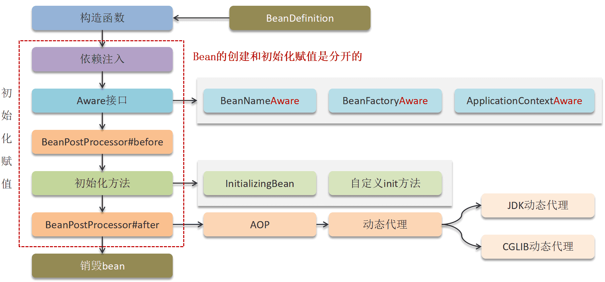
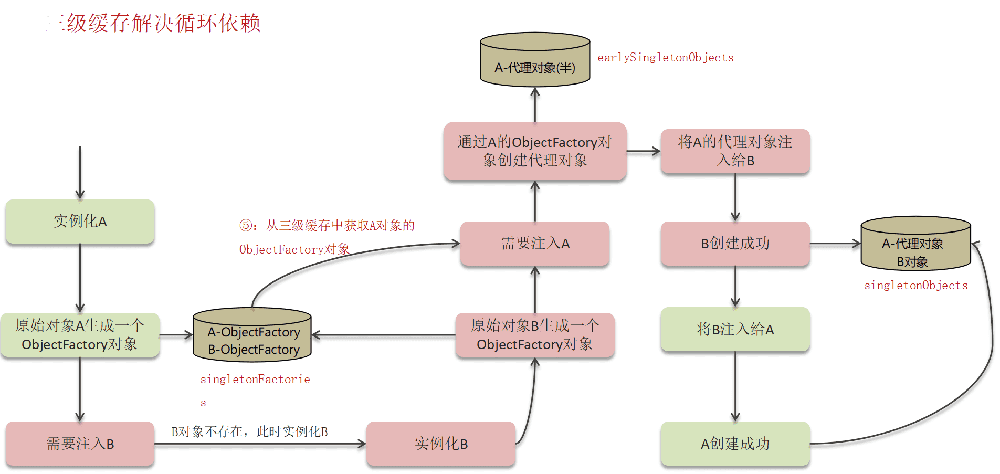
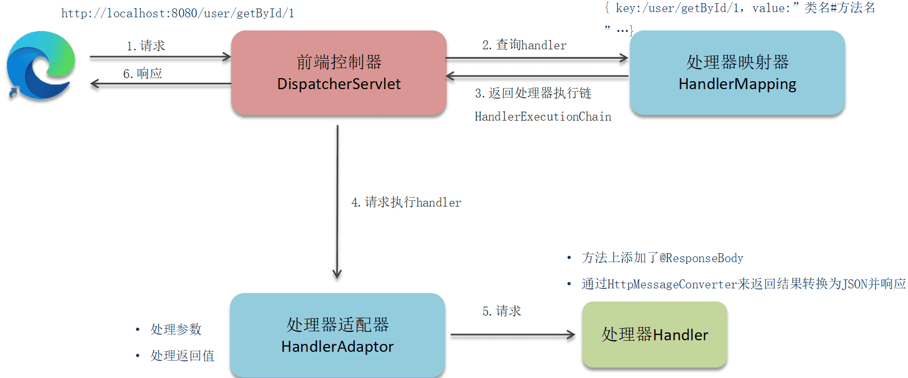
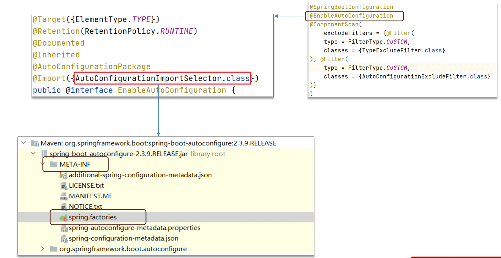

‍

‍

# 概念

‍

‍

## 零碎

‍

### 说几个AOP的注解

‍

1. ​`@Aspect`​：用于定义一个切面类。
2. ​`@Pointcut`​：用于定义一个切入点表达式。
3. ‍
4. ​`@Before`​：用于在目标方法执行之前执行通知。
5. ​`@After`​：用于在目标方法执行之后执行通知。
6. ​`@AfterReturning`​：用于在目标方法成功返回结果之后执行通知。
7. ​`@AfterThrowing`​：用于在目标方法抛出异常后执行通知。
8. ​`@Around`​：用于在目标方法执行前后执行通知。

‍

‍

‍

### spring 的 bean 的后置处理器，就是像 BeanPostProcessor 这个后置处理器你之前有了解过吗？

Spring 的 `BeanPostProcessor`​ 是一个接口，允许在 Spring 容器实例化 bean 之后但在其初始化方法（如 `afterPropertiesSet`​ 或自定义的初始化方法）之前对 bean 进行自定义修改。`BeanPostProcessor`​ 提供了两个方法：

1. ​`postProcessBeforeInitialization(Object bean, String beanName)`​：在 bean 的初始化方法调用之前执行。
2. ​`postProcessAfterInitialization(Object bean, String beanName)`​：在 bean 的初始化方法调用之后执行。

以下是一个简单的示例，展示了如何实现一个自定义的 `BeanPostProcessor`​：

```java
import org.springframework.beans.BeansException;
import org.springframework.beans.factory.config.BeanPostProcessor;
import org.springframework.stereotype.Component;

@Component
public class CustomBeanPostProcessor implements BeanPostProcessor {

    @Override
    public Object postProcessBeforeInitialization(Object bean, String beanName) throws BeansException {
        System.out.println("Before Initialization: " + beanName);
        // 可以在这里对 bean 进行自定义修改
        return bean;
    }

    @Override
    public Object postProcessAfterInitialization(Object bean, String beanName) throws BeansException {
        System.out.println("After Initialization: " + beanName);
        // 可以在这里对 bean 进行自定义修改
        return bean;
    }
}
```

在这个示例中，`CustomBeanPostProcessor`​ 实现了 `BeanPostProcessor`​ 接口，并在 `postProcessBeforeInitialization`​ 和 `postProcessAfterInitialization`​ 方法中打印出 bean 的名称。你可以在这些方法中添加自定义逻辑来修改 bean。

‍

‍

### MVC架构 + 流程

架构

Model（模型）：负责处理应用程序的数据逻辑。模型对象从数据库中检索数据，并将数据发送回控制器或视图。
View（视图）：负责显示数据。视图从模型中获取数据，并将其呈现给用户。视图不直接与模型交互，而是通过控制器来获取数据。
Controller（控制器）：负责处理用户输入。控制器从视图接收输入，处理后调用模型来更新数据，并最终更新视图。

‍

流程

1. 发送请求——>DispatcherServlet拦截器拿到交给HandlerMapping
2. 依次调用配置的拦截器，最后找到配置好的业务代码Handler并执行业务方法
3. 包装成ModelAndView返回给ViewResolver解析器渲染页面

‍

### action请求

就是经过controller的请求，直接输入页面路径不拦截？

 [http://localhost:8080/admin/index/index.html](http://localhost:8080/admin/index/index.html%E8%BF%99%E6%A0%B7%E7%9A%84%E8%AF%9D%EF%BC%8C%E5%B0%B1%E4%B8%8D%E8%B5%B0%E6%8B%A6%E6%88%AA%E5%99%A8%EF%BC%8C%E7%9B%B4%E6%8E%A5%E8%B7%B3%E8%BD%AC%E5%88%B0%E9%A1%B5%E9%9D%A2%E4%B8%8A%E4%BA%86%E3%80%82) 这样的话，就不走拦截器，直接跳转到页面上了。

‍

‍

### 什么是 Spring 框架, 喵两句

Spring 是一种轻量级开发框架，旨在提高开发人员的开发效率以及系统的可维护性

一般说 Spring 框架指的都是 Spring Framework，它是很多模块的集合，使用这些模块可以很方便地协助我们进行开发。

这些模块是：

核心容器、数据访问/集成,、Web、AOP（面向切面编程）、工具、消息和测试模块

‍

‍

### 框架用到哪些设计模式？

* **工厂设计模式** : Spring使用工厂模式通过 `BeanFactory`​、`ApplicationContext`​ 创建 bean 对象
* **代理设计模式** : Spring AOP 功能的实现
* **单例设计模式** : Spring 中的 Bean 默认都是单例
* **模板方法模式** : Spring 中 `jdbcTemplate`​、`hibernateTemplate`​ 等以 **Template** 结尾的对数据库操作的类，它们就使用到了模板模式
* **包装器设计模式** : 我们的项目需要连接多个数据库，而且不同的客户在每次访问中根据需要会去访问不同的数据库。这种模式让我们可以根据客户的需求能够动态切换不同的数据源
* **观察者模式:**  Spring **事件**驱动模型 就是观察者模式很经典的一个应用。
* **适配器模式** :Spring AOP 的增强或通知(Advice) 使用到了适配器模式、spring MVC 中也是用到了适配器模式适配 `Controller`​。
* ...

‍

‍

### 重要的Spring模块

> 目前最新的5.x版本中 Web 模块的 Portlet 组件已经被废弃掉，同时增加了用于异步响应式处理的 WebFlux 组件

‍

* 核心容器

  * **Spring Core**：基础模块，提供了依赖注入（IoC）功能，是其他所有模块的基础。
  * **Spring Beans**：提供了 BeanFactory，这是一个复杂的工厂模式的实现，用于管理 Spring Bean 的生命周期。
  * **Spring Context**：基于 Core 和 Beans 模块，提供了框架式的对象访问方式，类似于 JNDI 注册表。
  * **Spring Expression Language (SpEL)** ：提供了强大的表达式语言，用于在运行时查询和操作对象图。
* 面向切面

  * **Spring AOP**：提供了面向切面编程的实现，允许定义方法拦截器和切入点。
  * **Spring Aspects**：为与 AspectJ 的集成提供支持。
* 数据访问/集成

  * **Spring JDBC**：提供了简化的 JDBC 数据访问功能。
  * **Spring ORM**：提供了对 ORM 框架（如 Hibernate、JPA、MyBatis）的支持。
  * **Spring Transaction**：提供了对编程式和声明式事务管理的支持。
* Web

  * **Spring Web**：提供了创建 Web 应用程序的基础支持，包括多部分文件上传功能和初始化 Web 应用程序的 IoC 容器。
  * **Spring WebMVC**：提供了基于 MVC 设计模式的 Web 应用程序开发支持。
  * **Spring WebFlux**：提供了响应式编程支持，用于构建非阻塞的 Web 应用程序。
* 工具、消息和测试模块

  * **Spring JMS**：提供了对 Java 消息服务（JMS）的支持。
  * **Spring Test**：提供了对 JUnit 和 TestNG 测试的支持，允许在 Spring 容器中进行集成测试。

‍

‍

### 自动配置含义

‍

关键点：

1. 要看springboot的源码
2. @SpringBootApplication 中包含的@EnableAutoConfiguration，@SpringBootConfiguration，@ComponentScan 注解
3. @EnableAutoConfiguration 开启自动配置功能 内部还包含 @AutoConfigurationPackage、@Import

    1. @AutoConfigurationPackage 中 @Import(AutoConfigurationPackages.Registrar.class) 引入了 Registrar.class 完成批量注册，默认扫描主启动类的包@Bean或者@Compont等注解
    2. @Import(AutoConfigurationImportSelector.class)
4. @ComponentScan 扫描被@Compent(@Service@Controller)注解的bean 加载到容器中
5. @SpringBootConfiguration 表示这是一个SpringBoot的配置类

‍

‍

答：

1. 所加载使用的jar包 如果是比较常见的，spring都提供了默认配置，也就是不像以前一样需要把框架的每一个属性都要配置一遍，主要目的是简化开发
2. springboot 通过在启动类上添加注解  **@SpringBootApplication** 完成自动配置
3. 内部完成了读取每个jar包下的`META-INF/spring.factories`​和spring-boot-autoconfigure-2.6.7.jar中的默认配置

‍

‍

‍

‍

‍

### MVC是什么

MVC 是一种设计模式,Spring MVC 是一款很优秀的 MVC 框架。Spring MVC 可以帮助我们进行更简洁的Web层的开发，并且它天生与 Spring 框架集成。Spring MVC 下我们一般把后端项目分为 Service层（处理业务）、Dao层（数据库操作）、Entity层（实体类）、Controller层(控制层，返回数据给前台页面)。

‍

之前 Model1 和 Model2 这两个没有 Spring MVC 的时代。

* **Model1 时代** : 在 Model1 模式下，整个 Web 应用几乎全部用 JSP 页面组成，只用少量的 JavaBean 来处理数据库连接、访问等操作。这个模式下 JSP 既是控制层又是表现层。显而易见，这种模式存在很多问题。比如①将控制逻辑和表现逻辑混杂在一起，导致代码重用率极低；②前端和后端相互依赖，难以进行测试并且开发效率极低

  ‍
* **Model2 时代** ：学过 Servlet 并做过相关 Demo 的朋友应该了解“Java Bean(Model)+ JSP（View,）+Servlet（Controller） ”这种开发模式,这就是早期的 JavaWeb MVC 开发模式。

  Model:系统涉及的数据，也就是 dao 和 bean。View：展示模型中的数据，只是用来展示。Controller：处理用户请求 ，返回数据给 JSP 并展示给用户。

  ‍

Model2 模式下还存在很多问题，Model2的抽象和封装程度还远远不够，使用Model2进行开发时不可避免地会重复造轮子，这就大大降低了程序的可维护性和复用性。于是很多JavaWeb开发相关的 MVC 框架应运而生比如Struts2，但是 Struts2 比较笨重。随着 Spring 轻量级开发框架的流行，Spring 生态圈出现了 Spring MVC 框架， Spring MVC 是当前最优秀的 MVC 框架。相比于 Struts2 ， Spring MVC 使用更加简单和方便，开发效率更高，并且 Spring MVC 运行速度更快。

‍

### 怎么识别和拦截请求，不让它直接打到后端服务？

Spring自己的 拦截器, 过滤器

Nginx, 网关, 前端Vue

‍

‍

### 在创建Controller的注解时, 使用Request和post有什么区别

‍

1. **@RequestMapping**:

    * 可以用于映射任何HTTP请求方法（GET, POST, PUT, DELETE等）。
    * 需要通过`method`​属性指定请求方法类型。
    * 适用于需要处理多种HTTP请求方法的情况。
2. **@PostMapping**:

    * 专门用于映射HTTP POST请求。
    * 是`@RequestMapping`​的快捷方式，等同于`@RequestMapping(method = RequestMethod.POST)`​。
    * 适用于只处理POST请求的情况。

‍

‍

### 从请求中获取参数, 除了注解形式还有吗

通过HttpServletRequest对象来获取参数

```java
@RestController
@RequestMapping("/api")
public class MyController {

    @GetMapping("/getExample")
    public String getExample(HttpServletRequest request) {
        String param = request.getParameter("paramName");
        return "Parameter value: " + param;
    }

    @PostMapping("/postExample")
    public String postExample(HttpServletRequest request) {
        String param = request.getParameter("paramName");
        return "Parameter value: " + param;
    }
}
```

HttpServletRequest对象用于获取请求参数。  
getParameter方法用于获取指定名称的参数值。

‍

### @AutoWire和@Resource区别？

‍

* ​`@Autowired`​ 是 Spring 特有的注解，默认按类型注入，适合 Spring 环境。
* ​`@Resource`​ 是 Java EE 标准注解，默认按名称注入，适合需要与其他 Java EE 组件兼容的场景。

‍

​`@Autowired`​

* **来源**：Spring 框架提供的注解。
* **注入方式**：默认按类型注入。
* **用法**：可以用于字段、构造器和方法。
* **配置**：可以与 `@Qualifier`​ 一起使用来按名称注入。

‍

​`@Resource`​

* **来源**：Java EE 提供的注解（在 Spring 中也可用）。
* **注入方式**：默认按名称注入，如果找不到匹配的名称，则按类型注入。
* **用法**：可以用于字段和方法。
* **配置**：可以通过 `name`​ 属性指定要注入的 bean 名称。

‍

‍

### SpringBoot哪些优点？它和 Spring 有什么区别？

‍

典型回答:

日常开发的 Spring 框架很熟悉，Spring 为 Java 程序提供了全面的**基础架构支持**，包含了很多非常**实用的功能**，如 Spring JDBC、Spring AOP、Spring ORM、Spring Test 等，这些模块的出现，大大的缩短了应用程序的开发时间，同时提高了应用开发的效率

Spring Boot 本质上是 Spring 框架的**延伸和扩展**，它的诞生是为了简化 Spring 框架**初始搭建以及开发**的过程，使用它可以不再依赖 Spring 应用程序中的 **XML 配置**，为更快、更高效的开发 Spring 提供更加有力的支持。Spring Boot 具体的特性有: 

‍

#### 特性一：更快速的构建能力

Spring Boot 提供了更多的 **Starters** 用于快速构建业务框架，Starters 可以理解为启动器，它包含了一系列可以集成到应用里面的依赖包，你可以一站式集成 Spring 及其他技术，而不需要到处找依赖包

‍

#### 特性二：起步依赖

Spring Boot 提供了**起步依赖**，也就是在创建 Spring Boot 时可以直接勾选依赖模块，这样在项目初始化时就会把相关依赖直接添加到项目中，大大缩短了查询并添加依赖的时间

‍

#### 特性三：内嵌容器支持

Spring Boot 内嵌了 **Tomcat**、Jetty、Undertow 三种容器，其默认嵌入的容器是 Tomcat，这个在我们启动 Spring Boot 项目的时候，在控制台上就能看到，具体信息如下：

> o.s.b.w.embedded.tomcat.TomcatWebServer :Tomcat started on port(s): 8080 (http) with context path ''

可以看出 Spring Boot 默认使用的是 Tomcat 容器启动的。

我们可以通过修改 pom.xml 来移除内嵌的 Tomcat 更换为其他的容器

‍

#### Actuator 监控

(不太会不讲了)

Spring Boot 自带了 Actuator 监控功能，主要用于提供对应用程序监控，以及控制的能力，比如监控应用程序的运行状况，或者内存、线程池、Http 请求统计等，同时还提供了关闭应用程序等功能。

‍

‍

### spring管理一个bean，有两个方法，都有切面，在方法a中调用b会触发aop逻辑吗

在 Spring 中，如果在同一个类中一个方法调用另一个方法，默认情况下不会触发 AOP 逻辑。这是因为 Spring AOP 是基于代理的，只有通过代理对象调用方法时，才会触发 AOP 逻辑。

‍

要解决这个问题，可以通过以下几种方式：

1. **使用**  **​`@Autowired`​**​ **注入自身**：通过 Spring 容器注入自身的代理对象，然后通过代理对象调用方法。

```java
import org.springframework.beans.factory.annotation.Autowired;
import org.springframework.stereotype.Service;

@Service
public class MyService {

    @Autowired
    private MyService self;

    public void methodA() {
        // 业务逻辑
        self.methodB(); // 通过代理对象调用方法B
    }

    public void methodB() {
        // 业务逻辑
    }
}
```

2. **使用** **​`AopContext`​**​ **获取当前代理对象**：通过 `AopContext.currentProxy()`​ 获取当前代理对象，然后通过代理对象调用方法。

```java
import org.springframework.aop.framework.AopContext;
import org.springframework.stereotype.Service;

@Service
public class MyService {

    public void methodA() {
        // 业务逻辑
        ((MyService) AopContext.currentProxy()).methodB(); // 通过代理对象调用方法B
    }

    public void methodB() {
        // 业务逻辑
    }
}
```

这两种方式都可以确保在方法 `a`​ 中调用方法 `b`​ 时，触发 AOP 逻辑。

‍

‍

‍

‍

## 统一异常处理怎么做？

 `@ControllerAdvice`​ + `@ExceptionHandler`​

```java
@ControllerAdvice
@ResponseBody
public class GlobalExceptionHandler {

    @ExceptionHandler(BaseException.class)
    public ResponseEntity<?> handleAppException(BaseException ex, HttpServletRequest request) {
      //......
    }
```

‍

## Spring中注解和xml两种配置适用的场景和区别？

‍

### 注解配置

**适用场景**：

* 适用于小型或中型项目。
* 适用于开发团队熟悉注解和 Java 配置的项目。
* 适用于需要快速开发和简化配置的项目。

**优点**：

* 配置更简洁，减少了 XML 文件的数量。
* 更加直观，配置和代码紧密结合，易于理解和维护。
* 支持类型安全，编译时可以检查配置错误。

**缺点**：

* 配置分散在代码中，可能不易于集中管理。
* 对于大型项目，可能会导致代码和配置混杂在一起，降低可读性。

‍

### XML 配置

**适用场景**：

* 适用于大型项目或需要复杂配置的项目。
* 适用于需要集中管理配置的项目。
* 适用于开发团队对 XML 配置更为熟悉的项目。

**优点**：

* 配置集中，易于管理和查看。
* 适用于需要动态修改配置的场景（如通过外部配置文件）。
* 更加灵活，支持一些注解不支持的高级配置。

**缺点**：

* 配置文件较多，可能会显得冗长和复杂。
* 配置和代码分离，可能不直观，增加了理解和维护的难度。

‍

示例

**注解配置**：

```java
import org.springframework.context.annotation.Bean;
import org.springframework.context.annotation.Configuration;

@Configuration
public class AppConfig {

    @Bean
    public MyService myService() {
        return new MyServiceImpl();
    }
}
```

**XML 配置**：

```xml
<beans xmlns="http://www.springframework.org/schema/beans"
       xmlns:xsi="http://www.w3.org/2001/XMLSchema-instance"
       xsi:schemaLocation="http://www.springframework.org/schema/beans
           http://www.springframework.org/schema/beans/spring-beans.xsd">

    <bean id="myService" class="com.example.MyServiceImpl"/>
</beans>
```

总结来说，注解配置适用于**快速开发和简化配置**，而 XML 配置适用于需要**集中管理和复杂配置**的场景

‍

‍

## Servlet的生命周期

大象进冰箱 init() doGet() doPost()重写

1. **初始化阶段（Initialization）** ：

    * 当Servlet第一次被请求时，Servlet容器会加载Servlet类并创建一个Servlet实例。
    * 然后，容器会调用Servlet的`init()`​方法进行初始化。这个方法只会被调用一次，用于执行Servlet的初始化任务。
2. **服务阶段（Service）** ：

    * 在Servlet的生命周期中，每次有请求到达时，Servlet容器都会调用Servlet的`service()`​方法。
    * ​`service()`​方法会根据请求的类型（GET、POST等）调用相应的`doGet()`​、`doPost()`​等方法来处理请求。
3. **销毁阶段（Destruction）** ：

    * 当Servlet容器决定销毁Servlet实例时，会调用Servlet的`destroy()`​方法。
    * 这个方法用于执行清理任务，例如释放资源。`destroy()`​方法只会被调用一次。

之前做的Servlet Demo

```java
public class MyServlet extends HttpServlet {
    @Override
    public void init() throws ServletException {
        // 初始化代码
        System.out.println("Servlet is being initialized");
    }

    @Override
    protected void doGet(HttpServletRequest req, HttpServletResponse resp) throws ServletException, IOException {
        // 处理GET请求
        resp.getWriter().write("Hello, World!");
    }

    @Override
    protected void doPost(HttpServletRequest req, HttpServletResponse resp) throws ServletException, IOException {
        // 处理POST请求
        resp.getWriter().write("Post request received");
    }

    @Override
    public void destroy() {
        // 清理代码
        System.out.println("Servlet is being destroyed");
    }
}
```

‍

‍

‍

‍

# 大块

‍

‍

## Bean

‍

### IoC思想

IoC（Inverse of Control:控制反转）是一种**设计思想**，就是 **将原本在程序中手动创建对象的控制权，交由Spring框架来管理。**  IoC 在其他语言中也有应用，并非 Spring 特有。 **IoC 容器是 Spring 用来实现 IoC 的载体， IoC 容器实际上就是个Map（key，value）,Map 中存放的是各种对象。**

将对象之间的相互依赖关系交给 IoC 容器来管理，并由 IoC 容器完成对象的注入。这样可以很大程度上简化应用的开发，把应用从复杂的依赖关系中解放出来。 **IoC 容器就像是一个工厂一样，当我们需要创建一个对象的时候，只需要配置好配置文件/注解即可，完全不用考虑对象是如何被创建出来的。**

‍

**IOC**（Inversion of Control，翻译为“控制反转”）不是一个具体的技术，而是一种**设计思想**。与传统控制流相比，IOC 会颠倒控制流，在传统的编程中需要开发者自行创建并销毁对象，而在 IOC 中会把这些操作交给框架来处理，这样开发者就不用关注具体的实现细节了，拿来直接用就可以了，这就是控制反转。

IOC 很好的体现出了面向对象的设计法则之一——好莱坞法则：“别找我们，我们找你”。即由 IOC 容器帮对象找到相应的依赖对象并注入，而不是由对象主动去找

‍

‍

### DI思想

**DI**（Dependency Injection，翻译为“依赖注入”）表示组件间的依赖关系交由容器在运行期自动生成，也就是说，由容器动态的将某个依赖关系注入到组件之中，这样就能提升组件的重用频率。

通过依赖注入机制，只需要通过简单的配置，就可指定目标需要的资源，完成自身的业务逻辑，而不需要关心资源来自哪里、由谁实现等问题

> IOC 和 DI 其实是**同一个概念从不同角度**的描述的，由于控制反转这个概念比较含糊（可能只理解成了容器控制对象这一个层面，很难让人想到谁来维护对象关系）
>
> 所以 2004 年被开发者尊称为“教父”的 Martin Fowler（世界顶级专家，敏捷开发方法的创始人之一）又给出了一个新的名字“依赖注入”，相对 IOC 而言，“依赖注入”明确描述了“被注入对象依赖 IOC 容器配置依赖对象”

‍

‍

### bean作用域有哪些?

单例, 非单例. 特种面对 HTTP请求设计的

* singleton : 唯一 bean 实例，Spring 中的 bean 默认都是单例的。
* prototype : 每次请求都会创建一个新的 bean 实例。
* request : 每一次HTTP请求都会产生一个新的 bean，该bean仅在当前HTTP request内有效。
* session : 每一次HTTP请求都会产生一个新的 bean，该bean仅在当前 HTTP session 内有效。

‍

‍

### 单例 bean 线程安全问题

当多个线程操作同一个对象的时候，对这个对象的成员变量的写操作会存在线程安全问题

但是，一般情况下，我们常用的 `Controller`​、`Service`​、`Dao`​ 这些 Bean 是**无状态**的。无状态的 Bean **不能保存数据**，因此是线程安全的。

‍

常见的有 2 种解决办法：

* 在类中定义一个 `ThreadLocal`​ 成员变量，将需要的可变成员变量保存在 `ThreadLocal`​ 中（推荐的一种方式）
* 改变 Bean 的作用域为 “prototype”：每次请求都会创建一个新的 bean 实例，自然不会存在线程安全问题. 但是问题:

  1. 性能开销：每次请求都创建一个**新的实例**会增加内存和 CPU 的开销，尤其是在**高并发**的情况下会爆炸
  2. 资源管理：于是就需要额外的**资源管理和清理**工作，每个请求都会创建新的对象实例，可能会导致内存泄漏或资源浪费
  3. 依赖注入复杂性：如果原型 Bean **依赖于其他单例** Bean，可能会导致复杂的依赖管理和生命周期管理问题

‍

‍

### @Component 和 @Bean 的区别

‍

1. 作用对象不同: `@Component`​ 注解作用于**类**，而`@Bean`​注解作用于**方法**
2. ​`@Component`​通常是通过**类路径扫描**来自动侦测以及自动装配到Spring容器中（我们可以使用 `@ComponentScan`​ 注解定义要扫描的路径从中找出标识了需要装配的类自动装配到 Spring 的 bean 容器中）

    ​`@Bean`​ 注解通常是我们在标有该注解的方法中**定义产生**这个 bean,`@Bean`​告诉了Spring这是某个类的示例，当我需要用它的时候还给我。
3. ​`@Bean`​ 注解比 `Component`​ 注解的**自定义性更强**，而且很多地方我们只能通过 `@Bean`​ 注解来注册bean。比如当我们引用第三方库中的类需要装配到 `Spring`​容器时，则只能通过 `@Bean`​来实现

‍

‍

​`@Bean`​注解使用

```java
@Configuration
public class AppConfig {

    @Bean
    public TransferService transferService() {
        return new TransferServiceImpl();
    }

}
```

相当于下面的 xml 配置

```xml
<beans>
    <bean id="transferService" class="com.acme.TransferServiceImpl"/>
</beans>
```

‍

这个例子是通过 `@Component`​ 无法实现的。

```java
    @Bean
    public OneService getService(status) {
  
        case (status)  {
  
            when 1:
                    return new serviceImpl1();
            when 2:
                    return new serviceImpl2();
            when 3:
                    return new serviceImpl3();
  
        }
    }
```

‍

‍

### BeanFactory与ApplicationContext有什么区别

​`BeanFactory`​和`ApplicationContext`​是Spring框架中用于管理Bean的两种容器接口

‍

1. **BeanFactory**:

    * **基本容器**：`BeanFactory`​是Spring框架中**最基本的容器**，提供了基本的依赖注入功能。
    * **延迟初始化**：`BeanFactory`​在需要时才创建Bean实例（懒加载），这可以提高启动性能。
    * **较少功能**：`BeanFactory`​只提供了基本的容器功能，不支持更高级的特性，如事件发布、国际化、AOP等。

    ```java
    BeanFactory factory = new XmlBeanFactory(new ClassPathResource("beans.xml"));
    MyBean myBean = (MyBean) factory.getBean("myBean");
    ```
2. **ApplicationContext**:

    * **高级容器**：`ApplicationContext`​是`BeanFactory`​的**子接口**，提供了更多的功能和特性。
    * **立即初始化**：`ApplicationContext`​在容器启动时就创建所有单例Bean实例 **（预加载）** ，这可以发现配置问题。
    * **丰富功能**：`ApplicationContext`​支持事件发布、国际化、AOP、注解等高级特性。
    * **多种实现**：`ApplicationContext`​有多种实现，如`ClassPathXmlApplicationContext`​、`FileSystemXmlApplicationContext`​、`AnnotationConfigApplicationContext`​等。

    ```java
    ApplicationContext context = new ClassPathXmlApplicationContext("beans.xml");
    MyBean myBean = (MyBean) context.getBean("myBean");
    ```

总结：

* ​`BeanFactory`​适用于资源受限的环境，提供基本的依赖注入功能。
* ​`ApplicationContext`​适用于大多数应用，提供丰富的功能和特性。

‍

‍

### 生命周期

1. Spring对Bean进行实例化
2. Spring将值和Bean的引用注入进Bean对应的属性中
3. 容器通过Aware接口把容器信息注入Bean
4. BeanPostProcessor。进行进一步的构造，会在InitialzationBean前后执行对应方法，当前正在初始化的bean对象会被传递进来，我们就可以对这个bean作任何处理
5. InitializingBean。这一阶段也可以在bean正式构造完成前增加我们自定义的逻辑，但它与前置处理不同，由于该函数并不会把当前bean对象传进来，因此在这一步没办法处理对象本身，只能增加一些额外的逻辑。
6. DisposableBean。Bean将一直驻留在应用上下文中给应用使用，直到应用上下文被销毁，如果Bean实现了接口，Spring将调用它的destory方法

‍

‍

## 依赖管理

‍

### SB依赖管理

sb如何管理版本依赖?

‍

Key

1.maven

2.springboot pom.xml 父子关系

3.spring-boot-starter

‍

答：

1. springboot底层**使用maven管理依赖**，通过控制pom.xml**父子关系来完成细节配置**，在父pom中定义具体框架和版本号以及额外的信息
2. 提供了很多场景的**spring-boot-starter** 的 pom.xml文件，设定好版本信息来标准化的引入依赖避免冲突

‍

起步依赖指的是各种starter命名的pom依赖项目: 重点是pom.xml,其中包含了框架所需要的其他依赖以及默认配置文件，不需要我们手动配置了

‍

‍

### 循环依赖解决？

循环依赖是指 Bean 对象循环引用，是两个或多个 Bean 之间相互持有对方的引用，例如 CircularDependencyA → CircularDependencyB → CircularDependencyA

控制台会输出循环依赖的图标示意

‍

Spring 框架通过使用三级缓存来解决这个问题，确保即使在循环依赖的情况下也能正确创建 Bean。

Spring 中的三级缓存其实就是三个 Map，如下：

```java
// 一级缓存
/** Cache of singleton objects: bean name to bean instance. */
private final Map<String, Object> singletonObjects = new ConcurrentHashMap<>(256);

// 二级缓存
/** Cache of early singleton objects: bean name to bean instance. */
private final Map<String, Object> earlySingletonObjects = new HashMap<>(16);

// 三级缓存
/** Cache of singleton factories: bean name to ObjectFactory. */
private final Map<String, ObjectFactory<?>> singletonFactories = new HashMap<>(16);

```

‍

简单来说，Spring 的三级缓存包括：

1. **一级缓存（singletonObjects）** ：存放==最终形态==的 Bean（已经实例化、属性填充、初始化），单例池，为“Spring 的单例属性”⽽⽣。一般情况我们获取 Bean 都是从这里获取的，但是并不是所有的 Bean 都在单例池里面，例如原型 Bean 就不在里面。
2. **二级缓存（earlySingletonObjects）** ：存放==过渡== Bean（半成品，尚未属性填充），也就是三级缓存中`ObjectFactory`​产生的对象，与三级缓存配合使用的，可以防止 AOP 的情况下，每次调用`ObjectFactory#getObject()`​都是会产生新的代理对象的。
3. **三级缓存（singletonFactories）** ：存放`ObjectFactory`​，`ObjectFactory`​的`getObject()`​方法（最终调用的是`getEarlyBeanReference()`​方法）可以生成原始 Bean 对象或者代理对象（如果 Bean 被 AOP 切面代理）。三级缓存只会对单例 Bean 生效。

‍

‍

#### 创建 Bean 流程

1. 先去 **一级缓存** **​`singletonObjects`​**​ 中获取，存在就返回；
2. 如果不存在或者对象正在创建中，于是去 **二级缓存** **​`earlySingletonObjects`​**​ 中获取；
3. 如果还没有获取到，就去 **三级缓存** **​`singletonFactories`​**​ 中获取，通过执行 `ObjectFacotry`​ 的 `getObject()`​ 就可以获取该对象，获取成功之后，从三级缓存移除，并将该对象加入到二级缓存中。

‍

Spring 在创建 Bean 的时候，如果允许循环依赖的话，Spring 就会将刚刚**实例化完成但是属性还没有初始化完**的 Bean 对象给**提前暴露**出去，这里通过 `addSingletonFactory`​ 方法，向三级缓存中添加一个 `ObjectFactory`​ 对象：

```java
// AbstractAutowireCapableBeanFactory # doCreateBean #
public abstract class AbstractAutowireCapableBeanFactory ... {
	protected Object doCreateBean(...) {
        //...

        // 支撑循环依赖：将 ()->getEarlyBeanReference 作为一个 ObjectFactory 对象的 getObject() 方法加入到三级缓存中
		addSingletonFactory(beanName, () -> getEarlyBeanReference(beanName, mbd, bean));
    }
}

```

如果一级缓存、二级缓存都取不到对象时，会去三级缓存中通过 `ObjectFactory`​ 的 `getObject`​ 方法获取对象。

```java
class A {
    // 使用了 B
    private B b;
}
class B {
    // 使用了 A
    private A a;
}
```

‍

以上面的循环依赖代码为例，整个解决循环依赖的流程如下：

* 当 Spring 创建 A 之后，发现 A 依赖了 B ，又去创建 B，B 依赖了 A ，又去创建 A；
* 在 B 创建 A 的时候，那么此时 A 就发生了循环依赖，由于 A 此时还没有初始化完成，因此在 **一二级缓存** 中肯定没有 A；
* 那么此时就去三级缓存中调用 `getObject()`​ 方法去获取 A 的 **前期暴露的对象** ，也就是调用上边加入的 `getEarlyBeanReference()`​ 方法，生成一个 A 的 **前期暴露对象**；
* 然后就将这个 `ObjectFactory`​ 从三级缓存中移除，并且将前期暴露对象放入到二级缓存中，那么 B 就将这个前期暴露对象注入到依赖，来支持循环依赖。

‍

‍

#### **只用两级缓存够吗？**

在没有 AOP 的情况下，确实可以只使用一级和三级缓存来解决循环依赖问题。但是，当涉及到 AOP 时，二级缓存就显得非常重要了，因为它确保了即使在 Bean 的创建过程中有多次对早期引用的请求，也始终只返回同一个代理对象，从而避免了同一个 Bean 有**多个代理对象**的问题。

‍

‍

#### **总结**

**总结一下 Spring 如何解决三级缓存**：

‍

在三级缓存这一块，主要记一下 Spring 是如何支持循环依赖的即可

如果发生循环依赖就去 **三级缓存** **​`singletonFactories`​**​ 中拿到三级缓存中存储的 `ObjectFactory`​ 并调用它的 `getObject()`​ 方法来获取这个循环依赖对象的前期暴露对象（虽然还没初始化完成，但是可以拿到该对象在堆中的存储地址了），并且将这个前期暴露对象放到二级缓存中，这样在循环依赖时，就不会重复初始化了！

‍

不过，这种机制也有一些缺点

比如增加了内存开销（需要维护三级缓存，也就是三个 Map），降低了性能（需要进行多次检查和转换）

还有少部分情况是不支持循环依赖的，比如非单例的 bean 和`@Async`​注解的 bean 无法支持循环依赖

‍

‍

#### @Lazy 能解决循环依赖吗？

​`@Lazy`​ 用来标识类是否需要懒加载/延迟加载，可以作用在类上、方法上、构造器上、方法参数上、成员变量中

> 结合我项目情境, 确实可以用这个解决; 并且懒加载的情况也体验过

可以使用 `@Lazy`​ 解决一部分循环依赖的问题。

‍

‍

配置文件配置全局懒加载：

```properties
#默认false
spring.main.lazy-initialization=true
```

‍

编码的方式设置全局懒加载：

```java
SpringApplication springApplication=new SpringApplication(Start.class);
springApplication.setLazyInitialization(false);
springApplication.run(args);
```

如非必要，**尽量不要用全局懒加载**。全局懒加载会让 Bean **第一次使用的时候加载会变慢**，并且它会延迟应用程序问题的发现（当 Bean 被初始化时，问题才会出现）

如果一个 Bean 没有被标记为懒加载，那么它会在 Spring IoC 容器**启动的过程中**被创建和初始化。

如果一个 Bean 被标记为懒加载，那么它不会在 Spring IoC 容器启动时立即实例化，而是在第一次被请求时才创建。这可以帮助减少应用启动时的初始化时间，也可以用来解决循环依赖问题。

‍

‍

‍

## AOP

AOP(Aspect-Oriented Programming:面向切面编程) 能够将那些与业务无关，**却为业务模块所**​**==共同调用==**​**的逻辑或责任（例如事务处理、日志管理、权限控制等）封装起来**，便于**减少系统的重复代码**，**降低模块间的耦合度**，并**有利于未来的可拓展性和可维护性**。

‍

‍

‍

‍

面向切面的编程，是一种编程技术，是OOP（面向对象编程）的补充和完善。OOP的执行是一种从上往下的流程，并没有从左到右的关系。因此在OOP编程中，会有大量的重复代码。而AOP则是将这些与业务无关的重复代码抽取出来，然后再嵌入到业务代码当中。常见的应用有：权限管理、日志、事务管理等。

‍

#### 实现方式

实现AOP的技术，主要分为两大类：一是采用动态代理技术，利用截取消息的方式，对该消息进行装饰，以取代原有对象行为的执行；二是采用静态织入的方式，引入特定的语法创建“方面”，从而使得编译器可以在编译期间织入有关“方面”的代码。Spring AOP实现用的是动态代理的方式。

‍

**Spring AOP就是基于**​**==动态代理==**​**的**，如果要代理的对象，实现了某个接口，那么Spring AOP会使用 **JDK Proxy** 去创建代理对象，而对于没有实现接口的对象，就无法使用 JDK Proxy 去进行代理了，这时候Spring AOP会使用 **Cglib** 生成一个被代理对象的子类来作为代理

当然你也可以使用 AspectJ, Spring AOP 已经集成了AspectJ , 算的上是 Java 生态系统中最完整的 AOP 框架了

‍

‍

### Spring AOP 和 AspectJ AOP 有什么区别？

* **Spring AOP 属于运行时增强，而 AspectJ 是编译时增强**
* Spring AOP 基于代理(Proxying)，而 AspectJ 基于字节码操作(Bytecode Manipulation)。
* Spring AOP 已经集成了 AspectJ
* AspectJ 应该算的上是 Java 生态系统中**最完整的 AOP 框架**了。
* AspectJ 相比于 Spring AOP 功能更加强大，但是 Spring AOP 相对来说更简单，

如果我们的切面比较少，那么两者性能差异不大。但是，当切面太多的话，最好选择 AspectJ ，它比Spring AOP **快很多**

‍

‍

### Spring AOP的使用情景?简述其实现原理

‍

答：

aop面向切面编程使用非常广泛，几乎适用于一切需要统一化处理的场景

1. 统一日志处理
2. 统一异常处理
3. 访问限制（权限，限流等）
4. 事务处理
5. 缓存管理等

‍

通过代理的方式（jdk或cglib）为程序统一添加功能，解决公共问题

‍

‍

### 场景？

AOP（面向切面编程）除了用于日志记录，还可以用于以下场景：

1. **事务管理**：在方法执行前后自动管理事务的开始和提交/回滚。
2. **安全性检查**：在方法执行前进行权限验证，确保用户有权限执行该操作。
3. **性能监控**：在方法执行前后记录方法的执行时间，进行性能分析。
4. **异常处理**：统一处理方法执行过程中抛出的异常，进行日志记录或错误通知。
5. **缓存管理**：在方法执行前检查缓存，避免重复计算；在方法执行后更新缓存。
6. **资源管理**：在方法执行前后管理资源的分配和释放，如数据库连接、文件句柄等。
7. **审计跟踪**：记录方法调用的详细信息，如调用者、参数、返回值等，用于审计和跟踪。

这些场景都可以通过AOP来实现，从而减少代码的重复，提高代码的可维护性和可读性。

‍

‍

### 其他概念

AOP（面向切面编程，Aspect-Oriented Programming）是一种编程范式，旨在通过分离横切关注点提高代码的模块化。横切关注点是指那些在多个模块中都会涉及的功能，例如日志记录、安全性、事务管理等。

‍

核心概念包括：

1. **切面（Aspect）** ：模块化的横切关注点。一个切面可以包含多个通知。
2. **连接点（Join Point）** ：程序执行过程中可以插入切面的点，例如方法调用或异常抛出。
3. **通知（Advice）** ：在特定的连接点执行的代码。通知有多种类型，包括前置通知、后置通知、环绕通知等。
4. **切入点（Pointcut）** ：定义了在哪些连接点上应用通知的表达式。
5. **织入（Weaving）** ：将切面应用到目标对象的过程。织入可以在编译时、类加载时或运行时进行。

‍

```java
// 定义一个切面
@Aspect
@Component
public class LoggingAspect {

    // 定义一个切入点，匹配com.example包及其子包中的所有方法
    @Pointcut("execution(* com.example..*(..))")
    public void applicationPackagePointcut() {
        // 切入点签名
    }

    // 定义一个前置通知，在切入点匹配的方法执行之前执行
    @Before("applicationPackagePointcut()")
    public void logBefore(JoinPoint joinPoint) {
        System.out.println("Executing method: " + joinPoint.getSignature().getName());
    }
}
```

‍

‍

‍

## 过滤器拦截器

‍

### 过滤器拦截器区别

‍

|属性|拦截器Interceptor|过滤器Filter|
| --------------| -------------------------------------------------------------------------| ----------------------------------------------|
|原理|基于java的反射机制|基于函数回调|
|创建|(在context.xml中配置)由Spring容器初始化。|(在web.xml中配置filter基本属性)由web容器创建|
|servlet 容器|拦截器不直接依赖于servlet容器|过滤器依赖于servlet容器|
|作用对象|拦截器只能对action请求起作用|过滤器则可以对几乎所有的请求起作用|
|访问范围|拦截器可以访问action上下文、值栈里的对象，可以获取IOC容器中的各个bean。|不能|
|使用场景|即可用于Web，也可以用于其他Application|基于Servlet规范，只能用于Web|
|使用选择|可以深入到方法执行前后，使用场景更广|只能在Servlet前后起作用|
||在Action的生命周期中，拦截器可以多次调用|而过滤器只能在容器初始化时被调用一次。|

‍

‍

‍

## 事务

‍

‍

### 管理事务的方式有几种？

1. 编程式事务，在代码中硬编码。(不推荐使用)
2. 声明式事务，在配置文件中配置（推荐使用）

‍

**声明式事务又分为两种：**

1. 基于XML的声明式事务
2. 基于注解的声明式事务

‍

### @Transactional回滚场景

在类上使用了@Transactional注解，默认开启了全局读写事务(这个类中有抛异常了全部进行回滚)

如果需要针对性回滚, 需要更高的细粒度地在方法上加注解

‍

‍

### 事务隔离级别哪几种?

‍

**TransactionDefinition 接口中定义了五个表示隔离级别的常量：**

五个常量, 实际上对应四种隔离级别.

‍

* **TransactionDefinition.**​**==ISOLATION_DEFAULT==**​ **:**  使用==后端数据库默认的隔离级别==  Mysql 默认采用的 REPEATABLE_READ 隔离级别 Oracle 默认采用的 READ_COMMITTED 隔离级别
* **TransactionDefinition.**​**==ISOLATION_READ_UNCOMMITTED==**​ **:**  最低的隔离级别，允许读取尚未提交的数据变更，**可能会导致脏读、幻读或不可重复读**
* **TransactionDefinition.**​**==ISOLATION_READ_COMMITTED==**​ **:**  允许读取并发事务已经提交的数据，**可以阻止脏读，但是幻读或不可重复读仍有可能发生**
* **TransactionDefinition.**​**==ISOLATION_REPEATABLE_READ==**​ **:**  对同一字段的多次读取结果都是一致的，除非数据是被本身事务自己所修改，**可以阻止脏读和不可重复读，但幻读仍有可能发生。**
* **TransactionDefinition.**​**==ISOLATION_SERIALIZABLE==**​ **:**  最高的隔离级别，完全服从ACID的隔离级别。所有的事务依次逐个执行，这样事务之间就完全不可能产生干扰，也就是说，**该级别可以防止脏读、不可重复读以及幻读**。但是这将严重影响程序的性能。通常情况下也不会用到该级别。

‍

‍

### 事务传播行为?

默认: 支持当前事务, 有则一起, 没有就创

‍

**支持当前事务的情况：**

(**TransactionDefinition.XXX)**

* PROPAGATION_==REQUIRED==： 如果当前存在事务，则加入该事务；如果当前没有事务，则创建一个新的事务。
* PROPAGATION_==SUPPORTS==： 如果当前存在事务，则加入该事务；如果当前没有事务，则以非事务的方式继续运行。
* PROPAGATION_==MANDATORY==： 如果当前存在事务，则加入该事务；如果当前没有事务，则抛出异常。（mandatory：强制性）
* PROPAGATION_==NESTED==： (其他情况) 如果当前存在事务，则创建一个事务作为当前事务的**嵌套事务**来运行；如果当前没有事务，则该取值等价于默认

‍

**不支持当前事务的情况：**

* PROPAGATION_==REQUIRES_NEW==： 创建一个新的事务，如果当前存在事务，则把当前事务挂起。
* PROPAGATION_==NOT_SUPPORTED==： 以非事务方式运行，如果当前存在事务，则把当前事务挂起。
* PROPAGATION_==NEVER==： 以非事务方式运行，如果当前存在事务，则抛出异常。

‍

‍

### 非运行时异常时使用@Transactional(rollbackFor = Exception.class)注解

Exception分为运行时异常RuntimeException

和非运行时异常。

‍

在`@Transactional`​注解中加上`rollbackFor=Exception.class`​

可以让事务在遇到非运行时异常时也回滚

‍

‍

# 高级

‍

‍

‍

## SpringBoot启动源码分析

‍

Spring Boot 程序的入口是 SpringApplication.run(Application.class, args) 方法，那么就从 run() 方法开始

```java
public ConfigurableApplicationContext run(String... args) {

    // 1.创建并启动计时监控类
    StopWatch stopWatch = new StopWatch();
    stopWatch.start();

    // 2.声明应用上下文对象和异常报告集合
    ConfigurableApplicationContext context = null;
    Collection<SpringBootExceptionReporter> exceptionReporters = new ArrayList();
    // 3.设置系统属性 headless 的值
    this.configureHeadlessProperty();
    // 4.创建所有 Spring 运行监听器并发布应用启动事件
    SpringApplicationRunListeners listeners = this.getRunListeners(args);
    listeners.starting();
    Collection exceptionReporters;
    try {
        // 5.处理 args 参数
        ApplicationArguments applicationArguments = new DefaultApplicationArguments(args);
        // 6.准备环境
        ConfigurableEnvironment environment = this.prepareEnvironment(listeners, applicationArguments);
        this.configureIgnoreBeanInfo(environment);
        // 7.创建 Banner 的打印类
        Banner printedBanner = this.printBanner(environment);
        // 8.创建应用上下文
        context = this.createApplicationContext();
        // 9.实例化异常报告器
        exceptionReporters = this.getSpringFactoriesInstances(SpringBootExceptionReporter.class, new Class[]{ConfigurableApplicationContext.class}, context);
        // 10.准备应用上下文
        this.prepareContext(context, environment, listeners, applicationArguments, printedBanner);
        // 11.刷新应用上下文
        this.refreshContext(context);
        // 12.应用上下文刷新之后的事件的处理
        this.afterRefresh(context, applicationArguments);
        // 13.停止计时监控类
        stopWatch.stop();
        // 14.输出日志记录执行主类名、时间信息
        if (this.logStartupInfo) {
            (new StartupInfoLogger(this.mainApplicationClass)).logStarted(this.getApplicationLog(), stopWatch);
        }
        // 15.发布应用上下文启动完成事件
        listeners.started(context);
        // 16.执行所有 Runner 运行器
        this.callRunners(context, applicationArguments);
    } catch (Throwable var10) {
        this.handleRunFailure(context, var10, exceptionReporters, listeners);
        throw new IllegalStateException(var10);
    }
    try {
        // 17.发布应用上下文就绪事件
        listeners.running(context);
        // 18.返回应用上下文对象
        return context;
    } catch (Throwable var9) {
        this.handleRunFailure(context, var9, exceptionReporters, (SpringApplicationRunListeners)null);
        throw new IllegalStateException(var9);
    }
}
```

从以上源码可以看出 Spring Boot 的启动总共分为以下 18 个步骤

‍

‍

### 1.创建并启动计时监控类

stopWatch, 新版没看到

此计时器是为了监控并记录 Spring Boot 应用启动的时间的，它会记录当前任务的名称，然后开启计时器。

‍

### 2.声明应用上下文对象和异常报告集合

​`ConfigurableApplicationContext context = null;`​

移动到了catch体内

‍

### 3.设置系统属性 headless 的值

​`		configureHeadlessProperty();`​

设置 Java.awt.headless = true，其中 awt（Abstract Window Toolkit）的含义是抽象窗口工具集。设置为 true 表示运行一个 headless 服务器，可以用它来作一些简单的图像处理。

‍

### 4.创建所有 Spring 运行监听器并发布应用启动事件

​`		SpringApplicationRunListeners listeners = getRunListeners(args);`​

此过程用于获取配置的监听器名称并实例化所有的类。

‍

### 5.初始化默认应用的参数类

​`ApplicationArguments applicationArguments = new DefaultApplicationArguments(args);`​

也就是说声明并创建一个应用参数对象。

‍

### 6.准备环境

​`ConfigurableEnvironment environment = prepareEnvironment(listeners, bootstrapContext, applicationArguments);`​

创建配置并且绑定环境（通过 property sources 和 profiles 等配置文件）

‍

### 7.创建 Banner 的打印类

​`Banner printedBanner = printBanner(environment);`​

Spring Boot 启动时会打印 Banner 图片

‍

‍

### 8.创建应用上下文

​`			context = createApplicationContext();`​

根据不同的应用类型来创建不同的 ApplicationContext 上下文对象。

‍

‍

### 9.实例化异常报告器

```java
	catch (Throwable ex) {
			throw handleRunFailure(context, ex, listeners);
		}
```

它调用的是 getSpringFactoriesInstances() 方法来获取配置异常类的名称，并实例化所有的异常处理类。

新版的移动到了catch体里面

‍

### 10.准备应用上下文

​`	prepareContext(bootstrapContext, context, environment, listeners, applicationArguments, printedBanner);`​

此方法的主要作用是把上面已经创建好的对象，传递给 prepareContext 来准备上下文，例如将环境变量 environment 对象绑定到上下文中、配置 bean 生成器以及资源加载器、记录启动日志等操作。

‍

### 11.刷新应用上下文

​`	refreshContext(context);`​

此方法用于解析配置文件，加载 bean 对象，并且启动内置的 web 容器等操作。

‍

‍

### 12.应用上下文刷新之后的事件处理

​`		afterRefresh(context, applicationArguments);`​

这个方法的源码是空的，可以做一些自定义的后置处理操作。

```java
	/**
	 * Called after the context has been refreshed.
	 * @param context the application context
	 * @param args the application arguments
	 */
	protected void afterRefresh(ConfigurableApplicationContext context, ApplicationArguments args) {
	}
```

‍

### 13.停止计时监控类

停止此过程第一步中的程序计时器，并统计任务的执行信息。

> 新版没找到

‍

‍

### 14.输出日志信息

把相关的记录信息，如类名、时间等信息进行控制台输出。

```java
	if (this.logStartupInfo) {
				new StartupInfoLogger(this.mainApplicationClass).logStarted(getApplicationLog(), startup);
			}
```

‍

### 15.发布应用上下文启动完成事件

​`	listeners.started(context, startup.timeTakenToStarted());`​

触发所有 SpringApplicationRunListener 监听器的 started 事件方法。

‍

### 16.执行所有 Runner 运行器

​`callRunners(context, applicationArguments);`​

执行所有的 ApplicationRunner 和 CommandLineRunner 运行器。

‍

### 17.发布应用上下文就绪事件

​`listeners.ready(context, startup.ready());`​

触发所有的 SpringApplicationRunListener 监听器的 running 事件。

‍

### 18.返回应用上下文对象

​`	return context;`​

到此为止 Spring Boot 的启动程序就结束了

‍

当然, 最新的源码可能修改很多, 大致是相同的; 部分没出现. 这里是SpringBoot 3.2.5

```java
	/**
	 * Run the Spring application, creating and refreshing a new
	 * {@link ApplicationContext}.
	 * @param args the application arguments (usually passed from a Java main method)
	 * @return a running {@link ApplicationContext}
	 */
	public ConfigurableApplicationContext run(String... args) {
		Startup startup = Startup.create();
		if (this.registerShutdownHook) {
			SpringApplication.shutdownHook.enableShutdownHookAddition();
		}
		DefaultBootstrapContext bootstrapContext = createBootstrapContext();
		ConfigurableApplicationContext context = null;
		configureHeadlessProperty();
		SpringApplicationRunListeners listeners = getRunListeners(args);
		listeners.starting(bootstrapContext, this.mainApplicationClass);
		try {
			ApplicationArguments applicationArguments = new DefaultApplicationArguments(args);
			ConfigurableEnvironment environment = prepareEnvironment(listeners, bootstrapContext, applicationArguments);
			Banner printedBanner = printBanner(environment);
			context = createApplicationContext();
			context.setApplicationStartup(this.applicationStartup);
			prepareContext(bootstrapContext, context, environment, listeners, applicationArguments, printedBanner);
			refreshContext(context);
			afterRefresh(context, applicationArguments);
			startup.started();
			if (this.logStartupInfo) {
				new StartupInfoLogger(this.mainApplicationClass).logStarted(getApplicationLog(), startup);
			}
			listeners.started(context, startup.timeTakenToStarted());
			callRunners(context, applicationArguments);
		}
		catch (Throwable ex) {
			throw handleRunFailure(context, ex, listeners);
		}
		try {
			if (context.isRunning()) {
				listeners.ready(context, startup.ready());
			}
		}
		catch (Throwable ex) {
			throw handleRunFailure(context, ex, null);
		}
		return context;
	}
```

‍

‍

‍

# Temp

‍

## Spring框架中的单例bean是线程安全的吗？

‍

‍

singleton : bean在每个Spring IOC容器中只有一个实例。  
prototype：一个bean的定义可以有多个实例。

不是完全线程安全的

> Spring bean并没有可变的状态(比如Service类和DAO类)，所以在某种程度上说Spring的单例bean是线程安全的。
>
> 但是里面的成员变量需考虑线程安全

不是线程安全的  
Spring框架中有一个@Scope注解，默认的值就是singleton，单例的。  
因为一般在spring的bean的中都是注入无状态的对象，没有线程安全问题，如果在bean中定义了可修改的成员变量，是要考虑线程安全问题的，可以使用多例或者加锁来解决

‍

> 当多用户同时请求一个服务时，容器会给每一个请求分配一个线程，这是多个线程会并发执行该请求对应的业务逻辑（成员方法），如果该处理逻辑中有对该单列状态的修改（体现为该单例的成员属性），则必须考虑线程同步问题。
>
> Spring框架并没有对单例bean进行任何多线程的封装处理。关于单例bean的线程安全和并发问题需要开发者自行去搞定。
>
> 比如：我们通常在项目中使用的Spring bean都是不可可变的状态(比如Service类和DAO类)，所以在某种程度上说Spring的单例bean是线程安全的。
>
> 如果你的bean有多种状态的话（比如 View Model对象），就需要自行保证线程安全。最浅显的解决办法就是将多态bean的作用由“**singleton**”变更为“**prototype**”。

‍

## Spring中的事务是如何实现的

Spring支持编程式事务管理和声明式事务管理两种方式。

* 编程式事务控制：需使用TransactionTemplate来进行实现，对业务代码有侵入性，项目中很少使用
* 声明式事务管理：声明式事务管理建立在AOP之上的。其本质是通过AOP功能，对方法前后进行拦截，将事务处理的功能编织到拦截的方法中，也就是在目标方法开始之前加入一个事务，在执行完目标方法之后根据执行情况提交或者回滚事务。

‍

## Spring中事务失效的场景有哪些

异常捕获处理，自己处理了异常，没有抛出，解决：手动抛出  
抛出检查异常，配置rollbackFor属性为Exception  
非public方法导致的事务失效，改为public

‍

## Spring的bean的生命周期

‍

> 嗯！，这个步骤还是挺多的，我之前看过一些源码，它大概流程是这样的
>
> 首先会通过一个非常重要的类，叫做BeanDefinition获取bean的定义信息，这里面就封装了bean的所有信息，比如，类的全路径，是否是延迟加载，是否是单例等等这些信息
>
> 在创建bean的时候，第一步是调用构造函数实例化bean
>
> 第二步是bean的依赖注入，比如一些set方法注入，像平时开发用的@Autowire都是这一步完成
>
> 第三步是处理Aware接口，如果某一个bean实现了Aware接口就会重写方法执行
>
> 第四步是bean的后置处理器BeanPostProcessor，这个是前置处理器
>
> 第五步是初始化方法，比如实现了接口InitializingBean或者自定义了方法init-method标签或@PostContruct
>
> 第六步是执行了bean的后置处理器BeanPostProcessor，主要是对bean进行增强，有可能在这里产生代理对象
>
> 最后一步是销毁bean

​​

‍

1. 通过BeanDefinition获取bean的定义信息
2. 调用构造函数实例化bean
3. bean的依赖注入
4. 处理Aware接口(BeanNameAware、BeanFactoryAware、ApplicationContextAware)
5. Bean的后置处理器BeanPostProcessor-前置
6. 初始化方法(InitializingBean、init-method)
7. Bean的后置处理器BeanPostProcessor-后置
8. 销毁bean

‍

‍

‍

## Spring中的循环引用

‍

> 嗯，好的，我来解释一下
>
> 循环依赖：循环依赖其实就是循环引用,也就是两个或两个以上的bean互相持有对方,最终形成闭环。比如A依赖于B,B依赖于A
>
> 循环依赖在spring中是允许存在，spring框架依据三级缓存已经解决了大部分的循环依赖
>
> ①一级缓存：单例池，缓存已经经历了完整的生命周期，已经初始化完成的bean对象
>
> ②二级缓存：缓存早期的bean对象（生命周期还没走完）
>
> ③三级缓存：缓存的是ObjectFactory，表示对象工厂，用来创建某个对象的
>
> 那具体解决流程清楚吗？
>
> **候选人**：
>
> 第一，先实例A对象，同时会创建ObjectFactory对象存入三级缓存singletonFactories
>
> 第二，A在初始化的时候需要B对象，这个走B的创建的逻辑
>
> 第三，B实例化完成，也会创建ObjectFactory对象存入三级缓存singletonFactories
>
> 第四，B需要注入A，通过三级缓存中获取ObjectFactory来生成一个A的对象同时存入二级缓存，这个是有两种情况，一个是可能是A的普通对象，另外一个是A的代理对象，都可以让ObjectFactory来生产对应的对象，这也是三级缓存的关键
>
> 第五，B通过从通过二级缓存earlySingletonObjects 获得到A的对象后可以正常注入，B创建成功，存入一级缓存singletonObjects
>
> 第六，回到A对象初始化，因为B对象已经创建完成，则可以直接注入B，A创建成功存入一次缓存singletonObjects
>
> 第七，二级缓存中的临时对象A清除
>
> **面试官**：构造方法出现了循环依赖怎么解决？
>
> **候选人**：
>
> 由于bean的生命周期中构造函数是第一个执行的，spring框架并不能解决构造函数的的依赖注入，可以使用@Lazy懒加载，什么时候需要对象再进行bean对象的创建

‍

如果要想打破循环依赖, 就需要一个中间人的参与, 这个中间人就是二级缓存。而需要用代理对象就需要做三层

​​

‍

构造方法出现了循环依赖怎么解决？ @Lazy延迟实例化

A依赖于B，B依赖于A，注入的方式是构造函数  
原因：由于bean的生命周期中构造函数是第一个执行的，spring框架并不能解决构造函数的的依赖注入  
解决方案：使用@Lazy进行懒加载，什么时候需要对象再进行bean对象的创建

‍

‍

循环依赖：循环依赖其实就是循环引用,也就是两个或两个以上的bean互相持有对方,最终形成闭环。比如A依赖于B,B依赖于A

循环依赖在spring中是允许存在，spring框架依据三级缓存已经解决了大部分的循环依赖  
一级缓存：单例池，缓存已经经历了完整的生命周期，已经初始化完成的bean对象  
二级缓存：缓存早期的bean对象（生命周期还没走完）  
三级缓存：缓存的是ObjectFactory，表示对象工厂，用来创建某个对象的

‍

## SpringMVC的执行流程

前后端分离阶段（接口开发，异步）

​​

‍

1. 用户发送出请求到前端控制器DispatcherServlet
2. DispatcherServlet收到请求调用HandlerMapping（处理器映射器）
3. HandlerMapping找到具体的处理器，生成处理器对象及处理器拦截器(如果有)，再一起返回给DispatcherServlet。
4. DispatcherServlet调用HandlerAdapter（处理器适配器）
5. HandlerAdapter经过适配调用具体的处理器（Handler/Controller）
6. 方法上添加了@ResponseBody
7. 通过HttpMessageConverter来返回结果转换为JSON并响应

‍

## Springboot自动配置原理

‍

> Springboot自动配置原理
>
> **候选人**：
>
> 嗯，好的，它是这样的。
>
> 在Spring Boot项目中的引导类上有一个注解@SpringBootApplication，这个注解是对三个注解进行了封装，分别是：
>
> * @SpringBootConfiguration
> * @EnableAutoConfiguration
> * @ComponentScan
>
> 其中`@EnableAutoConfiguration`​是实现自动化配置的核心注解。
>
> 该注解通过`@Import`​注解导入对应的配置选择器。关键的是内部就是读取了该项目和该项目引用的Jar包的的classpath路径下**META-INF/spring.**​**==factories==**文件中的所配置的类的全类名。
>
> 在这些配置类中所定义的Bean会根据条件注解所**指定的条件来决定**是否需要将其导入到Spring容器中。
>
> 一般条件判断会有像`@ConditionalOnClass`​这样的注解，判断是否有对应的class文件，如果有则加载该类，把这个配置类的所有的Bean放入spring容器中使用。

‍

@SpringApplication这个封装了三核心注解

@SpringBootConfiguration：该注解与 @Configuration 注解作用相同，用来声明当前也是一个配置类。  
@ComponentScan：组件扫描，默认扫描当前引导类所在包及其子包。  
@EnableAutoConfiguration：SpringBoot实现自动化配置的核心注解。

‍

​​

‍

在Spring Boot项目中的引导类上有一个注解@SpringBootApplication，这个注解是对三个注解进行了封装，分别是：  
@SpringBootConfiguration  
@EnableAutoConfiguration  
@ComponentScan

‍

2,  其中@EnableAutoConfiguration是实现自动化配置的核心注解。 该注解通过@Import注解导入对应的配置选择器。  
内部就是读取了该项目和该项目引用的Jar包的的classpath路径下META-INF/spring.factories文件中的所配置的类的全类名。 在这些配置类中所定义的Bean会根据条件注解所指定的条件来决定是否需要将其导入到Spring容器中。

‍

3, 条件判断会有像@ConditionalOnClass这样的注解，判断是否有对应的class文件，如果有则加载该类，把这个配置类的所有的Bean放入spring容器中使用。

‍

## 三家伙的常见注解有哪些

Spring

|注解|说明|
| ------------------------------------------------| --------------------------------------------------------------|
|@Component、@Controller、@Service、@Repository|使用在类上用于实例化Bean|
|@Autowired|使用在字段上用于根据类型依赖注入|
|@Qualifier|结合@Autowired一起使用用于根据名称进行依赖注入|
|@Scope|标注Bean的作用范围|
|@Configuration|指定当前类是一个Spring配置类，当创建容器时会从该类上加载注解|
|@ComponentScan|用于指定Spring在初始化容器时要扫描的包|
|@Bean|使用在方法上，标注将该方法的返回值存储到Spring容器中|
|@Import|使用@Import导入的类会被Spring加载到IOC容器中|
|@Aspect、@Before、@After、@Around、@Pointcut|用于切面编程（AOP）|

‍

MVC

|注解|说明|
| -----------------| --------------------------------------------------------------------------------------------------|
|@RequestMapping|用于映射请求路径，可以定义在类上和方法上。用于类上，则表示类中的所有的方法都是以该地址作为父路径|
|@RequestBody|注解实现接收http请求的json数据，将json转换为java对象|
|@RequestParam|指定请求参数的名称|
|@PathViriable|从请求路径下中获取请求参数(/user/{id})，传递给方法的形式参数|
|@ResponseBody|注解实现将controller方法返回对象转化为json对象响应给客户端|
|@RequestHeader|获取指定的请求头数据|
|@RestController|@Controller + @ResponseBody|

‍

Boot

|注解|
| --------------------------|
|@SpringBootConfiguration|
|@EnableAutoConfiguration|
|@ComponentScan|
|@SpringBootApplication|

‍

‍

## AOP通知顺序

‍

正常

1. @Around环绕A
2. @Before前置
3. 业务
4. @AfterReturning返回
5. @After后置
6. @Around环绕B

‍

异常

1. @Around环绕A
2. @Before前置
3. 业务
4. @AfterThrowing异常
5. @After后置
6. 没了, 这个会丢掉

由于异常情况, 环绕会丢数据, 得取舍.

‍

‍

# www

‍

## Spring bean 生命周期

**要求**

* 掌握 Spring bean 的生命周期

**bean 生命周期 概述**

bean 的生命周期从调用 beanFactory 的 getBean 开始，到这个 bean 被销毁，可以总结为以下七个阶段：

1. 处理名称，检查缓存
2. 处理父子容器
3. 处理 dependsOn
4. 选择 scope 策略
5. 创建 bean
6. 类型转换处理
7. 销毁 bean

> ***注意***
>
> * 划分的阶段和名称并不重要，重要的是理解整个过程中做了哪些事情

**1. 处理名称，检查缓存**

* 这一步会处理别名，将别名解析为实际名称
* 对 FactoryBean 也会特殊处理，如果以 & 开头表示要获取 FactoryBean 本身，否则表示要获取其产品
* 这里针对单例对象会检查一级、二级、三级缓存

  * singletonFactories 三级缓存，存放单例工厂对象
  * earlySingletonObjects 二级缓存，存放单例工厂的产品对象

    * 如果发生循环依赖，产品是代理；无循环依赖，产品是原始对象
  * singletonObjects 一级缓存，存放单例成品对象

**2. 处理父子容器**

* 如果当前容器根据名字找不到这个 bean，此时若父容器存在，则执行父容器的 getBean 流程
* 父子容器的 bean 名称可以重复

**3. 处理 dependsOn**

* 如果当前 bean 有通过 dependsOn 指定了非显式依赖的 bean，这一步会提前创建这些 dependsOn 的 bean
* 所谓非显式依赖，就是指两个 bean 之间不存在直接依赖关系，但需要控制它们的创建先后顺序

**4. 选择 scope 策略**

* 对于 singleton scope，首先到单例池去获取 bean，如果有则直接返回，没有再进入创建流程
* 对于 prototype scope，每次都会进入创建流程
* 对于自定义 scope，例如 request，首先到 request 域获取 bean，如果有则直接返回，没有再进入创建流程

**5.1 创建 bean - 创建 bean 实例**

|**要点**|**总结**|
| --------------------------------------| -------------------------------------------------------------------------------------------------------------------------------------------------------|
|有自定义 TargetSource 的情况|由 AnnotationAwareAspectJAutoProxyCreator 创建代理返回|
|Supplier 方式创建 bean 实例|为 Spring 5.0 新增功能，方便编程方式创建 bean 实例|
|FactoryMethod 方式 创建 bean 实例|① 分成静态工厂与实例工厂；② 工厂方法若有参数，需要对工厂方法参数进行解析，利用 resolveDependency；③ 如果有多个工厂方法候选者，还要进一步按权重筛选|
|AutowiredAnnotationBeanPostProcessor|① 优先选择带 @Autowired 注解的构造；② 若有唯一的带参构造，也会入选|
|mbd.getPreferredConstructors|选择所有公共构造，这些构造之间按权重筛选|
|采用默认构造|如果上面的后处理器和 BeanDefiniation 都没找到构造，采用默认构造，即使是私有的|

**5.2 创建 bean - 依赖注入**

|**要点**|**总结**|
| --------------------------------------| -----------------------------------------------------------------------------------------------------------------------------------------------------------------------------------------------------------------------------------------------------------------------|
|AutowiredAnnotationBeanPostProcessor|识别 @Autowired 及 @Value 标注的成员，封装为 InjectionMetadata 进行依赖注入|
|CommonAnnotationBeanPostProcessor|识别 @Resource 标注的成员，封装为 InjectionMetadata 进行依赖注入|
|resolveDependency|用来查找要装配的值，可以识别：① Optional；② ObjectFactory 及 ObjectProvider；③ @Lazy 注解；④ @Value 注解（\${ }, #{ }, 类型转换）；⑤ 集合类型（Collection，Map，数组等）；⑥ 泛型和 @Qualifier（用来区分类型歧义）；⑦ primary 及名字匹配（用来区分类型歧义）|
|AUTOWIRE\_BY\_NAME|根据成员名字找 bean 对象，修改 mbd 的 propertyValues，不会考虑简单类型的成员|
|AUTOWIRE\_BY\_TYPE|根据成员类型执行 resolveDependency 找到依赖注入的值，修改 mbd 的 propertyValues|
|applyPropertyValues|根据 mbd 的 propertyValues 进行依赖注入（即xml中 \`\<property name ref|

**5.3 创建 bean - 初始化**

|**要点**|**总结**|
| -----------------------| -------------------------------------------------------------------------------------------|
|内置 Aware 接口的装配|包括 BeanNameAware，BeanFactoryAware 等|
|扩展 Aware 接口的装配|由 ApplicationContextAwareProcessor 解析，执行时机在 postProcessBeforeInitialization|
|@PostConstruct|由 CommonAnnotationBeanPostProcessor 解析，执行时机在 postProcessBeforeInitialization|
|InitializingBean|通过接口回调执行初始化|
|initMethod|根据 BeanDefinition 得到的初始化方法执行初始化，即 `<bean init-method>`​ 或 @Bean(initMethod)|
|创建 aop 代理|由 AnnotationAwareAspectJAutoProxyCreator 创建，执行时机在 postProcessAfterInitialization|

**5.4 创建 bean - 注册可销毁 bean**

在这一步判断并登记可销毁 bean

* 判断依据

  * 如果实现了 DisposableBean 或 AutoCloseable 接口，则为可销毁 bean
  * 如果自定义了 destroyMethod，则为可销毁 bean
  * 如果采用 @Bean 没有指定 destroyMethod，则采用自动推断方式获取销毁方法名（close，shutdown）
  * 如果有 @PreDestroy 标注的方法
* 存储位置

  * singleton scope 的可销毁 bean 会存储于 beanFactory 的成员当中
  * 自定义 scope 的可销毁 bean 会存储于对应的域对象当中
  * prototype scope 不会存储，需要自己找到此对象销毁
* 存储时都会封装为 DisposableBeanAdapter 类型对销毁方法的调用进行适配

**6. 类型转换处理**

* 如果 getBean 的 requiredType 参数与实际得到的对象类型不同，会尝试进行类型转换

**7. 销毁 bean**

* 销毁时机

  * singleton bean 的销毁在 ApplicationContext.close 时，此时会找到所有 DisposableBean 的名字，逐一销毁
  * 自定义 scope bean 的销毁在作用域对象生命周期结束时
  * prototype bean 的销毁可以通过自己手动调用 AutowireCapableBeanFactory.destroyBean 方法执行销毁
* 同一 bean 中不同形式销毁方法的调用次序

  * 优先后处理器销毁，即 @PreDestroy
  * 其次 DisposableBean 接口销毁
  * 最后 destroyMethod 销毁（包括自定义名称，推断名称，AutoCloseable 接口 多选一）

‍

‍

## Spring 事务失效

**要求**

* 掌握事务失效的八种场景

‍

**1. 抛出检查异常导致事务不能正确回滚**

```java
@Service
public class Service1 {

    @Autowired
    private AccountMapper accountMapper;

    @Transactional
    public void transfer(int from, int to, int amount) throws FileNotFoundException {
        int fromBalance = accountMapper.findBalanceBy(from);
        if (fromBalance - amount >= 0) {
            accountMapper.update(from, -1 * amount);
            new FileInputStream("aaa");
            accountMapper.update(to, amount);
        }
    }
}
```

* 原因：Spring 默认只会回滚非检查异常
* 解法：配置 rollbackFor 属性

  * ​`@Transactional(rollbackFor = Exception.class)`​

**2. 业务方法内自己 try-catch 异常导致事务不能正确回滚**

```java
@Service
public class Service2 {

    @Autowired
    private AccountMapper accountMapper;

    @Transactional(rollbackFor = Exception.class)
    public void transfer(int from, int to, int amount)  {
        try {
            int fromBalance = accountMapper.findBalanceBy(from);
            if (fromBalance - amount >= 0) {
                accountMapper.update(from, -1 * amount);
                new FileInputStream("aaa");
                accountMapper.update(to, amount);
            }
        } catch (FileNotFoundException e) {
            e.printStackTrace();
        }
    }
}
```

* 原因：事务通知只有捉到了目标抛出的异常，才能进行后续的回滚处理，如果目标自己处理掉异常，事务通知无法知悉
* 解法1：异常原样抛出

  * 在 catch 块添加 `throw new RuntimeException(e);`​
* 解法2：手动设置 TransactionStatus.setRollbackOnly()

  * 在 catch 块添加 `TransactionInterceptor.currentTransactionStatus().setRollbackOnly();`​

**3. aop 切面顺序导致导致事务不能正确回滚**

```java
@Service
public class Service3 {

    @Autowired
    private AccountMapper accountMapper;

    @Transactional(rollbackFor = Exception.class)
    public void transfer(int from, int to, int amount) throws FileNotFoundException {
        int fromBalance = accountMapper.findBalanceBy(from);
        if (fromBalance - amount >= 0) {
            accountMapper.update(from, -1 * amount);
            new FileInputStream("aaa");
            accountMapper.update(to, amount);
        }
    }
}
```

```java
@Aspect
public class MyAspect {
    @Around("execution(* transfer(..))")
    public Object around(ProceedingJoinPoint pjp) throws Throwable {
        LoggerUtils.get().debug("log:{}", pjp.getTarget());
        try {
            return pjp.proceed();
        } catch (Throwable e) {
            e.printStackTrace();
            return null;
        }
    }
}
```

* 原因：事务切面优先级最低，但如果自定义的切面优先级和他一样，则还是自定义切面在内层，这时若自定义切面没有正确抛出异常…
* 解法1、2：同情况2 中的解法:1、2
* 解法3：调整切面顺序，在 MyAspect 上添加 `@Order(Ordered.LOWEST_PRECEDENCE - 1)`​ （不推荐）

**4. 非 public 方法导致的事务失效**

```java
@Service
public class Service4 {

    @Autowired
    private AccountMapper accountMapper;

    @Transactional
    void transfer(int from, int to, int amount) throws FileNotFoundException {
        int fromBalance = accountMapper.findBalanceBy(from);
        if (fromBalance - amount >= 0) {
            accountMapper.update(from, -1 * amount);
            accountMapper.update(to, amount);
        }
    }
}
```

* 原因：Spring 为方法创建代理、添加事务通知、前提条件都是该方法是 public 的
* 解法1：改为 public 方法
* 解法2：添加 bean 配置如下（不推荐）

```java
@Bean
public TransactionAttributeSource transactionAttributeSource() {
    return new AnnotationTransactionAttributeSource(false);
}
```

**5. 父子容器导致的事务失效**

```java
package day04.tx.app.service;

// ...

@Service
public class Service5 {

    @Autowired
    private AccountMapper accountMapper;

    @Transactional(rollbackFor = Exception.class)
    public void transfer(int from, int to, int amount) throws FileNotFoundException {
        int fromBalance = accountMapper.findBalanceBy(from);
        if (fromBalance - amount >= 0) {
            accountMapper.update(from, -1 * amount);
            accountMapper.update(to, amount);
        }
    }
}
```

控制器类

```java
package day04.tx.app.controller;

// ...

@Controller
public class AccountController {

    @Autowired
    public Service5 service;

    public void transfer(int from, int to, int amount) throws FileNotFoundException {
        service.transfer(from, to, amount);
    }
}
```

App 配置类

```java
@Configuration
@ComponentScan("day04.tx.app.service")
@EnableTransactionManagement
// ...
public class AppConfig {
    // ... 有事务相关配置
}
```

Web 配置类

```java
@Configuration
@ComponentScan("day04.tx.app")
// ...
public class WebConfig {
    // ... 无事务配置
}
```

现在配置了父子容器，WebConfig 对应子容器，AppConfig 对应父容器，发现事务依然失效

* 原因：子容器扫描范围过大，把未加事务配置的 service 扫描进来
* 解法1：各扫描各的，不要图简便
* 解法2：不要用父子容器，所有 bean 放在同一容器

**6. 调用本类方法导致传播行为失效**

```java
@Service
public class Service6 {

    @Transactional(propagation = Propagation.REQUIRED, rollbackFor = Exception.class)
    public void foo() throws FileNotFoundException {
        LoggerUtils.get().debug("foo");
        bar();
    }

    @Transactional(propagation = Propagation.REQUIRES_NEW, rollbackFor = Exception.class)
    public void bar() throws FileNotFoundException {
        LoggerUtils.get().debug("bar");
    }
}
```

* 原因：本类方法调用不经过代理，因此无法增强
* 解法1：依赖注入自己（代理）来调用
* 解法2：通过 AopContext 拿到代理对象，来调用
* 解法3：通过 CTW，LTW 实现功能增强

解法1

```java
@Service
public class Service6 {

	@Autowired
	private Service6 proxy; // 本质上是一种循环依赖

    @Transactional(propagation = Propagation.REQUIRED, rollbackFor = Exception.class)
    public void foo() throws FileNotFoundException {
        LoggerUtils.get().debug("foo");
		System.out.println(proxy.getClass());
		proxy.bar();
    }

    @Transactional(propagation = Propagation.REQUIRES_NEW, rollbackFor = Exception.class)
    public void bar() throws FileNotFoundException {
        LoggerUtils.get().debug("bar");
    }
}
```

解法2，还需要在 AppConfig 上添加 `@EnableAspectJAutoProxy(exposeProxy = true)`​

```java
@Service
public class Service6 {
  
    @Transactional(propagation = Propagation.REQUIRED, rollbackFor = Exception.class)
    public void foo() throws FileNotFoundException {
        LoggerUtils.get().debug("foo");
        ((Service6) AopContext.currentProxy()).bar();
    }

    @Transactional(propagation = Propagation.REQUIRES_NEW, rollbackFor = Exception.class)
    public void bar() throws FileNotFoundException {
        LoggerUtils.get().debug("bar");
    }
}
```

**7. @Transactional 没有保证原子行为**

```java
@Service
public class Service7 {

    private static final Logger logger = LoggerFactory.getLogger(Service7.class);

    @Autowired
    private AccountMapper accountMapper;

    @Transactional(rollbackFor = Exception.class)
    public void transfer(int from, int to, int amount) {
        int fromBalance = accountMapper.findBalanceBy(from);
        logger.debug("更新前查询余额为: {}", fromBalance);
        if (fromBalance - amount >= 0) {
            accountMapper.update(from, -1 * amount);
            accountMapper.update(to, amount);
        }
    }

    public int findBalance(int accountNo) {
        return accountMapper.findBalanceBy(accountNo);
    }
}
```

上面的代码实际上是有 bug 的，假设 from 余额为 1000，两个线程都来转账 1000，可能会出现扣减为负数的情况

* 原因：事务的原子性仅涵盖 insert、update、delete、select … for update 语句，select 方法并不阻塞

**8. @Transactional 方法导致的 synchronized 失效**

针对上面的问题，能否在方法上加 synchronized 锁来解决呢？

```java
@Service
public class Service7 {

    private static final Logger logger = LoggerFactory.getLogger(Service7.class);

    @Autowired
    private AccountMapper accountMapper;

    @Transactional(rollbackFor = Exception.class)
    public synchronized void transfer(int from, int to, int amount) {
        int fromBalance = accountMapper.findBalanceBy(from);
        logger.debug("更新前查询余额为: {}", fromBalance);
        if (fromBalance - amount >= 0) {
            accountMapper.update(from, -1 * amount);
            accountMapper.update(to, amount);
        }
    }

    public int findBalance(int accountNo) {
        return accountMapper.findBalanceBy(accountNo);
    }
}
```

答案是不行，原因如下：

* synchronized 保证的仅是目标方法的原子性，环绕目标方法的还有 commit 等操作，它们并未处于 sync 块内

* 解法1：synchronized 范围应扩大至代理方法调用
* 解法2：使用 select … for update 替换 select

‍

‍

## Spring 中的设计模式

**要求**

* 掌握 Spring 中常见的设计模式

**1. Spring 中的 Singleton**

请大家区分 singleton pattern 与 Spring 中的 singleton bean

* 根据单例模式的目的 *Ensure a class only has one instance, and provide a global point of access to it*
* 显然 Spring 中的 singleton bean 并非实现了单例模式，singleton bean 只能保证每个容器内，相同 id 的 bean 单实例
* 当然 Spring 中也用到了单例模式，例如

  * org.springframework.transaction.TransactionDefinition#withDefaults
  * org.springframework.aop.TruePointcut#INSTANCE
  * org.springframework.aop.interceptor.ExposeInvocationInterceptor#ADVISOR
  * org.springframework.core.annotation.AnnotationAwareOrderComparator#INSTANCE
  * org.springframework.core.OrderComparator#INSTANCE

**2. Spring 中的 Builder**

定义 *Separate the construction of a complex object from its representation so that the same construction process can create different representations*

它的主要亮点有三处：

1. 较为灵活的构建产品对象
2. 在不执行最后 build 方法前，产品对象都不可用
3. 构建过程采用链式调用，看起来比较爽

Spring 中体现 Builder 模式的地方：

* org.springframework.beans.factory.support.BeanDefinitionBuilder
* org.springframework.web.util.UriComponentsBuilder
* org.springframework.http.ResponseEntity.HeadersBuilder
* org.springframework.http.ResponseEntity.BodyBuilder

**3. Spring 中的 Factory Method**

定义 *Define an interface for creating an object, but let subclasses decide which class to instantiate. Factory Method lets a class defer instantiation to subclasses*

根据上面的定义，Spring 中的 ApplicationContext 与 BeanFactory 中的 getBean 都可以视为工厂方法，它隐藏了 bean （产品）的创建过程和具体实现

Spring 中其它工厂：

* org.springframework.beans.factory.FactoryBean
* @Bean 标注的静态方法及实例方法
* ObjectFactory 及 ObjectProvider

前两种工厂主要封装第三方的 bean 的创建过程，后两种工厂可以推迟 bean 创建，解决循环依赖及单例注入多例等问题

**4. Spring 中的 Adapter**

定义 *Convert the interface of a class into another interface clients expect. Adapter lets classes work together that couldn't otherwise because of incompatible interfaces*

典型的实现有两处：

* org.springframework.web.servlet.HandlerAdapter – 因为控制器实现有各种各样，比如有

  * 大家熟悉的 @RequestMapping 标注的控制器实现
  * 传统的基于 Controller 接口（不是 @Controller注解啊）的实现
  * 较新的基于 RouterFunction 接口的实现
  * 它们的处理方法都不一样，为了统一调用，必须适配为 HandlerAdapter 接口
* org.springframework.beans.factory.support.DisposableBeanAdapter – 因为销毁方法多种多样，因此都要适配为 DisposableBean 来统一调用销毁方法

**5. Spring 中的 Composite**

定义 *Compose objects into tree structures to represent part-whole hierarchies. Composite lets clients treat individual objects and compositions of objects uniformly*

典型实现有：

* org.springframework.web.method.support.HandlerMethodArgumentResolverComposite
* org.springframework.web.method.support.HandlerMethodReturnValueHandlerComposite
* org.springframework.web.servlet.handler.HandlerExceptionResolverComposite
* org.springframework.web.servlet.view.ViewResolverComposite

composite 对象的作用是，将分散的调用集中起来，统一调用入口，它的特征是，与具体干活的实现实现同一个接口，当调用 composite 对象的接口方法时，其实是委托具体干活的实现来完成

**6. Spring 中的 Decorator**

定义 *Attach additional responsibilities to an object dynamically. Decorators provide a flexible alternative to subclassing for extending functionality*

典型实现：

* org.springframework.web.util.ContentCachingRequestWrapper

**7. Spring 中的 Proxy**

定义 *Provide a surrogate or placeholder for another object to control access to it*

装饰器模式注重的是功能增强，避免子类继承方式进行功能扩展，而代理模式更注重控制目标的访问

典型实现：

* org.springframework.aop.framework.JdkDynamicAopProxy
* org.springframework.aop.framework.ObjenesisCglibAopProxy

‍

**8. Spring 中的 Chain of Responsibility**

定义 *Avoid coupling the sender of a request to its receiver by giving more than one object a chance to handle the request. Chain the receiving objects and pass the request along the chain until an object handles it*

典型实现：

* org.springframework.web.servlet.HandlerInterceptor

‍

**9. Spring 中的 Observer**

定义 *Define a one-to-many dependency between objects so that when one object changes state, all its dependents are notified and updated automatically*

典型实现：

* org.springframework.context.ApplicationListener
* org.springframework.context.event.ApplicationEventMulticaster
* org.springframework.context.ApplicationEvent

**10. Spring 中的 Strategy**

定义 *Define a family of algorithms, encapsulate each one, and make them interchangeable. Strategy lets the algorithm vary independently from clients that use it*

典型实现：

* org.springframework.beans.factory.support.InstantiationStrategy
* org.springframework.core.annotation.MergedAnnotations.SearchStrategy
* org.springframework.boot.autoconfigure.condition.SearchStrategy

**11. Spring 中的 Template Method**

定义 *Define the skeleton of an algorithm in an operation, deferring some steps to subclasses. Template Method lets subclasses redefine certain steps of an algorithm without changing the algorithm's structure*

典型实现：

* 大部分以 Template 命名的类，如 JdbcTemplate，TransactionTemplate
* 很多以 Abstract 命名的类，如 AbstractApplicationContext
