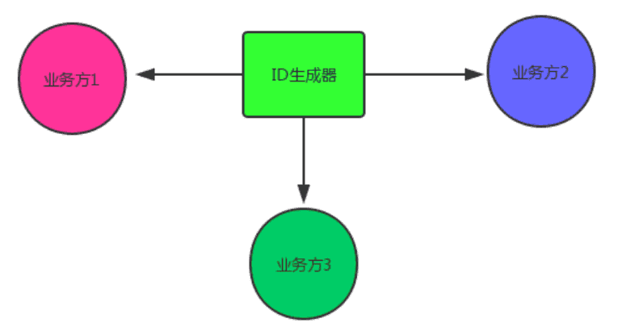
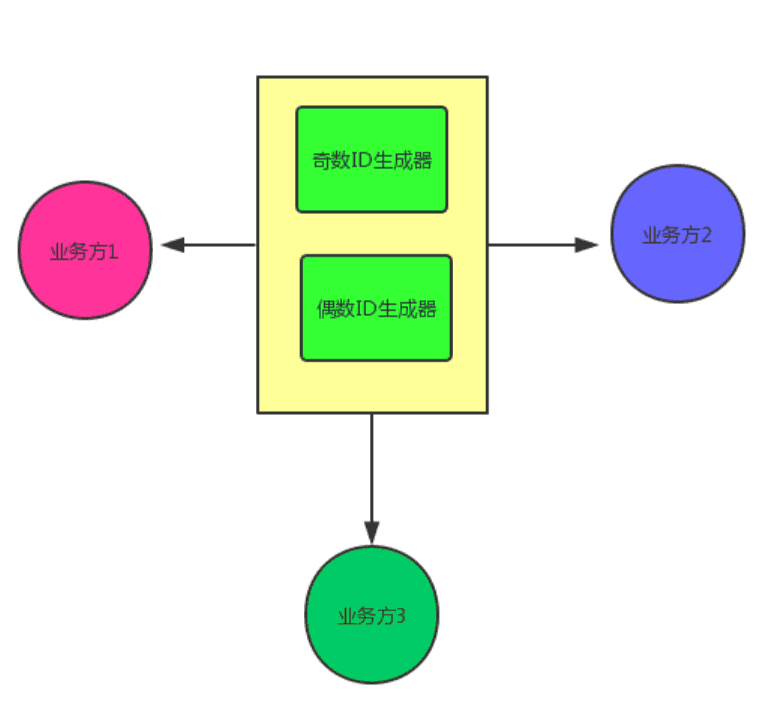
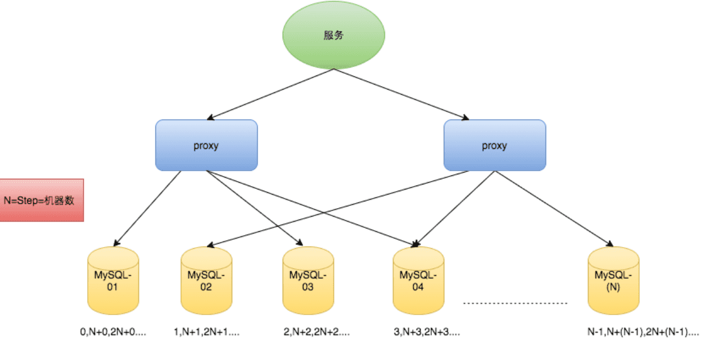

‍

‍

‍

## 分布式概念

‍

### 如何理解微服务和DDD的关系

微服务（Microservices）和领域驱动设计（Domain-Driven Design, DDD）是两种不同的架构和设计方法，但它们可以很好地结合在一起，以实现更高效和可维护的系统。

‍

#### 微服务

微服务是一种架构风格，它将一个大型应用程序拆分为多个小的、独立部署的服务。每个服务通常围绕一个特定的业务功能构建，并且可以独立开发、部署和扩展。

‍

#### 领域驱动设计（DDD）

DDD 是一种设计方法，强调通过业务领域的模型来驱动软件设计。DDD 强调以下几个概念：

* **领域（Domain）** ：业务领域，指的是业务逻辑和规则所在的范围。
* **限界上下文（Bounded Context）** ：明确的边界，定义了特定领域模型的适用范围。
* **实体（Entity）** 、**值对象（Value Object）** 、**聚合（Aggregate）** 、**仓储（Repository）** 等：用于建模业务领域的基本构建块。

‍

‍

#### 微服务与 DDD 的关系

1. **限界上下文与微服务**：DDD 中的限界上下文可以映射为微服务。每个微服务对应一个限界上下文，负责特定的业务功能。
2. **独立性**：DDD 强调限界上下文的独立性，微服务架构也强调服务的独立性。两者结合可以确保服务之间的低耦合。
3. **业务驱动**：DDD 强调以业务需求为中心进行设计，微服务架构可以通过将业务功能拆分为独立的服务来实现这一点。

‍

‍

‍

‍

## 分布式功与过

‍

‍

### 微服务的利与弊

‍

优点

1. **独立部署**：每个微服务可以独立部署和更新，不会影响其他服务。
2. **技术多样性**：不同的微服务可以使用不同的技术栈，选择最适合的工具和语言。
3. **可扩展性**：可以根据需要独立扩展某个微服务，提高资源利用率。
4. **容错性**：一个微服务的故障不会导致整个系统的崩溃，系统具有更高的容错性。
5. **团队独立性**：不同的团队可以负责不同的微服务，减少团队之间的依赖，提高开发效率。
6. 必要性: 一般

‍

缺陷

1. **复杂性增加**：系统由多个服务组成，管理和协调这些服务的复杂性增加。
2. **分布式系统挑战**：需要处理分布式系统的常见问题，如网络延迟、数据一致性、服务发现等。
3. **运维成本**：需要更多的基础设施和工具来管理和监控多个微服务，运维成本增加。
4. **数据管理**：每个微服务可能有自己的数据库，数据管理和一致性变得更加复杂。
5. **性能开销**：服务之间的通信通常通过网络进行，可能会带来额外的性能开销。

‍

‍

‍

## 分布式理论

‍

‍

### 什么是CAP理论和BASE思想？

‍

#### CAP理论

CAP理论（也称为Brewer定理）是分布式系统中的一个基本理论

指出在一个分布式系统中，不可能同时满足以下三个特性：

1. **一致性（Consistency）** ：所有节点在同一时间看到的数据是一致的。
2. **可用性（Availability）** ：每个请求都能收到一个（成功或失败）响应。
3. **分区容错性（Partition Tolerance）** ：系统在遇到任意网络分区故障时，仍然能够继续运作。

‍

CAP主要是在分布式项目下的一个理论。包含了三项，一致性、可用性、分区容错性

* 一致性(Consistency)是指更新操作成功并返回客户端完成后，所有节点在同一时间的数据完全一致(强一致性)，不能存在中间状态。
* 可用性(Availability) 是指系统提供的服务必须一直处于可用的状态，对于用户的每一个操作请求总是能够在有限的时间内返回结果。
* 分区容错性(Partition tolerance) 是指分布式系统在遇到任何网络分区故障时，仍然需要能够保证对外提供满足一致性和可用性的服务，除非是整个网络环境都发生了故障。

‍

CAP理论就是说在分布式系统中，最多只能实现上面的两点。而由于当前的网络硬件肯定会出现延迟丢包等问题，所以考虑最差情况，分区容忍性是一般是需要实现的

‍

虽然 CAP 理论定义是三个要素中只能取两个，但放到分布式环境下来思考，我们会发现必须选择 P（分区容忍）要素，因为网络本身无法做到 100% 可靠，有可能出故障，所以分区是一个必然的现象。如果我们选择了 CA 而放弃了 P，那么当发生分区现象时，为了保证 C，系统需要禁止写入，当有写入请求时，系统返回 error（例如，当前系统不允许写入），这又和 A 冲突了，因为 A 要求返回 no error 和 no timeout。因此，分布式系统理论上不可能选择 CA 架构，只能选择 CP 或者 AP 架构。

‍

‍

#### BASE思想 AP

BASE是CAP理论中AP方案的延伸，核心思想是即使无法做到强一致性（StrongConsistency，CAP的一致性就是强一致性），但应用可以采用适合的方式达到最终一致性（Eventual Consitency）。它的思想包含三方面：

1. **基本可用（Basically Available）** ：系统在出现故障时，允许部分可用性下降，但基本功能仍然可用
2. **软状态（Soft State）** ：系统中的状态可以是临时的，不需要强一致性
3. **最终一致性（Eventual Consistency）** ：系统中的数据最终会达到一致性，但不要求实时一致性

BASE思想强调通过牺牲强一致性来换取系统的高可用性和分区容错性，适用于需要高可用性和可扩展性的分布式系统

‍

BASE理论的核心思想是：BASE是 Basically Available（基本可用）、Soft state（软状态）和 Eventually consistent（最终一致性）的缩写，它接受在短时间内可能存在的不一致性，但保证最终达到一致性。与ACID（原子性、一致性、隔离性、持久性）相比，BASE更注重系统的可用性和可伸缩性，牺牲了严格的即时一致性。

‍

‍

> 首先一个前提，对于分布式系统而言，分区容错性是一个最基本的要求，因此基本上我们在设计分布式系统的时候只能从一致性（C）和可用性（A）之间进行取舍。
>
> 如果保证了一致性（C）：对于节点N1和N2，当往N1里写数据时，N2上的操作必须被暂停，只有当N1同步数据到N2时才能对N2进行读写请求，在N2被暂停操作期间客户端提交的请求会收到失败或超时。显然，这与可用性是相悖的。
>
> 如果保证了可用性（A）：那就不能暂停N2的读写操作，但同时N1在写数据的话，这就违背了一致性的要求。

‍

‍

### 强一致如何实现 CP

什么是强一致性：在分布式存储系统中，强一致性是指系统保证任意时刻数据是一致的，即无论在任何节点上进行的操作，都能立即在所有节点上访问到最新的数据。

通过事务（如ACID事务）确保每次操作都看到最新的数据状态。这通常需要两阶段提交（2PC）或其他复杂的事务协议，但可能导致性能下降。

‍

> 分布式共识算法。其中，Paxos 和 Raft 是两个著名的共识算法，它们可以用于实现分布式系统的强一致性。这些算法通过选举和投票来确保各个节点的操作顺序一致，从而达到强一致性的要求。
>
> 1. Paxos 算法通过多个阶段的提议、投票和决议过程来确保一个值被所有参与者接受。算法包括提议者（Proposer）、接受者（Acceptor）和学习者（Learner）的角色，并且使用一系列编号递增的消息来进行通信，确保在任何时候只有一个提议会被接受。
> 2. Raft 使用了明确的领导者（Leader）角色，简化了状态机复制的过程。领导者负责处理所有的客户端请求并维护集群状态的一致性。它通过日志复制、心跳机制以及选举流程确保在任何时刻都有一个有效的领导者，并保持集群内的日志一致性。
> 3. Raft 可以看作是对 Paxos 算法的一种工程化改进，它保留了 Paxos 对于分布式一致性问题的核心解决方案，同时通过对算法进行模块化和清晰化设计，极大地降低了开发者理解和实施分布式共识协议的难度

‍

‍

‍

## 分布式事务

‍

‍

### 不同方案

来自[link](https://github.com/doocs/advanced-java/blob/main/docs/distributed-system/distributed-transaction.md)

[分布式事务二阶段和三阶段？ | Javaᶜⁿ 面试突击 (javacn.site)](https://javacn.site/interview/springcloud/2pcvs3pc.html#%E7%89%B9%E6%AE%8A%E8%AF%B4%E6%98%8E)

‍

1. **两阶段提交（2PC）** ：协调者在第一阶段准备所有参与者的事务，在第二阶段提交所有参与者的事务。
2. **三阶段提交（3PC）** ：在两阶段提交的基础上增加了一个准备阶段，以减少阻塞的可能性。
3. **TCC（Try-Confirm-Cancel）** ：将事务分为三个阶段：Try（尝试执行），Confirm（确认执行），Cancel（取消执行）。
4. **消息队列**：通过消息队列实现最终一致性。
5. **Saga模式**：将长事务拆分为一系列短事务，每个短事务都有对应的补偿操作。

‍

‍

#### TCC 方案

TCC 的全称是：Try、Confirm、Cancel。

* Try 阶段：这个阶段说的是对各个服务的资源做检测以及对资源进行**锁定或者预留**。
* Confirm 阶段：这个阶段说的是在各个服务中**执行实际的操作**。
* Cancel 阶段：如果任何一个服务的业务方法执行出错，那么这里就需要**进行补偿**，就是执行已经执行成功的业务逻辑的回滚操作。（把那些执行成功的回滚）

‍

这种方案说实话几乎很少人使用，我们用的也比较少，但是也有使用的场景。因为这个**事务回滚**实际上是**严重依赖于你自己写代码来回滚和补偿**了，会造成补偿代码巨大，非常之恶心。

比如说我们，一般来说跟**钱**相关的，跟钱打交道的，**支付**、**交易**相关的场景，我们会用 TCC，严格保证分布式事务要么全部成功，要么全部自动回滚，严格保证资金的正确性，保证在资金上不会出现问题。

而且最好是你的各个业务执行的时间都比较短。

但是说实话，一般尽量别这么搞，自己手写回滚逻辑，或者是补偿逻辑，实在太恶心了，那个业务代码很难维护。

‍

‍

‍

#### 本地消息表

本地消息表其实是国外的 ebay 搞出来的这么一套思想。

‍

这个大概意思是这样的：

1. A 系统在自己本地一个事务里操作同时，插入一条数据到消息表；
2. 接着 A 系统将这个消息发送到 MQ 中去；
3. B 系统接收到消息之后，在一个事务里，往自己本地消息表里插入一条数据，同时执行其他的业务操作，如果这个消息已经被处理过了，那么此时这个事务会回滚，这样**保证不会重复处理消息**；
4. B 系统执行成功之后，就会更新自己本地消息表的状态以及 A 系统消息表的状态；
5. 如果 B 系统处理失败了，那么就不会更新消息表状态，那么此时 A 系统会定时扫描自己的消息表，如果有未处理的消息，会再次发送到 MQ 中去，让 B 再次处理；
6. 这个方案保证了最终一致性，哪怕 B 事务失败了，但是 A 会不断重发消息，直到 B 那边成功为止。

‍

这个方案说实话最大的问题就在于**严重依赖于数据库的消息表来管理事务**啥的，会导致如果是高并发场景咋办呢？咋扩展呢？所以一般确实很少用。

​

‍

‍

#### 可靠消息最终一致性方案

这个的意思，就是干脆不要用本地的消息表了，直接基于 MQ 来实现事务。比如阿里的 RocketMQ 就支持消息事务。

‍

大概流程

1. A 系统先发送一个 prepared 消息到 mq，如果这个 prepared 消息发送失败那么就直接取消操作别执行了；
2. 如果这个消息发送成功过了，那么接着执行本地事务，如果成功就告诉 mq 发送确认消息，如果失败就告诉 mq 回滚消息；
3. 如果发送了确认消息，那么此时 B 系统会接收到确认消息，然后执行本地的事务；
4. mq 会自动**定时轮询**所有 prepared 消息回调你的接口，问你，这个消息是不是本地事务处理失败了，所有没发送确认的消息，是继续重试还是回滚？一般来说这里你就可以查下数据库看之前本地事务是否执行，如果回滚了，那么这里也回滚吧。这个就是避免可能本地事务执行成功了，而确认消息却发送失败了。
5. 这个方案里，要是系统 B 的事务失败了咋办？重试咯，自动不断重试直到成功，如果实在是不行，要么就是针对重要的资金类业务进行回滚，比如 B 系统本地回滚后，想办法通知系统 A 也回滚；或者是发送报警由人工来手工回滚和补偿。
6. 这个还是比较合适的，目前国内互联网公司大都是这么玩儿的，要不你举用 RocketMQ 支持的...

‍

​

‍

‍

#### 最大努力通知方案(差不多意思)

这个方案的大致意思就是：

1. 系统 A 本地事务执行完之后，发送个消息到 MQ；
2. 这里会有个专门消费 MQ 的**最大努力通知服务**，这个服务会消费 MQ 然后写入数据库中记录下来，或者是放入个内存队列也可以，接着调用系统 B 的接口；
3. 要是系统 B 执行成功就 ok 了；要是系统 B 执行失败了，那么最大努力通知服务就定时尝试重新调用系统 B，反复 N 次，最后还是不行就放弃。

‍

‍

#### 你们公司是如何处理分布式事务的？

特别严格的场景，用的是 TCC 来保证强一致性；然后其他的一些场景基于阿里的 RocketMQ 来实现分布式事务

‍

你找一个严格资金要求绝对不能错的场景，你可以说你是用的 TCC 方案；如果是一般的分布式事务场景，订单插入之后要调用库存服务更新库存，库存数据没有资金那么的敏感，可以用可靠消息最终一致性方案。

‍

‍

### Seata事务管理原理

Seata框架(XA、AT、TCC) / MQ解耦发送(简单)

‍

Seata事务管理中有三个重要的角色：

* TC (Transaction Coordinator) - 事务协调者：维护全局和分支事务的状态，协调全局事务提交或回滚。
* TM (Transaction Manager) - 事务管理器：定义全局事务的范围、开始全局事务、提交或回滚全局事务。
* RM (Resource Manager) - 资源管理器：管理分支事务处理的资源，与TC交谈以注册分支事务和报告分支事务的状态，并驱动分支事务提交或回滚。

‍

​

‍

​

‍

​

TCC这个需要手动写代码, 算了

‍

描述项目中采用的哪种方案（seata | MQ）

* seata的XA模式，CP，需要互相等待各个分支事务提交，可以保证强一致性，**性能差**    (银行业务)
* seata的AT模式，AP，底层使用undo log 实现，**性能好** (互联网业务)
* seata的TCC模式，AP，性能较好，不过需要**人工编码**实现    (银行业务)
* MQ模式实现分布式事务，在A服务写数据的时候，需要在同一个事务内发送消息到另外一个事务，异步，**性能最好** (互联网业务) 推荐, 勿增实体

‍

#### TCC模式与AT模式对比

‍

TCC模式

**优点**：

* **灵活性高**：可以自定义每个阶段的逻辑，适用于复杂的业务场景。
* **隔离性好**：每个阶段的操作都是独立的，减少了资源锁定的时间。

**缺点**：

* **实现复杂**：需要开发者实现Try、Confirm、Cancel三个阶段的逻辑。
* **补偿成本高**：需要处理每个阶段的补偿操作，增加了开发和维护成本。

‍

AT模式

**优点**：

* **实现简单**：通过代理数据库操作，开发者无需关心事务的具体实现。
* **性能较好**：通过优化数据库操作，减少了事务的开销。

**缺点**：

* **灵活性低**：适用于简单的业务场景，不适合复杂的业务逻辑。
* **依赖数据库**：需要数据库支持事务操作，无法跨数据库实现。

‍

‍

‍

‍

## 分布式ID

‍

‍

### 方案

‍

‍

‍

#### 1. UUID

UUID（Universally Unique Identifier）是一种通用的唯一标识符标准。UUID的优点是简单易用，但它的缺点是长度较长，且不具备有序性。

```java
import java.util.UUID;

public class UUIDGenerator {
    public static String generateUUID() {
        return UUID.randomUUID().toString();
    }
}
```

‍

优：

1. 本地生成没有了网络之类的消耗，效率非常高

‍

缺：

1. 不易于存储：UUID太长，16字节128位，通常以36长度的字符串表示，很多场景不适用。
2. 信息不安全：基于MAC地址生成UUID的算法可能会造成MAC地址泄露，这个漏洞曾被用于寻找梅丽莎病毒的制作者位置。

‍

#### 2. 数据库自增ID

使用数据库的自增ID是最简单的方式，但在分布式系统中需要解决多个数据库实例之间的ID冲突问题。

使用 "事务"进行强一致的做法可能不怎么实用

可以利用 MySQL 中的自增属性 auto_increment 来生成全局唯一 ID，也能保证趋势递增。 但这种方式太依赖 DB，如果数据库挂了那就非常容易出问题。

优：

1. 非常简单，利用现有数据库系统的功能实现，成本小，有DBA专业维护。
2. ID号单调自增，可以实现一些对ID有特殊要求的业务。

缺：

1. 强依赖DB，当DB异常时整个系统不可用，属于致命问题。配置主从复制可以尽可能的增加可用性，但是数据一致性在特殊情况下难以保证。主从切换时的不一致可能会导致重复发号。
2. ID发号性能瓶颈限制在单台MySQL的读写性能。

‍

‍

#### 3. Snowflake算法

Snowflake是Twitter开源的分布式ID生成算法，生成的ID是64位的长整型，具备有序性和高性能

这种方案把64-bit分别划分成多段（机器、时间）

‍

优：

1. 毫秒数在高位，自增序列在低位，整个ID都是趋势递增的
2. 本地生成没有了网络之类的消耗，效率非常高
3. 可以根据自身业务特性分配bit位，非常灵活。

缺：

1. 强依赖机器时钟，如果机器上时钟回拨，会导致发号重复或者服务会处于不可用状态

‍

#### 4. Leaf Segment模式

Leaf是美团点评开源的分布式ID生成系统，采用了号段模式（Segment）和Snowflake模式。号段模式通过数据库预分配一段ID，减少了数据库的访问频率。

‍

#### 5. Redis

使用Redis的自增特性生成分布式ID，具有高性能和高可用性。

redisTemplate.opsForValue().increment(key);

```java
@Component
public class RedisIdGenerator {

    @Autowired
    private RedisTemplate<String, Object> redisTemplate;

    public long generateId(String key) {
        return redisTemplate.opsForValue().increment(key);
    }

    }
}

        String key = "unique_id";
        long id = idGenerator.generateId(key);
        System.out.println("Generated ID: " + id);
```

‍

‍

‍

### 分布式id

‍

#### 分布式ID的要求

1.全局唯一性：不能出现重复的ID号，既然是唯一标识，这是最基本的要求。  
2.趋势递增：在MySQL InnoDB引擎中使用的是聚集索引，由于多数RDBMS使用B-tree的数据结构来存储索引数据，在主键的选择上面我们应该尽量使用有序的主键保证写入性能。  
3.单调递增：保证下一个ID一定大于上一个ID，例如事务版本号、IM增量消息、排序等特殊需求。  
4.信息安全：如果ID是连续的，恶意用户的扒取工作就非常容易做了，直接按照顺序下载指定URL即可；如果是订单号就更危险了，竞对可以直接知道我们一天的单量。所以在一些应用场景下，会需要ID无规则、不规则。  
5.分布式id里面最好包含时间戳，这样就能够在开发中快速了解这个分布式id的生成时间

> 上述123对应三类不同的场景，3和4需求还是互斥的，所以无法使用同一个方案满足。

‍

#### 分布式ID系统要求

1. 可用性高：就是我用户发了一个获取分布式id的请求，那么你服务器就要保证99.999%的情况下给我创建一个分布式id
2. 延迟低：就是我用户给你一个获取分布式id的请求，那么你服务器给我创建一个分布式id的速度就要快
3. 高QPS：这个就是用户一下子有10万个创建分布式id请求同时过去了，那么你服务器要顶的住，你要一下子给我成功创建10万个分布式id

‍

### 分布式ID的实现

‍

#### Redis

Redis为单线程的，所以操作为原子操作，利用`incrby`​命令可以生成唯一的递增ID。

‍

##### 单机架构

> 业务瓶颈，网络的最大吞吐量和最大连接数，

‍

##### 集群架构

> 加入步长 ， 业务瓶颈依旧是上面的

‍

#### MySQL - Flicker

基于数据库主键自增的方案，名为`Flicker`​。主要是利用MySQL的自增主键来实现分布式ID。

以下为`Flicker`​实现分布式ID的主流做法：

‍

##### 1、需要单独建立一个数据库实例：flicker

```text
create database `flicker`;
```

‍

##### 2、创建一张表：sequence_id

```text
create table sequence_id(
    id bigint(20) unsigned NOT NULL auto_increment, 
    stub char(10) NOT NULL default '',
    PRIMARY KEY (id),
    UNIQUE KEY stub (stub)
) ENGINE=MyISAM;
```

为什么用`MyISAM`​？不用`InnoDB`​？个人推测原因是：`flicker`​算法出来的时候，MySQL的默认引擎还依旧是`MyISAM`​而不是`InnoDB`​，作者只是想用默认引擎而已，并无其他原因。

* stub: 票根，对应需要生成 Id 的业务方编码，可以是项目名、表名甚至是服务器 IP 地址。
* stub 要设置为唯一索引

‍

##### 3、使用以下SQL来获取ID

```text
REPLACE INTO ticket_center (stub) VALUES ('test');  
SELECT LAST_INSERT_ID();
```

​`Replace into`​ 先尝试插入数据到表中，如果发现表中已经有此行数据（根据主键或者唯一索引判断）则先删除此行数据，然后插入新的数据， 否则直接插入新数据。  
一般`stub`​为特殊的相同的值。

这样，一个分布式ID系统算是可以搭建运行了。但是，有人要问：“这是一个单实例、单点的系统，万一挂了，岂不是影响所有关联的业务方？”

‍

##### 改进升华

是的。确实如此，因此又有人说：“可以利用MySQL主从模式，主库挂了，使用从库。”这只能算是一种比较low的策略，因为如果主库挂了，从库没来得及同步，就会生成重复的ID。有没有更好的方法呢？我们可以使用“双主模式“，也就是有两个MySQL实例，这两个都能生成ID。  
如图所示，我们原来的模式：

‍



‍

双主模式是该怎么样呢？如何保持唯一性？  
我们可以让一台实例生成奇数ID，另一台生成偶数ID。

奇数那一台：

```text
set @@auto_increment_offset = 1;     -- 起始值
set @@auto_increment_increment = 2;  -- 步长
```

偶数那一台：

```text
set @@auto_increment_offset = 2;     -- 起始值
set @@auto_increment_increment = 2;  -- 步长
```

当两台都OK的时候，随机取其中的一台生成ID；若其中一台挂了，则取另外一台生成ID。

‍



‍

细心会发现，N个节点，只要起始值为1，2，…N，然后步长为N，就会生成各不相同的ID。

最终形态

‍

​

‍

##### 总结

优点：

* 简单。充分利用了数据库自增 ID 机制，生成的 ID 有序递增。
* ID递增

缺点：

* 系统水平扩展比较困难，比如定义好了步长和机器台数之后，如果要添加机器该怎么做？假设现在只有一台机器发号是1,2,3,4,5（步长是1），这个时候需要扩容机器一台。可以这样做：把第二台机器的初始值设置得比第一台超过很多，比如14（假设在扩容时间之内第一台不可能发到14），同时设置步长为2，那么这台机器下发的号码都是14以后的偶数。然后摘掉第一台，把ID值保留为奇数，比如7，然后修改第一台的步长为2。让它符合我们定义的号段标准，对于这个例子来说就是让第一台以后只能产生奇数。扩容方案看起来复杂吗？貌似还好，现在想象一下如果我们线上有100台机器，这个时候要扩容该怎么做？简直是噩梦。所以系统水平扩展方案复杂难以实现。
* ID没有了单调递增的特性，只能趋势递增，这个缺点对于一般业务需求不是很重要，可以容忍。
* 数据库压力还是很大，每次获取ID都得读写一次数据库，只能靠堆机器来提高性能。

‍

#### Mongodb - ObjectId

> 官方文档链接 ： [https://docs.mongodb.com/manual/reference/method/ObjectId/](https://docs.mongodb.com/manual/reference/method/ObjectId/)

​`ObjectId`​（ *&lt;十六进制&gt;*  ）

返回一个新的[ObjectId](https://docs.mongodb.com/manual/reference/bson-types/#objectid)值。12字节的[ObjectId](https://docs.mongodb.com/manual/reference/bson-types/#objectid) 值包括：

* 一个4字节的*时间戳记值*，代表自Unix时代以来以秒为单位的ObjectId的创建
* 5字节*随机值*
* 3字节*递增计数器*，初始化为随机值

由24位十六进制表示，好处就是可以直接根据ID调用[`ObjectId.getTimestamp()`](https://docs.mongodb.com/manual/reference/method/ObjectId.getTimestamp/#ObjectId.getTimestamp)​来获取时间搓。

#### 利用zookeeper生成唯一ID

zookeeper主要通过其znode数据版本来生成序列号，可以生成32位和64位的数据版本号，客户端可以使用这个版本号来作为唯一的序列号。

很少会使用zookeeper来生成唯一ID。主要是由于需要依赖zookeeper，并且是多步调用API，如果在竞争较大的情况下，需要考虑使用分布式锁。因此，性能在高并发的分布式环境下，也不甚理想。

‍

‍

#### 工程落地经验 - 雪花

##### hutools工具包

地址：[https://github.com/looly/hutool](https://github.com/looly/hutool)

##### SpringBoot整合雪花算法

引入hutool工具类

```text
<dependency>
    <groupId>cn.hutool</groupId>
    <artifactId>hutool-all</artifactId>
    <version>5.3.1</version>
</dependency>
```

整合

```text
/**
 * 雪花算法
 *
 * @author: 陌溪
 * @create: 2020-04-18-11:08
 */
public class SnowFlakeDemo {
    private long workerId = 0;
    private long datacenterId = 1;
    private Snowflake snowFlake = IdUtil.createSnowflake(workerId, datacenterId);

    @PostConstruct
    public void init() {
        try {
            // 将网络ip转换成long
            workerId = NetUtil.ipv4ToLong(NetUtil.getLocalhostStr());
        } catch (Exception e) {
            e.printStackTrace();
        }
    }

    /**
     * 获取雪花ID
     * @return
     */
    public synchronized long snowflakeId() {
        return this.snowFlake.nextId();
    }

    public synchronized long snowflakeId(long workerId, long datacenterId) {
        Snowflake snowflake = IdUtil.createSnowflake(workerId, datacenterId);
        return snowflake.nextId();
    }

    public static void main(String[] args) {
        SnowFlakeDemo snowFlakeDemo = new SnowFlakeDemo();
        for (int i = 0; i < 20; i++) {
            new Thread(() -> {
                System.out.println(snowFlakeDemo.snowflakeId());
            }, String.valueOf(i)).start();
        }
    }
}
```

得到结果

```text
1251350711346790400
1251350711346790402
1251350711346790401
1251350711346790403
1251350711346790405
1251350711346790404
1251350711346790406
1251350711346790407
1251350711350984704
1251350711350984706
1251350711350984705
1251350711350984707
1251350711350984708
1251350711350984709
1251350711350984710
1251350711350984711
1251350711350984712
1251350711355179008
1251350711355179009
1251350711355179010
```

‍

‍

‍

### 生成全局唯一ID的雪花算法就无敌了吗? 或者说普通的基于工具类的雪花无敌了吗?

> 雪花算法确实不能保证id唯一，在有些情况下，时间戳主要是依赖服务器时间的，有可能服务器会发生时钟回拨现象，导致id重复，可以自定义实现雪花算法，把workid改成从redis中获取，这样的话生成的id是唯一的
>
> 还涉及到如何保证多台机器的时钟是一致的问题... 在Linux那篇里面
>
> 可以尝试用 Redis 进行获取, 因为 Redis是单线程模型, 会逐个给出唯一id, 并且化分布为单机保证唯一

‍

#### 1. 雪花算法的基本原理

* **ID组成**：  
  雪花算法生成的ID通常由以下几部分构成：

  * **时间戳**：一般精确到毫秒，确保在时间上单调递增。
  * **工作机器ID（workerId/datacenterId）** ：用来区分不同的机器或节点。
  * **序列号**：在同一毫秒内的多个请求使用，确保在同一时间粒度内也不会重复。
* **设计初衷**：  
  利用分布式系统中各个节点**独立生成ID**而无需全局协调，从而达到高性能和低延迟。

‍

‍

#### 2. 雪花算法的局限性与潜在问题

* **时间戳依赖问题**：

  * **时钟回拨**：雪花算法强依赖于服务器的系统时钟，如果出现时钟回拨（例如NTP调整、手动修改等），可能导致时间戳不再单调递增，从而产生重复的ID或ID错乱。
  * **多台机器时间不一致**：在分布式环境中，各台机器的时间同步非常关键，如果同步不严格，也会引入风险。
* **工作机器ID的分配**：

  * **静态配置风险**：如果机器ID是硬编码或手动配置，容易出错；而多个节点之间如果没有协商，可能会出现冲突。
  * **动态变化问题**：节点的上下线和扩缩容时，如何动态分配和回收workerId也是一个挑战。
* **序列号边界问题**：

  * 在高并发场景下，同一毫秒内请求量激增，序列号可能达到上限，此时通常会阻塞等待下一个毫秒，可能带来性能瓶颈。

‍

‍

#### 3. 改进思路与扩展方案

‍

* **使用Redis等外部协调组件**：

  * **workerId动态获取**：可以将workerId的获取和管理交给Redis。由于Redis是单线程模型，在分布式环境下通过Redis来分配和记录已分配的workerId，可以有效避免静态配置带来的冲突。
  * **生成ID的集中化控制**：Redis的原子性命令（例如 INCR）可以用于生成全局唯一递增ID，但需注意单机Redis的瓶颈问题。
  * **防止时钟回拨**：可以在生成ID时引入额外的逻辑，例如记录上一次的时间戳，如果检测到当前时间小于上一次时间，可以采取等待或者调整偏移量的策略，从而避免重复ID。
* **时间同步机制**：

  * **NTP服务**：保证每台机器都与可靠的时间服务器进行同步，尽可能减少时钟误差。
  * **分布式协调工具**：使用 ZooKeeper 或 Consul 等工具对系统时间进行监控和校正，确保跨机器时间的一致性。
* **其他替代方案**：

  * **Redis INCR法**：直接利用 Redis 的自增命令生成唯一ID，虽然在单机模式下保证了唯一性，但需要考虑高并发下的性能和单点故障问题。
  * **UUID与改进版雪花结合**：有的方案会把UUID的**随机性**与雪花算法的**高性能**结合起来，兼顾全局唯一性和分布式环境下的高并发性能。

‍

‍

#### 4. 综合结论

* **工具类的传统雪花算法肯定不是“无敌”的**：  
  虽然雪花算法在大多数场景下能够高效生成唯一ID，但它依赖于服务器时间和静态的workerId配置，在特殊场景下可能会出现重复或错乱问题。
* 必须**通过外部组件和协调机制可进一步增强唯一性**：  
  例如，利用Redis分布式分配workerId、利用NTP保证时间同步、检测并处理时钟回拨等措施，可以提高系统的健壮性和ID生成的唯一性。
* **设计时需要权衡**：  
  无论是采用单纯的工具类实现还是引入外部组件，都需要考虑分布式环境下的可扩展性、性能瓶颈以及单点故障风险，选择最适合当前业务场景的方案。

‍

‍

## 分布式锁

> Redis那边有

‍

### 可作为分布式锁的中间件

1. **Redis**：通过设置键的过期时间和原子操作来实现分布式锁。
2. **Zookeeper**：通过创建临时节点来实现分布式锁。
3. **Etcd**：通过分布式键值存储和租约机制来实现分布式锁。
4. **Consul**：通过分布式键值存储和会话机制来实现分布式锁。

‍

‍

### 分布式锁实现

‍

‍

#### 数据库

在数据库中创建一个表，表中包含方法名等字段，并在方法名字段上创建唯一索引，想要执行某个方法，就使用这个方法名向表中插入数据，成功插入则获取锁，执行完成后删除对应的行数据释放锁。

```sql
DROP TABLE IF EXISTS `method_lock`;
CREATE TABLE `method_lock` (
  `id` int(11) unsigned NOT NULL AUTO_INCREMENT COMMENT '主键',
  `method_name` varchar(64) NOT NULL COMMENT '锁定的方法名',
  `desc` varchar(255) NOT NULL COMMENT '备注信息',
  `update_time` timestamp NOT NULL DEFAULT CURRENT_TIMESTAMP ON UPDATE CURRENT_TIMESTAMP,
  PRIMARY KEY (`id`),
  UNIQUE KEY `uidx_method_name` (`method_name`) USING BTREE
) ENGINE=InnoDB AUTO_INCREMENT=3 DEFAULT CHARSET=utf8 COMMENT='锁定中的方法';
```

执行某个方法后，插入一条记录

```sql
INSERT INTO method_lock (method_name, desc) VALUES ('methodName', '测试的methodName');
```

因为我们对method_name做了唯一性约束，这里如果有多个请求同时提交到数据库的话，数据库会保证只有一个操作可以成功，那么我们就可以认为操作成功的那个线程获得了该方法的锁，可以执行方法体内容。

成功插入则获取锁，执行完成后删除对应的行数据释放锁：

```sql
delete from method_lock where method_name ='methodName';
```

‍

‍

优点：易于理解实现

缺点：

1. 没有锁失效自动删除机制，因为有可能出现成功插入数据后，服务器宕机了，对应的数据没有被删除，当服务恢复后一直获取不到锁，所以，需要在表中新增一列，用于记录失效时间，并且需要有定时任务清除这些失效的数据
2. 吞吐量很低
3. 单点故障问题
4. 轮询获取锁状态方式太过低效

‍

‍

#### 基于Redis

NX是Redis提供的一个原子操作，如果指定key存在，那么NX失败，如果不存在会进行set操作并返回成功。我们可以利用这个来实现一个分布式的锁，主要思路就是，set成功表示获取锁，set失败表示获取失败，失败后需要重试。再加上EX参数可以让该key在超时之后自动删除。

```java
public void lock(String key, String request, int timeout) throws InterruptedException {
    Jedis jedis = jedisPool.getResource();

    while (timeout >= 0) {
        String result = jedis.set(LOCK_PREFIX + key, request, SET_IF_NOT_EXIST, SET_WITH_EXPIRE_TIME, DEFAULT_EXPIRE_TIME);
        if (LOCK_MSG.equals(result)) {
            jedis.close();
            return;
        }
        Thread.sleep(DEFAULT_SLEEP_TIME);
        timeout -= DEFAULT_SLEEP_TIME;
    }
}
```

‍

优点：

1. 吞吐量高
2. 有锁失效自动删除机制，保证不会阻塞所有流程

‍

缺点:

1. 单点故障问题
2. 锁超时问题：如果A拿到锁之后设置了超时时长，但是业务还未执行完成且锁已经被释放，此时其他进程就会拿到锁从而执行相同的业务。如何解决？Redission定时延长超时时长避免过期。为什么不直接设置为永不超时？为了防范业务方没写解锁方法或者发生异常之后无法进行解锁的问题
3. 轮询获取锁状态方式太
4. 过低效

‍

‍

#### 基于ZooKeeper

1. 当客户端对某个方法加锁时，在Zookeeper上的与该方法对应的指定节点的目录下，生成一个临时有序节点
2. 判断该节点是否是当前目录下最小的节点，如果是则获取成功；如果不是，则获取失败，并获取上一个临时有序节点，对该节点进行监听，当节点删除时通知唯一的客户端

‍

优点：

1. 解决锁超时问题。因为Zookeeper的写入都是顺序的，在一个节点创建之后，其他请求再次创建便会失败，同时可以对这个节点进行Watch，如果节点删除会通知其他节点抢占锁
2. 能通过watch机制高效通知其他节点获取锁，避免惊群效应
3. 有锁失效自动删除机制，保证不会阻塞所有流程

‍

缺点：

1. 性能不如Redis
2. 强依赖zk，如果原来系统不用zk那就需要维护一套zk

‍

‍

### 分布式锁与并发处理综合问题, 假设我使用Redisson分布式锁

* 如何优化锁误删的问题？
* 在锁误删中加锁和解锁的操作是如何实现的？
* 在锁误删场景中，如果线程成功获取到锁，但该线程的业务逻辑执行时间超过锁的超时时间，如何处理？
* 线程在感知到锁快要超时的时候，怎么进行续期操作？

‍

* **防止误删**：通过给每次加锁设置唯一标识，并在解锁时使用Lua脚本进行原子性验证，确保只有锁的真正持有者才能释放锁。
* **加锁解锁实现**：Redisson利用Redis的SET NX PX命令实现加锁，通过Lua脚本比较唯一标识并删除锁来实现安全解锁。
* **业务超时问题**：内置看门狗机制自动续期，防止业务逻辑执行时间超过锁租期导致锁失效。
* **续期操作**：通过定时任务在后台自动调用PEXPIRE等命令延长锁有效期，确保业务线程在锁快过期前获得续期保护。

‍

‍

#### 1. 如何优化锁误删的问题？

* **使用唯一标识**：  
  每个获取锁的线程都会生成一个全局唯一的标识（例如UUID或线程ID+随机串）。在加锁时，这个唯一标识会作为锁的值存储到Redis中。这样，在解锁时可以通过Lua脚本检查锁中的值，确保只有锁的持有者才能释放锁，从而防止误删其他线程的锁。
* **原子化解锁操作**：  
  Redisson内部使用Lua脚本来实现解锁（见下文的加解锁实现），确保解锁操作是原子的，避免因为网络延迟或多线程并发导致错误删除。
* **锁续期机制（Watchdog）** ：  
  针对锁超时导致业务逻辑未完成时产生的风险，Redisson内置了看门狗机制，会自动续期锁，避免因锁超时而误删或失效。

‍

‍

#### 2. 锁误删中加锁和解锁的操作是如何实现的？

* **加锁过程**：  
  Redisson通过对Redis执行类似如下的SET命令实现加锁：

  ```redis
  SET lock_key unique_value NX PX leaseTime
  ```

  其中：

  * ​`NX`​ 确保只有在键不存在时才能设置成功；
  * ​`PX leaseTime`​ 设置锁的超时时间（单位毫秒）；
  * ​`unique_value`​ 是当前线程独有的标识，保证每次加锁都是唯一的。
* **解锁过程**：  
  解锁时，Redisson使用Lua脚本来保证原子性，脚本大致如下：

  ```lua
  if redis.call("get", KEYS[1]) == ARGV[1] then
      return redis.call("del", KEYS[1])
  else
      return 0
  end
  ```

  这样，只有当当前Redis键的值与当前线程持有的唯一标识匹配时，才会删除锁，否则不做任何操作，从而防止误删。

‍

‍

#### 3. 在锁误删场景中，如果线程成功获取到锁，但业务逻辑执行时间超过锁的超时时间，如何处理？

* **Watchdog自动续期**：  
  Redisson内置的看门狗机制会在锁获取后启动一个定时任务，该任务会周期性地检查当前锁是否还被持有（根据唯一标识验证），并在锁超时之前自动延长锁的过期时间。

  * 默认情况下，Redisson的锁租期通常设置为30秒，如果业务执行超过30秒，看门狗会自动续期，保持锁的有效性，直到业务完成后再正常释放。
* **防止业务延迟风险**：  
  如果业务执行时间非常长，看门狗可以持续续期，但如果业务逻辑挂起或卡死，锁会在超时后自动释放，防止锁永久占用资源。

‍

‍

#### 4. 线程在感知到锁快要超时的时候，怎么进行续期操作？

* **内置续期机制**：  
  Redisson的看门狗（Watchdog）在加锁成功后会自动启动，它会每隔一段时间（例如默认是1/3的锁租期时间）检查锁的剩余时间。如果发现锁即将超时且当前线程还在执行业务逻辑，则通过内部的续期操作（同样通过Lua脚本）自动延长锁的超时时间。
* **自动续期原理**：  
  看门狗机制在后台定时任务中，会调用类似于修改锁的过期时间的Redis命令（实际上内部可能使用 `PEXPIRE`​ 命令）来延长当前锁的有效期。这一操作同样会检查当前锁的持有者标识，确保只有正确的锁持有者可以续期。

‍

‍

‍

## 接口幂等顺序处理

‍

### 接口幂等性和防重设计的区别

​`防重设计`​ 和 `幂等设计`​，其实是有区别的。防重设计主要为了避免产生重复数据，对接口返回没有太多要求。而幂等设计除了避免产生重复数据之外，还要求每次请求都返回一样的结果。

‍

### 分布式服务的接口幂等性

‍

* 数据库唯一索引    增
* token+redis    增改
* 分布式锁    增改

‍

分布式锁，性能较低  
使用token+redis来实现，性能较好

‍

token+redis

* 请求第一次, 获取token并存redis, 返回token到前端存储
* 第二次请求就会带有这个token, 服务端去验证一下有了吗, 有才能处理(就一次)

‍

分布式锁

```java
public void saveOrder(Item item) throws InterruptedException {
   //获取锁（重入锁），执行锁的名称
   RLock lock = redissonClient.getLock("heimalock");
    //尝试获取锁，参数分别是：获取锁的最大等待时间（期间会重试），锁自动释放时间，时间单位
   boolean isLock = lock.tryLock(10, TimeUnit.SECONDS);
    try {
        //判断是否获取成功
    if (!isLock) {
          log.info("下单操作获取锁失败,order:{}",item);
           throw new RuntimeException("新增或修改失败");
        }
        //下单操作
    
    } finally {
        //释放锁
    lock.unlock();
    }
}

```

‍

‍

‍

### 接口的幂等性保证实现方案

分布式系统最常遇到的问题之一, 幂等性问题说的就是如何防止接口的**重复无效请求**

幂等性最早是数学里面的一个概念，后来被用于计算机领域，用于表示任意多次请求均与一次请求执行的结果相同，也就是说对于一个接口而言，无论调用了多少次，最终得到的结果都是一样的

‍

幂等性的实现方案通常分为以下几类：

* 前端拦截
* 使用数据库实现幂等性
* 使用 JVM 锁实现幂等性
* 使用分布式锁实现幂等性

‍

其中前端拦截无法防止懂行的人直接绕过前端进行模拟请求的操作。因此后端一定要实现幂等性处理，推荐的做法是使用分布式锁来实现，这样的解决方案更加通用。

‍

幂等性的实现与判断需要消耗一定的资源，因此不应该给每个接口都增加幂等性判断，要根据实际的业务情况和操作类型来进行区分。

例如，进行查询操作和删除操作时就无须进行幂等性判断。查询操作查一次和查多次的结果都是一致的，因此我们无须进行幂等性判断。删除操作也是一样，删除一次和删除多次都是把相关的数据进行删除（这里的删除指的是条件删除而不是删除所有数据），因此也无须进行幂等性判断。

‍

‍

#### 前端拦截

‍

前端拦截是指通过 Web 站点的页面进行请求拦截，比如在用户点击完“提交”按钮后，我们可以把按钮设置为不可用或者隐藏状态，避免用户重复点击

核心的实现代码如下：

```html
<script>
    function subCli(){
        // 按钮设置为不可用
        document.getElementById("btn_sub").disabled="disabled";
        document.getElementById("dv1").innerText = "按钮被点击了~";
    }
</script>
<body style="margin-top: 100px;margin-left: 100px;">
    <input id="btn_sub" type="button"  value=" 提 交 "  onclick="subCli()">
    <div id="dv1" style="margin-top: 80px;"></div>
</body>
```

但前端拦截有一个致命的问题，如果是懂行的程序员或者黑客可以直接绕过页面的 JS 执行，直接**模拟请求**后端的接口，这样的话，我们前端的这些拦截就不能生效了。因此除了前端拦截一部分正常的误操作之外，后端的验证必不可少。

‍

‍

#### 数据库实现

‍

数据库实现幂等性的方案有三个：

* 通过悲观锁来实现幂等性
* 通过唯一索引来实现幂等性
* 通过乐观锁来实现幂等性

‍

‍

##### 1.悲观锁

使用悲观锁实现幂等性，一般是配合事务一起来实现，在没有使用悲观锁时，我们通常的执行过程是这样的，首先来判断数据的状态，执行 SQL 如下：

```sql
select status from table_name where id='xxx';
```

最后再进行状态的修改：

```sql
update table_name set status='xxx';
```

‍

但这种情况因为是**非原子操作**，所以在高并发环境下可能会造成一个业务被执行两次的问题，当一个程序在执行中时，而另一个程序也开始状态判断的操作。因为第一个程序还未来得及更改状态，所以第二个程序也能执行成功，这就导致一个业务被执行了两次。

‍

在这种情况下我们就可以使用悲观锁来避免问题的产生，实现 SQL 如下所示：

```sql
begin;  # 1.开始事务
select * from table_name where id='xxx' for update; # 2.查询状态
insert into table_name (id) values ('xxx'); # 3.添加操作
update table_name set status='xxx'; # 4.更改操作
commit; # 5.提交事务
```

在实现的过程中需要注意以下两个问题：

* 如果使用的是 MySQL 数据库，必须选用 innodb 存储引擎，因为 innodb 支持事务；
* id 字段一定要是**主键或者是唯一索引**，不然会**锁表**，影响其他业务执行。

‍

‍

##### 2.唯一索引

我们可以创建一个**唯一索引**的表来实现幂等性，在每次执行业务之前，先执行插入操作，因为唯一字段就是业务的 ID，因此如果重复插入的话会触发唯一约束而导致插入失败。在这种情况下（插入失败）我们就可以**判定它为重复提交的请求**

唯一索引表的创建示例如下：

```sql
CREATE TABLE `table_name` (
  `id` int NOT NULL AUTO_INCREMENT,
  `orderid` varchar(32) NOT NULL DEFAULT '' COMMENT '唯一id',
  PRIMARY KEY (`id`),
  UNIQUE KEY `uq_orderid` (`orderid`) COMMENT '唯一约束'
) ENGINE=InnoDB;
```

‍

##### 3.乐观锁

乐观锁是指在执行数据操作时（更改或添加）进行加锁操作，其他时间不加锁，因此相比于整个执行过程都加锁的悲观锁来说，它的执行效率要高很多。

乐观锁可以通过版本号来实现，例如以下 SQL：

```sql
update table_name set version=version+1 where version=0;
```

‍

‍

#### JVM 锁实现

JVM 锁实现是指通过 JVM 提供的内置锁如 Lock 或者是 synchronized 来实现幂等性。使用 JVM 锁来实现幂等性的一般流程为：首先通过 Lock 对代码段进行加锁操作，然后再判断此订单是否已经被处理过，如果未处理则开启事务执行订单处理，处理完成之后提交事务并释放锁

JVM 锁存在的最大问题在于，它==只能应用于单机环境==，因为 Lock 本身为单机锁，所以它就不适应于分布式多机环境

‍

‍

#### 分布式锁实现

分布式锁实现幂等性的逻辑是，在每次执行方法之前先判断是否可以获取到分布式锁，如果可以，则表示为第一次执行方法，否则直接舍弃请求即可

需要注意的是分布式锁的 key 必须为业务的**唯一标识**，我们通常使用 Redis 或者 ZooKeeper 来实现分布式锁

‍

‍

‍

### 分布式服务接口请求的顺序如何保证？

> 推荐业务回避

‍

其实分布式系统接口的调用顺序，也是个问题，一般来说是不用保证顺序的。但是有的时候可能确实是需要严格的顺序保证。给大家举个例子，你服务A调用服务B，先插入再删除。好，结果俩请求过去了，落在不同机器上，可能插入请求因为某些原因执行慢了一些，导致删除请求先执行了，此时因为没数据所以啥效果也没有；结果这个时候插入请求过来了，好，数据插入进去了，那就尴尬了。

本来应该是先插入 -> 再删除，这条数据应该没了，结果现在先删除 -> 再插入，数据还存在，最后你死都想不明白是怎么回事。所以这都是分布式系统一些很常见的问题

‍

首先，一般来说，我个人给你的建议是，你们从业务逻辑上最好设计的这个系统不需要这种顺序性的保证，因为一旦引入顺序性保障，会导致系统复杂度上升，而且会带来效率低下，热点数据压力过大，等问题。

下面我给个我们用过的方案吧，简单来说，首先你得用dubbo的一致性hash负载均衡策略，将比如某一个订单id对应的请求都给分发到某个机器上去，接着就是在那个机器上因为可能还是多线程并发执行的，你可能得立即将某个订单id对应的请求扔一个内存队列里去，强制排队，这样来确保他们的顺序性。

但是这样引发的后续问题就很多，比如说要是某个订单对应的请求特别多，造成某台机器成热点怎么办？解决这些问题又要开启后续一连串的复杂技术方案。。。曾经这类问题弄的我们头疼不已，所以，还是建议什么呢？

最好是比如说刚才那种，一个订单的插入和删除操作，能不能合并成一个操作，就是一个删除，或者是什么，避免这种问题的产生。

‍

‍

#### 采用MQ以及内存队列来解决

方式1，也是最友好的方式就是使用消息队列和内存队列来解决，首先我们需要做的就是把需要保证顺序的请求，通过Hash算法分发到特定的同一台机器上，然后机器内部在把请求放到内存队列中，线程从内存队列中获取消费，保证线程的顺序性

但是这种方式能解决99%的顺序性，但是接入服务还是可能存在问题，比如把请求 123，弄成231，导致送入MQ队列中顺序也不一致

‍

#### 采用分布式锁来解决

分布式锁能够保证强一致性，但是因为引入这种重量级的同步机制，会导致并发量急剧降低，因为需要频繁的获取锁，释放锁的操作。

‍

‍

### 如果第一次提交文件至云存储超时，不知道是否保存成功。第二次执行相同操作会执行成功吗

1. **幂等性**：确保文件上传操作是幂等的，即多次执行相同的操作不会导致副作用
2. 业务 - **检查文件存在性**：在第二次执行上传操作前，先检查文件是否已经存在于云存储中。如果存在，则不再重复上传
3. **重试机制**：实现上传操作的重试机制，在第一次上传失败后，自动重试上传操作。

实际上需要从多个角度分析超时, 究竟是在哪一个环境超时了? 比如云服务提供商那边的问题还是我们的开发的业务的问题, 还是用户的网络连接问题, 都会影响判断.

真正的情况还是需要具体问题具体分析

‍

‍

‍

### 防重: 业务上insert前先select（不适用于并发场景）

通常情况下，在保存数据的接口中，我们为了防止产生重复数据，一般会在`insert`​前，先根据`name`​或`code`​字段`select`​一下数据。如果该数据已存在，则不执行`update`​操作，如果不存在，才执行 `insert`​操作

平时在防止产生重复数据时，使用最多的方案。但是该方案不适用于并发场景

‍

具体步骤：

1. **多个请求同时根据id查询用户信息。**
2. **判断余额是否不足100，如果余额不足，则直接返回余额不足。**
3. **如果余额充足，则通过for update再次查询用户信息，并且尝试获取锁。**
4. **只有第一个请求能获取到行锁，其余没有获取锁的请求，则等待下一次获取锁的机会。**
5. **第一个请求获取到锁之后，判断余额是否不足100，如果余额足够，则进行update操作。**
6. **如果余额不足，说明是重复请求，则直接返回成功。**

需要特别注意的是：如果使用的是mysql数据库，存储引擎必须用innodb，因为它才支持事务。此外，这里id字段一定要是主键或者唯一索引，不然会锁住整张表。

悲观锁需要在同一个事务操作过程中锁住一行数据，如果事务耗时比较长，会造成大量的请求等待，影响接口性能。

此外，**每次请求接口很难保证都有相同的返回值，所以不适合幂等性设计场景，但是在防重场景中是可以的使用的。**

* 使用悲观锁可以防止重复数据的产生，但它不能保证每次请求都会返回相同的结果。例如，如果一个操作涉及多个步骤，其中某些步骤可能依赖于外部条件或状态变化，那么即使加了悲观锁，每次请求的结果也可能不同。

‍

‍

## 框架介绍

‍

‍

### Springcloud五大组件和其使用场景

Spring Cloud 是一套工具集，用于构建分布式系统和微服务架构。以下是 Spring Cloud 的五大核心组件及其使用场景：

‍

1. **Spring Cloud Config**：

    * **用途**：集中化配置管理。
    * **使用场景**：在分布式系统中，管理和分发应用程序的配置文件。
2. **Spring Cloud Netflix (Eureka, Ribbon, Hystrix, Zuul)** ：

    * **用途**：服务发现、负载均衡、断路器、API 网关。
    * **使用场景**：

      * **Eureka**：服务注册与发现。
      * **Ribbon**：客户端负载均衡。
      * **Hystrix**：断路器，处理服务故障。
      * **Zuul**：API 网关，路由和过滤请求。
3. **Spring Cloud Gateway**：

    * **用途**：API 网关。
    * **使用场景**：替代 Zuul，提供路由、过滤和限流等功能。
4. **Spring Cloud Sleuth**：

    * **用途**：分布式追踪。
    * **使用场景**：在分布式系统中，跟踪请求的流转路径，帮助调试和监控。
5. **Spring Cloud Stream**：

    * **用途**：消息驱动的微服务。
    * **使用场景**：构建基于消息的微服务，支持多种消息中间件（如 Kafka、RabbitMQ）。

‍

‍

#### SpringCloud常见组件？

SpringCloud包含的组件很多，有很多功能是重复的。其中最常用组件包括：

‍

•注册中心组件：Eureka、Nacos等 consul（go实现）

•负载均衡组件：Ribbon

•远程调用组件：OpenFeign

•网关组件：Zuul、Gateway

•服务保护组件：Hystrix、Sentinel

•服务配置管理组件：SpringCloudConfig、Nacos

‍

早期我们一般认为的Spring Cloud五大组件是

* Eureka : 注册中心
* Ribbon : 负载均衡
* Feign : 远程调用
* Hystrix : 服务熔断
* Zuul/Gateway : 网关

‍

随着SpringCloudAlibba在国内兴起 , 我们项目中使用了一些阿里巴巴的组件

‍

* 注册中心/配置中心 Nacos
* 负载均衡 Ribbon
* 服务调用 Feign
* 服务保护 sentinel
* 服务网关 Gateway

‍

‍

## 注册中心

‍

‍

### Nacos的服务注册表结构(分级存储)是怎样的

‍

Nacos采用了数据的分级存储模型，最外层是Namespace，用来隔离环境。然后是Group，用来对服务分组。接下来就是服务（Service）了，一个服务包含多个实例，但是可能处于不同机房，因此Service下有多个集群（Cluster），Cluster下是不同的实例（Instance）

‍

对应到Java代码中，Nacos采用了一个多层的Map来表示。结构为Map<String, Map<String, Service>>，其中最外层Map的key就是namespaceId，值是一个Map。内层Map的key是group拼接serviceName，值是Service对象。Service对象内部又是一个Map，key是集群名称，值是Cluster对象。而Cluster对象内部维护了Instance的集合。

‍

‍

### Nacos如何支撑数十万服务注册压力？

Nacos内部接收到注册的请求时，不会立即写数据，而是将服务注册的任务放入一个**阻塞队列**就立即**响应给客户端**。然后利用**线程池**读取**阻塞队列**中的任务，**异步**来完成实例更新，从而提高并发写能力。

‍

‍

### Nacos如何避免并发读写冲突问题？

Nacos在更新实例列表时，会采用 **CopyOnWrite** 技术，首先将**旧的实例列表拷贝一份**，然后更新拷贝的实例列表，再用更新后的实例列表来覆盖旧的实例列表。

这样在更新的过程中，**就不会对读实例列表的请求产生影响**，也不会出现脏读问题了。

‍

‍

### Nacos与Eureka的区别

Nacos与Eureka有相同点，也有不同之处 (简单)

* **接口方式**：Nacos与Eureka都对外暴露了Rest风格的API接口，用来实现服务注册、发现等功能
* **实例类型**：Nacos的实例有永久和临时实例之分；而Eureka只支持临时实例
* **健康检测**：Nacos对临时实例采用心跳模式检测，对永久实例采用主动请求来检测；Eureka只支持心跳模式
* **服务发现**：Nacos支持定时拉取和订阅推送两种模式；Eureka只支持定时拉取模式

‍

Nacos与eureka的共同点（注册中心）

* 都支持服务注册和服务拉取
* 都支持服务提供者心跳方式做健康检测

‍

Nacos与Eureka的区别（注册中心）

* Nacos支持服务端主动检测提供者状态：临时实例采用心跳模式，非临时实例采用主动检测模式
* 临时实例心跳不正常会被剔除，非临时实例则不会被剔除(正式员工)
* Nacos支持服务列表变更的消息推送模式，服务列表更新更及时
* Nacos集群默认采用AP方式，当集群中存在非临时实例时，采用CP模式；Eureka采用AP方式

‍

Nacos还支持了配置中心，eureka则只有注册中心，也是选择使用nacos的一个重要原因

‍

> 我们当时xx项目就是采用的nacos作为注册中心，选择nacos还要一个重要原因就是它支持配置中心，不过nacos作为注册中心，也比eureka要方便好用一些，主要相同不同点在于几点：
>
> * 共同点
>
> Nacos与eureka都支持服务注册和服务拉取，都支持服务提供者心跳方式做健康检测
>
> * Nacos与Eureka的区别
>
> ①Nacos支持服务端主动检测提供者状态：临时实例采用心跳模式，非临时实例采用主动检测模式
>
> ②临时实例心跳不正常会被剔除，非临时实例则不会被剔除
>
> ③Nacos支持服务列表变更的消息推送模式，服务列表更新更及时
>
> ④Nacos集群默认采用AP方式，当集群中存在非临时实例时，采用CP模式；Eureka采用AP方式

‍

‍

### 服务注册发现的基本流程是怎样的？

‍

**服务注册：**

每个微服务在启动时，会将自己的地址（如IP和端口）注册到服务注册中心。  
服务注册中心保存所有可用服务实例的信息。

‍

**服务发现：**

客户端在调用服务时，会从服务注册中心查询可用的服务实例列表。  
客户端根据负载均衡策略选择一个服务实例进行调用。

‍

**服务状态监控:**

心跳...

‍

‍

### RPC服务中，服务调用方如何快速知道某台机器宕机？

1. **心跳检测**：服务调用方定期向服务提供方发送心跳请求，如果在一定时间内没有收到响应，则认为该机器宕机。
2. **连接超时**：在调用服务时设置连接超时时间，如果在规定时间内没有建立连接，则认为该机器宕机。
3. **负载均衡器**：使用负载均衡器（如Nginx、HAProxy等）来监控后端服务的健康状态，负载均衡器可以自动将宕机的机器从服务列表中移除。
4. **服务注册中心**：使用服务注册中心（如Eureka、Consul、Zookeeper等）来管理服务实例，注册中心可以定期检查服务实例的健康状态，并通知服务调用方。

‍

‍

### 如何防止网关的节点挂了

‍

#### 1. 心跳检测

通过定期发送心跳包来检测节点的健康状态。如果节点在一定时间内没有响应心跳包，则认为该节点已挂掉。

‍

#### 2. 自动注销

当检测到节点挂掉时，自动从网关的节点列表中注销该节点，以防止请求被路由到已挂掉的节点。

‍

#### 3. 负载均衡

使用负载均衡策略将请求分发到健康的节点上，避免单点故障。

‍

‍

### Nacos底层原理

Nacos 是阿里巴巴开源的一个动态服务发现、配置管理和服务管理平台

Nacos 通过服务注册与发现、配置管理、数据一致性、健康检查和多租户支持等机制，提供了一个高可用、高性能的服务管理平台，广泛应用于微服务架构中。

‍

#### 1. 服务注册与发现

Nacos 提供了服务注册和发现的功能，允许服务实例在启动时向 Nacos 注册，并在关闭时注销。客户端可以通过 Nacos 查询可用的服务实例列表。

* **服务注册**：服务实例启动时，将自身信息（如 IP 地址、端口、服务名等）注册到 Nacos。
* **服务发现**：客户端通过 Nacos 查询指定服务的可用实例列表，并根据负载均衡策略选择一个实例进行调用。

‍

‍

#### 2. 配置管理

Nacos 提供了集中化的配置管理功能，支持动态配置更新。应用程序可以从 Nacos 获取配置信息，并在配置发生变化时自动更新。

* **配置存储**：配置信息存储在 Nacos 的配置中心，可以通过控制台或 API 进行管理。
* **配置推送**：当配置发生变化时，Nacos 会将新的配置推送到相关的客户端，客户端可以实时更新配置。

‍

‍

#### 3. 数据一致性

Nacos 采用 Raft 协议来保证数据的一致性。Raft 是一种分布式一致性算法，能够在多个节点之间达成一致，确保数据的可靠性和一致性。

* **Leader 选举**：Raft 协议通过选举机制选出一个 Leader 节点，负责处理所有的写请求。
* **日志复制**：Leader 节点将数据变更记录到日志中，并将日志复制到其他节点，确保所有节点的数据一致。

‍

‍

#### 4. 健康检查

Nacos 提供了健康检查机制，确保服务实例的可用性。健康检查可以是主动的（由 Nacos 定期检查服务实例）或被动的（由服务实例上报健康状态）。

* **主动健康检查**：Nacos 定期向服务实例发送健康检查请求，判断实例是否可用。
* **被动健康检查**：服务实例定期向 Nacos 上报自身的健康状态，Nacos 根据上报信息判断实例是否可用。

‍

‍

#### 5. 多租户支持

Nacos 支持多租户模式，可以为不同的租户提供隔离的服务和配置管理。

* **命名空间**：通过命名空间实现多租户隔离，不同租户的服务和配置可以存储在不同的命名空间中。
* **权限控制**：Nacos 提供了细粒度的权限控制，确保不同租户之间的数据隔离和安全性。

‍

‍

‍

## RPC组件/负载均衡

‍

### 远程调用概念 + 框架

概念不说了, 解耦啥的

常见的远程调用类型

‍

‍

1. 自定义协议实现C/S RPC调用    （实现复杂，需解决的问题多） - 简历项目有就说
2. UDP广播类型    （常见用于即时通讯类，速度快，但需要二次确认）
3. 目前主流的 基于http协议调用 （Restful风格的api，**springcloud微服务调用使用的就是http**）
4. dubbo协议    （阿里出品，长连接，二进制封装数据，性能较高）
5. soap协议    （古老的webservice系列框架，基于xml实现数据封装，http协议传输）
6. 异步响应式(高级)    （WebFlux+Spring Data Reactive）
7. 服务器推(观察者模式)    （不主动调用，常见系统通知类）

‍

‍

### Ribbon 和 SpringCloudLoadBalancer有什么差异

‍

#### Ribbon

Ribbon是Netflix开源的客户端负载均衡器，常用于Spring Cloud微服务架构中。它提供了多种负载均衡策略，如轮询、随机、加权等。Ribbon在Spring Cloud中通常与Eureka等服务发现组件一起使用。

‍

特点：

* **客户端负载均衡**：负载均衡逻辑在客户端实现，客户端直接从服务注册中心获取服务实例列表并进行负载均衡。
* **多种负载均衡策略**：支持轮询、随机、加权等多种负载均衡策略。
* **集成性强**：与Eureka等服务发现组件无缝集成。

‍

#### Spring Cloud LoadBalancer

Spring Cloud LoadBalancer是Spring Cloud提供的一个新的负载均衡器，旨在替代Ribbon。它是Spring Cloud Commons的一部分，提供了更现代化和灵活的负载均衡解决方案。

‍

特点：

* **客户端负载均衡**：同样是客户端负载均衡，但设计更现代化。
* **可扩展性**：提供了更灵活的扩展点，允许开发者自定义负载均衡策略。
* **与Spring生态系统集成**：与Spring Boot和Spring Cloud无缝集成，支持Reactive和Blocking两种编程模型。
* **轻量级**：相比Ribbon，Spring Cloud LoadBalancer更轻量级，依赖更少。

‍

‍

#### 主要差异

‍

1. **架构和设计**：

    * Ribbon是Netflix的开源项目，**设计较早**，依赖较多。
    * Spring Cloud LoadBalancer是**Spring Cloud**团队开发的，设计更现代化，依赖更少。
2. **集成性**：

    * Ribbon与Eureka等Netflix组件集成性强。
    * Spring Cloud LoadBalancer与Spring生态系统集成性强，支持Spring Boot和Spring Cloud的各种特性。
3. **可扩展性**：

    * Ribbon提供了多种内置的负载均衡策略，但扩展性相对较差。
    * Spring Cloud LoadBalancer提供了更灵活的扩展点，允许开发者自定义负载均衡策略。
4. **编程模型**：

    * Ribbon主要支持阻塞式编程模型。
    * Spring Cloud LoadBalancer支持Reactive和Blocking两种编程模型。

‍

‍

‍

### 如何调用rpc接口

先讲自己用过什么RPC - OpenFeign

‍

流程

* 引入依赖
* 启用OpenFeign
* 创建OpenFeign接口
* 使用Feign客户端替代注入Service
* 改写调用服务

‍

‍

### 负载均衡如何实现的

微服务的负载均衡主要使用了一个组件Ribbon，比如，我们在使用feign远程调用的过程中，底层的负载均衡就是使用了ribbon

‍

‍

#### Ribbon负载均衡策略有哪些 ?

完整, 讲两个. 随机, 轮询, 权重.

* RoundRobinRule：简单轮询服务列表来选择服务器
* WeightedResponseTimeRule：按照权重来选择服务器，响应时间越长，权重越小
* RandomRule：随机选择一个可用的服务器
* BestAvailableRule：忽略那些短路的服务器，并选择并发数较低的服务器
* RetryRule：重试机制的选择逻辑
* AvailabilityFilteringRule：可用性敏感策略，先过滤非健康的，再选择连接数较小的实例
* ZoneAvoidanceRule：以区域可用的服务器为基础进行服务器的选择。使用Zone对服务器进行分类，这个Zone可以理解为一个机房、一个机架等。而后再对Zone内的多个服务做轮询

‍

‍

#### 自定义负载均衡策略如何实现

可以自己创建类实现IRule接口 , 然后再通过配置类或者配置文件配置即可 ，通过定义IRule实现可以修改负载均衡规则，有两种方式：

创建类实现IRule接口，可以指定负载均衡策略（全局）  
在客户端的配置文件中，可以配置某一个服务调用的负载均衡策略（局部）

‍

全局生效

```java
@Bean
public IRule randomRule(){
    return new RandomRule();
}
```

‍

‍

局部生效

```java
userservice:
  ribbon:
    NFLoadBalancerRuleClassName: com.netflix.loadbalancer.RandomRule# 负载均衡规则 
```

‍

‍

‍

### RPC/Feign组件

> 我简历和大伙的面经不多, 可能不考太深底层吧

‍

* drpc
* thrift
* Cloud OpenFeign(整合)

> Dubbo协议的 Dubbo框架， Google的GRPC（核心是Protobuf协议） , Http协议的 RestRpc，DubboX ， Twitter和Facebook都有他们的可以了解一下。
>
> 掌握和掌握流程实现最好了， 和一些问题。

‍

‍

‍

‍

### 对"接口方法"需要注意的问题

‍

1. 写好接口文档，方便后续维护和团队协作
2. 统一化的报文结构
3. 标准化的服务状态码
4. 统一化请求日志记录,及异常记录
5. 当请求延迟过高，可以快速失败
6. 重试机制
7. 分布式事务
8. 数据一致性

‍

‍

‍

‍

### 负载均衡哪几种

负载均衡可以分为多种类型，主要包括以下几种：

1. **DNS负载均衡**：

    * 通过DNS服务器将流量分配到不同的服务器上。
    * 优点：简单易用，适用于全球分布的服务。
    * 缺点：DNS缓存可能导致负载不均衡。
2. **HTTP/HTTPS负载均衡**：

    * 在应用层（第7层）进行负载均衡，基于HTTP/HTTPS协议。
    * 优点：可以根据URL、Cookie、Header等进行智能路由。
    * 缺点：处理复杂，性能开销较大。
3. **TCP负载均衡**：

    * 在传输层（第4层）进行负载均衡，基于TCP协议。
    * 优点：性能较高，适用于大多数应用。
    * 缺点：无法进行应用层的智能路由。
4. **UDP负载均衡**：

    * 在传输层（第4层）进行负载均衡，基于UDP协议。
    * 优点：适用于实时应用，如视频流、在线游戏。
    * 缺点：不可靠传输，需应用层处理重传和错误。
5. **IP负载均衡**：

    * 在网络层（第3层）进行负载均衡，基于IP协议。
    * 优点：简单高效，适用于内部网络。
    * 缺点：无法进行传输层和应用层的智能路由。
6. **前端负载均衡**：

    * 主要用于分配用户请求到不同的前端服务器。
    * 优点：减轻单个前端服务器的压力，提高响应速度。
    * 缺点：需要额外的硬件或软件支持。
7. **后端负载均衡**：

    * 主要用于分配前端服务器的请求到不同的后端服务器（如应用服务器、数据库服务器）。
    * 优点：提高后端服务器的处理能力和可靠性。
    * 缺点：需要复杂的配置和管理。
8. **全局负载均衡**：

    * 在全球范围内分配流量到不同的地理位置的服务器。
    * 优点：提高全球用户的访问速度和可靠性。
    * 缺点：需要复杂的配置和管理。

每种负载均衡方式都有其适用的场景和优缺点，选择合适的负载均衡方式可以提高系统的性能和可靠性。

‍

---

JavaWeb角度(待补充)

从JavaWeb的角度来看，从一次请求到后端数据库的过程涉及多个层次的负载均衡。以下是每个层次的负载均衡示例：

1. **浏览器层**：

    * 浏览器通过DNS负载均衡将请求发送到不同的服务器。
    * 例如，浏览器请求`www.example.com`​，DNS服务器将其解析为多个IP地址，并将请求分配到不同的服务器。
2. **操作系统层**：

    * 操作系统可以使用IP负载均衡，将流量分配到不同的网络接口或服务器。
    * 例如，Linux操作系统可以使用`ipvsadm`​工具进行IP负载均衡。
3. **前端服务器层**：

    * 前端服务器（如Nginx或Apache）使用HTTP/HTTPS负载均衡，将请求分配到不同的应用服务器。
    * 例如，Nginx配置文件中的负载均衡配置：

    ```nginx
    http {
        upstream backend {
            server backend1.example.com;
            server backend2.example.com;
        }

        server {
            listen 80;
            location / {
                proxy_pass http://backend;
            }
        }
    }
    ```
4. **应用服务器层**：

    * 应用服务器（如Tomcat）使用TCP负载均衡，将请求分配到不同的服务实例。
    * 例如，使用HAProxy进行TCP负载均衡：

    ```haproxy
    frontend http-in
        bind *:80
        default_backend servers

    backend servers
        balance roundrobin
        server server1 192.168.1.1:8080 check
        server server2 192.168.1.2:8080 check
    ```
5. **数据库层**：

    * 数据库层使用后端负载均衡，将查询分配到不同的数据库实例。
    * 例如，使用MySQL的主从复制和读写分离进行负载均衡：

    ```sql
    -- 主数据库配置
    [mysqld]
    server-id=1
    log-bin=mysql-bin

    -- 从数据库配置
    [mysqld]
    server-id=2
    replicate-do-db=exampledb
    ```

通过在每个层次进行负载均衡，可以提高系统的性能和可靠性，确保请求能够高效地处理并返回结果。

‍

‍

‍

‍

### 微服务的通讯方式

‍

1. **RESTful API**：基于 HTTP 协议的 RESTful API 是最常用的微服务通讯方式之一。服务之间通过 HTTP 请求和响应进行通讯，实现数据交换。这种方式简单、通用，适用于各种场景，但可能不适合对实时性要求非常高的场景。
2. **RPC（远程过程调用）** ：RPC 允许一个服务像调用本地方法一样调用另一个服务的方法。它通过将方法调用封装成网络数据包并在不同的进程之间传输，实现不同服务之间的互相调用。RPC 方式可以提高调用的效率和性能，但可能需要更多的配置和管理工作。
3. **消息队列通讯**：如 RabbitMQ、Kafka、RocketMQ 等，服务之间不直接调用，而是通过消息队列进行异步消息传递，实现服务之间的解耦和异步处理。
4. **事件驱动通讯**：服务之间通过事件触发通讯，一旦某个服务发生了某个事件，就会触发其他服务的响应。这种方式可以实现服务的松耦合和事件的实时处理，典型的实现如 Event Bus。
5. **WebSocket（长连接通信）** ：使用 WebSocket 实现双向通信，常用于实时推送场景，服务间可以维持长期的 TCP 连接进行数据交换。

其中，RESTful API 和 RPC 是微服务间最常用的通讯方式，但它们的使用场景又略有不同：

* RESTful API 通常用于外部接口或第三方接口通讯。
* RPC 通常用于内部微服务之间的方法调用。

‍

#### RESTful API VS RPC

它们的区别主要体现在以下几点：

1. **功能和用途不同**：

    1. RESTful API **常用于浏览器和服务器之间的通信，第三方接口通讯等**，它可以实现基于请求-响应模式的通信，支持无状态和有状态的交互。
    2. RPC 是一种用于远程过程调用的协议，用于不同计算节点之间的通信，**多用于微服务内部间的调用**。它允许应用程序通过网络调用远程服务，并像调用本地方法一样轻松实现分布式系统的集成。
2. **数据格式不同**：

    1. RESTful API 使用文本格式来传输数据，通常使用 JSON 或 XML 进行序列化。
    2. RPC 通常使用二进制格式来传输数据，例如 Protocol Buffers（ProtoBuf）或 Apache Thrift。
3. **性能不同**：RPC 通常比 RESTful API 更高效。这是因为 RPC 的协议设计更加轻量级，并且它可以对传输的数据进行二进制压缩，使得请求报文体积更小，从而提高传输效率。而 RESTful API 基于 HTTP 协议，其报文头等信息可能使得传输的数据量相对较大，传输效率较低。

‍

‍

‍

‍

## 网关组件

‍

‍

‍

‍

### 网关的主要作用

* **路由功能**：网关可以根据目标地址的不同，选择最佳的路径将数据包从源网络路由到目标网络。它通过维护路由表来确定数据包的转发方向，并选择最优的路径。
* **安全控制（统一认证授权）** ：网关可以实施网络安全策略，对进出的数据包进行检查和过滤。它可以验证和授权来自源网络的数据包，并阻止未经授权的访问。防火墙是一种常见的网关设备，用于过滤和保护网络免受恶意攻击和未经授权的访问。
* **协议转换**：不同网络使用不同的通信协议，网关可以进行协议转换，使得不同网络的设备可以互相通信。例如，例如将 HTTPS 协议转换成 HTTP 协议。
* **网络地址转换（NAT）** ：网关还可以执行网络地址转换，将内部网络使用的私有 IP 地址转换为外部网络使用的公共 IP 地址，以实现多台计算机共享一个公共 IP 地址出去上网。

‍

‍

‍

### Gateway过滤器分类

在 Spring Cloud Gateway 中，过滤器是在请求到达目标服务之前或之后，执行某些特定操作的一种机制。例如，它可以实现对传入的请求进行验证、修改、日志记录、身份验证、流量控制等各种功能。

在 Spring Cloud Gateway 中，过滤器总共分为以下两大类：

1. **局部过滤器**：只作用于某一个路由（route）。
2. **全局过滤器**：对所有的路由都有效。

    1. **内置全局过滤器**：Spring Cloud Gateway 自带的 30+ 过滤器，详情请访问：https://docs.spring.io/spring-cloud-gateway/docs/current/reference/html/#gatewayfilter-factories
    2. **自定义全局过滤器**：开发者自行实现的过滤器。

‍

‍

#### 局部过滤器

以上过滤器的含义是在输出对象 Response 中添加 Header 信息，key 为“gateway-flag”，value 为“javacn.site”。

```java
spring:
  cloud:
    gateway:
      routes:
        - id: userservice
          uri: http://192.168.1.7:56628
          predicates:
            - Path=/user/**
          filters:
            - AddResponseHeader=gateway-flag, javacn.site
```

‍

‍

#### 全局过滤器

全局过滤器会对当前网关中的所有路由都生效

```java
spring:
  cloud:
    gateway:
      routes:
        - id: userservice
          uri: http://192.168.1.7:51627
          predicates:
          - Weight=group1,50
        - id: userservice2
          uri: http://192.168.1.7:56628
          predicates:
            - Weight=group1,50
          filters:
            - AddResponseHeader=gateway-flag, javacn.site
      default-filters:
        - AddResponseHeader=gateway-default-filters, www.javacn.site

```

‍

其中的“default-filters”就是全局内置过滤器，它对所有的路由（route）有效，它的含义是在输出对象 Response 中添加 Header 信息，key 为“gateway-default-filters”，value 为“www.javacn.site”。

‍

#### 自定义全局过滤器

Spring Cloud Gateway 中自定义全局过滤器的实现是，定义一个类，使用 @Component 注解将其存入 IoC 容器，然后再实现 GlobalFilter 接口，重写 filter 方法，在 filter 中写自己的过滤方法即可

‍

## 限流组件

‍

‍

### Sentinel的限流与Gateway的限流有什么差别？

限流算法常见的有三种实现：滑动时间窗口、令牌桶算法、漏桶算法。

‍

Gateway

采用了基于Redis实现的**令牌桶算法**

‍

Sentinel

比较复杂：

* 默认限流模式是基于**滑动时间窗口算法**
* 排队等待的限流模式则基于漏桶算法
* 而热点参数限流则是基于令牌桶算法

‍

‍

### Sentinel的线程隔离与Hystix的线程隔离有什么差别?

Hystix默认是基于**线程池**实现的线程隔离，每一个被隔离的业务都要创建一个独立的线程池，线程过多会带来额外的CPU开销，性能一般，但是隔离性更强。

Sentinel是基于**信号量**（计数器）实现的线程隔离，不用创建线程池，性能较好，但是隔离性一般。

‍

‍

### 限流实现的方式

‍

#### 介绍业务场景

什么情况下去做限流，需要说明QPS具体多少

‍

2，nginx限流  

3，网关限流  

‍

‍

#### 限流的实现方式

* Tomcat：可以设置最大连接数
* Nginx，漏桶算法

  * 控制速率（突发流量），使用的漏桶算法来实现过滤，让请求以固定的速率处理请求，可以应对突发流量  
    控制并发数，限制单个ip的链接数和并发链接的总数
* 网关，令牌桶算法

  * 在spring cloud gateway中支持局部过滤器RequestRateLimiter来做限流，使用的是令牌桶算法  
    可以根据ip或路径进行限流，可以设置每秒填充平均速率，和令牌桶总容量
  * yml配置文件中，微服务路由设置添加局部过滤器 RequestRateLimiter

    ```java
    filters:
        - name: RequestRateLimiter
          args: ...
    ```

    ‍

    key-resolver ：定义限流对象（ ip 、路径、参数），需代码实现，使用spel表达式获取  
    replenishRate ：令牌桶每秒填充平均速率。  
    urstCapacity ：令牌桶总容量。
* 自定义拦截器

‍

‍

### 限流算法两桶

比较常见的限流算法有漏桶算法和令牌桶算法

‍

漏桶算法是把请求存入到桶中，以固定速率从桶中流出，可以让我们的服务做到绝对的平均，起到很好的限流效果

令牌桶算法在桶中存储的是令牌，按照一定的速率生成令牌，每个请求都要先申请令牌，申请到令牌以后才能正常请求，也可以起到很好的限流作用

‍

它们的区别是，漏桶和令牌桶都可以处理突发流量，其中漏桶可以做到绝对的平滑，令牌桶有可能会产生突发大量请求的情况，一般nginx限流采用的漏桶，spring cloud gateway中可以支持令牌桶算法

‍

‍

### 不用外部组件怎么给接口限流?

‍

在不借助如 Redis 或其他外部限流组件的情况下，可以采用纯代码实现的限流算法：

* **令牌桶算法（Token Bucket）**

  * **原理**：系统以固定速率生成令牌，接口调用前需要获取令牌，令牌用完后拒绝或等待。
  * **实现**：在应用中使用**内存计数器**和**时间戳**配合 Timer 或 ScheduledExecutorService 实现。
* **漏桶算法（Leaky Bucket）**

  * **原理**：将请求放入固定大小的队列中，按照恒定速率处理队列中的请求，多余请求被丢弃或等待。
  * **实现**：可以利用阻塞队列和固定速率的调度任务实现。
* **基于计数器的滑动窗口限流**

  * **原理**：在固定时间窗口内统计请求数，超过阈值则拒绝请求；或采用滑动窗口更平滑地控制流量。
  * **实现**：使用 Java 中的 ConcurrentHashMap 或 AtomicLong 保存计数器，并根据时间窗口重置或滑动更新计数。

‍

‍

## 任务调度组件

‍

‍

### 分布式任务调度 xxl-job

xxl-job解决的问题

* 解决集群任务的重复执行问题
* cron表达式定义灵活
* 定时任务失败了，重试和统计
* 任务量大，分片执行

‍

‍

#### xxl-job路由策略有哪些？

xxl-job提供了很多的路由策略，我们平时用的较多就是：轮询、故障转移、分片广播…

‍

1. FIRST（第一个）：固定选择第一个机器；
2. LAST（最后一个）：固定选择最后一个机器；
3. ROUND（轮询）
4. RANDOM（随机）：随机选择在线的机器；
5. CONSISTENT_HASH（一致性HASH）：每个任务按照Hash算法固定选择某一台机器，且所有任务均匀散列在不同机器上。
6. LEAST_FREQUENTLY_USED（最不经常使用）：使用频率最低的机器优先被选举；
7. LEAST_RECENTLY_USED（最近最久未使用）：最久未使用的机器优先被选举；
8. FAILOVER（故障转移）：按照顺序依次进行心跳检测，第一个心跳检测成功的机器选定为目标执行器并发起调度；
9. BUSYOVER（忙碌转移）：按照顺序依次进行空闲检测，第一个空闲检测成功的机器选定为目标执行器并发起调度；
10. SHARDING_BROADCAST(分片广播)：广播触发对应集群中所有机器执行一次任务，同时系统自动传递分片参数；可根据分片参数开发分片任务；

‍

‍

#### xxl-job任务执行失败怎么解决

故障转移+失败重试，查看日志分析----> 邮件告警

‍

有这么几个操作

第一：路由策略选择故障转移，优先使用健康的实例来执行任务

第二，如果还有失败的，我们在创建任务时，可以设置重试次数

第三，如果还有失败的，就可以查看日志或者配置邮件告警来通知相关负责人解决

‍

‍

#### 如果有大数据量的任务同时都需要执行，怎么解决？

我们会让部署多个实例，共同去执行这些批量的任务，其中任务的路由策略是分片广播

在任务执行的代码中可以获取分片总数和当前分片，按照取模的方式分摊到各个实例执行就可以了

‍

‍

‍

## 服务治理

‍

### 什么是服务雪崩，常见的解决方案有哪些？

服务性能雪崩是指在分布式系统中，当一个服务出现故障或性能下降时，导致依赖该服务的其他服务也出现故障或性能下降，进而引发整个系统的连锁反应，最终导致系统整体不可用的现象。

服务雪崩是指一个服务失败，导致整条链路的服务都失败的情形，一般我们在项目解决的话就是两种方案，第一个是服务降级，第二个是服务熔断，如果流量太大的话，可以考虑限流

‍

‍

1. **熔断（Circuit Breaker）** ：

    * 当检测到某个服务的故障率超过预设阈值时，熔断器会暂时中断对该服务的调用，避免更多的请求失败。
    * 默认关闭，需要手动打开，如果检测到 10 秒内请求的失败率超过 50%，就触发熔断机制。之后每隔 5 秒重新尝试请求微服务，如果微服务不能响应，继续走熔断机制。如果微服务可达，则关闭熔断机制，恢复正常请求
    * 常用工具：Hystrix、Resilience4j。
2. **限流（Rate Limiting）** ：

    * 限制系统的请求速率，防止系统过载。
    * 服务自我保护的一种方式，或者保护下游服务的一种方式，用于确保服务不会受请求突增影响变得不可用，确保服务不会崩溃，一般在实际开发中与feign接口整合，编写降级逻辑
    * 常用工具：Guava RateLimiter、Bucket4j。
3. **降级（Fallback）** ：

    * 当某个服务不可用时，提供备用的降级方案，如返回默认值或调用备用服务。
    * 常用工具：Hystrix、Resilience4j。
4. **缓存（Caching）** ：

    * 使用缓存来减少对后端服务的请求频率，减轻系统负载。
    * 常用工具：Redis、Ehcache。
5. **隔离（Bulkhead）** ：

    * 将系统的不同部分隔离开来，防止一个部分的故障影响到其他部分。
    * 常用工具：Hystrix、Resilience4j。
6. **超时（Timeouts）** ：

    * 为服务调用设置合理的超时时间，避免长时间等待导致资源耗尽。
    * 常用工具：Spring Cloud、Feign。

‍

‍

### 接口响应慢怎么办？

‍

1. **代码优化**：审查接口代码，确保它们没有不必要的循环、嵌套或递归，尽可能减少资源消耗和时间复杂度。
2. **数据库优化**：如果接口涉及数据库操作，可以优化SQL查询，添加索引以提高检索速度，或者考虑使用缓存来减少数据库访问次数。
3. **并发处理**：使用多线程或异步处理来处理并发请求，提高系统吞吐量和响应速度。
4. **资源管理**：及时释放资源，如关闭数据库连接、IO流等，以避免资源泄露导致性能下降。
5. **缓存**：考虑将频繁使用的数据缓存起来，减少重复计算或查询的开销。
6. **网络优化**：确保网络连接稳定，并尽量减少网络通信的延迟。
7. **代码审查和性能测试**：定期进行代码审查和性能测试，及时发现并解决潜在的性能问题。

‍

‍

### 怎么快速定位系统的瓶颈

* 压测（性能测试），项目上线之前测评系统的压力

  * 压测目的：给出系统当前的性能状况；定位系统性能瓶颈或潜在性能瓶颈
  * 指标：响应时间、 QPS、并发数、吞吐量、 CPU利用率、内存使用率、磁盘IO、错误率
  * 压测工具：LoadRunner、Apache Jmeter …
  * 后端工程师：根据压测的结果进行解决或调优（接口慢、代码报错、并发达不到要求…）
* 监控工具、链路追踪工具，项目上线之后监控

  * 监控工具：Prometheus+Grafana
  * 链路追踪工具：skywalking、Zipkin
* 线上诊断工具Arthas(阿尔萨斯)，项目上线之后监控、排查

  * 官网：[https://arthas.aliyun.com/](https://arthas.aliyun.com/)

‍

### 客户端与服务端负载均衡

‍

客户端负载均衡器通常位于服务的消费者端，主要负责将请求合理地分发给不同的服务提供者。工作原理是客户端在发起请求前，通过负载均衡算法选择一个合适的服务实例进行请求。客户端根据服务实例的健康度、负载状况等指标来决定选择哪个服务实例。常见的客户端负载均衡器有 Ribbon、Feign 等。

‍

服务端负载均衡器通常被称为反向代理服务器或负载均衡器，它位于服务的提供者端，接收客户端的请求，并根据一定的负载均衡策略将请求分发给后端的多个服务实例。工作原理是将客户端的请求集中到负载均衡器，由负载均衡器将请求分发给多台服务提供者。常见的服务器端负载均衡器有 Nginx、HAProxy 等。

‍

**客户端负载均衡 VS 服务端负载均衡**

* 客户端负载均衡器的优点是可以实现本地的负载均衡算法，避免了对注册中心的频繁调用，降低了网络开销。它的缺点是每个客户端都需要集成负载均衡器，导致代码冗余和维护复杂性。
* 服务器负载均衡器的优点是可以集中管理请求流量，提供一致的负载均衡策略和配置，对客户端透明。它的缺点是服务器端负载均衡器通常需要独立部署和配置，增加了系统的复杂性和维护成本。并且它很可能成为整个系统的瓶颈（因为客户端需要频繁的调用），所以此时需要考虑其性能和可靠性等问题。

‍

‍

## 高可用集群

‍

‍

### 高可用 多活 畅想

‍

#### 解释什么是“多活”架构，并描述其在高可用性中的作用。

多活架构是指在一个分布式系统中，多个数据中心或节点同时处于活动状态，每个节点都能独立处理请求，从而提高系统的可用性和容灾能力。当某个节点出现故障时，其他节点仍能继续提供服务。

‍

#### 描述一下典型的多活架构部署策略，例如如何处理数据同步和流量路由。

多活架构通常采用数据同步机制（如主从复制、分布式数据库）保持数据一致性，同时使用智能DNS、负载均衡器或路由策略将流量分散到各个活节点。在故障发生时，可以快速切换流量路由，确保服务不中断。

‍

#### 如何在多活架构中实现故障检测和自动切换？

通过心跳检测、健康检查、Zookeeper或Consul等服务发现机制监控各个节点的状态，一旦检测到故障，立即触发流量切换策略，将流量导向其他正常运行的节点。

‍

#### 谈谈多活架构下的数据一致性挑战及解决方案

数据一致性是多活架构中的主要挑战。可以采用异步复制、分布式事务（如2PC、Saga）、最终一致性等方法来平衡数据一致性和高可用性

‍

#### 如何设计一个高可用多活系统？请简述关键要素。

关键要素包括：负载均衡（如DNS轮询、硬件负载均衡器）、数据复制与一致性（如主从复制、分布式数据库）、故障检测与切换机制（如健康检查、心跳检测）、网络连通性保障（如SDN、专线连接）、自动化运维工具（如自动化部署、监控报警）。

‍

#### 多活架构面临的主要挑战有哪些？如何解决？

主要挑战包括数据一致性、网络延迟、故障检测与恢复、运维复杂度等。解决方案涉及采用合适的数据同步技术、优化网络架构（如使用CDN、专线）、实施自动化运维工具、以及建立完善的监控和告警体系。

‍

‍

#### 在多活架构中，如何处理跨数据中心的事务？

可以采用分布式事务协调服务（如Seata、LRA），或者通过Saga模式、TCC（Try-Confirm-Cancel）模式来处理跨数据中心的长事务，确保事务的原子性和一致性。

‍

‍

‍
