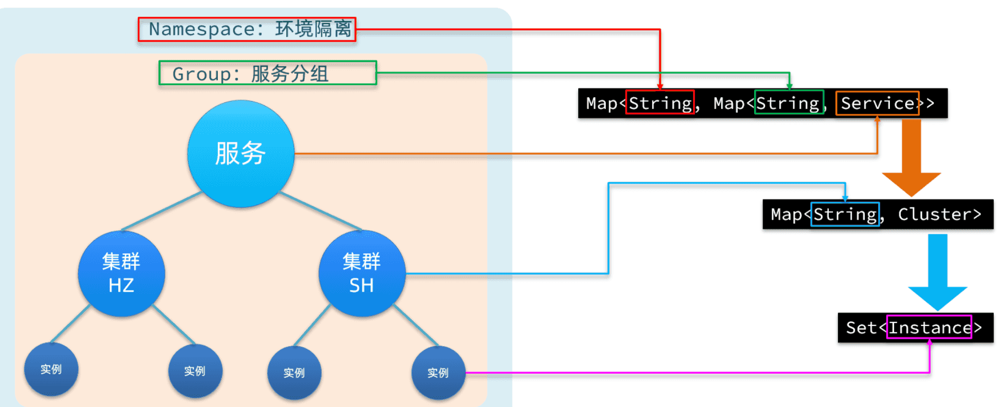
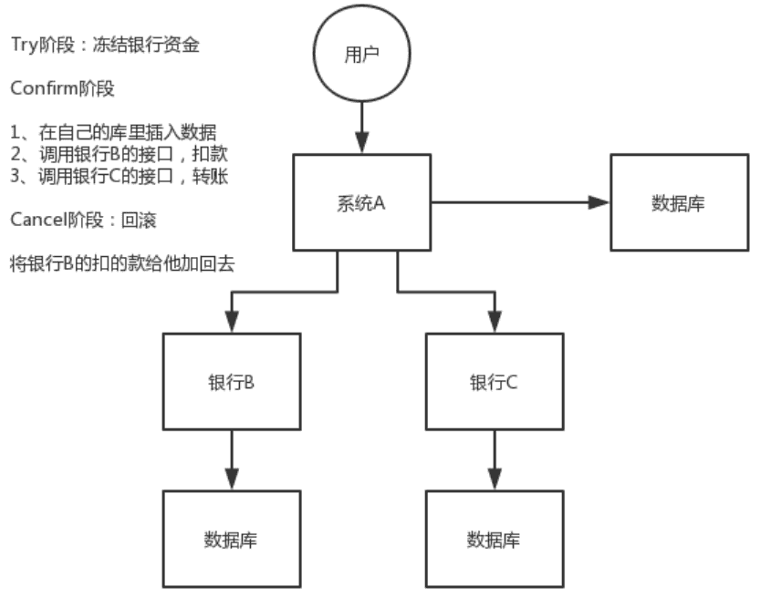
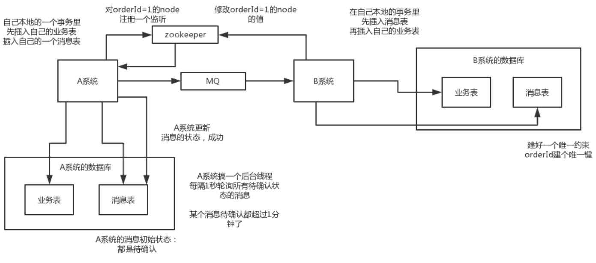
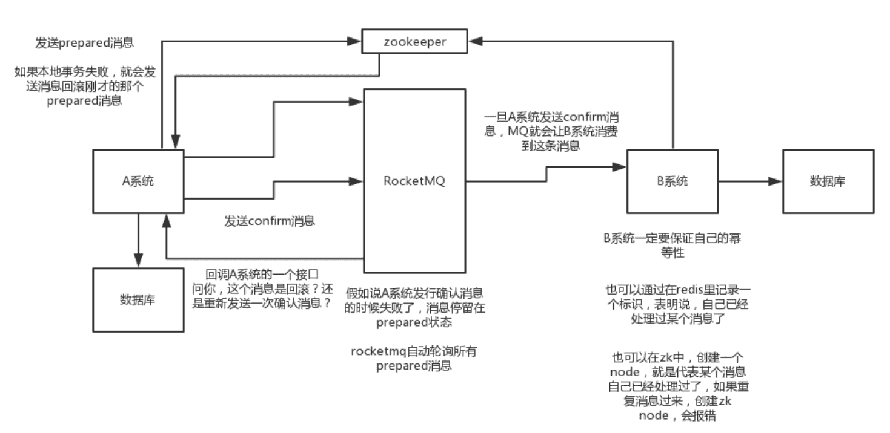
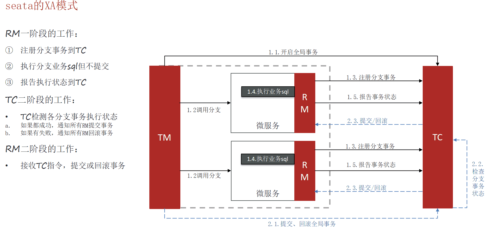
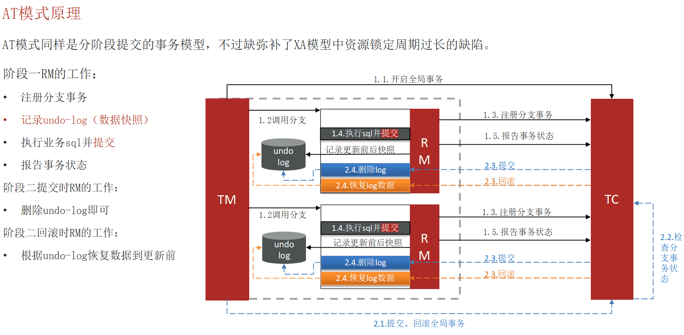
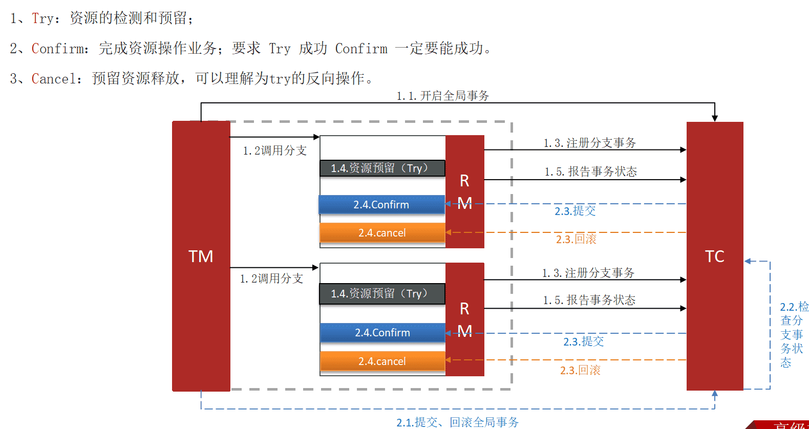

‍

‍

# 概念

‍

## 零碎

‍

‍

### Springcloud五大组件和其使用场景

Spring Cloud 是一套工具集，用于构建分布式系统和微服务架构。以下是 Spring Cloud 的五大核心组件及其使用场景：

1. **Spring Cloud Config**：

    * **用途**：集中化配置管理。
    * **使用场景**：在分布式系统中，管理和分发应用程序的配置文件。
2. **Spring Cloud Netflix (Eureka, Ribbon, Hystrix, Zuul)** ：

    * **用途**：服务发现、负载均衡、断路器、API 网关。
    * **使用场景**：

      * **Eureka**：服务注册与发现。
      * **Ribbon**：客户端负载均衡。
      * **Hystrix**：断路器，处理服务故障。
      * **Zuul**：API 网关，路由和过滤请求。
3. **Spring Cloud Gateway**：

    * **用途**：API 网关。
    * **使用场景**：替代 Zuul，提供路由、过滤和限流等功能。
4. **Spring Cloud Sleuth**：

    * **用途**：分布式追踪。
    * **使用场景**：在分布式系统中，跟踪请求的流转路径，帮助调试和监控。
5. **Spring Cloud Stream**：

    * **用途**：消息驱动的微服务。
    * **使用场景**：构建基于消息的微服务，支持多种消息中间件（如 Kafka、RabbitMQ）。

‍

‍

### SpringCloud常见组件？

SpringCloud包含的组件很多，有很多功能是重复的。其中最常用组件包括：

•注册中心组件：Eureka、Nacos等 consul（go实现）

•负载均衡组件：Ribbon

•远程调用组件：OpenFeign

•网关组件：Zuul、Gateway

•服务保护组件：Hystrix、Sentinel

•服务配置管理组件：SpringCloudConfig、Nacos

‍

‍

### Nacos的服务注册表结构(分级存储)是怎样的

‍

Nacos采用了数据的分级存储模型，最外层是Namespace，用来隔离环境。然后是Group，用来对服务分组。接下来就是服务（Service）了，一个服务包含多个实例，但是可能处于不同机房，因此Service下有多个集群（Cluster），Cluster下是不同的实例（Instance）

‍

对应到Java代码中，Nacos采用了一个多层的Map来表示。结构为Map<String, Map<String, Service>>，其中最外层Map的key就是namespaceId，值是一个Map。内层Map的key是group拼接serviceName，值是Service对象。Service对象内部又是一个Map，key是集群名称，值是Cluster对象。而Cluster对象内部维护了Instance的集合。

‍

如图：

​​

‍

‍

### Nacos如何支撑数十万服务注册压力？

Nacos内部接收到注册的请求时，不会立即写数据，而是将服务注册的任务放入一个**阻塞队列**就立即**响应给客户端**。然后利用**线程池**读取**阻塞队列**中的任务，**异步**来完成实例更新，从而提高并发写能力。

‍

### Nacos如何避免并发读写冲突问题？

Nacos在更新实例列表时，会采用 **CopyOnWrite** 技术，首先将**旧的实例列表拷贝一份**，然后更新拷贝的实例列表，再用更新后的实例列表来覆盖旧的实例列表。

这样在更新的过程中，**就不会对读实例列表的请求产生影响**，也不会出现脏读问题了。

‍

### Nacos与Eureka的区别

Nacos与Eureka有相同点，也有不同之处

* **接口方式**：Nacos与Eureka都对外暴露了Rest风格的API接口，用来实现服务注册、发现等功能
* **实例类型**：Nacos的实例有永久和临时实例之分；而Eureka只支持临时实例
* **健康检测**：Nacos对临时实例采用心跳模式检测，对永久实例采用主动请求来检测；Eureka只支持心跳模式
* **服务发现**：Nacos支持定时拉取和订阅推送两种模式；Eureka只支持定时拉取模式

‍

### Sentinel的限流与Gateway的限流有什么差别？

限流算法常见的有三种实现：滑动时间窗口、令牌桶算法、漏桶算法。

‍

Gateway采用了基于Redis实现的**令牌桶算法**。

而Sentinel内部却比较复杂：

* 默认限流模式是基于**滑动时间窗口算法**
* 排队等待的限流模式则基于漏桶算法
* 而热点参数限流则是基于令牌桶算法

‍

### Sentinel的线程隔离与Hystix的线程隔离有什么差别?

Hystix默认是基于**线程池**实现的线程隔离，每一个被隔离的业务都要创建一个独立的线程池，线程过多会带来额外的CPU开销，性能一般，但是隔离性更强。

Sentinel是基于**信号量**（计数器）实现的线程隔离，不用创建线程池，性能较好，但是隔离性一般。

‍

‍

### Ribbon和SpringCloudLoadBalancer有什么差异

‍

#### Ribbon

Ribbon是Netflix开源的客户端负载均衡器，常用于Spring Cloud微服务架构中。它提供了多种负载均衡策略，如轮询、随机、加权等。Ribbon在Spring Cloud中通常与Eureka等服务发现组件一起使用。

特点：

* **客户端负载均衡**：负载均衡逻辑在客户端实现，客户端直接从服务注册中心获取服务实例列表并进行负载均衡。
* **多种负载均衡策略**：支持轮询、随机、加权等多种负载均衡策略。
* **集成性强**：与Eureka等服务发现组件无缝集成。

‍

#### Spring Cloud LoadBalancer

Spring Cloud LoadBalancer是Spring Cloud提供的一个新的负载均衡器，旨在替代Ribbon。它是Spring Cloud Commons的一部分，提供了更现代化和灵活的负载均衡解决方案。

‍

特点：

* **客户端负载均衡**：同样是客户端负载均衡，但设计更现代化。
* **可扩展性**：提供了更灵活的扩展点，允许开发者自定义负载均衡策略。
* **与Spring生态系统集成**：与Spring Boot和Spring Cloud无缝集成，支持Reactive和Blocking两种编程模型。
* **轻量级**：相比Ribbon，Spring Cloud LoadBalancer更轻量级，依赖更少。

‍

#### 主要差异

1. **架构和设计**：

    * Ribbon是Netflix的开源项目，设计较早，依赖较多。
    * Spring Cloud LoadBalancer是**Spring Cloud**团队开发的，设计更现代化，依赖更少。
2. **集成性**：

    * Ribbon与Eureka等Netflix组件集成性强。
    * Spring Cloud LoadBalancer与Spring生态系统集成性强，支持Spring Boot和Spring Cloud的各种特性。
3. **可扩展性**：

    * Ribbon提供了多种内置的负载均衡策略，但扩展性相对较差。
    * Spring Cloud LoadBalancer提供了更灵活的扩展点，允许开发者自定义负载均衡策略。
4. **编程模型**：

    * Ribbon主要支持阻塞式编程模型。
    * Spring Cloud LoadBalancer支持Reactive和Blocking两种编程模型。

‍

### 服务注册发现的基本流程是怎样的？

‍

**服务注册：**

每个微服务在启动时，会将自己的地址（如IP和端口）注册到服务注册中心。  
服务注册中心保存所有可用服务实例的信息。

‍

**服务发现：**

客户端在调用服务时，会从服务注册中心查询可用的服务实例列表。  
客户端根据负载均衡策略选择一个服务实例进行调用。

‍

### RPC服务中，服务调用方如何快速知道某台机器宕机？

1. **心跳检测**：服务调用方定期向服务提供方发送心跳请求，如果在一定时间内没有收到响应，则认为该机器宕机。
2. **连接超时**：在调用服务时设置连接超时时间，如果在规定时间内没有建立连接，则认为该机器宕机。
3. **负载均衡器**：使用负载均衡器（如Nginx、HAProxy等）来监控后端服务的健康状态，负载均衡器可以自动将宕机的机器从服务列表中移除。
4. **服务注册中心**：使用服务注册中心（如Eureka、Consul、Zookeeper等）来管理服务实例，注册中心可以定期检查服务实例的健康状态，并通知服务调用方。

‍

### 如何防止网关的节点挂了

‍

#### 1. 心跳检测

通过定期发送心跳包来检测节点的健康状态。如果节点在一定时间内没有响应心跳包，则认为该节点已挂掉。

#### 2. 自动注销

当检测到节点挂掉时，自动从网关的节点列表中注销该节点，以防止请求被路由到已挂掉的节点。

#### 3. 负载均衡

使用负载均衡策略将请求分发到健康的节点上，避免单点故障。

‍

### 可作为分布式锁的中间件

1. **Redis**：通过设置键的过期时间和原子操作来实现分布式锁。
2. **Zookeeper**：通过创建临时节点来实现分布式锁。
3. **Etcd**：通过分布式键值存储和租约机制来实现分布式锁。
4. **Consul**：通过分布式键值存储和会话机制来实现分布式锁。

‍

‍

## 如何理解微服务和DDD的关系

微服务（Microservices）和领域驱动设计（Domain-Driven Design, DDD）是两种不同的架构和设计方法，但它们可以很好地结合在一起，以实现更高效和可维护的系统。

‍

### 微服务

微服务是一种架构风格，它将一个大型应用程序拆分为多个小的、独立部署的服务。每个服务通常围绕一个特定的业务功能构建，并且可以独立开发、部署和扩展。

‍

### 领域驱动设计（DDD）

DDD 是一种设计方法，强调通过业务领域的模型来驱动软件设计。DDD 强调以下几个概念：

* **领域（Domain）** ：业务领域，指的是业务逻辑和规则所在的范围。
* **限界上下文（Bounded Context）** ：明确的边界，定义了特定领域模型的适用范围。
* **实体（Entity）** 、**值对象（Value Object）** 、**聚合（Aggregate）** 、**仓储（Repository）** 等：用于建模业务领域的基本构建块。

‍

### 微服务与 DDD 的关系

1. **限界上下文与微服务**：DDD 中的限界上下文可以映射为微服务。每个微服务对应一个限界上下文，负责特定的业务功能。
2. **独立性**：DDD 强调限界上下文的独立性，微服务架构也强调服务的独立性。两者结合可以确保服务之间的低耦合。
3. **业务驱动**：DDD 强调以业务需求为中心进行设计，微服务架构可以通过将业务功能拆分为独立的服务来实现这一点。

‍

‍

## 什么是CAP理论和BASE思想？

‍

### CAP理论

CAP理论（也称为Brewer定理）是分布式系统中的一个基本理论

指出在一个分布式系统中，不可能同时满足以下三个特性：

1. **一致性（Consistency）** ：所有节点在同一时间看到的数据是一致的。
2. **可用性（Availability）** ：每个请求都能收到一个（成功或失败）响应。
3. **分区容错性（Partition Tolerance）** ：系统在遇到任意网络分区故障时，仍然能够继续运作。

‍

‍

### BASE思想

BASE思想是对CAP理论中一致性和可用性权衡的一种实践方法，主要用于大型分布式系统

1. **基本可用（Basically Available）** ：系统在出现故障时，允许部分可用性下降，但基本功能仍然可用。
2. **软状态（Soft State）** ：系统中的状态可以是临时的，不需要强一致性。
3. **最终一致性（Eventual Consistency）** ：系统中的数据最终会达到一致性，但不要求实时一致性。

BASE思想强调通过牺牲强一致性来换取系统的高可用性和分区容错性，适用于需要高可用性和可扩展性的分布式系统。

‍

‍

‍

## 微服务的利与弊

‍

优点

1. **独立部署**：每个微服务可以独立部署和更新，不会影响其他服务。
2. **技术多样性**：不同的微服务可以使用不同的技术栈，选择最适合的工具和语言。
3. **可扩展性**：可以根据需要独立扩展某个微服务，提高资源利用率。
4. **容错性**：一个微服务的故障不会导致整个系统的崩溃，系统具有更高的容错性。
5. **团队独立性**：不同的团队可以负责不同的微服务，减少团队之间的依赖，提高开发效率。
6. 必要性: 一般

‍

缺陷

1. **复杂性增加**：系统由多个服务组成，管理和协调这些服务的复杂性增加。
2. **分布式系统挑战**：需要处理分布式系统的常见问题，如网络延迟、数据一致性、服务发现等。
3. **运维成本**：需要更多的基础设施和工具来管理和监控多个微服务，运维成本增加。
4. **数据管理**：每个微服务可能有自己的数据库，数据管理和一致性变得更加复杂。
5. **性能开销**：服务之间的通信通常通过网络进行，可能会带来额外的性能开销。

‍

‍

‍

## 分布式ID方案

分布式ID生成方案：

‍

‍

### 1. UUID

UUID（Universally Unique Identifier）是一种通用的唯一标识符标准。UUID的优点是简单易用，但它的缺点是长度较长，且不具备有序性。

```java
import java.util.UUID;

public class UUIDGenerator {
    public static String generateUUID() {
        return UUID.randomUUID().toString();
    }
}
```

### 2. 数据库自增ID

使用数据库的自增ID是最简单的方式，但在分布式系统中需要解决多个数据库实例之间的ID冲突问题。

使用 "事务"进行强一致的做法可能不怎么实用

‍

### 3. Snowflake算法

Snowflake是Twitter开源的分布式ID生成算法，生成的ID是64位的长整型，具备有序性和高性能

‍

### 4. Leaf Segment模式

Leaf是美团点评开源的分布式ID生成系统，采用了号段模式（Segment）和Snowflake模式。号段模式通过数据库预分配一段ID，减少了数据库的访问频率。

‍

### 5. Redis

使用Redis的自增特性生成分布式ID，具有高性能和高可用性。

redisTemplate.opsForValue().increment(key);

```java
@Component
public class RedisIdGenerator {

    @Autowired
    private RedisTemplate<String, Object> redisTemplate;

    public long generateId(String key) {
        return redisTemplate.opsForValue().increment(key);
    }

    }
}

        String key = "unique_id";
        long id = idGenerator.generateId(key);
        System.out.println("Generated ID: " + id);
```

‍

‍

## 分布式事务问题是怎么解决的？AT/ TCC介绍

1. **两阶段提交（2PC）** ：协调者在第一阶段准备所有参与者的事务，在第二阶段提交所有参与者的事务。
2. **三阶段提交（3PC）** ：在两阶段提交的基础上增加了一个准备阶段，以减少阻塞的可能性。
3. **TCC（Try-Confirm-Cancel）** ：将事务分为三个阶段：Try（尝试执行），Confirm（确认执行），Cancel（取消执行）。
4. **消息队列**：通过消息队列实现最终一致性。
5. **Saga模式**：将长事务拆分为一系列短事务，每个短事务都有对应的补偿操作。

‍

### AT模式

AT（Automatic Transaction）模式是阿里巴巴开源的分布式事务解决方案Seata中的一种模式。它通过代理数据库操作来实现分布式事务的管理。

‍

#### 解决脏读和脏写问题

1. **脏读**：通过在事务提交前锁定相关数据，防止其他事务读取未提交的数据。
2. **脏写**：通过在事务提交前锁定相关数据，防止其他事务修改未提交的数据。

‍

### TCC模式与AT模式对比

‍

#### TCC模式

**优点**：

* **灵活性高**：可以自定义每个阶段的逻辑，适用于复杂的业务场景。
* **隔离性好**：每个阶段的操作都是独立的，减少了资源锁定的时间。

**缺点**：

* **实现复杂**：需要开发者实现Try、Confirm、Cancel三个阶段的逻辑。
* **补偿成本高**：需要处理每个阶段的补偿操作，增加了开发和维护成本。

‍

#### AT模式

**优点**：

* **实现简单**：通过代理数据库操作，开发者无需关心事务的具体实现。
* **性能较好**：通过优化数据库操作，减少了事务的开销。

**缺点**：

* **灵活性低**：适用于简单的业务场景，不适合复杂的业务逻辑。
* **依赖数据库**：需要数据库支持事务操作，无法跨数据库实现。

‍

‍

# 大块

‍

## 如何调用rpc接口

先讲自己用过什么RPC - OpenFeign

‍

流程

* 引入依赖
* 启用OpenFeign
* 创建OpenFeign接口
* 使用Feign客户端替代注入Service
* 改写调用服务

‍

‍

## Nacos底层原理

Nacos 是阿里巴巴开源的一个动态服务发现、配置管理和服务管理平台

Nacos 通过服务注册与发现、配置管理、数据一致性、健康检查和多租户支持等机制，提供了一个高可用、高性能的服务管理平台，广泛应用于微服务架构中。

‍

### 1. 服务注册与发现

Nacos 提供了服务注册和发现的功能，允许服务实例在启动时向 Nacos 注册，并在关闭时注销。客户端可以通过 Nacos 查询可用的服务实例列表。

* **服务注册**：服务实例启动时，将自身信息（如 IP 地址、端口、服务名等）注册到 Nacos。
* **服务发现**：客户端通过 Nacos 查询指定服务的可用实例列表，并根据负载均衡策略选择一个实例进行调用。

‍

### 2. 配置管理

Nacos 提供了集中化的配置管理功能，支持动态配置更新。应用程序可以从 Nacos 获取配置信息，并在配置发生变化时自动更新。

* **配置存储**：配置信息存储在 Nacos 的配置中心，可以通过控制台或 API 进行管理。
* **配置推送**：当配置发生变化时，Nacos 会将新的配置推送到相关的客户端，客户端可以实时更新配置。

‍

### 3. 数据一致性

Nacos 采用 Raft 协议来保证数据的一致性。Raft 是一种分布式一致性算法，能够在多个节点之间达成一致，确保数据的可靠性和一致性。

* **Leader 选举**：Raft 协议通过选举机制选出一个 Leader 节点，负责处理所有的写请求。
* **日志复制**：Leader 节点将数据变更记录到日志中，并将日志复制到其他节点，确保所有节点的数据一致。

‍

### 4. 健康检查

Nacos 提供了健康检查机制，确保服务实例的可用性。健康检查可以是主动的（由 Nacos 定期检查服务实例）或被动的（由服务实例上报健康状态）。

* **主动健康检查**：Nacos 定期向服务实例发送健康检查请求，判断实例是否可用。
* **被动健康检查**：服务实例定期向 Nacos 上报自身的健康状态，Nacos 根据上报信息判断实例是否可用。

‍

### 5. 多租户支持

Nacos 支持多租户模式，可以为不同的租户提供隔离的服务和配置管理。

* **命名空间**：通过命名空间实现多租户隔离，不同租户的服务和配置可以存储在不同的命名空间中。
* **权限控制**：Nacos 提供了细粒度的权限控制，确保不同租户之间的数据隔离和安全性。

‍

‍

## 什么是服务雪崩，常见的解决方案有哪些？

服务性能雪崩是指在分布式系统中，当一个服务出现故障或性能下降时，导致依赖该服务的其他服务也出现故障或性能下降，进而引发整个系统的连锁反应，最终导致系统整体不可用的现象。

‍

1. **熔断（Circuit Breaker）** ：

    * 当检测到某个服务的故障率超过预设阈值时，熔断器会暂时中断对该服务的调用，避免更多的请求失败。
    * 常用工具：Hystrix、Resilience4j。
2. **限流（Rate Limiting）** ：

    * 限制系统的请求速率，防止系统过载。
    * 常用工具：Guava RateLimiter、Bucket4j。
3. **降级（Fallback）** ：

    * 当某个服务不可用时，提供备用的降级方案，如返回默认值或调用备用服务。
    * 常用工具：Hystrix、Resilience4j。
4. **缓存（Caching）** ：

    * 使用缓存来减少对后端服务的请求频率，减轻系统负载。
    * 常用工具：Redis、Ehcache。
5. **隔离（Bulkhead）** ：

    * 将系统的不同部分隔离开来，防止一个部分的故障影响到其他部分。
    * 常用工具：Hystrix、Resilience4j。
6. **超时（Timeouts）** ：

    * 为服务调用设置合理的超时时间，避免长时间等待导致资源耗尽。
    * 常用工具：Spring Cloud、Feign。

‍

‍

## 接口的幂等性保证实现方案

分布式系统最常遇到的问题之一, 幂等性问题说的就是如何防止接口的**重复无效请求**

幂等性最早是数学里面的一个概念，后来被用于计算机领域，用于表示任意多次请求均与一次请求执行的结果相同，也就是说对于一个接口而言，无论调用了多少次，最终得到的结果都是一样的

‍

幂等性的实现方案通常分为以下几类：

* 前端拦截
* 使用数据库实现幂等性
* 使用 JVM 锁实现幂等性
* 使用分布式锁实现幂等性

‍

其中前端拦截无法防止懂行的人直接绕过前端进行模拟请求的操作。因此后端一定要实现幂等性处理，推荐的做法是使用分布式锁来实现，这样的解决方案更加通用。

‍

幂等性的实现与判断需要消耗一定的资源，因此不应该给每个接口都增加幂等性判断，要根据实际的业务情况和操作类型来进行区分。

例如，进行查询操作和删除操作时就无须进行幂等性判断。查询操作查一次和查多次的结果都是一致的，因此我们无须进行幂等性判断。删除操作也是一样，删除一次和删除多次都是把相关的数据进行删除（这里的删除指的是条件删除而不是删除所有数据），因此也无须进行幂等性判断。

‍

‍

### 前端拦截

‍

前端拦截是指通过 Web 站点的页面进行请求拦截，比如在用户点击完“提交”按钮后，我们可以把按钮设置为不可用或者隐藏状态，避免用户重复点击

核心的实现代码如下：

```html
<script>
    function subCli(){
        // 按钮设置为不可用
        document.getElementById("btn_sub").disabled="disabled";
        document.getElementById("dv1").innerText = "按钮被点击了~";
    }
</script>
<body style="margin-top: 100px;margin-left: 100px;">
    <input id="btn_sub" type="button"  value=" 提 交 "  onclick="subCli()">
    <div id="dv1" style="margin-top: 80px;"></div>
</body>
```

但前端拦截有一个致命的问题，如果是懂行的程序员或者黑客可以直接绕过页面的 JS 执行，直接**模拟请求**后端的接口，这样的话，我们前端的这些拦截就不能生效了。因此除了前端拦截一部分正常的误操作之外，后端的验证必不可少。

‍

‍

### 数据库实现

‍

数据库实现幂等性的方案有三个：

* 通过悲观锁来实现幂等性
* 通过唯一索引来实现幂等性
* 通过乐观锁来实现幂等性

‍

‍

#### 1.悲观锁

使用悲观锁实现幂等性，一般是配合事务一起来实现，在没有使用悲观锁时，我们通常的执行过程是这样的，首先来判断数据的状态，执行 SQL 如下：

```sql
select status from table_name where id='xxx';
```

最后再进行状态的修改：

```sql
update table_name set status='xxx';
```

‍

但这种情况因为是**非原子操作**，所以在高并发环境下可能会造成一个业务被执行两次的问题，当一个程序在执行中时，而另一个程序也开始状态判断的操作。因为第一个程序还未来得及更改状态，所以第二个程序也能执行成功，这就导致一个业务被执行了两次。

‍

在这种情况下我们就可以使用悲观锁来避免问题的产生，实现 SQL 如下所示：

```sql
begin;  # 1.开始事务
select * from table_name where id='xxx' for update; # 2.查询状态
insert into table_name (id) values ('xxx'); # 3.添加操作
update table_name set status='xxx'; # 4.更改操作
commit; # 5.提交事务
```

在实现的过程中需要注意以下两个问题：

* 如果使用的是 MySQL 数据库，必须选用 innodb 存储引擎，因为 innodb 支持事务；
* id 字段一定要是**主键或者是唯一索引**，不然会**锁表**，影响其他业务执行。

‍

‍

#### 2.唯一索引

我们可以创建一个**唯一索引**的表来实现幂等性，在每次执行业务之前，先执行插入操作，因为唯一字段就是业务的 ID，因此如果重复插入的话会触发唯一约束而导致插入失败。在这种情况下（插入失败）我们就可以**判定它为重复提交的请求**

唯一索引表的创建示例如下：

```sql
CREATE TABLE `table_name` (
  `id` int NOT NULL AUTO_INCREMENT,
  `orderid` varchar(32) NOT NULL DEFAULT '' COMMENT '唯一id',
  PRIMARY KEY (`id`),
  UNIQUE KEY `uq_orderid` (`orderid`) COMMENT '唯一约束'
) ENGINE=InnoDB;
```

‍

#### 3.乐观锁

乐观锁是指在执行数据操作时（更改或添加）进行加锁操作，其他时间不加锁，因此相比于整个执行过程都加锁的悲观锁来说，它的执行效率要高很多。

乐观锁可以通过版本号来实现，例如以下 SQL：

```sql
update table_name set version=version+1 where version=0;
```

‍

‍

### JVM 锁实现

JVM 锁实现是指通过 JVM 提供的内置锁如 Lock 或者是 synchronized 来实现幂等性。使用 JVM 锁来实现幂等性的一般流程为：首先通过 Lock 对代码段进行加锁操作，然后再判断此订单是否已经被处理过，如果未处理则开启事务执行订单处理，处理完成之后提交事务并释放锁

JVM 锁存在的最大问题在于，它==只能应用于单机环境==，因为 Lock 本身为单机锁，所以它就不适应于分布式多机环境

‍

‍

### 分布式锁实现

分布式锁实现幂等性的逻辑是，在每次执行方法之前先判断是否可以获取到分布式锁，如果可以，则表示为第一次执行方法，否则直接舍弃请求即可

需要注意的是分布式锁的 key 必须为业务的**唯一标识**，我们通常使用 Redis 或者 ZooKeeper 来实现分布式锁

‍

‍

‍

‍

‍

‍

‍

‍

‍

‍

‍

‍

‍

‍

‍

‍

# 高级

‍

## 分布式事务畅想

来自[link](https://github.com/doocs/advanced-java/blob/main/docs/distributed-system/distributed-transaction.md)

‍

### TCC 方案

TCC 的全称是：Try、Confirm、Cancel。

* Try 阶段：这个阶段说的是对各个服务的资源做检测以及对资源进行**锁定或者预留**。
* Confirm 阶段：这个阶段说的是在各个服务中**执行实际的操作**。
* Cancel 阶段：如果任何一个服务的业务方法执行出错，那么这里就需要**进行补偿**，就是执行已经执行成功的业务逻辑的回滚操作。（把那些执行成功的回滚）

这种方案说实话几乎很少人使用，我们用的也比较少，但是也有使用的场景。因为这个**事务回滚**实际上是**严重依赖于你自己写代码来回滚和补偿**了，会造成补偿代码巨大，非常之恶心。

比如说我们，一般来说跟**钱**相关的，跟钱打交道的，**支付**、**交易**相关的场景，我们会用 TCC，严格保证分布式事务要么全部成功，要么全部自动回滚，严格保证资金的正确性，保证在资金上不会出现问题。

而且最好是你的各个业务执行的时间都比较短。

但是说实话，一般尽量别这么搞，自己手写回滚逻辑，或者是补偿逻辑，实在太恶心了，那个业务代码很难维护。

‍

​​

‍

### 本地消息表

本地消息表其实是国外的 ebay 搞出来的这么一套思想。

这个大概意思是这样的：

1. A 系统在自己本地一个事务里操作同时，插入一条数据到消息表；
2. 接着 A 系统将这个消息发送到 MQ 中去；
3. B 系统接收到消息之后，在一个事务里，往自己本地消息表里插入一条数据，同时执行其他的业务操作，如果这个消息已经被处理过了，那么此时这个事务会回滚，这样**保证不会重复处理消息**；
4. B 系统执行成功之后，就会更新自己本地消息表的状态以及 A 系统消息表的状态；
5. 如果 B 系统处理失败了，那么就不会更新消息表状态，那么此时 A 系统会定时扫描自己的消息表，如果有未处理的消息，会再次发送到 MQ 中去，让 B 再次处理；
6. 这个方案保证了最终一致性，哪怕 B 事务失败了，但是 A 会不断重发消息，直到 B 那边成功为止。

这个方案说实话最大的问题就在于**严重依赖于数据库的消息表来管理事务**啥的，会导致如果是高并发场景咋办呢？咋扩展呢？所以一般确实很少用。

​​

‍

‍

### 可靠消息最终一致性方案

这个的意思，就是干脆不要用本地的消息表了，直接基于 MQ 来实现事务。比如阿里的 RocketMQ 就支持消息事务。

大概的意思就是：

1. A 系统先发送一个 prepared 消息到 mq，如果这个 prepared 消息发送失败那么就直接取消操作别执行了；
2. 如果这个消息发送成功过了，那么接着执行本地事务，如果成功就告诉 mq 发送确认消息，如果失败就告诉 mq 回滚消息；
3. 如果发送了确认消息，那么此时 B 系统会接收到确认消息，然后执行本地的事务；
4. mq 会自动**定时轮询**所有 prepared 消息回调你的接口，问你，这个消息是不是本地事务处理失败了，所有没发送确认的消息，是继续重试还是回滚？一般来说这里你就可以查下数据库看之前本地事务是否执行，如果回滚了，那么这里也回滚吧。这个就是避免可能本地事务执行成功了，而确认消息却发送失败了。
5. 这个方案里，要是系统 B 的事务失败了咋办？重试咯，自动不断重试直到成功，如果实在是不行，要么就是针对重要的资金类业务进行回滚，比如 B 系统本地回滚后，想办法通知系统 A 也回滚；或者是发送报警由人工来手工回滚和补偿。
6. 这个还是比较合适的，目前国内互联网公司大都是这么玩儿的，要不你举用 RocketMQ 支持的，要不你就自己基于类似 ActiveMQ？RabbitMQ？自己封装一套类似的逻辑出来，总之思路就是这样子的。

​​

‍

### 最大努力通知方案

这个方案的大致意思就是：

1. 系统 A 本地事务执行完之后，发送个消息到 MQ；
2. 这里会有个专门消费 MQ 的**最大努力通知服务**，这个服务会消费 MQ 然后写入数据库中记录下来，或者是放入个内存队列也可以，接着调用系统 B 的接口；
3. 要是系统 B 执行成功就 ok 了；要是系统 B 执行失败了，那么最大努力通知服务就定时尝试重新调用系统 B，反复 N 次，最后还是不行就放弃。

‍

‍

### 你们公司是如何处理分布式事务的？

‍

如果你真的被问到，可以这么说，我们某某特别严格的场景，用的是 TCC 来保证强一致性；然后其他的一些场景基于阿里的 RocketMQ 来实现分布式事务。

你找一个严格资金要求绝对不能错的场景，你可以说你是用的 TCC 方案；如果是一般的分布式事务场景，订单插入之后要调用库存服务更新库存，库存数据没有资金那么的敏感，可以用可靠消息最终一致性方案。

友情提示一下，RocketMQ 3.2.6 之前的版本，是可以按照上面的思路来的，但是之后接口做了一些改变，我这里不再赘述了。

当然如果你愿意，你可以参考可靠消息最终一致性方案来自己实现一套分布式事务，比如基于 RocketMQ 来玩儿。

‍

‍

## 分布式锁实现

‍

‍

### 数据库

在数据库中创建一个表，表中包含方法名等字段，并在方法名字段上创建唯一索引，想要执行某个方法，就使用这个方法名向表中插入数据，成功插入则获取锁，执行完成后删除对应的行数据释放锁。

```sql
DROP TABLE IF EXISTS `method_lock`;
CREATE TABLE `method_lock` (
  `id` int(11) unsigned NOT NULL AUTO_INCREMENT COMMENT '主键',
  `method_name` varchar(64) NOT NULL COMMENT '锁定的方法名',
  `desc` varchar(255) NOT NULL COMMENT '备注信息',
  `update_time` timestamp NOT NULL DEFAULT CURRENT_TIMESTAMP ON UPDATE CURRENT_TIMESTAMP,
  PRIMARY KEY (`id`),
  UNIQUE KEY `uidx_method_name` (`method_name`) USING BTREE
) ENGINE=InnoDB AUTO_INCREMENT=3 DEFAULT CHARSET=utf8 COMMENT='锁定中的方法';
```

执行某个方法后，插入一条记录

```sql
INSERT INTO method_lock (method_name, desc) VALUES ('methodName', '测试的methodName');
```

因为我们对method_name做了唯一性约束，这里如果有多个请求同时提交到数据库的话，数据库会保证只有一个操作可以成功，那么我们就可以认为操作成功的那个线程获得了该方法的锁，可以执行方法体内容。

成功插入则获取锁，执行完成后删除对应的行数据释放锁：

```sql
delete from method_lock where method_name ='methodName';
```

优点：易于理解实现

缺点：

1. 没有锁失效自动删除机制，因为有可能出现成功插入数据后，服务器宕机了，对应的数据没有被删除，当服务恢复后一直获取不到锁，所以，需要在表中新增一列，用于记录失效时间，并且需要有定时任务清除这些失效的数据
2. 吞吐量很低
3. 单点故障问题
4. 轮询获取锁状态方式太过低效

‍

### 基于Redis

NX是Redis提供的一个原子操作，如果指定key存在，那么NX失败，如果不存在会进行set操作并返回成功。我们可以利用这个来实现一个分布式的锁，主要思路就是，set成功表示获取锁，set失败表示获取失败，失败后需要重试。再加上EX参数可以让该key在超时之后自动删除。

```java
public void lock(String key, String request, int timeout) throws InterruptedException {
    Jedis jedis = jedisPool.getResource();

    while (timeout >= 0) {
        String result = jedis.set(LOCK_PREFIX + key, request, SET_IF_NOT_EXIST, SET_WITH_EXPIRE_TIME, DEFAULT_EXPIRE_TIME);
        if (LOCK_MSG.equals(result)) {
            jedis.close();
            return;
        }
        Thread.sleep(DEFAULT_SLEEP_TIME);
        timeout -= DEFAULT_SLEEP_TIME;
    }
}
```

优点：

1. 吞吐量高
2. 有锁失效自动删除机制，保证不会阻塞所有流程

缺点:

1. 单点故障问题
2. 锁超时问题：如果A拿到锁之后设置了超时时长，但是业务还未执行完成且锁已经被释放，此时其他进程就会拿到锁从而执行相同的业务。如何解决？Redission定时延长超时时长避免过期。为什么不直接设置为永不超时？为了防范业务方没写解锁方法或者发生异常之后无法进行解锁的问题
3. 轮询获取锁状态方式太
4. 过低效

‍

### 基于ZooKeeper

1. 当客户端对某个方法加锁时，在Zookeeper上的与该方法对应的指定节点的目录下，生成一个临时有序节点
2. 判断该节点是否是当前目录下最小的节点，如果是则获取成功；如果不是，则获取失败，并获取上一个临时有序节点，对该节点进行监听，当节点删除时通知唯一的客户端

优点：

1. 解决锁超时问题。因为Zookeeper的写入都是顺序的，在一个节点创建之后，其他请求再次创建便会失败，同时可以对这个节点进行Watch，如果节点删除会通知其他节点抢占锁
2. 能通过watch机制高效通知其他节点获取锁，避免惊群效应
3. 有锁失效自动删除机制，保证不会阻塞所有流程

缺点：

1. 性能不如Redis
2. 强依赖zk，如果原来系统不用zk那就需要维护一套zk

‍

‍

## CAP理论

‍

### 理论

CAP原则又称CAP定理，指的是在一个分布式系统中，Consistency（一致性）、 Availability（可用性）、Partition tolerance（分区容错性），三者不可兼得。

* 一致性（C）：对某个指定的客户端来说，读操作能返回最新的写操作结果
* 可用性（A）：非故障节点在合理的时间返回合理的响应
* 分区容错性（P）：分区容错性是指当网络出现分区（两个节点之间无法连通）之后，系统能否继续履行职责

CAP理论就是说在分布式系统中，最多只能实现上面的两点。而由于当前的网络硬件肯定会出现延迟丢包等问题，所以考虑最差情况，分区容忍性是一般是需要实现的

虽然 CAP 理论定义是三个要素中只能取两个，但放到分布式环境下来思考，我们会发现必须选择 P（分区容忍）要素，因为网络本身无法做到 100% 可靠，有可能出故障，所以分区是一个必然的现象。如果我们选择了 CA 而放弃了 P，那么当发生分区现象时，为了保证 C，系统需要禁止写入，当有写入请求时，系统返回 error（例如，当前系统不允许写入），这又和 A 冲突了，因为 A 要求返回 no error 和 no timeout。因此，分布式系统理论上不可能选择 CA 架构，只能选择 CP 或者 AP 架构。

BASE理论的核心思想是：BASE是 Basically Available（基本可用）、Soft state（软状态）和 Eventually consistent（最终一致性）的缩写，它接受在短时间内可能存在的不一致性，但保证最终达到一致性。与ACID（原子性、一致性、隔离性、持久性）相比，BASE更注重系统的可用性和可伸缩性，牺牲了严格的即时一致性。

‍

‍

### 强一致如何实现

什么是强一致性：在分布式存储系统中，强一致性是指系统保证任意时刻数据是一致的，即无论在任何节点上进行的操作，都能立即在所有节点上访问到最新的数据。

分布式共识算法。其中，Paxos 和 Raft 是两个著名的共识算法，它们可以用于实现分布式系统的强一致性。这些算法通过选举和投票来确保各个节点的操作顺序一致，从而达到强一致性的要求。

1. Paxos 算法通过多个阶段的提议、投票和决议过程来确保一个值被所有参与者接受。算法包括提议者（Proposer）、接受者（Acceptor）和学习者（Learner）的角色，并且使用一系列编号递增的消息来进行通信，确保在任何时候只有一个提议会被接受。
2. Raft 使用了明确的领导者（Leader）角色，简化了状态机复制的过程。领导者负责处理所有的客户端请求并维护集群状态的一致性。它通过日志复制、心跳机制以及选举流程确保在任何时刻都有一个有效的领导者，并保持集群内的日志一致性。
3. Raft 可以看作是对 Paxos 算法的一种工程化改进，它保留了 Paxos 对于分布式一致性问题的核心解决方案，同时通过对算法进行模块化和清晰化设计，极大地降低了开发者理解和实施分布式共识协议的难度

‍

### 数据一致性解决方案

强一致性（Strong Consistency）  
通过事务（如ACID事务）确保每次操作都看到最新的数据状态。这通常需要两阶段提交（2PC）或其他复杂的事务协议，但可能导致性能下降。

最终一致性（Eventual Consistency）  
允许短暂的数据不一致，但保证在一段时间后所有副本间达到一致。这种模型在分布式系统中广泛使用，如Cassandra和Amazon DynamoDB。

分布式事务  
如两阶段提交（2PC）、三阶段提交（3PC）和多阶段提交（MPC）等协议，用于跨节点的事务协调。

复制策略  
同步复制：更新在所有副本之间同步完成，保证强一致性，但可能影响性能。  
异步复制：更新在主节点上完成，副本随后更新，牺牲一致性以换取性能。

PAXOS/Raft共识算法  
用于在分布式系统中选举领导者并达成一致性决策。

幂等性设计  
确保多次执行相同操作不会改变系统状态，有助于防止因重试或网络问题导致的数据不一致

‍

### 高可用多活面试题

解释什么是“多活”架构，并描述其在高可用性中的作用。  
多活架构是指在一个分布式系统中，多个数据中心或节点同时处于活动状态，每个节点都能独立处理请求，从而提高系统的可用性和容灾能力。当某个节点出现故障时，其他节点仍能继续提供服务。

描述一下典型的多活架构部署策略，例如如何处理数据同步和流量路由。  
多活架构通常采用数据同步机制（如主从复制、分布式数据库）保持数据一致性，同时使用智能DNS、负载均衡器或路由策略将流量分散到各个活节点。在故障发生时，可以快速切换流量路由，确保服务不中断。

如何在多活架构中实现故障检测和自动切换？  
通过心跳检测、健康检查、Zookeeper或Consul等服务发现机制监控各个节点的状态，一旦检测到故障，立即触发流量切换策略，将流量导向其他正常运行的节点。

谈谈多活架构下的数据一致性挑战及解决方案  
数据一致性是多活架构中的主要挑战。可以采用异步复制、分布式事务（如2PC、Saga）、最终一致性等方法来平衡数据一致性和高可用性。

如何设计一个高可用多活系统？请简述关键要素。  
关键要素包括：负载均衡（如DNS轮询、硬件负载均衡器）、数据复制与一致性（如主从复制、分布式数据库）、故障检测与切换机制（如健康检查、心跳检测）、网络连通性保障（如SDN、专线连接）、自动化运维工具（如自动化部署、监控报警）。

多活架构面临的主要挑战有哪些？如何解决？  
主要挑战包括数据一致性、网络延迟、故障检测与恢复、运维复杂度等。解决方案涉及采用合适的数据同步技术、优化网络架构（如使用CDN、专线）、实施自动化运维工具、以及建立完善的监控和告警体系。

在多活架构中，如何处理跨数据中心的事务？  
可以采用分布式事务协调服务（如Seata、LRA），或者通过Saga模式、TCC（Try-Confirm-Cancel）模式来处理跨数据中心的长事务，确保事务的原子性和一致性。

‍

‍

‍

## ID生成方式分析

‍

### UUID

优：

1. 本地生成没有了网络之类的消耗，效率非常高

缺：

1. 不易于存储：UUID太长，16字节128位，通常以36长度的字符串表示，很多场景不适用。
2. 信息不安全：基于MAC地址生成UUID的算法可能会造成MAC地址泄露，这个漏洞曾被用于寻找梅丽莎病毒的制作者位置。

‍

### snowflake

这种方案把64-bit分别划分成多段（机器、时间）

优：

1. 毫秒数在高位，自增序列在低位，整个ID都是趋势递增的
2. 本地生成没有了网络之类的消耗，效率非常高
3. 可以根据自身业务特性分配bit位，非常灵活。

缺：

1. 强依赖机器时钟，如果机器上时钟回拨，会导致发号重复或者服务会处于不可用状态

‍

### 数据库

可以利用 MySQL 中的自增属性 auto_increment 来生成全局唯一 ID，也能保证趋势递增。 但这种方式太依赖 DB，如果数据库挂了那就非常容易出问题。

优：

1. 非常简单，利用现有数据库系统的功能实现，成本小，有DBA专业维护。
2. ID号单调自增，可以实现一些对ID有特殊要求的业务。

缺：

1. 强依赖DB，当DB异常时整个系统不可用，属于致命问题。配置主从复制可以尽可能的增加可用性，但是数据一致性在特殊情况下难以保证。主从切换时的不一致可能会导致重复发号。
2. ID发号性能瓶颈限制在单台MySQL的读写性能。

‍

‍

# Temp

‍

‍

## Spring Cloud 5大组件有哪些？

早期我们一般认为的Spring Cloud五大组件是

* Eureka : 注册中心
* Ribbon : 负载均衡
* Feign : 远程调用
* Hystrix : 服务熔断
* Zuul/Gateway : 网关

随着SpringCloudAlibba在国内兴起 , 我们项目中使用了一些阿里巴巴的组件

* 注册中心/配置中心 Nacos
* 负载均衡 Ribbon
* 服务调用 Feign
* 服务保护 sentinel
* 服务网关 Gateway

‍

## **服务注册和发现**

**面试官：** 服务注册和发现是什么意思？Spring Cloud 如何实现服务注册发现？

**候选人：**

我理解的是主要三块大功能，分别是服务注册 、服务发现、服务状态监控

我们当时项目采用的eureka作为注册中心，这个也是spring cloud体系中的一个核心组件

**服务注册**：服务提供者需要把自己的信息注册到eureka，由eureka来保存这些信息，比如服务名称、ip、端口等等

**服务发现**：消费者向eureka拉取服务列表信息，如果服务提供者有集群，则消费者会利用负载均衡算法，选择一个发起调用

**服务监控**：服务提供者会每隔30秒向eureka发送心跳，报告健康状态，如果eureka服务90秒没接收到心跳，从eureka中剔除

‍

‍

## 我看你之前也用过nacos、你能说下nacos与eureka的区别？

> 设置非临时实例 : discovery : ephemeral: false yml.选项

Nacos与eureka的共同点（注册中心）  
都支持服务注册和服务拉取  
都支持服务提供者心跳方式做健康检测

‍

Nacos与Eureka的区别（注册中心）

* Nacos支持服务端主动检测提供者状态：临时实例采用心跳模式，非临时实例采用主动检测模式
* 临时实例心跳不正常会被剔除，非临时实例则不会被剔除(正式员工)
* Nacos支持服务列表变更的消息推送模式，服务列表更新更及时
* Nacos集群默认采用AP方式，当集群中存在非临时实例时，采用CP模式；Eureka采用AP方式

‍

Nacos还支持了配置中心，eureka则只有注册中心，也是选择使用nacos的一个重要原因

‍

> 我们当时xx项目就是采用的nacos作为注册中心，选择nacos还要一个重要原因就是它支持配置中心，不过nacos作为注册中心，也比eureka要方便好用一些，主要相同不同点在于几点：
>
> * 共同点
>
> Nacos与eureka都支持服务注册和服务拉取，都支持服务提供者心跳方式做健康检测
>
> * Nacos与Eureka的区别
>
> ①Nacos支持服务端主动检测提供者状态：临时实例采用心跳模式，非临时实例采用主动检测模式
>
> ②临时实例心跳不正常会被剔除，非临时实例则不会被剔除
>
> ③Nacos支持服务列表变更的消息推送模式，服务列表更新更及时
>
> ④Nacos集群默认采用AP方式，当集群中存在非临时实例时，采用CP模式；Eureka采用AP方式

‍

‍

## 负载均衡如何实现的

微服务的负载均衡主要使用了一个组件Ribbon，比如，我们在使用feign远程调用的过程中，底层的负载均衡就是使用了ribbon

‍

### Ribbon负载均衡策略有哪些 ?

完整, 讲两个

* RoundRobinRule：简单轮询服务列表来选择服务器
* WeightedResponseTimeRule：按照权重来选择服务器，响应时间越长，权重越小
* RandomRule：随机选择一个可用的服务器
* BestAvailableRule：忽略那些短路的服务器，并选择并发数较低的服务器
* RetryRule：重试机制的选择逻辑
* AvailabilityFilteringRule：可用性敏感策略，先过滤非健康的，再选择连接数较小的实例
* ZoneAvoidanceRule：以区域可用的服务器为基础进行服务器的选择。使用Zone对服务器进行分类，这个Zone可以理解为一个机房、一个机架等。而后再对Zone内的多个服务做轮询

‍

### 自定义负载均衡策略如何实现

可以自己创建类实现IRule接口 , 然后再通过配置类或者配置文件配置即可 ，通过定义IRule实现可以修改负载均衡规则，有两种方式：

创建类实现IRule接口，可以指定负载均衡策略（全局）  
在客户端的配置文件中，可以配置某一个服务调用的负载均衡策略（局部）

‍

全局生效

```java
@Bean
public IRule randomRule(){
    return new RandomRule();
}
```

‍

‍

局部生效

```java
userservice:
  ribbon:
    NFLoadBalancerRuleClassName: com.netflix.loadbalancer.RandomRule# 负载均衡规则 
```

‍

## 服务雪崩

> 服务雪崩是指一个服务失败，导致整条链路的服务都失败的情形，一般我们在项目解决的话就是两种方案，第一个是服务降级，第二个是服务熔断，如果流量太大的话，可以考虑限流
>
> 服务降级：服务自我保护的一种方式，或者保护下游服务的一种方式，用于确保服务不会受请求突增影响变得不可用，确保服务不会崩溃，一般在实际开发中与feign接口整合，编写降级逻辑
>
> 服务熔断：默认关闭，需要手动打开，如果检测到 10 秒内请求的失败率超过 50%，就触发熔断机制。之后每隔 5 秒重新尝试请求微服务，如果微服务不能响应，继续走熔断机制。如果微服务可达，则关闭熔断机制，恢复正常请求

‍

‍

‍

## 微服务是怎么监控的

> 采用的skywalking进行监控的
>
> 1，skywalking主要可以监控接口、服务、物理实例的一些状态。特别是在压测的时候可以看到众多服务中哪些服务和接口比较慢，我们可以针对性的分析和优化。
>
> 2，我们还在skywalking设置了告警规则，特别是在项目上线以后，如果报错，我们分别设置了可以给相关负责人发短信和发邮件，第一时间知道项目的bug情况，第一时间修复

‍

‍

‍

## 有没有做过限流

‍

‍

限流的实现方式：

* Tomcat：可以设置最大连接数
* Nginx，漏桶算法
* 网关，令牌桶算法
* 自定义拦截器

‍

​​

‍

key-resolver ：定义限流对象（ ip 、路径、参数），需代码实现，使用spel表达式获取  
replenishRate ：令牌桶每秒填充平均速率。  
urstCapacity ：令牌桶总容量。

‍

‍

项目中有没有做过限流 ? 怎么做的 ?

1,先来介绍业务，什么情况下去做限流，需要说明QPS具体多少

我们当时有一个活动，到了假期就会抢购优惠券，QPS最高可以达到2000，平时10-50之间，为了应对突发流量，需要做限流  
常规限流，为了防止恶意攻击，保护系统正常运行，我们当时系统能够承受最大的QPS是多少（压测结果）

2，nginx限流  
控制速率（突发流量），使用的漏桶算法来实现过滤，让请求以固定的速率处理请求，可以应对突发流量  
控制并发数，限制单个ip的链接数和并发链接的总数

3，网关限流  
在spring cloud gateway中支持局部过滤器RequestRateLimiter来做限流，使用的是令牌桶算法  
可以根据ip或路径进行限流，可以设置每秒填充平均速率，和令牌桶总容量

‍

‍

‍

> 我当时做的xx项目，采用就是微服务的架构，因为xx因为，应该会有突发流量，最大QPS可以达到2000，但是服务支撑不住，我们项目都通过压测最多可以支撑1200QPS。因为我们平时的QPS也就不到100，为了解决这些突发流量，所以采用了限流。
>
> 【版本1】
>
> 我们当时采用的nginx限流操作，nginx使用的漏桶算法来实现过滤，让请求以固定的速率处理请求，可以应对突发流量，我们控制的速率是按照ip进行限流，限制的流量是每秒20
>
> 【版本2】
>
> 我们当时采用的是spring cloud gateway中支持局部过滤器RequestRateLimiter来做限流，使用的是令牌桶算法，可以根据ip或路径进行限流，可以设置每秒填充平均速率，和令牌桶总容量

‍

‍

​​

‍

**面试官：** 限流常见的算法有哪些呢？

**候选人：**

比较常见的限流算法有漏桶算法和令牌桶算法

漏桶算法是把请求存入到桶中，以固定速率从桶中流出，可以让我们的服务做到绝对的平均，起到很好的限流效果

令牌桶算法在桶中存储的是令牌，按照一定的速率生成令牌，每个请求都要先申请令牌，申请到令牌以后才能正常请求，也可以起到很好的限流作用

它们的区别是，漏桶和令牌桶都可以处理突发流量，其中漏桶可以做到绝对的平滑，令牌桶有可能会产生突发大量请求的情况，一般nginx限流采用的漏桶，spring cloud gateway中可以支持令牌桶算法

‍

‍

‍

## CAP和BASE

分布式系统有三个指标：  
Consistency（一致性）  
Availability（可用性）  
Partition tolerance （分区容错性）

分布式系统无法同时满足这三个指标。这就是结论

> 分布式系统节点之间肯定是需要网络连接的，分区（P）是必然存在的  
> 如果保证访问的高可用性（A）,可以持续对外提供服务，但不能保证数据的强一致性-->  AP  
> 如果保证访问的数据强一致性（C）,就要放弃高可用性   --> CP

‍

BASE理论是对CAP的一种解决思路，包含三个思想：  
Basically Available （基本可用）：分布式系统在出现故障时，允许损失部分可用性，即保证核心可用。  
Soft State（软状态）：在一定时间内，允许出现中间状态，比如临时的不一致状态。  
Eventually Consistent（最终一致性）：虽然无法保证强一致性，但是在软状态结束后，最终达到数据一致。

‍

CAP 定理(一致性、可用性、分区容错性)  
分布式系统节点通过网络连接，一定会出现分区问题（P）  
当分区出现时，系统的一致性（C）和可用性（A）就无法同时满足

BASE理论  
基本可用  
软状态  
最终一致

解决分布式事务的思想和模型：  
最终一致思想：各分支事务分别执行并提交，如果有不一致的情况，再想办法恢复数据（AP）  
强一致思想：各分支事务执行完业务不要提交，等待彼此结果。而后统一提交或回滚（CP）

‍

> CAP主要是在分布式项目下的一个理论。包含了三项，一致性、可用性、分区容错性
>
> * 一致性(Consistency)是指更新操作成功并返回客户端完成后，所有节点在同一时间的数据完全一致(强一致性)，不能存在中间状态。
> * 可用性(Availability) 是指系统提供的服务必须一直处于可用的状态，对于用户的每一个操作请求总是能够在有限的时间内返回结果。
> * 分区容错性(Partition tolerance) 是指分布式系统在遇到任何网络分区故障时，仍然需要能够保证对外提供满足一致性和可用性的服务，除非是整个网络环境都发生了故障。

‍

> 首先一个前提，对于分布式系统而言，分区容错性是一个最基本的要求，因此基本上我们在设计分布式系统的时候只能从一致性（C）和可用性（A）之间进行取舍。
>
> 如果保证了一致性（C）：对于节点N1和N2，当往N1里写数据时，N2上的操作必须被暂停，只有当N1同步数据到N2时才能对N2进行读写请求，在N2被暂停操作期间客户端提交的请求会收到失败或超时。显然，这与可用性是相悖的。
>
> 如果保证了可用性（A）：那就不能暂停N2的读写操作，但同时N1在写数据的话，这就违背了一致性的要求。

‍

> BASE是CAP理论中AP方案的延伸，核心思想是即使无法做到强一致性（StrongConsistency，CAP的一致性就是强一致性），但应用可以采用适合的方式达到最终一致性（Eventual Consitency）。它的思想包含三方面：
>
> 1、Basically Available（基本可用）：基本可用是指分布式系统在出现不可预知的故障的时候，允许损失部分可用性，但不等于系统不可用。
>
> 2、Soft state（软状态）：即是指允许系统中的数据存在中间状态，并认为该中间状态的存在不会影响系统的整体可用性，即允许系统在不同节点的数据副本之间进行数据同步的过程存在延时。
>
> 3、Eventually consistent（最终一致性）：强调系统中所有的数据副本，在经过一段时间的同步后，最终能够达到一个一致的状态。其本质是需要系统保证最终数据能够达到一致，而不需要实时保证系统数据的强一致性。

‍

‍

## 分布式事务解决方案

Seata框架(XA、AT、TCC) / MQ解耦发送(简单)

‍

Seata事务管理中有三个重要的角色：  
TC (Transaction Coordinator) - 事务协调者：维护全局和分支事务的状态，协调全局事务提交或回滚。  
TM (Transaction Manager) - 事务管理器：定义全局事务的范围、开始全局事务、提交或回滚全局事务。  
RM (Resource Manager) - 资源管理器：管理分支事务处理的资源，与TC交谈以注册分支事务和报告分支事务的状态，并驱动分支事务提交或回滚。

‍

​​

‍

​​

‍

​​

TCC这个需要手动写代码, 算了

‍

描述项目中采用的哪种方案（seata | MQ）

* seata的XA模式，CP，需要互相等待各个分支事务提交，可以保证强一致性，**性能差**    (银行业务)
* seata的AT模式，AP，底层使用undo log 实现，**性能好** (互联网业务)
* seata的TCC模式，AP，性能较好，不过需要**人工编码**实现    (银行业务)
* MQ模式实现分布式事务，在A服务写数据的时候，需要在同一个事务内发送消息到另外一个事务，异步，**性能最好** (互联网业务) 推荐, 勿增实体

‍

‍

## 分布式服务的接口幂等性

‍

* 数据库唯一索引    增
* token+redis    增改
* 分布式锁    增改

‍

分布式锁，性能较低  
使用token+redis来实现，性能较好

‍

token+redis

* 请求第一次, 获取token并存redis, 返回token到前端存储
* 第二次请求就会带有这个token, 服务端去验证一下有了吗, 有才能处理(就一次)

‍

分布式锁

```java
public void saveOrder(Item item) throws InterruptedException {
   //获取锁（重入锁），执行锁的名称
   RLock lock = redissonClient.getLock("heimalock");
    //尝试获取锁，参数分别是：获取锁的最大等待时间（期间会重试），锁自动释放时间，时间单位
   boolean isLock = lock.tryLock(10, TimeUnit.SECONDS);
    try {
        //判断是否获取成功
    if (!isLock) {
          log.info("下单操作获取锁失败,order:{}",item);
           throw new RuntimeException("新增或修改失败");
        }
        //下单操作
    
    } finally {
        //释放锁
    lock.unlock();
    }
}

```

‍

‍

## 分布式任务调度 xxl-job

xxl-job解决的问题

* 解决集群任务的重复执行问题
* cron表达式定义灵活
* 定时任务失败了，重试和统计
* 任务量大，分片执行

‍

‍

### xxl-job路由策略有哪些？

xxl-job提供了很多的路由策略，我们平时用的较多就是：轮询、故障转移、分片广播…

‍

1. FIRST（第一个）：固定选择第一个机器；
2. LAST（最后一个）：固定选择最后一个机器；
3. ROUND（轮询）
4. RANDOM（随机）：随机选择在线的机器；
5. CONSISTENT_HASH（一致性HASH）：每个任务按照Hash算法固定选择某一台机器，且所有任务均匀散列在不同机器上。
6. LEAST_FREQUENTLY_USED（最不经常使用）：使用频率最低的机器优先被选举；
7. LEAST_RECENTLY_USED（最近最久未使用）：最久未使用的机器优先被选举；
8. FAILOVER（故障转移）：按照顺序依次进行心跳检测，第一个心跳检测成功的机器选定为目标执行器并发起调度；
9. BUSYOVER（忙碌转移）：按照顺序依次进行空闲检测，第一个空闲检测成功的机器选定为目标执行器并发起调度；
10. SHARDING_BROADCAST(分片广播)：广播触发对应集群中所有机器执行一次任务，同时系统自动传递分片参数；可根据分片参数开发分片任务；

‍

### xxl-job任务执行失败怎么解决

故障转移+失败重试，查看日志分析----> 邮件告警

‍

有这么几个操作

第一：路由策略选择故障转移，优先使用健康的实例来执行任务

第二，如果还有失败的，我们在创建任务时，可以设置重试次数

第三，如果还有失败的，就可以查看日志或者配置邮件告警来通知相关负责人解决

‍

‍

### 如果有大数据量的任务同时都需要执行，怎么解决？

我们会让部署多个实例，共同去执行这些批量的任务，其中任务的路由策略是分片广播

在任务执行的代码中可以获取分片总数和当前分片，按照取模的方式分摊到各个实例执行就可以了

‍
