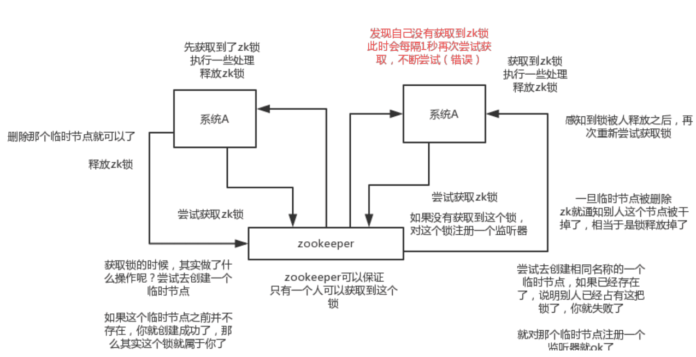

‍

‍

## MongoDB

‍

‍

### API还记得吗

查看数据库列表    show dbs

使用/创建数据库    use mydb

‍

‍

### 架构

mongod 是处理MongoDB系统的主要进程。它处理数据请求，管理数据存储，和执行后台管理操作。当我们运行mongod命令意味着正在启动MongoDB进程,并且在后台运行。

文档 一组key value组成。文档是动态模式,这意味着同一集合里的文档不需要有相同的字段和结构。在关系型数据库中table中的每一条记录相当于MongoDB中的一个文档。

集合 一组 MongoDB 文档。它相当于关系型数据库（RDBMS）中的表这种概念。集合位于单独的一个数据库中。一个集合内的多个文档可以有多个不同的字段。一般来说，集合中的文档都有着相同或相关的目的。

‍

‍

### 优势

* 架构简单, 没有复杂的连接
* 深度查询能力,MongoDB支持动态查询
* 容易调试, 扩展
* 不需要转化/映射应用对象到数据库对象
* 使用内部内存作为存储工作区,以便更快的存取数据

‍

面向文档的存储：文档存储以BSON格式(有大小限制，最大16M), 内置GridFS文件系统(一般存储大于16M的文件)。

* 任何属性都可以建立索引。
* 复制以及高可扩展性。
* 自动分片。
* 丰富的查询功能。
* 快速的即时更新。

‍

‍

## Hadoop

‍

‍

‍

‍

## Zookeeper

Zookeeper是基于Google Chubby论文的开源实现，它主要是用来解决分布式应用中经常遇到的一些数据管理问题，如：统一命名服务、状态同步服务、集群管理、配置管理 等等。  
由于Hadoop生态系统中很多项目都依赖于zookeeper，如Pig，Hive等， 似乎很像一个动物园管理员，于是取名为Zookeeper

‍

### zookeeper提供了什么？

1. 文件系统
2. 通知机制

‍

文件系统

zookeeper提供一个类似unix文件系统目录的多层级节点命名空间（节点称为znode）。与文件系统不同的是，这些节点都可以设置关联的数据，而文件系统中只有文件节点可以存放数据而目录节点不行。zookeeper为了保证高吞吐和低延迟，在内存中维护了这个树状的目录结构，这种特性使得zookeeper不能用于存放大量的数据，每个节点的存放数据上限为1M。

‍

‍

### 四种类型的znode

* PERSISTENT                持久化节点
* PERSISTENT\_SEQUENTIAL     顺序自动编号持久化节点，这种节点会根据当前已存在的节点数自动加 1
* EPHEMERAL                 临时节点， 客户端session超时这类节点就会被自动删除
* EPHEMERAL\_SEQUENTIAL      临时自动编号节点

‍

‍

### zookeeper通知机制

client端会对某个znode建立一个watcher事件，当该znode发生变化时，zk会主动通知watch这个znode的client，然后client根据znode的变化来做出业务上的改变等

‍

#### watcher的特点：

* 轻量级：一个callback函数。
* 异步性：不会block正常的读写请求。
* 主动推送：Watch被触发时，由Zookeeper服务端主动将更新推送给客户端。
* 一次性：数据变化时，Watch只会被触发一次。如果客户端想得到后续更新的通知，必须要在 Watch 被触发后重新注册一个 Watch。
* 仅通知：仅通知变更类型，不附带变更后的结果。
* 顺序性：如果多个更新触发了多个Watch，那 Watch 被触发的顺序与更新顺序一致。

‍

#### 使用watch的注意事项：

* 由于watcher是一次性的，所以需要自己去实现永久watch
* 如果被watch的节点频繁更新，会出现“丢数据”的情况
* watcher数量过多会导致性能下降

‍

‍

### 配置管理

程序分布式的部署在不同的机器上，将程序的配置信息放在zk的znode下，当有配置发生改变时，也就是znode发生变化时，可以通过改变zk中某个目录节点的内容，利用watcher通知给各个客户端，从而更改配置。

‍

### 集群管理

所谓集群管理无在乎两点：是否有机器退出和加入、选举master

对于第一点，所有机器约定在父目录下创建临时目录节点，然后监听父目录节点的子节点变化消息。一旦有机器挂掉，该机器与 zookeeper的连接断开，

其所创建的临时目录节点被删除，所有其他机器都收到通知：某个兄弟目录被删除，于是，所有人都知道：它上船了。

新机器加入也是类似，所有机器收到通知：新兄弟目录加入，highcount又有了，对于第二点，我们稍微改变一下，所有机器创建临时顺序编号目录节点，每次选取编号最小的机器作为master就好。

‍

‍

‍

### 说说Zookeeper的使用场景

分布式锁这个东西，很常用的，java系统开发，分布式系统，可能会有一些场景会用到。

最常用的分布式锁就是zookeeper来做分布式锁。

其实说实话，问这个问题，一般就是看看你是否了解zk，因为zk是分布式系统中很常见的一个基础系统。而且问的话常问的就是说zk的使用场景是什么？看你知道不知道一些基本的使用场景。但是其实zk挖深了自然是可以问的很深很深的。

‍

‍

#### 分布式协调

这个其实是zk很经典的一个用法，简单来说，就好比，你A系统发送个请求到mq，然后B消息消费之后处理了。那A系统如何知道B系统的处理结果？用zk就可以实现分布式系统之间的协调工作。A系统发送请求之后可以在zk上对某个节点的值注册个监听器，一旦B系统处理完了就修改zk那个节点的值，A立马就可以收到通知，完美解决。

‍

#### 分布式锁

对某一个数据连续发出两个修改操作，两台机器同时收到了请求，但是只能一台机器先执行另外一个机器再执行。那么此时就可以使用zk分布式锁，一个机器接收到了请求之后先获取zk上的一把分布式锁，就是可以去创建一个znode，接着执行操作；然后另外一个机器也尝试去创建那个znode，结果发现自己创建不了，因为被别人创建了。。。。那只能等着，等第一个机器执行完了自己再执行。

‍

#### 元数据/配置信息管理

zk可以用作很多系统的配置信息的管理，比如kafka、storm等等很多分布式系统都会选用zk来做一些元数据、配置信息的管理，包括dubbo注册中心不也支持zk

‍

‍

#### HA高可用性

这个应该是很常见的，比如hadoop、hdfs、yarn等很多大数据系统，都选择基于zk来开发HA高可用机制，就是一个重要进程一般会做主备两个，主进程挂了立马通过zk感知到切换到备用

‍

‍

### ZK实现分布式锁

zk分布式锁，其实可以做的比较简单，就是某个节点尝试创建临时znode，此时创建成功了就获取了这个锁；这个时候别的客户端来创建锁会失败，只能注册个监听器监听这个锁。释放锁就是删除这个znode，一旦释放掉就会通知客户端，然后有一个等待着的客户端就可以再次重新加锁。

‍

‍

ZK实现分布式锁，就是不需要执行轮询算法，而是注册监听器，但有人释放锁的时候，会通知需要获取锁的进程。

同时ZK获取锁的时候，其实就是创建了一个临时节点，如果这个临时节点之前不存在，那么就创建成功，也就是说这个锁就是属于该线程的。

同时其它的线程会尝试创建相同名称的一个临时节点，如果已经存在，说明别人已经占有了这把锁，那么就创建失败。

一旦临时节点被删除，zk就通知别人这个锁已经被释放掉了，相当于锁被释放掉了。

假设这个时候，持有锁的服务器宕机了，那么Zookeeper会自动将该锁给释放掉。

‍

‍

对比Redis分布式锁

> redis分布式锁，其实需要自己**不断去尝试获取锁**，比较消耗性能
>
> zk分布式锁，获取不到锁，注册个**监听器**即可，不需要不断主动尝试获取锁，性能开销较小
>
> 另外一点就是，如果是redis获取锁的那个客户端bug了或者挂了，那么只能等待超时时间之后才能释放锁；而zk的话，因为创建的是临时znode，只要客户端挂了，znode就没了，此时就自动释放锁
>
> redis分布式锁大家每发现好麻烦吗？遍历上锁，计算时间等等。。。zk的分布式锁语义清晰实现简单
>
> 所以先不分析太多的东西，就说这两点，我个人实践认为zk的分布式锁比redis的分布式锁牢靠、而且模型简单易用
