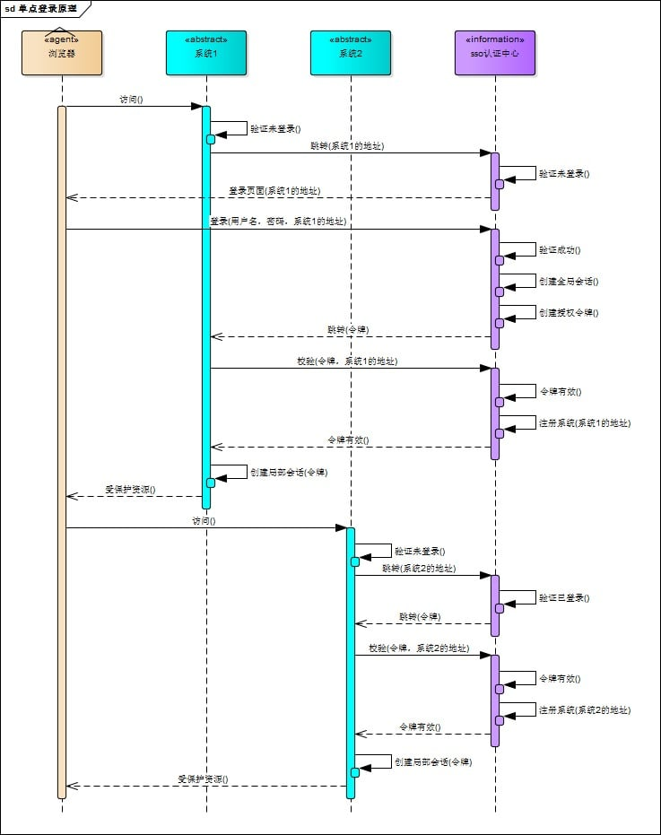
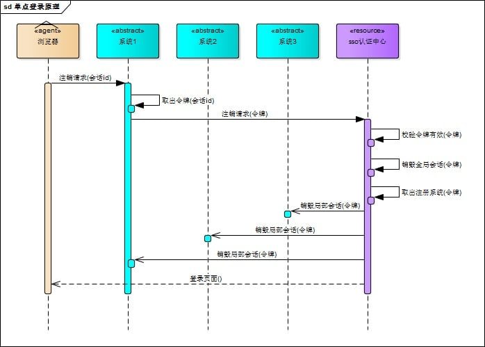

‍

‍

‍

## 产品相关

‍

### 软件质量的六个特征

软件质量的六个特征，通常是指在评估软件质量时所依据的六个关键维度。它们是：

1. **功能性（Functionality）** ：指软件能够按照需求规范正确执行预期功能的程度。软件需要满足业务需求和用户期望，提供合适的功能。
2. **可靠性（Reliability）** ：指软件在特定环境下、特定时间内持续正常运行的能力。软件的可靠性包括其在面对错误或意外情况时的容错能力。
3. **易用性（Usability）** ：指软件的用户界面是否友好，用户能否方便快捷地操作软件。易用性包括界面设计、交互性和易学性等方面。
4. **效率（Efficiency）** ：指软件在资源消耗方面的表现，如响应时间、处理速度以及系统资源（如内存、CPU）的利用效率。效率越高，软件运行的速度和性能越好。
5. **可维护性（Maintainability）** ：指软件在后续修改、扩展、修复和优化时的难易程度。高可维护性的系统便于开发人员进行维护，降低长期使用的成本。
6. **可移植性（Portability）** ：指软件能够在不同平台上运行的能力。软件的可移植性越强，意味着它可以适应不同的硬件、操作系统和环境。

‍

‍

### 软件的评审一般由哪些人参加？

‍

1. **开发人员**：

    * 负责提供软件的实现、设计文档或代码，参与评审并提供技术支持。
2. **测试人员**：

    * 负责从测试角度审查软件，确保设计和代码中没有遗漏的测试点，并发现潜在的缺陷。
3. **项目经理**：

    * 负责协调评审过程，确保评审的顺利进行，评估项目的进度和风险，并提出管理方面的建议。
4. **需求人员（或产品经理）** ：

    * 提供需求文档并确保评审过程中软件的设计与实现符合需求，验证软件是否满足用户需求。
5. **架构师/技术专家**：

    * 参与评审软件的架构设计，评估系统的整体结构、技术选择和可扩展性，确保技术方案合理。
6. **质量保证人员**：

    * 从质量控制角度参与评审，确保软件开发过程中遵循了合适的质量标准和规范。
7. **文档人员（可选）** ：

    * 在文档评审中，负责确保文档的完整性、准确性和清晰度，确保文档能够清楚地传达开发和测试过程

‍

‍

### 简述软件开发过程与角色分工

软件开发过程通常包括以下几个阶段，每个阶段都有不同的角色分工：

1. **需求分析阶段**：

    * 主要任务是明确系统的功能需求和非功能需求，确定软件的目标和范围。
    * **角色分工**：

      * **产品经理**：负责与客户沟通，收集需求并形成需求文档。
      * **业务分析师**：负责详细分析需求，确保业务需求被正确理解和转化为技术需求。
      * **项目经理**：负责整个项目的规划和进度控制，确保需求收集和分析按时完成。
2. **设计阶段**：

    * 在需求分析的基础上，进行系统架构设计和详细设计，确定软件的技术栈和系统结构。
    * **角色分工**：

      * **架构师**：负责系统的整体架构设计，确保系统的扩展性、性能和安全性。
      * **UI/UX设计师**：负责设计用户界面，确保系统易用且符合用户体验需求。
      * **开发人员**：根据需求和设计文档进行初步的技术选型和开发准备。
3. **编码阶段**：

    * 开发人员根据设计文档开始编码，完成系统的功能模块开发。
    * **角色分工**：

      * **开发人员**：负责编写代码，实现系统功能。
      * **前端开发人员**：负责开发用户界面和用户交互逻辑。
      * **后端开发人员**：负责开发服务器端逻辑和数据库设计。
      * **数据库管理员**：负责数据库设计和优化，确保数据库的高效和稳定运行。
4. **测试阶段**：

    * 在编码完成后，进行软件测试，确保软件功能正确并符合需求，且没有重大缺陷。
    * **角色分工**：

      * **测试工程师**：负责设计和执行测试用例，验证软件功能和性能是否符合预期。
      * **QA经理**：负责测试计划和进度管理，确保测试活动按计划进行。
      * **开发人员**：可能会参与修复开发过程中发现的缺陷。
5. **部署与维护阶段**：

    * 软件开发完成后，进行部署，并持续对软件进行维护和更新，修复缺陷，添加新功能。
    * **角色分工**：

      * **运维人员**：负责软件的部署、配置和监控，确保系统的稳定性。
      * **开发人员**：根据用户反馈和需求变化，进行功能更新和bug修复。
      * **技术支持人员**：帮助用户解决使用中的问题，提供技术支持和培训。

‍

‍

### 需求评审的目的和意义是什么

需求评审是指在软件开发过程中，团队对需求文档进行审查和讨论的活动，其目的是确保需求的准确性、完整性和可行性。需求评审的主要目的是：

1. **确保需求的正确性**：通过评审，确保需求文档中描述的功能和特性符合客户和业务的实际需求，避免后期出现需求偏差。
2. **发现潜在问题**：在需求评审阶段，团队成员可以发现并讨论需求中的模糊、不完整或不一致的地方，避免这些问题影响后续开发。
3. **确保需求的可测试性**：通过评审，确保需求描述明确，测试团队能够根据需求编写清晰的测试用例。
4. **明确需求优先级**：帮助项目团队明确不同需求的优先级，为后续的开发和资源分配提供依据。
5. **促进团队沟通**：需求评审有助于开发、测试、产品等不同角色之间的沟通，确保各方对需求的理解一致。

‍

‍

### 需求不明确，通过哪些方式解决？

1. **与客户或业务人员沟通**：直接与客户、业务人员或产品经理进行讨论，明确需求的具体细节。通过面对面的交流或会议，获取更多信息，确保双方理解一致。
2. **需求梳理和分析**：将现有的需求进行整理、分类和分析，找出模糊或不清晰的部分。通过文档或图表的方式将需求细化，提出问题并反馈给相关方。
3. **创建原型或流程图**：通过制作原型、流程图或界面设计，帮助客户和团队更清楚地理解需求。这种可视化方式能帮助澄清需求中的细节，减少误解。
4. **需求分解**：将大而复杂的需求拆解为小的、可操作的模块，逐步明确每个模块的功能和特性，确保需求清晰、具体。
5. **用例分析**：根据实际场景或用户需求，进行用例分析，描述不同的操作流程和系统行为，帮助明确需求。
6. **采用敏捷开发方法**：如果需求不明确，可以采用迭代式开发，通过不断的迭代与反馈，在开发过程中逐步明确需求。

‍

‍

‍

### 如何优雅进行版本发布? 介绍下蓝绿发布 和 滚动发布的概念

‍

如何优雅地进行版本发布？

1. **充分测试和预热**：在部署新版本前，确保在测试环境中完成全面验证，同时可以进行缓存预热等操作，降低发布后的风险。
2. **自动化与监控**：配合CI/CD工具自动化部署，并实时监控各节点的运行状态，及时发现并应对问题。
3. **快速回滚机制**：无论采用哪种发布策略，都应设计好回滚方案，例如蓝绿发布只需切换流量，滚动发布则可以暂停更新未完成的节点并快速回滚已更新部分。
4. **流量分配策略**：可以结合金丝雀发布（Canary Release）等策略，先将少量流量导向新版本，待确认稳定后再全量切换。

‍

‍

蓝绿发布和滚动发布都是常见的零停机或低停机的版本升级策略，它们各自有不同的实现思路和优缺点

‍

**蓝绿发布（Blue-Green Deployment）**

> 类似回归和生产的环境

‍

**概念：**

* 蓝绿发布将生产环境分成两套几乎完全相同的系统环境：一套为当前正在运行的“蓝色”环境，另一套为备用的“绿色”环境。
* 当新版本准备好时，先部署到绿色环境中进行全面测试和验证，确保功能正常且性能符合要求。
* 验证无误后，通过切换负载均衡器或路由策略，将生产流量全部从蓝色环境切换到绿色环境。
* 如果新版本出现问题，可以迅速切换回旧的蓝色环境，实现快速回滚。

‍

**优点：**

* **零停机升级**：整个切换过程几乎没有停机时间。
* **快速回滚**：出现问题时只需将流量切回旧环境。
* **风险隔离**：新旧环境完全独立，可以在绿色环境中全面测试新版本。

‍

**缺点：**

* **成本较高**：需要维护两套完整的环境。
* **资源浪费**：备用环境在切换前可能处于空闲状态，资源利用率不高。

‍

‍

**滚动发布（Rolling Deployment）**

**概念：**

* 滚动发布是将新版本逐步部署到集群中的各个节点上，而不是一次性替换所有节点。
* 通常先更新一部分实例（例如1/3或1/5的节点），验证新版本在这些节点上运行正常后，再逐步更新剩余节点，直到全量更新完成。
* 在整个更新过程中，集群内同时存在旧版本和新版本，这就要求新旧版本之间要有良好的兼容性。

‍

**优点：**

* **平滑过渡**：系统在升级过程中始终保持部分实例在正常提供服务。
* **风险分散**：如果新版本存在问题，影响范围只限于部分节点，可以暂停更新或回滚部分实例。
* **无需额外环境**：不需要像蓝绿发布那样维护两套完整的环境。

‍

**缺点：**

* **版本混合问题**：更新过程中，新旧版本并存，可能带来兼容性或状态同步问题。
* **部署时间较长**：逐步更新所有节点所需时间较蓝绿发布可能更长，需要较好的监控和控制策略。

‍

‍

‍

‍

## 系统设计

‍

‍

### 可用性和高可用概念

如何理解高可用？通常用 2 个指标来衡量：

平均故障间隔 MTBF：（Mean Time Between Failure）：表示两次故障的间隔时间，也就是系统正常运行的平均时间，这个时间越长，说明系统稳定性越高。

故障恢复时间 MTTR：（Mean Time To Repair）：表示系统发生故障后恢复的时间，这个值越小，故障对用户的影响越小。

可用性与这两者的关系：可用性（Availability）= MTBF / (MTBF + MTTR) * 100%只有故障的出现间隔越长，故障恢复的越快，整个系统的可用性才会越高

[高可用（High Availability）的定义](https://gw-c.nowcoder.com/api/sparta/jump/link?link=https%3A%2F%2Fzh.wikipedia.org%2Fwiki%2F%25E9%25AB%2598%25E5%258F%25AF%25E7%2594%25A8%25E6%2580%25A7)：（From 维基百科）是 IT 术语，指系统无中断地执行其功能的能力，代表系统的可用性程度，是进行系统设计时的准则之一。服务不可能 100% 可用，因此要提高我们的高可用设计，就要尽最大可能的去增加我们服务的可用性，提高可用性指标。一句话来表述就是：高可用就是让我们的服务在任何情况下都尽最大可能能够对外提供服务。

‍

### 高可用架构设计思想

高可用系统的设计，需要有一套比较科学的工程管理套路，要从产品、开发、运维、基建等全方位去考量和设计，高可用系统的设计思想包括但不限于：

 ● 做好研发规范，系统都是研发人员设计和编码写出来的，因此首先要对研发层面有一个规范和标准

 ● 做好容量规划和评估，主要是让开发人员对系统要抗住的量级有一个基本认知，方便进行合理的架构设计和演进。

 ● 做好服务层面的高可用，主要是负载均衡、弹性扩缩容、异步解耦、故障容错、过载保护等。

 ● 做好存储层面的高可用，主要是冗余备份（热备、冷备）、失效转移（确认，转移，恢复）等。

 ● 做好运维层面的高可用，主要是发布测试、监控告警、容灾、故障演练等。

 ● 做好产品层面的高可用，主要是兜底策略。

 ● 做好应急预案，主要是在出现问题后怎么快速恢复，不至于让我们的异常事态扩大。

‍

‍

### 高性能架构设计

高性能和高并发，听着就有点类似，并且他们还经常一起提及，比如提高我们的并发性能，显然，高性能可以提高我们的并发，但是细化来看，他们是有区别的，他们的考量点的维度不同。

高性能需要我们从单机维度到整体维度去考虑，更多的是先从编码角度、架构使用角度去让我们的**单机**（单实例）有更好的性能，然后再从整个系统层面来拥有更好的性能；高并发则直接是**全局角度**来让我们的系统在全链路下都能够抗住更多的并发请求。

‍

高性能架构设计主要集中在单机优化、服务集群优化、编码优化三方面。但架构层面的设计是高性能的基础，如果架构层面的设计没有做到高性能，仅依靠优化编码，对整体系统的提升是有限的。我们从一个全局角度来看高性能的系统设计，需要整体考虑的包括如下几个层面

‍

1. 前端层面: 交互, 响应, 提示, CDN加速等等
2. 编码实现层面：批量处理(减少调用次数)、代码逻辑的分层、分模块、协程、资源复用（对象池，线程池等）、异步、IO 多路复用（异步非阻塞）、并发、无锁设计、设计模式等。
3. 单机架构设计层面：IO 多路复用、Reactor 和 Proactor 架构模式
4. 系统架构设计层面：架构分层、业务分模块、集群（集中式、分布式）、缓存（多级缓存、本地缓存）、消息队列（异步、削峰）
5. 基础建设层面：机房、机器、资源分配
6. 运维部署层面：容器化部署、弹性伸缩
7. 性能测试优化层面：性能压测、性能分析、性能优化

‍

‍

‍

‍

‍

### 秒杀系统综合设计

‍

#### 业务上适当规避

1. 根据某些规则对部分用户直接返回没抢到。比如有些用户曾经被系统识别为恶意用户、垃圾用户、僵尸用户，直接告诉用户已经抢完
2. (我的主管说的), 直接按照手机尾号的数字规律, 取目标生成率的对应的尾号概率, 只让这部分人去进行操作, 其他的全部走. 随机数实际上不会对大伙都生效, 只有特定手机尾号的家伙才能进来.
3. 分散不同客户端打开活动入口的时间。比如将 1 秒内的流量分散到 10 秒

‍

#### 技术上硬核抗压

1. 限流策略。比如在压力测试中我们测到系统 QPS 达到了极限，那么超过的部分直接返回已经抢完，通过 Nginx 的 lua 脚本可以查 redis 看到 QPS 数据从而可以动态调节
2. 异步削峰。对 Redis 中的红包预减数量，立即返回抢红包成功请用户等待，然后把发送消息发给消息队列，进行流量的第二次削峰，让后台服务慢慢处理
3. 服务逻辑。比如业务逻辑是使用事务控制对数据库的创建订单记录，减库存的操作，那么创建操作要放到减库存操作之前，从而避免减数量 update 的行锁持有时间
4. 机器配置。当然是服务器机器配置越高越好，数据库配置越猛越好，高并发抢红包主要是 CPU 与网络 IO 的负载较高，要选择偏向 CPU 与网络 IO 性能的机器

‍

‍

#### 架构和实现细节

* 前端模块（页面静态化、CDN、客户端缓存）
* 排队模块（Redis、队列实现异步下单）
* 服务模块（事务处理业务逻辑、避免并发问题）
* 防刷模块（验证码、限制用户频繁访问）

‍

‍

#### 模块解析

‍

##### 前端模块

1. 页面静态化，将后台渲染模板的方式改成使用 HTML 文件与 AJAX 异步请求的方式，减少服务端渲染开销，同时将秒杀页面提前放到 CDN
2. 客户端缓存，配置 Cache-Control 来让客户端缓存一定时间页面，提升用户体验
3. 静态资源优化，CSS/JS/图片压缩，提升用户体验

‍

##### 排队模块

1. 对 Redis 中的抢购对象预减库存，然后立即返回抢购成功请用户等待，这里利用了 Redis 将大部分请求拦截住，少部分流量进入下一阶段
2. 如果参与秒杀的商品太多，进入下一阶段的流量依然比较大，则需要使用消息队列，Redis 过滤之后的请求直接放入到消息队列，让消息队列进行流量的第二次削峰

‍

##### 服务模块

1. 消息队列的消费者，业务逻辑是使用事务控制对数据库的下订单，减库存操作，且下订单操作要放到减库存操作之前，可以避免减库存 update 的行锁持有时间

‍

##### 防刷模块

1. 针对恶意用户写脚本去刷，在 Redis 中保存用户 IP 与商品 ID 进行限制
2. 针对普通用户疯狂的点击，使用 JS 控制抢购按钮，每几秒才能点击一次
3. 在后台生成数学计算型的验证码，使用 Graphics、BufferedImage 实现图片，ScriptEngineManager 计算表达式

‍

##### 异常流程的处理

1. 如果在秒杀的过程中由于服务崩溃导致秒杀活动中断，那么没有好的办法，只能立即尝试恢复崩溃服务或者申请另寻时间重新进行秒杀活动
2. 如果在下订单的过程中由于用户的某些限制导致下单失败，那么应该回滚事务，立即告诉用户失败原因

‍

‍

#### 总结

‍

##### 原则

业务优化思路：业务上适当规避  
技术优化思路：尽量将请求拦截在数据库的上游，因为一旦大量请求进入数据库，性能会急剧下降  
架构原则：合适、简单、演化（以上内容是最终版本，初版可以说没有用到队列，直接使用缓存-数据库这样的架构）

‍

##### 难点

1. 如何将高并发大流量一步步从业务和技术方面有条不紊地应对过来
2. 如何在代码中处理好异常情况以及应急预案的准备

‍

##### 坑

1. 以上的解决方案能通过利用 Redis 与消息队列集群来承载非常高的并发量，但是运维成本高。比如 Redis 与消息队列都必须用到集群才能保证稳定性，会导致运维成本太高。所以需要有专业的运维团队维护。
2. 避免同一用户同时下多个订单，需要写好业务逻辑或在订单表中加上**用户 ID 与商品 ID 的唯一索引**；避免超卖问题，在更新数量的 sql 上需要加上>0 条件 (CAS)

‍

##### 优化

1. 将 7 层负载均衡 Nginx 与 4 层负载均衡 LVS 一起使用进一步提高并发量
2. 以上是应用架构上的优化，在部署的 Redis、消息队列、数据库、虚拟机偏向选择带宽与硬盘读写速度高的
3. 提前预热，将最新的静态资源同步更新到 CDN 的所有节点上，在 Redis 中提前加载好需要售卖的产品信息
4. 使用分布式限流减少 Redis 访问压力，在 Nginx 中配置并发连接数与速度限制

‍

‍

### 设计一个高并发系统

‍

假设你在某知名电商公司干过高并发系统，用户上亿，一天流量几十亿，高峰期并发量上万，甚至是十万。那么人家一定会仔细盘问你的系统架构

你们系统啥架构？怎么部署的？部署了多少台机器？缓存咋用的？MQ咋用的？数据库咋用的？

‍

因为真正干过高并发的人一定知道，**脱离了业务的系统架构**都是在纸上谈兵，真正在复杂业务场景而且还高并发的时候，那系统架构一定不是那么简单的，用个redis，用mq就能搞定？当然不是，真实的系统架构搭配上业务之后，会比这种简单的所谓“高并发架构”要复杂很多倍。

‍

> 系统熔断、降级、限流

‍

其实所谓的高并发，如果你要理解这个问题呢，其实就得从高并发的根源出发，为啥会有高并发？

‍

刚开始系统都是连接数据库的，但是要知道数据库支撑到每秒并发两三千的时候，基本就快完了。所以才有说，很多公司，刚开始干的时候，技术比较low，结果业务发展太快，有的时候系统扛不住压力就挂了。

‍

* ==系统拆分==，将一个系统拆分为多个子系统，用dubbo来搞。然后**每个系统连一个数据库**，这样本来就一个库，现在多个数据库，不也可以抗高并发么。
* ==缓存，必须得用缓存==。大部分的高并发场景，都是**读多写少**，那你完全可以在数据库和缓存里都写一份，然后读的时候大量走缓存不就得了。毕竟人家redis轻轻松松单机几万的并发啊。没问题的。所以你可以考虑考虑你的项目里，那些承载主要请求的读场景，怎么用缓存来抗高并发。
* ==MQ，必须得用MQ==。可能你还是会出现**高并发写**的场景. 用redis来承载写那肯定不行，人家是缓存，数据随时就被LRU了，数据格式还无比简单，没有事务支持。所以该用mysql还得用mysql啊。

  用MQ吧，大量的写请求灌入MQ里，排队慢慢玩儿，后边系统消费后慢慢写，控制在mysql承载范围之内。所以你得考虑考虑你的项目里，那些承载复杂写业务逻辑的场景里，如何用MQ来异步写，提升并发性。MQ单机抗几万并发也是ok的，这个之前还特意说过。
* ==分库分表==，可能到了最后**数据库层面**还是免不了抗高并发的要求

  就将一个数据库拆分为多个库，多个库来抗更高的并发；然后将一个表拆分为多个表，每个表的数据量保持少一点，提高sql跑的性能。
* ==读写分离==，这个就是说大部分时候数据库可能也是读多写少，没必要所有请求都集中在一个库上吧，可以搞个主从架构，主库写入，从库读取，搞一个读写分离。读流量太多的时候，还可以加更多的从库。
* ==Elasticsearch==，可以考虑用es。es是**分布式**的，可以随便扩容，分布式天然就可以支撑高并发，因为动不动就可以扩容加机器来抗更高的并发。那么一些比较简单的**查询、统计类**的操作，可以考虑用es来承载，还有一些全文搜索类的操作，也可以考虑用es来承载

‍

‍

### 设计一个秒杀系统

> 这个是完整实现, 具体答Redis也可

‍

‍

#### 难点

最大的问题在于容易产生大并发请求、产生超卖现象和性能问题

‍

1）瞬时大并发：一提到秒杀系统给人最深刻的印象是超大的瞬时并发，这时你可以联想到小米手机的抢购场景，在小米手机抢购的场景一般都会有10w＋的用户同时访问一个商品页面去抢购手机，这就是一个典型的**瞬时大并发**，如果系统没有经过限流或者熔断处理，那么系统瞬间就会崩掉，就好像被DDos攻击一样；

2）超卖：秒杀除了大并发这样的难点，还有一个所有电商都会遇到的痛，那就是超卖，电商搞大促最怕什么？最怕的就是超卖，产生超卖了以后会影响到用户体验，会导致订单系统、库存系统、供应链等等，产生的问题是一系列的连锁反应，所以电商都不希望超卖发生，但是在大并发的场景最容易发生的就是超卖，不同线程读取到的当前库存数据可能下个毫秒就被其他线程修改了，如果没有一定的锁库存机制那么库存数据必然出错，都不用上万并发，几十并发就可以导致商品超卖；

3）性能：当遇到大并发和超卖问题后，必然会引出另一个问题，那就是性能问题，如何保证在大并发请求下，系统能够有好的性能，让用户能够有更好的体验，不然每个用户都等几十秒才能知道结果，那体验必然是很糟糕的；

4）黄牛：你这么低的价格，假如我抢到了，我转手卖掉我不是**血赚**？就算我不卖我也不亏啊，那用户知道，你知道，别的别有用心的人（黑客、黄牛…）肯定也知道的。

那简单啊，我知道你什么时候抢，我搞个几十台机器搞点脚本，我也模拟出来十几万个人左右的请求，那我是不是意味着我基本上有80%的成功率了。

5）F12链接提前暴露, 没做好隐藏

‍

‍

#### 要点

1）对于大秒杀活动，一般运营会配置**静态的活动页面**，配置静态活动页面主要有两个目的一方面是为了便于在各种社交媒体**分发**，另一方面是因为秒杀**活动页的流量**是大促期间最大的，通过配置成静态页面可以将页面发布在公有云上动态的横向扩展；

2）将秒杀活动的静态页面提前刷新到**CDN节点**，通过CDN节点的页面缓存来缓解访问压力和公司网络带宽，CDN上缓存js、css和图片；或者Nginx服务器提供的静态资源功能。

3）将秒杀服务部署在公有云的web server上，使用公有云最大的好处就是能够根据活动的火爆程度**动态扩容**而且成本较低，同时将访问压力隔离在公司系统外部；

4）在提供真正商品秒杀业务功能的app server上，需要进行交易限流、熔断控制，防止因为秒杀交易影响到其他正常服务的提供。

5）服务降级处理，除了上面讲到的限流和熔断控制，我们还设定了**降级开关**，对于首页、购物车、订单查询、大数据等功能都会进行一定程度的服务降级。比如进行秒杀的时候，将订单查询系统进行降级，减少秒杀压力

6）如何防止超卖现象的发生，我们日常的下单过程中防止超卖一般是通过在**数据库上加锁**来实现。但是还是无法满足秒杀的上万并发需求，我们的方案其实也很简单: **实时库存的扣减在缓存中进行**，异步扣减数据库中的库存，保证缓存中和数据库中库存的**最终一致性**。

7）库存预热：那不简单了，我们要开始秒杀前你通过**定时任务**或者运维同学**提前把商品的库存加载到Redis中**去，让整个流程都在Redis里面去做，然后等秒杀介绍了，再异步的去修改库存就好了

8）MQ削峰填谷

‍

你可以把它放消息队列，然后一点点消费去改库存就好了嘛，不过单个商品其实一次修改就够了，我这里说的是**某个点多个商品**一起秒杀的场景，像极了双十一零点。

1. 使用缓存。
2. 页面静态化技术。
3. 数据库优化。
4. 分类数据库中活跃的数据。
5. 批量读取和延迟修改。
6. 读写分离。

‍

‍

‍

‍

### 抢红包系统

总共有10亿个红包，在某个时间一起来抢红包，如何设计

‍

主要考察的是如何设计高并发系统，但实际上存在一定变通处理方式，不一定全在技术上

通常在考虑系统QPS时，应当按业务上的极限QPS作为系统必须承担的QPS设计，比如10亿个红包，因为用户量巨大，极限QPS是可能是10亿

但是一般来说几万QPS已经是比较高的并发了，就需要比较大的集群和高并发架构来处理了，所以不可能真正实现10亿的并发架构，而是通过一些变通的方法来处理，比如在业务上做一些处理规避掉部分流量

但尽可能地需要实现高并发架构，思路是将大部分流量拦截在系统承载能力低的模块之前

---

‍

##### 业务上适当规避

在相应法律法规、规章制度、活动说明、用户体验允许的情况下，可以做以下处理

1. 根据某些规则对部分用户直接返回没抢到。比如有些用户曾经被系统识别为恶意用户、垃圾用户、僵尸用户，直接告诉用户已经抢完
2. 分散不同客户端打开活动入口的时间。比如将1秒内的10亿流量分散到10秒，那么平均每秒只有1亿了
3. 增加客户端入口点击门槛。比如需要手机摇一摇、画一个图案才能触发抢红包的接口

‍

##### 技术上硬核抗压

网关是会接触实打实10亿流量的地方，也是拦截掉最多无效流量的地方，同理，缓存也是

1. 限流策略。比如在压力测试中我们测到系统1亿QPS达到了极限，那么超过的部分直接返回已经抢完，通过Nginx的lua脚本可以查redis看到QPS数据从而可以动态调节
2. 作弊拦截。通过对UA、IP规则直接将抢红包的作弊流量拦截掉
3. 异步削峰。对Redis中的红包预减数量，立即返回抢红包成功请用户等待，然后把发送消息发给消息队列，进行流量的第二次削峰，让后台服务慢慢处理
4. 服务逻辑。比如业务逻辑是使用事务控制对数据库的创建红包记录，减红包数量的操作，那么创建操作要放到减数量操作之前，从而避免减数量update的行锁持有时间
5. 机器配置。当然是服务器机器配置约高越好，数据库配置越猛越好，高并发抢红包主要是CPU的负载较高，要选择偏向CPU性能的机器

‍

‍

#### 设计一个抢红包系统的实现

**拆包算法**

* **随机发红包**：每个人可以获取的红包金额等于[0.01,99.91)的左闭右开区间；最后一个人不用随机了。缺点是生成的过程不均匀。
* **线性切割法**：把总金额类比成一根绳子，对绳子切N-1刀，每个人能抢道的红包金额等于切割绳子的占比。
* **二倍均值法**：每次抢到的红包 \= 随机区间(0，M/N \* 2)，M是总金额，N是红包个数，任何一个人抢到的红包都不会大于人均的二倍。比如100个人抢五个红包，第一个人抢到的红包金额为(0.01，100/5\*2)，第二个人抢到红包的金额为(0.01，80/4\*2)，最后符合金额正态分布，在20左右。
* ‍

‍

首先使用户和前端页面进行交互，网关微服务做主机鉴权，看看用户有没有登录认证。如果没有用户认证的话需要到用户认证微服务到用户微服务中查询用户，注册或者登陆成功之后跳转到聊天室，对应聊天室微服务。

用户微服务、用户认证微服务和聊天室微服务是面向用户。用户微服务对应着图片微服务和账户微服务，分别存储用户信息和提供账户管理功能。聊天室微服务可以发红包和存储历史消息。

外部依赖redis缓存、Nacos注册中心和Seata-Server。

‍

**发、抢红包流程**

调用发红包的API，先检查用户余额是否大于红包金额，如果用户的余额大于红包的金额的话，将一条红包记录保存到数据库里，更新账户余额并且用红包生成算法将红包放入redis。

抢红包的时候要判断红包个数是否大于0，大于0就更新redis的缓存并且插入一条抢红包记录，再把相应的红包入账。抢红包入账是异步实现的，采用消息队列，红包入库系统可以监听MQ，如果信道上有消息就更新账户并且将记录保存到数据库。引入MQ可以实现实现高并发、高可用、高可扩展。

首先将个人红包记录入库，红包个数和红包金额扣减，用户金额增加，成功就返回ACK，失败就返回失败ACK。

‍

**高并发问题**

* **超卖**：不同用户在读请求时候发现商品库存足够然后同时发起请求，进行秒杀操作导致库存为负数；同一个用户在有库存的时候连续发出多个请求，两个请求同时存在，于是生成多个订单。不同用户抢红包导致红包为负数或者同一个抢到多个红包。解决办法是分布式锁，可以基于Redis或者zookeeper实现，Redis是NoSQL数据，Zk是分布式协调工具，redis通过设置key有效期防止死锁，zk通过使用会话有效期解决死锁。Redis是NoSQL并且Zk需要创建删除节点，所以Redis效率更好。但是Redis有效期不是很好控制，可能会导致有效期延迟，而ZK临时节点有先天可控的有效期，因此Zk更可靠。小并发选择zk，性能优先选择redis。
* **数据一致性**：发红包之后红包服务要将红包放入数据库，红包服务要调用账户服务更新账户数据库，微服务之间远程调用要保证数据一致性，然后还要保证事务不失败。为了保证数据一致性，要用到分布式事务。分布式事务方案可以使用seata，seata使用2pc实现。
* **消息可靠性**：调用红包服务，更新redis，然后利用MQ解耦，更新数据库。使用消息队列保证消息可靠性，有ACK确认机制。生产者ACK可以知道消息是否到达消息队列，消费者ACK之后MQ队列能知道消费者有没有正常消费消息。可以使用重试机制或者消息补偿来保证幂等性
* ‍

‍

### 在弱网环境下，如何确保一个http请求发送成功/如何提高http连接成功率？

‍

#### 问题

丢包、错包、乱包。

**高延迟**：响应数据回来时间长，甚至大于客户端等待时间

**带宽小**：每次能够通信的内容较少，**数据包越大受影响可能越大**

**网络断续**：网络经常断开又连接

‍

‍

#### 优化处理

* 采用TCP协议、实现**长连接**，采用长连接池，节省握手时间。
* 采用ProtocolBuffer，**减少冗余数据。**
* 弃用DNS，直接使用IP，减少了请求DNS服务查询IP的时间，避免被DNS劫持。
* 加入**重试机制**，提供成功率。
* 使用Http 2.0，**压缩头部**、长连接更加彻底、支持推送、支持(Multiplexing：支持一个TCP连接上同时实现多个请求和响应)。
* 超时时间设置可以适当延长(限制放宽一点)。
* 使用https：https对于http 主要在前面的握手阶段次数多，因为增大了丢包的概率。https 因为过程中，server端会把ssl证书公钥给客户端，证书很大，可能会引起分包，也有概率把次数变得更多。可以把reve buffer都尽量根据证书调整到正确的大小。
* 交互次数上：提供一个预热的接口(pre https，pre httpdns)，后面保持长连接和心跳，后面真正的业务上来的时候就会体验好一些。交互内容大小：可以预先把证书下载到客户端(定期刷新)，安全和效率的一个平衡。
* **断线重连**。这可能是最重的一个特性，因为在无线网络中有太多的原因导致数据连接中断了。这里可以使用CDN。(CDN 是构建在数据网络上的一种分布式的内容分发网。 CDN 的作用是采用流媒体服务器集群技术，克服单机系统输出带宽及并发能力不足的缺点，可极大提升系统支持的并发流数目，减少或避免单点失效带来的不良影响。)
* 由于创建连接是一个非常昂贵的操作，所以应尽量**减少数据连接的创建次数**，且在一次请求中应尽量以批量的方式执行任务。如果多次发送小数据包，应该尽量保证在2秒以内发送出去。在短时间内访问不同服务器时，尽可能地**复用无线连接**。
* **控制数据包大小不超过1500，避免分片**。包括逻辑链路控制(Logic Link Control)分片、GGSN分片，以及IP分片。其中，当数据包大小超出GGSN所允许的最大大小时，GGSN的处理方式有以下三种：分片、丢弃和拒绝。
* **优化TCP socket参数**，包括：是否关闭快速回收、初始RTO、初始拥塞窗口、socket缓存大小、Delay-ACK、Selective-ACK、TCP\_CORK、拥塞算法(westwood/TLP/cubic)等。做这件事情的意义在于：由于2G/3G/4G/WIFI/公司内网等接入网络的QoS差异很大，所以不同网络下为了取得较好的服务质量，上述参数的取值差异可能会很大。
* 前后端采用gzip方式请求和响应，前端在请求header添加：“content-encoding” 为 “gzip”，后端也要开启gzip，才能生效，相比不采用gzip的请求方式，能节省流量，可以快速响应

‍

### app如何精准校时(客户端的时间如何与服务端的时间进行较准?)

服务器端永远使用UTC时间，包括参数和返回值，不要使用Date格式，而是使用UTC时间1970年1月1日的差值，即long类型的长整数。

APP端将服务器返回的long型时间转换为GMT8时区的时间，额外加上8小时，这样就保证了无论使用者在哪个时区，他们看到的时间都是同一个时间，也就是GMT8的时间。

APP本地时间会不准，可以使用**HTTP Response头的Date属性**，每次调用服务器接口时就取出HTTP Response头的Date值，转换为GMT时间，再减去本地取出的时间，得到一个差值d，将这个差值d保存下来。每次获取本地时间的时候，额外加上这个差值d，就得到了服务器的GMT8时间，就保证了任何人看见的时间都是一样的。

‍

‍

### 如何计算游戏客户端与服务器之间的时间延迟？

‍

要计算客户端与服务器之间的时间延迟，我们可以采用以下方法：

1. 首先，客户端记录当前本地时间TA1，并向服务器发送一条报文。
2. 服务器收到报文后，记录自己的本地时间TB，并将TB放入报文中回发给客户端。
3. 客户端收到回复后，记录收到报文的时间TA2。

假设报文往返的时间基本相等，那么客户端到服务器的时间延迟P \= (TA2 - TA1) / 2。通常，单次计算的延迟不够精确，可以让客户端定时发送测量信息，然后计算P的平均值。

‍

为了获取客户端和服务器的本地时间差，我们可以通过以下公式计算：

1. 假设客户端和服务器的本地时钟相同（实际情况并非如此），则TB \= TA1 + P。
2. 将上述延迟P代入公式，整理后得到TB \= (TA1 + TA2) / 2。
3. 由于客户端和服务器之间存在实际时间差X，我们可以得到TB + X \= (TA1 + TA2) / 2。
4. 整理后得到X \= (TA1 + TA2) / 2 - TB，即客户端和服务器的本地时间差。

‍

### 10w定时任务，如何高效触发超时？

‍

#### 环形队列法

m秒超时，就创建一个index从0到m的**环形队列**(本质是个数组)，环上每一个slot是一个set，存储uid，任务集合

同时还有一个Map，key是uid，value是index，记录uid落在环上的哪个slot里。

* 启动一个timer，每隔1s，在上述环形队列中移动一格，0-\>1-\>2-\>3…-\>29-\>30-\>0…
* 有一个Current Index指针来标识刚检测过的slot

‍

**当有某用户uid有请求包到达时**：

* 从Map结构中，查找出这个uid存储在哪一个slot里
* 从这个slot的Set结构中，删除这个uid
* 将uid重新加入到新的slot中，具体是哪一个slot呢 \=\> Current Index指针所指向的**上一个**slot，因为这个slot，会被timer在30s之后扫描到
* 更新Map，这个uid对应slot的index值

‍

> 哪些元素会被超时掉:
>
> Current Index每秒种移动一个slot，这个slot对应的Set中所有uid都应该被集体超时。如果最近30s有请求包来到，一定被放到Current Index的前一个slot了，Current Index所在的slot对应Set中所有元素，都是最近30s没有请求包来到的。
>
> 所以，当没有超时时，Current Index扫到的每一个slot的Set中应该都没有元素。

‍

优点是：

* 只需要1个timer
* timer每1s只需要一次触发，消耗CPU很低
* 批量超时，Current Index扫到的slot，Set中所有元素都应该被超时掉

这个环形队列法是一个通用的方法，Set和Map中可以是任何task，本文的uid是一个最简单的举例。

‍

‍

#### 轮询扫描法

* 用一个Map\<uid, last\_packet\_time\>来记录每一个uid最近一次请求时间last\_packet\_time
* 当某个用户uid有请求包来到，实时更新这个Map
* 启动一个timer，当Map中不为空时，轮询扫描这个Map，看每个uid的last\_packet\_time是否超过30s，如果超过则进行超时处理

‍

‍

#### 多timer触发法

* 用一个Map\<uid, last\_packet\_time\>来记录每一个uid最近一次请求时间last\_packet\_time
* 当某个用户uid有请求包来到，实时更新这个Map，并同时对这个uid请求包启动一个timer，30s之后触发
* 每个uid请求包对应的timer触发后，看Map中，查看这个uid的last\_packet\_time是否超过30s，如果超过则进行超时处理

‍

‍

‍

### 如何实现单点登录？

指在多系统应用群中登录一个系统，便可在其他所有系统中得到授权而无需再次登录，包括单点登录与单点注销两部分。

‍

#### 登陆

相比于单系统登录，sso需要一个独立的认证中心，只有认证中心能接受用户的用户名密码等安全信息，其他系统不提供登录入口，只接受认证中心的间接授权。间接授权通过令牌实现，sso认证中心验证用户的用户名密码没问题，创建授权令牌，在接下来的跳转过程中，授权令牌作为参数发送给各个子系统，子系统拿到令牌，即得到了授权，可以借此创建局部会话，局部会话登录方式与单系统的登录方式相同。这个过程，也就是单点登录的原理，用下图说明：

‍



‍

下面对上图简要描述：

1. 用户访问系统1的受保护资源，系统1发现用户未登录，跳转至sso认证中心，并将自己的地址作为参数；
2. sso认证中心发现用户未登录，将用户引导至登录页面；
3. 用户输入用户名密码提交登录申请；
4. sso认证中心校验用户信息，创建用户与sso认证中心之间的会话，称为全局会话，同时创建授权令牌；
5. sso认证中心带着令牌跳转会最初的请求地址(系统1)；
6. 系统1拿到令牌，去sso认证中心校验令牌是否有效；
7. sso认证中心校验令牌，返回有效，注册系统1；
8. 系统1使用该令牌创建与用户的会话，称为局部会话，返回受保护资源；
9. 用户访问系统2的受保护资源；
10. 系统2发现用户未登录，跳转至sso认证中心，并将自己的地址作为参数；
11. sso认证中心发现用户已登录，跳转回系统2的地址，并附上令牌；
12. 系统2拿到令牌，去sso认证中心校验令牌是否有效；
13. sso认证中心校验令牌，返回有效，注册系统2；
14. 系统2使用该令牌创建与用户的局部会话，返回受保护资源。

用户登录成功之后，会与sso认证中心及各个子系统建立会话，用户与sso认证中心建立的会话称为全局会话，用户与各个子系统建立的会话称为局部会话，局部会话建立之后，用户访问子系统受保护资源将不再通过sso认证中心，全局会话与局部会话有如下约束关系：

* 局部会话存在，全局会话一定存在；
* 全局会话存在，局部会话不一定存在；
* 全局会话销毁，局部会话必须销毁。

‍

#### **注销**

单点登录自然也要单点注销，在一个子系统中注销，所有子系统的会话都将被销毁，用下面的图来说明：

‍



‍

sso认证中心一直监听全局会话的状态，一旦全局会话销毁，监听器将通知所有注册系统执行注销操作。下面对上图简要说明：

1. 用户向系统1发起注销请求；
2. 系统1根据用户与系统1建立的会话id拿到令牌，向sso认证中心发起注销请求；
3. sso认证中心校验令牌有效，销毁全局会话，同时取出所有用此令牌注册的系统地址；
4. sso认证中心向所有注册系统发起注销请求；
5. 各注册系统接收sso认证中心的注销请求，销毁局部会话；
6. sso认证中心引导用户至登录页面。

‍

#### **部署**

单点登录涉及sso认证中心与众子系统，子系统与sso认证中心需要通信以交换令牌、校验令牌及发起注销请求，因而子系统必须集成sso的客户端，sso认证中心则是sso服务端，整个单点登录过程实质是sso客户端与服务端通信的过程

sso认证中心与sso客户端通信方式有多种，这里以简单好用的httpClient为例，web service、rpc、restful api都可以

‍

‍

## 高并发

‍

‍

### 秒杀逻辑的主要技术挑战是什么？

‍

秒杀系统的主要技术挑战主要包括：

* **处理超高并发：**  保证系统在瞬时压力下不崩溃。
* **流量限流与防刷机制：**  保护后端服务，避免钓鱼、恶意刷单。
* **库存异常控制：**  避免多线程并发下出现库存超卖或扣减不准确的问题。
* **分布式事务管理：**  保证跨服务、跨模块的数据一致性与正确性。
* **缓存设计问题：**  谨防缓存穿透、击穿和雪崩现象。
* **系统资源的高效利用：**  利用多线程、消息队列、分布式架构等手段降低单点压力。

通过合理设计架构（包括缓存、分布式锁、消息队列、异步处理、服务拆分与降级补偿等机制），才能在有限资源的条件下，有效应对秒杀逻辑中这些严峻的技术挑战。

‍

#### 1. 超高并发请求处理

‍

**挑战：**

* 短时间内可能有成千上万甚至上百万请求同时涌入，瞬间造成系统压力暴增。
* 后端服务、数据库、缓存等各层组件都需要稳定地应对突发流量，否则容易造成宕机或严重延迟。

‍

**应对策略：**

* **前端限流与预热：**  利用 CDN、WAF 或 API 网关进行初步限流，提前预估流量并进行压力测试。
* **分布式负载均衡：**  采用多级负载均衡器，将请求分散到不同实例上，防止单点瓶颈。
* **异步消息队列：**  将秒杀请求通过消息队列进行异步处理，削峰填谷，实现流量削减。
* **多级缓存：**  利用 Redis 缓存热点数据，避免直接对数据库进行频繁写操作，从而分担压力。

‍

‍

#### 2. 库存精准控制和防止超卖

**挑战：**

* 秒杀商品库存有限，各个请求可能并发更新库存，若处理不当，极易出现超卖或库存不一致问题。
* 分布式环境下，保证多个节点/进程之间对库存数据的同步和一致更具挑战性。

‍

**应对策略：**

* **分布式锁：**  利用 Redis、ZooKeeper 等实现分布式锁，防止并发写库存数据时发生竞争（注意锁的粒度和性能消耗）。
* **乐观锁与库存预扣减：**  使用数据库乐观锁（Version 校验）或原子性的缓存操作（如 Redis 的 Lua 脚本）确保库存扣减操作的原子性。
* **消息队列与异步扣减：**  秒杀成功后先将请求写入消息队列，再异步处理库存扣减和订单创建，降低直接并发对库存数据的冲击。

‍

‍

#### 3. 分布式事务和数据一致性

**挑战：**

* 秒杀场景往往涉及订单创建、库存更新、支付等多个模块，分布在不同服务和数据库中，如何在高并发下保证数据最终一致，是一个难题。
* 如果采用传统的分布式事务（如两阶段提交），系统性能会大幅下降。

‍

**应对策略：**

* **最终一致性设计：**  通过基于事件驱动的方式，实现异步消息传递和补偿机制，允许数据在短时间内不完全一致，但保证最终一致。
* **Saga 模式**：采用 Saga 设计模式，将全局事务拆分为一系列局部事务，并通过补偿逻辑来处理部分失败问题。
* **幂等性保障：**  对每个接口设计幂等性操作，确保多次请求或补偿过程中不会重复扣减库存或重复下单。

‍

‍

#### 4. 缓存穿透、缓存击穿和缓存雪崩

**挑战：**

* 高并发场景下，热点商品请求可能会直接打数据库；若瞬间失效，则会出现大量请求直达数据库，产生缓存击穿或雪崩效应。

‍

**应对策略：**

* **热点缓存预热：**  秒杀开始前，将热点数据提前加载到缓存中。
* **降级策略与互斥锁：**  为防止缓存失效瞬间大量请求同时打数据库，可以使用互斥锁控制查询，或采用降级返回等方式保护后端系统。
* **数据熔断：**  设置合理的过期策略，对异常或突然大量的缓存访问做熔断处理。

‍

‍

#### 5. 多线程与系统资源管理

**挑战：**

* 处理高并发请求时，要在有限的 CPU 和内存资源下，通过多线程或多进程并发处理大量请求，必须合理控制线程数量，防止资源耗尽和上下文切换开销过大。

‍

**应对策略：**

* **合理配置线程池：**  根据硬件能力设置合适的线程池参数，并利用异步非阻塞 IO 处理请求。
* **分布式架构：**  将秒杀业务拆分到多个节点上，通过分片等方式均摊压力，同时采用灰度发布、自动扩缩容等机制动态应对流量波动。

‍

‍

#### 6. 安全性和防刷机制

**挑战：**

* 秒杀活动往往存在被恶意刷单、机器人攻击等风险，必须设计防护措施防止恶意流量破坏系统稳定性。

‍

**应对策略：**

* **验证码、图形验证、短信验证等**：在用户请求过程中增加挑战机制，确保请求由真实用户发起。
* **IP 黑名单与行为分析**：实时监控异常流量，禁止恶意 IP 或异常请求。
* **请求签名与 Token 校验**：确保每个请求有效且合法，避免暴露秒杀入口导致大量刷单。

‍

‍

### 如果同时有很多人扫罚款模块的支付码，安全问题怎么解决。

可以的方案

1. **使用HTTPS等好的通信手段**：确保所有的支付请求都通过HTTPS进行传输，防止数据在传输过程中被窃取或篡改。
2. **支付令牌**：每次生成唯一的支付令牌（token），并且令牌只能使用一次，防止重复支付。(合适, 直接用token就行)
3. **限流**：对支付请求进行限流，防止恶意请求导致系统过载。(必须)
4. **身份验证**：在支付前进行用户身份验证，确保支付请求是由合法用户发起的。(必须)
5. **日志记录**：记录所有支付请求的日志，便于后续审计和追踪。(托底)

‍

‍

‍

‍

#### 现有一批邮件需要发送给订阅顾客，且有一个集群（集群的节点数不定，会动态扩容缩容）来负责具体的邮件发送任务，如何让系统尽快地完成发送？

‍

A. 借助消息中间件，通过发布者订阅者模式来进行任务分配  
B. master-slave 部署，由 master 来分配任务  
C. 不借助任何中间件，且所有节点均等。通过数据库的 update-returning，从而实现节点之间任务的互斥

‍

‍

‍

### 解决高并发秒杀的超卖问题

‍

**由秒杀引发的一个问题**

* 秒杀最大的一个问题就是解决超卖的问题。**其中一种解决超卖如下方式：**

```text
1 update goods set num = num - 1 WHERE id = 1001 and num > 0
```

我们假设现在商品只剩下一件了，此时数据库中 **num =**  **1；**

但有100个线程同时读取到了这个 **num =**  **1**，所以100个线程都开始减库存了。

但你会最终会发觉，**其实只有一个线程减库存成功，其他99个线程全部失败。**

---

**这就是MySQL中的排他锁起了作用。**

排他锁又称为写锁，简称X锁，顾名思义，排他锁就是不能与其他所并存，**如一个事务获取了一个数据行的排他锁，其他事务就不能再获取该行的其他锁**，包括共享锁和排他锁，但是获取排他锁的事务是可以对数据就行读取和修改。

‍

就是类似于我在执行update操作的时候，这一行是一个事务 **(默认加了排他锁**)。**这一行不能被任何其他线程修改和读写**

‍

* **第二种解决超卖的方式如下**

```text
1 select version from goods WHERE id= 1001
2 update goods set num = num - 1, version = version + 1 WHERE id= 1001 AND num > 0 AND version = @version(上面查到的version);
```

这种方式采用了**版本号**的方式，其实也就是**CAS**的原理。

假设此时version = 100， num = 1; 100个线程进入到了这里，同时他们select出来版本号都是version = 100。

然后直接update的时候，只有其中一个先update了，同时更新了版本号。

那么其他99个在更新的时候，会发觉version并不等于上次select的version，就说明version被其他线程修改过了。那么我就放弃这次update

‍

* **第三种解决超卖的方式如下**

利用redis的单线程预减库存。比如商品有100件。那么我在redis存储一个k,v。例如 <gs1001, 100>

每一个用户线程进来，key值就减1，等减到0的时候，全部拒绝剩下的请求。

那么也就是只有100个线程会进入到后续操作。所以一定不会出现超卖的现象

‍

* 总结

可见第二种CAS是失败重试，并无加锁。比第一种加锁效率要高很多。**类似于Java中的Synchronize和CAS**

‍

‍

‍

‍

‍

### 高并发、高可用问题 常用处理

‍

#### 高并发

Key

‍

1. 寻找性能瓶颈
2. 分治思想. 进行业务拆分，流程拆分
3. 扩容
4. 限流
5. 分流. 例如cdn 缓存
6. 流量清洗 waf
7. 多级缓存设计. 后端缓存，客户端缓存
8. 日志溯源
9. 资源隔离
10. 弹性扩缩容
11. 降级处理 前后端 兜底数据

‍

‍

#### 高可用

1. 容器化管理 HA
2. keepalived

‍

‍

### 如果你的平台用户量突然暴涨几十倍, 有哪些方案去应对流量激增

* **横向扩展**

  * **负载均衡**：在前端部署负载均衡器（如Nginx、HAProxy），将请求分发到多台服务器。
  * **多节点部署**：将应用部署在多台服务器上，采用集群或云平台自动扩容。
* **缓存优化**

  * **静态资源缓存**：使用 CDN 缓存静态资源，减轻后端压力。
  * **数据缓存**：将热点数据放入 Redis 或内存中，加速响应。
* **限流与降级**

  * **限流**：对接口或资源实施流量控制，防止单个服务过载；
  * **降级处理**：在高压情况下，牺牲部分非关键业务或数据精度，保证核心业务稳定运行。
* **异步处理和消息队列**

  * **异步处理**：利用消息队列（如Kafka、RabbitMQ）将请求异步化，缓解瞬时高并发带来的压力。
  * **后台任务**：将部分耗时操作拆分为后台任务，非实时处理。
* **数据库优化**

  * **读写分离、分库分表**：缓解数据库压力，提升并发访问能力。
  * **缓存数据库热点**：将热点数据提前缓存，减少数据库查询次数。

‍

‍

### 一个群有1000个人，1000个人同时发消息，会发生消息风暴，如何处理呢

针对这种情况，可以采取以下措施：

* **消息队列削峰填谷**：引入消息队列（如Kafka），将用户发送的消息先存入消息队列。消息队列可以在高并发时缓存大量消息，避免后端处理系统因瞬间高流量而崩溃。后端系统按照一定的速率从消息队列中获取消息进行处理，实现削峰填谷的效果。
* **缓存热门消息**：使用缓存（如Redis）存储热门消息，当有新消息进来时，先判断是否为热门话题相关消息。如果是，优先从缓存中获取最新的消息状态，减少对数据库的读写压力。同时，定期将缓存中的消息持久化到数据库，保证数据的一致性。
* **负载均衡**：部署多个消息处理服务器，通过负载均衡器（如Nginx）将用户发送的消息请求分发到不同的服务器上进行处理，提高系统的并发处理能力。负载均衡器可以根据服务器的负载情况、响应时间等因素，动态地分配请求，确保每个服务器都能高效地处理消息。
* **限流策略**：对每个用户的消息发送频率进行限制，例如限制每个用户每秒最多发送一定数量的消息。可以使用令牌桶算法或漏桶算法来实现限流，当用户发送消息的频率超过限制时，返回提示信息告知用户稍后再发，避免单个用户发送过多消息导致消息风暴。

‍

‍

## 海量数据

‍

### **分批处理大数据**

* **问题**：如何分批处理数据？
* 回答：一开始`COUNT`​总的条数，然后使用`LIMIT`​和`OFFSET`​进行分批查询。每个线程处理一个固定范围的数据，若范围内无数据则停止。
* 追问：若多线程分批查询过程中有数据插入或者删除，则数据缺漏，如何解决问题？
* 回答：维护事务。
* 追问：多线程共享事务存在问题，不合适，有其他方式吗？
* 回答：上锁，但是效率低下;
* 正解: 使用一种基于唯一标识符（如主键）的方案, 每个家伙都从变量中获取下一步要处理的对象范围, 然后自己去处理.

‍

### **百万量级的数据排序：**

* **任意大小**：外排序，先将数据拆分到多个文件中，分别加载到内存中排序，然后再归并到一个文件里。实际上就是 [LeetCode 23. 合并 k 个有序链表](mweblib://15783856405435)，需要用到最小堆
* 范围为 [0, 10000]：**计数排序**

计数排序是一种适用于数据范围有限的排序算法。它通过计数每个元素出现的次数，然后根据计数结果将元素按顺序输出。

‍

计数排序实现

1. **创建计数数组**：大小为 `10001`​，用于记录每个元素出现的次数。
2. **计数元素**：遍历输入数组，记录每个元素的出现次数。
3. **输出排序结果**：根据计数数组输出排序后的结果。

‍

1. **计数数组**：`int[] count = new int[max + 1];`​ 创建一个大小为 `10001`​ 的计数数组。
2. **计数过程**：`for (int num : arr) { count[num]++; }`​ 遍历输入数组，记录每个元素的出现次数。
3. **输出排序结果**：`for (int i = 0; i <= max; i++) { while (count[i] > 0) { arr[index++] = i; count[i]--; } }`​ 根据计数数组输出排序后的结果。

‍

### **百万量级的数据查询在不在**

可以使用位图，前提是数据范围不超过内存大小。

位图（Bitmap）是一种高效的数据结构，用于表示大量的布尔值。对于百万量级的数据查询，可以使用位图来快速判断某个数据是否存在。以下是一个简单的 Java 实现，假设数据范围在 `[0, 1000000]`​ 之间。

‍

位图实现

1. **创建位图数组**：大小为 `1000001`​，每个元素表示一个布尔值。
2. **设置位图**：将存在的数据对应的位图位置设置为 `true`​。
3. **查询数据**：检查位图对应位置的值来判断数据是否存在。

```java
public class Bitmap {
    private boolean[] bitmap;

    public Bitmap(int size) {
        bitmap = new boolean[size];
    }

    // 设置位图
    public void set(int num) {
        bitmap[num] = true;
    }

    // 查询数据是否存在
    public boolean get(int num) {
        return bitmap[num];
    }

    public static void main(String[] args) {
        int size = 1000001;
        Bitmap bitmap = new Bitmap(size);

        // 示例数据
        int[] data = {5, 3, 2, 6, 8, 1, 0, 9, 7, 4};

        // 设置位图
        for (int num : data) {
            bitmap.set(num);
        }

        // 查询数据
        int query = 6;
        if (bitmap.get(query)) {
            System.out.println(query + " 存在");
        } else {
            System.out.println(query + " 不存在");
        }
    }
}
```

‍

1. **位图数组**：`private boolean[] bitmap;`​ 创建一个布尔数组表示位图。
2. **设置位图**：`public void set(int num) { bitmap[num] = true; }`​ 将存在的数据对应的位图位置设置为 `true`​。
3. **查询数据**：`public boolean get(int num) { return bitmap[num]; }`​ 检查位图对应位置的值来判断数据是否存在。

‍

‍

‍

‍

### **百万量级的数据求 TopK**：

数据流的 TopK 问题，维护一个大小为 k 的小根堆，然后分片读入数据，并更新堆。

‍

题目

假如有一个1G大小的文件，文件里每一行是一个词，每个词的大小不超过16byte，要求返回出现频率最高的100个词。内存大小限制是10M

‍

#### 解法一

这种解法的主要思路如下：

1. 采用分治的思想，进行哈希取余
2. 使用HashMap统计每个小文件单词出现的次数
3. 使用小顶堆，遍历步骤2中的小文件，找出词频top100的单词

‍

由于内存限制，我们无法直接将大文件的所有词一次性读到内存中。

可以采用分治策略，把一个大文件分解成多个小文件，保证每个文件的大小小于10M，进而直接将单个小文件读取到内存中进行处理。

第一步，首先遍历大文件，对遍历到的每个词x，执行 hash(x) % 500，将结果为i的词存放到文件f(i)中，遍历结束后，可以得到500个小文件，每个小文件的大小为2M左右；

第二步，接着统计每个小文件中出现频数最高的100个词。可以使用HashMap来实现，其中key为词，value为该词出现的频率。

对于遍历到的词x，如果在map中不存在，则执行 map.put(x, 1)。

若存在，则执行 map.put(x, map.get(x)+1)，将该词出现的次数加1。

第三步，在第二步中找出了每个文件出现频率最高的100个词之后，通过维护一个小顶堆来找出所有小文件中出现频率最高的100个词。

具体方法是，遍历第一个文件，把第一个文件中出现频率最高的100个词构建成一个小顶堆。

如果第一个文件中词的个数小于100，可以继续遍历第二个文件，直到构建好有100个结点的小顶堆为止。

继续遍历其他小文件，如果遍历到的词的出现次数大于堆顶上词的出现次数，可以用新遍历到的词替换堆顶的词，然后重新调整这个堆为小顶堆。

当遍历完所有小文件后，这个小顶堆中的词就是出现频率最高的100个词。

但是很容易可以发现问题，在第二步中，如果这个1G的大文件中有某个词词频过高，可能导致小文件大小超过10m。这种情况下该怎么处理呢？

接下来看另外一种解法

‍

‍

#### 解法二

第一步：使用多路归并排序对大文件进行排序，这样相同的单词肯定是紧挨着的

‍

多路归并排序对大文件进行排序的步骤如下：

① 将文件按照顺序切分成大小不超过2m的小文件，总共500个小文件

② 使用10MB内存分别对 500 个小文件中的单词进行排序

③ 使用一个大小为500大小的堆，对500个小文件进行多路排序，结果写到一个大文件中

‍

其中第三步，对500个小文件进行多路排序的思路如下：

* 初始化一个最小堆，大小就是有序小文件的个数500。堆中的每个节点存放每个有序小文件对应的输入流。
* 按照每个有序文件中的下一行数据对所有文件输入流进行排序，单词小的输入文件流放在堆顶。
* 拿出堆顶的输入流，并其下一行数据写入到最终排序的文件中，如果拿出来的输入流中还有数据的话，那么将这个输入流再一次添加到栈中。否则说明该文件输入流中没有数据了，那么可以关闭这个流。
* 循环这个过程，直到所有文件输入流都没有数据为止。

‍

第二步：

① 初始化一个100个节点的小顶堆，用于保存100个出现频率最多的单词

② 遍历整个文件，一个单词一个单词的从文件中取出来，并计数

③ 等到遍历的单词和上一个单词不同的话，那么上一个单词及其频率如果大于堆顶的词的频率，那么放在堆中，否则不放

最终，小顶堆中就是出现频率前100的单词了。

解法2相对解法1，更加严谨，如果某个词词频过高或者整个文件都是同一个词的话，解法1不适用。

‍

‍

### **海量数据，统计只出现一次的数字**：

(1) 位图法

如果题目给定数据大小范围是 0～10000，那么只需要申请一个 10000 比特的空间。即使是将所有的 int 整数表示出来，也只需要 `2^32`​ bit 空间，大约 512MB，这个空间并不大。

‍

(2) Hash 分治法

如果**数据量过大**，也可以先使用 hash 函数，将所有整数映射到 N 个文件中；然后在每个文件中使用 bitmap 或者 HashMap 去重，最后归并所有文件中只出现一次的结果。

因为使用了 hash 函数，可以保证相同的数字必定会分到同一个文件中。

‍

‍

### 亿级数据找最大的100个, 你能使用最聪明的方法吗? 假设你的内存和CPU资源都是有限的, 请考虑多线程和外部排序的方案

‍

下面介绍一种兼顾多线程与有限内存情况下寻找亿级数据中最大的 100 个数的高效方法。这里提供两个思路，但一般来说，针对 Top-K 问题，用 **流式算法结合局部计算与全局合并** 会更加高效，而不是对全量数据做完整外部排序。

‍

#### 方案概览

‍

‍

##### 方法一：多线程分块局部 Top-K + 全局合并

1. **分块读取数据**

    将亿级数据分块，每个块可以放入内存单独处理。比如，每个块读取一次磁盘数据，这样避免一次性加载整个数据到内存。

    如果数据存储在磁盘文件中，可以按文件块分割，每个块大小不超过内存容量。
2. **局部 Top-K 计算（每块的处理线程）**    

    对每个数据块，启动一个线程或使用线程池中的任务。在每个任务中利用**固定大小为 100 的最小堆**（Min Heap）来维护该块中最大的 100 个元素。

    * 如果当前堆中元素个数未满 100，直接插入
    * 如果堆已满，则比较当前数据与堆顶（最小元素），若大于堆顶则将堆顶替换，并重新堆化

    这样，每个线程结束后都能输出该数据块的局部 Top-100

    > 最好是无序的(就是怎么刷洗好想很难搞
    >
3. **全局合并**   

    将所有线程计算出的局部 Top-100 合并。假设用 M 个块处理后得到 M 个大小不超过 100 的候选列表，总候选数不超过 M×100，通常这个数远小于亿级数据，可以一次性加载到内存。   再次利用最小堆算法对这些候选数据进行合并，得到全局 Top-100。

> **优势：**
>
> * 每个线程只维持一个小（固定大小）的内存堆，内存利用率极低
> * 多线程可以并行处理不同块，加快整体扫描的速度
> * 全局合并阶段候选数据量较少，合并效率高

‍

‍

##### 方法二：外部排序（适用于通用排序需求）

1. **分块排序后写入磁盘**   将数据按块读入内存，对每个块排序后写入临时文件。
2. **多路归并排序**   对所有有序块进行归并排序，最后只关注合并后结果的末尾（最大的 100 个），而不必一次归并出全部数据。

> 此方法适合要求整体排序的场景。但如果仅关注 Top-K，那么完整外部排序开销过大，不如前述方法更高效

‍

‍

#### 算法实现细节

下面以方法一为例，给出伪代码示例（Java 风格）：

‍

```java

public class TopKFinder {

    // 定义局部线程任务，针对单个数据块寻找 Top-K
    public static List<Integer> findLocalTopK(List<Integer> dataChunk, int k) {

        PriorityQueue<Integer> minHeap = new PriorityQueue<>(k); // 小根堆
        for (Integer num : dataChunk) {
            if (minHeap.size() < k) {
                minHeap.add(num);
            } else if (num > minHeap.peek()) {
                minHeap.poll();
                minHeap.add(num);
            }
        }
        return new ArrayList<>(minHeap);
    }
    
    // 多线程并发处理，合并局部结果得到全局 Top-K
    public static List<Integer> findGlobalTopK(Iterator<List<Integer>> localResults, int k) {
        PriorityQueue<Integer> globalHeap = new PriorityQueue<>(k);
        while (localResults.hasNext()) {
            for (Integer num : localResults.next()) {
                if (globalHeap.size() < k) {
                    globalHeap.add(num);
                } else if (num > globalHeap.peek()) {
                    globalHeap.poll();
                    globalHeap.add(num);
                }
            }
        }
        // 结果输出，可按降序排序
        List<Integer> result = new ArrayList<>(globalHeap);
        result.sort(Comparator.reverseOrder());
        return result;
    }
    
    public static List<Integer> findTopKFromLargeDataset(File dataFile, int k, int chunkSize) throws Exception {
        // 使用线程池并发读文件并处理数据块
        ExecutorService executor = Executors.newFixedThreadPool(Runtime.getRuntime().availableProcessors());
        List<Future<List<Integer>>> futures = new ArrayList<>();

        try (BufferedReader br = new BufferedReader(new FileReader(dataFile))) {
            List<Integer> chunk = new ArrayList<>(chunkSize);
            String line;
            while ((line = br.readLine()) != null) {
                chunk.add(Integer.valueOf(line.trim()));
                if (chunk.size() >= chunkSize) {
                    final List<Integer> currentChunk = new ArrayList<>(chunk);
                    futures.add(executor.submit(() -> findLocalTopK(currentChunk, k)));
                    chunk.clear();
                }
            }
            // 处理最后剩余不够一个chunk的数据
            if (!chunk.isEmpty()) {
                futures.add(executor.submit(() -> findLocalTopK(chunk, k)));
            }
        }
        
        // 等待所有结果，并融合局部结果
        List<List<Integer>> localResults = new ArrayList<>();
        for (Future<List<Integer>> future : futures) {
            localResults.add(future.get());
        }
        executor.shutdown();
        
        return findGlobalTopK(localResults.iterator(), k);
    }
    
    public static void main(String[] args) throws Exception {
        // 假设 data.txt 存储亿级数据，每行一个整数
        File dataFile = new File("data.txt");
        int k = 100;
        int chunkSize = 100_000; // 根据内存情况调整大小
        List<Integer> topK = findTopKFromLargeDataset(dataFile, k, chunkSize);
        System.out.println("Top " + k + " numbers: " + topK);
    }
}
```

‍

> **说明：**
>
> * **分块读取**：每读取到一个数据块（如 100,000 个数字）就交给线程池处理
> * **局部 Top-K**：每个线程使用小根堆实现局部 Top-K，效率高且内存开销小
> * **全局合并**：将局部结果再合并一次，最终得到全局 Top-100。

‍

‍

‍

#### 多线程与外部排序的综合考量

* **多线程处理数据块**：充分利用多核 CPU，加快 IO 和计算效率。注意线程安全和线程池的合理配置，避免过多线程导致上下文切换开销。
* **内存有限**：每个线程仅保存局部固定大小的堆；外部存储用于缓存分块数据可以有效降低内存占用。
* **外部排序方案**：如果要求整体数据排序以便支持更多功能（例如全局范围查找其它统计），可以使用外部排序法。若仅是找 Top-K，局部 Top-K + 合并最为高效。
* **I/O 考量**：在处理磁盘数据时，可以结合异步 I/O 或增加缓冲区大小来优化磁盘读写速度。

‍

‍

#### ASCII 流程图

‍

```plaintext
  ┌─────────────────────┐
  │   大数据文件/流       │
  └─────────┬────────── ┘
            │
    （分块读取/分片）
            │
   ┌────────┴─────────┐
   │  数据块 1         │
   │  数据块 2         │  ... (并发处理)
   │  ...             │
   └────────┬─────────┘
            │
  ┌─────────┴─────────┐
  │ 各线程局部 Top-100  │
  └─────────┬─────────┘
            │
  ┌─────────┴─────────┐
  │   全局合并（小根堆） │
  └─────────┬─────────┘
            │
  ┌─────────┴─────────┐
  │   得到最终 Top 100 │
  └───────────────────┘
```

‍

‍

#### 总结

在有限内存和 CPU 条件下，亿级数据中找最大的 100 个最聪明的方法是利用**流式扫描结合局部 Top-K 算法**：

‍

* **多线程并发**：多个数据块并行处理，利用每个线程维护小根堆计算局部 Top-K；
* **全局合并**：将所有局部候选集合并为全局 Top-K；
* 如若需要整体排序，可实施外部排序方案，但对于 Top-K 问题来说，上述方案更加节省内存和 I/O 资源。

‍

这种方法既充分利用了 CPU 多核优势，又保证了内存的低占用，是应对海量数据高效查找 Top-K 的一种最优解。如果你对其它数据流处理或更多细节有兴趣，我们可以进一步探讨如何利用 Spark、Flink 等分布式处理框架进行大规模实时 Top-K 的计算

‍

‍

### 海量日志数据，提取出某日访问百度次数最多的那个IP？

首先是找到这一天的日志，并且是访问百度的IP从日志中提取出来逐个写入大文件中，如果IP是32位的，最多可能有2\^32次方种结果。

采用映射的方法，比如%1000，把大文件依次映射成1000个小文件，找出每个小文件中出现频率最多的IP，可以使用hashMap统计频率，依次找出每个文件中出现频率最大IP，一共1000个。然后在1000个IP中找出频率最大即为所求，可以使用归并或者小顶堆。

‍

### 寻找热门查询中，1000万个查询字符串中最热门的10个查询？要求内存使用不超过1G，每个查询串长度都是1\~255字节?

1000万个字符串肯定会有重复，假设不重复字段大约300万，3M \* 1K/4 \= 0.75G，可以在内存中全部装下，因此采用hashTable，key位字符串，value位为出现的次数，每次读取一个串，如果串在hashTable中就将统计频率加1，否则将value置为1。然后维护一个堆，保存10个元素，找出TopK，遍历300个串的value分别与根元素进行比较，最终时间复杂度为O(N)+M\*O(logK)，N为1000万，M为300万，K为堆大小10。

‍

### 有一个1G大小的一个文件，里面每一行是一个词，词的大小不超过16字节，内存限制大小是1M。返回频数最高的100个词？

顺序读取文件，对于每个词采用hash%5000，映射到(x0,x1,……,x4999)，每个文件大约200KB，如果有文件大小超过1K就继续分治，直到所有文件大小都小于1M。对于每个小文件采用hashMap或者前缀树统计相应的词和频率。取出现频率最大的100个词，存入文件可以得到5000个文件，最后把5000个文件进行归并排序。

‍

‍

### 有10个文件，每个文件1G，每个文件的每一行存放的都是用户的查询，每个文件的查询都可能重复。要求你按照查询的频度排序？

顺序读取10个文件，按照hash(query)%10的结果写入10个文件中，生成的新文件大小也是1G。找一个内存是2G的机器，依次对用hashMap(query, query\_count)来统计每个query出现的次数。然后将排序好的query和count存储到文件中，得到10个已经排序的文件，最后对10个文件进行归并排序。

‍

### 给定a、b两个文件，各存放50亿个url，每个url各占64字节，内存限制是4G，让你找出a、b文件共同的url？

50亿个URL每个URL是64字节，一共占用320亿字节，内存4G装不下，所以采用分治的思想。先遍历a文件，对于每个hash(URL)%1000，分别将1000个URL存储到1000个小文件里面，记为a1、a2、……、a1000，每个文件大约就是300M，遍历文件b采取同样的方法。因为使用的是相同的哈希算法，所以相同的URL在对应文件对里面，这样就会有1000对小文件。不对应的小文件不可能有相同的URL。

然后对每对URL，先把一个文件的URL存储到hashSet中，遍历另一个小文件的每个URL，看是否在hashSet，如果有相同的URL存储到文件就行。

如果允许一定错误率，可以使用布隆过滤器，4亿内存可以保存340亿bit。用一个布隆过滤器映射340亿bit，然后读取另一个文件的URL，检查是否在布隆过滤器里面，快速判断URL是否存在。

‍

### 5亿个int找到它的中位数？

**bitmap**：可以把int划分为2\^16个区域，然后读取数据落在各个区域的个数，在统计结构中判断中位数落在哪个位置，同时对这个区域操作，知道第几大的是中位数。数据量过大可以进行两次划分，先将int64放入2\^24个区域内，确定是第几区域大的数，将该区域划分为2\^20个子区域，确定是子区域第几大的数字，直接进行统计。

**快排**：内存足够的情况可以使⽤用类似quick sort的思想进行，均摊复杂度为O(n)：随机选取一个元素，将比它小的元素放在它左边，比它大的元素放在右边；如果它恰好在中位数的位置，那么它就是中位数，可以直接返回；如果小于它的数超过一半，那么中位数一定在左半边，递归到左边处理；否则中位数一定在右半边，根据左半边的元素个数计算出中位数是右半边的第几大，然后递归到右半边处理。

‍

‍

‍

‍

## 项目工作相关

‍

‍

### 说一下项目在跟第三方系统对接时如何保证数据安全

(万信金融)

万信金融平台要和第三方系统（银行存管系统）进行交互，为了验证消息发送者的身份，确保其他人无  
法伪造身份所以需要对传输数据要进行签名和验签。有两个基本要求：

1. 所有请求和返回报文都包含签名，接收方务必检查签名的正确性，以保证业务数据合法安全。
2. 签名使用标准签名算法”SHA1withRSA”。

‍

交互流程：

1. 在系统开始交互之前，万信金融平台和银行存管系统要交换各自系统的公钥
2. A端用自己的私钥对传输内容msg签名，B端使用A端的公钥验签
3. B端用自己的私钥对出传输内容msg签名，A端使用B端的公钥验签

总之就是非对称加密的思路了, 拿对方公钥, 自己用私钥包了, 对面拿了我的公钥进行解密

‍

‍

‍

‍

### 优化接口调用效率有什么思路？

* **缓存** ：使用缓存减少重复调用，提高响应速度。
* **异步调用** ：使用异步调用减少等待时间，提高并发性能。
* **批量处理** ：将多个请求合并为一个批量请求，减少网络开销。
* **负载均衡** ：使用负载均衡分配请求，避免单点瓶颈。
* **超时控制** ：设置合理的超时时间，避免长时间等待。
* **重试机制** ：在请求失败时进行重试，提高成功率。

‍

### 生产问题怎么排查

已经上线的bug排查的思路：

1，先分析日志，通常在业务中都会有日志的记录，或者查看系统日志，或者查看日志文件，然后定位问题

2，远程debug(通常公司的正式环境（生产环境）是不允许远程debug的。一般远程debug都是公司的测试环境，方便调试代码)

**远程debug配置**

前提条件：**远程的代码和本地的代码要保持一致 - 阿尔萨斯出手**

‍

远程代码需要配置启动参数，把项目打包放到服务器后启动项目的参数：

```shell
java -jar -agentlib:jdwp=transport=dt_socket,server=y,suspend=n,address=5005 project-1.0-SNAPSHOT.jar
```

>  **-agentlib:jdwp** 是通知JVM使用(java debug wire protocol)来运行调试环境
>
> **transport=dt_socket** 调试数据的传送方式
>
> **server=y** 参数是指是否支持在server模式
>
> **suspend=n** 是否在调试客户端建立起来后，再执行JVM。
>
> **address=5005** 调试端口设置为5005，其它端口也可以

‍

‍

‍

### 项目中做的最有挑战的事，价值在哪里

谈基础架构, 从0-1的过程, 因为这是我完全独创的底层, 我需要做好长线规划.

正因如此, 我才能说把项目推进到长线, 能够进行开源的底气.

‍

‍

### 你负责项目的时候遇到了哪些比较棘手的问题

这个面试题主要考察的是

* 你是否有过开发经验
* 是否是核心开发人员

有4个方面可以回答，只要挑出一个回答就行了

‍

#### **设计模式**

* 工厂模式+策略
* 责任链模式

> 回答思路
>
> 1，什么背景（技术问题）
>
> 2，过程（解决问题的过程）
>
> 3，最终落地方案

举例：

①：介绍登录业务（一开始没有用设计模式，所有的登录方式都柔和在一个业务类中，不过，发现需求经常改）

②：登录方式经常会增加或更换，每次都要修改业务层代码，所以，经过我的设计，使用了工厂设计模式和策略模式，解决了，经常修改业务层代码的问题

③：详细介绍一下工厂模式和策略模式（参考前面设计模式的课程）

‍

#### **线上BUG**

* CPU飙高
* 内存泄漏
* 线程死锁
* ....

回答方式参考上面的回答思路，具体问题可以参考前面的课程（JVM和多线程相关的面试题）

‍

‍

#### **调优**

* 慢接口
* 慢SQL
* 缓存方案

‍

‍

#### **组件封装**

* 分布式锁
* 接口幂等
* 分布式事务
* 支付通用

‍

‍

### 单点登录这块怎么实现的

单点登录的英文名叫做：Single Sign On（简称**SSO**）, 只需要登录一次，就可以访问所有信任的应用系统. 介绍自己项目中涉及到的单点登录（即使没涉及过，也可以说实现的思路）

‍

解决系统之间Session不共享问题有一下几种方案：

* Tomcat集群Session全局复制（最多支持5台tomcat，不推荐使用）
* JWT(常见)
* Oauth2
* CAS
* 自己实现（redis+token）

‍

‍

使用jwt解决单点登录的流程

* 网关鉴权请求有没有token
* 成功路由到对应服务, 或者放开之后去登陆, 返回并存储token.
* 之后把token写入自前端的存储等
* 之后下单操作就携带这个token进行.
* 网关鉴权token放行

> 介绍单点登录的解决方案，以JWT为例
>
> I. 用户访问其他系统，会在网关判断token是否有效
>
> II. 如果token无效则会返回401（认证失败）前端跳转到登录页面
>
> III. 用户发送登录请求，返回浏览器一个token，浏览器把token保存到cookie
>
> IV. 再去访问其他服务的时候，都需要携带token，由网关统一验证后路由到目标服务

‍

‍

‍

### 分布式Session

单块系统的时候这么玩儿session没问题啊，但是你要是分布式系统了呢，那么多的服务，session状态在哪儿维护啊？

其实方法很多，但是常见常用的是两种

‍

#### tomcat + redis

这个其实还挺方便的，就是使用session的代码跟以前一样，还是基于tomcat原生的session支持即可，然后就是用一个叫做Tomcat RedisSessionManager的东西，让所有我们部署的tomcat都将session数据存储到redis即可。

‍

在tomcat的配置文件中，配置一下

```text
<Valve className="com.orangefunction.tomcat.redissessions.RedisSessionHandlerValve" />

<Manager className="com.orangefunction.tomcat.redissessions.RedisSessionManager"

    host="{redis.host}"

    port="{redis.port}"

    database="{redis.dbnum}"

    maxInactiveInterval="60"/>
```

搞一个类似上面的配置即可，你看是不是就是用了RedisSessionManager，然后指定了redis的host和 port就ok了。

```text
<Valve className="com.orangefunction.tomcat.redissessions.RedisSessionHandlerValve" />

<Manager className="com.orangefunction.tomcat.redissessions.RedisSessionManager"

     sentinelMaster="mymaster"

     sentinels="<sentinel1-ip>:26379,<sentinel2-ip>:26379,<sentinel3-ip>:26379"

     maxInactiveInterval="60"/>
```

还可以用上面这种方式基于redis哨兵支持的redis高可用集群来保存session数据，都是ok的

但我们从Session获取数据，其实tomcat就是会从redis中获取到session了。

但是存在的问题，就是严重依赖于Web容器

‍

‍

#### Spring Session + redis

分布式会话的这个东西重耦合在tomcat中，如果我要将web容器迁移成jetty，难道你重新把jetty都配置一遍吗？

‍

因为上面那种tomcat + redis的方式好用，但是会严重依赖于web容器，不好将代码移植到其他web容器上去，尤其是你要是换了技术栈咋整？比如换成了spring cloud或者是spring boot之类的。还得好好思忖思忖。

‍

所以现在比较好的还是基于java一站式解决方案，spring了。用sping session是一个很好的选择

‍

给sping session配置**基于redis来存储session数据**，然后配置了一个**spring session的过滤器**，这样的话，session相关操作都会交给spring session来管了。接着在代码中，就用原生的session操作，就是直接基于spring sesion从redis中获取数据了。

‍

‍

### 权限认证是如何实现的

‍

‍

#### 概述

后台的管理系统，更注重权限控制，最常见的就是RBAC模型来指导实现权限 (当然用对应物资上面做鉴权是最方便的)

RBAC(Role-Based Access Control)基于角色的访问控制

* 3个基础部分组成：用户、角色、权限
* 具体实现

  * 5张表（用户表、角色表、权限表、用户角色中间表、角色权限中间表）
  * 7张表（用户表、角色表、权限表、菜单表、用户角色中间表、角色权限中间表、权限菜单中间表）

‍

**数据流转**

张三具有什么权限呢？

流程：张三登录系统---> 查询张三拥有的角色列表--->再根据角色查询拥有的权限

‍

在实际的开发中，也会使用权限框架完成权限功能的实现，并且设置多种粒度，常见的框架有：

* Apache shiro
* Spring security（推荐）

‍

#### 回答要点

* 后台管理系统的开发经验
* 介绍RBAC权限模型5张表的关系（用户、角色、权限）
* 权限框架：Spring security

‍

‍

‍

### 项目中怎么保证敏捷开发

目的: 快速迭代, 快速试错, 提高交付效率, -> 目的是快速占领市场

思维: 开发人员要有更多着眼于运维的思路

‍

操作:

* 版本管理

  * 固定完善的发版流程, CICD快速合并到代码仓库等等
* 人员管理

  * 快速入职落地

    > "以往的开发需要新人员能够独自了解这个项目的整体之后, 才能上手 (类似熟悉业务时间)"
    >
    > 现在, 有各种老带新, 还有微服务划分, 导致我们只需要了解几个仓库, 几个方面就可以进行开发了.
    >
  * 任务面板

    > 泳道视图, 站会时候有, 有卡片移动环节
    >
  * 站立会议

    > 站会! 开发 -> 测试 -> 头子
    >
  * 普通职级人员灵活流动 | 团队专家专职沉淀

    > 人员需要根据模块需求进行充分流动, 不能说出现缺人故障; 但是另一方面需要各个组有一个人或者一批人掌握核心东西, 不动的家伙做好沉淀, 来实现老带新 (SA, PM)
    >
* 环境管理

  * 增加集成测试, 回归环境等, 利于多个不同的环境同时在里面跑, 类似于计算机系统里面的流水化指令这样, 原本就一个环境只能存一个需求上线, 现在几个能够存不同的版本的
  * 文档Wiki管理
  * 晨会周会需求拆分会
* 链路追踪(运维)

  * 基于日志 ELK 组件做系统报表
  * 基于MQ 和 前端的组件实现 Flow 流程可视化编排
* 持续集成

  * maven脚本把build指令->shell, Jenkins 等等自动编译, 减少运维成本
* AB发布

  * 蓝绿发布
  * 红黑发布
  * 灰度发布
  * 金丝雀发布

‍
